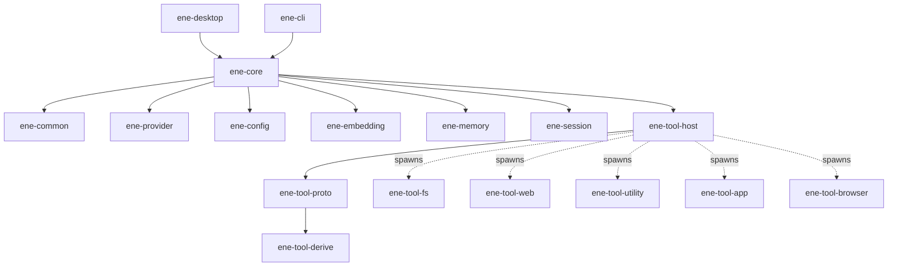
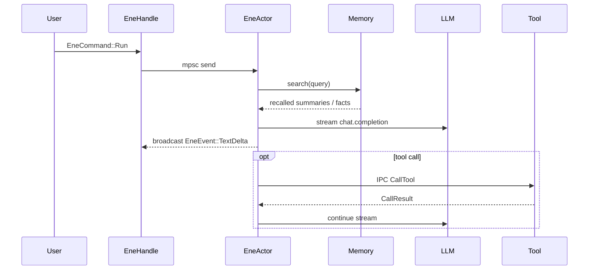

# AGENTS.md — ene

## 0. Purpose & AI Directives

This file is the source of truth for **project-specific conventions** in the `ene` workspace.

**For AI Agents (Crucial Behaviors):**
* **Search First:** Always read the relevant files in `docs/` or `crates/` before proposing large architectural changes.
* **Verify & Complete:** Before declaring a task finished, automatically run `cargo clippy --workspace` and `cargo test --workspace`. Finally, mentally verify the PR Verification Checklist (§10) and confirm all requirements are met.
* **No Hallucinated Fixes:** If a test or build fails, read the compiler errors carefully. Do not blindly guess fixes; ask the user for context if the error is environment-specific.
* **Follow the Recipes:** When asked to add tools, configs, or IPC messages, strictly follow the steps in **§4 Common Tasks**.
* **Handle Hooks Gracefully:** If a git commit fails due to `cargo-husky` pre-commit hooks, read the hook output, fix the formatting or linting errors, and try committing again before resorting to `--no-verify`.

## 1. Where to Look

| You want to… | Go to |
|---|---|
| Set up a dev environment | §3 Platform Setup |
| Add / modify a tool, config, or character | §4 Common Tasks |
| Build, test, or lint | §5 Build / Test / Lint |
| Understand crate layout or architecture | §6 Workspace, §7 Architecture |
| Follow memory system rules (diesel / sqlite-vec) | §7.3 Memory System Rules |
| Match project style or rustdoc rules | §9 Code Style & rustdoc |
| Submit a PR / Git Workflow | §10 Git & PR Policy |

## 2. AGENTS.md vs Skills vs docs/

| Scope | Where it lives |
|---|---|
| **Project-specific conventions** | **AGENTS.md** (this file) |
| **Language-general advice** (Rust, testing) | `.opencode/skills/` (Link to these by name, do not duplicate here) |
| **Design & architecture tutorials** | `docs/` (English) and `docs/ja/` (Japanese) |
| **End-user quickstart** | `README.md` |

## 3. Platform Setup

* **Linux (Recommended):** Uses `direnv` + Nix flake (pins nightly Rust, mold, clang, GTK3, Wayland, Chromium, etc.). Run `direnv allow` followed by `cargo build`.
* **Windows (Community):** Requires Visual Studio Build Tools, Rust nightly, WebView2, and OpenSSL (or `rustls`). IPC uses Windows Named Pipes.
* **macOS (Unsupported):** Do not target macOS in new code. Codebase uses `cfg(unix)` but native deps are not provisioned.

## 4. Common Tasks (Recipes)

### R1. Add a new tool
1. Create: `cargo new --bin tools/<name>`
2. Implement: `#[derive(ene_tool_derive::ToolSpec)]` on args structs.
3. Wire up: `run_tool_server::<MyAction>()` from `ene-tool-proto` in `main`.
4. Document: Add to a category in `docs/tools/` and `docs/ja/tools/`.
5. Verify: `cargo run -p ene-cli` -> `/tool list`.

### R2. Add a config field
1. Edit struct in `crates/ene-config/src/config.rs` (`define_config!` macro).
2. Run `cargo run -p ene-cli` once to auto-regenerate `assets/settings.schema.json` and `character_settings.schema.json`. *(Note: These JSON files are gitignored. Do not commit or hand-edit them).*
3. Document in `docs/configuration/settings.md` (both English and Japanese).

### R3. Add an IPC request/response
1. Extend `IpcRequest` / `IpcResponse` in `crates/ene-tool-proto/src/ipc.rs`.
2. Bump `PROTOCOL_VERSION` **only** if the wire format is incompatible.
3. Handle the variant in `ene-tool-host` and all tool binaries.

## 5. Build / Test / Lint

* **Build:** `cargo build --workspace` (Debug) / `cargo build --workspace --release` (Release)
* **Run:** `cargo run -p ene-cli` (CLI) / `cargo run -p ene-desktop --release` (GUI)
* **Test:** `cargo test --workspace` (Use `#[ignore]` for tests hitting real LLM/APIs; requires `API_TOKEN` in `.env`).
* **Lint & Format:** `cargo clippy --workspace -- -D warnings` / `cargo fmt --all`

## 6. Workspace Layout

* `crates/`: Core libraries (`ene-core`, `ene-memory`, `ene-tool-host`, etc.)
* `tools/`: Standalone tool binaries (`fs`, `web`, `utility`, `app`, `browser`)
* `apps/`: User-facing applications (`ene-cli`, `ene-desktop`)

*(All crates must use `edition = "2024"`)*.

## 7. Architecture

### 7.1 Crate dependency graph

### 7.2 Data flow (single turn)

### 7.3 Memory System Rules (STRICT)

* **Database:** SQLite + `sqlite-vec` + `diesel`. `r2d2` for connection pooling.
* **Constraint:** **Always** use `diesel` for all SQL. **Do NOT** introduce `rusqlite`.
* **Migrations:** Generate via `diesel migration generate <name>`. Apply via `diesel_migrations::embed_migrations!`.

## 8. Configuration

Loaded by `figment` in order: 1. Compile-time defaults -> 2. `assets/settings.json` -> 3. `ENE_` env vars.

## 9. Code Style & rustdoc

* **Async:** `tokio` only. No `async-std` or `smol`.
* **Error Handling:** Use `thiserror` for module-level enums. No `anyhow` at the library boundary.
* **Visibility:** Default to `pub(crate)`. Only use `pub` when external consumers need it.
* **Comments & Docs:** Focus on writing clean, self-documenting code. **Do write** `rustdoc` comments (`///`) for public APIs and complex logic. Avoid useless inline comments (`//`) that just repeat what the code does.
* **Re-exports:** Use `#[doc(no_inline)]` when re-exporting major items from other workspace crates so they link back to the original crate.

## 10. Git & PR Policy

> **⚠️ Early Development Phase**
> The project is currently in the early development stage. **AI agents do not need to create branches or pull requests at this time.** Direct commits to `main` are acceptable while the project is still in this phase. The policies below (branch naming, PR checklist, etc.) will be enforced once the project transitions to a stable release milestone.

* **Branch Naming:** `<type>/<short-kebab-case>` (e.g., `feat/sandbox-gate`, `fix/cli-race`).
* **Commits:** Follow Conventional Commits (`feat: ...`, `fix: ...`).
* **Documentation:** English and Japanese (`docs/` and `docs/ja/`) must be kept in lock-step within the same PR.

### 10.1 Pre-commit Hooks (cargo-husky)

* `cargo-husky` is declared as a regular dep on `ene-core` and auto-installs hooks from `.cargo-husky/hooks/` into `.git/hooks/` on the first `cargo build`.
* **`pre-commit`** runs `cargo fmt --all` against staged `.rs` files and re-stages the changes. Skip per-commit with `git commit --no-verify`; skip all hooks with `HUSKY=0 cargo build`.
* To add a new hook, drop an executable file under `.cargo-husky/hooks/<name>` and document it here.

### PR Verification Checklist

Before submitting a PR or finishing a coding task, verify:

* [ ] `cargo fmt --all` and `cargo clippy --workspace -- -D warnings` are clean.
* [ ] `cargo test --workspace` passes.
* [ ] Diesel migrations (`up.sql` / `down.sql`) are present and tested (if schema changed).
* [ ] Config-field changes do not require manual schema commits (auto-regenerated, gitignored).
* [ ] Public API or behavior changes have corresponding updates under `docs/`.
* [ ] Both English (`docs/`) and Japanese (`docs/ja/`) docs are updated for any user-visible change.
* [ ] Branch name and commit/PR title follow Conventional Commits (§10).

## 11. Further Reading

See `docs/` for deep-dives into Architecture, Memory, Tools (RAG, SDK, Sandbox), and Core (Streaming, Prompting).
