# AI-Core 動作フロー ドキュメント

## 概要

Ene の AI-Core は、LLM との対話、ツール呼び出し、長期記憶、セッション管理を統合した Rust 製のコアライブラリです。

---

## 1. プロジェクト構成

```
crates/
├── ene-ai-core/    # AI コアライブラリ（LLM連携、ツール、記憶、サンドボックス）
├── ene-app/        # Bevy ベースの GUI デスクトップアプリ（VRM キャラクターオーバーレイ）
└── ene-cli/        # テスト・直接AI対話用インタラクティブCLI
```

---

## 2. コンポーネント関係図

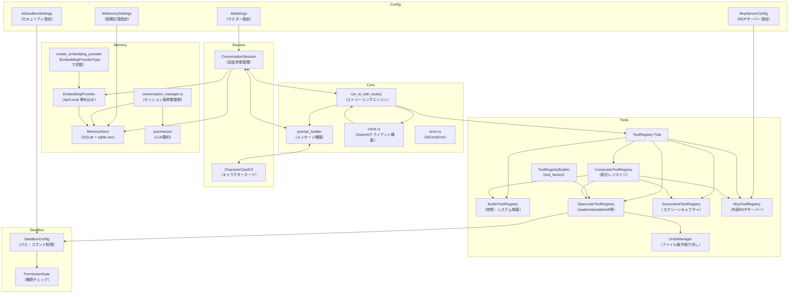

---

## 3. リクエスト処理フロー

### 3.1 全体フロー

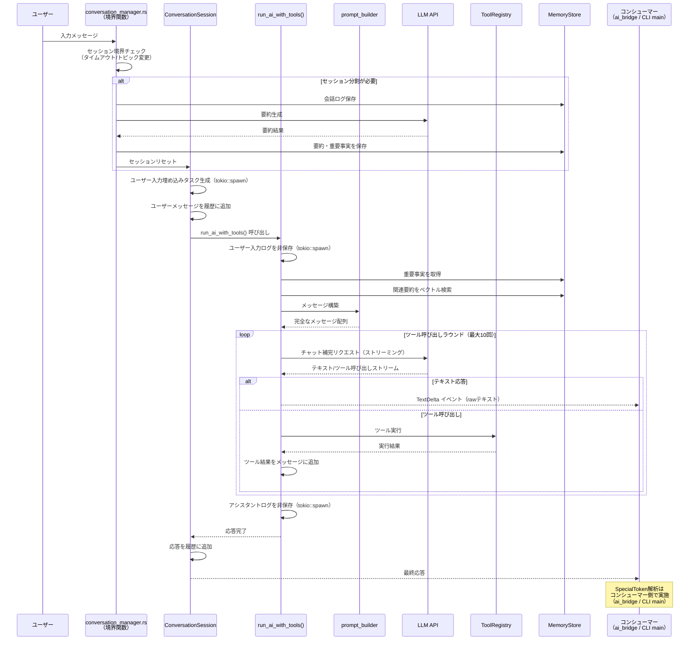

### 3.2 ツール呼び出しループ詳細

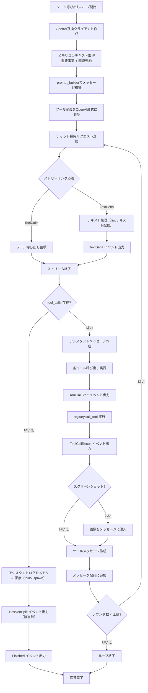

---

## 4. セッション自動分割フロー

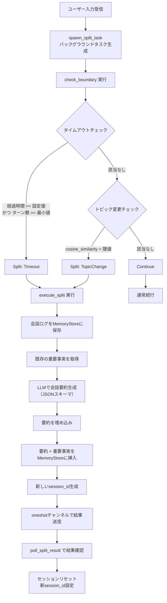

---

## 5. 長期記憶システム

### 5.1 メモリ初期化フロー

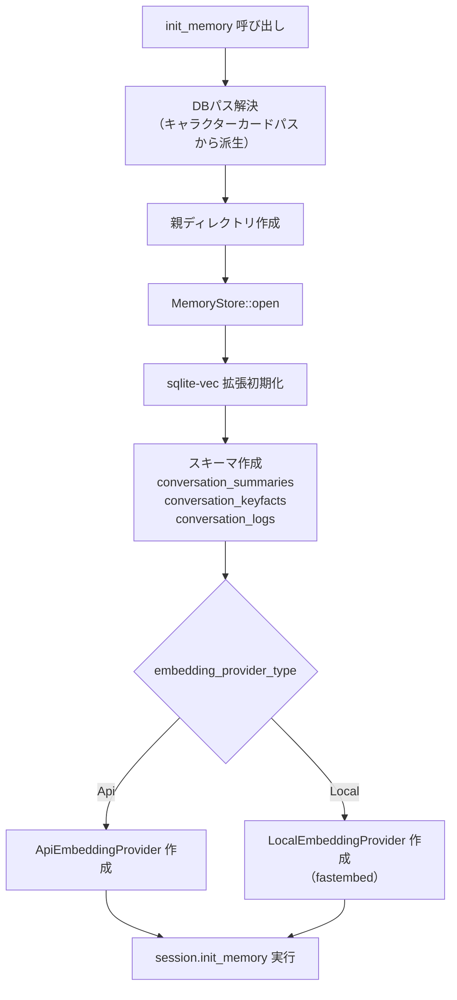

### 5.2 メモリ検索フロー

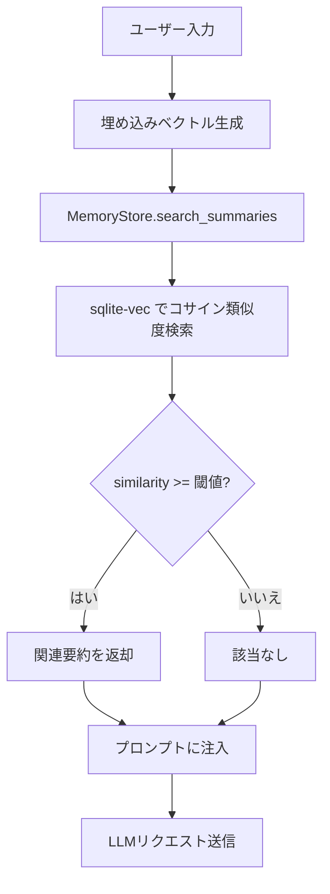

### 5.3 メモリテーブル構造

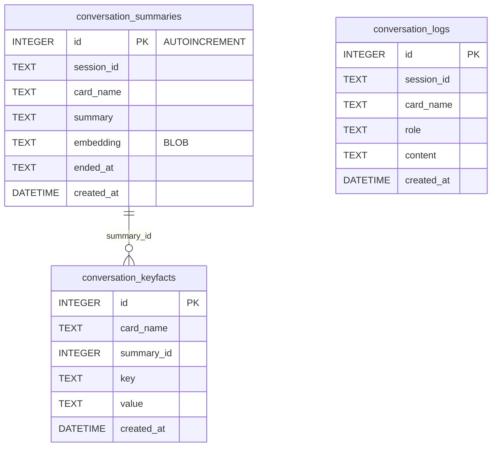

---

## 6. プロンプト構築フロー

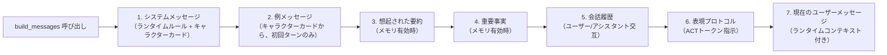

---

## 7. ツールシステム

### 7.1 ツールレジストリ構成

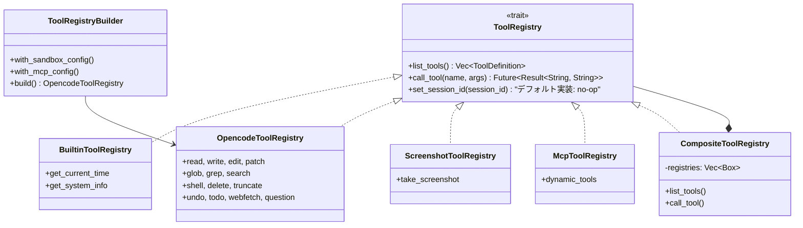

### 7.2 OpencodeToolRegistry ツール一覧

| ツール | 説明 |
|--------|------|
| `read` | ファイル/ディレクトリ読み込み（行番号付き出力） |
| `write` | ファイル書き込み（事前読み込み必須、Undoエントリ作成） |
| `edit` | 文字列置換（9段階の置換戦略: simple/line_trimmed/block_anchor/whitespace_normalized/indentation_flexible/escape_normalized/trimmed_boundary/context_aware/multi_occurrence、Levenshtein距離計算、ファイルロック付き） |
| `patch` | マルチファイルパッチ適用 |
| `glob` | ファイルパターンマッチング |
| `grep` | 正規表現コンテンツ検索 |
| `shell` | コマンド実行（タイムアウト、作業ディレクトリ指定可能） |
| `delete` | ファイル/ディレクトリ削除（再帰的） |
| `undo` | 直前のファイル操作を取り消し |
| `todo` | タスクリスト管理 |
| `webfetch` | URLコンテンツ取得 |
| `question` | ユーザーへの質問 |

---

## 8. セキュリティサンドボックス

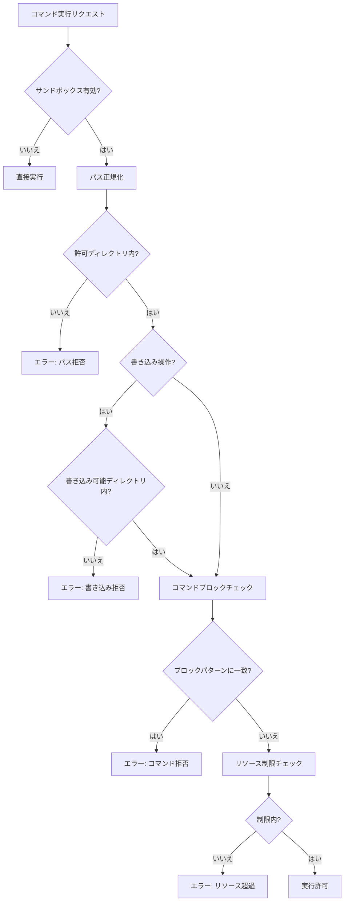

### サンドボックス制限

| 項目 | 制限値 |
|------|--------|
| 最大読み込みバイト数 | 50KB |
| 最大書き込みバイト数 | 1MB |
| シェルタイムアウト | 120秒 |
| 最大シェル出力バイト数 | 設定値 |
| 最大シェル出力行数 | 設定値 |

### ブロックコマンドパターン（正規表現）

- `r"rm\s+-rf\s+/"`
- `r"dd\s+if="`
- `r"mkfs"`
- フォークボム（`:(){ :|:& };:`）
- `r"sudo\s+"`

> **注意**: `SandboxConfig::default()` には `sudo` が含まれるが、`AiSandboxSettings::default()` には含まれない。CLIが `AiSandboxSettings` から構築する場合、`sudo` はブロックされない。

---

## 9. 感情表現トークン（Special Token）

```mermaid
flowchart TD
    A[ストリーミングテキスト受信<br/>（run_ai_with_tools から TextDelta）] --> B[コンシューマー側で解析<br/>（ai_bridge.rs / CLI main.rs）]
    B --> C[split_text_and_special_tokens]
    C --> D{&lt;|...|&gt; トークン存在?}
    D -->|はい| E[extract_emotion_from_act_token]
    D -->|いいえ| F[通常テキストとして処理]
    E --> G{JSON形式?}
    G -->|はい| H[emotionフィールド抽出]
    G -->|いいえ| I[キーワードフォールバック解析]
    H --> J[SpecialToken イベント出力]
    I --> J
    J --> K[VRM表情更新]

    style A fill:#f9f,stroke:#333
    style B fill:#ff9,stroke:#333
```

> **注意**: `stream.rs` 自体は SpecialToken の解析を行わない。`TextDelta(String)` を raw テキストで配信し、解析はコンシューマー側（`ai_bridge.rs` / CLI `main.rs`）で実施される。

### ACTトークン形式

```
<|ACT:{"emotion":"happy"}|>
```

---

## 10. アプリケーション起動フロー

### 10.1 GUI（ene-app）

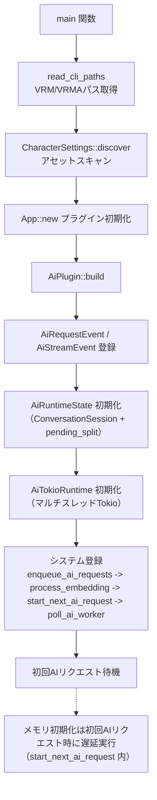

### 10.2 CLI（ene-cli）

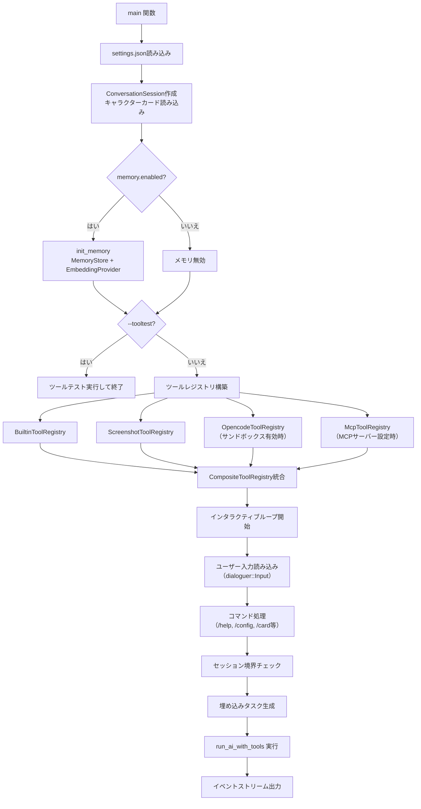

---

## 11. デザインパターン

| パターン | 説明 |
|----------|------|
| **Traitベースツールシステム** | `ToolRegistry` トレイトにより、プラグ可能なツールソース（builtin、MCP、ファイルシステム、スクリーンショット） |
| **コンポジットパターン** | `CompositeToolRegistry` が複数のレジストリを1つに統合 |
| **非同期ストリーミング** | `tokio_stream::Stream` によるAI応答の逐次配信 |
| **イベント駆動アーキテクチャ（GUI）** | Bevyメッセージ（`AiRequestEvent`、`AiStreamEvent`）でAI処理とレンダリングを分離 |
| **バックグラウンドタスクパターン** | セッション分割評価をバックグラウンドTokioタスクで実行、oneshotチャンネルで結果ポーリング |
| **ベクトルメモリ** | `sqlite-vec` 拡張によるコサイン類似度検索 |
| **Undoシステム** | セッションごとのUndoスタックでファイル操作を追跡・ロールバック |
| **サンドボックスセキュリティ** | パス正規化 + プレフィックスマッチング + 正規表現コマンドブロック |

---

## 12. 主要ファイル一覧

| ファイル | 目的 |
|----------|------|
| `crates/ene-ai-core/src/lib.rs` | クレートルート（再エクスポート） |
| `crates/ene-ai-core/src/config.rs` | 設定構造体（AiSettings、Memory、Sandbox、MCP） |
| `crates/ene-ai-core/src/session.rs` | ConversationSession（会話状態管理） |
| `crates/ene-ai-core/src/stream.rs` | run_ai_with_tools（ストリーミングエンジン） |
| `crates/ene-ai-core/src/prompt_builder.rs` | メッセージ構築 |
| `crates/ene-ai-core/src/character_card.rs` | キャラクターカード解析（V3形式、CBSマクロ展開） |
| `crates/ene-ai-core/src/client.rs` | OpenAIクライアント構築（build_openai_client） |
| `crates/ene-ai-core/src/error.rs` | AiCoreError エラー型 |
| `crates/ene-ai-core/src/utils.rs` | ユーティリティ（truncate、init_memory） |
| `crates/ene-ai-core/src/embedding.rs` | テキスト埋め込みプロバイダー（Api/Local） |
| `crates/ene-ai-core/src/summarizer.rs` | LLMベースの会話要約 |
| `crates/ene-ai-core/src/conversation_manager.rs` | セッション境界関数（check_boundary、execute_split等） |
| `crates/ene-ai-core/src/special_token.rs` | ACTトークン解析（感情表現） |
| `crates/ene-ai-core/src/mcp_client.rs` | MCPクライアント |
| `crates/ene-ai-core/src/tool_factory.rs` | ToolRegistryBuilder |
| `crates/ene-ai-core/src/memory/store/mod.rs` | SQLiteメモリストレージ |
| `crates/ene-ai-core/src/memory/store/schema.rs` | SQLiteスキーマ定義 |
| `crates/ene-ai-core/src/memory/store/serialization.rs` | 埋め込みシリアライゼーション |
| `crates/ene-ai-core/src/memory/recall.rs` | 要約フォーマット |
| `crates/ene-ai-core/src/sandbox/mod.rs` | サンドボックス設定 |
| `crates/ene-ai-core/src/sandbox/permission.rs` | 権限ゲート |
| `crates/ene-ai-core/src/tools/definition.rs` | ToolRegistryトレイト |
| `crates/ene-ai-core/src/tools/builtin.rs` | 組み込みツール |
| `crates/ene-ai-core/src/tools/registry.rs` | Opencodeツール |
| `crates/ene-ai-core/src/tools/composite.rs` | 統合レジストリ |
| `crates/ene-ai-core/src/tools/screenshot.rs` | スクリーンショットツール |
| `crates/ene-ai-core/src/tools/undo_manager.rs` | Undoシステム |
| `crates/ene-ai-core/src/tools/undo_tool.rs` | Undoツール |
| `crates/ene-ai-core/src/tools/todo.rs` | Todo管理 |
| `crates/ene-ai-core/src/tools/read.rs` | 読み込みツール |
| `crates/ene-ai-core/src/tools/write.rs` | 書き込みツール |
| `crates/ene-ai-core/src/tools/edit/mod.rs` | 編集ツール（9段階置換戦略） |
| `crates/ene-ai-core/src/tools/search.rs` | glob/grepツール |
| `crates/ene-ai-core/src/tools/shell.rs` | シェル実行ツール |
| `crates/ene-ai-core/src/tools/delete.rs` | 削除ツール |
| `crates/ene-ai-core/src/tools/patch.rs` | パッチツール |
| `crates/ene-ai-core/src/tools/question.rs` | 質問ツール |
| `crates/ene-ai-core/src/tools/webfetch.rs` | Webフェッチツール |
| `crates/ene-app/src/main.rs` | GUIエントリーポイント |
| `crates/ene-app/src/app_config.rs` | アプリ設定（CharacterSettings） |
| `crates/ene-app/src/character.rs` | キャラクタープラグイン |
| `crates/ene-app/src/ai_bridge.rs` | Bevy AI統合 |
| `crates/ene-cli/src/main.rs` | CLIエントリーポイント |
