# AI-Core 動作フロー ドキュメント

## 概要

Ene の AI-Core は、LLM との対話、ツール呼び出し、長期記憶、セッション管理を統合した Rust 製のコアライブラリです。

---

## 1. プロジェクト構成

```
crates/
├── ene-ai-core/        # AI コアライブラリ（LLM連携、ツールホスト管理、記憶、サンドボックス）
├── ene-app/            # Bevy ベースの GUI デスクトップアプリ（VRM キャラクターオーバーレイ）
├── ene-cli/            # テスト・直接AI対話用インタラクティブCLI
├── ene-tool-proto/     # IPC プロトコル・SDK（ToolProvider trait, run_tool_server, UDS 通信）
└── ene-tools/          # 個別ツールバイナリ（IPC 経由で ene-ai-core と通信）
    ├── app/            # GUI 自動化ツールバイナリ
    ├── browser/        # ブラウザ自動化ツールバイナリ
    ├── fs/             # ファイルシステムツールバイナリ
    ├── utility/        # ユーティリティツールバイナリ
    └── web/            # Web検索・フェッチツールバイナリ
```

---

## 2. コンポーネント関係図

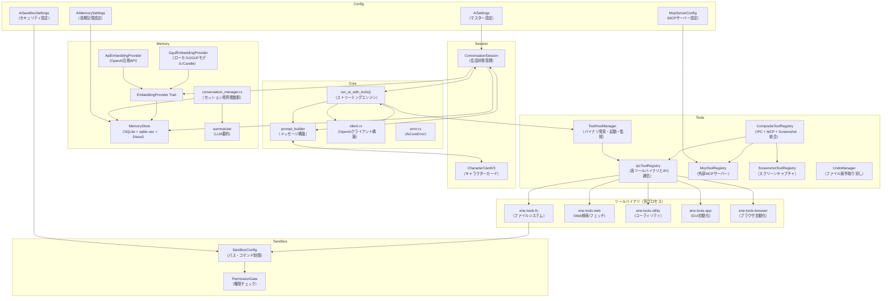

---

## 3. リクエスト処理フロー

### 3.1 全体フロー

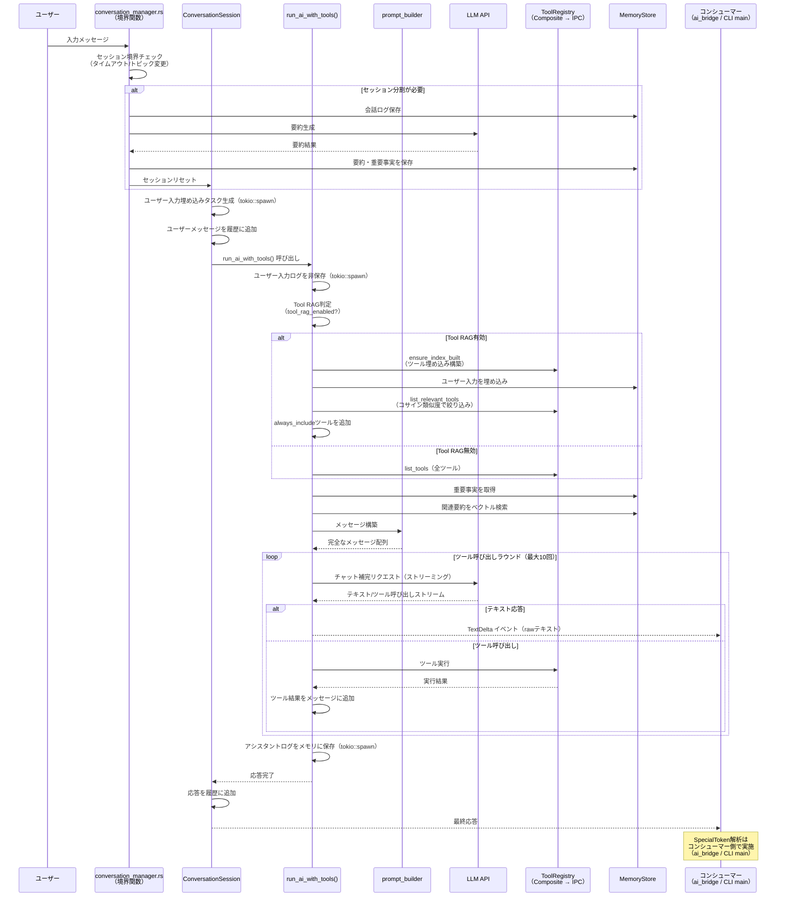

### 3.2 AiStreamEvent 一覧

| イベント | 説明 |
|----------|------|
| `TextDelta(String)` | テキスト断片（raw） |
| `SpecialToken(String)` | 感情表現トークン（emo） |
| `ToolCallStart { name, arguments }` | ツール呼び出し開始 |
| `ToolCallResult { name, result }` | ツール実行結果 |
| `PermissionRequired { request_id, action, target, description }` | パーミッション要求（Phase 2） |
| `TaskProgress { task_id, step, total_steps, description }` | タスク進捗（Phase 2） |
| `SessionSplit { summary, reason }` | セッション分割通知 |
| `Finished` | 応答完了 |
| `Error(String)` | エラー |

### 3.2 ツール呼び出しループ詳細

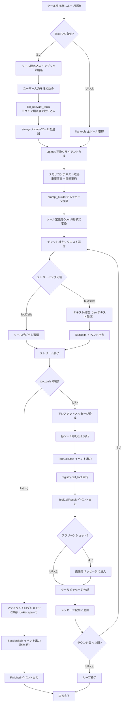

---

## 4. セッション自動分割フロー

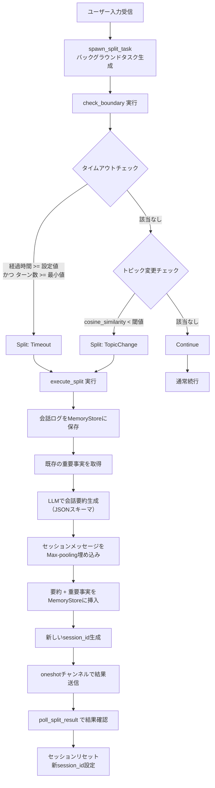

---

## 5. 長期記憶システム

### 5.1 メモリ初期化フロー

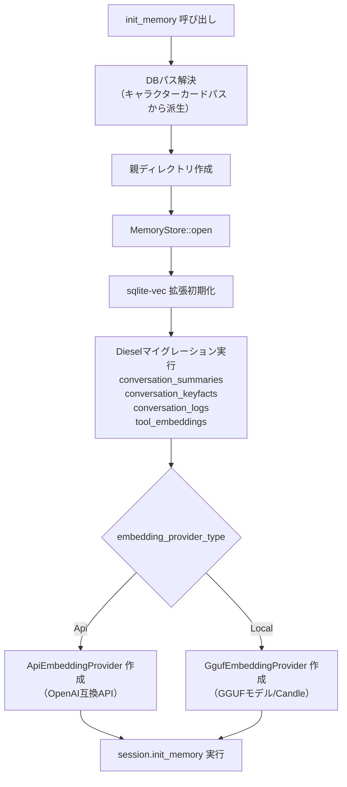

### 5.2 メモリ検索フロー

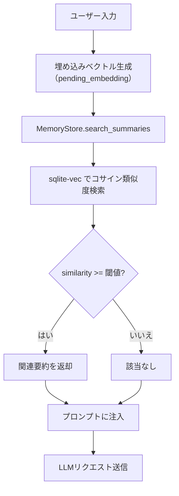

> **Tool RAG検索フロー**: ユーザー入力を埋め込み → `tool_embeddings`テーブルからコサイン類似度でツールを検索 → `tool_rag_limit`件に絞り込み → `tool_rag_always_include`のツールを追加

### 5.3 メモリテーブル構造

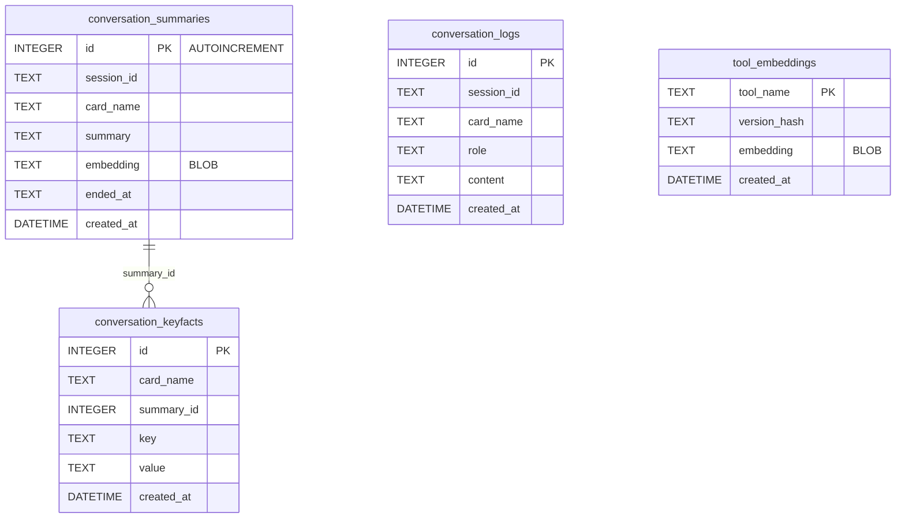

---

## 6. プロンプト構築フロー

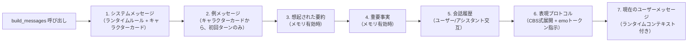

---

## 7. ツールシステム

### 7.1 IPC ツールアーキテクチャ

各ツール種別は独立したバイナリプロセスとして動作し、ene-ai-core とは UDS（Unix Domain Socket）経由の IPC で通信する。

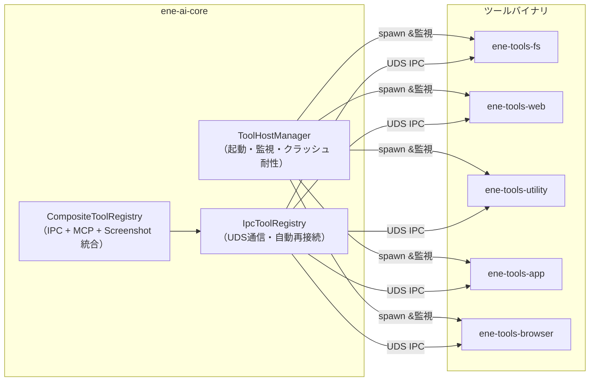

#### 起動フロー

1. `ToolHostManager` が `<exe_dir>/tools/` と `app_data_dir()/tools/` からバイナリを発見
2. `settings.json` の `tools.enabled` にリストされたツールのみ起動
3. 各ツールバイナリは `run_tool_server()` で UDS リスナーを起動
4. `IpcToolRegistry` が各ソケットに接続し、`Initialize` → `ListTools` → `CallTool` の順で通信
5. 全 `IpcToolRegistry` を `CompositeToolRegistry` に統合して `ToolRegistry` trait を実装

#### クラッシュ耐性

- `ToolHostManager` はプロセス終了を検知すると指数バックオフで再起動（最大5回、500ms〜30s）
- `IpcToolRegistry` は接続断時に自動再接続（最大5回、指数バックオフ）
- 再接続時は `Initialize`（サンドボックス設定など）を再送
- UDS ソケットパーミッションは `0600` に設定（Unix only）

### 7.2 IPC プロトコル（ene-tool-proto）

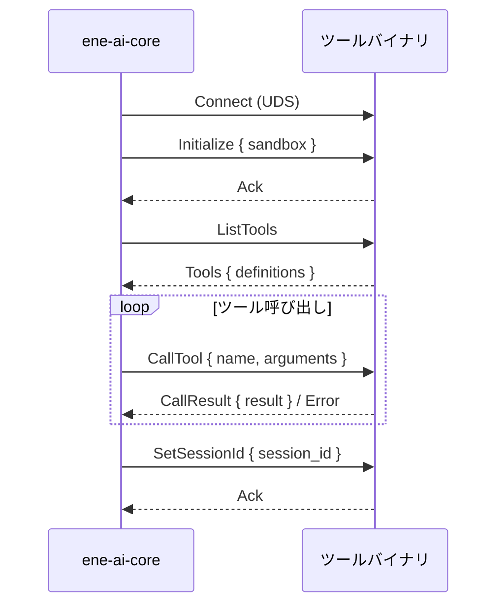

### 7.3 ツールレジストリ構成

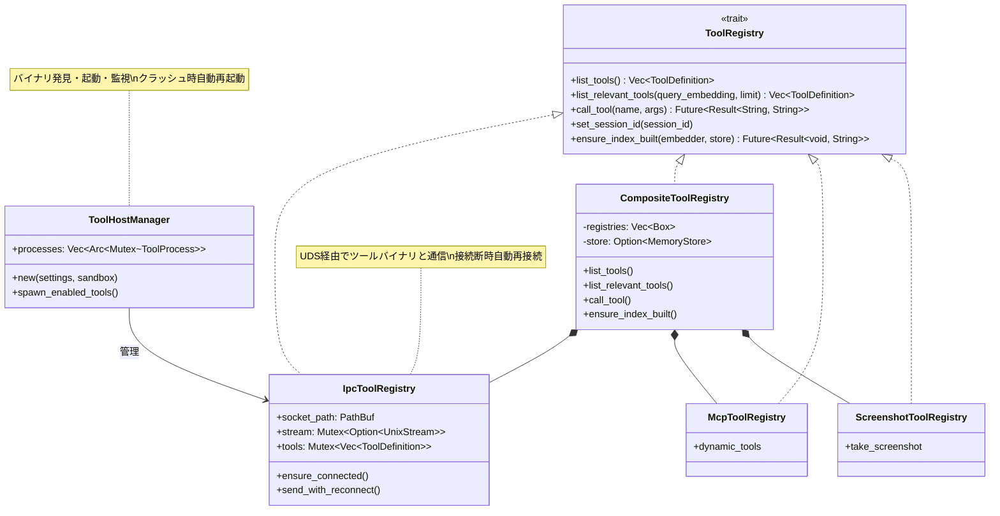

### 7.4 ツール一覧（IPC バイナリ別）

#### ene-tools-fs
| ツール | 説明 |
|--------|------|
| `filesystem` | 統一ファイルシステム操作（action: read/write/edit/delete/glob/grep/patch）。サンドボックス制約適用 |
| `shell` | コマンド実行（タイムアウト、作業ディレクトリ指定可能、サンドボックス適用） |
| `undo` | 直前のファイル操作を取り消し（セッションごとUndoスタック） |

#### ene-tools-web
| ツール | 説明 |
|--------|------|
| `webfetch` | URLコンテンツ取得（format/timeout指定可能） |
| `websearch` | ウェブ検索（backend: duckduckgo/tavily/brave、limit指定可能） |

#### ene-tools-utility
| ツール | 説明 |
|--------|------|
| `todo` | タスクリスト管理（セッションごとTodoStore） |
| `question` | ユーザーへの質問 |

#### ene-tools-app
| ツール | 説明 |
|--------|------|
| `app` | OSレベルGUI自動化（enigo/xcap）。action: list_windows/focus_window/type_text/press_key/mouse_move/mouse_click/clipboard_read/clipboard_write |

#### ene-tools-browser
| ツール | 説明 |
|--------|------|
| `browser` | Chromiumブラウザ自動化（CDP）。action: navigate/click/type/wait/screenshot/get_content/scroll/close。セッションごとに状態永続化 |

#### インプロセスツール（IPC バイナリなし）
| ツール | 説明 |
|--------|------|
| `screenshot` | スクリーンキャプチャ（ScreenshotToolRegistry、インプロセス） |
| MCP ツール | 外部MCPサーバーからの動的ツール（McpToolRegistry） |

---

## 8. セキュリティサンドボックス

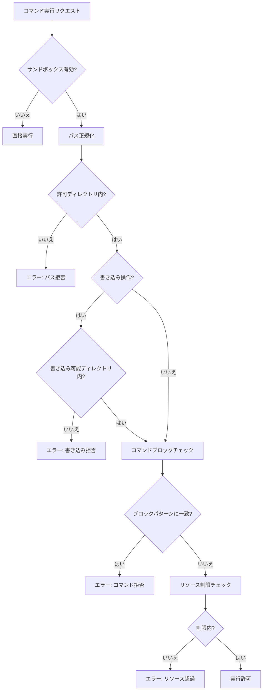

### サンドボックス制限

| 項目 | 制限値 |
|------|--------|
| 最大読み込みバイト数 | 50KB |
| 最大書き込みバイト数 | 1MB |
| シェルタイムアウト | 120秒 |
| 最大シェル出力バイト数 | 設定値 |
| 最大シェル出力行数 | 設定値 |

### ブロックコマンドパターン（正規表現）

- `r"rm\s+-rf\s+/"`
- `r"dd\s+if="`
- `r"mkfs"`
- フォークボム（`:(){ :|:& };:` → `r":\s*\{\s*\|\s*&\s*;\s*\}"`）

> **注意**: `AiSandboxSettings::default()` には `sudo` は含まれない。明示的に設定に追加しない限り、`sudo` はブロックされない。

---

## 9. 感情表現トークン（Special Token）

```mermaid
flowchart TD
    A[ストリーミングテキスト受信<br/>（run_ai_with_tools から TextDelta）] --> B[コンシューマー側で解析<br/>（ai_bridge.rs / CLI main.rs）]
    B --> C[split_text_and_special_tokens]
    C --> D{<|...|> トークン存在?}
    D -->|はい| E[extract_emotion_from_token]
    D -->|いいえ| F[通常テキストとして処理]
    E --> G[emo:以降の感情名を抽出]
    G --> H[SpecialToken イベント出力]
    H --> I[VRM表情更新]

    style A fill:#f9f,stroke:#333
    style B fill:#ff9,stroke:#333
```

> **注意**: `stream.rs` 自体は SpecialToken の解析を行わない。`TextDelta(String)` を raw テキストで配信し、解析はコンシューマー側（`ai_bridge.rs` / CLI `main.rs`）で実施される。

### Emotion Token Format

```
<|emo:happy|>
```

> CBS式の`<|emo:<name>|>`は、キャラクターカードの`post_history_instructions`または自動生成されたEmotion Expression ProtocolによりLLMに指示される。利用可能な感情一覧はカードの`expressions`フィールドから展開される。

---

## 10. アプリケーション起動フロー

### 10.1 GUI（ene-app）

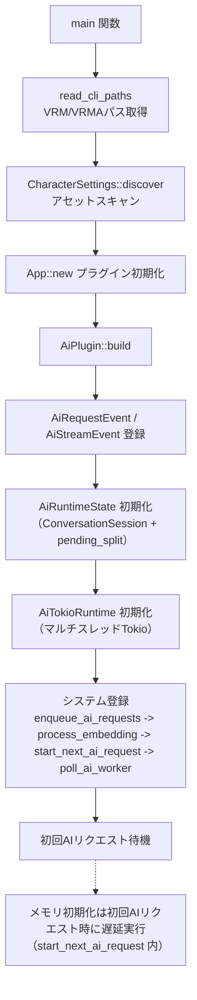

### 10.2 CLI（ene-cli）

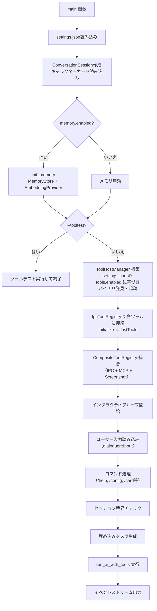

---

## 11. デザインパターン

| パターン | 説明 |
|----------|------|
| **IPC ツールアーキテクチャ** | 各ツール種別を独立バイナリプロセスに分離。UDS（Unix Domain Socket）経由でIPC通信。クラッシュ耐性（自動再起動＋指数バックオフ）、ユーザープラグイン対応（`app_data_dir()/tools/`） |
| **ToolHostManager** | バイナリ発見・起動・監視。`settings.json` の `tools.enabled` に基づき選択的起動。プロセスクラッシュ時に指数バックオフで再起動（MAX_RESTARTS=5） |
| **IpcToolRegistry 自動再接続** | 接続断時に指数バックオフで自動再接続（MAX_RETRIES=5）。再接続成功時に Initialize・ListTools を再送 |
| **コンポジットパターン** | `CompositeToolRegistry` が IPC（IpcToolRegistry）、MCP、Screenshot を1つの `ToolRegistry` に統合 |
| **Tool RAG** | `ToolDefinition`の`keywords`と`category`から埋め込みを生成、`tool_embeddings`テーブルに保存。ユーザー入力とのコサイン類似度で動的にツールを選択しtoken消費を抑制 |
| **非同期ストリーミング** | `tokio_stream::Stream` によるAI応答の逐次配信 |
| **イベント駆動アーキテクチャ（GUI）** | Bevyメッセージ（`AiRequestEvent`、`AiStreamEvent`）でAI処理とレンダリングを分離 |
| **バックグラウンドタスクパターン** | セッション分割評価をバックグラウンドTokioタスクで実行、oneshotチャンネルで結果ポーリング |
| **ベクトルメモリ** | `sqlite-vec` 拡張 + Diesel ORMによるコサイン類似度検索 |
| **GGUFローカル埋め込み** | CandleフレームワークによるGGUF量子化モデルのローカル推論（`GgufEmbeddingProvider`） |
| **メッセージMax-pooling** | セッションメッセージを個別にembedし、各次元で最大値を採用。挨拶などの情報量ゼロのメッセージによる意味の希釈を防止 |
| **Undoシステム** | セッションごとのUndoスタックでファイル操作を追跡・ロールバック |
| **サンドボックスセキュリティ** | パス正規化 + プレフィックスマッチング + 正規表現コマンドブロック。FsToolProvider に `set_sandbox()` でIPC経由で設定配信 |
| **CBS式展開** | キャラクターカードの`{{char}}`/`{{user}}`式を自動展開 |
| **UDS セキュリティ** | ソケットパーミッション `0600` で所有者のみアクセス可能（Unix only） |

---

## 12. 主要ファイル一覧

| ファイル | 目的 |
|----------|------|
| `crates/ene-ai-core/src/lib.rs` | クレートルート（再エクスポート） |
| `crates/ene-ai-core/src/config.rs` | 設定構造体（AiSettings、Memory、Sandbox、MCP、AiToolSettings） |
| `crates/ene-ai-core/src/session.rs` | ConversationSession（会話状態管理） |
| `crates/ene-ai-core/src/stream.rs` | run_ai_with_tools（ストリーミングエンジン + Tool RAG） |
| `crates/ene-ai-core/src/prompt_builder.rs` | メッセージ構築 + CBS式展開 + 表現プロトコル |
| `crates/ene-ai-core/src/character_card.rs` | キャラクターカード解析（V3形式、CBSマクロ展開） |
| `crates/ene-ai-core/src/client.rs` | OpenAIクライアント構築（build_openai_client） |
| `crates/ene-ai-core/src/error.rs` | AiCoreError エラー型 |
| `crates/ene-ai-core/src/utils.rs` | ユーティリティ（truncate、init_memory） |
| `crates/ene-ai-core/src/paths.rs` | パス解決（builtin_tools_dir, user_tools_dir, tool_socket_dir） |
| `crates/ene-ai-core/src/resources.rs` | リソース管理 |
| `crates/ene-ai-core/src/schema.rs` | Dieselスキーマ定義（自動生成） |
| `crates/ene-ai-core/src/embedding/mod.rs` | テキスト埋め込みプロバイダー（Api/Gguf） |
| `crates/ene-ai-core/src/embedding/quantized/` | GGUF量子化モデルローダー（Candle） |
| `crates/ene-ai-core/src/summarizer.rs` | LLMベースの会話要約 |
| `crates/ene-ai-core/src/conversation_manager.rs` | セッション境界関数（check_boundary、execute_split等） |
| `crates/ene-ai-core/src/special_token.rs` | emoトークン解析（感情表現） |
| `crates/ene-ai-core/src/mcp_client.rs` | MCPクライアント |
| `crates/ene-ai-core/src/tool_factory.rs` | ToolRegistryBuilder（ToolHostManager 用設定構築） |
| `crates/ene-ai-core/src/tool_host_manager.rs` | ToolHostManager（バイナリ発見・起動・監視・クラッシュ再起動） |
| `crates/ene-ai-core/src/ipc_client.rs` | IpcToolRegistry（UDS IPC通信・自動再接続） |
| `crates/ene-ai-core/src/memory/mod.rs` | メモリモジュール |
| `crates/ene-ai-core/src/memory/store/mod.rs` | SQLiteメモリストア（Diesel + sqlite-vec） |
| `crates/ene-ai-core/src/memory/store/models.rs` | Dieselモデル定義 |
| `crates/ene-ai-core/src/memory/recall.rs` | 要約フォーマット |
| `crates/ene-ai-core/src/sandbox/mod.rs` | サンドボックス設定 |
| `crates/ene-ai-core/src/sandbox/permission.rs` | 権限ゲート（PermissionGate、PermissionLevel） |
| `crates/ene-ai-core/src/tools/mod.rs` | ツールモジュール + ToolCategory列挙型 |
| `crates/ene-ai-core/src/tools/definition.rs` | ToolRegistryトレイト + ToolDefinition |
| `crates/ene-ai-core/src/tools/composite.rs` | 統合レジストリ（IPC + MCP + Screenshot） |
| `crates/ene-ai-core/src/tools/utility/` | インプロセスユーティリティ |
| `crates/ene-ai-core/src/tools/undo_manager.rs` | Undoシステム |
| **ene-tool-proto** | |
| `crates/ene-tool-proto/src/lib.rs` | ToolProvider trait、再エクスポート |
| `crates/ene-tool-proto/src/types.rs` | IpcRequest, IpcResponse, ToolDefinition（IPCプロトコル型） |
| `crates/ene-tool-proto/src/ipc.rs` | UDS 読み書きユーティリティ（write_ipc_request, read_ipc_response） |
| `crates/ene-tool-proto/src/server.rs` | run_tool_server()（ツールバイナリのエントリーポイント）、UDS 0600 パーミッション |
| `crates/ene-tool-proto/src/registry.rs` | HostRegistry（ツール名→ハンドラマッピング） |
| `crates/ene-tool-proto/src/sandbox.rs` | SandboxConfigData（IPC сериализация用サンドボックス設定） |
| `crates/ene-tool-proto/src/error.rs` | IPC エラー型 |
| **ツールバイナリ** | |
| `crates/ene-tools/fs/src/main.rs` | ene-tools-fs バイナリエントリポイント |
| `crates/ene-tools/fs/src/provider.rs` | FsToolProvider（filesystem, shell, undo） |
| `crates/ene-tools/fs/src/sandbox.rs` | Sandbox 型（SandboxConfigData からの変換） |
| `crates/ene-tools/web/src/main.rs` | ene-tools-web バイナリエントリポイント |
| `crates/ene-tools/web/src/provider.rs` | WebToolProvider（websearch, webfetch） |
| `crates/ene-tools/utility/src/main.rs` | ene-tools-utility バイナリエントリポイント |
| `crates/ene-tools/utility/src/provider.rs` | UtilityToolProvider（todo, question） |
| `crates/ene-tools/app/src/main.rs` | ene-tools-app バイナリエントリポイント |
| `crates/ene-tools/app/src/provider.rs` | AppToolProvider（GUI自動化） |
| `crates/ene-tools/browser/src/main.rs` | ene-tools-browser バイナリエントリポイント |
| `crates/ene-tools/browser/src/provider.rs` | BrowserToolProvider（ブラウザ自動化） |
| **アプリケーション** | |
| `crates/ene-app/src/main.rs` | GUIエントリーポイント |
| `crates/ene-app/src/app_config.rs` | アプリ設定（CharacterSettings） |
| `crates/ene-app/src/character.rs` | キャラクタープラグイン |
| `crates/ene-app/src/ai_bridge.rs` | Bevy AI統合 |
| `crates/ene-app/src/resources.rs` | Bevyリソース |
| `crates/ene-app/src/scene.rs` | シーン管理 |
| `crates/ene-app/src/tray.rs` | システムトレイ |
| `crates/ene-app/src/settings_ui/` | 設定UIウィジェット |
| `crates/ene-app/src/window_drag/` | ウィンドウドラッグ（Linux/Windows） |
| `crates/ene-app/src/platform.rs` | プラットフォーム判定 |
| `crates/ene-cli/src/main.rs` | CLIエントリーポイント |
| `crates/ene-cli/src/cli.rs` | CLI引数解析 |
| `crates/ene-cli/src/config.rs` | CLI設定 |
| `crates/ene-cli/src/context.rs` | CLIコンテキスト |
| `crates/ene-cli/src/repl.rs` | REPLループ |
| `crates/ene-cli/src/stream.rs` | CLIストリーム処理 |
| `crates/ene-cli/src/registry.rs` | CLIツールレジストリ |
| `crates/ene-cli/src/tooltest.rs` | ツールテスト |
| `crates/ene-cli/src/commands/` | CLIコマンド（session/memory） |
| `crates/ene-cli/src/style.rs` | スタイル定義 |
