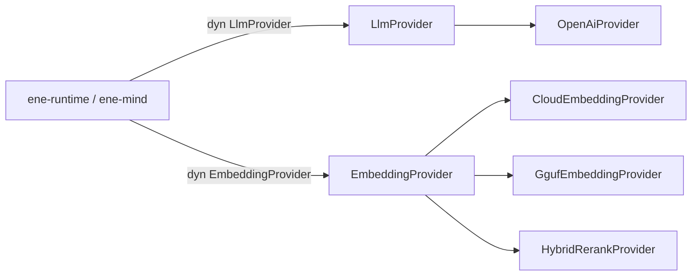

# `ene-ai` — API Reference

> **Crate:** `ene-ai`
> **Path:** `crates/ene-ai`

`ene-ai` is the unified LLM and embedding provider layer (API v2 merge of the former `ene-provider` + `ene-embedding` crates). Chat completions and embeddings flow through `LlmProvider` and `EmbeddingProvider`. Failures use typed errors (`LlmProviderError`, `EmbeddingError`).



## `EmbeddingProvider` Trait

Batch-only on the trait. Single-text / query helpers are free functions (also available as default methods that call those free functions).

```rust
#[async_trait]
pub trait EmbeddingProvider: Send + Sync {
    async fn embed_batch(
        &self,
        items: &[(&str, EmbeddingKind)],
    ) -> Result<Vec<Vec<f32>>, EmbeddingError>;

    fn dimensions(&self) -> usize;
    fn model_name(&self) -> &str;
}

pub async fn embed(
    provider: &dyn EmbeddingProvider,
    text: &str,
    kind: EmbeddingKind,
) -> Result<Vec<f32>, EmbeddingError>;

pub async fn embed_query(
    provider: &dyn EmbeddingProvider,
    text: &str,
) -> Result<Vec<f32>, EmbeddingError>;
```

| Method / fn | Notes |
|---|---|
| `embed_batch(items)` | Required. Output order matches input. Empty batch → empty `Vec`. Empty/whitespace text → `EmptyInput`. Dim mismatch → `DimensionMismatch`. |
| `dimensions()` / `model_name()` | Provider metadata. |
| `embed` / `embed_query` | Free functions (or default trait methods) over `embed_batch`. |

**Not** on the trait: `hyde`, `has_reranker`, `rerank`. Those live in pipeline helpers:

| Helper | Location |
|---|---|
| `hyde_document(llm, query)` | `ene_ai::hybrid` |
| `rerank_tool_specs(embedder, llm, query, candidates)` | `ene_ai::hybrid` |
| `HybridRerankProvider::{hyde, rerank, has_reranker}` | Inherent methods |
| `CloudEmbeddingProvider::hyde` | Inherent method |

## Local GGUF (`GgufEmbeddingProvider`)

```rust
pub fn create_local_provider(
    model: &str,
    quantization: &str,
    model_dir: PathBuf,
) -> Result<Box<dyn EmbeddingProvider>, EneEmbeddingError>;
```

Requires a **multi-thread** tokio runtime (`block_in_place`). Supported Hub fetch families are the Jina v5 retrieval models; other GGUF layouts need direct `GgufEmbeddingProvider::load`.

## `Role`

```rust
pub enum Role { System, User, Assistant }
```

Used by mind `HistoryEntry { role: Role, content: String }` and runtime `ConversationEntry`.

## Related

- [`ene-mind`](./ene-mind.md) — `HistoryEntry`, recall / compression
- [`ene-tool-host`](./ene-tool-host.md) — Tool RAG uses `hyde_document` / `rerank_tool_specs`
- [API v2 ADR](../architecture/api-v2.md)
