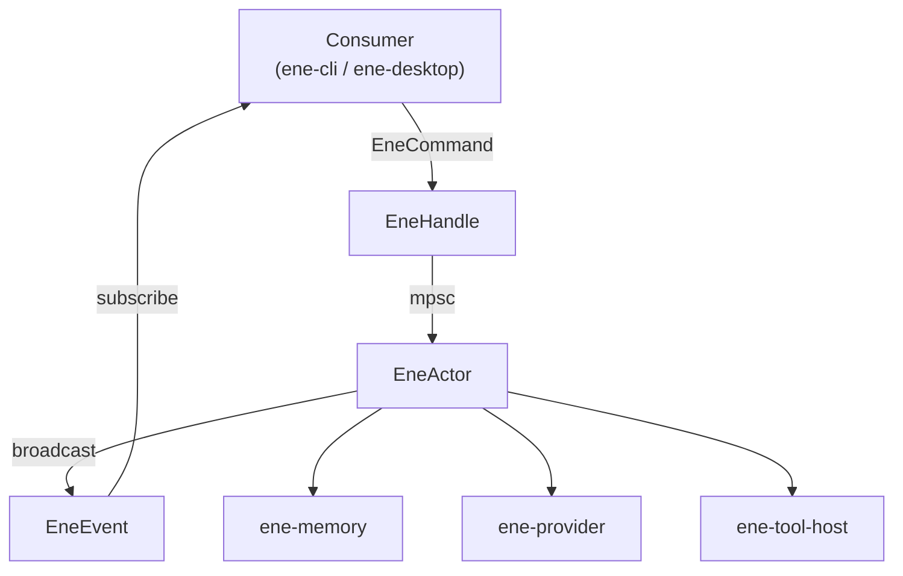
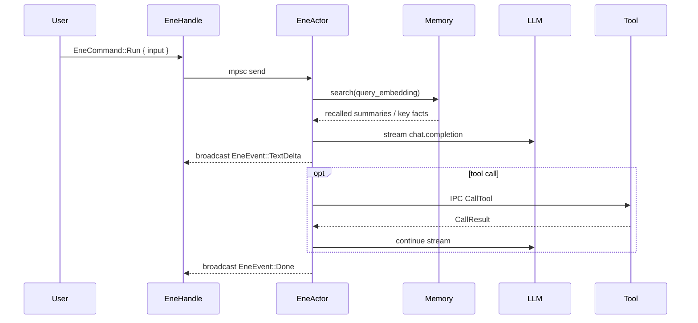

# `ene-core` — API Reference

> **Crate:** `ene-core`  
> **Role:** Main entry point and actor-based runtime facade for the Ene system.

---

## Overview

`ene-core` provides the primary interface for all consumer applications (CLI, desktop GUI). It wraps the internal actor loop in a thread-safe `EneHandle`, exposing a clean async API for running conversations, managing configuration, querying memory, and calling tools.

The internal actor runs on a dedicated Tokio task. Commands are sent over an `mpsc` channel, and events are broadcast to all subscribers through a `broadcast` channel.



---

## Data Flow (Single Turn)



---

## `EneHandle`

`EneHandle` is the primary public interface. It is **thread-safe** and **cheaply cloneable** — clone it freely to share across threads.

```rust
#[derive(Clone)]
pub struct EneHandle { /* opaque */ }
```

### Constructor

| Method | Signature | Description |
|--------|-----------|-------------|
| `new` | `fn new() -> Self` | Spawns the background actor task and returns a handle. |

### Conversation

| Method | Signature | Description |
|--------|-----------|-------------|
| `run` | `fn run(&self, input: impl Into<String>) -> Result<(), ActorDeadError>` | Sends user input to the actor, starting a new streaming turn. |
| `cancel` | `fn cancel(&self) -> Result<(), ActorDeadError>` | Cancels the current running turn. |
| `subscribe` | `fn subscribe(&self) -> EneEventReceiver` | Returns a broadcast channel receiver for `EneEvent`s. |

### Configuration

| Method | Signature | Description |
|--------|-----------|-------------|
| `reconfigure` | `fn reconfigure(&self, config: EneConfig) -> Result<(), EneCoreError>` | Hot-reloads configuration without restarting the actor. |
| `load_config` | `fn load_config(&self) -> Result<EneConfig, EneCoreError>` | Returns the current active configuration. |
| `load_config_from` | `fn load_config_from(&self, assets_dir: &Path, config_path: &Path) -> Result<EneConfig, EneCoreError>` | Loads configuration from a specific file path. |
| `load_character` | `fn load_character(&self, name: impl Into<String>) -> Result<(), EneCoreError>` | Loads a character card by name. |

### Inspection

| Method | Signature | Description |
|--------|-----------|-------------|
| `get_snapshot` | `fn get_snapshot(&self) -> Result<EneStateSnapshot, EneCoreError>` | Returns a point-in-time snapshot of actor state. |
| `manual_split` | `fn manual_split(&self) -> Result<SplitResult, EneCoreError>` | Forces a session split (creates a memory summary). |
| `list_tools` | `fn list_tools(&self) -> Result<Vec<ToolSpec>, EneCoreError>` | Returns the registered tool specifications. |
| `call_tool` | `fn call_tool(&self, name: &str, arguments: serde_json::Value) -> Result<String, EneCoreError>` | Directly invokes a tool by name. |

### Interactive Flow

| Method | Signature | Description |
|--------|-----------|-------------|
| `decide_permission` | `fn decide_permission(&self, request_id: u64, decision: PermissionDecision) -> Result<(), ActorDeadError>` | Responds to a `PermissionRequired` event. |
| `submit_user_input` | `fn submit_user_input(&self, request_id: u64, response: UserInputResponse) -> Result<(), ActorDeadError>` | Responds to a `UserInputRequired` event. |

---

## `EneCommand`

Commands are sent to the actor's `mpsc` channel. In normal use, you never construct these directly — `EneHandle` methods do it for you.

```rust
pub enum EneCommand {
    /// Start a new conversation turn.
    Run { input: String },

    /// Cancel the current streaming turn.
    Cancel,

    /// Shut down the actor gracefully.
    Shutdown,

    /// Replace the active configuration.
    Reconfigure { config: EneConfig, reply: oneshot::Sender<Result<(), EneCoreError>> },

    /// Load a character card from the given path.
    LoadCharacter { path: String, reply: oneshot::Sender<Result<(), EneCoreError>> },

    /// Get a point-in-time state snapshot.
    GetSnapshot { reply: oneshot::Sender<Result<EneStateSnapshot, EneCoreError>> },

    /// Force a session memory split.
    ManualSplit { reply: oneshot::Sender<Result<SplitResult, EneCoreError>> },

    /// List available tool specs.
    ListTools { reply: oneshot::Sender<Result<Vec<ToolSpec>, EneCoreError>> },

    /// Directly call a named tool.
    CallTool { name: String, arguments: serde_json::Value, reply: oneshot::Sender<Result<String, EneCoreError>> },

    /// User decision for a permission prompt.
    PermissionDecision { request_id: u64, decision: PermissionDecision },

    /// User response for an input prompt.
    UserInputResponse { request_id: u64, response: UserInputResponse },

    /// Signal that the tool index should be rebuilt.
    InvalidateToolIndex,
}
```

---

## `EneEvent`

Events are broadcast to all active `EneEventReceiver`s. Consumers should select on the variants they care about.

```rust
pub enum EneEvent {
    /// A fragment of assistant text output.
    TextDelta { delta: String },

    /// A special token parsed from the stream (e.g. emotion markers).
    SpecialToken { token: String },

    /// A tool call has begun.
    ToolCallStart { name: String, arguments: String },

    /// A tool call has completed.
    ToolCallResult { name: String, result: String },

    /// The actor requires user permission before proceeding.
    PermissionRequired {
        request_id: u64,
        action: String,
        target: String,
        description: String,
    },

    /// The actor requires user text input before proceeding.
    UserInputRequired { request_id: u64, prompt: String },

    /// Progress update for a multi-step background task.
    TaskProgress {
        task_id: String,
        step: u32,
        total_steps: u32,
        description: String,
    },

    /// The session was split and a memory summary was created.
    SessionSplit { summary: String, reason: String },

    /// The current turn has completed successfully.
    Done,

    /// The current turn failed.
    Failed { message: String },

    /// The actor's status changed.
    StatusChanged { status: EneStatus },
}
```

---

## `EneStateSnapshot`

A point-in-time capture of actor state, returned by `EneHandle::get_snapshot`.

```rust
pub struct EneStateSnapshot {
    /// The loaded character card (if any).
    pub character_card: Option<CharacterCardV3>,

    /// The conversation history for the current session.
    pub history: Vec<ConversationEntry>,

    /// The active runtime configuration.
    pub config: EneConfig,

    /// The current session's unique identifier.
    pub session_id: SessionId,

    /// The active character's name.
    pub card_name: CardName,

    /// A handle for querying the memory store directly.
    pub memory: MemoryQueryHandle,

    /// Number of turns completed in the current session.
    pub current_turn_count: u32,

    /// When the current session started.
    pub session_started_at: DateTime<Utc>,
}
```

---

## `EneStatus`

```rust
pub enum EneStatus {
    /// Waiting for user input.
    Idle,

    /// Processing a turn.
    Running,

    /// An error occurred.
    Error,
}
```

---

## `MemoryQueryHandle`

Provides read access to the memory subsystem from outside the actor. Obtained from `EneStateSnapshot::memory`.

| Method | Signature | Description |
|--------|-----------|-------------|
| `is_enabled` | `fn is_enabled(&self) -> bool` | Whether the memory subsystem is active. |
| `embed_query` | `fn embed_query(&self, text: &str) -> Result<Vec<f32>, EneCoreError>` | Embeds a text query using the configured embedding provider. |
| `search_summaries` | `fn search_summaries(&self, query_embedding: Vec<f32>, card_name: &str, limit: usize, threshold: f32) -> Result<Vec<RecalledSummary>, EneCoreError>` | Searches memory summaries by vector similarity. |
| `list_recent_summaries` | `fn list_recent_summaries(&self, card_name: &str, limit: usize) -> Result<Vec<ConversationSummary>, EneCoreError>` | Lists the most recent summaries in recency order. |
| `get_all_keyfacts` | `fn get_all_keyfacts(&self, card_name: &str) -> Result<Vec<KeyFact>, EneCoreError>` | Returns all key-facts stored for a character. |

---

## `PermissionDecision`

User's response to a `PermissionRequired` event.

```rust
pub enum PermissionDecision {
    /// Allow this single action.
    AllowOnce,

    /// Allow all actions of this type for the rest of the session.
    AllowSession,

    /// Deny the action.
    Deny,
}
```

---

## `UserInputResponse`

User's response to a `UserInputRequired` event.

```rust
pub enum UserInputResponse {
    /// Answers to a multi-question prompt.
    Multi(Vec<MultiAnswer>),

    /// User cancelled the input prompt.
    Cancel,
}
```

---

## Streaming Internals

These functions form the core of the AI conversation loop. They are not part of the public API surface but are documented here for contributors.

### `run_stream`

```rust
async fn run_stream(ctx: StreamContext) -> ConversationSession
```

The main AI loop. Calls `fetch_memory_context`, `build_chat_messages_list`, then opens a streaming completion from the LLM. Handles tool calls inline, loops on continuation, and persists history to the session.

### `select_relevant_tools`

```rust
fn select_relevant_tools(
    registry: &ToolRegistry,
    tool_rag: Option<&ToolRagIndex>,
    user_input: &str,
    enabled: bool,
) -> Vec<ToolSpec>
```

Selects the tools to include in the context for the current turn. When `tool_rag` is `Some`, uses vector search to pick the most relevant subset; otherwise returns all registered tools.

### `fetch_memory_context`

```rust
async fn fetch_memory_context(
    session: &ConversationSession,
    config: &EneConfig,
) -> (Vec<RecalledSummary>, Vec<KeyFact>)
```

Reads the pending embedding from the session and calls `MemoryStore::recall_context` to retrieve semantically relevant summaries and key-facts for the current turn.

### `build_chat_messages_list`

```rust
fn build_chat_messages_list(
    session: &ConversationSession,
    config: &EneConfig,
    user_input: &str,
    summaries: &[RecalledSummary],
    facts: &[KeyFact],
) -> Result<Vec<LlmMessage>, EneCoreError>
```

Assembles the full message list sent to the LLM: system prompt (character card + injected memory context), history, and the current user message.

---

## Usage Example

```rust
use ene_core::EneHandle;
use ene_core::EneEvent;

#[tokio::main]
async fn main() -> anyhow::Result<()> {
    let handle = EneHandle::new();

    // Subscribe to events before sending a command
    let mut rx = handle.subscribe();

    // Start a conversation turn
    handle.run("Hello! What can you do?")?;

    // Consume events until Done or Failed
    loop {
        match rx.recv().await? {
            EneEvent::TextDelta { delta } => print!("{}", delta),
            EneEvent::ToolCallStart { name, .. } => eprintln!("[Tool: {}]", name),
            EneEvent::ToolCallResult { name, result } => {
                eprintln!("[{} => {}]", name, result);
            }
            EneEvent::PermissionRequired { request_id, action, target, .. } => {
                eprintln!("Permission requested: {} on {}", action, target);
                handle.decide_permission(request_id, ene_core::PermissionDecision::AllowOnce)?;
            }
            EneEvent::Done => break,
            EneEvent::Failed { message } => {
                eprintln!("Error: {}", message);
                break;
            }
            _ => {}
        }
    }

    println!();
    Ok(())
}
```

---

## See Also

- [`ene-provider`](./ene-provider.md) — LLM and embedding provider traits
- [`ene-session`](./ene-session.md) — Conversation session and history
- [`ene-memory`](./ene-memory.md) — Persistent memory store
- [`ene-config`](./ene-config.md) — Configuration loading
