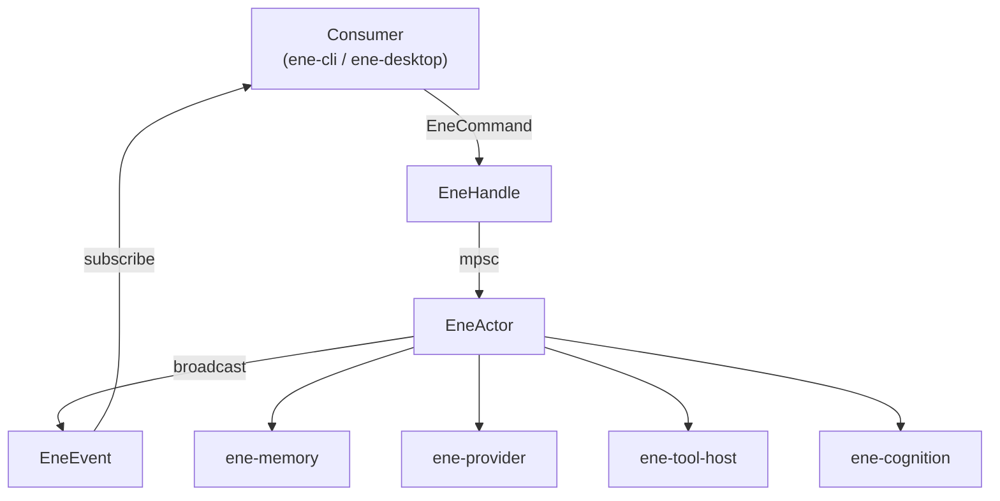
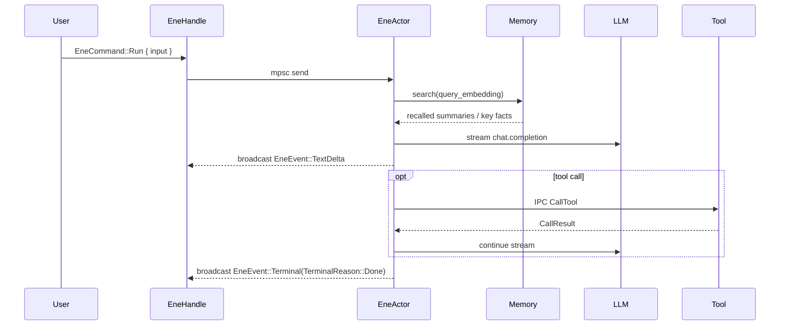

# `ene-core` — API Reference

> **Crate:** `ene-core`
> **Role:** Unified runtime facade integrating LLM streaming, tool orchestration, long-term memory, and session management through an actor-based message-passing architecture. Main entry point for all host applications (`ene-cli`, `ene-desktop`).

---

## Overview

`ene-core` provides the primary interface for all consumer applications. It wraps an internal actor loop in a thread-safe [`EneHandle`](#enehandle), exposing an async API for running conversations, managing configuration, querying memory, and calling tools.

The internal actor (`EneActor`, private) runs on a dedicated Tokio task. Commands are sent over an unbounded `mpsc` channel; events are broadcast to every subscriber through a `tokio::sync::broadcast` channel. The actor owns the tool registry, the memory store, the embedding provider, and the conversation session, and dispatches each turn to either the legacy streaming pipeline or the cognitive-runtime pipeline (see [Streaming Dispatch](#streaming-dispatch)).



---

## Data Flow (Single Turn)



Exactly one [`EneEvent::Terminal`](#eneevent) is emitted per `EneCommand::Run`, whether the run finished normally, errored, or was cancelled. An internal `AtomicBool` guard (`terminal_emitted`) shared between the actor and the stream task guarantees this even when a cancel races with the stream's own completion.

---

## `EneHandle`

`EneHandle` is the primary public interface. It is **thread-safe** and **cheaply cloneable** — clone it freely to share across threads/tasks. Dropping the last clone sends an implicit `Shutdown` command so the actor task exits.

```rust
pub struct EneHandle { /* opaque */ }

impl Clone for EneHandle { /* ... */ }
impl Default for EneHandle { /* ... */ } // calls Self::new()
```

### Constructor — sync

| Method | Signature | Description |
|---|---|---|
| `new` | `fn new() -> Self` | Spawns the background actor task on the current Tokio runtime and returns a handle to it. |

### Conversation & lifecycle — sync

These methods send a fire-and-forget command over the `mpsc` channel and return immediately; they do **not** wait for the actor to process the command.

| Method | Signature | Description |
|---|---|---|
| `subscribe` | `fn subscribe(&self) -> EneEventReceiver` | Returns a broadcast receiver that sees events from this point forward. |
| `run` | `fn run(&self, input: impl Into<String>) -> Result<(), ActorDeadError>` | Starts a new streaming turn with the given user input. Aborts and drains any previous in-flight run first. |
| `cancel` | `fn cancel(&self) -> Result<(), ActorDeadError>` | Cancels the currently-running turn and emits `Terminal(TerminalReason::Cancelled)` unless a terminal was already emitted. |
| `decide_permission` | `fn decide_permission(&self, request_id: impl Into<RequestId>, decision: PermissionDecision) -> Result<(), ActorDeadError>` | Resolves a pending `PermissionRequired` event. |
| `submit_user_input` | `fn submit_user_input(&self, request_id: impl Into<RequestId>, response: UserInputResponse) -> Result<(), ActorDeadError>` | Resolves a pending `UserInputRequired` event. |
| `invalidate_tool_index` | `fn invalidate_tool_index(&self) -> Result<(), ActorDeadError>` | Drops the cached Tool RAG index so it is rebuilt on the next query. |

### Configuration, inspection & tools — **async**

These methods use a `oneshot` reply channel and `.await` the actor's response, so they only return once the actor has actually processed the request.

| Method | Signature | Description |
|---|---|---|
| `shutdown` | `async fn shutdown(&self, timeout: Duration) -> Result<(), ShutdownTimeout>` | Sends `Shutdown` and **awaits the actor task's drain** (tool processes killed, memory inserts flushed). Returns `Err(ShutdownTimeout)` if the actor does not finish within `timeout`; the detached task is still aborted implicitly when the process exits. Safe to call more than once (subsequent calls are a no-op). `Drop` already sends `Shutdown` without waiting — call this explicitly only when the caller wants to observe the drain (e.g. CLI `/quit`). |
| `reconfigure` | `async fn reconfigure(&self, config: EneConfig) -> Result<(), EneCoreError>` | Hot-swaps the active configuration: re-initializes the embedding provider, memory store, tool registry, and Tool RAG pipeline. |
| `load_config` | `async fn load_config(&self) -> Result<EneConfig, EneCoreError>` | Convenience wrapper: loads config from default paths (`ene_config::load_config`) then calls `reconfigure`. Returns the loaded config. |
| `load_config_from` | `async fn load_config_from(&self, assets_dir: &Path, config_path: &Path) -> Result<EneConfig, EneCoreError>` | Same as `load_config`, but from explicit `assets_dir`/`config_path` (`ene_config::load_config_from`). |
| `load_character` | `async fn load_character(&self, name: impl Into<String>) -> Result<(), EneCoreError>` | Loads a character card by bare name or path (bare names resolve via `ene_config::resolve_character_path`). |
| `get_snapshot` | `async fn get_snapshot(&self) -> Result<EneStateSnapshot, EneCoreError>` | Returns a point-in-time snapshot of the actor's session state. |
| `manual_split` | `async fn manual_split(&self) -> Result<SplitResult, EneCoreError>` | Forces a session split (or a rolling compression pass, if `cognition.enabled && cognition.context.compression_enabled`). |
| `list_tools` | `async fn list_tools(&self) -> Result<Vec<ToolSpec>, EneCoreError>` | Returns the specs of every tool in the active registry. |
| `call_tool` | `async fn call_tool(&self, name: String, arguments: String) -> Result<String, EneCoreError>` | Directly invokes a tool by name with JSON-encoded arguments, bypassing the LLM tool-calling loop. |

---

## `EneCommand`

Commands sent to the actor over its internal `mpsc` channel. In normal use you never construct these directly — every `EneHandle` method builds one for you.

```rust
pub enum EneCommand {
    Run { input: String },
    Cancel,
    Shutdown,
    Reconfigure { config: EneConfig, reply: oneshot::Sender<Result<(), EneCoreError>> },
    LoadCharacter { path: String, reply: oneshot::Sender<Result<(), EneCoreError>> },
    PermissionDecision { request_id: RequestId, decision: PermissionDecision },
    UserInputResponse { request_id: RequestId, response: UserInputResponse },
    GetSnapshot { reply: oneshot::Sender<EneStateSnapshot> },
    ManualSplit { reply: oneshot::Sender<Result<SplitResult, EneCoreError>> },
    ListTools { reply: oneshot::Sender<Vec<ToolSpec>> },
    CallTool { name: String, arguments: String, reply: oneshot::Sender<Result<String, EneCoreError>> },
    InvalidateToolIndex,
}
```

| Variant | Purpose |
|---|---|
| `Run` | Start an AI completion for `input`. |
| `Cancel` | Cancel the currently-running completion stream. |
| `Shutdown` | Stop the actor's command loop and clean up background tasks. |
| `Reconfigure` | Apply a replacement `EneConfig` and re-initialize subsystems. |
| `LoadCharacter` | Load a character card from a resolved path. |
| `PermissionDecision` | Deliver the user's decision for a prior `PermissionRequired` request. |
| `UserInputResponse` | Deliver the user's response for a prior `UserInputRequired` request. |
| `GetSnapshot` | Request a read-only `EneStateSnapshot`. |
| `ManualSplit` | Force a session split / compression pass. |
| `ListTools` | List all tools in the active registry. |
| `CallTool` | Invoke a tool directly by name with JSON arguments. |
| `InvalidateToolIndex` | Drop the cached Tool RAG index. |

---

## `EneEvent`

Events broadcast to every `EneEventReceiver` obtained via [`EneHandle::subscribe`](#enehandle). Consumers should match on the variants they care about and treat `Terminal` as the end-of-turn signal.

```rust
pub enum EneEvent {
    TextDelta { delta: String },
    SpecialToken { token: String },
    Expression { name: String, source: String },
    ToolCallStart { name: String, arguments: String },
    ToolCallResult { name: String, result: String },
    PermissionRequired { request_id: RequestId, action: String, target: String, description: String },
    UserInputRequired { request_id: RequestId, prompt: ene_tool_proto::UserInputPrompt },
    TaskProgress { task_id: String, step: usize, total_steps: Option<usize>, description: String },
    PipelinePhase { phase: String },
    PipelineMetrics { timings: HashMap<String, u64> },
    SessionSplit { summary: String, reason: SplitReason },
    Terminal(TerminalReason),
    StatusChanged { status: EneStatus },
}
```

| Variant | Fields | Description |
|---|---|---|
| `TextDelta` | `delta: String` | A chunk of generated text from the LLM. |
| `SpecialToken` | `token: String` | A special token (e.g. `<\|emo:happy\|>`) already parsed out of the stream. |
| `Expression` | `name: String`, `source: String` | Engine-managed expression resolved by the Output Arbiter (#91). `name` is the normalized expression (e.g. `happy`, `neutral`); `source` identifies the resolution path (`affect`, `llm_advisory`, `hysteresis`, …) for debugging. |
| `ToolCallStart` | `name: String`, `arguments: String` | The LLM requested a tool call; `arguments` is the raw JSON-encoded argument string. |
| `ToolCallResult` | `name: String`, `result: String` | A tool call completed; `result` is its string output. |
| `PermissionRequired` | `request_id`, `action`, `target`, `description` | A destructive operation needs user approval before proceeding. Resolve via `EneHandle::decide_permission`. |
| `UserInputRequired` | `request_id`, `prompt: UserInputPrompt` | An interactive tool needs a clarifying answer. Resolve via `EneHandle::submit_user_input`. |
| `TaskProgress` | `task_id`, `step`, `total_steps: Option<usize>`, `description` | Progress update for a long-running background task. |
| `PipelinePhase` | `phase: String` | Marks entry into a pre-generation phase (`Embedding`, `Context Search`, `Prompt Building`). |
| `PipelineMetrics` | `timings: HashMap<String, u64>` | Emitted once, just before the first `TextDelta`, with elapsed milliseconds per pre-generation phase. |
| `SessionSplit` | `summary: String`, `reason: SplitReason` | The conversation session was split (timeout, topic change, or manual) and a summary was created. |
| `Terminal` | `TerminalReason` | Emitted **exactly once** per `Run`, whether it finished, failed, or was cancelled. Consumers should break their event loop here. |
| `StatusChanged` | `status: EneStatus` | The actor's `EneStatus` changed (`Idle` ⇄ `Running`). |

---

## `TerminalReason`

Carried by `EneEvent::Terminal`. Exactly one of these is emitted per `EneCommand::Run`.

```rust
pub enum TerminalReason {
    /// The LLM stream completed normally (no more tool calls, provider finished).
    Done,
    /// The run terminated due to an error.
    Failed { message: String },
    /// The run was cancelled by the user via `EneCommand::Cancel`.
    Cancelled,
}
```

`TerminalReason` derives `PartialEq, Eq`, so consumers can match it directly (e.g. `matches!(reason, TerminalReason::Done)`).

---

## `EneStatus`

```rust
pub enum EneStatus {
    /// Not currently processing anything.
    Idle,
    /// An AI stream is running.
    Running,
    /// An error state (non-fatal).
    Error,
}
```

`Debug, Clone, Copy, PartialEq, Eq`. Broadcast via `EneEvent::StatusChanged` and mirrored nowhere else — there is no persistent "current status" getter; consumers track it themselves from the event stream.

---

## `EneStateSnapshot`

A read-only, point-in-time capture of actor state, returned by `EneHandle::get_snapshot`.

```rust
pub struct EneStateSnapshot {
    pub character_card: Option<CharacterCardV3>,
    pub history: Vec<ConversationEntry>,
    pub config: EneConfig,
    pub session_id: SessionId,
    pub card_name: CardName,
    pub memory: MemoryQueryHandle,
    pub current_turn_count: u32,
    pub session_started_at: DateTime<Utc>,
}
```

| Field | Description |
|---|---|
| `character_card` | The loaded character card, if any. |
| `history` | Conversation history as `ConversationEntry` pairs (role + content). |
| `config` | A clone of the currently active `EneConfig`. |
| `session_id` | The current session's unique identifier. |
| `card_name` | The active character card's name. |
| `memory` | A [`MemoryQueryHandle`](#memoryqueryhandle) — enabled only when memory is configured. |
| `current_turn_count` | Number of turns completed in the current session. |
| `session_started_at` | UTC timestamp of when the current session began. |

---

## `MemoryQueryHandle`

A cloneable, read-only handle for querying the memory subsystem outside the actor. Obtained from `EneStateSnapshot::memory`. Wraps `Option<Arc<ene_memory::MemoryStore>>` and `Option<Arc<dyn EmbeddingProvider>>` — every method other than `is_enabled` returns `EneCoreError::Memory(..)` / `EneCoreError::Embedding(..)` when the corresponding piece is unavailable.

```rust
#[derive(Clone)]
pub struct MemoryQueryHandle { /* opaque */ }
```

### General

| Method | Signature | Description |
|---|---|---|
| `is_enabled` | `fn is_enabled(&self) -> bool` | `true` when both the memory store and the embedding provider are present. |
| `embed_query` | `async fn embed_query(&self, text: &str) -> Result<Vec<f32>, EneCoreError>` | Embeds a text query using the configured embedding provider. |

### Conversation summaries & key facts (legacy)

| Method | Signature | Description |
|---|---|---|
| `search_summaries` | `async fn search_summaries(&self, query_embedding: &[f32], card_name: &str, limit: usize, threshold: f32) -> Result<Vec<RecalledSummary>, EneCoreError>` | Vector-similarity search over conversation summaries. |
| `list_recent_summaries` | `async fn list_recent_summaries(&self, card_name: &str, limit: usize) -> Result<Vec<ConversationSummary>, EneCoreError>` | Most recent summaries for a character card, in recency order. |
| `get_all_keyfacts` | `async fn get_all_keyfacts(&self, card_name: &str) -> Result<Vec<KeyFact>, EneCoreError>` | All legacy key facts stored for a character card. |

### Legacy → typed migration

| Method | Signature | Description |
|---|---|---|
| `count_legacy_rows` | `async fn count_legacy_rows(&self, card_name: &str) -> Result<LegacyRowCounts, EneCoreError>` | Counts legacy `conversation_summaries`/`conversation_keyfacts` rows for a card. |
| `migration_status` | `async fn migration_status(&self, card_name: &str) -> Result<Option<MigrationStatus>, EneCoreError>` | Current legacy → typed migration status, if any migration has been run. |
| `migrate_legacy` | `async fn migrate_legacy(&self, card_name: &str, user_id: &str, dry_run: bool) -> Result<LegacyMigrationReport, EneCoreError>` | Runs the one-shot legacy → typed memory migration. `dry_run` previews without writing. |
| `reset_legacy_memory` | `async fn reset_legacy_memory(&self, card_name: &str) -> Result<(), EneCoreError>` | **Destructive.** Clears all legacy memory rows for a character card. |

### Typed memory (`ene-cognition` / `ene-memory`)

| Method | Signature | Description |
|---|---|---|
| `list_typed_memories` | `async fn list_typed_memories(&self, character_id: &str, kind: Option<MemoryKind>, limit: usize) -> Result<Vec<MemoryItem>, EneCoreError>` | Lists typed memories for a character, optionally filtered by `MemoryKind`. |
| `inspect_typed_memory` | `async fn inspect_typed_memory(&self, id: i64) -> Result<Option<MemoryItem>, EneCoreError>` | Fetches a single typed memory by row id. |
| `search_typed_memories_hybrid` | `async fn search_typed_memories_hybrid(&self, character_id: &str, user_id: Option<&str>, query_text: &str, limit: usize) -> Result<Vec<ScoredMemory>, EneCoreError>` | Embeds `query_text` and runs `ene-memory`'s hybrid (vector + recency + salience + confidence) search with the CLI's default weights/thresholds. |
| `pin_typed_memory` | `async fn pin_typed_memory(&self, id: i64, pinned: bool) -> Result<bool, EneCoreError>` | Sets or clears the pinned flag on a typed memory. |
| `transition_typed_memory_status` | `async fn transition_typed_memory_status(&self, id: i64, status: MemoryStatus) -> Result<bool, EneCoreError>` | Manually transitions a typed memory's lifecycle status (e.g. to `Archived`). |

### Affect state

| Method | Signature | Description |
|---|---|---|
| `show_affect_state` | `async fn show_affect_state(&self, character_id: &str) -> Result<AffectState, EneCoreError>` | Returns the current PAD affect state for a character. |
| `reset_affect_state` | `async fn reset_affect_state(&self, character_id: &str) -> Result<(), EneCoreError>` | Resets affect to `AffectState::neutral(character_id)`. |

### Commitments

| Method | Signature | Description |
|---|---|---|
| `list_active_commitments` | `async fn list_active_commitments(&self, character_id: &str, user_id: Option<&str>, limit: usize) -> Result<Vec<Commitment>, EneCoreError>` | Lists active commitments (promises/tasks) for a character/user. |
| `complete_commitment` | `async fn complete_commitment(&self, id: i64) -> Result<bool, EneCoreError>` | Marks a commitment as done. |

---

## `PermissionDecision` / `UserInputResponse` / `MultiAnswer`

Defined in the `streaming` module and re-exported at the crate root.

```rust
pub enum PermissionDecision {
    AllowOnce,
    AllowSession,
    Deny,
}

pub enum UserInputResponse {
    /// One answer per sub-question, in prompt order.
    Multi(Vec<MultiAnswer>),
    /// The user dismissed the entire prompt.
    Cancel,
}
```

`MultiAnswer` (re-exported `#[doc(no_inline)]` from `ene_tool_proto`) is one of `Selected { option: String }`, `Answer { text: String }`, or `Skip` — the user's response to a single sub-question in a `UserInputPrompt`.

---

## `message_builder`

Assembles the LLM message list for the **legacy** (non-cognitive) streaming pipeline. `MessageBuildContext` and `build_messages` are re-exported at the crate root (`ene_core::{MessageBuildContext, build_messages}`); the individual prompt-section builders below are module-scoped (`ene_core::message_builder::build_system_prompt`, etc.) and used directly by `ene-core`'s own streaming code and by the cognitive path's output-contract selection.

### `MessageBuildContext<'a>`

```rust
pub struct MessageBuildContext<'a> {
    pub card: &'a CharacterCardV3,
    pub user_input: &'a str,
    pub history: &'a [ConversationEntry],
    pub runtime_context: Option<&'a str>,
    pub runtime_rules: &'a str,
    pub user_name: &'a str,
    pub recalled_summaries: &'a [RecalledSummary],
    pub key_facts: &'a [KeyFact],
    pub prompts: &'a PromptLibrary,
}
```

### `build_messages`

```rust
pub fn build_messages(ctx: &MessageBuildContext<'_>) -> Result<Vec<LlmMessage>, EneCoreError>
```

Assembles the full message list in this order:

1. `System` — mascot-aware system prompt (behavior rules + character identity + scene), via `build_system_prompt`.
2. `System` — example messages (`mes_example`), first turn only.
3. `System` — recalled past-conversation summaries (memory recall).
4. `System` — known key facts about the user.
5. History — alternating `User`/`Assistant`/`System` turns.
6. `System` — Expression PHI (`<\|emo:name\|>` protocol + post-history instructions), via `build_expression_phi`.
7. `User` — the current user input, with an optional `[Runtime Context]` block appended.

### Module-scoped prompt builders

| Function | Signature | Description |
|---|---|---|
| `build_system_prompt` | `fn build_system_prompt(card: &CharacterCardV3, runtime_rules: &str, user_name: &str, prompts: &PromptLibrary) -> String` | Builds the mascot-context frame + behavior rules + character identity (system prompt, personality, background) + scene. Expands `{{char}}`/`{{user}}` CBS macros. |
| `build_expression_phi` | `fn build_expression_phi(card: &CharacterCardV3, prompts: &PromptLibrary) -> Option<String>` | Builds the `<\|emo:NAME\|>` emotion-token protocol block from the card's resolved expressions, merged with any manual `post_history_instructions`. Returns `None` only when both are empty. |
| `build_natural_dialogue_contract` | `fn build_natural_dialogue_contract(card: &CharacterCardV3, prompts: &PromptLibrary, user_name: &str) -> Option<String>` | Builds the engine-managed-expression output contract (#91): instructs the LLM to respond in plain dialogue with **no** inline emotion tokens, since expression is resolved after the turn by the cognitive runtime's Output Arbiter. |
| `build_cognitive_output_contract` | `fn build_cognitive_output_contract(card: &CharacterCardV3, prompts: &PromptLibrary, emotion_enabled: bool, user_name: &str) -> Option<String>` | Selects the post-history output block for the cognitive streaming path: `build_natural_dialogue_contract` when `emotion_enabled`, otherwise `build_expression_phi`. |

---

## `db_server`

`#[cfg(any(unix, windows))]` — compiled only on platforms with a supported IPC transport (Unix Domain Sockets or Windows Named Pipes). Implements a **per-tool** database IPC server backed by the shared `sea-orm` `memory.db` connection, so tool binaries never see raw SQL or the database file directly.

### `DbIpcServer`

```rust
pub struct DbIpcServer { /* opaque */ }

impl DbIpcServer {
    pub fn new(db: DatabaseConnection, socket_path: PathBuf, tool_name: String, prefix: String, auth_token: String) -> Self;
    pub async fn run(self) -> Result<(), DbServerError>;
}
```

One `DbIpcServer` is spawned per enabled tool in `build_tool_registry` (in `handle.rs`), each bound to its own socket/pipe under `ene_config::paths::tool_socket_dir()`. `run` loops accepting connections, backing off 500ms on transient accept errors rather than terminating the server task.

### `DbServerError`

```rust
pub enum DbServerError {
    Io(#[from] std::io::Error),
    Json(#[from] serde_json::Error),
    Db(#[from] sea_orm::DbErr),
    PermissionDenied(String),
    UnknownTable(String),
    UnknownColumn { table: String, column: String },
    Internal(String),
}
```

Maps to `ene_tool_db::DbResponse::Error { code, message }` via `DbErrorCode` (`PermissionDenied`, `UnknownTable`, `UnknownColumn`, `Internal`) before being sent back over the wire.

### Security model

- **Prefix enforcement.** Every tool declares its schema via `DbRequest::DeclareSchema`; all table names must start with the tool's assigned prefix (e.g. `fs_`, `utility_`), checked both at declaration time and on every subsequent request. Requests against undeclared tables or `sqlite_*`/`__tool_schemas` internal tables are rejected as `UnknownTable`/`PermissionDenied`.
- **Handshake.** The very first message on a new connection must be `DbRequest::Handshake { token }` carrying a per-tool, per-launch 128-bit pre-shared token (generated with a `blake3` XOF keyed by a nanosecond timestamp + monotonic counter, handed to the tool process via env var). Any other first message, or a wrong token, is rejected and the connection is closed before any schema/data operation is possible.
- **Identifier validation.** `validate_identifier` rejects any table/column/index name that is empty, longer than 64 characters, does not start with `[A-Za-z_]`, or contains any character outside `[A-Za-z0-9_]` — closing the SQL-injection vector that would otherwise exist when interpolating identifiers into generated `CREATE TABLE`/`CREATE INDEX` DDL (identifiers cannot be parameterized like values in SQL).
- **Unix socket permissions.** On Unix, the bound socket is `chmod`'d to `0o600` immediately after bind so only the owning user (and thus only the intended child process) can connect; on Windows, the per-handle ACL set by the kernel on named-pipe bind serves the same role.
- **No DDL exposed.** Tools cannot issue arbitrary SQL; only the structured `Insert`/`Upsert`/`Select`/`Update`/`Delete`/`Count`/`LastInsertRowId` request variants are dispatched, each validated against the tool's own declared schema before being translated into a parameterized `sea-query` statement.

---

## Re-exports

`ene-core` re-exports items from every crate below it in the dependency graph so consumers only need `ene_core::*` for the common path. All re-exports are annotated `#[doc(no_inline)]` except where noted, so rustdoc links point back to the source crate.

As of the [API refactor](../architecture/api-refactor-plan.md), this list is curated: it keeps only types that appear in `EneHandle`'s own public signatures (`EneStateSnapshot`, `EneEvent`, `ConversationEntry`, …) or that are otherwise high-traffic across `ene-cli`/`ene-desktop`. Types unused outside `ene-core` (e.g. the embedding-provider sub-configs, `ene_tool_host::ToolRegistry`, `ene_session::split_text_and_special_tokens`) were dropped from the root — import them from their owning crate directly if you need them.

| Source crate | Re-exported items |
|---|---|
| `ene_config` | `EneConfig`, `CharacterCardV3` |
| `ene_provider` | `LlmMessage`, `LlmProvider`, `ProviderConfig`, `Role` |
| `ene_memory` | `MemoryConfig` |
| `ene_cognition` (via [`schema_link`](#schema_link)) | `CharacterMemoryConfig`, `CognitionConfig`, `CognitionMemoryConfig`, `ContextConfig`, `EmotionConfig` |
| `ene_common` | `Truncate` |
| `ene_session` | `CardName`, `SessionId`, `SplitReason`, `SplitResult`, `extract_emotion_from_token`, `SessionConfig`, `SummarizationConfig` |
| `ene_tool_proto` | `ToolSpec` |

### `schema_link`

`pub mod schema_link` isolates the `ene_cognition::*` config re-exports from the rest of the host-facing API. It exists purely as a *linking* mechanism, not as general application API: `ene-config`'s `define_config!` macro registers each config section in a global schema registry via a `ctor::ctor` block that runs at process startup, but only if the crate defining that section is actually linked into the final binary. Because `ene-core` is the common dependency shared by `ene-cli` and `ene-desktop`, re-exporting `ene_cognition::CognitionConfig` (and its four sub-types, `CharacterMemoryConfig`, `CognitionMemoryConfig`, `ContextConfig`, `EmotionConfig`) from `schema_link` forces `ene-cognition` to be linked into every consumer of `ene-core`, which in turn fires its `ctor` block and registers the `cognition` section. Without this, the schema generator would never see the section and the JSON schema shipped to users would silently be missing the entire cognitive-runtime configuration block.

The five types are also re-exported at the crate root (`ene_core::CognitionConfig`, etc.) so existing imports keep compiling, but new code should prefer importing them from `ene-cognition` directly (or from `ene_core::schema_link` if the schema-link framing is useful context) — the root re-export is kept only for backward compatibility.

### Crate-internal re-exports

These are the crate's own types, re-exported at the root from their defining modules (not `#[doc(no_inline)]`, since `ene-core` is the origin crate):

| Module | Items |
|---|---|
| `handle` | `ActorDeadError`, `ConversationEntry`, `EneCommand` *(module-local, not re-exported)*, `EneEvent`, `EneEventReceiver`, `EneHandle`, `EneStateSnapshot`, `EneStatus`, `MemoryQueryHandle`, `TerminalReason` |
| `error` | `EneCoreError` |
| `streaming` | `MultiAnswer` *(re-exported from `ene_tool_proto`, `#[doc(no_inline)]`)*, `PermissionDecision`, `UserInputResponse` |
| `message_builder` | `MessageBuildContext`, `build_messages` |
| `types` | `RequestId` |

`EneCommand` itself is `pub` from the `handle` module but is **not** re-exported at the crate root — consumers reach it only indirectly through `EneHandle`'s command-sending methods.

`streaming` and `message_builder` are the two modules kept `pub` (not `pub(crate)`) for reasons other than "apps need this": `streaming::{StreamContext, run_stream}` is exercised directly by `ene-core`'s own `tests/cognitive_streaming_integration.rs`, and `message_builder`'s module-scoped prompt builders (`build_system_prompt`, `build_expression_phi`, …) are called directly by `ene-cli`'s `/prompt` debug command. Application code should still prefer `EneHandle` for normal use — these two modules are not part of the `EneHandle` facade and may change without a deprecation cycle.

---

## Supporting Types

| Type | Kind | Description |
|---|---|---|
| `ActorDeadError` | `thiserror` struct | Returned by sync `EneHandle` methods when the actor's `mpsc` channel is closed (actor task has exited). `#[error("Actor is no longer running")]`. |
| `ShutdownTimeout` | `thiserror` struct (`pub std::time::Duration`) | Returned by `EneHandle::shutdown` when the actor did not finish draining within the given timeout. `#[error("Actor did not shut down within {0:?}")]`. |
| `EneEventReceiver` | Wrapper struct | Wraps a `broadcast::Receiver<EneEvent>`. Exposes `try_recv(&mut self) -> Result<EneEvent, TryRecvError>` (non-blocking) and `async fn recv(&mut self) -> Result<EneEvent, RecvError>`. |
| `ConversationEntry` | `Debug, Clone` struct | One history entry: `{ role: Role, content: String }`. |
| `EneStateSnapshot` | See [above](#enestatesnapshot). | |
| `EneStatus` | See [above](#enestatus). | |
| `PermissionDecision` | See [above](#permissiondecision--userinputresponse--multianswer). | |
| `UserInputResponse` | See [above](#permissiondecision--userinputresponse--multianswer). | |
| `MultiAnswer` | Re-exported from `ene_tool_proto` | See [above](#permissiondecision--userinputresponse--multianswer). |
| `RequestId` | `Debug, Clone, PartialEq, Eq, Hash, Serialize, Deserialize` newtype (`String`) | Opaque identifier correlating a `PermissionRequired`/`UserInputRequired` event with its later `decide_permission`/`submit_user_input` call. Constructible via `RequestId::new`, `From<String>`, `From<&str>`. |
| `EneCoreError` | `thiserror` enum | The crate's error type — see below. |

### `EneCoreError`

```rust
pub enum EneCoreError {
    NoCharacterCard,
    Provider(#[from] ene_provider::LlmProviderError),
    Config(#[from] ene_config::EneConfigError),
    Memory(#[from] ene_memory::EneMemoryError),
    Session(#[from] ene_session::EneSessionError),
    Tool(#[from] ene_tool_host::EneToolHostError),
    Embedding(#[from] ene_provider::EmbeddingError),
    ChannelClosed,
    Cognition(#[from] ene_cognition::CognitionError),
}
```

All variants except `NoCharacterCard` and `ChannelClosed` wrap (`#[error(transparent)]`, `#[from]`) an underlying crate's error type, so callers can `?`-propagate from any subsystem call and, when needed, `match`/downcast on the wrapped error to dispatch on the precise cause (e.g. `Provider` → auth/rate-limit/network/content-filter).

---

## Streaming Dispatch

`crate::streaming::run_stream` is the single entry point the actor calls for every `Run` command. It chooses between two implementations at the top of every turn:

```rust
if cognition.enabled && mem_enabled && embedder.is_some() {
    streaming_cognitive::run_stream_cognitive(ctx).await
} else {
    run_stream_legacy(ctx).await  // also the fallback when the above check fails
}
```

- **Condition:** `CognitionConfig::enabled == true` **and** `MemoryConfig::enabled == true` **and** an embedding provider is configured (`ctx.embedder.is_some()`).
- **Cognitive path** (`streaming_cognitive::run_stream_cognitive`, private module): delegates prompt composition, recall, affect, and post-turn memory writing to `ene-cognition`'s `CognitionEngine` (`before_turn` → `compose_prompt_packet` → LLM stream → `resolve_expression_turn` → `after_turn`). See [`ene-cognition`](./ene-cognition.md).
- **Legacy path** (`run_stream_legacy`, in `streaming.rs`): the pipeline documented in [Data Flow](#data-flow-single-turn) — embed → parallel memory/tool-RAG lookup → `build_chat_messages_list` (via [`message_builder`](#message_builder)) → streaming completion loop with inline tool-call handling.
- If cognition and memory are both enabled but **no embedder is configured**, a `tracing::warn!` is logged and the turn silently falls back to the legacy pipeline rather than failing the turn.

Both paths share the same tool-execution machinery (`select_relevant_tools`, `perform_tool_executions`, `accumulate_tool_calls`, `finalize_tool_calls`) and the same terminal-event guarantee (`emit_terminal`).

---

## Usage Example

```rust,no_run
use ene_core::{EneHandle, EneEvent, PermissionDecision, TerminalReason};

#[tokio::main]
async fn main() -> anyhow::Result<()> {
    let handle = EneHandle::new();

    // Load config and a character before running a turn.
    handle.load_config().await?;
    handle.load_character("Alicia").await?;

    // Subscribe before sending a command so no events are missed.
    let mut rx = handle.subscribe();
    handle.run("Hello! What can you do?")?;

    loop {
        match rx.recv().await? {
            EneEvent::TextDelta { delta } => print!("{delta}"),
            EneEvent::Expression { name, source } => {
                eprintln!("[expression: {name} ({source})]");
            }
            EneEvent::ToolCallStart { name, .. } => eprintln!("[tool: {name}]"),
            EneEvent::PermissionRequired { request_id, action, target, .. } => {
                eprintln!("Permission requested: {action} on {target}");
                handle.decide_permission(request_id, PermissionDecision::AllowOnce)?;
            }
            EneEvent::Terminal(TerminalReason::Done) => break,
            EneEvent::Terminal(TerminalReason::Cancelled) => {
                eprintln!("cancelled");
                break;
            }
            EneEvent::Terminal(TerminalReason::Failed { message }) => {
                eprintln!("error: {message}");
                break;
            }
            _ => {}
        }
    }
    println!();

    // Await the actor's drain instead of relying on Drop.
    handle.shutdown(std::time::Duration::from_secs(5)).await?;
    Ok(())
}
```

---

## See Also

- [`ene-cognition`](./ene-cognition.md) — Cognitive runtime engine invoked by the streaming-cognitive dispatch path
- [Cognitive Runtime Architecture (ADR)](../architecture/cognitive-runtime.md) — Full design rationale behind the cognitive dispatch decision
- [`ene-provider`](./ene-provider.md) — LLM and embedding provider traits
- [`ene-session`](./ene-session.md) — `ConversationSession`, session splitting
- [`ene-memory`](./ene-memory.md) — Persistent memory store
- [`ene-tool-host`](./ene-tool-host.md) — Tool process lifecycle and Tool RAG
- [`ene-config`](./ene-config.md) — Configuration loading and schema registration
