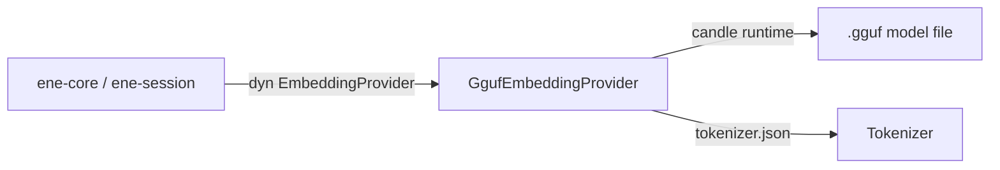

# `ene-embedding` — API Reference

> **Crate:** `ene-embedding`  
> **Role:** Local GGUF-format embedding model provider for offline inference.

---

## Overview

`ene-embedding` implements the `EmbeddingProvider` trait (from `ene-provider`) using a locally-loaded GGUF model file. It uses the **candle** ML framework for inference, enabling fully offline embedding generation with no external API calls.

This is the recommended embedding backend for privacy-sensitive or air-gapped deployments.



---

## `GgufEmbeddingProvider`

```rust
pub struct GgufEmbeddingProvider { /* opaque */ }
```

Implements `EmbeddingProvider`. Loads a GGUF model and its accompanying
`tokenizer.json` at construction time. Inference runs synchronously on
CPU (or accelerated hardware, if available via candle features).

This type is not typically constructed directly — use
[`create_local_provider`](#create_local_provider) instead.

**Implemented trait methods:**

| Method | Notes |
|--------|-------|
| `embed(text, kind)` | Embeds with an optional kind-specific prefix (model-dependent). The `Query` and `Hyde` kinds use a `"Query: "` prefix; other kinds use `"Document: "`. |
| `embed_query(text)` | Shorthand for `embed(text, EmbeddingKind::Query)`. |
| `embed_batch(items)` | Embeds all items sequentially (currently one inference call per item, with parallel decode for HyDE). |
| `dimensions()` | Returns the output vector size (set from model metadata). |
| `model_name()` | Returns `"{model}@{quantization}"` (e.g. `Qwen3-Embedding-0.6B@Q4_K_M`). |

---

## Factory Functions

### `resolve_gguf_paths`

```rust
pub fn resolve_gguf_paths(
    model: &str,
    quantization: &str,
    model_dir: PathBuf,
) -> Result<(PathBuf, PathBuf), EneEmbeddingError>
```

Resolves the paths to a GGUF model file and its tokenizer given a
model name, quantization suffix, and search directory. Note that
`model_dir` is consumed by value.

**Returns:** `(model_path, tokenizer_path)` on success.

**Example path resolution:**

```
model_dir/
├── Qwen3-Embedding-0.6B.Q4_K_M.gguf   ← model file
└── tokenizer.json                        ← tokenizer
```

Call with `model = "Qwen3-Embedding-0.6B"`, `quantization = "Q4_K_M"`.

> **Note:** The local loader is currently hardcoded for the
> `Qwen3-Embedding` family (see `crates/ene-embedding/src/quantized/loader.rs`,
> which reads `qwen3.*` GGUF metadata keys). Other architectures
> (e.g. Nomic, BGE) are not supported by the local provider; use
> `CloudEmbeddingProvider` from `ene-provider` for those.

### `create_local_provider`

```rust
pub fn create_local_provider(
    model: &str,
    quantization: &str,
    model_dir: PathBuf,
) -> Result<Box<dyn ene_provider::EmbeddingProvider>, EneEmbeddingError>
```

The primary entry point. Resolves paths via `resolve_gguf_paths`, loads
the GGUF model and tokenizer, and returns a boxed `EmbeddingProvider`.
Note that `model_dir` is consumed by value (`PathBuf`).

**Fixed parameters:**
- `max_length = 8192` — maximum token sequence length.

**Runtime requirement:** the returned provider's forward pass uses
`tokio::task::block_in_place` to call into Candle (synchronous and
CPU-bound). `block_in_place` requires a **multi-thread tokio runtime**;
it panics on a `current_thread` runtime. Plain `#[tokio::main] async fn main()`
uses the multi-thread flavor by default, so it is the simplest correct
setup. If you build a runtime explicitly, use
`tokio::runtime::Builder::new_multi_thread().enable_all().build()`.

**Example:**

```rust
use ene_embedding::create_local_provider;
use std::path::PathBuf;

let provider = create_local_provider(
    "Qwen3-Embedding-0.6B",
    "Q4_K_M",
    PathBuf::from("/models"),
)?;

println!("Dimensions: {}", provider.dimensions());
println!("Model: {}", provider.model_name());
```

---

## Error Type

### `EneEmbeddingError`

```rust
pub enum EneEmbeddingError {
    /// General embedding error (load, inference, etc.).
    #[error("Embedding error: {0}")]
    EmbeddingError(String),

    /// Error from the Candle ML inference engine.
    #[error("Candle ML error: {0}")]
    CandleError(String),
}

/// Type alias for internal module usages.
pub type EmbeddingError = EneEmbeddingError;
```

`EneEmbeddingError` automatically converts into
`ene_provider::EmbeddingError::Provider(String)` via `From`.

---

## Configuration Integration

To use the local provider via configuration, set the `[embedding]` section in `settings.json`:

```json
{
  "embedding": {
    "backend": "local",
    "model": "Qwen3-Embedding-0.6B",
    "quantization": "Q4_K_M",
    "model_dir": "/path/to/models"
  }
}
```

Or via environment variable:

```sh
ENE_EMBEDDING__BACKEND=local
ENE_EMBEDDING__MODEL=Qwen3-Embedding-0.6B
ENE_EMBEDDING__QUANTIZATION=Q4_K_M
ENE_EMBEDDING__MODEL_DIR=/path/to/models
```

---

## Performance Notes

- **First call:** The model is loaded into memory on the first inference call. Subsequent calls reuse the loaded weights.
- **Throughput:** Suitable for interactive use (single-query latency ~10–100 ms on modern CPUs for Q4 quantizations). Not optimized for high-throughput batch workloads.
- **Memory:** A Q4_K_M quantized 137M-parameter model uses approximately 70–100 MB of RAM.

---

## See Also

- [`ene-provider`](./ene-provider.md) — `EmbeddingProvider` trait definition
- [`ene-memory`](./ene-memory.md) — Uses embeddings for vector search
- [`ene-config`](./ene-config.md) — Configures the embedding backend
