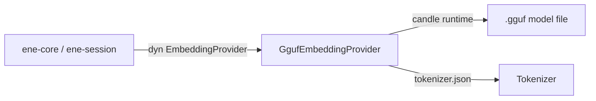

# `ene-embedding` — API Reference

> **Crate:** `ene-embedding`  
> **Role:** Local GGUF-format embedding model provider for offline inference.

---

## Overview

`ene-embedding` implements the `EmbeddingProvider` trait (from `ene-provider`) using a locally-loaded GGUF model file. It uses the **candle** ML framework for inference, enabling fully offline embedding generation with no external API calls.

This is the recommended embedding backend for privacy-sensitive or air-gapped deployments.



---

## `GgufEmbeddingProvider`

```rust
pub struct GgufEmbeddingProvider { /* opaque */ }
```

Implements `EmbeddingProvider`. Loads a GGUF model and its accompanying `tokenizer.json` at construction time. Inference runs synchronously on CPU (or accelerated hardware, if available via candle features).

This type is not typically constructed directly — use [`create_local_provider`](#create_local_provider) instead.

**Implemented trait methods:**

| Method | Notes |
|--------|-------|
| `embed(text, kind)` | Embeds with an optional kind-specific prefix (model-dependent). |
| `embed_query(text)` | Shorthand for `embed(text, EmbeddingKind::Query)`. |
| `embed_batch(items)` | Embeds all items sequentially (batched into single inference calls where possible). |
| `hyde(query)` | Not directly inferred; falls back to embedding the query directly when HyDE is not supported by the loaded model. |
| `rerank(query, candidates)` | Scores each candidate's text fields against the query using cosine similarity of their embeddings. |
| `dimensions()` | Returns the output vector size (set from model metadata). |
| `model_name()` | Returns the GGUF filename stem as the model identifier. |

---

## Factory Functions

### `resolve_gguf_paths`

```rust
pub fn resolve_gguf_paths(
    model: &str,
    quantization: &str,
    model_dir: &Path,
) -> Result<(PathBuf, PathBuf), EneEmbeddingError>
```

Resolves the paths to a GGUF model file and its tokenizer given a model name, quantization suffix, and search directory.

**Returns:** `(model_path, tokenizer_path)` on success.

**Example path resolution:**

```
model_dir/
├── nomic-embed-text-v1.5.Q4_K_M.gguf   ← model file
└── tokenizer.json                        ← tokenizer
```

Call with `model = "nomic-embed-text-v1.5"`, `quantization = "Q4_K_M"`.

### `create_local_provider`

```rust
pub fn create_local_provider(
    model: &str,
    quantization: &str,
    model_dir: &Path,
) -> Result<Box<dyn EmbeddingProvider>, EneEmbeddingError>
```

The primary entry point. Resolves paths via `resolve_gguf_paths`, loads the GGUF model and tokenizer, and returns a boxed `EmbeddingProvider`.

**Fixed parameters:**
- `max_length = 8192` — maximum token sequence length.

**Example:**

```rust
use ene_embedding::create_local_provider;
use std::path::Path;

let provider = create_local_provider(
    "nomic-embed-text-v1.5",
    "Q4_K_M",
    Path::new("/models"),
)?;

println!("Dimensions: {}", provider.dimensions());
println!("Model: {}", provider.model_name());
```

---

## Error Type

### `EneEmbeddingError`

```rust
pub enum EneEmbeddingError {
    /// Model or tokenizer file not found or could not be opened.
    ModelNotFound { path: PathBuf },

    /// Failed to load the GGUF model (format error, corruption, etc.)
    LoadFailed(String),

    /// Inference failed.
    InferenceFailed(String),

    /// The tokenizer file could not be parsed.
    TokenizerError(String),
}
```

---

## Configuration Integration

To use the local provider via configuration, set the `[embedding]` section in `settings.json`:

```json
{
  "embedding": {
    "backend": "local",
    "model": "nomic-embed-text-v1.5",
    "quantization": "Q4_K_M",
    "model_dir": "/path/to/models"
  }
}
```

Or via environment variable:

```sh
ENE_EMBEDDING__BACKEND=local
ENE_EMBEDDING__MODEL=nomic-embed-text-v1.5
ENE_EMBEDDING__QUANTIZATION=Q4_K_M
ENE_EMBEDDING__MODEL_DIR=/path/to/models
```

---

## Performance Notes

- **First call:** The model is loaded into memory on the first inference call. Subsequent calls reuse the loaded weights.
- **Throughput:** Suitable for interactive use (single-query latency ~10–100 ms on modern CPUs for Q4 quantizations). Not optimized for high-throughput batch workloads.
- **Memory:** A Q4_K_M quantized 137M-parameter model uses approximately 70–100 MB of RAM.

---

## See Also

- [`ene-provider`](./ene-provider.md) — `EmbeddingProvider` trait definition
- [`ene-memory`](./ene-memory.md) — Uses embeddings for vector search
- [`ene-config`](./ene-config.md) — Configures the embedding backend
