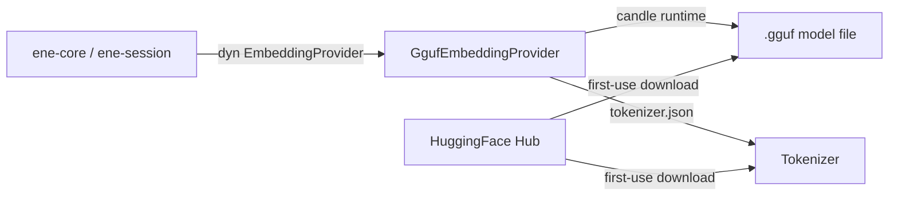

# `ene-embedding` — API Reference

> **Crate:** `ene-embedding`
> **Role:** Local GGUF-format embedding model provider for offline inference.

---

## Overview

`ene-embedding` implements the `EmbeddingProvider` trait (from `ene-provider`) using a locally-loaded GGUF model file, running inference through the **candle** ML framework. Once the model weights are on disk, embedding generation is fully offline with no external API calls.

This is the recommended embedding backend for privacy-sensitive or air-gapped deployments — after the one-time model download.



> **Model support note:** the loader (`crates/ene-embedding/src/quantized/loader.rs`) reads `qwen3.*` GGUF metadata keys, so it only understands GGUF files whose metadata matches that layout. [`resolve_gguf_paths`](#resolve_gguf_paths) currently only knows how to fetch two model families — the Jina v5 retrieval models — which happen to ship GGUF metadata in this format. Other architectures (e.g. Nomic, BGE) are not supported by this crate; use `CloudEmbeddingProvider` from `ene-provider` for those.

---

## Types

### `GgufEmbeddingProvider`

```rust
pub struct GgufEmbeddingProvider { /* opaque */ }
```

Implements `EmbeddingProvider`. Loads a GGUF model and its accompanying `tokenizer.json` at construction time. Inference runs synchronously on CPU via `tokio::task::block_in_place`.

| Method | Signature | Description |
|---|---|---|
| `load` | `fn load(model_name: &str, gguf_path: &str, tokenizer_path: &str, max_length: usize, quantization: &str) -> Result<Self, EmbeddingError>` | Loads a GGUF embedding model directly from local file paths. `model_name` and `quantization` are only used to build the display name returned by `model_name()` (`"{model_name}@{quantization}"`) — the actual weights and architecture come entirely from `gguf_path`. |

Constructing this type directly with `load` is useful when you already have the GGUF/tokenizer files on disk (e.g. a pre-downloaded Qwen3-architecture model) and want to skip HF Hub resolution entirely. Otherwise, prefer [`create_local_provider`](#create_local_provider).

**Implemented `EmbeddingProvider` trait methods:**

| Method | Notes |
|---|---|
| `embed(text, kind)` | Embeds with a kind-specific prefix: `Query` and `Hyde` use `"Query: "`; every other `EmbeddingKind` uses `"Document: "`. Returns `EmbeddingError::EmptyInput` for empty/whitespace-only text, or if tokenization yields zero tokens. |
| `embed_query(text)` | Shorthand for `embed(text, EmbeddingKind::Query)`. |
| `embed_batch(items)` | Embeds all items sequentially inside a single `block_in_place` closure (not parallel); short-circuits on the first `EmptyInput`. |
| `dimensions()` | Returns the output vector size, taken from the GGUF model's hidden size. |
| `model_name()` | Returns `"{model_name}@{quantization}"` (e.g. `jina-embeddings-v5-text-small@F16`). |

---

## Functions

### `resolve_gguf_paths`

```rust
pub fn resolve_gguf_paths(
    model_name: &str,
    quantization: &str,
    model_dir: PathBuf,
) -> Result<(PathBuf, PathBuf), EmbeddingError>
```

**Downloads the model from the HuggingFace Hub** (via `hf_hub::HFClient`, cached under `model_dir`) — it does **not** scan `model_dir` for pre-existing files by name pattern. If the files are already cached, the HF Hub client reuses them; otherwise it fetches them over the network on this call.

Supported `model_name` values (mapped to specific HF repos under the `jinaai` org):

| `model_name` | HF repo |
|---|---|
| `"jina-embeddings-v5-text-nano"` | `jinaai/jina-embeddings-v5-text-nano-retrieval` |
| `"jina-embeddings-v5-text-small"` | `jinaai/jina-embeddings-v5-text-small-retrieval` |

Any other `model_name` returns `EneEmbeddingError::CandleError` with a message listing the supported models.

For `"jina-embeddings-v5-text-small"`, `quantization` selects one of a fixed set of GGUF filenames (`F16`, `Q8_0`, `Q4_K_M`, `Q4_K_S`, `Q5_K_M`, `Q2_K`, `IQ4_XS`; unknown values fall back to `F16` with a warning). For `"jina-embeddings-v5-text-nano"`, the filename is built directly as `"v5-nano-retrieval-{quantization}.gguf"` (no validation against a known list). The tokenizer file is always `tokenizer.json` from the same repo.

**Returns:** `(gguf_path, tokenizer_path)` on success — both pointing into the HF Hub cache under `model_dir`.

### `create_local_provider`

```rust
pub fn create_local_provider(
    model: &str,
    quantization: &str,
    model_dir: PathBuf,
) -> Result<Box<dyn ene_provider::EmbeddingProvider>, EneEmbeddingError>
```

The primary entry point. Resolves and downloads (if needed) the model files via [`resolve_gguf_paths`](#resolve_gguf_paths), then loads them via [`GgufEmbeddingProvider::load`](#ggufembeddingprovider), and returns a boxed `EmbeddingProvider`. `model_dir` is consumed by value.

**Fixed parameters:**
- `max_length = 8192` — maximum token sequence length.

**Runtime requirement:** both `resolve_gguf_paths` (which does an async HF Hub download via `block_in_place` + `block_on`) and the returned provider's forward pass (candle inference via `block_in_place`) require a **multi-thread tokio runtime**. Both panic on a `current_thread` runtime or outside any runtime.

```rust,no_run
// CORRECT
let rt = tokio::runtime::Builder::new_multi_thread()
    .enable_all()
    .build()?;
// INCORRECT — panics inside resolve_gguf_paths / embed_query:
let rt = tokio::runtime::Builder::new_current_thread()
    .enable_all()
    .build()?;
# Ok::<(), Box<dyn std::error::Error>>(())
```

The `#[tokio::main]` macro on a `fn main()` uses the multi-thread flavor by default, so plain `#[tokio::main] async fn main()` is the simplest correct setup.

---

## Errors

### `EneEmbeddingError`

```rust
pub enum EneEmbeddingError {
    /// Error from the Candle ML inference engine (model load, forward pass, tokenizer, or HF Hub download failure).
    CandleError(String),
    /// A pre-existing typed embedding error, propagated unchanged.
    Provider(ene_provider::EmbeddingError),
}

/// Type alias for internal module usages.
pub type EmbeddingError = EneEmbeddingError;
```

| Variant | When it occurs |
|---|---|
| `CandleError(String)` | Model/tokenizer load failure, tensor/dequantization failure, missing GGUF metadata key, or an HF Hub download error (network failure, unknown model name, unsupported quantization file). |
| `Provider(ene_provider::EmbeddingError)` | An error already typed as `ene_provider::EmbeddingError` (e.g. `EmptyInput`) is passed through unchanged rather than re-wrapped as a string. |

`EneEmbeddingError` converts into `ene_provider::EmbeddingError` via `From`:

```rust
impl From<EneEmbeddingError> for ene_provider::EmbeddingError {
    fn from(e: EneEmbeddingError) -> Self {
        match e {
            EneEmbeddingError::CandleError(msg) => ene_provider::EmbeddingError::Init(msg),
            EneEmbeddingError::Provider(inner) => inner,
        }
    }
}
```

That is, an unstructured Candle-side failure becomes `EmbeddingError::Init`, while a structured error (like `EmptyInput`) survives the round trip unchanged. See [`ene-provider`](./ene-provider.md#embeddingerror) for the full `EmbeddingError` variant list.

---

## Configuration Integration

The local backend is selected and parameterized through `ene-provider`'s `EmbeddingConfig` (see [`ene-provider`](./ene-provider.md) and [`ene-config`](./ene-config.md)). `ene-core` reads this config and calls `create_local_provider` with `ene_config::models_dir()` (`assets/models`) as `model_dir`:

```json
{
  "provider": {
    "embedding": {
      "backend": "local",
      "local": {
        "model": "jina-embeddings-v5-text-small",
        "quantization": "F16"
      }
    }
  }
}
```

Or via environment variable:

```sh
ENE_PROVIDER__EMBEDDING__BACKEND=local
ENE_PROVIDER__EMBEDDING__LOCAL__MODEL=jina-embeddings-v5-text-small
ENE_PROVIDER__EMBEDDING__LOCAL__QUANTIZATION=F16
```

`"local"` is not the config default — the default `backend` is `"cloud"` (see [`ene-provider`](./ene-provider.md)).

---

## Performance Notes

- **First call:** the GGUF file and tokenizer are downloaded from the HF Hub cache (or fetched over the network on a true first run) and then loaded into memory on the first inference call. Subsequent calls reuse the loaded weights.
- **Throughput:** suitable for interactive use; batch embedding runs strictly sequentially inside one `block_in_place` call (no intra-batch parallelism). Not optimized for high-throughput batch workloads.
- **Memory:** varies by model size and quantization; smaller quantizations (`Q4_K_M`, `Q2_K`) trade accuracy for a much smaller memory footprint than `F16`.

---

## Usage

### Loading the default local provider via `create_local_provider`

```rust,no_run
use ene_embedding::create_local_provider;
use ene_provider::EmbeddingProvider;
use std::path::PathBuf;

#[tokio::main] // multi-thread by default — required, see Runtime requirement above
async fn main() -> Result<(), Box<dyn std::error::Error>> {
    let provider = create_local_provider(
        "jina-embeddings-v5-text-small",
        "F16",
        PathBuf::from("./models"),
    )?;

    println!("Dimensions: {}", provider.dimensions());
    println!("Model: {}", provider.model_name());

    let embedding = provider.embed_query("What is the capital of France?").await?;
    println!("Embedding length: {}", embedding.len());
    Ok(())
}
```

### Resolving paths and loading a `GgufEmbeddingProvider` directly

```rust,no_run
use ene_embedding::{GgufEmbeddingProvider, resolve_gguf_paths};
use ene_provider::{EmbeddingProvider, cosine_similarity};
use std::path::PathBuf;

#[tokio::main]
async fn main() -> Result<(), Box<dyn std::error::Error>> {
    let model_name = "jina-embeddings-v5-text-small";
    let quantization = "F16";
    let model_dir = PathBuf::from("./models");

    let (gguf_path, tokenizer_path) = resolve_gguf_paths(model_name, quantization, model_dir)?;

    let provider = GgufEmbeddingProvider::load(
        model_name,
        gguf_path.to_str().unwrap_or(""),
        tokenizer_path.to_str().unwrap_or(""),
        /* max_length */ 8192,
        quantization,
    )?;

    let a = provider.embed_query("The cat sat on the mat.").await?;
    let b = provider.embed_query("A feline rested on a rug.").await?;
    println!("similarity: {}", cosine_similarity(&a, &b));
    Ok(())
}
```

---

## See Also

- [`ene-provider`](./ene-provider.md) — `EmbeddingProvider` trait, `EmbeddingError`, `EmbeddingConfig`
- [`ene-memory`](./ene-memory.md) — Uses embeddings for vector search
- [`ene-config`](./ene-config.md) — `models_dir()` and settings loading
