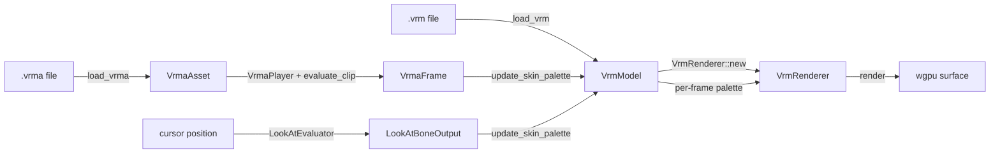

# `ene-vrm` — API Reference

> **Crate:** `ene-vrm`
> **Role:** VRM 1.0 model loader + MToon renderer for `ene-desktop`, built on `wgpu`.

---

## Overview

`ene-vrm` reads a `.vrm` (glTF-binary + `VRMC_vrm` extension) file from disk, uploads every mesh primitive to the GPU, and renders it with a wgpu pipeline that approximates VRM's MToon toon shading. It is platform-agnostic: the crate owns no window or event loop — `ene-desktop` supplies the `wgpu::Device`/`Queue`/surface and drives the per-frame update loop.



Responsibilities at a glance:

- **`loader`** — parse `.vrm`, upload GPU buffers/textures, build all derived registries (humanoid, look-at, expressions, spring bones, node constraints).
- **`model`** — the loaded, GPU-resident `VrmModel` plus the CPU-side node hierarchy used to drive skeletal animation.
- **`renderer`** — the wgpu pipelines, bind groups, and draw loop.
- **`expression` / `expression_override`** — blend-shape (morph target) weights and VRM's procedural-expression override rules.
- **`humanoid` / `look_at` / `animation` / `spring_bone` / `node_constraint`** — the VRM 1.0 extension data that drives bones each frame.
- **`mtoon`** — parsed MToon shading parameters and their GPU uniform mirror.
- **`camera` / `post_process` / `debug_renderer`** — small rendering utilities consumed by `ene-desktop`.

This document focuses on the entry points and types a desktop host actually calls. Internal WGSL bind-group plumbing and shader-layout constants are omitted except where they affect a public API's contract.

---

## Supported API vs. Internal

| Category | Symbols | Notes |
|---|---|---|
| **Supported (use `prelude`)** | `load_vrm`, `VrmModel`, `VrmRenderer`, `VrmError`, `VrmaAsset`, `VrmaPlayer`, `VrmaFrame`, `evaluate_clip`, `load_vrma`, `LookAtEvaluator`, `LookAtProperties`, `ExpressionLayer`, `ExpressionName` | Curated in [`ene_vrm::prelude`](../../crates/ene-vrm/src/prelude.rs). Start here for new host code. |
| **Supported (desktop also uses)** | `camera::*`, `debug_renderer::*`, `humanoid::*`, `spring_bone::SpringBoneSimulator`, `spring_bone::SpringBoneProperties`, `model::{NodeHierarchy, Skeleton, MeshVertex}`, `expression_override::apply_overrides` | Not in `prelude` because they are secondary to the core load→render loop, but `ene-desktop` depends on them. |
| **Internal (`#[doc(hidden)]`)** | `load_humanoid_bones`, `load_look_at`, `load_spring_bones`, `load_node_constraints`, `load_expression_overrides`, `load_mtoon_materials`, `texture_flags`, `retarget_rotation`, `quat_to_yaw_pitch`, `HUMANOID_BONE_NAMES`, `MOUTH_TARGET_NAMES`, … | Called from `load_vrm` or the renderer; hidden from rustdoc to keep the public index focused. Still `pub` — some types remain reachable as fields of supported structs. |

### `prelude`

```rust
use ene_vrm::prelude::*;
```

Re-exports the supported subset listed above. Everything else remains importable via `ene_vrm::camera::…`, `ene_vrm::spring_bone::…`, etc., for advanced hosts.

---

## `load_vrm` & `VrmError`

```rust
pub fn load_vrm(
    path: impl AsRef<Path>,
    device: &wgpu::Device,
    queue: &wgpu::Queue,
) -> VrmResult<VrmModel>
```

Reads the `.vrm` file (glTF binary only — `.gltf` + external `.bin` is not supported), verifies the `VRMC_vrm` extension is present, walks **every** glTF `Mesh`/`Primitive` (a VRM 1.0 model typically has ~12 separate meshes — body, hair, face, clothes, accessories), and uploads vertex/index buffers, base-color textures, and the first skin's inverse-bind matrices. It also builds the humanoid bone registry, look-at properties, expression layer + overrides, spring bone properties, and node constraints in one pass. All primitive positions are normalized uniformly so the model's longest AABB axis maps to `1.5` m.

Known scope limits (see the module doc for detail): no per-mesh glTF node transform is applied to raw vertex positions (fine for VRoid-style exports), and MToon's fuller PBR feature set (rim/matcap/outline/emission) is read but only partially reflected in the pipeline selection.

### `VrmError`

```rust
pub enum VrmError {
    Io { path: String, source: std::io::Error },
    Gltf(String),
    NotVrm,
    NoMeshes,
    NoPositions(usize),
    UnsupportedTopology { mesh: usize, primitive: usize },
    TextureDecode(String),
    Wgpu(#[from] wgpu::CreateSurfaceError),
}

pub type VrmResult<T> = Result<T, VrmError>;
```

| Variant | Meaning |
|---|---|
| `Io` | Failed to read the file at `path`. |
| `Gltf` | The `gltf` crate could not parse the binary. |
| `NotVrm` | File parses as glTF but is missing the `VRMC_vrm` extension. |
| `NoMeshes` | The glTF document has zero meshes. |
| `NoPositions` | A mesh (by index) has a primitive with no `POSITION` attribute. |
| `UnsupportedTopology` | A primitive uses a topology other than triangle lists. |
| `TextureDecode` | A material texture (e.g. `KHR_materials_unlit` base color) failed to decode. |
| `Wgpu` | Surface/device creation failure (`#[from] wgpu::CreateSurfaceError`). |

---

## `VrmModel` / `VrmMesh` / `Skeleton` / `NodeHierarchy` / `MeshVertex`

### `VrmModel`

The top-level loaded model — owns all GPU resources plus the CPU-side registries needed to animate it.

```rust
pub struct VrmModel {
    pub meshes: Vec<VrmMesh>,
    pub skeleton: Skeleton,
    pub expressions: ExpressionLayer,
    pub humanoid: HumanoidBoneRegistry,
    pub nodes: NodeHierarchy,
    pub look_at: Option<LookAtProperties>,
    pub expressions_meta: Vec<ExpressionDefinition>,
    pub node_constraints: NodeConstraintRegistry,
    pub spring_bones: Option<SpringBoneProperties>,
    // aabb_min / aabb_max / center / normalize_scale are private;
    // use the accessors below.
}
```

| Method | Signature | Description |
|---|---|---|
| `new` | `fn new(meshes, skeleton, aabb_min, aabb_max, center, normalize_scale, expressions, humanoid, nodes, look_at, expressions_meta, node_constraints, spring_bones) -> Self` | Constructor used by the loader and by test fixtures. |
| `aabb` | `fn aabb(&self) -> ([f32; 3], [f32; 3])` | Raw glTF-space AABB `(min, max)`. |
| `center` | `fn center(&self) -> [f32; 3]` | AABB center in raw glTF space. |
| `normalize_scale` | `fn normalize_scale(&self) -> f32` | `1.5 / max_extent` — the uniform scale folded into the model matrix. |
| `normalized_aabb` | `fn normalized_aabb(&self) -> ([f32; 3], [f32; 3])` | AABB after applying `T(-center) * S(normalize_scale)`. |
| `joint_count` | `fn joint_count(&self) -> usize` | Delegates to `Skeleton::joint_count`. |
| `expressions` / `expressions_mut` | `fn expressions(&self) -> &ExpressionLayer` / `fn expressions_mut(&mut self) -> &mut ExpressionLayer` | Read/write the blend-shape weight map. |
| `look_at` | `fn look_at(&self) -> Option<&LookAtProperties>` | `None` for models without the `VRMC_vrm.lookAt` block (fall back to `LookAtProperties::default()`). |
| **`update_skin_palette`** | `fn update_skin_palette(&mut self, frame: &VrmaFrame, look_at: Option<&LookAtBoneOutput>) -> Vec<Mat4>` | The core per-frame animation entry point — see below. |

#### `VrmModel::update_skin_palette`

Applies one animation frame to the node hierarchy and returns the per-skin-joint palette (`Vec<Mat4>`) ready for `VrmRenderer::update_skin_palette`. Algorithm, in order:

1. **Reset to rest** — copies `nodes.rest_local_rotations`/`rest_local_positions` back into the mutable `local_*` buffers (undoes the previous frame's overrides).
2. **Apply VRMA bone rotations** — for each `(bone_name, rotation)` in `frame.bone_rotations`, looks the bone up via `humanoid.by_name` and overwrites its local rotation. Unknown bone names are silently dropped.
3. **Apply LookAt bone deltas** — for `head`/`leftEye`/`rightEye`, if `look_at` carries a non-identity delta, overwrites the local rotation with `rest_local_rotations[node] * delta`. This runs *after* step 2, so an active LookAt wins over the VRMA's rotation for the same bone.
4. **Walk the hierarchy** — `nodes.compute_world_transforms()` fills `world_rotations`/`world_positions`.
5. **Hips translation** — if `frame.hips_translation` is set and a `hips` humanoid entry exists, adds the delta to the hips' world position and cascades it to every descendant node.
6. **Build the palette** — for each skeleton joint `j`, `palette[j] = joint_world * inverse_bind[j]` (standard glTF skinning identity; collapses to identity at rest).

Returns an empty `Vec` when the model has zero skeleton joints or an empty node hierarchy — the renderer's static identity palette stays in effect and no GPU write is needed.

### `VrmMesh` / `VrmPrimitive`

```rust
pub struct VrmMesh {
    pub primitives: Vec<VrmPrimitive>,
}

pub struct VrmPrimitive {
    pub vertex_buf: wgpu::Buffer,
    pub vertex_count: u32,
    pub index_buf: wgpu::Buffer,
    pub index_count: u32,
    pub vertices: Vec<MeshVertex>,       // CPU-side mirror (raw glTF space)
    pub base_color: Option<Arc<VrmTexture>>,
    pub alpha_mode: AlphaMode,
    pub unlit: bool,
    pub mtoon: Option<MToonMaterial>,
    pub mtoon_textures: Option<Arc<MToonGpuTextures>>,
}
```

One `VrmMesh` per glTF `Mesh` object (body, hair, face, clothes, …); one `VrmPrimitive` per glTF primitive within it. `AlphaMode::render_phase() -> u8` returns `0` for `Opaque`/`Mask` (depth write on) and `1` for `Blend` (depth write off, drawn after opaque).

### `Skeleton`

```rust
pub struct Skeleton {
    pub inverse_bind: Vec<Mat4>,
    pub bind_matrices: Vec<Mat4>, // inverse_bind[i].inverse() — kept for back-compat
    pub joint_to_node: Vec<usize>,
}

impl Skeleton {
    pub fn joint_count(&self) -> usize;
}
```

Loaded from the glTF's first skin. The per-frame skin matrix is always `joint_world * inverse_bind[i]` — **never** `* bind_matrices[i]`, which would double-apply the bind transform.

### `NodeHierarchy`

```rust
pub struct NodeHierarchy {
    pub local_rotations: Vec<Quat>,       // mutated every frame
    pub local_positions: Vec<Vec3>,       // mutated every frame
    pub rest_local_rotations: Vec<Quat>,  // captured at load time
    pub rest_local_positions: Vec<Vec3>,  // captured at load time
    pub parents: Vec<i32>,                // -1 for roots
    pub world_rotations: Vec<Quat>,
    pub world_positions: Vec<Vec3>,
}
```

| Method | Signature | Description |
|---|---|---|
| `len` | `fn len(&self) -> usize` | Number of glTF nodes captured. |
| `is_empty` | `fn is_empty(&self) -> bool` | `true` for malformed models with zero nodes. |
| `compute_world_transforms` | `fn compute_world_transforms(&mut self)` | Walks nodes in glTF (parent-before-child) order, filling `world_rotations`/`world_positions` from `local_*` + `parents`. |

### `MeshVertex`

```rust
#[repr(C)]
pub struct MeshVertex {
    pub position: [f32; 3],
    pub uv: [f32; 2],
    pub normal: [f32; 3],
    pub joints: [u32; 4],   // up to MAX_JOINTS_PER_VERTEX = 4
    pub weights: [f32; 4],  // sum == 1.0
}
```

`MeshVertex::LAYOUT: wgpu::VertexBufferLayout<'static>` is the shared vertex layout constant (attributes `0..=4`, matching `shaders/mtoon_skinned.wgsl`). `MeshVertex::as_bytes(vertices: &[MeshVertex]) -> &[u8]` reinterprets a slice for buffer upload. Models without `JOINTS_0`/`WEIGHTS_0` fall back to `joints = [0,0,0,0]`, `weights = [1,0,0,0]` against a one-element identity `skin[]`.

---

## `VrmRenderer`

```rust
pub struct VrmRenderer { /* wgpu pipelines + bind groups; opaque */ }
```

| Method | Signature | Description |
|---|---|---|
| `new` | `fn new(device: &wgpu::Device, queue: &wgpu::Queue, surface_format: wgpu::TextureFormat, mask_format: Option<wgpu::TextureFormat>, model: &VrmModel) -> Self` | Builds all render pipelines (opaque/transparent × lit/unlit/MToon, plus an optional mask pipeline), bind group layouts, and the skin-matrix storage buffer sized from `model`'s joint count. |
| `render` | `fn render(&self, queue: &wgpu::Queue, encoder: &mut wgpu::CommandEncoder, view: &wgpu::TextureView, depth_view: &wgpu::TextureView, model: &VrmModel, camera: &OrthographicCamera, model_uniform: &ModelUniform, transparent: bool)` | Uploads camera/model uniforms, opens a render pass, and draws every primitive: opaque/mask first (depth write on), then blend (depth write off), routing each primitive to its MToon/unlit/lite pipeline. `transparent` selects the pass clear color. |
| `render_mask` | `fn render_mask(&self, queue: &wgpu::Queue, encoder: &mut wgpu::CommandEncoder, view: &wgpu::TextureView, model: &VrmModel, camera_uniform: &CameraUniform, model_uniform: &ModelUniform)` | Renders a silhouette mask into `view` using the pipeline built from `mask_format`; no-op if the renderer was constructed with `mask_format: None`. |
| **`update_skin_palette`** | `fn update_skin_palette(&self, queue: &wgpu::Queue, palette: &[glam::Mat4])` | Uploads a new skin-matrix palette (from `VrmModel::update_skin_palette`) to the GPU storage buffer. No-op if `palette` is empty or the renderer has zero skin joints. |
| `skin_joint_count` | `fn skin_joint_count(&self) -> u32` | The renderer's compiled-in joint count (`0` for unskinned models). |

The model's base-color texture is bound at group `(2)`; per-primitive morph-target data at group `(3)`; the skin-matrix palette at group `(4)`; MToon per-material uniform and textures at groups `(5)`/`(6)`.

---

## `expression` & `expression_override`

### `ExpressionLayer`

```rust
pub struct ExpressionLayer {
    pub per_primitive: Vec<Option<PrimitiveMorphs>>,
    pub weights: BTreeMap<ExpressionName, f32>,
    pub morph_target_weights: BTreeMap<(usize, usize), f32>,
}
```

| Method | Signature | Description |
|---|---|---|
| `new` | `fn new(per_primitive: Vec<Option<PrimitiveMorphs>>, overrides: Option<&[ExpressionDefinition]>) -> Self` | Seeds `weights` at `0.0` for every known expression name. |
| `expression_names` | `fn expression_names(&self) -> Vec<ExpressionName>` | Sorted, de-duplicated list of every expression the model defines. |
| `set_expression` | `fn set_expression(&mut self, name: &ExpressionName, weight: f32) -> bool` | Clamps to `[0, 1]` and stores it. Returns `false` (and does **not** store) if `name` isn't one of the model's known expressions — prevents a misspelled AI token from silently accumulating. |
| `apply_weights` | `fn apply_weights(&mut self, incoming: &BTreeMap<ExpressionName, f32>)` | Bulk-applies a weight map; unknown names are dropped the same way. Intended to be called once per frame from the desktop app's emotion-application step. |
| `morphic_primitive_count` | `fn morphic_primitive_count(&self) -> usize` | Number of primitives that have at least one morph target. |

`PrimitiveMorphs { primitive_id, node_index, targets: Vec<MorphTarget>, uniform_buffer_len, vertex_count }` holds one primitive's morph targets; `MorphTarget { target_index, position_offsets }` is a single named blend shape's per-vertex displacement. `ExpressionName(pub String)` is a thin newtype key.

### `expression_override`

VRM 1.0 defines procedural expression categories (mouth/lip-sync, blink, gaze) that can be overridden by named expressions.

```rust
pub const MOUTH_TARGET_NAMES: &[&str]; // ["aa", "ih", "ou", "ee", "oh"]
pub const BLINK_TARGET_NAMES: &[&str]; // ["blink", "blinkLeft", "blinkRight"]
pub const GAZE_TARGET_NAMES: &[&str];  // ["lookUp", "lookDown", "lookLeft", "lookRight"]

pub fn is_procedural(name: &str) -> bool;

pub enum ExpressionOverrideType { None, Block, Blend }

pub struct ExpressionOverrideSettings {
    pub mouth: ExpressionOverrideType,
    pub blink: ExpressionOverrideType,
    pub look_at: ExpressionOverrideType,
}

pub struct ExpressionDefinition {
    pub name: ExpressionName,
    pub overrides: ExpressionOverrideSettings,
    pub is_binary: bool,
    pub morph_target_binds: Vec<MorphTargetBind>,
}
```

`load_expression_overrides(gltf: &gltf::Gltf) -> Vec<ExpressionDefinition>` parses the `VRMC_vrm.expressions.{preset,custom}.<name>` tree at load time. `apply_overrides(weights: &mut BTreeMap<ExpressionName, f32>, defs: &[ExpressionDefinition])` applies `Block`/`Blend` semantics in-place: `Block` zeroes the procedural target while any overriding expression is active; `Blend` scales it by `1 − sum(overriding weights)`.

---

## Humanoid Bones (`humanoid`)

```rust
pub struct VrmBone(pub String); // canonical lower-case name, e.g. "hips"

pub struct BoneRestTransform {
    pub translation: Vec3,
    pub rotation: Quat,
}

pub struct HumanoidBoneEntry {
    pub node: usize,           // glTF node index (always set)
    pub joint: Option<usize>,  // index into Skeleton::inverse_bind, if skinned
    pub rest: BoneRestTransform,
}

pub struct HumanoidBoneRegistry { /* map + insertion order */ }
```

| Method | Signature | Description |
|---|---|---|
| `new` | `fn new() -> Self` | Empty registry. |
| `insert` | `fn insert(&mut self, bone: VrmBone, entry: HumanoidBoneEntry) -> bool` | Registers a bone. |
| `lookup` | `fn lookup(&self, bone: &VrmBone) -> Option<&HumanoidBoneEntry>` | Exact `VrmBone` key lookup. |
| `by_name` | `fn by_name(&self, raw_name: &str) -> Option<&HumanoidBoneEntry>` | Canonicalizes `raw_name` first — the lookup path used by `update_skin_palette`, LookAt, and spring bones. |
| `head` / `hips` / `chest` / `jaw` / `left_eye` / `right_eye` | `fn head(&self) -> Option<&HumanoidBoneEntry>` (etc.) | Convenience accessors for the most commonly consumed bones. |
| `iter` / `names` / `len` / `is_empty` | — | Standard collection accessors. |

`HUMANOID_BONE_NAMES: &[&str]` lists all 55 spec bone names. `canonicalize_bone_name(raw: &str) -> Option<VrmBone>` normalizes arbitrary casing/spacing to the canonical form. `load_humanoid_bones(gltf: &gltf::Gltf, skel: &Skeleton) -> HumanoidBoneRegistry` builds the registry from `VRMC_vrm.humanoid.humanBones`, empty for models lacking humanoid metadata (e.g. legacy VRM 0.x).

---

## `look_at`

```rust
pub struct LookAtProperties {
    pub offset_from_head_bone: [f32; 3], // default (0, 0.06, 0)
    pub range_map: LookAtRangeMapSet,
    pub look_at_type: LookAtType,        // Bone (default) | Expression
}
```

`LookAtType::Bone` drives `head`/`leftEye`/`rightEye` bone rotations; `LookAtType::Expression` drives the four `lookUp`/`lookDown`/`lookLeft`/`lookRight` morph weights instead.

```rust
pub struct LookAtEvaluator { /* built from &LookAtProperties */ }

impl LookAtEvaluator {
    pub fn new(props: &LookAtProperties) -> Self;
    pub fn evaluate(
        &self,
        head_world: Vec3,
        target_world: Vec3,
        head_rest_rotation: Quat,
    ) -> LookAtOutput;
}

pub enum LookAtOutput {
    Bone(LookAtBoneOutput),
    Expression(LookAtExpressionOutput),
}

pub struct LookAtBoneOutput {
    pub head: LookAtBoneDelta,
    pub left_eye: LookAtBoneDelta,
    pub right_eye: LookAtBoneDelta,
}
```

`evaluate` computes the `(yaw, pitch)` from `head_world`/`target_world` (via `calc_yaw_pitch`), passes it through the model's `range_map`, and produces either bone-rotation deltas or morph weights depending on `look_at_type`. The `Bone` variant is what `VrmModel::update_skin_palette`'s `look_at` parameter consumes directly. `load_look_at(gltf: &gltf::Gltf) -> Option<LookAtProperties>` parses the `VRMC_vrm.lookAt` block (`None` for models without it — callers should fall back to `LookAtProperties::default()`).

---

## `animation` (VRMA)

### `load_vrma`

```rust
pub fn load_vrma(path: impl AsRef<Path>) -> VrmResult<VrmaAsset>
```

Reads a `.vrma` file (glTF binary + `VRMC_vrm_animation` extension) and parses its semantic bone/expression/look-at → node mapping plus every glTF `animations[]` clip.

```rust
pub struct VrmaAsset {
    pub properties: VrmaProperties, // bone/expression/lookAt name → glTF node index
    pub clips: Vec<VrmaClip>,       // usually one; spec loads clips[0] by default
    pub node_rest_rotations: Vec<Quat>,
    pub node_rest_positions: Vec<Vec3>,
    pub node_world_rest_rotations: Vec<Quat>,
    pub node_world_rest_positions: Vec<Vec3>,
    pub node_parents: Vec<i32>,
}

pub struct VrmaClip {
    pub name: String,
    pub duration: f32,
    pub bone_channels: HashMap<String, BoneChannel>,
    pub expression_channels: HashMap<String, ExpressionChannel>,
    pub look_at_channel: Option<LookAtChannel>,
}
```

### `evaluate_clip` → `VrmaFrame`

```rust
pub fn evaluate_clip(clip: &VrmaClip, t: f32) -> VrmaFrame

pub struct VrmaFrame {
    pub bone_rotations: HashMap<String, Quat>,
    pub hips_translation: Option<Vec3>,
    pub expression_weights: HashMap<String, f32>,
    pub look_at_yaw_pitch: Option<(f32, f32)>,
}
```

Samples every channel of `clip` at time `t` (`Step`/`Linear`/`CubicSpline` per the sampler's interpolation mode) and returns raw, un-retargeted bone rotations plus clamped expression weights. The caller passes the result straight to `VrmModel::update_skin_palette`. Full pose-difference retargeting across skeletons with different rest poses is available via the free functions `retarget_rotation` and `retarget_hips_translation`, but is not applied automatically — for VRoid-style models sharing a T-pose/A-pose convention, the source local rotation can be used directly.

### `VrmaPlayer`

```rust
pub struct VrmaPlayer {
    pub time: f32,
    pub speed: f32,
    pub playing: bool,
    pub repeat: RepeatMode, // Once | Loop (default)
}
```

| Method | Signature | Description |
|---|---|---|
| `play` / `pause` / `stop` | `fn play(&mut self)` / `fn pause(&mut self)` / `fn stop(&mut self)` | Standard transport controls; `stop` also resets `time` to `0.0`. |
| `seek` | `fn seek(&mut self, time: f32)` | Jump to an absolute time (clamped to `≥ 0`). |
| `advance` | `fn advance(&mut self, dt: f32, duration: f32)` | Advances `time` by `dt * speed`; wraps modulo `duration` for `Loop`, clamps and stops for `Once`. No-op when `!playing` or `duration <= 0.0`. |

Typical per-frame usage: `player.advance(dt, clip.duration)` then `evaluate_clip(&clip, player.time)`.

---

## `spring_bone` (brief)

Simulates VRM 1.0 `VRMC_springBone` soft-body sway (hair, cloth, accessories).

```rust
pub struct SpringBoneProperties { /* colliders, collider groups, spring chains */ }
pub struct SpringBoneChain { pub joints: Vec<SpringBoneJoint>, /* ... */ }
pub struct SpringBoneSimulator { /* per-joint runtime state */ }

pub fn load_spring_bones(gltf: &gltf::Gltf) -> Option<SpringBoneProperties>;
```

`load_spring_bones` parses `VRMC_springBone` at load time (`None` when the extension is absent); the desktop runtime constructs a `SpringBoneSimulator` from `VrmModel::spring_bones` to step the verlet-style joint physics each frame and feed the resulting rotations into the node hierarchy alongside VRMA/LookAt. Default physical constants (`DEFAULT_HIT_RADIUS`, `DEFAULT_STIFFNESS`, `DEFAULT_GRAVITY_POWER`, `DEFAULT_GRAVITY_DIR`, `DEFAULT_DRAG_FORCE`) back-fill missing per-joint spec fields.

---

## `mtoon` (brief)

Parses `VRMC_materials_mtoon` shading parameters per glTF material and mirrors them into GPU-friendly types.

```rust
pub struct MToonMaterial { /* shade color, shading shift/toony, rim, matcap, outline, emissive, uv anim, … */ }
pub struct MToonGpuTextures { /* shade multiply, shading shift, emissive, matcap, rim multiply, outline width, UV anim mask */ }
pub struct MToonUniform { /* byte-for-byte WGSL mirror of MToonMaterial's scalar fields */ }
pub enum OutlineWidthMode { /* None | WorldCoordinates | ScreenCoordinates */ }

pub fn load_mtoon_materials(gltf: &gltf::Gltf) -> Vec<Option<MToonMaterial>>;
```

`VrmPrimitive::mtoon` / `mtoon_textures` are `None` for materials without the extension, in which case `VrmRenderer` falls back to the half-Lambert "lite" shader.

---

## `camera` / `post_process` / `debug_renderer` (brief)

### `camera`

```rust
pub struct OrthographicCamera { /* eye, target, up, viewport_height, aspect */ }
pub struct CameraUniform { pub view_proj: [[f32; 4]; 4], pub camera_pos: [f32; 4] }
pub struct ModelUniform { /* per-frame model matrix uniform */ }
```

Key methods: `OrthographicCamera::look_at(eye, target)`, `set_aspect(aspect)`, `compute_auto_fit_scale(aabb_min, aabb_max, margin) -> f32` (scales an AABB to fit the viewport with padding), and `uniform() -> VrmResult<CameraUniform>` (builds the per-frame view-projection uniform consumed by `VrmRenderer::render`). Free helpers `pixel_to_ndc`, `ndc_to_view_pos[_with_aspect]`, `view_pos_to_world` support cursor-to-world projection for `look_at`.

### `post_process`

```rust
pub struct PostProcessor { /* full-screen pass pipeline + uniforms */ }
```

Applies a full-screen post-processing pass (e.g. compositing the rendered character over a mask/background) using `PostVertex`/`PostUniforms`.

### `debug_renderer`

```rust
pub struct DebugRenderer { /* line-list pipeline */ }
```

Draws debug primitives (bone axes, collider spheres/capsules, look-at crosshairs) as GPU line lists. Helpers `sphere_wireframe_lines_into`, `capsule_wireframe_lines_into`, and `cross_lines` generate `DebugLine`/`DebugVertex` geometry for the spring-bone colliders and look-at target.

---

## `node_constraint` (brief)

Implements `VRMC_node_constraint` (roll/aim/rotation copy constraints between bones), used for accessory rigs (e.g. a hair clip that should aim at another bone).

```rust
pub enum NodeConstraint {
    Rotation { source_node: usize, weight: f32 },
    Roll { source_node: usize, roll_axis: RollAxis, weight: f32 },
    Aim { source_node: usize, aim_axis: AimAxis, weight: f32 },
}

pub struct NodeConstraintRegistry { pub entries: Vec<ConstraintEntry> }

impl NodeConstraintRegistry {
    pub fn evaluate(
        &self,
        node_local_rotations: &HashMap<usize, Quat>,
        node_rest_rotations: &HashMap<usize, Quat>,
        node_world_positions: &HashMap<usize, Vec3>,
        node_parent_world_rotations: &HashMap<usize, Quat>,
    ) -> HashMap<usize, Quat>;
}

pub fn load_node_constraints(/* … */) -> NodeConstraintRegistry;
```

`evaluate` returns a `HashMap<dest_node, new_local_rotation>` the caller applies on top of the base VRMA/LookAt result before building the skin palette.

---

## Usage Sketch

```rust,no_run
use std::path::Path;
use std::time::Duration;

use ene_vrm::{
    animation::{VrmaClip, VrmaPlayer, evaluate_clip},
    load_vrm, ModelUniform, OrthographicCamera, VrmModel, VrmRenderer,
};

fn setup(
    device: &wgpu::Device,
    queue: &wgpu::Queue,
    surface_format: wgpu::TextureFormat,
) -> Result<(VrmModel, VrmRenderer), Box<dyn std::error::Error>> {
    // 1. Load the model and build the renderer once.
    let model = load_vrm(Path::new("assets/models/character.vrm"), device, queue)?;
    let renderer = VrmRenderer::new(device, queue, surface_format, None, &model);
    Ok((model, renderer))
}

fn per_frame(
    model: &mut VrmModel,
    renderer: &VrmRenderer,
    queue: &wgpu::Queue,
    encoder: &mut wgpu::CommandEncoder,
    view: &wgpu::TextureView,
    depth_view: &wgpu::TextureView,
    camera: &OrthographicCamera,
    player: &mut VrmaPlayer,
    clip: &VrmaClip,
    dt: Duration,
) {
    // 2. Advance animation playback and sample a frame.
    player.advance(dt.as_secs_f32(), clip.duration);
    let frame = evaluate_clip(clip, player.time);

    // 3. Recompute the skin palette for this frame (LookAt omitted here).
    let palette = model.update_skin_palette(&frame, None);
    renderer.update_skin_palette(queue, &palette);

    // 4. Draw.
    let model_uniform = ModelUniform::default();
    renderer.render(
        queue,
        encoder,
        view,
        depth_view,
        model,
        camera,
        &model_uniform,
        /* transparent */ true,
    );
}
```

---

## See Also

- [`ene-desktop` Application](../applications/desktop.md) — How the desktop runtime drives `ene-vrm` (window/event loop, per-frame update, AI bridge integration)
