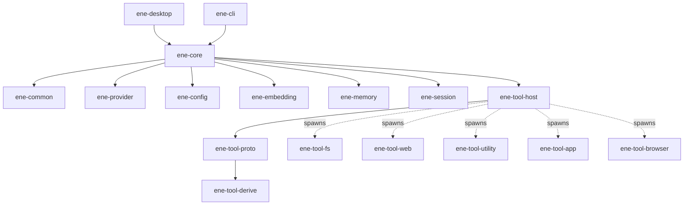

# Ene API Reference

> API Reference for the Ene crate library.

This section documents the public APIs of every library crate in the Ene workspace.
All crates target **Rust edition 2024** and are compiled with `tokio` as the async runtime.

---

## Crates

| Crate | Description | Docs |
|---|---|---|
| [`ene-core`](ene-core.md) | Actor-based runtime facade. Main entry point for all host applications. | [→](ene-core.md) |
| [`ene-provider`](ene-provider.md) | LLM and embedding provider traits and implementations. | [→](ene-provider.md) |
| [`ene-session`](ene-session.md) | Conversation session management and session splitting. | [→](ene-session.md) |
| [`ene-memory`](ene-memory.md) | SQLite vector memory store (summaries, facts, tool index). | [→](ene-memory.md) |
| [`ene-config`](ene-config.md) | Configuration loading, character cards, CBS macros. | [→](ene-config.md) |
| [`ene-embedding`](ene-embedding.md) | Local GGUF embedding provider via candle. | [→](ene-embedding.md) |
| [`ene-common`](ene-common.md) | Low-level shared utilities (`Truncate` trait). | [→](ene-common.md) |
| [`ene-tool-host`](ene-tool-host.md) | Tool process lifecycle, IPC client, and Tool RAG pipeline. | [→](ene-tool-host.md) |
| [`ene-tool-proto`](ene-tool-proto.md) | IPC wire protocol — `ToolSpec`, `IpcRequest`/`IpcResponse`, `ToolError`. | [→](ene-tool-proto.md) |
| [`ene-tool-common`](ene-tool-common.md) | `ToolAction` trait and helpers for tool binaries. | [→](ene-tool-common.md) |
| [`ene-tool-derive`](ene-tool-derive.md) | Proc-macros: `#[derive(ToolSpec)]`, `#[derive(ToolAction)]`. | [→](ene-tool-derive.md) |
| [`ene-tool-db`](ene-tool-db.md) | Typed CRUD database client for tool binaries via IPC. | [→](ene-tool-db.md) |

---

## Dependency Graph

The diagram below shows the compile-time dependencies between crates. Dashed arrows (`-.->`) indicate runtime process spawning rather than a crate dependency.



The standalone tool binaries (`ene-tool-fs`, `ene-tool-web`, etc.) each depend on:

```
ene-tool-common → ene-tool-proto → ene-tool-derive
                ↘
                  ene-tool-db  (optional, for persistent state)
```

---

## Re-export Convention

When a crate re-exports an item from another workspace crate in its public API, it must annotate the re-export with `#[doc(no_inline)]`. This ensures that generated rustdoc links point back to the *original* crate's documentation page rather than duplicating it.

```rust
// In ene-tool-common/src/lib.rs
#[doc(no_inline)]
pub use ene_tool_proto::{ToolSpec, ToolError, IpcRequest, IpcResponse};
```

---

## Related Documentation

- [Architecture Overview](../architecture/overview.md) — Actor system, data flow, and crate relationships
- [Memory System](../memory/overview.md) — SQLite + sqlite-vec design and Diesel rules
- [Tool System](../tools/overview.md) — Writing tools, RAG pipeline, sandbox
- [Configuration](../configuration/settings.md) — Figment loading order and field reference
