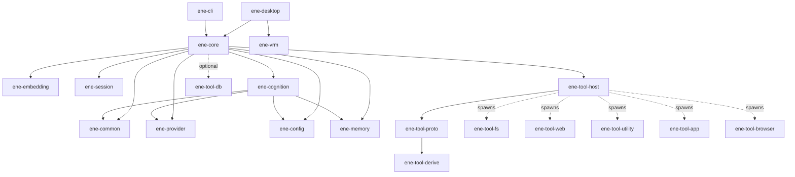

# Ene API Reference

> API Reference for the Ene crate library.

This section documents the public APIs of every library crate in the Ene workspace.
All crates target **Rust edition 2024** and are compiled with `tokio` as the async runtime.

---

## Crates

| Crate | Description | Docs |
|---|---|---|
| [`ene-core`](ene-core.md) | Actor-based runtime facade. Main entry point for all host applications. | [→](ene-core.md) |
| [`ene-cognition`](ene-cognition.md) | Cognitive runtime — Identity Kernel, typed memory, affect, expression arbitration, prompt packets, commitments. | [→](ene-cognition.md) |
| [`ene-provider`](ene-provider.md) | LLM and embedding provider traits and implementations. | [→](ene-provider.md) |
| [`ene-session`](ene-session.md) | Conversation session management and session splitting. | [→](ene-session.md) |
| [`ene-memory`](ene-memory.md) | SQLite vector memory store (summaries, facts, tool index). | [→](ene-memory.md) |
| [`ene-config`](ene-config.md) | Configuration loading, character cards, CBS macros. | [→](ene-config.md) |
| [`ene-embedding`](ene-embedding.md) | Local GGUF embedding provider via candle. | [→](ene-embedding.md) |
| [`ene-vrm`](ene-vrm.md) | VRM 1.0 model loader + MToon renderer for `ene-desktop` (wgpu). | [→](ene-vrm.md) |
| [`ene-common`](ene-common.md) | Low-level shared utilities (`Truncate` unit struct). | [→](ene-common.md) |
| [`ene-tool-host`](ene-tool-host.md) | Tool process lifecycle, IPC client, and Tool RAG pipeline. | [→](ene-tool-host.md) |
| [`ene-tool-proto`](ene-tool-proto.md) | IPC wire protocol — `ToolSpec`, `IpcRequest`/`IpcResponse`, `ToolError`. | [→](ene-tool-proto.md) |
| [`ene-tool-common`](ene-tool-common.md) | `ToolAction` trait and helpers for tool binaries. | [→](ene-tool-common.md) |
| [`ene-tool-derive`](ene-tool-derive.md) | Proc-macros: `#[derive(ToolSpec)]`, `#[derive(ToolAction)]`. | [→](ene-tool-derive.md) |
| [`ene-tool-db`](ene-tool-db.md) | Typed CRUD database client for tool binaries via IPC. | [→](ene-tool-db.md) |

---

## Dependency Graph

The diagram below shows the compile-time dependencies between crates. Dashed arrows (`-.->`) indicate runtime process spawning rather than a crate dependency.



`ene-core` links `ene-tool-db` only to open the shared per-tool DB IPC server socket (see [`ene-core`'s `db_server` module](./ene-core.md#db_server)); it is not used for the core's own persistence, hence the dashed "optional" edge above.

The standalone tool binaries (`ene-tool-fs`, `ene-tool-web`, etc.) each depend on:

```
ene-tool-common → ene-tool-proto → ene-tool-derive
                ↘
                  ene-tool-db  (optional, for persistent state)
```

---

## Re-export Convention

When a crate re-exports an item from another workspace crate in its public API, it must annotate the re-export with `#[doc(no_inline)]`. This ensures that generated rustdoc links point back to the *original* crate's documentation page rather than duplicating it.

```rust
// In ene-tool-common/src/lib.rs
#[doc(no_inline)]
pub use ene_tool_proto::{ToolSpec, ToolError, IpcRequest, IpcResponse};
```

---

## Error & Async Conventions

This is the contract new public APIs are expected to follow (see the [API refactor plan](../architecture/api-refactor-plan.md), item 3). Existing code is already mostly compliant; the checklist below exists so **new** APIs don't regress.

### Async

- Every I/O-bound or actor-communicating boundary is `async fn` on the `tokio` runtime. Do not add sync wrappers that block on a runtime (`futures::executor::block_on`, `tokio::runtime::Handle::block_on`, etc.) inside library code.
- `EneHandle`'s few genuinely sync methods (`run`, `cancel`, `decide_permission`, `submit_user_input`, `invalidate_tool_index`, `subscribe`) are fire-and-forget sends over an unbounded `mpsc` channel — they never wait on the actor and return immediately. Everything that needs the actor's answer (`load_config`, `get_snapshot`, `manual_split`, `list_tools`, `call_tool`, `shutdown`, ...) is `async fn` using a `oneshot` reply.
- Traits that cross the async boundary (`LlmProvider`, `EmbeddingProvider`, `MemoryStore`, `ToolAction::execute`, `ToolRegistry::check_boundary`) use `#[async_trait::async_trait]` rather than `impl Future`-returning methods, for consistency across the workspace.

### Errors

- Library boundaries return `async fn ... -> Result<T, E>` where `E` is a `thiserror`-derived enum, not `anyhow::Error`, `String`, or `Box<dyn Error>`. `anyhow` is a dev-dependency (tests, examples) only.
- One public error name per crate, matching the crate name: `EneCoreError`, `EneMemoryError`, `EneCognitionError`, `EneToolHostError`, `EneToolProtoError`, `EneSessionError`, `EneConfigError`, `LlmProviderError`, `EmbeddingError`. A short alias (`ToolError = EneToolProtoError`, `MemoryError = EneMemoryError`, `CognitionError = EneCognitionError`) is acceptable **only** when the short form is already the ubiquitous name used across call sites — don't introduce new short aliases for new crates.
- Narrower, purpose-specific error types are fine alongside the crate-wide enum when they represent a genuinely distinct failure mode with its own `#[error(...)]` message and no useful variants to share (`ActorDeadError`, `ShutdownTimeout`, `DbServerError`). Prefer folding a new error into the crate-wide enum as a variant (`#[from]`) unless it needs to be returned from a narrow, frequently-matched call site on its own.
- Avoid `unwrap()`/`expect()` outside tests — the workspace lints for this (`#![warn(clippy::unwrap_used, clippy::expect_used)]`). Propagate with `?` or handle explicitly.
- Public entry points should not return bare `String` or `Box<dyn std::error::Error>` when callers need to `match` on the failure — type it as a `thiserror` enum instead. `run_tool_server` now returns `Result<(), ToolError>` and `McpToolRegistry::connect_stdio` now returns `Result<(), ToolHostError>` (both previously untyped `Box<dyn Error>` / `String`); keep new tool-ABI code consistent with this rather than reintroducing untyped errors.

---

## Related Documentation

This API reference documents library crates only. Application binaries (`ene-cli`, `ene-desktop`) and standalone tool binaries are **not** duplicated as API pages here — see the links below instead.

- [Architecture Overview](../architecture/overview.md) — Actor system, data flow, and crate relationships
- [Cognitive Runtime Architecture (ADR)](../architecture/cognitive-runtime.md) — Design rationale for `ene-cognition` and the streaming-cognitive dispatch path
- [Memory System](../memory/memory.md) — SQLite + sqlite-vec design, embedding, and summarization
- [Tool System](../tools/overview.md) — Writing tools, RAG pipeline, sandbox
- [Configuration](../configuration/settings.md) — Figment loading order and field reference
- [Applications](../applications/cli.md) — `ene-cli` REPL reference ([Desktop App](../applications/desktop.md) for `ene-desktop`)
