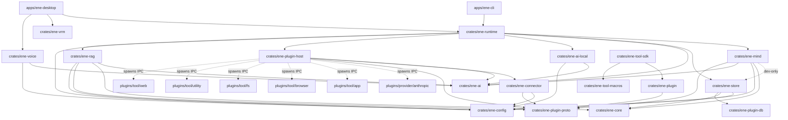

# System Architecture & Design (API v1)

**Ene** is designed around a clean separation of concerns: an actor-based runtime facade (`ene-runtime`), a pure cognitive turn engine (`ene-mind`), an isolated persistence layer (`ene-store`) built on persistence-agnostic domain vocabulary (`ene-core`), a RAG scoring/decay policy layer (`ene-rag`), an out-of-process IPC plugin host (`ene-plugin-host`), and a standalone VRM renderer (`ene-vrm`).

---

## 1. Core Architecture Principles

1. **API v1 Host Contract**: The host application (`ene-cli`, `ene-desktop`, or external integrations) interacts with Ene exclusively through `EneHandle::open`. Turns are identified by a mandatory `TurnId`. Turn execution is single-flight; concurrent execution attempts return `RunError::Busy`. The versioned wire contract is exactly `ene_runtime::public_api`'s `Public*` types (`PublicChatEvent`, `PublicLifecycleEvent`, `PublicSessionMeta`, `PublicExportedMessage`, `PublicApiError`, `API_VERSION`) plus the `EneHandle` methods built entirely from them (`list_sessions`, `export_session`, `import_session`, `search_sessions`, `archive_session`) (#269). No `ene_store` / `ene_mind` / `ene_plugin_proto` type appears in a `Public*` type's fields or in those methods' signatures; internal error enums project into `PublicApiError`'s stable categories via `From` impls, so adding an internal error variant does not break this contract. Other `EneHandle` methods (`subscribe`, `subscribe_lifecycle`, `take_audio_stream`, `diagnostics`, `update_feature_settings`, …) are host-internal wiring, same as the `streaming` / `message_builder` modules, and may freely use internal types. The event bus itself is split into three dedicated channels by traffic class — chat (`EneEvent`, `broadcast`), audio (`AudioChunk`, bounded single-consumer `mpsc`), and lifecycle (`LifecycleEvent`, small-capacity `broadcast`) — so a burst on one channel cannot lag or starve consumers of another (#272).
2. **Actor Execution Model**: `ene-runtime` manages state via an internal Tokio actor. Public methods on `EneHandle` are non-blocking channel sends or oneshot async requests.
3. **Pure Cognitive Mind**: `ene-mind` owns prompt packet composition, hybrid memory recall, affect/emotions (PAD model), proactive speech triggers, and output performance arbitration. `ene-mind` **never** depends on `ene-runtime` or `ene-plugin-host`, and its cognitive-logic modules (recall, memory arbiter, forgetting, character sync, journal, self-reflection) call the persistence layer only through the `ene_core::MemoryPort` trait (#270) — never the concrete `ene_store::MemoryStore` — so they can be unit-tested against an in-memory test double without SQLite.
4. **Isolated Persistence**: `ene-store` owns all SQLite schema, migrations, SeaORM entities, and vector search (`sqlite-vec`). `ene-store` **never** depends on `ene-mind` or `ene-ai`.
5. **Persistence-Agnostic Domain Vocabulary**: `ene-core` defines the core domain types shared across the cognitive and persistence layers — `AffectState` (PAD affect), typed-memory kinds/statuses/queries, the commitment ledger's vocabulary, and the `MemoryPort` trait itself. It depends on nothing internal to the workspace, so both `ene-store` and `ene-mind` can depend on it without either depending on the other for domain vocabulary.
6. **Out-of-Process Plugins (Protocol v4)**: Tools, LLM providers, and MCP servers run as child processes communicating over length-prefixed JSON IPC using **Protocol v4**.
7. **Decoupled 3D Rendering**: `ene-vrm` renders VRM 1.0 models via `wgpu` without importing any cognitive, memory, or runtime types.
8. **Fault-Tolerant Actor (#268)**: Actor commands and background tasks are panic-isolated via `catch_unwind`; a panic in one command does not crash the actor or the process. This is a design invariant, not an incidental property — see [§4](#4-fault-tolerance--panic-isolation) for the mechanism and the build-configuration requirement it depends on.

---

## 2. Workspace Crate Map & Dependency Hierarchy



### Strict Architectural Boundaries
- `ene-core` ↛ `ene-store` / `ene-mind` / `ene-ai` / `ene-runtime` (#270) — domain vocabulary sits below both `ene-store` and `ene-mind`; neither depends on the other for it
- `ene-rag` ↛ `ene-store` / `ene-mind` / `ene-runtime` (#302) — the RAG scoring/decay policy layer depends on `ene-core` domain vocabulary plus generic deps only; persistence is reached through the `ene_core::EmbeddingStorePort` trait, so a store↔rag cycle is impossible at compile time
- `ene-store` ↛ `ene-ai` / `ene-mind`
- `ene-mind` ↛ `ene-runtime` / `ene-plugin-host` / `ene-store` (production code; `ene-store` is a dev-dependency only, used for integration tests)
- `ene-vrm` ↛ `ene-mind` / `ene-runtime` / `ene-store`
- `ene-plugin` ↛ `ene-runtime` / `ene-mind` / `ene-store`

---

## 3. The Turn Lifecycle

Every user message triggers a turn in `ene-runtime`. The turn steps proceed in strict order:

```text
User Message
  │
  ├─> 1. Runtime receives request & generates TurnId (returns Busy if turn active)
  ├─> 2. Mind: before_turn (recall planning + affect update; parallel prefetch)
  ├─> 3. Mind: compose_prompt_packet (budget allocation across prompt sections)
  ├─> 4. AI Provider: LLM streaming token generation
  │     └─> (Optional) Mid-turn IPC Tool Execution via PluginHostManager
  ├─> 5. Mind: Output arbitration (Performance cues generated for avatar)
  ├─> 6. Mind: finalize_turn (synchronous affect & turn state update)
  ├─> 7. Runtime: Commit session history to store
  ├─> 8. Runtime: Emit EneEvent::Terminal (chat turn finalization)
  └─> 9. Background: Deferred memory extraction, forgetting, & affect classification
```

---

## 4. Fault Tolerance & Panic Isolation

`ene-desktop` is a single process hosting the GUI, the actor, LLM streaming, and audio together. A panic in one command handler or background task must not take the whole process down — a design invariant, not just an implementation detail (#268).

**Mechanism**: `TurnActor::run_command_isolated` (`crates/ene-runtime/src/handle/actor.rs`) runs every dispatched `EneCommand` through `isolate_panic()`, which wraps the command future in `std::panic::AssertUnwindSafe(..).catch_unwind()`. A panic is caught, logged, surfaced as `DiagnosticEvent::ActorPanic { component, message }`, and the command is treated as non-terminal — the actor's mailbox loop keeps running and processes the next command normally. The actor's background `JoinSet`s (call-tool, classifier, memory-writer, search, deferred-tool tasks) are reaped the same way: `reap_join_set()` detects `JoinError::is_panic()` and emits the same `ActorPanic` diagnostic instead of letting the panic propagate through `.await`.

**Build-configuration requirement**: this guarantee **requires `panic = "unwind"`** (Rust's default — the workspace root `Cargo.toml`'s `[profile.release]` deliberately does *not* set `panic = "abort"`). Under `panic = "abort"`, the process aborts immediately on any panic — stack unwinding never happens, so `catch_unwind` never runs and never catches anything. `panic = "abort"` is therefore **NOT compatible** with this fault-tolerance model: re-adding it to any release profile would silently disable panic isolation in the build that ships, while `cargo test` (which always unwinds regardless of profile) would keep passing and give no warning. See the comment on `[profile.release]` in the root `Cargo.toml` before changing it.

**Shared-state safety under a mid-command panic**: the actor's shared state (`pending_permissions`, `permission_scopes`, `undo_stack`, and friends) is guarded by `tokio::sync::Mutex` / `parking_lot::Mutex`, neither of which poisons on panic (unlike `std::sync::Mutex`) — a panic while holding a guard simply drops it during unwind and the lock is immediately reusable. Each mutation of this state is a single synchronous call while the lock is held (e.g. `UndoStack::record`, a `Vec::push`, a `HashMap::insert`) with no `.await` in between, so a panic can only land strictly before or strictly after a given mutation — never mid-mutation, so these structures cannot be left torn or partially updated. `crates/ene-runtime/src/handle/mod.rs`'s test `actor_survives_command_panic_and_audited_state_stays_consistent` exercises this end-to-end through a live actor mailbox: it panics a command after mutating all three fields, then asserts the actor is still alive, a `DiagnosticEvent::ActorPanic` fired, and all three mutations survived intact.

---

## 5. Plugin System & IPC Protocol v4

Out-of-process plugins (tools, custom LLM providers, MCP servers) communicate with the host via **IPC Protocol v4**:

- **Framing**: 4-byte little-endian length prefix followed by JSON payload over `stdin`/`stdout`.
- **Handshake Negotiation**: Version negotiation via `VersionRange { min: 4, max: 4 }`. The host sends supported range; plugin responds with negotiated version in `HandshakeAck`.
- **Request Correlation**: All non-streaming and streaming IPC messages carry a mandatory `request_id` (`Uuid`).
- **Capabilities Declaration**: `PluginCapabilities` advertises available `tools`, `llm_providers`, `stt_providers`, `tts_providers`.
- **Stateful Tool DB Proxy**: Stateful tools connect to host's UDS socket via `ene-plugin-db` for isolated `todo.db` and `undo.db` storage.

---

## 6. Summary of Crate Roles

| Crate | Responsibility |
|---|---|
| `ene-runtime` | Actor-based runtime facade, turn manager, event bus (chat/audio/lifecycle channels), DB IPC socket server |
| `ene-mind` | Session manager, prompt budgeting, affect (PAD model), memory recall, proactive speech, performance arbitration |
| `ene-store` | SQLite / SeaORM database entities, migrations, vector recall (`sqlite-vec`), commitment ledger |
| `ene-core` | Persistence-agnostic domain vocabulary (`AffectState`, typed-memory kinds/statuses/queries, commitment ledger types) and the `MemoryPort` trait abstraction |
| `ene-ai` | `AiProvider` trait, OpenAI provider, Anthropic IPC provider adapter, provider factory |
| `ene-ai-local` | Local GGUF LLM inference via `llama-cpp-4` |
| `ene-voice` | Local STT (Whisper), TTS, VAD (Silero ONNX), cpal audio I/O |
| `ene-connector` | Platform connectors (Discord, Telegram, Slack, Webhook) and MCP client/server bridge |
| `ene-plugin-host` | Plugin process supervision, MCP server discovery, health checks, circuit breaker |
| `ene-plugin-proto` | IPC Protocol v4 wire messages, versioning, framing, tool types |
| `ene-plugin` | Plugin authoring SDK & `ToolPluginAdapter` facade |
| `ene-tool-sdk` | Tool plugin authoring SDK (`ToolAction`, `ActionSetProvider`, prelude) |
| `ene-plugin-db` | Typed IPC client for stateful plugin database operations |
| `ene-tool-macros` | Proc-macros: `#[derive(ToolAction)]`, `#[derive(ToolSpec)]`, `#[tool_action]` |
| `ene-rag` | RAG policy layer: memory recall scoring/decay, tool selection and reranking (absorbed the former `ene-tool-rag`) |
| `ene-vrm` | VRM 1.0 avatar loading and wgpu renderer |
| `ene-config` | Configuration loading, settings schema, character card definitions |
