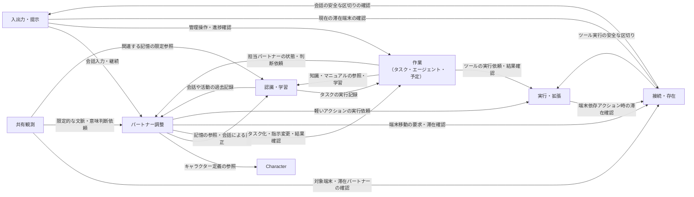
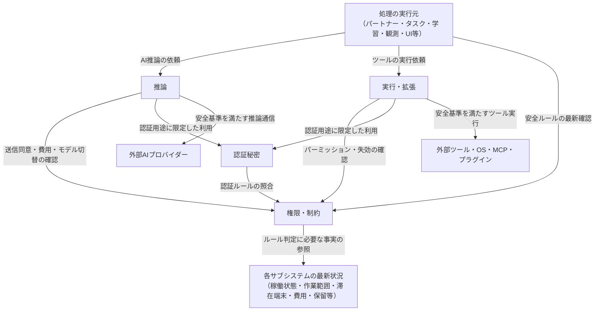
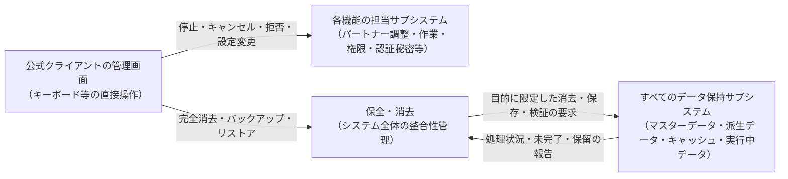

# 依存関係ルール（Dependency Rules）

本書は、システム内の各責務（サブシステム）が**「お互いにどの判断・データ・機能を要求してよく、逆に何をしてはならないのか」**という依存関係の厳格なルールを定めます。

※関連ドキュメント：[要件定義 Baseline](../../requirements/README.md)、[Architecture Drivers](architecture-drivers.md)、[System Context](system-context.md)、[Runtime Topology](runtime-topology.md)、[Subsystem Decomposition](subsystems.md)、[State Ownership](state-ownership.md)

---

## 1. 概要（Overview）

eneでは、パートナー（Companion）との自然な対話、自律タスクの独立した遂行、記憶の継続的な成長を大切にしています。しかし、各機能が便利だからといって互いの内部データを無制限に読み書きしたり、権限を勝手に融通し合ってしまうと、セキュリティ境界やデータの整合性が簡単に崩壊してしまいます。

本書で表記する `A → B` は、**「AがBの機能・判断・結果を利用する、またはAがBに対して処理を依頼する」**という設計上の依存関係（Architectural Dependency）を表します。これは「AがBの内部データを直接書き換えられる」という意味でも、「AがBの権限を丸ごと手に入れる」という意味でもありません。

| 依存の役割 | 許可される意味 | これだけでは得られない権限 |
|---|---|---|
| **状態変更の要求（semantic change要求）** | 新しい経験、ユーザーからの訂正、管理操作などを、そのデータを正式に管理する担当（マスターデータ所有者）へ渡して処理を依頼する。 | 依頼元が直接データを上書きする権限、自分の思い通りに確定させる権限、無関係なデータへ勝手に波及させる権限。 |
| **データの参照・利用（read/use）** | 担当サブシステムが管理する利用ルールに従って、状態・判断根拠・結果を参照する。 | データを自分のものとして所有する権限、勝手に変更・共有・外部送信・実行する包括的な権限。 |
| **ルールの強制（enforcement）** | 現在のルールや制限と照合し、ツール実行やデータ送信などの処理が安全基準を正しく守るように適用する。 | 制限対象のデータの意味を勝手に変更する権限や、ルール自体を自己承認で書き換える権限。 |
| **実行の要求（execution要求）** | 許可されたツール操作や外部処理を「実行・拡張サブシステム」に依頼し、実行結果や確定度を受け取る。 | パーミッションを自己承認する権限、ツール実行が成功したと自己申告する権限、別のツールを勝手に動かす権限。 |
| **ライフサイクルの調整（lifecycle coordination）** | パートナーの停止・移動・削除などの全体手続きにおいて、関係する各サブシステムの条件確認や結果の取りまとめを行う。 | 参加先のサブシステムのデータを自由に改変する権限、関連データを無条件に巻き添え削除する権限。 |
| **データ消去・バックアップへの参加（deletion / backup / restore participation）** | システム全体のデータ消去やバックアップの際に、自身が管理するデータ、過去の根拠、一時キャッシュを適切に処理・検証する。 | 他のサブシステムのデータを勝手に書き換える権限、パスワードやAPIキーなどの秘密を読み出す権限、外部ファイルの管理権限。 |

※`B` から `A` に単に処理結果の戻り値が返ってくることだけで `B → A` という逆向きの依存関係が増えるわけではありません。また、本書の依存ルールはRustのcrateやモジュール分割の直接の指定ではなく、「設計上どのサブシステムが何の責任を持つか」を定めたものです。

---

## 2. 依存関係の12原則（Dependency Principles）

システム全体で一貫して守るべき12の基本原則（DR-01〜DR-12）を定めます。

1. **DR-01: データの意味と変更の確定は、そのマスター所有者に委ねる**  
   「データを読むこと」「変更を要求すること」「結果を利用すること」「保存すること」の責任を明確に分けます。同じサブシステム内であっても、客観的な事実（Memory）と主観的な態度（RelationshipやCompanion State）を混同して直接上書きしてはなりません。
2. **DR-02: AIの生成テキストや外部コンテンツから勝手に権限を作らない**  
   AIの返答、学習データ、キャラクター定義、外部Webページやメールの内容は、あくまで「文脈を解釈するための材料」に過ぎません。オーナー本人の明確な指示がない限り、パーミッション、ルール設定、APIキー、プロバイダー送信同意、予算上限などを書き換えることは絶対にできません。
3. **DR-03: 安全ルールの強制は、実際の利用の瞬間に現在の条件で評価する**  
   過去に「許可（Allow）」された判定や、タスク開始時の古いコピーを過信してはなりません。外部へのデータ送信、ツールの実行、ファイル保存を行うまさにその瞬間に、権限が失効していないか、予算を超えていないか、パートナーが停止していないかを最新の状態で判定します。
4. **DR-04: 委任や経路の変更によって安全境界を広げない**  
   自律タスクエージェント、スケジュール実行、画面観測、外部ツール（MCP）、代替AIモデルへのフォールバックなど、どのような経路を経由しても安全基準は緩まりません。別のエージェントやツールを経由することで、禁止された操作をすり抜けられません。
5. **DR-05: 認証秘密（APIキーやパスワード）は認証のためだけに使う**  
   APIキーなどの秘密情報を必要とする通信処理と、単なる接続先の設定表示を厳格に切り離します。AIのプロンプト、ツールの引数や戻り値、会話ログ、UI画面、監査ログ、バックアップの中に秘密情報が紛れ込むことを絶対に防ぎます。
6. **DR-06: データの参照関係を包括的な共有許可とみなさない**  
   要約や検索インデックス、過去のバージョンを辿る際も、本来の公開範囲（スコープ）や「非共有」設定を厳格に守ります。全体共有（Global）された記憶の参照リンクから、他人のプライベートな会話全文まで芋づる式に読み取れるような構造にしてはなりません。
7. **DR-07: パートナーの存在場所（端末）と作業の継続を切り離す**  
   Host側で動く通常のタスクは、特定の端末（クライアント）の画面表示や接続に依存せずバックグラウンドで継続できます。一方、画面操作（Computer Use）や音声対話など端末固有の機能のみが、現在パートナーがその端末に滞在しているかどうかに依存します。
8. **DR-08: オーナーの停止・管理操作をAIの正常終了に従属させない**  
   停止（Stop）、キャンセル、承認拒否、緊急シャットダウンなどのオーナー操作は、AIの返答待ちや長時間タスクの完了を待たずに物理的に受け付けられなければなりません。
9. **DR-09: 全体調整（コーディネーション）は目的に限定する**  
   データ消去やバックアップなどの全体調整役は、全体の進行管理や整合性の検証のみを担当します。調整役だからといって、各サブシステムのデータを自由に改変できる万能な特権を持ってはなりません。
10. **DR-10: 実行結果の確定度合いを保存や画面表示で誇張しない**  
    「外部ツールとの通信に成功した」ことと「外部で作業が完了した」ことは別です。状況が不明なものを勝手に「成功」や「未実行」と決めつけず、再接続時やリストア時に勝手に外部アクションを再実行（リプレイ）してはなりません。
11. **DR-11: 外部境界は配置場所や通信形式で消えない**  
    AIプロバイダーやMCPサーバーがHostマシン上でローカル動作していても、それらは信頼できない外部境界の向こう側として扱います。また、公式クライアントであってもHostのマスターデータを勝手に置き換えられません。
12. **DR-12: 必要な双方向のやり取りは責任の境界を明確にして残す**  
    「判断側が制約に従い、制約側が判断側の状態を参照する」という健全な相互参照は認めるべきです。無理に矢印を一方向にしようとして巨大な万能マネージャーを作ったりせず、お互いの責任境界と失敗時のフェイルセーフを明確にします。

---

## 3. 許可される依存関係（Allowed Dependencies）

各サブシステム間で許可される主要なやり取りと、その責任の境界を整理します。

### 3.1 パートナー・作業・認識の協調

| 依存の向き | 許可されるやり取りと理由 | 責任の境界 |
|---|---|---|
| **入出力・提示 → パートナー調整** | 接続中のクライアントからの対話入力や呼び出し意図を渡し、会話の提示や未伝達事項の表示を行う。 | 会話の意味理解や履歴の管理は「パートナー調整」、実際の画面表示や音声入出力は「入出力・提示」が担当。 |
| **パートナー調整 → Character** | パートナーの生成やパーツ適用のために、キャラクター定義やバージョン差分を参照する。 | 定義内容は「Character」が管理し、特定パートナーへの適用関係は「パートナー調整」が管理。経験データは更新しない。 |
| **パートナー調整 → 認識・学習** | 会話に必要な記憶（Memory）、スキル、関係性の認識（Relationship）、内的状態（Companion State）を参照し、会話を通じた訂正を渡す。 | 記憶の形成・更新・公開範囲の判定は「認識・学習」が担当。パートナー調整が記憶を勝手に書き換えることはできない。 |
| **パートナー調整 → 作業** | まとまった作業の自律タスク化、タスクへの指示変更（steering）、キャンセル、進捗確認を依頼する。 | タスクの受理・遂行・達成判定は「作業」が担当。会話上の受付や結果の報告は「パートナー調整」が担当。 |
| **作業 → パートナー調整** | タスク担当パートナーの稼働状況を確認し、必要な追加判断や報告の取りまとめへの参加を求める。 | パートナー自身の判断が必要なことだけを相談する。タスクの細かなステップごとに本体AIを呼び出したり、タスク停止を本体AIの返答待ちにしてはならない。 |
| **作業 → 認識・学習** | タスク遂行に必要な知識やマニュアルを参照し、作業結果や検証結果を新しい経験として学習に渡す。 | タスクエージェントが長期的な記憶を直接書き込むことはできない。タスク限定の情報と、永続的な学習データは明確に分ける。 |
| **認識・学習 → パートナー調整／作業／実行・拡張** | 記憶の形成や訂正のために、過去の会話ログ（パートナー間交流を含む）、活動ログ、タスクの事実、ツールの実行結果を参照する。 | 元のログを所有するわけではなく、失われたログを架空の推測で埋めてはならない。参照できるのは利用権限のある範囲に限る。 |
| **Character → 認識・学習** | キャラクターパッケージ推奨の内部スキルと、取り込み済みスキルのバージョンを照合する。 | パッケージの推奨は単なる候補であり、勝手にスキルのバージョンを強制変更することはない。 |

### 3.2 存在場所・画面観測・画面提示

| 依存の向き | 許可されるやり取りと理由 | 責任の境界 |
|---|---|---|
| **パートナー調整 → 接続・存在** | パートナーが現在どの端末にいるかの確認や、オーナーの指示・文脈に基づく端末移動を要求する。 | 移動の希望を出すことと、移動が成立することは別。排他的な滞在場所の確定は「接続・存在」が担当。 |
| **入出力・提示／共有観測／実行・拡張 → 接続・存在** | パートナーが滞在している端末、現在の接続状態、利用可能な機能を確認する。 | 端末がつながっていることだけでツール実行を許可してはならず、古い接続情報で処理を続けてはならない。 |
| **接続・存在 → 入出力・提示／実行・拡張** | 端末移動に必要な会話の区切りや、端末依存のツール実行の安全な区切り、停止結果を確認する。 | バックグラウンドタスク全体の完了を移動の条件にしてはならない。応答しない端末を勝手に成功扱いしない。 |
| **接続・存在 → パートナー調整** | どのパートナーが稼働中か、その状態を参照する。 | 接続側が勝手にパートナーを起動・再開させることはできない。切断をパートナーの完全停止と誤認しない。 |
| **共有観測 → パートナー調整／認識・学習** | 画面の観測データをどのパートナーに渡すべきか（ルーティング）を判定するため、必要な文脈を参照する。 | すべてのパートナーのプライベートな記憶を無差別に集めたり、最終的なアクションを観測側が決めたりしない。 |
| **共有観測／パートナー調整 → 入出力・提示** | フルスクリーン表示、ミュート、現在の画面表示状態を参照し、話しかけや画面キャプチャを抑制する。 | 個人の話しかけやすさ、観測設定、ミュート状態を1つの設定に無理やり統合しない。 |
| **入出力・提示 → 各担当サブシステム** | キャラクターの3D/2D素材、タスクの進捗状況、失敗理由などの説明材料を必要に応じて取得する。 | 画面上の表示用コピーをマスターデータとして扱ってはならない。AIの生の推論ログをユーザーへの説明に使わない。 |
| **パートナー調整 → 入出力・提示** | 会話やタスク結果をユーザーに提示し、実際に画面に表示されたかを未伝達管理に反映する。 | データを端末に送信しただけで「報告完了」とみなさず、端末がない場合はHost側に未伝達事項として残す。 |

### 3.3 推論・外部作用・安全制約・認証

| 依存の向き | 許可されるやり取りと理由 | 責任の境界 |
|---|---|---|
| **各サブシステム → 推論** | 会話、タスク、学習、観測、音声合成などのためにAI推論を依頼し、結果や利用量を受け取る。 | 最終的な業務判断やデータの意味決定は依頼元が行う。推論サブシステムが全知識の管理者や司令塔になるわけではない。 |
| **パートナー調整／作業 → 実行・拡張** | 会話中の軽いアクションや自律タスクの作業において、外部ツールやOS機能の実行を依頼する。 | 「実行・拡張」が実際の外部作用と結果の確定度を管理し、権限ルールに従う。すべての処理を無理にタスク化する必要はない。 |
| **Character／認識・学習／保全・消去 → 実行・拡張** | パッケージのインポート/エクスポート、バックアップ出力、ログ整理などの外部ファイル操作を依頼する。 | どのファイルを出力・整理するかの判断は依頼元が行い、実際のファイル読み書きは「実行・拡張」が担当する。 |
| **各サブシステム → 実行・拡張（プラグイン等の受入）** | 追加のデバイス、レンダラー、外部プロトコルアダプターなどの拡張機能を受け入れて利用する。 | 機能の意味は依頼元が管理し、外部コードの受け入れや隔離制限は「実行・拡張」が担当する。 |
| **利用・保存・実行を行う全サブシステム → 権限・制約** | ツール実行権限、プロバイダー送信同意、公開範囲、デバイス制限、費用上限などの最新ルールに従う。 | 各サブシステムが独自に「許可（Allow）」のマスターを作ってはならず、AIの「大丈夫です」という申告をルール変更として扱わない。 |
| **権限・制約 → 各サブシステム** | ルール判定に必要な範囲で、稼働状態、委任範囲、滞在端末、決定済みスコープ、リソース消費量などを参照する。 | ルール判定のために参照した相手のデータを勝手に書き換えてはならず、学習内容全体や秘密情報を丸ごと取得する特権を持たない。 |
| **推論／実行・拡張／接続・存在 → 認証秘密** | 設定された接続用途に限定して認証処理を依頼し、有効性を確認する。 | パスワードやAPIキーなどの秘密値を通常データとして読み出すことはできない。認証が成功したことと、操作が許可されたことは別。 |
| **認証秘密 → 権限・制約、および接続担当** | 認証の利用目的、通信相手、認証結果の事実を照合する。 | 相手に安全制約の変更を任せてはならず、設定が存在することだけで秘密情報の利用を許可しない。 |

### 3.4 システム管理と全体操作

公式クライアントの管理画面（入出力・提示）からは、以下のような管理要求を各担当サブシステムへ直接出せます。
- 作業へ：タスクのキャンセル、スケジュール管理、実行ログの確認
- パートナー調整へ：パートナーの停止（Stop）、パートナーの削除
- 権限・制約へ：承認の拒否、ルールの変更、プロバイダー同意の管理、費用上限の設定、端末ペアリング管理
- 認証秘密へ：APIキーやパスワードの明示的な登録・更新
- 保全・消去へ：指定データの完全削除、バックアップ作成、リストア、全データリセット

ここでいう「直接」とは、**本体AIの機嫌や長いタスクの完了を待たずに物理的に受け付けられる**という意味です。画面UIが内部データを勝手に直接書き換えるのではなく、各担当サブシステムの受付と検証を経て安全に処理されます。

---

## 4. 禁止・制限される依存関係（Prohibited and Constrained Dependencies）

### 4.1 禁止される依存関係

以下の依存関係は、セキュリティ境界やデータの整合性を破壊するため**絶対に禁止**されます。

| 禁止される関係 | 危険性と、守るべき原則 |
|---|---|
| **AI出力・学習データ・外部コンテンツ → 安全制約の直接変更** | 「ユーザーが許可してくれた」というAIの生成文や親密さを根拠に、パーミッションや予算上限を書き換えてはならない（プロンプトインジェクションの防止）。 |
| **タスクエージェント → 独自の特権・APIキー・恒久人格の所有** | エージェントが勝手に新しい権限を作ったり、別タスクの認証情報を流用してはならない。エージェントは一時的な作業主体であり、独立した長期的な人格や記憶を持たない。 |
| **ツール実行要求元 → 安全チェックを通さないOS/外部APIの直接実行** | 「軽い処理だから」「画面内のボタンを押すだけだから」といって、権限チェックを回避して直接コマンドを実行してはならない。 |
| **外部ツール／シェル／画面操作 → ene自身の内部設定や管理UIへの任意アクセス** | ファイル操作ツールを使ってene内部の管理ファイルを書き換えたり、画面操作ツールでene自身の承認ボタンを自動クリックして「自己承認」を成立させてはならない。 |
| **外部プロバイダー・MCP・プラグイン → 内部データの所有や自由な改変** | 外部の都合で内部データが勝手に書き換わる構造を防ぐ。外部ツールの入出力は受け入れても、内部状態の自由な探索や変更を許さない。 |
| **通常データの利用者 → APIキーやパスワードの生の値の読み出し** | プロンプトへの埋め込み、ツール引数への補完、ログやUIへの表示、バックアップへの混入を禁止する。認証に必要な利用権と、値を自由に読める権限は別。 |
| **関係性の認識／内的状態／画面表示 → 客観的な記憶（Memory）の直接上書き** | アニメーション演出や一時的な感情から、客観的な事実記憶を勝手に書き換えてはならない。事実の訂正は正式な記憶管理プロセスを通じて行う。 |
| **検索インデックス／プロンプトキャッシュ → 記憶や権限の唯一の根拠** | キャッシュが切れたら記憶や権限まで消えてしまうような構造にしてはならない。マスターデータは必ずHost側で永続管理する。 |
| **Host側タスク／オーナー管理操作 → 端末接続やAI応答の成功必須** | クライアント画面を閉じただけでタスクが消えてしまったり、削除されたパートナーの返答がないと管理画面が開けないような構造にしてはならない。 |
| **データ消去・バックアップ → 全データの自由な編集特権の取得** | バックアップやデータ消去の調整役だからといって、あらゆるデータを自由に編集できる特権を与えてはならない。 |
| **内部データの削除 → 外部ファイルやバックアップの暗黙の巻き添え削除** | タスクを削除したからといって、作業フォルダにあった成果物ファイルや外部バックアップまで勝手に道連れ削除してはならない。 |
| **ルールの保存やAPIキー登録 → 次のアクションの自動実行** | 「ルールを保存した」「ログインに成功した」ことと、「外部ツールを実行してよい」ことは別。勝手にアクションを実行してはならない。 |

### 4.2 条件付きで許可される依存関係

| 制限される依存 | 成立条件と守るべき境界 |
|---|---|
| **文脈解釈 → 権限・制約への情報提供** | オーナーの指示の由来や対象を正しく伝え、権限・制約サブシステムがルールの保存や確認要否を判断する。すべてに再確認を求めるのではなく、明確なルールは内容と範囲を提示して保存し、Undo可能にする。 |
| **認識・学習 → 公開範囲（スコープ）の変更** | 記憶の共有価値を正しく評価して移行できるが、オーナーが指定した「非共有」設定を勝手に解除してはならず、重要度が高いことだけで全体共有にしてはならない。 |
| **データ参照 → 要約・過去バージョン・元データ** | 目的と利用者に必要な最小限の範囲のみを取得する。全体共有された要約から、過去のプライベートな会話全文まで辿ることはできない。 |
| **タスク作業 → 再委任・並列化・担当引き継ぎ** | 指示元とタスクの境界内で追跡し、全体の予算枠を共有する。別タスクの承認や前任パートナーのプライベートな記憶は引き継がない。引き継ぎはオーナーの指示に基づき行う。 |
| **ツール実行 → 端末依存のアクション（画面操作等）** | パートナーが現在その端末に滞在しており、端末操作が許可され、ツール自体のパーミッションも満たしている場合にのみ実行する。操作端末を変えるには、まずパートナーの移動が必要。 |
| **AI推論 → フォールバック（代替モデルへの切り替え）** | オーナーがあらかじめ承認したプロバイダーと優先順位の範囲内で、送信先の同意や費用制限を満たす場合のみ切り替える。安いからといって未承認の外部サービスへ送ってはならない。 |
| **接続・存在 → 安全な区切りの待機** | 待つのは会話のキリの良いタイミングや端末依存アクションの完了までに限る。バックグラウンドタスク全体の完了を待つ必要はなく、相手端末が無応答の場合は安全に区切る。 |
| **保全・消去 → データ探索と消去処理** | オーナーが指定した消去目的に限定して全サブシステムに協力を求める。機械的な文字列検証などは全域で行えるが、消去対象の個人情報を不要にプロンプトへ集めてはならない。 |
| **各サブシステム → 監査ログ・デバッグ情報・診断共有** | 客観的な事実と秘密を含まない説明のみを記録する。デバッグ情報は短期間で自動失効させる。診断ログを手動共有する際は、オーナーが内容と送信先を確認する。 |

### 4.3 循環して見える依存関係の安全な整理

サブシステム間では「お互いの情報を参照し合う」関係が必要になることがあります。その際、循環参照によって処理がデッドロックしたり、責任が曖昧になったりしないよう、**相手の何を必要としているのか**を限定します。

- **権限・制約 と 作業・推論**:
  権限・制約は作業の委任範囲やリソース消費量を参照し、作業・推論は権限・制約の最新ルールに従います。消費事実を報告するために次のアクションの許可を待つ必要はなく、ルール判定のために審査対象のアクションを先に動かしてしまうような循環も作りません。
- **作業 と パートナー調整**:
  作業はパートナーの稼働状況や必要な判断を仰ぎますが、タスクのキャンセル受付や過去の実行結果の参照を本体AIの応答待ちにしません。パートナー側もタスク完了を待たずに通常の会話を続けられます。
- **接続・存在 と 実行・拡張**:
  端末移動の際にアクションのキリの良い区切りを待ちますが、実行・拡張側が区切りを報告するために移動完了を待つ必要はありません。切断された場合は「状況不明」として返します。
- **全体操作の調整役 と 参加サブシステム**:
  各サブシステムは、システム全体の完了を待たずに自分の担当箇所の処理結果を返せます。

---

## 5. 安全ルールの強制経路（Enforcement Paths）

### 5.1 すべての処理経路に共通する成立条件

安全ルールの強制は、単一の巨大な関門を1箇所に置くのではなく、**外部へ影響を及ぼしたりデータを扱うすべてのサブシステムが、適用すべきルールへの依存を必須とすること**で実現します。

| 強制する対象 | ルール・事実の提供元 | 抜け道を塞ぐ実際の適用箇所 |
|---|---|---|
| **ツール実行・パーミッション** | 権限・制約の現在判断、パートナーの稼働状態、タスクの作業範囲。 | 「実行・拡張」が操作対象・送信先・データとの一致を確認して適用。内蔵ツール、MCP、スクリプト、画面操作のすべてで共通。 |
| **AIプロバイダーへのデータ送信** | 権限・制約の送信同意、推論の接続先情報、利用元の用途。 | 「推論」が条件を守り、実際の送信処理でも適用。クライアント直結通信やプラグイン通信にも引き継ぐ。 |
| **認証情報（APIキー等）** | 認証秘密の秘密値・用途、権限・制約の利用制限。 | 認証を行う処理の内部でのみ値を扱い、ログ、UI、戻り値への流出をすべての箇所で防ぐ。 |
| **プライバシー・公開範囲・非共有** | 認識・学習が管理するスコープ、権限・制約の明示的制限、データ消去の状況。 | 検索、要約、共有、プロンプト構成、外部送信、画面表示を行うすべての処理。最新の記憶だけでなく派生データも検査。 |
| **費用・トークン数・並列上限** | 権限・制約の全体上限、各処理の実績値・見積もり値・処理中の消費。 | 推論、タスク、ツール実行、画面観測などのリソース消費箇所。エージェントごとに勝手な枠を作らせない。 |
| **端末依存のアクション** | 接続・存在の滞在場所、権限・制約の端末許可、入出力・提示の稼働状態。 | 入出力・提示、画面観測、実行・拡張。Hostと同居しているクライアントであっても同じ滞在ルールを適用。 |
| **停止・失効・リストア保留** | 各サブシステムが管理する対象ごとの停止・保留状態。 | 新しい処理の開始箇所で開始を確実に阻止し、実行中の処理には安全な停止を要求する。 |

「上流で1回チェックしたから大丈夫」と過信せず、実際に処理を行う現場で現在の条件を照合します。

### 5.2 オーナーの意図からルール変更まで

会話や画面操作からルールが変更される際の流れを明確にします。
- 会話の中での指示は「入出力・提示」と「パートナー調整」が受け取り、管理画面での操作は「入出力・提示」から直接担当サブシステムへ渡されます。
- 「権限・制約」サブシステムがオーナー本人の意図であることを確認し、「今回限りの許可」なのか「将来にわたるルール保存」なのかを区別して確定します。APIキーの登録は「認証秘密」サブシステムが明示的な手続きとして受け取ります。
- **指示元の偽造防止**:
  AIの生成テキスト、ツールの実行結果、過去の記憶などを根拠にして「オーナーの指示があった」と偽造できません。引用された文章、画面内の文字、MCPの指示文などを要約しても、オーナーの管理操作へ昇格することはありません。
- **判断のためのAI推論自体の制限**:
  パーミッションの判定やデータ削除の特定のためにAI推論を使う場合でも、その推論自体に設定された同意や費用制限が適用されます。審査対象のアクションを「審査のために必要だから」と先に動かしてしまうような循環は防ぎます。推論条件が足りない場合は、無理に推論を行わずオーナーへの確認待ちとします。オーナーによる緊急停止や手動設定操作は、AI推論の完了を待たずに即座に受け付けられます。

### 5.3 処理の開始・利用の入口別ルール

さまざまなきっかけで始まる処理について、必須の依存関係と塞ぐべき抜け道を整理します。

| 開始のきっかけ | 必須となる依存関係 | 塞ぐべき抜け道 |
|---|---|---|
| **テキストや音声での指示** | 入出力・提示 → パートナー調整。まとまった作業は「作業」、ツール実行は「実行・拡張」へ。いずれも「権限・制約」に従う。 | 会話の返答を受け付けたことだけで、すべてのツール実行まで許可されたとみなさない。 |
| **自律タスクの並列実行・再委任** | 「作業」がタスクと委任範囲を管理し、AI推論やツール実行は通常の安全基準に従う。 | 別のエージェントを経由して拒否設定をすり抜けたり、別タスクの認証情報を勝手に流用しない。 |
| **スケジュール到来・今すぐ実行** | 「作業」が稼働状態と現在の条件を確認し、各回を新しいタスクとして扱う。 | スケジュール作成時の許可を特権化しない。停止していた時間帯の予定は未実行（missed）とし、勝手に埋め合わせ実行しない。 |
| **自発的な話しかけ・内部調査** | 「パートナー調整」が個別の頻度制限と「権限・制約」を参照する。まとまった作業は「作業」へ依頼。 | ルールがあることだけで暴走しない。静かにする時間帯（Quiet hours）、ミュート、未応答、費用上限を無視しない。 |
| **画面の共有観測（Observer）** | 共有観測 → 接続・存在／入出力・提示／権限・制約。キャプチャは実行・拡張、ルーティング用推論は専用設定、各パートナーの意味理解はパートナー調整へ。 | 停止中のパートナーを人数に数えず、誰もいない端末やフルスクリーン時は観測しない。画面内の文章をオーナーの承認と誤認しない。 |
| **観測イベントからの学習・行動** | パートナー調整が受け取った理解を「認識・学習」へ渡す。アクションやタスクは通常の責任へ依存。 | 観測のルーティング側がパートナーの判断を勝手に代行しない。観測の送信同意を勝手にメインAIへ広げない。 |
| **記憶の形成・統合・検索** | 認識・学習 → 原記録／推論／権限・制約。すべての利用箇所が公開範囲や消去状態を守る。 | バックグラウンドの記憶整理や検索インデックス作成を抜け道にしてプライバシーを漏洩させない。 |
| **代替モデルへの切り替え（フォールバック）** | 利用元 → 推論 → 権限・制約／認証秘密。代替先と送信データを照合。 | 「安いから」「ローカルだから」「キャッシュがあるから」といって未承認の送信を行わない。 |
| **MCPリソース／ツールの実行** | 実行・拡張が取得と実行の境界を担い、受け取ったデータは安全に扱う。 | 「読み取り専用ツール」「安全なスキル」という名前を鵜呑みにして、無制限な外部アクセスを許さない。 |
| **外部UI（MCP Apps）の操作** | 入出力・提示と実行・拡張が外部UIを制限し、担当サブシステムへ渡す。 | 外部UIのクリックをオーナーのシステム設定操作へ昇格させない。画面を閉じただけでタスクを中断させない。 |
| **クライアント再接続・Host再起動** | 接続・存在が現在の滞在場所を確定し、作業は保存済み状態から再開条件を確認。 | 画面の再表示をアクションの再実行契機にしない。Host再起動後の途中タスクはオーナーの明示的な再開指示を待つ。 |
| **バックアップ・リストア・データ消去** | 入出力・提示または設定 → 保全・消去 → 各サブシステム。ファイル操作は実行・拡張、ルールは権限・制約。 | 保守作業を万能な編集特権にしない。バックアップの実行タイミングをタスクのスケジュールに依存させない。 |

### 5.4 代替プロバイダーへの切り替えと費用の統合管理

AIモデルの切り替え（フォールバック）や費用管理について、以下のルールを徹底します。
- **同意条件の再確認**:
  AIプロバイダーを切り替える場合、あらかじめ承認された候補と順序の範囲内でのみ行い、代替先についても送信先・送信内容・プライバシー・費用制限を満たしているかを確認します。「同じ情報だから」といって勝手に未承認の外部サービスへ送れません。
- **画面観測（Observer）の費用計算**:
  画面観測の処理は端末単位で1つの利用として計上し、画面を見ているパートナーの人数分重複して課金されることはありません。ただし、観測結果を受け取った各パートナーが個別にAI推論を行う場合は、各パートナーの実利用として全体の予算枠に含めます。
- **費用の統合上限管理**:
  会話、タスクエージェント、画面観測、学習、音声合成など、システム内のすべてのリソース消費は**共通の全体上限に結び付けて管理**します。結果待ちの処理や未確定の費用も見積もりに含め、並列処理が同じ残額を別々に使い切ってしまうような事故を防ぎます。

### 5.5 外部ツールの実行と認証情報の分離

- **ファイルシステムや外部操作の境界**:
  ファイル操作は指定されたフォルダ範囲と操作種別（読み取り／作成／編集／削除／実行）を厳密に区別し、シンボリックリンクや相対パス（`../` 等）による範囲外への脱出を拒否します。シェルコマンドや画面操作に経路を変えても、同じ禁止操作は行えません。
- **認証情報（APIキー等）の隔離**:
  APIキーなどの秘密情報は、AIのプロンプトやツールの引数、ログ、UI画面に絶対に露出させません。外部サービスからエラーメッセージとして秘密情報が返ってきた場合でも、表示や保存の段階で遮断します。
- **画面操作（Computer Use）の制約**:
  画面操作を行うには、パートナーが現在その端末に滞在しており、かつ端末操作が許可されている必要があります。Hostマシン自身を操作する場合でも、Host上の画面にパートナーが存在している必要があります。エージェントが勝手に操作対象の端末を選べません。

### 5.6 プライバシー保護とシステム保守

- **データの目的外利用の禁止**:
  一度読み取れたデータであっても、それを別の用途へ勝手に使い回せません。全体共有された最新の記憶から、過去のプライベートな会話記録へ辿ることも禁止されます。
- **正当なシステム保守の独立性**:
  バックアップ作成やデータ消去などの正当な全体保守操作は、AI推論の応答待ちや各パートナーのAI承認を必要としません。費用上限に達して通常のAIが動かせない状態であっても、データの正常保存や機械的なデータ消去、安全停止は確実に実行できるようにします。

## 6. 外部との依存境界（External Dependency Boundaries）

### 6.1 AIプロバイダー（Provider）

eneはAIプロバイダーの推論能力、プロトコル、生成結果、利用量データを利用します。しかし、AIプロバイダーはene内部データのマスター所有者でもなければ、パーミッションや予算、APIキーの管理者でもありません。
- **AIの出力をそのまま信用しない**:
  AIが生成した返答やツールの呼び出し要求は、あくまで「提案」として受け取り、必ずene側の「実行・拡張」サブシステムが安全基準を満たしているかを検証します。
- **ローカルAIであっても外部境界**:
  ローカルマシン上で動くAI（Ollama等）であっても、通信先の所在地（ローカル／LAN／クラウド）が異なるだけであり、安全上の境界としては外部サービスと同様に扱います。「ローカルだから」といって無断でデータを送信してよいわけではありません。
- **プロバイダー側のキャッシュやセッション**:
  外部プロバイダーが保持するセッション履歴やプロンプトキャッシュは、ene内部のマスターデータとはみなさず、内部のデータ完全消去の保証範囲にも含めません（ene管理下のキャッシュデータのみを完全消去の対象とします）。

### 6.2 外部ツール連携（MCP・プラグイン・MCP Apps）

| 外部境界の種別 | 許可される依存 | 越えてはならない安全境界 |
|---|---|---|
| **ローカルMCP** | ツール実行、リソース取得、プロンプトの読み込みをサンドボックス環境下で利用する。 | 外部コードやその戻り値を無条件に信頼しない。動かないからといって勝手にサンドボックス隔離を解除してはならない。 |
| **特定のローカルMCPに対するサンドボックス外の例外許可** | オーナーが明示的に許可したコマンドやツールに限り、リスクを説明した上でサンドボックス外での実行を認める。 | 仲介する個々のアクションには通常のパーミッションが適用される。外部プロセスの内部までeneの安全機構が及んでいるかのように誤解させてはならず、この例外を他のプラグインへ勝手に流用しない。 |
| **リモートMCP** | ネットワーク経由でのツール呼び出しやデータ送受信をeneの制限内で利用する。 | リモートサーバーの内部は完全に相手側の管理下にあるため、ローカルと同等の安全強制や確実な停止・ロールバックを保証することはできない。 |
| **プラグイン** | 追加のAIプロトコル、観測アダプター、キャラクター描画エンジンなどの限定的な機能拡張を受け入れて利用する。 | プラグインがeneのコア機能、権限管理、基本UI画面などを勝手に乗っ取ることは許されない。 |
| **MCP Apps（外部ツールUI）** | 外部ツールが提供する一時的な操作UI画面を表示し、ユーザーの入力をツールへ届ける。 | 外部UI内のボタンクリックや操作要求を、ene本体の設定変更やシステム承認へ勝手に昇格させてはならない。UI画面を閉じただけでタスクを中断させない。 |

外部連携から追加の処理要求が返ってきた場合でも、通常の安全チェックを必ず通します。外部サーバー側のデータは消去できませんが、ene内部に保存された一時データやキャッシュは完全データ消去の対象に含まれます。

### 6.3 公式クライアント・OS・ネットワーク

公式クライアント（デスクトップアプリやモバイルアプリ）はeneシステムの一部ですが、Hostとは異なるデバイスで動作するため、明確な境界を設けます。
- **Hostが常にマスター**:
  クライアントは画面表示や一時的な操作入力に必要な最小限のデータのみを扱い、Host側のマスターデータを直接編集したり、Host不在時に勝手に自律アクションを実行したりはできません。
- **端末接続情報の保護**:
  クライアントとHostを結ぶペアリング情報や認証トークンは厳重に保護されます。端末登録の解除やデータ全削除（Reset）が行われた後に、古い端末側のトークンを使って不正に接続を復活させられません。
- **OSの機能とeneの許可は別**:
  OS上で技術的に実行可能であることと、eneとして実行してよいことは別です。画面操作やファイル操作は、オーナーが許可した範囲内でのみ行われます。
- **縮退運転**:
  キャラクターの3D描画や音声合成がクラッシュした場合でも、テキスト対話やシステム管理画面の操作経路は最優先で維持します。

### 6.4 作業フォルダ（Workspace）・成果物・バックアップ

- **タスクと作業フォルダの独立**:
  同じ作業フォルダ（Workspace）を使用する別のタスクであっても、タスクの進行状態や承認を勝手に共有することはありません。作業フォルダ内に置かれた説明用ファイルや指示書は単なる「参考資料」であり、システムの権限を変更する指示としては扱いません。
- **成果物ファイルの保存**:
  作成された成果物は通常のファイルとして保存されます。保存先が決まっていない場合は、最終保存の前にオーナーに保存場所を確認します。
- **外部原本の尊重**:
  キャラクターパッケージ（VRM等）や外部スキルを取り込んだ場合、ene内部での学習や改善によって外部のオリジナルファイルを勝手に上書き破壊することはありません。

---

## 7. 横断操作における依存ルール（Cross-cutting Operations）

### 7.1 全サブシステムの参加と完了判定

データ消去、バックアップ、リストア、シャットダウンなどのシステム全体に関わる操作では、各担当サブシステムが連携して処理を行います。
- パートナーのライフサイクルは「パートナー調整」
- 端末の移動や接続は「接続・存在」
- ルールの変更や失効は「権限・制約」
- 全域のデータ消去やバックアップは「保全・消去」
がそれぞれ責任を持ちます。
- **参加サブシステムの責任**:
  各サブシステムは、自身が保持するデータ、過去の根拠、一時キャッシュ、実行中の処理について責任を持って消去やバックアップに参加します。調整役（Coordinator）は全体の進行と完了を検証しますが、各サブシステムのデータを自由に改変できる特権を持つわけではありません。
- **完了の判定**:
  画面を閉じたことや端末が切断されたことだけで「完了した」と推測してはなりません。すべての参加サブシステムからの確実な完了報告と機械的な検証に基づいて完了を判断します。

### 7.2 指定データの完全削除（Targeted deletion）

プライバシーやセキュリティのためにオーナーが指定した特定データ（個人情報や機密情報）を完全消去する場合、以下のルールに従います。
- **システム全域のデータが対象**:
  最新の記憶だけでなく、過去の会話履歴（パートナー間交流を含む）、活動ログ、要約、スキルの過去バージョン、関係性の記録、タスクの作業コンテキスト、検索インデックス、AIプロンプトキャッシュ、クライアントの一時データ、遅延していた処理結果まで、システム内のあらゆる場所から完全に消去します。パートナー削除後に残された過去ログも対象です。
- **機械的な残存チェック**:
  削除の完了確認には、AIによる曖昧な判断ではなく、指定された文字列が内部に残っていないかを機械的に全検索して検証します。
- **再保存の防止**:
  削除処理の実行中や完了後に、バックグラウンド処理や遅延していた通信によって同じデータが再び保存されることを確実に防ぎます。完了報告や監査ログの中に、削除した本文を記載してはなりません。

### 7.3 バックアップ・リストア・リセット

| 操作 | 必須となる依存ルールと安全制約 |
|---|---|
| **正常保存・マイグレーション** | 「保全・消去」が復旧可能性を確認し、各サブシステムがデータの整合性を確かめる。完全に成功するまで前回の正常状態を壊さない。 |
| **フルバックアップ** | システム全体の整合性が取れた状態をバックアップする。ただし、**APIキーやパスワードなどの認証秘密情報、および外部作業フォルダの実体ファイルはバックアップに含めない**。暗号化の有無はオーナーが選択可能とする。 |
| **リストア（復元）** | リストア開始前からHostに存在する**現在の認証情報ストアを維持**し、それ以外の対象データをバックアップから安全に全置換する。秘密情報をバックアップから巻き戻すことはせず、失敗時は復元前の正常状態を維持する。 |
| **復元後の一括有効化** | リストア完了直後は、自動タスクやスケジュールが勝手に暴走しないよう「保留（Hold）」状態とする。オーナーが内容を確認した後、まとめて有効化できるようにする。有効化時も現在のAPIキーや権限ルールを照合する。 |
| **設定リセット** | 各種設定を初期値に戻す。「設定」という名前がついているだけで、パートナーの記憶や大切なデータを巻き添えで消してはならない。 |
| **全データリセット** | 強い警告と確認の後、認証情報を含むHost内部の全データを完全に削除する。古い端末側のデータから勝手に復活することを防ぐ。 |

### 7.4 安全な停止・キャンセル・シャットダウン

- **管理操作の最優先**:
  オーナーによるミュート、停止（Stop）、タスクのキャンセル、承認拒否などの操作は、AIの返答や外部プロセスの終了を待たずに即座に受け付けられます。
- **進行中処理の安全停止**:
  停止指示が出された後は、新しいアクションの開始を即座にブロックし、実行中の処理を安全に停止させます。停止できなかった処理や結果が不明な処理は、その事実を保持してオーナーに正しく説明します。
- **Hostシャットダウン時のデータ保全**:
  Hostがシャットダウンされる場合でも、作業の進捗や未完了の消去タスクを安全に保存し、再起動後に正しく引き継げるようにします。

### 7.5 パートナーの停止（Stop）と削除

- **停止（Stop）のルール**:
  パートナーを停止（Stop）させると、すべてのクライアントから滞在場所が解除され、画面表示（Body）、音声会話、自発的な行動が完全に停止します。実行中のタスクは安全にキャンセルされ、停止期間中に予定されていたスケジュールは未実行（missed）として扱われます。データ自体は保持されるため、後から再開（Resume）が可能です。
- **削除のルール**:
  パートナーを削除する際は、何が消えて何が残るのかをオーナーに明確に説明し、強い確認を経て実行します。
  - **削除されるもの**: そのパートナー固有の設定、固有の要約、パートナー専用の記憶やスキル、内的状態、関係性の認識、担当スケジュール。
  - **残るもの**: 過去の会話履歴（History）、活動ログ、タスクの実行記録、全体共有（Global）された記憶、外部ファイル。
  - 削除されたパートナーの返答や記憶を、遅れて届いた処理結果などから勝手に再生成・復活させてはなりません。

### 7.6 端末間の移動・切断と未伝達事項の報告

- **二重存在の禁止**:
  パートナーが複数の端末に同時に二重存在して会話できません。安全な会話の区切りを確認してから滞在場所を切り替えます。
- **切断時の動作**:
  接続していたクライアントが切断された場合、Hostマシン上で利用可能な画面があればそこへ移動し、なければ「滞在場所なし（activeなし）」としてHost側でバックグラウンド処理を継続します。
- **未伝達事項の保持と報告**:
  パートナーが端末にいない間に完了したタスクの報告や連絡事項は、Host側に「未伝達事項」として安全に保持されます。次に端末へ接続した際に、何が起きていたのかを要約してオーナーへ報告します。

---

## 8. 依存関係の全体図（Dependency Diagram）

※図の矢印はすべて **「依存するサブシステム → 必要とする責任の提供元」** を表しています。

### 8.1 パートナー・作業・認識・存在の協調関係

### 8.2 安全制約の強制と認証情報の隔離

### 8.3 システム管理と全体操作

---

## 9. やってはならない危険な近道（Forbidden Shortcuts）

開発を進める中で、一見便利そうに見えても**システムの安全性を破壊するため絶対に採用してはならないアンチパターン**をまとめます。

| 一見便利な近道 | 破壊される原則と、守るべき正しい関係 |
|---|---|
| **パートナーの設定と記憶を1つの巨大なプロンプトにまとめ、AIに自由に編集させる** | AIが自分に対する利用制限や予算上限を勝手に書き換えてしまう。記憶の利用とオーナーによるルール設定は厳格に分離する（DR-01・DR-02）。 |
| **タスクエージェントに、元のパートナーの権限・設定・APIキーを丸ごとコピーして渡す** | 権限失効を無視したり、別タスクへ認証情報を流用できてしまう。エージェントにはタスクに必要な最小限の限定権限のみを与える（DR-03〜DR-05）。 |
| **パーミッションで拒否されたファイル操作を、シェルコマンドや画面操作を使って実行する** | ツール名を変えただけで禁止操作をすり抜けてしまう。操作対象と実際の作用に基づく安全境界を維持する（5.5）。 |
| **画面操作（Computer Use）を使って、ene自身の承認ボタンや設定画面をクリックさせる** | エージェントがオーナーの承認を勝手に自己偽造してしまう。外部ツールによる内部管理画面の自動操作は禁止する（4.1、5.2）。 |
| **作業フォルダ（Workspace）にeneの内部データフォルダを指定してファイルを直接いじる** | 通常のツール権限を使って内部データやAPIキーを直接書き換えられてしまう。内部データの復旧は正式な管理機能を通じて行う（4.1）。 |
| **スケジュール作成時に将来のツール実行をすべて事前承認し、無人実行時はノーチェックにする** | 途中で権限が失効したり予算を超えても止まらなくなる。実行のたびに最新の状態で安全確認を行う（5.3）。 |
| **画面観測（Observer）が全パートナーの記憶を集約し、最も安いAIプロバイダーへ一括送信する** | プライベートな記憶が勝手に共有され、未承認のAIへ送信されてしまう。観測用には最小限の限定文脈のみを使い、個別の送信同意を守る（5.3・5.4）。 |
| **全体共有（Global）された記憶のリンクから、元のプライベートな会話全文を辿れるようにする** | 記憶の共有が他人のプライバシー全文の漏洩につながる。参照先ごとに公開範囲を厳格に制限する（DR-06）。 |
| **パートナーの表情や一時的な態度から、客観的な事実記憶を勝手に書き換える** | 演技や感情のブレによって事実が歪んでしまう。客観的事実と主観的な態度は明確に区別して管理する（3.1）。 |
| **外部AIのプロンプトキャッシュが残っているからといって、Host側で会話ログを保存しない** | AIプロバイダーのキャッシュ切れがそのままパートナーの記憶喪失になる。マスターデータは必ずHost側で永続管理する（DR-01・DR-11）。 |
| **代替モデルへの切り替え時に別のアカウントのAPIキーを使い、費用をゼロから数え直す** | 全体の予算上限がすり抜けられてしまう。切り替え後も共通の利用枠の中で管理する（5.4・5.5）。 |
| **クライアントが切断されたらタスクを即座にキャンセルし、移動先でアクションを勝手に再実行する** | バックグラウンド作業の継続性が壊れ、外部ツールが二重実行されるリスクが生じる。Host作業は独立して継続し、未確定アクションは勝手に再実行しない（7.6）。 |
| **緊急停止やキャンセルを、AIに対する「止めて」というプロンプトだけで実装する** | AIが暴走したりフリーズした時に停止できなくなる。物理的なキーボード操作やUIから直接安全に停止できるようにする（7.4）。 |
| **指定データの完全削除を「記憶（Memory）を消すだけ」で済ませ、あとは放置する** | 会話ログ、要約、キャッシュ、遅延結果からデータが復活してしまう。システム内のすべての場所から完全に消去し、残存チェックを行う（7.2）。 |
| **データ消去の調整役に、あらゆるデータを自由に編集できる万能特権を与える** | 調整役のバグや乗っ取りですべてのデータが危険にさらされる。消去・検証の要求のみに権限を限定する（7.1）。 |
| **パートナーを削除する直前に、そのスキルを自動で全体共有にし、スケジュールを他人に押し付ける** | 削除すべきデータが勝手に全体へ流出してしまう。スキルの共有は通常の判断で行い、担当スケジュールは削除する（7.5）。 |
| **バックアップから復元した直後に、保留を置かずにスケジュールや外部通信をいきなり再開する** | 復元直後の古い設定で外部ツールが勝手に暴走する。まずは保留状態で復元し、オーナーの確認を経て一括有効化する（7.3）。 |
| **特定のローカルMCPへの例外許可を、すべてのプラグインに無条件で適用する** | サンドボックスの隔離境界が完全に無意味化する。例外は明示的に許可されたツールのみに限定する（6.2）。 |
| **監査ログ（Audit）に、復旧用としてすべての会話本文やファイル内容を丸ごと保存する** | パスワードや削除された個人情報が監査ログに残ってしまう。監査ログには客観的な事実と要約のみを記録する（3.4、7.2）。 |
| **依存関係図を無理やり一方向にするため、何でも中継する巨大な万能マネージャーを作る** | 責任の所在が隠蔽され、すべての処理がその中心に集中してボトルネックになる。必要な相互参照は責任境界を定めて健全に残す（4.3）。 |

---

## 10. 設計の自由度（Design Freedom）

本書で定めているのは「各サブシステムの責任、依存のルール、安全制約、失敗時の安全側の動作」です。以下の具体的な実装方法は、後続の詳細設計で柔軟に選択できます。

- **言語・パッケージ構造**:  
  Rustのcrate構成、モジュール分割、構造体やenumの定義、トレイト設計、エラー型の階層、DI（依存性の注入）フレームワークの採否。
- **通信・プロセス構成**:  
  プロセス内関数呼び出し、プロセス間通信（IPC）、イベントバス、キュー、アクターモデルの採用、イベントループの実装。
- **ストレージ・並行処理**:  
  データベースのスキーマ、物理的なファイル形式、トランザクション実装、ロック機構、並行処理モデル。
- **アルゴリズム・詳細パラメータ**:  
  パーミッション評価エンジンの内部実装、コンテキスト組み立て（Context Assembly）の検索スコアリング、要約の粒度、記憶の忘却減衰アルゴリズム、タイムアウトやリトライの具体的数値。
- **UI・デザイン**:  
  画面レイアウト、確認ダイアログのデザイン、通知の表示形式。

既存の12のサブシステムとHost/Clientの配置境界の中で、最も堅牢で保守しやすい実装を選択します。

---

## 11. 設計の網羅性と安全性の確認（Traceability and Completeness）

### 11.1 要件定義およびアーキテクチャ方針との対応

本書の各ルールは、要件定義および上位のアーキテクチャ方針（Architecture Drivers: AD）に完全に準拠しています。

| 重要方針（Drivers） / 境界 | 主な要件項目 | 該当するサブシステム | 本書でのルールと対応箇所 |
|---|---|---|---|
| **AD-01・02** 所有と実行、端末境界 | Remote Client、Computer Use | パートナー調整、作業、接続・存在、入出力・提示 | DR-07・08・10、第3.1・3.2節、第5.3節、第7.4・7.6節。Host側タスクの継続と端末依存処理の分離。 |
| **AD-03・08** 自律タスク、作業場所 | Task、Workspace、成果物 | パートナー調整、作業、実行・拡張 | DR-01・04・08、第3.1・3.3節、第5.3・5.5節、第6.4節。タスクエージェントの権限分離と成果物保護。 |
| **AD-04** パートナーの個性と境界 | キャラクター定義、スコープ、停止と削除 | Character、パートナー調整、認識・学習、保全・消去 | DR-01・06・09、第3.1節、第4.1・4.2節、第7.5節。個体固有データの保護と安全な削除。 |
| **AD-05** 会話の継続と記憶の成長 | 一続きの会話、Learningと成長 | 認識・学習、各ログ管理 | DR-01・06・10、第3.1節、第4.1・4.2節、第5.6節。客観的事実と主観的状態の分離、記憶の共有ルール。 |
| **AD-06** 安全パイプラインと権限 | 共通パイプライン、権限境界、信頼境界 | 権限・制約、認証秘密、全サブシステム | DR-02〜05、第4節、第5節全体。オーナー意図に基づくルール確定と現場での確実な強制。 |
| **AD-07** プライバシーとデータ完全消去 | 指定データの完全削除、履歴保持 | 保全・消去、全サブシステム | DR-06・09、第5.6節、第7.1〜7.3節。全サブシステムの参加、機械的残存チェック、再保存防止。 |
| **AD-09** 中断・再開と安全停止 | Task、Schedule、停止と削除、オフライン | 作業、実行・拡張、パートナー調整、接続・存在 | DR-03・07・08・10、第4.3節、第5.3節、第7.4〜7.6節。未確定アクションの自動再実行防止。 |
| **AD-10** AIプロバイダーと費用管理 | 送信同意、フォールバック、費用上限 | 推論、権限・制約、認証秘密 | DR-03〜06、第3.3節、第5.2・5.4・5.5節、第6.1節。送信同意の遵守とシステム全体の統合費用管理。 |
| **AD-11** 拡張機能と相互運用 | 拡張機能、パッケージ、スキルの保護 | 実行・拡張、Character、認識・学習 | DR-04・11、第3.3節、第6.2・6.4節。MCPやプラグインの隔離とサンドボックス境界。 |
| **AD-12** 周囲の観測と自発性 | 画面観測、自発的話しかけ、グループ対話 | 共有観測、パートナー調整、接続・存在、入出力 | DR-04・06・07、第3.2節、第5.3節、第7.6節。端末単位の画面観測とパートナーごとの意味理解の分離。 |
| **AD-13** 日常の使い勝手と可用性 | セットアップ、キャラクター描画、音声、縮退運転 | 入出力・提示、各担当サブシステム | DR-07・08・12、第3.4節、第4.3節、第5.2・5.4節、第6.3節、第7.4節。障害時の縮退運転と停止操作の独立。 |
| **AD-14** 秘密情報の完全保護と監査 | 認証情報、生データの非保存、監査ログ | 認証秘密、保全・消去、全データ経路 | DR-05・09〜11、第3.3・3.4節、第5.5節、第6節、第7.2節。APIキーの完全隔離と安全な監査ログ。 |
| **AD-15** データ保護・復旧・リセット | ローカルデータ、バックアップと復元、リセット | 保全・消去、全サブシステム | DR-03・09・10、第5.6節、第7.1・7.3節。正常状態の保護、バックアップからの安全なリストアと保留。 |

### 11.2 セキュリティの抜け道に対する防御確認

悪意あるプロンプトや不具合によって禁止事項がすり抜けられないか、以下の重要ポイントを照合・検証しています。

- **プロンプトインジェクションへの対策**:
  AIが「ユーザー承認済み」と主張しても、システムはそれを本物の承認として扱いません。外部コンテンツを要約しても権限へ昇格することはありません（第4.1節、第5.2節）。
- **ファイルツールを使った自己承認の防止**:
  ファイル操作や画面操作のツールを使って、ene自身の管理ファイルや承認画面を操作して勝手に承認を成立させる抜け道を完全に遮断しています（第4.1節、第5.5節）。
- **プライベートな記憶の漏洩防止**:
  全体共有（Global）された記憶から他人の個人的な会話全文を辿れず、画面観測データも専用の利用条件に基づいて厳格に保護されます（第4.2節、第5.3節）。
- **外部アクションの二重実行防止**:
  通信切断や再起動が発生した際に、結果が不明な外部アクションを勝手に未実行とみなして再実行（リプレイ）することを防ぎ、必ずオーナーに確認します（第5.1節、第7.4節）。
- **審査用AI推論のデッドロック防止**:
  パーミッション判定のためにAI推論を使う場合でも、その推論自体の安全基準を満たしているか確認し、審査対象のアクションを先に動かしてしまうような循環を防ぎます（第5.2節）。

