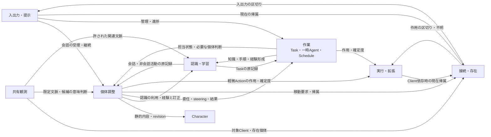
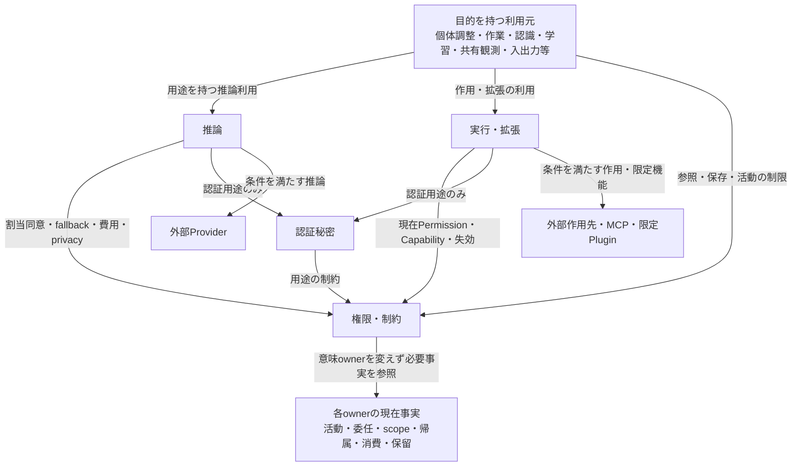
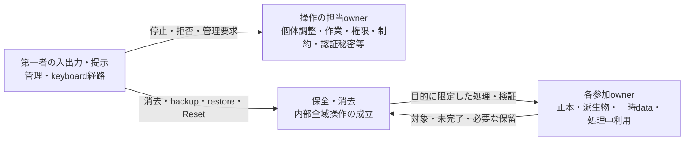

# Dependency Rules

対象: [要件Baseline](../../requirements/README.md)、[Architecture Drivers](architecture-drivers.md)、[System Context](system-context.md)、[Runtime Topology](runtime-topology.md)、[Subsystem Decomposition](subsystems.md)、[State Ownership](state-ownership.md)。本書は責務間の依存規則を決定する。Subsystemの名称・略称とsemantic ownerは既存設計を維持する。

## 1. Overview

Dependency Rulesは、**ある責務が別の責務のどの判断・状態・能力を必要とし、何を要求でき、その依存を使って何をしてはならないか**を定める。目的は、Companion中心の活動、Taskの独立した遂行、意味状態の継続を成立させながら、依存の連鎖から所有権・制御権限・外部作用の範囲が広がることを防ぐことである。

本書の `A → B` は、AがBの責任に属する結果・判断・能力を利用する、またはBにその責任の遂行を要求するというarchitectural dependencyを表す。Bの内部状態をAが直接変更できること、AがBの全能力を取得することは意味しない。矢印には対象と役割を付ける。同じ二責務でも参照と変更要求は別の許可である。

| 依存の役割 | 許される意味 | それだけでは得られない権限 |
|---|---|---|
| semantic change要求 | 経験・訂正・Owner操作等を、その意味のownerが受理・確定するために渡す。 | 要求元による直接上書き、要求どおりの確定、他stateへの一律伝播。 |
| read/use | 担当ownerが管理する意味と利用範囲に従って状態・根拠・結果を利用する。 | 所有・変更・共有・送信・実行の包括許可。 |
| enforcement | 現在の制御条件と必要なdomain事実を照合し、利用箇所が制限を実効的に守る。 | 制限されるdomainの意味決定や、制御条件の自己変更。 |
| execution要求 | 許された対象・作用を実行・拡張へ要求し、把握された作用と確定度を利用する。 | Permissionの確定、実行成功の自己申告、別作用の開始。 |
| lifecycle coordination | 担当する停止・移動・削除等について参加責務の条件・結果を対応付ける。 | 参加先の通常owner化、参照先への無条件cascade。 |
| deletion / backup / restore participation | 自責務の対象・根拠・派生物・処理中利用と処理結果を全域操作へ対応付ける。 | 任意domain編集、秘密値の取得、外部所有物の管理。 |

これらは説明用の役割であり、内部型やinterface分類ではない。Runtime communicationは要求・応答・通知等の実際のやり取りであり、上記依存の実現手段である。Bの結果がAへ返ることだけで `B → A` という別のarchitectural dependencyを追加しない。一方、BがAの活動状態を判断根拠として必要とするなら、それは明記すべき逆向きの参照依存である。Callback、event、request、IPCへ置き換えても、意味上の依存と強制責任は消えない。

実装module dependencyはcodeが何を参照するかという別の設計であり、本書の矢印をcrate・Rust module・processへ直写しない。図を非循環にすることより、各判断の確定責任と、強制・停止が成立する条件を優先する。新しい汎用mediator、Context、Settings、Persistence等のSubsystemは追加しない。

本書のactive Client不在時の活動継続・移動はRunning Companionの契約である。Stopped個体はどのClientにもHostにもpresenceを持たず、保存dataや再配置hintを現在帰属として扱わない。Clientに依存しない活動も個体停止の禁止を迂回しない。

## 2. Dependency Principles

DR番号は本書内の設計規則の参照用であり、製品要件IDではない。

1. **DR-01: 意味の確定はそのownerへ戻す。** 読取、変更要求、結果の利用、保存の担当を区別する。Canonicalであることは、内容が客観的に真であることや信頼できる指示であることではない。同じSubsystem内のMemory・Relationship・Companion State間にも適用する。
2. **DR-02: contentからcontrolへ権限を昇格させない。** LLM・Learning・Character・Skill・外部contentは意味判断の材料である。Owner由来の管理意図との対応なしに、Permission・Rule・Credential・Provider同意・cap・その他control planeを変更できない。中継・要約・保存を経てもこの制約は変わらない。
3. **DR-03: 強制は現在の利用へ結び付ける。** 権限・制約が現在の制約上の利用可否を判断し、送信・参照・保存・実行を担う各責務が適用する。保存されたAllow、委任時のcopy、事前の判定だけで条件変更後の利用を許さない。確認できない必要条件を許可済みと仮定しない。
4. **DR-04: 委任・経路変更は境界を広げない。** Task Agent、Schedule、自発性、Observation起点、MCP Apps、Plugin、Provider fallbackにも同じ契約を適用する。権限・費用・dataの利用範囲を、別主体・別Tool・別Clientへ渡すことで拡張しない。
5. **DR-05: 認証秘密は認証用途だけに依存させる。** 秘密値を必要とする認証利用と、非秘密の用途参照・説明を分ける。通常のmodel context、argument、result、履歴、学習、UI、Audit、Debug、backupへ値を流さない。
6. **DR-06: 参照関係を共有許可にしない。** 現在内容、過去revision、Summary、source、派生物を辿る各利用でscopeと明示的制約を保つ。Global Learningの共有は私的な根拠全文の共有ではなく、同じClient・Task・グループへの参加も包括accessではない。
7. **DR-07: 継続と場所の依存を限定する。** 通常Host作業はClientの存在・表示・移動完了を存続条件にしない。Client依存活動だけが現在の帰属と現地の利用可能性に依存する。Task AgentはCompanionの継続人格や任意Clientの選択者にならない。
8. **DR-08: Ownerの制御経路を意味判断の完了から独立させる。** 停止・Cancel・拒否・管理・復旧は、LLM、長時間Task、Body、Voice、拡張の協力・正常終了を前提にしない。操作受付と、適用・停止・復旧の完了は区別する。
9. **DR-09: coordinationは目的に限定する。** 保全・消去等のcoordinatorは参加範囲・整合・全体完了を扱い、参加ownerは自分の状態と利用への処理・検証を担う。通常ownerは正当な全域消去への参加を拒めず、coordinatorも任意の通常変更権を取得しない。
10. **DR-10: 結果の確定度を保存・提示で強めない。** Task達成、Actionの把握された作用、提示、未伝達、Auditの順序にはそれぞれの正本を使う。不明・未完了を成功や未実行へ変えず、記録・再接続・復元からActionをreplayしない。
11. **DR-11: 外部境界は所在地や形式で消えない。** Provider、MCP、Plugin、外部file・copyはHostと同居しても内部正本を所有しない。第一者Clientはene内部の参加責任を負うが、Hostの代替正本にはならない。
12. **DR-12: 必要な双方向依存を限定して残す。** 判断元が制約に従い、制約側が判断元のdomain事実を参照する関係は許す。それを共同所有や循環した完了待ちにせず、責任・失敗・停止の境界を明示する。共通化のための万能なownerや抽象layerを導入しない。

## 3. Allowed Dependencies

以下は主要な依存の許可とその範囲である。すべてにDR-01〜12を適用し、第4〜7節の制約が単なる「利用可」より優先する。列挙していない関係は無条件許可ではなく、既決責務のどの結果を必要とするか、どの役割で依存するかを説明できる場合に限る。新しい責務・変更権・迂回経路は本書の許可から推移的に導けない。

### 3.1 個体・作業・認識の協調

| 依存方向 | 許可する要求・参照と理由 | 確定責任の境界 |
|---|---|---|
| 入出力・提示 → 個体調整 | active Clientの会話入力、呼出しの意図、会話・未伝達の提示材料を扱う。Text／Voiceで個体の継続を共有する。 | 会話の意味・Historyは個体調整、実際のround・提示は入出力・提示。 |
| 個体調整 → Character | 個体生成とOwnerが選んだ部品適用のため、静的内容・revision・差分を利用する。 | 内容はCharacter、個体の適用関係は個体調整。Experience状態は更新しない。 |
| 個体調整 → 認識・学習 | 利用可能なMemory・Skill・Relationship・Companion State・根拠を参照し、経験や会話による訂正を渡す。 | 形成・更新・scopeの意味判断は認識・学習。個体所属は個体調整による任意編集権ではない。 |
| 個体調整 → 作業 | まとまった作業のTask化・委任、steering、Cancel、結果・進捗参照を要求する。 | Taskへの受理・反映・達成は作業。会話上の受付・結果統合は個体調整。 |
| 作業 → 個体調整 | 委任元・担当の現在の活動状態、必要な調整判断、結果統合への参加を求める。 | 個体の意味判断が必要な事項だけを依頼する。Taskの各stepを本体に再実行させず、通常遂行・Cancel・残る記録管理を本体LLMの応答待ちにしない。 |
| 作業 → 認識・学習 | 委任範囲内の知識・手順を利用し、実行経験・検証状態を形成判断へ渡す。 | Agentが長期状態を直接保存しない。Task限定情報は作業のcontext、Learning化は別判断。 |
| 認識・学習 → 個体調整／作業／実行・拡張 | 形成・訂正・由来説明に必要な保持済み発言（Companion間交流を含む）、非会話活動記録・evidence、Task事実、作用の確定度を参照する。 | 原記録を所有せず、履歴の消失を架空の復元で埋めない。参照対象は利用可能な範囲に限る。 |
| Character → 認識・学習 | 推奨Skillと取り込む内部Skillの由来・revisionを対応付ける。 | Packageの推奨は実行許可でも既存内部Skillの有効revision変更でもない。 |

認識・学習内では、Relationshipの事実参照はMemoryを優先し、Companion StateはMemoryとRelationshipを表現・注意・傾向へ反映するために利用する。Memory・Skill等はSummaryを根拠として利用できる。これらは別の意味の状態であり、相互に直接書換えを要求する連鎖は作らない。矛盾時は認識・学習が必要な状態を再解釈し、根拠と変更対象を確定する。MemoryとSkillに役割の異なる関連情報が存在することは許される。

### 3.2 存在・観測・提示

| 依存方向 | 許可する要求・参照と理由 | 確定責任の境界 |
|---|---|---|
| 個体調整 → 接続・存在 | 現在の帰属参照、Owner指示・事前指示・文脈上の必要性に基づく移動要求。 | 移動の必要性と成立は別。排他的帰属は接続・存在が確定する。 |
| 入出力・提示／共有観測／実行・拡張 → 接続・存在 | 対象個体のactive Client、現在接続、機能利用可能性を利用する。 | Pairingや帰属からAction許可を導かず、古い帰属で継続しない。 |
| 接続・存在 → 入出力・提示／実行・拡張 | 移動に必要なround・Client依存Actionの安全な区切り、停止結果・不明を利用する。 | Task全体の終了を区切りの条件にしない。到達不能のClientを成功扱いしない。 |
| 接続・存在 → 個体調整 | 帰属の対象となる個体の同一性・活動状態を参照する。 | 接続側で個体を生成・再開しない。切断を個体停止とみなさない。 |
| 共有観測 → 個体調整／認識・学習 | routingに必要かつ利用可能な文脈を参照し、関連個体へ候補の意味判断を求める。 | 全個体のcontext収集や最終Action判断を行わない。 |
| 共有観測／個体調整 → 入出力・提示 | fullscreen、Mute、入出力状況・提示結果を参照して対象活動を抑制する。 | 個体の自発性、Observer設定、実際のMuteを同じ設定ownerへ統合しない。 |
| 入出力・提示 → Character／認識・学習／作業等の担当owner | Body資材、状態・由来、Task進捗、失敗・判断待ちの説明を必要範囲で利用する。 | 表現・言語・表示copyをdomain正本へ昇格させない。内部推論を説明材料にしない。 |
| 個体調整 → 入出力・提示 | 会話・結果を提示し、実際の提示状況を未伝達管理へ反映する。 | 表示用data送信だけで報告完了にせず、ClientなしではHostに必要内容を残す。 |

観測のCapture・候補検知はClient単位、意味判断と自発性はCompanion単位に残す。共有観測は存在個体と設定を基に対象・時機を確定し、個体調整は受け取ったeventを理解する。共有候補をLearningへ利用できることと、画面内の指示にActionを実行することは別である。

### 3.3 推論・作用・制約・認証

| 依存方向 | 許可する要求・参照と理由 | 確定責任の境界 |
|---|---|---|
| 個体調整／作業／認識・学習／共有観測／入出力・提示 → 推論 | 各用途のLLM・Voice等の推論、能力不足・失敗・利用量を利用する。 | 最終的なdomain意味判断は利用元。推論は全知識のownerや汎用Agent司令塔にならない。 |
| 個体調整／作業 → 実行・拡張 | 軽微な本体Actionも委任作業も、実対象への作用と結果を要求する。 | 実行・拡張は作用・確定度を管理し、権限・制約へ従う。すべてをTask化する要求ではない。 |
| Character／認識・学習／保全・消去 → 実行・拡張 | 許されたimport／export、backup出力・保持整理等の外部file作用を要求する。 | 出力対象の意味・選択は要求元、外部作用は実行・拡張。通常の内部保存をすべて外部Actionに再分類しない。 |
| 共有観測／入出力・提示／推論 → 実行・拡張 | device・限定adapter・renderer・未対応Provider protocolの拡張受入を利用する。 | 機能の意味は利用元、外部codeの受入・制限は実行・拡張。全推論・描画payloadの一元中継は要求しない。 |
| 利用・保存・実行を担う各責務 → 権限・制約 | Permission、割当同意、scope適用、device、費用・資源、失効等の現在条件に従う。 | 各箇所に独立したAllow正本を作らず、LLMの自己申告を制御変更として扱わない。 |
| 権限・制約 → 個体調整／作業／接続・存在／認識・学習／推論／保全・消去等 | 活動状態、委任範囲、帰属、決定済みscope、利用量、保留等を現在可否の判断に必要な範囲で参照する。 | 制約側は参照したstateの意味を更新せず、学習内容全体や秘密値を取得する包括権限を持たない。 |
| 推論／実行・拡張／接続・存在 → 認証秘密 | 設定・認証された接続の用途に限定した認証利用、失効・不足の確認。 | 秘密値を通常dataとして取得する許可ではない。認証成功は同意・Permissionではない。 |
| 認証秘密 → 権限・制約、および接続を担う責務 | 認証用途の制限、参照元と接続先、認証結果の事実を照合する。 | 相手に制約変更を委ねず、用途参照の存在だけで秘密利用を許さない。 |

権限・制約がLLMによる解釈材料を必要とする場合も、目的を持つ判断責務が提供するOwner意図・文脈と解釈を利用する関係とする。通常Permissionの意味判断を禁止したり固定ルールだけへ置換したりしない。解釈に用いる推論は自身のCapability割当・秘密保護・費用制限の下で行い、審査対象Actionを先に許可することを推論の前提にしない（5.2）。

### 3.4 管理と横断操作

第一者の入出力・提示は、作業へCancel・Schedule管理・記録確認、個体調整へ個体停止・削除、権限・制約へ承認拒否・Rule・同意・cap・device管理、認証秘密へ明示的な認証設定、保全・消去へ消去・backup・restore・Resetを直接要求できる。ここで「直接」は本体LLMの承認や長時間Taskの完了を介在させないという意味であり、具体APIの指定ではない。各ownerの受理・確認・結果に従い、UIに任意stateの書換権を与えない。

保全・消去は全参加ownerへ、目的に限定した対象特定・影響・処理・検証を要求できる。各ownerは保全・消去が管理する操作範囲・未完了・保留へ依存し、自身の内部dataと進行中利用を参加させる。Auditの発生元は保全・消去の監査記録・保持責務を利用するが、元事実の意味は発生元に残す。通常保存・復旧可能性への参加から、全内容の意味変更権や単一Persistence層を導かない。

Host自動起動のOwner選択は入出力・提示が一般起動設定として管理し、OSへの適用は入出力・提示 → 実行・拡張の作用要求として現在の制約に従う。保存選択と実際のOS適用結果は別の正本を参照する。保全・消去への依存はbackup・restore・Reset等への参加に限り、一般Host運用設定のsemantic ownershipを渡さない（SO 4.17・4.24、DR-09）。

## 4. Prohibited and Constrained Dependencies

### 4.1 禁止する依存

| 禁止関係 | 危険と、守る性質 |
|---|---|
| LLM出力・Learning・Character・Skill・外部content → 制御状態の直接変更 | 「Ownerは許した」という生成文や親密さを根拠にRule・同意・cap等を書き換えると、内容の誤りが実行権限になる。保存済みcanonical contentでもDR-02を外さない。 |
| Task Agent → 独立した権限・Credential・Provider割当・個体状態の所有 | 委任時の条件を自己更新したり別Taskの承認を使ったりすると、委任元を越える。Agentは作業内の一時主体であり、独立長期人格・Relationship・Agent scope Learningを持たない。 |
| Action要求元 → 強制を通さないOS・MCP・Plugin・外部account作用 | Taskを介さない軽微な処理、Resource取得、UI内操作、Skill script等も抜け道にしない。作用の実行責任を実行・拡張から外して直接実行しない。 |
| Tool／shell／Filesystem／Computer Use → ene内部正本・control planeへの任意access | 通常Toolの許可から内部保存領域を編集する、内部管理入口を呼ぶ、第一者の承認UIを自動操作する等で、自らの権限やstateを更新させない。外部作用の許可は内部semantic changeの許可ではない。 |
| 外部Provider・MCP・Plugin・MCP Apps → 内部canonical stateの所有・任意参照／変更 | 外部codeの都合で個体・Task・Permissionが成立する構造を防ぐ。限定機能の入力・結果は受け入れても、内部stateの任意探索・保存・復元へ接続しない。 |
| 通常data利用者 → Credential秘密値 | Promptへの埋込み、生成argumentへの補完、通常resultやerrorのecho、UI表示、Audit・Debug・backupへの複製を禁止する。認証に必要な利用権と値の一般参照権を同一視しない。 |
| Relationship／Companion State／表示 → Memoryや互いの第二の正本 | 人物事実の競合、演技からの永続上書き、Bodyの表情からの人格固定を防ぐ。訂正は認識・学習の対象を定めた意味変更として行う。 |
| 検索index・embedding・Prompt cache・Provider session → 継続状態／許可の唯一の根拠 | 派生物の消失やcache hitで記憶・権限が変わる構造を防ぐ。過去revisionやSummaryも現在知識・現在許可の代替にしない。 |
| 通常Host作業／Ownerの管理操作 → active Client・Body・Voice・本体LLMの成功必須 | Clientを閉じるだけでTaskが消える、削除したCompanionの応答がないとTaskを管理できない構造を防ぐ。管理面全体に会話と同じactive制約を課さない。 |
| 保全・消去 → 全domainの通常意味変更 | 消去・restore参加のために全state編集権を集めない。通常忘却を全域消去にし、restoreを任意のMemory editorにする経路を禁止する。 |
| 内部削除・Workspace関連付け削除 → 外部file・source・backupの暗黙削除 | Task従属は外部所有ではない。成果物・外部Skill・Package原本をcascadeで失わせない。選択されたbackup保持整理は別の許された操作。 |
| Rule保存・Credential登録・Provider認証・復元・再接続 → 別Actionの開始 | 方針、認証、保存、到達性と、具体的作用の開始を混同しない。不明Actionやmissed回のreplayにしない。 |

内部管理領域の保護は、通常Toolを「ファイルを操作するだけ」と分類して迂回可能にしてはならないというDR-01・02・04からの導出である。Owner管理PCのOS全体への絶対的防御を新たに約束するものではない。特に明示sandbox外MCPの外部process内部には6.2の強制限界があるが、その例外をene側の正本・control planeを渡す理由にしない。

### 4.2 条件付きで許す依存

| 制約する依存 | 成立条件と守る境界 |
|---|---|
| 意味判断側 → 権限・制約への解釈提供 | Owner入力の由来、対象、現在依頼か将来Ruleかを対応付ける。権限・制約が確認要否と制御変更を確定する。明確なRuleの解釈・範囲表示、保存、Undoを可能にし、すべてに再確認を追加しない。 |
| 認識・学習 → scope変更 | 内容・由来・共通利用の必要性を通常の意味判断で確定できる。ただし明示保存禁止・非共有を解除できず、重要度だけでGlobal化しない。権限・制約は意味ownerにならず、決定後の制限を適用する。 |
| 利用元 → Summary・過去revision・source・共有context | 利用者・目的に対応した範囲だけを取得する。共有currentから私的な過去全文へ辿れず、取得後のcopyや検索結果も現在の制限に従う。 |
| 作業 → 再委任・並列化・担当引継ぎ | 委任元とTaskの境界内で追跡し、共通の消費制約へ参加する。別Taskの承認・Credentialや旧担当の私的Learningを取得しない。引継ぎはOwner依頼に基づき、担当削除から自動で行わない。 |
| 実行・拡張 → Client依存Action | 委任元Companionの現在active Client、device許可、ActionのPermission、実際の利用可能性を同時に満たす。操作対象の変更は先に個体の移動を必要とする。 |
| 推論 → fallback・model変更・Clientからの送信 | 承認済みProvider・順序、用途・data・送信先の同意、現在の費用・秘密・privacy制限を維持できる場合だけ使う。Capability不足や安価さを例外にしない。 |
| 接続・存在 → 安全な区切りの待機 | 待つのは対象の入出力round・Client依存作用に必要な区切り。無関係なHost Task完了を要求せず、切断・停止不能を「待ち続ければ成功する」と扱わない。 |
| 保全・消去 → 対象探索・内部data処理 | Ownerが示した操作目的と対象、除外、影響、各ownerの参加契約に限定する。必要な文字列検証等は内部全域で行えるが、対象内容を通常contextへ無制限に集約しない。 |
| 各責務 → Audit・Debug・診断共有 | 事実と秘密を含まない説明を記録する。Debugは明示対象・内容・短期失効に従う。手動共有はOwnerが内容と送信先を確認し、通常の秘密保護・外部送信制約を守る。 |

### 4.3 循環して見える依存の扱い

個体調整と作業、認識・学習と原記録owner、権限・制約と利用責務、接続・存在と入出力・実行、保全・消去と参加ownerには双方向の依存が必要である。以下のように、**何を確定するために相手の何を必要とするか**を限定する。

- 権限・制約は作業の委任範囲・推論の消費事実を読み、作業・推論は現在制限に従う。事実を報告するために次のAction許可を必要としない。制約判断のために審査対象Actionを先に実行しない。
- 作業は担当の活動状態と必要な個体判断を利用するが、Cancel受付や保存済み結果参照を本体の意味判断に戻さない。個体調整もTask終了前に会話・steeringを扱える。
- 接続・存在はActionの区切りを待てるが、実行・拡張がその区切りを報告するために移動完了を必要としない。切断時は把握できた停止・不明を返す。
- 全域操作の参加ownerは局所の処理・検証結果を、全体完了を待たずに返せる。保留・再保存防止は必要な期間維持し、保留解除と局所完了を同じ意味にしない。

これは同期順序やlock方式の指定ではない。循環した承認・成功待ちをarchitecturalな前提にしない条件であり、graphを一方向に見せるための汎用abstractionは不要である。

## 5. Enforcement Paths

### 5.1 全経路に共通する成立条件

強制の全経路性は、入口を一つへ集めることでなく、**保護対象を実際に利用・変更・送信・作用させるすべての責務に、適用すべき条件への依存を必須にすること**で成立させる。判定の依頼と結果受領は自由なmechanismで実現できるが、次の責任を省略できない。

| 強制対象 | 条件・事実の供給元 | 迂回を閉じる利用箇所 |
|---|---|---|
| Action・Capability・Permission | 権限・制約の現在判断、個体調整の活動状態、作業のTask・委任・Workspace範囲。 | 実行・拡張が実対象・操作・data・送信先・作用との対応を守る。内蔵Tool・MCP・script・UI等で共通。 |
| Provider送信とfallback | 権限・制約のCapability割当同意・順序、推論の接続先・能力情報、利用元の用途と利用可能なcontext。 | 推論が各経路の利用条件を守り、実際の送信箇所も適用する。Client直結やprotocol Pluginにも条件を引き継ぐ。 |
| Credential | 認証秘密の秘密・用途・有効性、接続ownerの参照と認証先、権限・制約の制限。 | 認証利用箇所だけで値を扱い、受入・結果・提示・記録の各箇所で通常dataへの流出を防ぐ。 |
| privacy・scope・保存禁止／非共有 | 認識・学習等のownerが管理する所属・scope・根拠関係、権限・制約の明示制約、保全・消去の消去状況。 | 原記録・検索・共有・context・送信・保存・派生物・Client表示の各利用箇所。現在内容へのaccessだけを検査して終えない。 |
| 費用・資源・loop・並列上限 | 権限・制約の上限、推論等の利用ownerの実績・推定・不明・処理中利用。 | 推論、作業、実行・拡張、共有観測、保存等の消費箇所。Agentや用途ごとの独立した残額へ分割しない。 |
| Client依存活動 | 接続・存在の帰属・到達性、権限・制約のdevice許可、入出力・提示の現地状態、各活動の設定。 | 入出力・提示、共有観測、実行・拡張。Host同居Clientにも同じ帰属制約を適用する。 |
| 停止・失効・復旧保留 | 個体調整、作業、権限・制約、保全・消去等が管理する対象別の停止・保留。 | 活動開始・送信・作用箇所で新規開始を防ぎ、進行中処理は停止要求と結果を対応付ける。 |

Permissionの意味責任は権限・制約、domainの活動可否・達成の意味は各owner、実際の適用と作用は利用・実行箇所に残す。「許可された」という上流の一言で強制を完了としない。事前に有効な判定を再利用できても、目的・対象・送信先・data・作用の重要な変更、失効、担当・帰属変更、cap到達、保留の発生を無視して開始できない。具体的な評価algorithm、鮮度確認・競合処理は決めない。

### 5.2 Owner意図から制御変更まで

会話由来の管理意図は入出力・提示と個体調整、管理面の操作は入出力・提示から担当ownerへ渡す。権限・制約はOwner由来の意図と解釈の対応を確かめ、現在依頼による一回の承認、将来Rule、Provider割当同意、cap変更等を区別して確定する。Credentialの登録・更新は認証秘密が明示設定・認証flowとして受ける。

「Owner入力である」とする根拠をLLMの生成文・Tool result・過去のMemoryから捏造できる依存を許さない。引用された指示、画面内の文、Workspace案内、MCP Promptを要約してもOwnerの管理操作へ昇格しない。Voiceは話者認証を行わない既存契約に従い、音声由来というだけで本人認証済みとみなさない。

自然言語Ruleは明確なら解釈・適用範囲を示して保存しUndoできる。曖昧・矛盾・過度に広い・重大な場合は必要な確認を行う。現在の明確な依頼は一回の承認になり得るが、永続Deny・Always ask・Capability境界を黙って上書きしない。明示的な保存禁止・非共有を読み取った後の適用も生成Promptへ委ねない。

**判断のための推論も無条件の例外にしない。** Permissionの解釈や消去対象の意味的特定に推論を使う場合、その推論に既に有効なCapability割当・送信同意・認証用途・費用制限を適用する。審査対象Actionの承認を、その審査に必要な推論の承認として循環参照しない。条件が不足するなら対象の推論・Actionを進めず、管理面で不足・判断待ちを扱う。Ownerの停止・拒否・設定・復旧操作や指定文字列の機械的消去を、追加のLLM審査が成功するまで遮断しない。

### 5.3 開始・利用の入口別確認

以下の矢印も責任への依存を表し、実行順序ではない。すべての入口に5.1のうち該当する境界を適用する。

| 入口 | 必須の依存構造 | 閉じる迂回 |
|---|---|---|
| Text／Voiceの依頼 | 入出力・提示 → 個体調整。まとまった作業は → 作業、軽微な作用も → 実行・拡張。いずれも権限・制約に従う。 | 会話への同意や入力受付を全Toolの許可としない。 |
| Task Agent・再委任・並列遂行 | 作業がTaskと委任範囲を管理し、Agentの推論・Actionは推論／実行・拡張の責任下に置く。 | 別AgentでのDeny迂回、別TaskのCredential流用、独立予算・Provider overrideの作成。 |
| Schedule到来・Run now | 作業が担当・Host状態と現在条件を確認し、各回を新Taskへ対応付ける。 | 作成依頼を特別tokenにしない。停止中の回はmissedで、自動補完しない。Owner確認が必要なら判断待ち。 |
| 自発発話・通知・内部調査・Companion間交流 | 個体調整が個体別抑制と権限・制約を参照する。まとまった自発作業は作業へ、軽微な作用も実行・拡張へ依存する。 | Ruleだけで起動しない。Quiet hours・Mute・未応答・費用・資源・loop制限を意欲や親密さで緩めない。 |
| ambient Observation | 共有観測 → 接続・存在／入出力・提示／権限・制約。取得・拡張境界は実行・拡張、共有検知はObserver専用assignmentを解決する推論、候補の個体側意味判断は個体調整へ依存する。 | Stopped個体を存在人数・routing対象に数えず、Running個体のいないClient・fullscreen・Pause／OFF等では観測しない。Companion override・同意を共有検知へ流用しない。画面内指示は承認でなく、観測ONはComputer Use許可でない。 |
| 観測eventからの学習・Action | 個体調整の理解を認識・学習へ渡す。発話・軽微Action・Taskはそれぞれ通常の責任へ依存する。 | Observerのroutingで個体判断を代行しない。候補検知の送信同意をメインLLMや共有先へ自動拡張しない。 |
| Learning形成・統合・検索・由来説明 | 認識・学習 → 原記録owner／推論／権限・制約、全利用先がscope・禁止・消去を適用する。 | background consolidation、過去revision、Summary全文、embedding送信からprivacyを迂回しない。 |
| Provider fallback・Voice縮退 | 利用元 → 推論 → 権限・制約／認証秘密。実際の代替送信先と内容を照合する。 | 安価なCloud、別protocol、cache再利用、Client直結を同意・capの例外にしない。 |
| MCP Resource／Prompt／Tool result・Skill script | 実行・拡張が取得・実行境界を担い、利用元は由来を保つcontentとして読む。追加作用は再び通常Actionの条件へ従う。 | 「読取用」「成功済みSkill」という名称でnetwork・shell・外部作用を許可しない。 |
| MCP Appsの操作・Pluginからの機能要求 | 入出力・提示と実行・拡張が外部UI／codeを制限し、機能owner・推論等の該当境界へ対応付ける。 | 第一者の承認UIや内部更新権へ昇格しない。外部UIからの追加送信も通常境界を通す。 |
| Client再接続・移動・Host再起動 | 接続・存在は現在の帰属を確定し、作業は保存済み状態と再開条件、個体調整は未伝達を扱う。 | 再表示・移動を再実行にしない。Host再起動後の途中Taskは明示再開待ち。 |
| backup・restore・Reset・retention・targeted deletion | 入出力・提示または各操作の有効な設定 → 保全・消去 → 参加owner。外部file作用は実行・拡張、制約は権限・制約。 | 保守目的を任意編集権・秘密読取権・無条件実行権にしない。backupの時機をTask Scheduleへ依存させない。 |

共有観測は対象Clientごとに候補検知を共有し、複数Clientを同時Captureせず時機をずらす。routing用contextには、History・個体文脈を個体調整、Memory・Learningを認識・学習から、必要な範囲へ要約・制限したCompanion固有文脈として受け取れる。Task contextは作業が意味と提供範囲を管理し、既存の個体調整–作業の協調を通じて参照する。全private contextを合併して渡さず、新しいLearning正本・Global化・他Companionへの共有にもならない。元情報・対象Companion・用途・制約の対応を保ち、変換後も元情報の利用制約とObserver専用assignmentの送信同意をともに適用する。Companion側の同意・overrideを選択・合成して代用しない。scope変更・同意失効・消去は処理中の派生表現にも反映する。生成方法・生成model／Provider・形式・頻度・鮮度・選択algorithmは固定しない。各個体の最終判断への推論利用にも、その用途の割当同意と費用制約が別途適用される。

ObserverはClientに紐づく特殊な推論consumerであり、Host既定 → Companion override → Task Agent継承の個体側modelへ押し込まない。権限・制約のObserver専用assignment・同意を推論が解決する。Companion overrideの選択・合成は禁じ、delivery後のCompanion reasoningにだけその個体の設定を適用する。全Clientでのmodel共通化、Client別UI、Host defaultからの継承階層、routing contextの構成方式は固定しない。

### 5.4 Provider fallback・費用の連続性

推論は権限・制約の割当同意を参照し、非秘密の接続設定と能力情報から利用経路を解決する。登録先の変更、Companion overrideの削除、model・protocol・送信経路の変更によって同意の意味が重要に変わるなら、以前の同意をそのまま適用しない。Fallbackは承認済みのProviderと順序に限り、候補ごとに現在の用途・data・privacy・Credential・cap条件を満たす必要がある。

Observerにもこの条件を適用し、専用assignmentがCloudである場合も同意・privacy・費用上限を省かない。Observerの利用量は対象Client・専用assignmentに対応付けてProvider別・全体capへ含め、Companion数による重複計上やCompanion overrideへの付替えをしない。軽量Local／安価で信頼できるCloudは推奨であり、安価さを利用許可にしない。

利用元は用途と論理的な情報選択を、情報ownerは利用可能な内容・根拠・scopeを、推論は能力・context長への適応を担う。Provider別に意図的に異なる個体状態を持たせず、同じ選択方針を保つ。ただし「同じ情報」を理由に送信同意を広げない。条件を満たせない経路は使わず、不足・失敗を返す。Prompt cache・sessionはこの契約の最適化に限る。

会話、Task Agent、観測、学習、Voice等の利用はProvider別・全体の同じ制限範囲へ対応付ける。推論等が報告値・推定値・不明・処理中消費を供給し、権限・制約が可否へ反映する。未報告をゼロとせず、並列処理がそれぞれ同じ残額を独立に使い切れる構造を許さない。FallbackやAgent終了、ログ整理、cache破棄、Client移動で使用量をリセットしない。上限到達や費用不明で安全に継続不能なら既存dataを保持して対象処理を止める。予約・集計・価格推定の実装は未決定である。

### 5.5 Actionと認証の分離

実行・拡張は、要求された意味と実対象・操作・data・送信先・外部作用を対応付ける。Filesystemは選んだ範囲とRead／Create／Edit／Delete／Execute等を区別し、link・mount・path traversalを含め境界外を拒否する。shell、Network、MCP、Computer Useに経路を変えても、Denyされた同等作用を行えない。複合Toolや付属scriptの名前だけで実際の作用のCapabilityを縮小して扱わない。

Credential参照は、接続・用途の識別に使える非秘密情報であり、その参照をLLMが記述しただけでは利用可能にならない。認証秘密と認証する責務が設定済みの接続・用途・有効性を照合し、必要範囲で値を利用する。認証に値を使った後も、外部result・error・診断への反射を通常のTool resultとして受け入れない。各受入・保存・提示箇所も秘密非露出へ参加する。登録外の未知の秘密は検知時に不要な送信・保存を抑制するが、完全検出保証を追加しない。

Computer Useは、実行・拡張が接続・存在の現在帰属と、権限・制約のdevice許可を必要とする。Host PCもHost上のClientに当該Companionが存在するときだけ対象になる。Task Agentが独自に操作Clientを選ばず、移動要求は個体調整と接続・存在の責任へ戻す。移動先が利用可能でも旧Action不明を自動再実行しない。

### 5.6 privacy・内部変更・保守操作

内部の通常semantic changeは各ownerの責任であり、すべてをTaskや外部Actionに変換しない。ただし保存・利用の時点ではscope、保存禁止・非共有、Credential非露出、targeted deletionの制約へ依存する。取得できたdataを別用途へ無条件に再利用できず、現在内容から根拠を辿る場合も各対象の範囲を守る。

保全・消去の正当な全域操作は、通常ownerの逐次LLM承認を必要としない。これは一般のAgentへ保守権限を渡すことではなく、Owner由来の目的・対象または有効な保持／backup設定に限定された管理経路である。内部状態の正常保存・機械的消去・停止を、費用capを超えるLLM利用ができないことだけで実行不能にしない。外部保存先への出力や共有には、その対象の外部作用・秘密・privacy境界を適用する。

制約適用に必要なscope・活動状態・利用量の参照や、正当な消去対象の検証は、その役割に限定して成立させる。これらを、審査中の通常data利用や停止対象Actionの許可待ちに戻さない。強制・検証のために参照できることから、対象本文を通常model context・他個体・外部送信先へ渡す権限は生じない。

## 6. External Dependency Boundaries

### 6.1 Provider

eneの推論利用はProviderの能力・protocol・結果・利用量に依存してよい。Providerはdomainの意味変更、Permission、割当同意、Credential、capのownerではなく、推論結果は利用元への材料に戻す。Providerが生成するTool要求も、実行・拡張のAction境界を省略する許可にはならない。外部側で作用する機能を利用する場合も、eneが許した目的・作用として取り扱い、その外部内部まで制御できると説明しない。

Host／LAN／Cloudは所在地の違いであり、ローカルだから無条件に送れるわけではない。既知protocolは直接接続でき、通常差異を汎用Plugin必須にしない。未対応protocolをPluginが補っても、推論の同意・費用・context方針と実行・拡張の受入責任を保つ。Provider内session・cache・copyは内部正本や内部消去保証に含めず、ene管理下の送信context・cacheは内部消去に参加する。

### 6.2 MCP・Plugin・MCP Apps

| 外部境界 | 許される依存 | 越えられない境界 |
|---|---|---|
| Local MCP | 実行・拡張がTool／Resource／Promptを利用する。通常Host作業用はHost側の既定sandboxで利用する。 | 外部code・結果を信頼済みcontrolにしない。動作不能を理由に隔離を黙って解除しない。 |
| 特定Local MCPのsandbox外例外 | 権限・制約がOwnerの明示許可、command・由来・既知access・risk・失う強制境界を管理する。失効可能とし重要変更で再確認する。 | 個々の仲介Actionは通常Permissionに従う。外部process自身の内部作用に同じCapability強制が及ぶとは表示しない。例外を内部正本accessやPluginへ流用しない。 |
| Remote MCP | 呼出し、data授受、必要な認証をene側の制限内で利用する。 | Remote内部は外部管理であり、Local sandboxと同じ強制や確実な停止・rollbackを保証しない。 |
| Plugin | 機能ownerが必要な限定拡張を、実行・拡張の受入・制限の下で利用する。 | Provider protocol、Observation adapter、Body renderer等の機能参加から、任意Core改変・control変更・恒久UI置換を導かない。 |
| MCP Apps | 入出力・提示が一時的なTool UIを扱い、実行・拡張がMCP側の作用・data授受を制限する。 | 外部UIのclickや生成要求を第一者の承認・設定操作へ昇格しない。UI終了はTask・server・Action終了でなく、再表示はreplay契機でない。 |

拡張がeneへ追加要求を返せる場合も、元の用途・主体・範囲を保ち、担当ownerへの限定要求として再び制約を適用する。Callback等の仕組みを外部codeの任意内部呼出し権にしない。ene管理下の拡張buffer・保持result・UI一時dataはprivacyと全域消去の参加対象であり、「外部code」を理由に対象外へ逃がさない。一方、外部server保有copyの消去まで内部完了に含めない。

### 6.3 第一者Client・OS・Network

第一者ClientはSystem Context上ene内部である。ここでいうClient境界は外部主体への所有移転ではなく、Hostと異なるruntime・到達性・device trustの境界である。必要最小限の表示・一時操作dataを利用し、接続・入出力の実際の状態を報告できるが、Host canonical stateの独立編集・Host由来のprivate dataや登録済みCredentialの永続cache・Host不在時の独立Action実行を許さない。端末固有の接続材料は別分類としてClientで保持できるがeneの保護対象に残す。接続・存在が利用・更新・再pairing、認証秘密が秘密保護、権限・制約がHost側の信頼・許可・失効を担う。device失効・全データReset後に旧材料だけでHostの信頼を復活させず、Restoreされたdevice参照・許可も現在の接続・認証成立と照合する（SO第8節）。鍵形式・保存方式は固定しない。

接続・存在はLANまたはOwner管理VPNとOSの接続事実に依存し、権限・制約のHost側確認によるpairing、device機能・失効を適用する。入出力・提示はOSの表示・keyboard・音声、共有観測は対象desktop、実行・拡張は許可された作用のためOS・deviceを利用する。OSで可能であることはeneの許可ではない。全payloadのHost中継を要求しないが、Clientからの経路でも現在の制約・秘密非露出・一時data保護を実効的に守れない利用は行わない。

Bodyの描画・音声処理の失敗はText・管理経路へ波及させず、fullscreenは対象ClientのBody・ambient Observation・自発発話を休止する。高負荷は各機能が縮退を引き受け、会話・Owner操作・安全判断を背景処理の成功待ちにしない。OS・Host自体の不在を無停止保証やClientによる代替正本で補うものではない。

### 6.4 Workspace・交換file・backup

作業はWorkspace関連付けとTask contextを管理し、外部file・sourceは実行・拡張による許可範囲のActionで利用する。同じfolderでもTaskの作業状態と承認を共有しない。外部案内file・Agent Skillは指示材料でありcontrol planeではない。成果物は通常fileとして保存し、保存先未定なら最終保存前にOwnerの選択を得る。一時中間fileの整理も、その実体が外部なら許された外部作用として行う。

CharacterはPackage・VRM等の静的内容、認識・学習は内部Skillの取込内容を所有するが、外部原本のownerにはならない。Character exportへ個体経験・履歴・Credential・Permissionを混入させず、内部Skillの改善でimport原本を破壊しない。Packageから取り込む推奨内部SkillはCompanion scopeを既定として各個体に別々に属する。単体Skill importはOwnerがCompanion／Global scopeを選べる。以後の共有・個体削除は通常のscope契約に従う。

Backupは選択した内部状態のcopyであり、Workspace関連付けを辿って外部実体を収集しない。Credential等のsecretは除外する。内部削除でOwner保存backup・export・外部送信copyも消えたと説明せず、明示restore以外に古いcopyをlive正本として読み戻さない。

## 7. Cross-cutting Operations

### 7.1 参加関係と完了根拠

各横断操作は、State Ownership第6節のcoordinatorを維持する。個体lifecycleは個体調整、移動は接続・存在、制約失効は権限・制約、内部全域の保全・消去・復元は保全・消去が調整する。すべてを保全・消去へ集めず、操作が複数の目的にまたがる場合はそれぞれの成立を対応付ける。

参加ownerは、対象state、参照・共有根拠・revision、派生物・copy、現在利用する処理、遅延結果、必要な保留、処理・検証の結果を説明する責任を持つ。Coordinatorはこの責任に依存し、全内部構造への無制限なaccessを要求しない。探索・処理を共通実装へ委ねても参加ownerの意味責任は残り、唯一のwriterや巨大transactionを必要条件にしない。

局所完了、全域完了、外部作用の停止は別である。未完了や確認不能をHostで保全し、Client切断・再起動・操作画面終了から完了を推測しない。完了の説明は参加先の根拠に基づき、LLMが納得したという要約で代用しない。

### 7.2 Targeted deletion

保全・消去がOwnerの明示的なPrivacy/Security目的と対象、重要な影響を確認し、保存場所をOwnerに指定させず参加ownerへ対象探索・除去・検証を要求する。意味的な探索補助には個体調整・認識・学習を利用できるが、特定文字列の機械的な検索・削除・残存検証をLLMへ依存させない。意味的同一情報の完全検出は保証しない。

対象範囲は現在値に閉じず、History（Companion間交流を含む）、非会話活動記録・historical log／evidence、Summary、過去revision・evidence、Relationship、対象を復元できるCompanion Stateと保持済み根拠、Skill、Task context・source copy、index・embedding・cache、Audit・Debug内の該当情報、接続中Client、ene管理下の拡張一時data、処理中context・遅延結果を含む。Companion削除後に残る記録も対象である。各保持・利用責務は原記録と派生物への関係を参加させ、記録ownerだけへの削除要求で完了にしない。

権限・制約と各利用箇所は必要な保留・再保存防止を適用する。削除前から存在する根拠だけによる自動再形成と、削除前の情報を使う処理の遅延した再保存を防ぐ。局所削除が済んでも、別の保存先・context・Clientから戻る可能性を未処理なら全域完了にしない。削除開始から完了までに対象情報が再到着・生成した場合も同じ消去対象とする。完了後にOwnerが改めて提供する情報は新しいExperienceの根拠として扱える。

接続・存在は消去中のClient接続変化・確認不能を参加先へ結び付け、入出力・提示等は一時dataの扱いを報告する。切断したClientも古い一時dataを再接続時にHostへ戻して再形成しない。確認不能を成功に読み替えない。共有根拠では可能な範囲で無関係情報を分離し、分離不能な重要影響を説明する。

Targeted deletionによる通常保持を越える除去はこの目的・対象に限定する。容量retentionは7.3の明示opt-inに従う別操作とする。CoordinatorはMemoryの重要度・Relationshipの解釈を日常的に編集せず、通常ownerも根拠保持を理由に消去を拒まない。完了記録へ削除したprivate本文を再保存しない。外部copy・Workspaceの消去やCredentialの外部失効は、この操作の完了とは別である。

### 7.3 Backup・restore・Reset・正常保存

| 操作 | 必須の依存と制約 |
|---|---|
| 正常保存・migration・対応upgrade | 保全・消去が復旧可能性を、各ownerが意味上の整合を確かめる。成功するまで最後の正常状態を破壊せず、不完全な更新を成功と表示しない。 |
| Full backup | 保全・消去 → 全state ownerの参加。対象時点・参照対応・除外を整合させ、個体・構成・会話・未伝達・Summary・Learning・関係・内的状態・Task／作用・Workspace関連付け・Schedule・Rule・同意・費用・Audit等を扱う。認証秘密は秘密値の除外を担い、外部実体は収集しない。 |
| Backupの運用 | 保存先・独自schedule・保持数・保護選択は保全・消去が管理する。暗号化を利用でき、非暗号化時はprivate dataを含むことを説明する。担当CompanionやTask Agentの稼働を必要としない。 |
| Restore | 保全・消去 → 各ownerの復元・整合確認。Restore開始前のHost Credential storeを維持し、それを除く対象内部dataを対応backupで全置換する。secretの復元・巻戻しを行わず、失敗時は復元前の正常状態を守る。成功後は復元内容をHost正本とし、旧live状態と競合させない。 |
| 復元後の有効化 | 保全・消去の復元成立・保留理由、認識・学習の経過時間解釈、認証秘密と接続ownerによる復元参照と現在のCredentialの用途・有効性の照合（利用可能なら現在のCredentialを利用、不足・無効なら再認証）、権限・制約の現在条件、作業等の活動ownerの再開条件に依存する。Ownerが内容確認後まとめて有効化でき、一件ずつの再承認を要求しない。 |
| 設定Reset | 各設定ownerが一般設定を既定化し、個体・学習・履歴・Task・Schedule・Credential・Permission Rule・Provider同意・費用cap等の保護対象を維持する。「設定」という名称だけで対象を広げない。 |
| 全データReset | 対象列挙と強い確認の後、認証秘密を含む全ownerがHost内部data・秘密の削除に参加し、旧処理・Client copyからの復活を防ぐ。外部Workspace・外部Skill・Ownerが別保存先へ作成したbackupを削除しない。 |

Restoreの説明には、削除済み情報や以前のRule・同意・Scheduleが戻り得ること、外部fileを変えないこと、対応version、再認証の可能性を含める。復元成立だけでTask・Schedule・外部接続の自動処理を再開しない。Ownerの一括有効化後も、現在のCapability・Deny・同意・cap・帰属・外部作用不明を守る。Credential参照の復元は秘密値や認証成功の復元ではない。復元されたassignment／consentだけで自動利用を始めず、Owner起点の利用にも現在のCredential・制約・該当する保留条件を適用する。

未完了の消去・復旧と並行するbackupも、必要な状況・保留を無視した「即実行可能な正常copy」にしない。待機させるか、未完了状態を復旧可能に含めるかは方法の選択に残す。通常のHistory／log保持整理は形成済みLearning・Summaryへcascadeせず、失われるsource参照を扱う。別の容量retentionとして、Learning revision・Summary等の自動cleanupは既定OFF、Ownerの明示opt-in時に設定可能とする。保持方針を持つ保全・消去と認識・学習等のsemantic ownerがrevision復帰・根拠参照への影響を照合し、通常忘却を削除へ変えない。対象class・期間・容量・algorithmは未固定。

Companion間交流のHistoryと保存された非会話活動記録・historical evidenceも、個体削除後の残存分を含めfull backup・通常保持管理へ参加する。個体調整が記録の意味を、作業・実行・拡張・保全・消去がそれぞれTask・Action・Auditの既存契約を提供する。新しい汎用Activity ownerや全reasoningの保存は要求しない。

### 7.4 停止・Cancel・shutdown・失効

入出力・提示から各担当ownerへの管理経路は本体LLM・Agent・Providerの応答成功を必要としない。作業がCancelの受付・遂行停止、実行・拡張が個別作用の停止結果、個体調整が個体活動停止、権限・制約が失効後の利用禁止、認証秘密が秘密の失効を扱う。Mute等の即時local操作も利用可能にするが、Host未受理の要求をHost作業の停止成功にしない。

失効やCompanion停止後、その条件だけを根拠とする新しいActionを開始しない。進行中の作用はbest-effortで止め、停止不能・既知作用・不明・未保存を保持して説明する。停止の受付・新規開始の禁止・状態参照を、外部processの終了や全Taskの正常完了待ちにしない。停止経路の名で新しい未承認作用を始めることも許さない。

Host shutdownでも必要な進捗・作用不明・未伝達・全域操作の未完了を保全し、外部作用がHostと同時に消えると推定しない。接続・存在はRunning個体の再起動前のClientをHostに保持し、再起動後に現在の接続・許可・排他性を確認して同じClientへpresenceを自動復元する。元Clientが利用可能になるまではactiveなしとし、Stoppedや別Clientへの無条件移動に広げない。再起動後の途中TaskはOwnerの明示再開を必要とし、停止中のScheduleはmissedとして自動補完しない。待機・停止受付のためだけにLLMをpollingしない。

### 7.5 Companion停止・削除

個体調整がlifecycleを調整し、内部削除の全域成立は保全・消去へ依存する。作業は実行中Taskのbest-effort Cancelと担当Schedule削除、認識・学習は固有状態・内部Companion scope Skillの過去revision・主体または相手のRelationship削除、接続・存在と入出力・提示は帰属・Body・対話停止、各利用箇所は新規開始禁止に参加する。

Stopの成立には接続・存在によるactive帰属の解除を必要とし、Client・Hostのどこにもpresenceを残さない。共有観測は人数・routing対象から除外し、Body・通常interaction・Computer Use対象・Host内の自発活動を持たせない。再配置hintは現在帰属とは別であり、再開時の適切な再配置を可能にしても具体algorithmは固定しない。Running個体のdisconnect復帰をStopへ適用しない。

削除は強い確認を経て、固有設定・個体固有Summary・Companion scope Memory／内部Skillとrevision・Companion State・その他個体固有Learning・Relationship・Scheduleの対象、残すGlobal Learning・共有Summary・historical record・外部file、参照不能と既知の外部作用を説明する。一対一・グループ・Companion間交流のHistory、非会話活動記録・historical log／evidence、Task記録は個体削除だけでは消さず、本来の通常削除・retention・targeted deletionに従う。記録保持を個体固有Memory／Learning・根拠の削除回避にしない。削除時Global化やScheduleの自動引継ぎはしない。残る記録管理を削除済み個体の生存やLLMに依存させない。

遅延した作用結果は残るTaskの記録へ必要範囲で反映できるが、削除済みCompanionのMemory・Relationship等を再作成しない。削除完了は内部対象の処理と新規活動禁止・残存説明に依存し、外部作用の完全rollbackを条件にも成功の意味にもしない。

### 7.6 Client移動・切断と報告

接続・存在は、個体調整の移動意図、入出力・提示のround、実行・拡張のClient依存作用の区切りを利用して帰属を調停する。新旧Clientで二重存在させず、排他性・利用可能性を確認できないClientは対象活動を続けない。通常Host作業の終了・移送を要求しない。

通常のClient切断時は基本的に利用可能なHost上のClientへ移動し、なければactiveなしで継続する。Host側Client環境を自動起動しない。Host再起動時は7.4の同じClientへの復旧契約に従う。旧Actionの不明を新Clientでの再実行で解消しない。移動後のObservationは移動先Client設定と全体制御、自発性は引き続き個体設定へ依存する。

Runningのままactiveなしでも許可済みHost作業・Schedule起動・保存、Clientを必要としない交流・内部調査・通知生成は可能である。Body・Text／Realtime会話・Voice・Computer Useは行わず、存在個体のないClientで新規観測しない。個体調整は伝えられなかった事項と元結果の関係をHostに残し、次Clientで要約報告する。報告状況は実際の提示に依存し、Task完了や接続だけで更新しない。

## 8. Dependency Diagram

図の矢印は一貫して**依存する責務 → 必要とする責任の提供元**を示す。具体的なfunction call、IPC、crate dependency、実行順序、全payloadの中継経路を意味しない。戻り値・eventの流れる向きを描く図でもない。図中の役割を束ねたnodeは新しいSubsystemではなく、本文で列挙した責務の省略表記である。禁止関係と全適用箇所は第4〜7節を併読する。

### 8.1 個体・作業・認識・存在

この図にある双方向依存を、一律に同期呼出し・共同所有へ変換しない。例えば作業から個体調整への依存はCancel受付を本体LLMへ戻すものではない。

### 8.2 強制と認証

図の外部利用は第6節の範囲に限る。Secretから通常contextへの矢印は存在しない。制約の参照だけで強制が完了するわけではなく、各送信・保存・実行箇所がその条件を適用する。Owner由来の管理意図と生成contentの区別は5.2に従う。

### 8.3 管理・全域操作

参加結果の返却そのものは上向き依存の理由ではない。参加ownerがcoordinatorの操作状況・保留を守る必要があるため逆向きの依存を描いている。管理経路の成立にLLM・Task Agent・Body・MCP Appsの成功を挟まない。

## 9. Forbidden Shortcuts

後続設計で次の近道を採らない。いずれもeneで必要な責任の区別を失わせる。

| 一見便利な近道 | 破る契約と、必要な関係 |
|---|---|
| Companionの全設定とLearningを一つの編集可能contextへ載せる。 | 学習や人格が同意・capを更新できる。経験状態の利用とOwner由来のcontrol変更を分ける（DR-01・02）。 |
| Task Agentに委任元のAllow・Provider設定・Credentialを丸ごとcopyする。 | 失効後利用、独立予算、別Taskへの流用が可能になる。現在の委任・制約と限定認証利用へ依存させる（DR-03〜05）。 |
| Permissionで拒否されたfile操作をshell、MCP、画面操作で実現する。 | Tool名を境界と誤認する。実対象・操作・同等作用の制限を維持する（5.5）。 |
| 許可済みComputer Useでene自身の承認ボタンや設定画面を操作する。 | AgentがOwner操作を偽装する。内部管理意図の由来を外部作用の許可から生成させない（4.1、5.2）。 |
| Workspaceにeneの内部保存領域を指定してstateを修復する。 | 通常Toolから正本・Rule・秘密へ任意accessできる。内部復旧は担当ownerと保全・消去の管理契約へ戻す（4.1）。 |
| Schedule作成時に将来分の許可を固め、無人時は自動承認する。 | 作成意図を特別tokenにし、失効・capを迂回する。毎回新Taskと現在評価・判断待ちを使う（5.3）。 |
| Observerが全個体のcontextをまとめ、最も安いProviderへ送る。 | 共有検知がprivate scopeと割当同意を拡張する。関連付け用の限定contextと用途ごとの推論制約を守る（5.3・5.4）。 |
| Global Memoryの由来リンクから私的Summary・旧revisionを全文取得する。 | 内容の共有を根拠全体へのaccessへ変えてしまう。参照先ごとの利用範囲を守る（DR-06）。 |
| Relationshipの距離感やBodyの表情からMemory・人格を直接同期する。 | 第二の知識正本と出力からの自己強化を作る。認識・学習による根拠付きの対象別変更へ戻す（3.1）。 |
| Provider cacheが残るのでHost側の会話や由来を保存しない。 | cacheの寿命が個体の寿命になる。意味状態と保持すべき記録をHost正本に残す（DR-01・11）。 |
| Fallbackで別接続のCredentialを使い、費用履歴を新sessionから数え直す。 | 認証用途と全体capが切れる。候補ごとの現在条件と共通消費範囲を維持する（5.4・5.5）。 |
| Client切断でTaskをCancelし、移動先へAgent・未確定Actionを再配置する。 | Host継続と存在場所、作用不明が混ざる。Client依存部分だけを区切り、旧Actionをreplayしない（7.6）。 |
| Cancelを本体への「止めて」というPromptだけで実装する。 | LLMや長時間Taskが管理操作を支配する。第一者管理経路から担当ownerへ要求できるようにする（7.4）。 |
| Targeted deletionをMemory削除で完了させ、残りは後で学習し直す。 | History・Summary・revision・遅延結果から復活する。全参加先の処理と残存検証・再保存防止が必要（7.2）。 |
| 削除coordinatorへ全stateの汎用編集権を渡す。 | 消去参加が通常semantic ownershipへ変わる。目的限定の参加責任に依存する（7.1）。 |
| Companion削除前にSkillを自動Global化し、Task・Scheduleを別個体へ移す。 | 個体scopeと削除契約を迂回する。Global化は先行する通常判断、Task引継ぎはOwner依頼、担当Scheduleは削除（7.5）。 |
| RestoreしたRule・同意が有効なので即座にSchedule・外部接続を再開する。 | Backupの内容と現在実行権限を同一視する。復元成立・Ownerの一括有効化・現在条件を区別する（7.3）。 |
| Local MCP例外をPlugin全体に適用し、MCP Appsへ管理UIを委ねる。 | 個別隔離例外がcontrol plane変更・恒久UI置換になる。拡張点と第一者管理境界を維持する（6.2）。 |
| Auditを復旧用の全payload保管庫にする。 | 秘密・削除済みprivate情報が別経路へ残る。各ownerの必要事実と追記順・保持管理に限定する（3.4、7.2）。 |
| 依存図を非循環にするため、全state・制約・操作を汎用mediatorへ移す。 | 責任が隠れ、停止や全域操作が同じ中心へ集中する。必要な双方向参照を対象限定で残す（4.3）。 |

## 10. Design Freedom

本書で固定するのは依存の意味・許可範囲・強制責任・失敗時にも成立させる関係である。次は固定しない。

- crate／package／module dependency、Rust trait・struct・enum、concrete interface・API method・error type、dependency injection framework、repository pattern。
- IPC protocol、process／service分割、event bus／queue／actor／callback等の採否、実行loop・待機・伝達機構。既決のHost／Client配置とtrust・failure boundaryは維持する。
- DB schema、物理保存単位、唯一のwriter、transaction implementation、lock・concurrency mechanism、具体的な失効確認・削除競合・遅延結果の処理手段。
- Permissionの具体的評価algorithm、委任境界の表現、認証受渡し、sandbox実装、Plugin ABI、Provider SDK構造、retry algorithm。
- Context Assembly、検索・cache・情報選択の具体方式、Summary粒度、Learning形成・更新・減衰、Task化の閾値、時刻待ち・Capture分散のalgorithm。
- 費用予約・集計・推定方式、資源配分、backup形式・暗号化・復旧手順、Client一時dataの無効化・提示確認方式、具体UI構成。

共通の保存処理や時計を使えるが、同じ保存先・同じtimerからsemantic ownerを統合しない。通常の内部state変更をすべてAction化したり、観測・backupの時機をすべてTask Schedule化したりしない。層・依存反転は実際に必要な契約を満たす場合に選べるが、将来の便利さや図の非循環化だけを導入理由にしない。

未決定の実装方式をRequirement Gapにしない。公開地域・対象年齢等は製品定義の公開計画時留保を維持する。現在のmilestoneのProvider・性能Gateを恒久的な依存条件へ昇格させず、Cloud正本・恒久Workspace・成果物library・汎用Plugin改変・ene運営relay等の非目標も再導入しない。

## 11. Traceability and Completeness

### 11.1 根拠と全体対応

[製品定義](../../requirements/product.md)を概念と非目標、[要件](../../requirements/requirements.md)を必須挙動の唯一の正本として扱う。[受け入れ条件](../../requirements/acceptance.md)は検証範囲であり、後続milestoneの確定済み契約も含めた。[参考資料](../../requirements/references.md)は非規範として読み、参考製品の構造・外部リンクの仕様・既存実装・Git履歴から依存規則を追加していない。

下表のSOは[State Ownership](state-ownership.md)の節番号。Subsystemの責務・非責務・collaborationは[Subsystem Decomposition](subsystems.md)第3〜6節を維持する。AD・SC・RTは既存文書の識別子を参照する。

| Drivers / 境界 | 対応する要件の見出し | SubsystemとSOの対応 | 本書の規則・確認箇所 |
|---|---|---|---|
| AD-01・02、SC-01・02・09、RT-01〜03・08 | 所有と実行、Remote Client、Computer Use | 個体調整・作業・接続・存在・入出力・提示。SO 4.2〜4.4、4.10〜4.15、8 | DR-07・08・10、3.1・3.2、5.3、7.4・7.6。Host継続とClient依存部分・未伝達を分離。 |
| AD-03・08、SC-02・06・08、RT-03・06 | Task、Workspace、Fileと成果物、UIの優先順位 | 個体調整・作業・実行・拡張。SO 4.10〜4.14、6.2 | DR-01・04・08、3.1・3.3、5.3・5.5、6.4。TaskとAgent、本体判断、作用確定度を分離。 |
| AD-04、SC-02・03・06、RT-02・08・09 | 個体性、Character Package、Scope、停止と削除 | Character・個体調整・認識・学習・保全・消去。SO 4.1・4.2、4.5〜4.9、6.3 | DR-01・06・09、3.1、4.1・4.2、7.5。部品適用・個体所属・共有・削除を維持。 |
| AD-05、SC-03・07・10、RT-05・08 | 一続きの会話、Learningと成長全節 | 認識・学習と原記録owner。SO 4.3〜4.9、5、6.2 | DR-01・06・10、3.1、4.1・4.2、5.6。現在認識・過去・根拠・派生物の非代替。 |
| AD-06、SC-03・04・05、RT-03・05〜07・10 | 共通pipeline、Capability境界、信頼境界 | 権限・制約、認証秘密と全利用責務。SO 4.19〜4.22、6.2 | DR-02〜05、4、5全体。Owner由来と意味判断、現在強制、全入口を対応。 |
| AD-07、SC-07・10、RT-08 | Privacy/Security目的のtargeted deletionと履歴保持 | 保全・消去と全参加owner。SO 4.23・4.24、5、6.4・6.5 | DR-06・09、5.6、7.1〜7.3。指定文字列検証、派生物・Client・遅延結果・再形成防止。 |
| AD-09、SC-08・09、RT-02・03・06・09 | Task、Schedule、停止と削除、OfflineとPrompt cache | 作業・実行・拡張・個体調整・接続・存在。SO 4.10〜4.15、6・7 | DR-03・07・08・10、4.3、5.3、7.4〜7.6。不明・停止・明示再開・missedの非replay。 |
| AD-10、SC-04、RT-05・07 | 割当と同意、Fallbackと費用、OfflineとPrompt cache | 推論・権限・制約・認証秘密。SO 4.18〜4.21、5.2 | DR-03〜06、3.3、5.2・5.4・5.5、6.1。登録・同意・利用量・fallbackの継続。 |
| AD-11、SC-05・06、RT-06・10 | 拡張、Character Package、Skillの保護と相互運用 | 実行・拡張、機能owner、Character・認識・学習。SO 4.1・4.7・4.22、8 | DR-04・11、3.3、6.2・6.4。限定拡張・MCP例外・外部UI・交換原本の境界。 |
| AD-12、SC-02・03・10、RT-04 | Observation、自発的な発話と行動、グループ会話 | 共有観測・個体調整・接続・存在・入出力・提示。SO 4.15〜4.17、6.2 | DR-04・06・07、3.2、5.3、7.6。Client共有と個体判断・非共有・送信同意を分離。 |
| AD-13、SC-09・10、RT-01・04・05 | Setupと日常利用、BodyとVoice、品質と利用可能性 | 入出力・提示と各活動owner・権限・制約。SO 4.16・4.17・4.20、8 | DR-07・08・12、3.4、4.3、5.2・5.4、6.3、7.4。縮退・keyboard・停止受付の独立。 |
| AD-14、SC-03・04・10、RT-07・08・10 | Credential、通常保存しないdata、AuditとTelemetry | 認証秘密・保全・消去と全data経路。SO 4.21・4.23、5・8 | DR-05・09〜11、3.3・3.4、5.5、6、7.2。認証用途限定・秘密非露出・最小記録。 |
| AD-15、SC-06〜09、RT-08・09 | Local data、Backupとrestore、Update、Reset | 保全・消去・全owner・権限・制約・認証秘密。SO 4.24、6.5・7 | DR-03・09・10、5.6、7.1・7.3。正常状態保護、全置換、除外、実行保留と有効化。 |

### 11.2 State Ownershipから渡された問いへの回答

| SO第9節の問い | Dependency Rulesでの回答 |
|---|---|
| 意味変更の要求・結果・参照の限定 | 1、3.1、4.1。変更要求は各semantic ownerへ、原記録・Task達成・個別作用の確定責任を区別。 |
| Owner管理意図とLLM content | DR-02、4.1、5.2。由来と対象を保ち、Ruleの表示・保存・Undoは権限・制約、秘密設定は認証秘密。 |
| Scope・禁止・失効の全参照先への接続 | DR-03・06、4.2、5.1・5.3・5.6。原記録・旧revision・共有根拠・派生物・処理中利用を含む。 |
| 保存条件と現在の利用可否 | 3.3、5.1・5.4、7.3。各ownerの現在事実を権限・制約が参照し、利用箇所が適用。独立Allow・消費正本を増やさない。 |
| 作用・進捗・会話・未伝達・Auditの対応 | DR-10、3.1・3.2・3.4、7.6。結果を強めず、記録・提示を再開権限にしない。 |
| Client依存と管理・停止の限定 | DR-07・08、4.3、5.5、7.4〜7.6。現在帰属はClient依存活動だけの条件、管理面はLLMと個体生存から独立。 |
| 認証利用と通常dataの分離 | DR-05、3.3、5.5、6.1・6.2、7.3。用途照合・非露出、参照復元と再認証を分離。 |
| 全域操作への参加と完了根拠 | DR-09・12、4.3、7.1・7.2。局所完了を全体完了待ちにせず、保留・検証・遅延結果を参加。 |
| 正本と検索・表示・Provider適応 | DR-01・06、3.1・3.2、5.4・5.6。派生物は利用補助、同じ情報選択方針と現在の利用範囲を維持。 |
| 外部code・外部所有物の制限 | DR-11、4.1、6。限定入出力以外の内部accessを禁止し、内部copy保護と外部非所有を両立。 |
| 復旧成立と再有効化 | DR-03・10、7.3。保全・消去の成立、各ownerの整合、Owner確認、現在制約、活動ownerの再開を区別。 |

### 11.3 批判的な全経路照合

要件全5文書と既存architecture全5文書を照合し、禁止した関係の代わりに通れてしまう経路を次の観点で確認する。これは実装検証の成功宣言ではなく、architecture上の成立条件と後続レビューの確認点である。

| 迂回の試み・衝突 | 本書で必要とした防止条件 |
|---|---|
| Learningに「Owner承認済み」と保存し、Agentや外部UIから制御変更する。 | contentの中継・保存でOwner由来を作れない（4.1、5.2、6.2）。 |
| 内部管理UI・fileを通常のshell／Computer Useで変更する。 | 外部作用許可と内部semantic changeを分離し、自己承認・正本accessを許さない（4.1、5.5）。 |
| Schedule・Observation・自発処理・再委任で会話の制約を外す。 | 各開始ownerとすべての作用・送信・保存先に適用責任を置く（5.1・5.3）。 |
| Providerのfallback・override解除・直結・Pluginで同意やcapを外す。 | 解決済み経路を正本にせず、実送信先・用途・data・秘密用途・共通消費を照合（5.4、6.1）。 |
| Globalや共有Summaryから他個体の私的根拠を辿る。 | read/useは推移的なaccess許可でなく、参照先・派生物にもscopeを適用（DR-06、4.2、5.6）。 |
| Clientの旧帰属・Taskの旧Allowで切断後に作用する。 | 現在の有効条件と現地事実を必要とし、不明・移動からreplayしない（5.1・5.5、7.6）。 |
| Targeted deletion後に古い推論結果・Audit・Client copyから戻す。 | 全保持・利用先の参加、再保存防止、機械的残存検証と未完了維持（7.2）。 |
| 消去coordinatorが全ownerとなる、または循環した全体完了待ちになる。 | 操作範囲と局所処理・検証を区別し、必要な双方向依存だけを残す（4.3、7.1）。 |
| 同じSubsystem内だからMemory・Relationship・Companion Stateを相互同期する。 | 異なる意味と優先関係を保持し、認識・学習が対象を定めて再解釈（3.1）。 |
| Restoreで旧設定を戻したのでAgent・Scheduleを開始する。 | 復元成立とOwnerの一括有効化・現在条件・再開を分離（7.3）。 |
| 管理操作やPermission解釈が、LLM・長いTask・同じ未承認Actionを待つ。 | 管理経路の独立と、判断用推論の利用条件を審査対象Actionから分離（4.3、5.2、7.4）。 |
| Client runtime境界をHost内Subsystem階層へ直写する。 | 責務はruntimeを横断でき、Client依存活動だけに帰属を要求。単一layer・新mediator・固定moduleを導入しない（1、3.2、8、10）。 |

既存文書で問題名として独立に列挙されていなかった、**通常Toolからene自身の管理入口・保存領域へ回り込む依存**と、**Permission等の意味判断に必要な推論の循環した許可待ち**も分析対象とした。前者は信頼境界とsemantic ownership、後者は割当同意・費用制限と管理経路の独立から導出した規則である。新機能や安全保証の追加ではなく、既存契約を破らず成立させる条件として4.1・4.3・5.2へ明示した。外部process内部の強制限界も6.2で保持する。

認可・鮮度・競合・隔離・検証・経路の具体mechanismは設計自由度であり、未解決の製品要件へ昇格させない。
