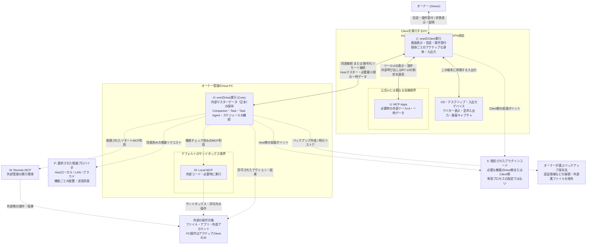

# Runtime Topology（実行配置と通信構造）

対象: [要件Baseline](../../requirements/README.md)、[Architecture Drivers](architecture-drivers.md)、[System Context](system-context.md)。本書では、コンポーネントの実行場所、各主体のライフサイクル、接続形態、および信頼境界と障害境界を定めます。なお、図中の各ブロックは必ずしも1つのOSプロセスやサブシステムと1対1に対応するわけではありません。

## Overview（概要）

eneの実行構造の要は、**「オーナー管理のHostマシンで動き続ける実行環境・マスターデータ」と、「Client端末のデスクトップに紐づく対話・アバター表示・音声入出力」の分離**です。Hostマシン上でCompanionの継続的な活動、Task、Task Agent、スケジュールを管理し、Clientの起動・終了や端末の移動から独立して処理を続けられるようにします。アバター（Body）、リアルタイム音声/テキスト会話、周囲の観測（ambient Observation）、自発的な行動、PC操作（Computer Use）は、1つの個体につき常に「1つのアクティブなClient端末」にのみ結び付きます。Companionは通常、現在いるClientに留まり、別の端末から話しかけたり操作したりする場合は「呼び出し」や「移動」の手順を踏みます。一方、Host上で実行される通常の作業は、Client間の移動とは無関係に裏で継続します。

推論処理は機能（Capability）ごとにHostローカル、LAN内のマシン、クラウドへ柔軟に配置できます。ただし、推論先をどこに置いても、Hostが持つ実行管理の権限や個体の所有権が推論サーバーへ移るわけではありません。外部のMCPサーバーやプラグインは必要な実行環境に接続しますが、ene本体の管理権限とは明確に区別します。特に、ローカルMCPを標準のサンドボックス内で動かす場合と、オーナーの許可を得てサンドボックス外で動かす例外的な場合は、同じ外部拡張であってもセキュリティの強制境界が大きく異なります。また、MCP AppsはClient側の「外部ツール用UI」として位置づけ、ene本体の重要操作権限や提供元サーバーの寿命と混同しないようにします。

HostとClientが同じ1台のPCで動く「ローカル構成」でも、LANやオーナー管理VPN経由で別端末から繋ぐ「リモート構成」でも、基本的な責任分担はまったく同じです。本アーキテクチャでは、必要性の根拠がないリモート専用のCore、クラウドコーディネーター、Workspaceサーバー、Companionごとの専用ランタイムサービスなどは導入しません。

## Runtime Elements（実行要素）

### 実行場所と接続先

HとCはene公式の実行領域、P・M・Xは異なる信頼境界を持つ接続先や拡張コード、UはClient上に表示される外部ツール用UIの領域です。これは役割の分類であり、それぞれを個別のOSプロセスにする指定ではありません。また、任意の機能や拡張機能を常時起動しておく必要もありません。

これらを区別する理由は、**「HとCの配置と寿命の違い」「Pへの推論データ送信」「Mの外部への作用とサンドボックス」「Xに与える限定的な権限」「Uをene本体のUIから分離すること」**にあります。Mが提供するUIであっても、サーバー自体の実行環境とClient上の画面表示では寿命も権限も異なるため、同じ枠組にまとめずに区別します。一方で、用途別やCompanionごとに無駄な専用実行環境を増やすことはしません。

| 要素 | 役割と配置場所 | ライフサイクルと主な関係 | マスターデータ（正本）の所在 | 信頼境界と障害時の性質 |
|---|---|---|---|---|
| **H: Host上のene実行 (Core)** | Windows / Linuxのオーナー管理PC上でCoreを実行します。Companionの個体性、会話や作業の継続、権限・同意・制限のチェック、内部データの保存を担います。通常のTaskやTask Agentの作業はHost上で動かし、PC操作（Computer Use）などのClient依存部分を除いて、Companionの端末移動から独立して動かします。 | Clientよりも長く稼働し続けます。Taskや委任処理の完了待ち、外部イベント待ち、スケジュールの到来待ちなどを、LLMへの無駄なポーリング（繰り返し問い合わせ）で行うことはしません。Cからの操作を受け付け、P・M・Xや外部リソースを必要に応じて呼び出します。 | **ene内部の永続マスターデータをすべて保持します。** 一般アプリデータと認証情報（Credential）は保護領域を分離します。個々のデータの詳細な保存構造は後続の設計で扱います。 | Client、推論プロバイダ、外部拡張へ最終的な権限管理を丸投げしません。Hostが停止した場合は、eneの継続実行やデータの更新ができなくなります（Clientを勝手な代替マスターにしたり、別Hostへ自動フェイルオーバーしたりはしません）。 |
| **C: Client上のene実行** | Hostと同じPC、またはリモートのオーナー利用端末で動作します。公式の画面表示・会話・操作と、そのデスクトップ上でのアバター表示（Body）、音声・画面の入出力を担います（Windows / Linux対応）。 | Hostへ接続して必要なデータを取得します。起動・終了・切断・再接続はHostの稼働とは完全に独立しています。1つのClientに複数のCompanionが同時に存在できます。アクティブな滞在先はCompanionごとに個別に管理します。 | **Hostのドメインデータのマスター（正本）は持ちません。** Hostから受け取る表示・一時操作用のデータは必要最小限とし、長期的なプライベート状態や登録済み認証情報を端末内に永続キャッシュしません。端末固有の接続情報は保持できますが、接続目的の限定、秘密情報の非露出、端末失効ルールに従います（SO第8節）。 | リモート接続時はペアリング手順と端末ごとの個別許可・失効の対象となります。同じオーナーの端末であっても無条件には信頼しません。アバター表示や音声機能の障害が、テキスト操作や管理画面に波及しない設計とします。Clientが終了しても、Host上で許可された処理は中断されずに続行します。 |
| **P: 推論プロバイダの実行** | 各機能（Capability）に応じた推論エンジンの利用先です。Hostローカル、LAN内のマシン、クラウドのいずれかに配置されます。配置場所ごとに別々のeneランタイムを作るのではなく、同じ利用先の配置の違いとして統一的に扱います。 | API呼び出しやセッションの寿命は、Companion、Task、Clientの寿命とは一致しません。接続先の登録と実際の利用割り当てを明確に分離し、接続先変更や障害時の承認済みフォールバックに対応します。起動管理をene側で行うか外部で行うかは配置方法に委ねます。 | プロバイダ側にモデルのキャッシュやセッションデータが存在することはありますが、**eneの個体・履歴・学習・Task状態のマスターデータではありません。** | ローカル推論であっても、モデルの出力内容にシステムの制御権限はありません。プロバイダの停止・能力不足・料金制限は関連する処理に影響しますが、ローカルで動く基本機能、履歴、設定、保存済みデータまで失われることはありません。 |
| **M: 外部MCPの実行** | ツール（Tool）、リソース（Resource）、プロンプト（Prompt）を提供する外部の実行主体です。Host上の作業を支えるローカルMCPはHost側に配置し、デフォルトでサンドボックス内で動かします。リモートMCPは外部システムとしてネットワーク経由で接続します。 | 必要な接続・利用の期間だけ動作します。外部サーバーの寿命はHostやUと独立しています。eneが起動するローカルMCPの起動・終了方式やプロセス共有の仕組みは後続の設計で定めます。 | 外部サーバーが独自の状態を持ったり外部へ影響を与えたりすることはありますが、**ene内部データのマスターは保持しません。** | 実行結果、プロンプト、MCP Appsのコンテンツはすべて信頼できない入力として扱います。「ローカルのデフォルトサンドボックス」「明示的なサンドボックス外の例外」「リモート接続」のセキュリティ境界を厳格に区別します。拒否・停止・利用不能時でも、ene本体の管理画面や保存済みデータは問題なく利用できるようにします。 |
| **X: 限定された拡張点で動くプラグインコード** | 対応する機能が必要とされるHost側またはClient側に配置します（未対応プロバイダ用のアダプタ、観測アダプタ、アバター描画拡張など）。 | 拡張機能の有効化・利用・停止は、個体やHostの存続とは独立しています。接続先の機能を補助する役割を持ちます。プラグインごとの専用ホストプロセスなどを必須の前提とはしません。 | **eneのマスターデータや制御権限を所有することはありません。** 一時データを扱う場合でも、ene内部のプライバシー保護や完全削除ルールを迂回させることはできません。 | プラグインのコードは厳密に制限された拡張ポイントからのみ参加でき、Coreの勝手な書き換え、権限チェックの回避、恒久的なUIの乗っ取りなどは一切許可されません。プラグインが動かなくなっても、管理機能や保存済みデータは保護されます。 |
| **U: Client側の外部ツールUI (MCP Apps)** | Mが提供する対話型UIを、Cの公式UIとは権限を分離した独立領域に表示・操作します。Client側の入り口として区別し、具体的なUIレンダリングエンジンや計算配置は問いません。 | ツール用UIが必要な間だけ存在し、Clientが終了すればその画面も消えます。画面が閉じたからといって、裏で動くMやHost上のTaskが完了したわけではありません。Mとの通信はeneが仲介・制限します。 | **マスターデータや制御権限は持ちません。** 表示や操作のための一時データは、Cと同様に最小化・非永続キャッシュ・完全削除の対象です。外部サーバー側が持つ固有の状態とは区別します。 | UI上の操作をene本体の承認や設定変更へ勝手に昇格させず、アクション権限チェックを迂回させません。拒否、停止、表示エラーが起きても、ene公式の管理・復旧・データ確認画面には影響を与えません。 |

HostとClientの区別は、**「異なるライフサイクルを成立させるための実行上の役割分担」**です。同じPC内で一緒に動いている場合でもこの役割分担は変わりませんし、逆にこの区別があるからといって無駄にプロセス数を増やす必要もありません。P・M・Xが同じPC内にある場合でも、単に同じPCにあるというだけで信頼を与えたりene内部に取り込んだりすることはありません。

### Hostで継続を管理する主体

以下の主体は、Host内部における「寿命」と「権限」を明確に区別するために定義するものです。新しいサーバーマシンや複雑なサブシステムを追加するわけではありません。推論エンジンはP、身体や入出力はCにあり、必ずしもこれらと同じ場所・寿命である必要はありません。

| 主体 | 存続期間と他との関係 | 状態・権限・障害時の境界 |
|---|---|---|
| **Companion（パートナー個体）** | Characterパッケージから実体化された、継続して存在する個体です。マシンの再起動、Client端末の切り替え、推論プロバイダの変更を越えて「同一の個体」として存続し、停止・再開・削除を管理します。オーナーとの会話、判断、Taskの開始や委任・調整、指示出し（steering）、結果の受け取りと統合の中心であり、他のCompanionと交流する主体でもあります。まとまった作業は基本的にTaskとして扱い、原則としてTask Agentへ委任します。 | 継続的な状態のマスターデータはHostに置かれます。各個体が持つ記憶（Memory）、関係性（Relationship）、Companion状態などのプライベートな利用範囲は厳格に守られます。同じClientに一緒にいたり、同じグループ会話に参加したりしているからといって、プライベートな記憶を勝手に共有することはありません。停止（Stop）時はデータを保持したまま新しい活動を止め、実行中のTaskを可能な限り安全にキャンセル（best-effort）します。削除（Delete）時は、その個体固有の内部Skillを過去のリビジョンを含めて完全に削除し、全体設定（Global）へ勝手に昇格させることはしません。 |
| **Task Agent（作業代行エージェント）** | CompanionからTaskまたはその一部の実行を委任された、一時的な作業代行主体です。Task（作業内容）そのものとは区別します。必要に応じて複数起動して並列作業を行い、依頼元のCompanionへ結果を返します。Client端末の移動に合わせて別個体として作り直すようなものではありません。 | 独立した長期的な人格や人間関係（Relationship）は持たず、作業の全記録はHostに残します。担当Companionの推論プロバイダ設定を継承し、Capability、Permission、費用上限、TaskやWorkspaceの境界を勝手に超えることはできません。委任されたPC操作（Computer Use）にも、依頼元Companionが現在いるClient端末の場所の制約がそのまま適用されます。作業途中で失敗した場合は「未完了の作業」や「発生済みの外部への影響」として正直に記録し、Companion自体が消えたり通常の日常会話全体が止まったりすることはありません。 |

Companionの重要な継続状態を、一時的なプロバイダのセッションや、アバター表示・音声出力の状態だけに依存させることはしません。再起動、再接続、モデル変更、リストアを越えてデータを保ちつつ、時間経過で自然に変化すべき一時的な気分や感情（Companion State）を、経過時間に関係なく保存時の値のままガチガチに固定してしまうことも避けます（適切な減衰や更新の仕組みは後続の設計で定めます）。

Taskは追跡・制御される作業の単位であり、Task化とTask Agentへの委任ルールはRT-03で定めます。スケジュール機能はHostが定期的にTaskを開始するための設定であり、独立した専用サーバープロセスにはしません。Workspace、Memory、Experience Summary、Relationship、Companion State、Rule、Credentialなども配置マシンを分けるものではなく、それぞれの意味や保持ルールは後続のState Ownershipで定めます。Agent SkillsやCharacter Packageもデータの交換・入力形式であり、それ自体を常駐プロセスにはしません。付属のスクリプトなどを動かす場合も、ファイル形式を理由に無条件に信用することはせず、適切な実行権限チェックを適用します。

### 実行が依存する外部リソース

| リソース | 配置場所とマスターデータの所在 | ライフサイクル・信頼・障害時の関係 |
|---|---|---|
| **Clientのデスクトップ・入出力デバイス** | Cが動くPCのOSが提供する画面、ディスプレイ、マイク、スピーカーなどです。eneのマスターデータではありません。 | アバターの表示先、音声の入出力元、周囲の観測（ambient Observation）の取得対象、PC操作（Computer Use）の対象は、Companionが現在滞在しているアクティブなClient側にあります。Computer Useでペアリング済みの他の端末を勝手に選んで操作することはできず、別端末を操作したいときはまずそこへ移動します。推論処理や観測イベントの検知計算までClient端末に固定する必要はありません。デバイスの故障、全画面アプリの起動、通信切断が起きても、Host全体の停止と混同しないようにします。 |
| **作業先のファイルシステム・アプリ・アカウント** | オーナーが指定・許可した外部の操作対象です。Hostマシン内にあるファイルであっても、ene内部のデータとはみなしません。 | 外部へ与えた変更や影響は、Taskやeneが終了した後も残り続けます。同じフォルダやアカウントを使う別のTask同士であっても、一度与えられた承認を勝手に使い回すことはしません。シンボリックリンクなどを含めてファイルシステムのアクセス境界を守ります。読み取り失敗、書き込み途中の停止、結果が不明な状態を「保存成功」と偽って表示しません。成功したか不明なときに自動で再実行したり、端末移動を理由に別端末で勝手に再実行したりしません。 |
| **Hostの内部保存を支えるOS領域** | オーナーのOSアカウントだけがアクセスできる安全な領域です。ここにHがマスターデータを保持し、認証情報は一般アプリデータと分離して保護します。 | データの保存、マイグレーション、バージョンアップに失敗した場合でも、直前の正常な状態を壊さない設計とします。ただし、ストレージデバイスの物理的な故障やOS全体の完全崩壊まで無停止で耐え切る構成を意味するものではありません。 |
| **オーナーが選ぶバックアップ保存先** | 稼働中のマスターデータとは切り離されたバックアップコピーです。保存媒体がHostと同じPCか外部ドライブ・クラウドかは、オーナーの選択に従います。 | 作成結果や失敗は分かりやすくオーナーに伝えます。リストア時は、現在のHostの認証情報ストアを維持したまま、対象の内部データをバックアップ内容で丸ごと置き換えます。認証情報（Credential）などの秘密情報や外部Workspaceの実ファイルはバックアップに含めません。外部に保存されたバックアップの存在を、通常の削除、全データ初期化、指定データの完全削除（targeted deletion）の消去保証範囲に含めることはしません。 |

## Runtime Relationships（主要な実行関係）

RT番号は設計の追跡用識別子です。「固定」は今回の設計で決定したルールや制約を表し、「残す自由度」は今後の詳細設計で選択できる実装方式を表します。

| 判断・関係 | 固定する制御フローとデータ移動（ルール） | 詳細設計へ残す自由度（実装方式） |
|---|---|---|
| **RT-01: HostとClient** | Clientからは会話の入力、作業依頼・追加指示、アクションの承認/拒否、停止やシステム管理操作を送信し、Hostからは状態、進捗、結果、説明を必要最小限の範囲で返します。テキスト会話の入力や応答も、Companionが現在滞在しているアクティブなClientに帰属し、別端末から会話する場合は呼び出しや移動の手順を踏みます。内部データの確定は常にHost側で行います。Host–Client間の通信は暗号化等で保護し、リモート接続する新しいClient端末はHost側での承認（ペアリング）を必須とし、端末ごとの個別許可に従います。 | 同居時のプロセス間通信方式、リモート通信プロトコル、同期の細かさ、切断検知の仕組み、ペアリングのUI手順、管理画面のレイアウトなど。発話のやり取り（round）の具体的な調停方式は詳細設計に委ねます。 |
| **RT-02: CompanionとアクティブなClient** | アバター表示（Body）、リアルタイム音声/テキスト会話、周囲の観測（ambient Observation）、自発的な行動、PC操作（Computer Use）は、1つの個体につき「同時に1つの場所（アクティブなClient）」に結び付けます。Companionは通常その場に留まり、別端末からの操作は呼び出しや移動を経て行われます。事前の指示や作業の都合による自発的な移動を妨げるものではなく、接続中端末への自発的な移動も通常の移動と同じルールで行えます（強制や自動化はしません）。Hostが再起動した際は、直前まで起動中だった個体を再起動前の端末へ自動で復帰させようと試み、その端末が繋がるまでは「アクティブ端末なし」として待機します（別端末へ勝手に移動したり、停止中だった個体を勝手に起動したり、作業中だったTaskを無断で再開したりはしません）。Clientがない間もHost上のマスターデータとして存続し、Clientを必要とする対話や操作だけを行いません。移動する際は会話のやり取りを安全に区切り、両方の端末に状態を表示します。PC操作などの実行中は安全に区切れるまで移動を待機させ、端末移動を理由に別端末で勝手に再実行しません。Hostのマスターデータ、通常のTask、Task Agent、スケジュールをClient側へ丸ごと転送することはありません。通常のClient切断時は基本的にHost PC上のローカルClientへ戻り、利用可能なClientがない場合は「アクティブなし」のまま存続します。 | 滞在先の切り替え・復帰の調停方法、切断検知のアルゴリズム、安全な区切りの判定方法、保留メッセージの保持形式など。Clientから独立した専用の常駐サービスを設けることはしません。Host側Clientの自動起動は行いません。 |
| **RT-03: Host内の作業と委任** | まとまった実作業は基本的に「Task」として扱い、原則として境界内で一時的な「Task Agent」へ委任して実行します。Task（作業内容）とTask Agent（代行者）は明確に区別します。オーナーから頼まれた作業だけでなく、自発的に始める作業も含みます。ただし、日常のちょっとした雑談や軽微な内部情報確認まで何でもかんでもTask化・Task Agent化する必要はありません。作業結果、判断待ち、外部への影響はHostで一括管理し、通常の日常会話や安全管理操作が作業の完了待ちでブロックされないようにします。定期スケジュールの各回実行は新しいTaskとして生成し、実行時点での条件をその都度再評価します。 | エージェントハーネス、実行管理単位、並列実行の仕組み、進捗の保存頻度、待機・再開の制御方式、Task化するかの判定基準など。単に待つためだけにLLMへ無駄なポーリングを繰り返すことは禁止します。 |
| **RT-04: Clientの観測・音声と推論** | 周囲の観測（ambient Observation）の取得対象は、起動中（Running）のCompanionが存在しているClientのデスクトップ全体です（停止中の個体は対象外）。ObserverはClientに紐づく共有機能であり、画面キャプチャやイベント候補の検知を各Companionで共有して行います。複数のClientを同時にキャプチャすることは避け、負荷を抑えるためタイミングをずらして実行します。Observer専用のプロバイダ設定で候補検知や関連付けを行い、関係するCompanionへイベントを届けます。ルーティングの際には、本来の持ち主を通じて必要最小限に要約・制限した文脈だけを利用でき、元のプライベートな記憶全体を他Companionへ漏らすことはありません。また、要約後であっても元の利用制約とObserver専用の送信同意が適用されます。イベントが各Companionへ届いた後の思考や発話の判断は、各個体のプロバイダ設定に従います。重複した無駄な検知や、全Companionへの無差別なイベント配信、共有処理を理由にした勝手な同意拡張は行いません。軽量なローカルモデルや安価で信頼できるクラウドモデルの利用を推奨します。音声の入出力はアクティブなClientに帰属し、音声区間検出（VAD）による待受や、観測状態の確認・即座のミュート機能を提供します。Observerの停止（Client別・全体）と個体の自発性の制御は別々の設定として扱います。 | キャプチャや伝達の仕組み、ルーティング用文脈の生成方法、使用モデル、更新頻度、計算の配置場所、音声認識・合成の処理パイプラインなど。Observerは独立したCompanionやTask Agent、専用プロセスを意味するものではありません。なお、明示的なTaskとしてのPC操作（Computer Use）はアクティブなClientに限定され、周囲の観測とは異なる独立した権限チェックと操作記録を持ちます。 |
| **RT-05: eneと推論プロバイダ** | Companion側の推論では、機能ごとに「Host全体のデフォルト設定」「Companion個別のオーバーライド」「Task Agentへの継承」を扱います。一方、Clientに紐づくObserverは特別な共有機構として専用のプロバイダ設定を使い、Companionごとの設定を合成・流用することはありません。どちらの推論でも、オーナーが同意した設定の範囲内でのみデータを送信し、プライバシーや費用の制限を守ります。推論結果はあくまでモデルの出力であり、それ自体が実行権限になるわけではありません。プロバイダを変更した場合でも同じ情報選択ルールを維持し、プロバイダごとの費用上限や承認済みのフォールバック順序を厳格に適用します。 | Observerモデルを全Clientで共通にするか、Client別のUI設定にするか、デフォルトからの継承ルールなどは詳細設計で選べます。通信の中継方法、セッション管理、プロバイダアダプタの実装方式も自由です。ただし、どの経路を通る場合でも現在の同意、権限、費用上限、秘密情報の非露出、Client一時データ制限が確実に適用できることが必須条件です。 |
| **RT-06: eneと外部実行・操作対象** | オーナーに許可されたアクションだけを必要な外部リソースに対して実行します。Host上で動き続けるTaskがClient側の外部ツール起動に依存して止まってしまわないよう、作業用のローカルMCPはHost側に配置します。PC操作（Computer Use）はCompanionが現在滞在しているアクティブなClientだけを対象とし、勝手に別端末を選んだり存在場所から切り離したりすることはしません。MCPのリソース、プロンプト、実行結果は制限をかけた安全な状態で受け入れます。メジャーなプロバイダの通信プロトコルには直接対応し、通常の差異を吸収するためだけにプラグインを必須とはしません。 | 内部ツールAPIの設計、MCP接続・プロセス起動管理、プラグインの具体的な拡張APIと配置方法、Client側への操作伝達の実装方式など。すべてのツールをMCP化したり、すべてのアクションを専用ワーカープロセスで動かしたりすることを強制するものではありません。 |
| **RT-07: 認証データの安全な取り扱い** | APIキーやパスワードなどの認証情報（Credential）は専用の設定・認証フローで登録し、指定された通信の実行に必要な範囲でのみ使用します。認証先サービスへ送信する安全な経路と、LLMのコンテキスト、生成されたツールの引数、一般的な実行結果、画面表示、学習データ、ログ・診断情報へ渡す経路は明確に区別し、秘密情報を絶対に混入させません。 | 認証情報の暗号化保護方式や内部での受け渡し実装。外部の秘密管理サービスやClient端末上に、登録済み認証情報のマスターを無駄に置くことはしません。Client固有の接続情報もSO第8節に従って保護します。認証が成功したからといって、個別アクションの実行が承認されたとみなすことはありません。 |
| **RT-08: データの保存・一時データ・完全削除** | Hostのマスターデータから、画面表示に必要な最小限のデータだけをClientへ一時的に渡します。指定データの完全削除（targeted deletion）では、接続中のClientにある一時データや実行中の処理を含め、削除処理中に遅れて届いたり新しく作られたりした対象情報も漏れなく消去し、削除前の情報から勝手に再保存・再学習されるのを防ぎます。消去が正しく完了したことを確認するまで、オーナーに完了とは報告しません。なお、すでに外部へ送信されたデータや外部プロバイダが保持するコピーは別境界となります。 | 保存方式の選定、完全削除時の探索・協調・残存検証のアルゴリズム、Client一時データの無効化方法など。Client端末を永続的なレプリカ（複製先）にはしません。また、通常の履歴保持期限の整理を、完全削除（targeted deletion）の代わりにはしません。 |
| **RT-09: バックアップ・リストアと外部ファイル** | Hostの内部状態をポータブルなフルバックアップとしてエクスポートし、指定されたバックアップから明示的にリストアできるようにします。TaskとWorkspaceフォルダの紐付け情報と、外部の実ファイルそのものは明確に切り離します。認証情報（Credential）などの秘密情報はバックアップに含めず、リストア時もリストア前のHost認証情報ストアを維持します。バックアップ内の参照情報と現在の認証情報を照合し、使えるものは使い、不足や無効があればオーナーに再認証を求めます。復元されたTask、スケジュール、外部連携の自動処理はオーナーの確認があるまで一時保留とし、過去の割り当てや同意が復元されたからといって、現在の認証や制限を無視して勝手に自動処理を再開することはありません。 | バックアップのファイル形式、ストレージ実装、整合性の保証方法、リストア手順の詳細など。外部ファイルをene内部の成果物ライブラリへ無駄に丸ごとコピーすることはしません。 |
| **RT-10: Clientと外部ツールUI (MCP Apps)** | MCPが提供するUIリソースをU領域に表示し、ユーザーの操作や結果を扱います。ene本体の承認や管理機能の画面とは明確に分離し、Uからのツール呼び出しや外部通信にもRT-05・06・07の制約を厳格に適用します。外部ツール画面を閉じることと、裏で動いているTaskのキャンセルを同一視しません。 | UIの描画エンジン、サンドボックス隔離方式、Mとのデータ送受信経路、画面状態の再取得方法など。専用のUIサービスや独自の代替プロトコルを無駄に追加することはしません。 |

Hostを制御とマスターデータの集約点にするからといって、画面キャプチャの生画像、生音声、すべての通信ログをHost経由で無制限に永続保存するわけではありません。Clientの一時データ、eneが管理する一時的な処理、外部へ送信されたコピーを明確に区別し、論理的なセキュリティチェックの適用と、物理的な通信ケーブルの経路を混同しないようにします。

なお、Client不在時の活動継続や移動、RT-02のアクティブ滞在ルールは「起動中（Running）」の個体にのみ適用され、「停止中（Stopped）」の個体には適用されません。停止した個体はアクティブなClientを解除し、どの端末にもHostにも滞在しておらず、アバター表示、音声/テキストでの対話、PC操作を行わず、共有Observerの観測対象人数やルーティング先からも外れます。Hostにデータが保存されていることや前回の滞在先ヒントが残っていることは、現在の滞在ではありません。再開（Resume）時は前回滞在していたClient端末などから再配置できますが、過去のヒントを現在の滞在先と誤認することはしません。Client切断時のHost PC側Clientへの自動退避も、起動中の個体だけに限定されます。

RT-08・09の保存・消去・バックアップでは、1対1、グループ、Companion同士の会話履歴や、保存された活動記録・判断根拠も適切に扱います。Companionを削除したからといって過去の会話記録まで一括で消すことはせず、その個体固有の記憶、学習、要約、関係性、状態は定められたライフサイクルに従って安全に消去します。記録の通常の保持期間管理や完全削除（targeted deletion）は別途適切に適用されます。

## Lifecycle and Failure Boundaries（ライフサイクルと障害境界）

ここでは、システムで異常や状態変化が起きた際の影響範囲と、処理の継続・再開の条件を定めます。停止要求の受け付け、実際の処理停止の完了、および外部への影響の確定はそれぞれ別の段階として扱います。

| 境界・イベント | システムが維持する振る舞いと他要素への影響 |
|---|---|
| **起動・Client不在** | HostはClient端末がいなくても独立して動作を続けられ、スケジュールによる自動起動や、実行継続が許可されたTask、スケジュール管理、データの保存をそのまま続行します。判断基準は「Client端末が必要かどうか」であり、画面や音声などClientが必要なこと以外の処理はすべて可能とし、Clientに依存することだけを不可能とします。アクティブなClient端末がない間は、アバター表示、リアルタイム会話、音声入出力、PC操作（Computer Use）は行わず、端末がない間の画面観測も発生させません。Companion同士の会話、通知の生成、Clientを必要としない内部調査などは裏で継続でき、Clientがいればその場で伝えられたはずの重要事項はメモに残しておき、次回Clientに接続した際にまとめて報告します。自動起動が有効な環境では、Client終了後も裏で処理が続くことをオーナーに説明し、オーナー自身が設定を選択できるようにします。Clientがない状態でオーナーの判断が必要なアクションが発生した場合は、勝手に進めずに「判断待ち」とし、自動承認したり別ルートで無理に実行したりはしません。 |
| **Client終了・リモート切断** | 接続していたClient端末が終了したり通信が切断されたりしても、対話の窓口が一時的になくなるだけで、Host上で許可された処理や記録はそのまま維持されます。切断されたClient端末を勝手なマスターデータにしたり、独立したオフライン実行主体に仕立て上げたりはしません。Companionの退避先や存続ルールはRT-02に従います。排他性が確認できなくなったClient端末では、アバター表示、観測、自発的な行動、PC操作を直ちに停止し、画面に切断状態を表示します。Client端末に依存するアクションは可能な限り安全に停止（best-effort）し、成功したか不明なときに自動で再実行したり、端末移動を理由に別端末で勝手に再実行したりしません。 |
| **再接続・アクティブClient移動** | Hostで進行中の進捗や結果へ再びアクセスできるようにし、同じ個体が2つの端末へ同時に現れるような二重復帰は絶対に防ぎます。呼び出しや移動、自発的な移動のルール、会話の区切り方、PC操作中の安全な待機などはRT-02に従います。通常のTask、Task Agent、スケジュールはHost上で動き続け、作業中だからといって端末の移動が禁止されるわけではありません。また、移動先のClient端末へHost上の通常の作業を丸ごと移送することもありません。Client不在時に溜まっていた未伝達事項の報告は「起動・Client不在」と同様に行います。移動後の画面観測は移動先ClientのObserver設定に従い、自発性の頻度設定などはCompanion単位でそのまま引き継がれます。 |
| **ペアリング失効・許可変更** | 登録を失効させられた端末の許可機能は即座に使えなくし、失効した許可を根拠にした新しいアクションは開始させません。進行中だった操作は可能な限り安全に停止してオーナーへ報告します。別の端末、別ツール、Task Agent、別Clientへの切り替えによって制限をすり抜けることは許されません。なお、特定端末のペアリングが失効したからといって、無関係なHost上のTaskまで全キャンセルすることはありません。 |
| **Host停止・異常終了・再起動** | Client端末がHostの代わりのマスターデータになることはなく、Hostでの保存や操作が成功したか未確認のまま「成功」と表示することはありません。起動中だったCompanionの滞在先はRT-02に従って再起動前のClient端末へ自動復元を試みます。作業途中だったTaskは、保存済みの進捗状況と判明している外部への影響を画面に示し、オーナーによる明示的な再開指示を待ちます。Host停止中に到来したスケジュール実行は「スキップ（missed）」扱いとし、後から勝手に二重実行・補完実行することはありません。また、外部プロセスや外部サービスの動作がHostの停止と同時に止まったと勝手に思い込むこともしません。 |
| **Companion停止・削除** | 「停止中（Stop）」はアバターを表示せず、会話への応答、自発的な行動、新しいTaskの開始、スケジュールの実行を行いません。実行中だったTaskは可能な限り安全にキャンセルし、停止中に到来したスケジュール実行はスキップ扱いとします。停止しても個体のデータは保持されます。「削除（Delete）」は停止処理を含んだ上で、担当していたスケジュールや人間関係（Relationship）を削除し、その個体固有の内部Skillを過去のリビジョンを含めて完全に削除します。削除をきっかけにGlobal設定へ勝手に昇格させることはしません。担当スケジュールを別のCompanionへ勝手に引き継ぐこともしません。残されたTask記録や共同作業の履歴は管理画面から確認でき、別のCompanionへの引き継ぎを依頼できます。全体共通の学習データ（Global Learning）や外部ファイルは削除されずに残ります。 |
| **Task Agent失敗・Taskキャンセル** | Taskが未完了であること、停止できなかった処理、判明している外部への影響、未保存の作業内容を正直にオーナーへ伝えます。作業の失敗やキャンセルによってCompanion自身が消えてしまうことはなく、通常の会話や管理画面はそのまま利用可能です。Task終了に伴う一時的な中間ファイルのクリーンアップと、完成した永続成果物を勝手に消さないことは明確に区別します。 |
| **プロバイダ・ネットワーク障害** | 障害が発生した推論エンジンやネットワーク接続に依存する処理だけをエラーとし、ローカルで動く基本機能、会話履歴、設定画面、保存済みデータは問題なく使い続けられるようにします。全環境での完全オフライン推論を保証するものではありません。失敗したアクションを勝手にキューに溜めて復帰後に自動再実行（replay）することはしません。外部への操作が成功したか不明な場合は自動再実行せず、二重実行のリスクを説明してオーナーの判断を仰ぎます。別モデルへのフォールバックはRT-05で承認された範囲内でのみ行います。 |
| **アバター・音声・デバイス障害** | 3Dアバターの描画に失敗しても、テキスト会話、Task管理、設定、復旧操作は問題なく利用できるようにします。音声機能でトラブルが起きた場合は、通常のターン制音声やテキスト入力へ段階的に切り替え、失敗した理由を表示します。キーボードによるミュート、緊急停止、キャンセル、承認拒否などの操作は、アバターの描画、音声再生、LLMの応答待ちでブロックされずにいつでも受け付けます。Hostへ届いていない停止要求を「外部処理の停止に成功した」と誤認させるような表示はしません。 |
| **全画面アプリ・高負荷・費用/リソース上限** | 全画面アプリが起動した際は、そのClient端末でのアバター表示、周囲の画面観測、自発的な発話を一時休止します。PCが高負荷になった場合は、会話の応答、オーナーの操作、安全管理の処理を最優先で維持し、アバターの描画フレームレートや重要度の低い背景処理を段階的に引き下げます。設定された費用上限やリソース制限に達した場合、あるいは費用が不明で安全に続行できない場合は、データを安全に保った上で対象の処理を停止または判断待ちとします。記録を勝手に破棄したり、通常の学習データを消去したりして無理やり解決することはしません。学習リビジョンや要約などの容量クリーンアップはデフォルトOFFとし、オーナーが明示的に保存期間を設定した場合にのみ動作します。 |
| **拡張機能の拒否・停止・利用不能** | 必要な拡張機能が動かなかった場合はその理由を分かりやすく説明し、システムの管理画面や保存済みデータはそのまま使い続けられるようにします。ローカルMCPのサンドボックスを勝手に解除することはありません。サンドボックス外のMCPやリモートMCPを正常に停止できたか不明な場合は、その事実と外部へ与えた可能性のある影響を正直に伝えます。 |
| **MCP Appsの終了・UI障害** | ツール用の画面（UI）が閉じたからといって、裏で動いているMCPサーバーが停止した、アクションがキャンセルされた、外部への影響が取り消されたと勘違いしません。Host上のTaskはツールの画面が成功したことを無条件の前提にはせず、追加の入力やオーナー確認が必要な場合は処理を判断待ちとします。ene公式の管理画面から現在の状態確認、停止、復旧操作が行えるようにし、画面を再表示しただけでアクションを勝手に再実行することはありません。 |
| **観測機能の停止・自発性の抑制** | 今後の観測を止めることと、これまでに蓄積された学習データやCompanionの状態を削除することは明確に区別します。Observerの一時停止/完全停止（端末ごと・全体）と、Companionごとの自発性の停止・頻度制限は混同せず、別々の設定として管理します。おやすみ時間（Quiet hours）、マイクミュート、オーナーが無反応な状態、権限チェック、費用やリソースの制限、無限ループ防止などを、自発的な行動よりも常に最優先します。 |
| **指定データの完全削除 (Targeted Deletion)** | 削除対象のデータを使っているHost内部の処理、拡張機能経由の処理、接続中のClient端末を含め、ene内部からの完全消去と再保存の防止を徹底します。削除前に開始されて遅れて届いた処理結果だけでなく、削除処理が始まってから完了するまでの間に再び届いたり生成されたりした対象情報も漏れなく消去します。削除完了後にオーナーが改めて同じ情報を提供した場合は、全く新しい体験として扱います。消去と残存チェックが完了する前にオーナーへ「完了」と嘘の報告はしません。すでに外部へ送信されたデータやバックアップまで消去できたとは説明しません。 |
| **保存・移行・更新・リストアの失敗** | 直前の正常な状態（またはリストア前の正常な状態）を安全に保護し、失敗の理由と次に取るべき安全な操作を説明します。バージョンアップ処理が成功するまでは、古いバージョンの状態を利用・復旧できるようにします。処理が失敗しているのに「成功した」と誤認させる表示はしません。 |
| **リストア成功・設定初期化 (Reset)** | リストアを実行すると、現在のHostの認証情報ストアを維持したまま、対象の内部データがバックアップ内容で丸ごと置き換わります（過去に削除したデータや古いルール・同意・スケジュールが復活する可能性があります）。そのため、復元された自動処理は一旦すべて保留とし、オーナーが内容を確認した後にまとめて有効化できるようにします。バックアップ内の参照情報と現在の認証情報を照合し、使えるものは使い、不足や無効があれば再認証を求めます。過去の設定が復元されたからといって、現在の安全制限を無視して勝手に自動処理を動かすことはしません。「設定のリセット」と「全データのリセット」は明確に区別し、全データリセットであっても、外部の作業ファイルやオーナーが別の場所に退避させたバックアップまで勝手に削除することはありません。 |

これらは部分的な機能障害が起きても基本機能を守るための分離ルールであり、OSやハードウェア全体の物理的クラッシュからの完全な無停止稼働を保証するものではありません。Host、ローカルClient、ローカル推論が同じPCのリソースを共有する構成でもこれらのルールを満たす必要がありますが、具体的なプロセスの分け方、優先順位付け、リソース割り当ては後続の詳細設計で選択します。

## Trust Boundaries（信頼境界）

### 配置場所と信頼性は別物として扱う

| 境界 | 境界を越えるデータ / 制御フロー | 強制・保護の責任範囲 |
|---|---|---|
| **オーナーの真の判断と、外部から取り込んだコンテンツ** | テキスト/音声入力、画面観測、ファイル、推論結果、Characterデータ、Skill、内部学習などから、意味の解釈やアクションの実行判断へ。 | オーナー自身の正式な依頼と、外部コンテンツ内に書かれた指示（プロンプトインジェクション等）を厳格に区別します。ene内部に保存された情報であっても、信頼できない入力となり得ます。文章の意味解釈はLLMに委ねるとしても、保存禁止、非共有、スコープ制限、Permission、費用制限、データ削除などの安全ルールは、LLMのプロンプトだけに頼らずシステムのロジックで機械的に強制します。音声入力に対しても「話者認証済みで安全」という前提は置きません。 |
| **HostマシンとClient端末** | 操作指示、承認要求、画面表示用のプライベートデータ、音声・画面観測データ、アクティブ滞在先の切り替え。 | リモート接続時のペアリング、通信の暗号化保護、端末ごとの個別機能許可と失効ルールを厳格に維持します。「Hostにマスターデータを置くこと」「Clientが受け取った一時データを安全に保護すること」「端末固有の接続情報の用途制限と秘密保護」を同時に満たします（SO第8節）。Client側が勝手に権限を広げたり、プライベートなデータの永続レプリカ（複製）を抱え込んだりすることは許されません。 |
| **Companion / Taskごとの利用範囲** | 全体共通の学習（Global Learning）、個体固有の記憶・状態、共有された体験、委任された作業指示と結果。 | 同じオーナーが使い、同じHostや同じClientで動いている場合でも、個体固有のプライベートな記憶や、Taskごとに与えられた承認を勝手に混ぜ合わせません。Task Agentは依頼元Companionの安全境界の範囲内でのみ動作します。これは論理的なアクセス権限の境界であり、個体ごとにOSプロセスや物理ドライブを完全に分けることを求めるものではありません。 |
| **eneと推論プロバイダ・外部システム** | オーナーが同意した推論データ、許可されたアクション、実行結果、トークン利用量、外部イベント。認証時に必要な認証情報（Credential）の利用。 | HostローカルやLAN内の推論であっても同意確認を省略せず、未承認のクラウドへデータを転送することはしません。APIキーなどの認証情報をLLMのプロンプトや一般的な実行結果へ絶対に露出させません。プロバイダ側のキャッシュや外部プロセスの内部動作を、eneのマスターデータや完全な制御対象とみなすことはしません。 |
| **ene公式コードと外部拡張コード・UI** | MCPの呼び出し・結果・リソース・プロンプト、ClientとUの間の画面表示・操作、制限されたプラグイン機能の入出力。 | 外部のコードやUIから、ene本体のコントロールプレーン、Permission、同意設定、費用上限、認証情報を直接書き換えさせません。外部ツール用UI（MCP Appsなど）をene公式の管理権限やMCPの実行権限と同一視せず、UI上の操作が権限チェックの抜け道にならないようにします。登録された認証情報を、必要な通信以外のUI画面やログへ出力しません。eneが管理する拡張機能やUIの一時データを、「外部コード由来だから」という理由で完全削除の対象外にすることはしません。 |
| **ene内部データと外部ファイル・バックアップ** | Workspace内のファイルの読み書き、パッケージのインポート/エクスポート、バックアップ/リストア、診断ログの手動共有。 | 外部のファイルへのアクセスと、ene内部に取り込んだデータの保持・削除は明確に区別します。Characterの配布パッケージ、内部学習データ、バックアップデータ、認証情報は、それぞれ含まれるデータの範囲が異なります。外部に保存されたバックアップの消去や、外部へ及ぼした影響の完全なロールバック（巻き戻し）を、ene内部の操作成功の保証に含めることはしません。 |

### Local MCPの実行境界

ローカルMCPをサンドボックス内で動かすか、サンドボックス外で動かすかは、**「同じMに対する配置・セキュリティ許可の選択肢」**であり、2つの別々の常設コンポーネントがあるわけではありません。

| Mの実行形態 | システムが固定する安全境界 |
|---|---|
| **Local・デフォルトのサンドボックス内** | 外部コードを制限された安全な実行環境（サンドボックス）内に隔離し、eneの機械的なCapability境界とアクション権限チェックを適用します。ツールがうまく動かないからといって、勝手にサンドボックス外へ切り替えることはしません。OSの具体的な隔離機構（コンテナやプロセス権限など）の実装は詳細設計に委ねます。 |
| **Local・明示的なサンドボックス外の例外** | 特定のMCPコマンド、設定の出所、アクセスされる可能性のあるリソース、失われる安全性の境界をオーナーへ丁寧に説明し、オーナーが明示的に許可した場合にのみ実行します。この許可はいつでも確認・失効できるようにし、重要な設定変更があった場合は再確認を求めます。eneが仲介するアクションには通常の権限チェックを適用しますが、外部プロセス自体の内部の挙動までeneが完全にコントロールできるとは説明しません。 |
| **Remote MCP** | 外部サーバーの実行環境は、相手側の管理下にあります。ene側が行うAPI呼び出し、データの受け渡し、認証情報の使用に対して厳格な安全境界を適用し、リモート先の内部までローカルのサンドボックスで保護されているかのように誤認させることはしません。実行結果や停止要求の送信だけをもって、外部への影響が一切なかったと保証することはしません。 |

プラグインに対しても制限された安全境界が必要ですが、要件ではローカルMCPとまったく同じサンドボックス機構や例外設定を求めているわけではありません。プラグインを「Coreを何でも自由に書き換えられる危険なコード」として野放しにすることも、未確定の専用ランタイムを先走って追加することもしません。必要な権限の制限と障害の分離を、後続設計の必須条件として課します。

## Topology Diagram（トポロジー図）

通常稼働時のシステム全体の配置を示します。Client端末はHostと同じPC内にも、LANやオーナー管理VPN上の別PCにも配置できます。図中のClientは、Companionが現在滞在している「アクティブなClient」を表しています。他の端末を接続することも可能ですが、同じ個体のアバター表示や入出力を複数端末へ同時に複製することはありません。

実線はHost–Client間の通信や、その場で直接行われる入出力を表します。破線は制限された安全な通信やデータのやり取りという**論理的な関係**を示したものであり、すべての通信パケットを必ずHost経由で中継しなければならないという物理的な制約を意味するものではありません。

推論プロバイダ（P）の「Hostローカル / LAN / クラウド」は自由に選べる配置先であり、3つの階層すべてを同時に起動しなければならないわけではありません。プラグイン（X）への2本の線も、1つの拡張機能を両方で二重起動する要求ではなく、機能に応じた配置場所を示しています。外部ツールUI（U）はMCPが提供する画面をClient側で安全に扱うための境界であり、独立した常駐サービスではありません。ローカルMCP（M）でオーナーが明示的に例外を許可した場合は、サンドボックスの外側へ配置されますが、その際に失われる安全性は「Trust Boundaries」の表に記載された通りとなります。

ローカル構成とリモート構成で変わるのは、Clientへの通信経路と、アバターや操作対象が存在する物理的な場所だけであり、「Hostがマスターデータを持つこと」「Host上で許可された作業が止まらずに続くこと」は一切変わりません。

## Design Freedom（後続設計に残された自由度）

以下に挙げる項目は未解決の要求ではなく、確定したセキュリティ境界と責務分担を満たすための「実装上の選択肢」です。

- **内部の責務分割と実装構造:** サブシステム、crateやモジュールの分割、型やトレイトの設計、内部API、エージェントランタイムやハーネスの内部構造、プロセス数、スレッドや非同期タスク、イベントバスなど。HやC、信頼境界をそのまま1対1のモジュールやプロセスに固定する必要はありません。
- **接続・入出力の実現方式:** プロセス間通信（IPC）やネットワーク電文フォーマット、同期アルゴリズム、ペアリングや端末失効の手順、切断検知の仕組み、音声や画面キャプチャデータの中継・直接送信、アバター描画や音声処理の計算負荷の割り振りなど。RT-01・02・04・05の制約と「Clientはマスターデータを持たない」原則を満たす範囲で自由に選択できます。
- **拡張機能の実装技術:** サブプロセスのOSレベルの隔離技術、外部コードのエラーハンドリング、MCPプロセスの起動・終了管理、プラグインの具体的な拡張API設計、MCP Appsの画面描画・分離方式など。ローカルMCPの標準隔離と明示例外、プラグインの権限制限、外部UIと公式管理機能の分離は前提条件となります。
- **データ構造と永続化:** ドメインオブジェクトの設計、参照の持ち方、DBスキーマ、リポジトリ構成、保存・バックアップ・マイグレーションの具体的な実装コード、暗号化アルゴリズム、完全削除時の協調処理など。「Hostがマスターを持つ」という理由だけで、すべてのデータを1つのファイルや1つのライフサイクルに強引にまとめる必要はありません。
- **意味理解と推論処理:** コンテキストの組み立て（Context Assembly）、長期記憶・Skill・関係性・Companion状態の内部データ表現や検索・要約・減衰アルゴリズム、プロバイダセッション管理、プロンプトキャッシュの活用、料金計算など。意味データ、判断根拠、元ログ、派生データの役割分担を維持しながら最適な方式を選定します。
- **UI構成と段階的縮退:** 重要な管理画面への確実な導線とキーボードショートカット、PC高負荷時の描画品質調整、リソース配分、停止処理の伝達と進捗保存の粒度など。管理操作がアバター描画やLLMの応答待ちで固まらない設計とします。
- **テスト・検証環境:** 対応モデルカタログ、OSバージョンや推奨ハードウェアスペック、各種パフォーマンスターゲットはリリースのサポート基準や [受け入れ条件](../../requirements/acceptance.md) に基づいて検証します。特定マイルストーンのAPI仕様や数値基準を、恒久的なアーキテクチャ制約として固定化することはありません。

これらの自由度は、クラウドへのマスターデータの移転、外部Workspaceの強制的な抱え込み、ene公式による不要な中継サーバー・アカウント管理・課金プラットフォームなど、本来目指していない中央集権的な仕組みを再導入してよいという意味ではありません。

## Traceability（要件との対応関係）

[Architecture Drivers](architecture-drivers.md) のADは、要件から導き出されたアーキテクチャ上の重要方針です。下表の要件欄は [要件定義](../../requirements/requirements.md) の見出しを示し、SC番号は [System Context](system-context.md#boundary-invariants) の境界設計判断を参照しています。

| 重要な設計判断 | 本書および System Context での対応 | 方針 (AD) / 要件の根拠 |
|---|---|---|
| オーナー管理Hostをマスターとし、Client不在でも作業を継続する | H・C、RT-01・03・08、SC-01・09・10 | AD-01 / 「所有と実行」「Remote Client」「Local data」 |
| 個体の滞在場所（Client）と実作業（Host）の寿命を明確に分離する | Hostで管理する主体、RT-02・03、SC-02 | AD-02・03・04・08 / 「個体性」「Task」「Computer Use」「会話と情報提示」「Remote Client」 |
| スコープ、知識、判断根拠、表現を過剰に分散させず、適切な利用範囲を維持する | 主体の状態境界、RT-08、Trust Boundaries、SC-03・07 | AD-04・05 / 「Learningと成長」「Relationship」「Companion State」 |
| 実行許可、送信同意、利用制限をHostの管理下ですべての処理へ確実に適用する | RT-03・05・06・07、Trust Boundaries、SC-03・04・05 | AD-06・10・11・14 / 「Permissionと安全境界」「割当と同意」「Credential」「拡張」 |
| Clientの一時データを含む内部完全消去の徹底と、外部コピー消去の非保証 | RT-08・09、削除・リストア時の境界、SC-06・07・10 | AD-07・14・15 / 「Privacy/Security目的のtargeted deletionと履歴保持」「Remote Client」「Backupとrestore」 |
| 外部Workspaceや成果物を勝手に所有せず、Taskごとに独立性を保つ | 外部リソース、RT-03・06・09、SC-06・08 | AD-08 / 「Workspace」「Fileと成果物」「停止と削除」「Capability境界」 |
| Client不在、Host再起動、スケジュール到来、リストア時における処理継続の厳格な区別 | Lifecycle and Failure Boundaries、RT-02・03・09、SC-01・08 | AD-01・02・09・15 / 「Task」「Schedule」「OfflineとPrompt cache」「Backupとrestore」「Remote Client」 |
| 推論先の柔軟な選択と、外部送信・費用制限・秘密情報保護の徹底 | P、RT-05・07、SC-04・10 | AD-10・14 / 「Provider、費用、接続障害」 |
| ローカルMCPのHost配置・標準サンドボックス・明示例外、限定プラグイン・MCP Apps | M・X・U、RT-06・10、Local MCPの実行境界、SC-05 | AD-01・06・07・11・14 / 「所有と実行」「拡張」「信頼境界」「履歴、保持、Privacy」。Host配置はClient非依存の作業継続を満たす設計判断。 |
| Clientからの観測と個体ごとの自動学習・自発的な行動 | C・P、RT-04、SC-02・03・04・10 | AD-02・06・10・12 / 「Observationと自発性」「Desktop Body」「割当と同意」「Computer Use」 |
| アバター、音声、推論、拡張の障害時でも、管理機能と保存済みデータを確実に保護する | C・P・M・X・U、Lifecycle and Failure Boundaries、SC-09 | AD-03・11・13 / 「BodyとVoice」「拡張」「品質と利用可能性」 |
| バックアップからの復旧やリセット時に、安全確認なしに自動処理を再開させない | 外部リソース、RT-09、SC-06・07・08 | AD-15 / 「保護、Backup、復旧」 |

