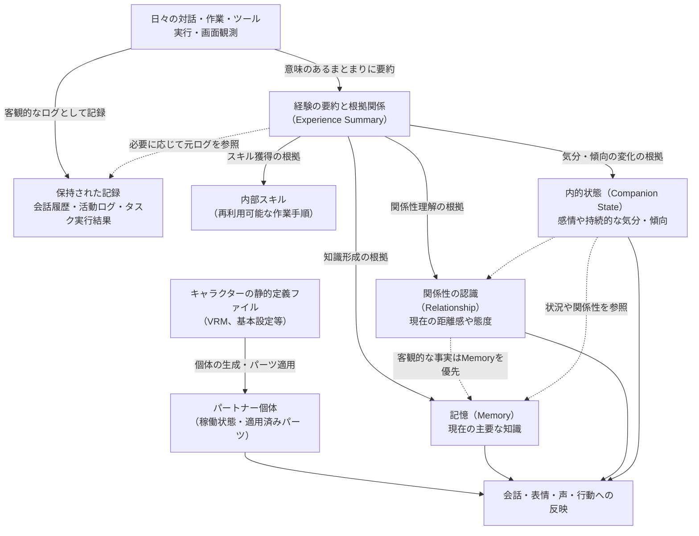

# データ所有権と状態管理（State Ownership）

本書は、システム内のあらゆるデータ（状態: State）について、**「何についてのデータを正本（マスターデータ）として扱い、どのサブシステムがその意味や変更に責任を持ち、いつまで・何のために保持するのか」**というデータ所有権の設計方針を定めます。

※関連ドキュメント：[要件定義 Baseline](../../requirements/README.md)、[Architecture Drivers](architecture-drivers.md)、[System Context](system-context.md)、[Runtime Topology](runtime-topology.md)、[Subsystem Decomposition](subsystems.md)

---

## 1. 概要（Overview）

eneでは、「Hostマシンがすべての内部業務データのマスターデータ（正本）を保持する」という大原則があります。その上で、パートナーの個性、会話の記憶、日々の学習、自律タスクの進捗、セキュリティ設定などのさまざまなデータについて、**「誰がその意味に責任を持つ担当者（セマンティック・オーナー）なのか」**を明確に切り分けます。

- **セマンティック・オーナー（意味の管理者）とは**:  
  そのデータの意味を正しく解釈し、日常的な更新やライフサイクル（保存・変更・削除）に責任を持つサブシステムのことです。「どのパートナーに属するか」「どのタスクで使われたか」「画面上のどこに表示されているか」「データベースのどのテーブルに保存されるか」とは区別して考えます。
- **「正本（Canonical）」の意味**:  
  本書でいう「正本（マスターデータ）」とは、「eneシステムがそのデータについて公式に参照すべき唯一の基準データ」という意味です。客観的な世界の絶対的真理という意味ではありません。
  - 例：記憶（Memory）は「パートナーが現在そうだと理解している知識」の正本であり、会話履歴（History）は「実際に交わされた発言ログ」の正本です。両者は役割が異なるため、一方が他方を勝手に上書きして置き換えることはできません。

本書で定めるのは「概念としてのデータの意味、正本の所在、変更責任、利用範囲、ライフサイクル」です。特定のデータベース製品、Rustのオブジェクト所有権、単一の書き込みプロセス（Single Writer）などの実装手段は後続の詳細設計に委ねます。

---

## 2. データ所有権の12原則（Ownership Principles）

1. **同じ意味のデータには、唯一の正本（マスター）を置く**  
   検索用インデックス、画面表示用のコピー、監査ログ、外部AIへの送信データなど、用途に合わせてさまざまな形に変換されたデータが存在しますが、それらを元のデータとは別の「第2の正本」へ勝手に昇格させてはなりません。
2. **Hostが正本を保持し、各サブシステムが意味を管理する**  
   パートナー、会話、学習、タスク、権限ルールなどの永続データは必ずHost側で保持し、各担当サブシステムがその意味を管理します。クライアント端末、外部AIプロバイダー、MCPサーバー、プラグインがマスターデータの唯一の保管場所になるような設計は許されません。
3. **データの変更、ルールの強制、保存、全体操作への参加を切り離す**  
   「権限・制約」サブシステムは操作を拒否できますが、タスクや記憶のデータを勝手に書き換えることはできません。「保全・消去」サブシステムはシステム全体のデータ消去やバックアップを取りまとめますが、各サブシステムの日常的なデータ管理者になるわけではありません。
4. **静的な設定、成長する個体、形成された経験を区別する**  
   キャラクターの元々の定義ファイル（Package）と、そこから生まれたパートナー個体、そして日々の会話から生まれた記憶（Memory）や関係性（Relationship）は別物です。キャラクターパッケージをアップデートしたからといって、これまでの思い出や成長が勝手にリセットされてはなりません。
5. **現在の理解、過去の記録、判断の根拠を分ける**  
   「現在の知識」には整理された記憶（Memory）を用い、「判断の根拠」には要約（Summary）を用い、「過去の事実」には会話履歴（History）を用います。関係性のメモや一時的な感情を、客観的な事実記憶より優先される裏のマスターデータにしてはなりません。
6. **データの所属や参照関係を、削除の理由と混同しない**  
   タスクの担当パートナーが削除されたからといって、過去の重要なタスク実行記録まで自動で道連れ削除してはなりません。また、外部の作業フォルダを参照しているからといって、その外部ファイルがeneの所有物になるわけではありません。
7. **記憶の公開範囲（スコープ）と、オーナーによる禁止設定を区別する**  
   記憶をパートナー専用にするか全体共有（Global）にするかの判断は「認識・学習」サブシステムが行います。一方、オーナーが明示した「この情報は保存するな」「外部に漏らすな」というルールは「権限・制約」サブシステムが管理し、すべての処理で最優先で適用されます。
8. **AIの生成テキストをセキュリティ設定の正本に直結させない**  
   パーミッション、ルール設定、APIキー、プロバイダー送信同意などは、必ずオーナー本人の意図に基づいて設定されます。AIが「ユーザーから許可をもらいました」と文章を出力しただけで、設定が書き換わることは絶対にありません。
9. **日常的なデータの更新と、セキュリティ目的の完全消去を分ける**  
   通常の記憶の忘却や訂正では、過去の履歴や記録そのものを消去するわけではありません。一方、プライバシーやセキュリティのためにオーナーが指定した「指定データの完全削除（Targeted deletion）」は、過去のログや一時キャッシュも含めてシステム全域から完全に除去します。
10. **指示のキャンセル、内部記録、外部ツールの結果を区別する**  
    作業がキャンセルされたからといって、「外部ツールが実際に動いてしまった事実」までなかったことにはできません。状況が不明なものを勝手に「成功」や「未実行」と決めつけてはなりません。
11. **一時データや複製データにも安全管理の責任がある**  
    画面表示用の一時キャッシュやAIとの通信中のデータであっても、機密情報の漏洩防止や完全データ消去の対象から除外されることはありません。
12. **復元されたデータと、現在使える権限を切り離す**  
    バックアップからデータをリストア（復元）した直後は、古い設定で自動タスクがいきなり暴走しないよう「保留（Hold）」状態とし、オーナーの確認を経てから安全に再開します。

---

## 3. データモデル（State Model）

システム内のデータは、その性質やライフサイクルに応じて以下のように整理されます。

| データのまとまり | 含まれる主なデータ（State） | 関係性のポイント |
|---|---|---|
| **パートナーと対話の継続** | キャラクターの静的定義、パートナーの個体識別と稼働状態、適用済みパーツ、会話への参加関係、会話履歴（History）、活動ログ、未伝達事項と報告状況 | 同じキャラクター定義から複数のパートナーが生まれます。会話履歴や活動ログはパートナー削除後も残り、個体固有の記憶とは別のライフサイクルを持ちます。 |
| **経験からの知識形成** | 経験の要約（Experience Summary）、判断根拠の参照リンク、記憶（Memory）、内部スキル、関係性の認識（Relationship）、内的状態（Companion State）、過去の変更履歴 | 日々の出来事から学習を経て形成されます。要約は現在の知識そのものではなく、複数の知識や状態を形成した共通の根拠として保持されます。 |
| **タスク作業と外部ツール実行** | タスクの目的・進捗・結果、タスクの作業コンテキスト、一時的なタスクエージェント、ツールの実行結果・作用不明の記録、作業フォルダの関連付け、スケジュール設定と各回の実行記録 | タスクの記録はエージェントが終了した後も残ります。スケジュール設定と、実際に実行された各回のタスク記録は別物です。 |
| **セキュリティ制御と利用条件** | パーミッションルール、デバイス許可、プロバイダー送信同意、費用・リソース上限、保存禁止・非共有ルール、APIキーなどの認証秘密、各種接続設定 | 「設定が保存されていること」と「今その操作を行ってよいこと」は別です。現在の最新条件で判定されます。 |
| **実行時の状況とデータ保全** | 端末接続状態、画面上の滞在場所、会話ラウンドの進行状況、リソース消費量、監査ログ（Audit）、データ保持ポリシー、全体操作の進行状況、バックアップデータ | 一時的なデータであっても安全管理の対象です。古いコピーを使って勝手に判断してはなりません。 |

以下の図は、日々の経験から知識や振る舞いがどのように形成されるかという概念的な関係を示しています。

※「会話の参加者」「関係性の相手」「タスクの担当」「端末の滞在場所」などの関係を、単なる「パートナー専用（Companion）」か「全体共有（Global）」かという二者択一に無理やり押し込めることはしません。

---

## 4. データごとの所有権と管理責任（Ownership by State）

※以下で「正本（マスターデータ）」と呼ぶものは、特に断りのない限りHostマシン上で管理されるデータを指します。

### 4.1 キャラクターの静的定義とバージョン（Character）
- **マスターデータの担当**: **Character** サブシステム
- **内容とルール**:
  インポートされたキャラクターの静的な設定（名前、初期設定、3D/2Dモデル、音声設定、推奨スキルなど）を管理します。オーナーによるファイルの編集やインポートが変更の根拠となります。
  - 外部のオリジナルファイル（VRMやパッケージファイル）が変更されたからといって、内部データが自動で書き換わるわけではありません。
  - パッケージの更新があった場合、既存のパートナーにそれを適用するかどうかはオーナーがパーツごとに明示的に選択します。
  - パートナーが削除されても、元となった共有キャラクター定義ファイルまで巻き添えで削除されることはありません。
  - キャラクターパッケージを配布用にエクスポートする際は、これまでの会話履歴や学習記憶、APIキーなどは絶対に含めません。

### 4.2 パートナーの個体識別と稼働状態（Companion）
- **マスターデータの担当**: **パートナー調整** サブシステム
- **内容とルール**:
  特定のキャラクター定義から生成された「1体の自律したパートナー」としての個体識別、稼働状態（稼働中／停止中／削除済み）、どのキャラクターパーツが適用されているかを管理します。
  - パートナーの起動や停止、削除はオーナーの明示的な操作によって行われ、AIの都合で勝手に変更されることはありません。
  - パートナーの振る舞いや理解には、初期設定よりも日々の対話から培った記憶（Memory）が優先されます。
  - パートナーを停止（Stop）させた場合、活動は止まりますがこれまでの思い出データは安全に保持されます。
  - パートナーを削除する場合でも、過去のタスク記録や全体共有された知識、外部ファイルまで巻き添えで消すことはありません。

### 4.3 会話履歴・活動ログ・対話ラウンド
- **マスターデータの担当**: **パートナー調整**（会話と活動ログ）／**入出力・提示**（対話ラウンド）
- **内容とルール**:

| データ（State） | マスター担当サブシステム | 寿命とルールのポイント |
|---|---|---|
| **会話への参加関係** | **パートナー調整** | 誰と誰が対話しているのか、どのグループでの交流かを管理。テキストと音声を同じタイムラインに結び付けます。 |
| **会話履歴（Conversation History）** | **パートナー調整** | 実際に交わされた発言内容と日時の客観的な記録。後から発言を「訂正」したとしても、過去の発言ログ自体を書き換えるのではなく、新しい会話として記録します。デフォルトで永続保持されます。 |
| **非会話の活動ログ** | **パートナー調整** | 画面観測で気づいたこと、通知の生成、内部調査など、会話以外の活動の記録。後からの説明に必要な範囲で適切に残します。 |
| **対話ラウンドの進行状況** | **入出力・提示** | ユーザーの入力中テキスト、音声の再生バッファ、発言の区切りなど、実際の画面や音声の入出力状況を管理する一時データです。 |

クライアント側の画面に表示されているチャット履歴や音声バッファは一時的なコピーに過ぎず、Host側のデータが正本です。会話の中でタスクの指示を受けた場合、発言ログは会話履歴に残り、実際のタスク進行は「作業」サブシステムが管理します。

### 4.4 未伝達事項と報告状況
- **マスターデータの担当**: **パートナー調整** サブシステム
- **内容とルール**:
  ユーザーが不在（クライアント切断中）の間にバックグラウンドで完了したタスクの報告や、パートナーからの連絡事項を「未伝達事項」としてHost側に保持します。
  - 次回クライアントが接続した際に、何が起きていたのかを要約してオーナーに報告します。
  - 端末にデータを送信しただけで勝手に「報告完了」とみなさず、実際に画面に表示されたことを受けて報告状況を更新します。
  - パートナーが削除された場合、その個体の未伝達メモは終了しますが、元となったタスク記録や会話履歴はそのまま残ります。

### 4.5 経験の要約（Experience Summary）と根拠関係
- **マスターデータの担当**: **認識・学習** サブシステム
- **内容とルール**:
  会話や作業などの出来事を意味のあるまとまりとして圧縮した「要約（Summary）」と、それがどの会話やタスクから生まれたのかという「根拠の参照リンク」を管理します。
  - 要約は、記憶や関係性の変化を裏付ける「証拠（エビデンス）」として保持されます。
  - 1つの要約を、記憶（Memory）、スキル、関係性、内的状態の共通の根拠として利用できます。
  - 会話履歴が通常の手動整理で削除された場合でも、すでに形成された要約や記憶まで芋づる式に自動削除されることはありません（元ログへの参照リンクのみが無効化されます）。
  - 全体共有（Global）された記憶の要約リンクから、他人の個人的な会話全文を辿れるような構造にはしません。

### 4.6 記憶（Memory）と公開範囲（スコープ）
- **マスターデータの担当**: **認識・学習** サブシステム
- **内容とルール**:
  オーナーについての理解、パートナー自身についての知識、周囲の状況など、長期的な理解となる「現在の主要な知識」を管理します。
  - **知識の訂正**: 誤った知識を訂正した場合は「過去にはこう誤認していたが、現在はこう修正された」という履歴を保持し、過去のバージョンと現在の正しい知識を区別します。
  - **通常の忘却**: 通常の「忘却」は単に思い出しにくくする（想起の抑制）だけであり、保存されたデータそのものを物理削除するわけではありません。
  - **公開範囲（スコープ）**: 特定のパートナーとの会話から得た知識は「そのパートナー専用（Companion scope）」を基本とします。オーナーが明示的に共有を指示した場合や、複数人で共有すべきであることが明らかな場合にのみ「全体共有（Global scope）」とします。
  - **安全制約の優先**: オーナーが「この情報は記録するな」と指示した場合は、AIがどれほど重要だと判断しても記録してはなりません。

### 4.7 内部スキル（Agent Skills）
- **マスターデータの担当**: **認識・学習** サブシステム
- **内容とルール**:
  作業の手順書やマニュアル、専門知識などの再利用可能な手順データを管理します。
  - インポートされた元々のマニュアルファイルを壊すことなく、改善された手順は新しいバージョンとして管理します。
  - キャラクターパッケージに付属するスキルはそのパートナー専用となり、単体でスキルをインポートした場合は「パートナー専用」か「全体共有」かをオーナーが選択できます。
  - パートナーが削除された場合、そのパートナー専用のスキルは一緒に削除されますが、全体共有スキルは残ります。

### 4.8 関係性の認識（Relationship）
- **マスターデータの担当**: **認識・学習** サブシステム
- **内容とルール**:
  パートナーからオーナー、あるいは別のパートナーに対する現在の「距離感や関係性の解釈」を管理します。
  - パートナーAから見たBと、Bから見たAは別物であり、勝手に同じ値にはしません。
  - 人物の客観的なプロフィールや事実は記憶（Memory）を参照し、矛盾がある場合は客観的な記憶を優先して関係性の解釈を修正します。
  - 主体となるパートナーが削除された場合だけでなく、相手となるパートナーが削除された場合も、その相手に対する関係性データは削除されます。

### 4.9 内的状態（Companion State）
- **マスターデータの担当**: **認識・学習** サブシステム
- **内容とルール**:
  パートナー自身の「現在の気分や感情」などの一時的な状態と、経験の蓄積による「持続的な性格の傾向」を管理します。
  - 一時的な感情と、持続的な性格傾向を区別して扱います。
  - 再起動や端末移動が行われたからといって、感情や気分が不自然にリセットされたり、逆に一時的な機嫌の悪さが永久に固定されたりしないようにします。
  - 画面上のアニメーションや表情は結果の表現に過ぎず、内的状態のマスターデータではありません。

### 4.10 自律タスク（Task）と作業コンテキスト
- **マスターデータの担当**: **作業** サブシステム
- **内容とルール**:
  依頼されたタスクの目的、担当パートナー、進捗状況、完了／失敗／キャンセルなどの状態を管理します。
  - 会話中での軽いお願いであっても、まとまった作業は「タスク」として追跡されます。
  - タスクの完了やキャンセルが行われても、過去の作業記録は安全に残されます。
  - タスクのために集めた作業用コンテキスト（参照資料や途中のメモ）はタスク限定のものとして管理され、勝手に永続的な記憶へ昇格することはありません。
  - 担当パートナーが削除された場合でも、完了したタスクの実行記録は管理画面から確認できるように残されます。

### 4.11 タスクエージェントの一時的な実行状態
- **マスターデータの担当**: **作業** サブシステム
- **内容とルール**:
  タスクを実際に遂行する一時的なエージェントの稼働状況を管理します。
  - タスクエージェントは一時的な作業主体に過ぎず、独自の長期的な人格や記憶、独立した権限を持つことはありません。
  - エージェントが終了しても、タスク自体の進捗やツールの実行結果はHost側に安全に残ります。

### 4.12 外部ツールの実行状況（Action）と確定度
- **マスターデータの担当**: **実行・拡張** サブシステム
- **内容とルール**:
  外部ツールを呼び出した際の操作対象、実行状況、結果がどこまで確認できたか（成功／失敗／不明）、停止結果を管理します。
  - これは外部世界そのものの正本ではなく、**「eneが外部ツールに対して何を指示し、何が確認できたか」**の記録です。
  - 「ツールを呼び出す通信が成功した」ことと「外部で作業が完了した」ことは厳格に区別します。通信切断などで結果が確認できない場合は「不明」として保持し、勝手に再実行してはなりません。

### 4.13 作業フォルダ（Workspace）と成果物
- **マスターデータの担当**: **作業** サブシステム（関連付け・内部コピー）／**オーナー**（実体ファイル）
- **内容とルール**:
  - タスクがどの作業フォルダを参照しているかという関連付けは「作業」サブシステムが管理します。
  - 作業フォルダ内にある実体ファイルや、作成された成果物ファイルは**オーナーの所有物**です。タスクを削除したからといって、作成された成果物ファイルまで勝手に消去することはありません。
  - 作業のために内部に一時的に取り込んだファイル内容のコピーは、セキュリティ保護や完全データ消去の対象に含まれます。

### 4.14 スケジュール設定（Schedule）
- **マスターデータの担当**: **作業** サブシステム
- **内容とルール**:
  定期実行や指定時刻実行のスケジュール設定（実行内容、担当パートナー、予定時刻、タイムゾーン）を管理します。
  - スケジュール設定と、実際に予定時刻が来て実行された「各回のタスク記録」は別物です。
  - パートナー停止中やHost電源OFFの間に到来した予定時刻は「未実行（missed）」として記録され、後から勝手に連続実行されることはありません。
  - 担当パートナーが削除された場合、そのスケジュールは削除されますが、過去に実行されたタスク記録は残ります。

### 4.15 端末接続・滞在場所（Presence）
- **マスターデータの担当**: **接続・存在**（接続・滞在場所）／**権限・制約**（端末ペアリング許可）
- **内容とルール**:
  どの端末がつながっているか、パートナーが現在どの端末の画面に滞在しているかを管理します。
  - パートナーが同時に2つの端末に二重存在して会話することはできません。
  - 端末との通信が切断された場合、Hostマシン上で利用可能な画面があればそこへ移動し、なければ「滞在場所なし」としてバックグラウンドで作業を継続します。
  - 停止（Stop）中のパートナーはいかなる端末にも滞在場所を持ちません。

### 4.16 画面観測（Observer）と自発性設定
- **マスターデータの担当**: **共有観測**（観測設定）／**パートナー調整**（自発性・話しかけ設定）
- **内容とルール**:
  - クライアント画面の観測（ON／一時停止／OFF、キャプチャ頻度）は「共有観測」サブシステムが管理します。
  - パートナーが自発的に話しかけたり内部調査を行う頻度制限は「パートナー調整」サブシステムが管理します。
  - キャプチャされた生の画面画像は一時データであり、原則として恒久保存されません。
  - 画面観測のルーティング用データとして、各パートナーの限定的な文脈を要約して参照することはできますが、プライベートな記憶全文を観測側に渡すことはありません。

### 4.17 システム一般設定と画面・音声出力
- **マスターデータの担当**: **入出力・提示** サブシステム
- **内容とルール**:
  UIの表示言語、キャラクターの表示位置やサイズ、音声設定などの一般設定を管理します。
  - 画面の描画フレームや音声再生のバッファは一時的な実行時データです。
  - マイクからの音声入力があったからといって、「話者認証まで完了した」とみなしてはなりません。
  - Hostの自動起動設定は、日常利用設定として「入出力・提示」が管理し、実際のOSへの登録は「実行・拡張」が担当します。

### 4.18 AIプロバイダー接続情報とモデル割り当て
- **マスターデータの担当**: **推論**（接続設定・稼働状態）／**権限・制約**（送信同意・割り当て）
- **内容とルール**:
  利用するAIプロバイダー（OpenAI、Anthropic、ローカルモデル等）の接続先やプロトコル情報は「推論」が管理し、どのモデルを使ってよいかという送信同意は「権限・制約」が管理します。
  - 画面観測（Observer）用のAIモデル割り当ては、各パートナーの設定とは独立した専用の割り当てとして管理されます。
  - プロンプトキャッシュやセッション情報は実行を高速化・低コスト化するための補助であり、マスターデータを置き換えるものではありません。

### 4.19 セキュリティルール・パーミッション・同意
- **マスターデータの担当**: **権限・制約** サブシステム
- **内容とルール**:
  オーナーが設定したパーミッションルール（恒久拒否、常に確認など）、プロバイダー送信同意、デバイス許可、費用上限を管理します。
  - 自然言語で指示された明確なルールは、内容と範囲を提示して保存し、後から取り消し（Undo）できるようにします。
  - AIが生成したテキストによって、これらのルールが勝手に緩和されることは絶対にありません。
  - 「今その操作を行ってよいか」の最終判定は、最新の状況に基づいてその都度評価されます。

### 4.20 リソース消費量・費用管理
- **マスターデータの担当**: **推論**（トークン数・API費用）／**権限・制約**（上限判定）
- **内容とルール**:
  AI推論のトークン数や費用実績、見積もり費用を管理します。
  - 会話、自律タスク、画面観測、学習など、システム全体の消費量を**共通の上限枠に結び付けて管理**します。
  - 画面観測のキャプチャ費用は端末単位で計算し、見ているパートナーの人数分重複して課金・計上されることはありません。

### 4.21 認証秘密（APIキー・パスワード）
- **マスターデータの担当**: **認証秘密** サブシステム
- **内容とルール**:
  登録されたAPIキーやパスワードなどの機密情報を、一般データから厳格に物理隔離して管理します。
  - プロンプト、ツールの引数や戻り値、ログ、画面UI、バックアップファイルの中に秘密情報が紛れ込むことを絶対に防ぎます。
  - **フルバックアップの対象外**: APIキーなどの秘密情報はバックアップファイルには保存されません。リストア時もHost側の現在のキー情報を維持します。

### 4.22 外部ツール連携設定（MCP・プラグイン）
- **マスターデータの担当**: **実行・拡張** サブシステム
- **内容とルール**:
  連携するMCPサーバーの接続情報や、プラグインの有効化状態を管理します。
  - ローカルMCPに対するサンドボックス外の例外許可は「権限・制約」サブシステムが管理します。
  - 外部ツールが提供する一時UI（MCP Apps）を閉じたからといって、タスクやサーバーが終了したわけではありません。

### 4.23 監査ログ（Audit）・デバッグ情報
- **マスターデータの担当**: **保全・消去** サブシステム
- **内容とルール**:
  システム内で何が起きたかという客観的な事実の記録順序と保持を管理します。
  - 監査ログには、会話の全文やファイル本文、パスワードなどの秘密情報、削除された個人情報は含めません。
  - 調査用のデバッグキャプチャは短期間で自動失効させます。クラッシュレポートが外部へ勝手に自動送信されることはありません。

### 4.24 データ保持ポリシー・バックアップ設定
- **マスターデータの担当**: **保全・消去** サブシステム
- **内容とルール**:
  会話履歴の保持期間、過去バージョンの自動クリーンアップ設定、バックアップの保存先やスケジュールを管理します。
  - 古い記憶や要約の自動削除（容量管理）はデフォルトOFFであり、オーナーが明示的に許可した場合にのみ設定できます。
  - バックアップファイルは整合性の取れたコピーであり、リストアが完了するまではマスターデータではありません。暗号化の有無はオーナーが選択できます。

## 5. Canonical vs Derived / Temporary / External State（マスターデータ・派生・一時・外部データの区別）

### 5.1 正本にしてよい意味を限定する
システムを安定して動かすためには、「何がマスターデータ（正本）で、何が派生データや単なる記録に過ぎないのか」を厳密に区別しておく必要があります。

| 混同しやすい組み合わせ | マスターデータ（正本）として参照するもの | 代用・混同してはならないもの |
|---|---|---|
| **現在の知識と過去の記録** | 「Memory」が保持する現在の認識。 （過去の認識は履歴バージョンとして区別） | 会話要約や履歴の内容をそのまま「今の知識」として優先すること。 検索スコアが高いことだけを理由に「今の知識」と決めつけること。 |
| **正確な発言内容とAIの理解** | 実際に保存されている「会話履歴（Conversation History）」。 | 記憶（Memory）や要約をもとに「きっとこう言ったはずだ」と発言を捏造・再構成すること。 ※履歴が削除された場合は「過去の正確な発言は引用できない」と正直に扱います。 |
| **関係性・気分と客観的事実** | ・関係性の認識は「Relationship」 ・内面や気分の状態は「Companion State」 ・客観的な事実の認識は「Memory」 | これら3つの領域に、同じ人物や出来事について矛盾するデータを別々に持たせること。 |
| **初期設定と日々の成長** | キャラクターのバージョン、個別への適用設定、経験から育った状態をそれぞれ独立して参照する。 | キャラクター定義を更新した際に、これまでの経験や記憶を勝手に再生成・上書きすること。 一時的に表示された表情を「永遠の性格」と誤認すること。 |
| **タスクの進捗と画面表示** | 「作業」サブシステムが管理するタスク進捗・結果と、「実行・拡張」が把握した個別の外部操作結果。 | 会話の中での進行報告、AI自身の自己申告、通知ログ、UI上の進捗バーの表示だけで「完了した」と早合点すること。 |
| **過去に保存した設定と現在の実行可否** | オーナーが設定したセキュリティルールと、現時点で利用可能なリソースや上限を総合評価した結果。 | 過去の「許可」履歴、バックアップから復元された古いルール、AIプロンプト内の指示文、キャッシュされた判定を無条件に信じること。 |
| **外部の最新ファイルと取り込みデータ** | ・外部ファイルの現在の内容は外部の所有者に帰属 ・いつ何を取り込んだかの履歴は内部の記録担当が管理 | 取り込んだ時点のコピーを「世の中の最新ファイル」と思い込むこと。 内部のデータを削除したからといって、外部のファイルまで消えたと勘違いすること。 |

「保存されているデータであること」と「現在のマスターデータであること」は別物です。
たとえば、経験の要約（Experience Summary）は失ってはならない貴重な「証拠」であり、バックアップデータは安全に保存された「過去のコピー」ですが、どちらも現在の記憶（Memory）の代わりにはなりません。
また、一時的なパートナーの内面状態（Companion State）や現在の接続先クライアントは、長期間ファイルに固定されるものではありませんが、「現時点でどうなっているか」という点において紛れもないマスターデータです。

### 5.2 派生dataとcacheの責任（派生データとキャッシュの責任）

| 派生データ・キャッシュ | マスターデータとの関係・利用上の責任 |
|---|---|
| **埋め込みベクトル（embedding）、検索インデックス、類似度スコア** | 記憶（Memory）などの検索対象データから計算して作られます。 検索結果のスコアだけを根拠にして知識の内容や共有範囲を勝手に変えてはなりません。インデックスが壊れて検索精度が落ちることはあっても、元の知識や由来というマスターデータそのものが失われてはなりません。 |
| **プロンプトキャッシュ、プロバイダーセッション、一時コンテキスト** | AI推論を高速化・低コスト化するための実行補助です。 キャッシュの当たり外れや期限切れ、利用プロバイダーの切り替えによって、送るべき情報やセキュリティ境界、データの永続化ルールが変わってはなりません。「プロバイダー側にしか残っていないデータ」に依存する構造は絶対に作りません。 |
| **利用可能なプロバイダー経路、次回スケジュール表示、費用集計、負荷状況** | それぞれ、送信同意・設定時刻・実際の利用実績から計算して導き出されます。 過去に計算された表示用の数値を、現在の同意や上限枠の代わりとして使ってはなりません。 |
| **タスク進捗表示、由来の説明文、報告用要約、3Dアバターや音声の出力** | マスターデータを人間向けに表現した「出力」です。 画面や音声の提示がうまくできたかどうかは「入出力・提示」が管理しますが、それによって元のタスクの成否や記憶の内容が書き換わることはありません。 |

派生データを生成・保持するサブシステムは、そのデータが「どのマスターデータから作られたか」を常に把握し、元のデータが訂正されたり、公開範囲が狭まったり、完全削除（Targeted deletion）された際には、確実に連動して更新・破棄する責任を持ちます。
元のデータが消えた後に、古いインデックスやキャッシュから情報が勝手に復活するような事故は絶対に防ぎます。

### 5.3 一時dataと外部copy（一時データと外部コピーの扱い）

カメラや画面の生映像（Raw Observation）、マイクの生音声（Raw Voice）、ツールの詳細な通信パケット、AI内部の思考プロセス（Chain of Thought）などは、通常は長期間保存しません。
クライアントの画面表示用キャッシュ、入力途中の文字、音声バッファ、AIに渡す一時コンテキスト、ツールUI（MCP Apps）の表示データなどは、その目的が終われば破棄されます。

**ここで重要なのは、「失われてもよいのは一時的な表現や通信データだけであり、オーナーからの確定指示、タスクの記録、未伝達の重要事項、成否不明な外部操作の結果などを失ってはならない」ということです。**
後世に残すべき意味のあるデータは、確定した瞬間にHost側のマスターデータへ正しく記録します。マスターデータへの記録が完了していないものを、画面上で「保存完了」「実行完了」と偽って表示してはなりません。

また、外部の作業フォルダ（Workspace）や成果物、AIプロバイダーやMCPサーバー側の内部状態、外部からダウンロードしたファイル原本、エクスポート済みのファイル、オーナー自身が別ドライブに保存したバックアップなどは、Eneシステムの管理外（外部世界）にあります。
システム内で完全削除やデータリセットを行ったからといって、これらの外部ファイルまで消えるわけではありません（何が消えて何が残るのかを画面で明確に説明します）。
ただし、Eneが内部に取り込んだスキルやプラグイン、ツールUIの一時データなどは、Eneの責任として確実に削除・管理します。

## 6. Cross-state Consistency（複数サブシステムをまたぐ整合性）

### 6.1 協調責任の意味
複数のサブシステムにまたがる処理（パートナーの削除、データの完全削除、バックアップ復元など）を行うときは、**「全体の進行を取りまとめる責任者（コーディネーター）」が条件を揃え、関係する「各マスターデータの担当サブシステム」が自身のデータへの影響や実際の処理を引き受けます**。
コーディネーターが他分野の判断を独断で代行したり、逆に全員が曖昧に責任を押し付け合ったりする構造にはしません。

各担当サブシステムには、対象となるデータ、過去のバージョン、派生データ、メモリ上のキャッシュ、現在実行中の処理などを洗い出し、必要に応じて処理を中断・保留し、正確な成否を報告する責任があります。
単に「自分のテーブルから行を消した」というローカルな成功だけでは、システム全体の処理が完了したことにはなりません。

### 6.2 通常変更と実行の整合契約

日常的な操作において、各サブシステムがどのように連携して整合性を保つかを定義します。

| 操作・整合条件 | 進行役（Coordination）と各担当の責任 | 成立するための条件 |
|---|---|---|
| **パートナー生成・キャラクター更新** | **個体調整**が全体を進行。 ・「Character」が設定内容や差分を管理 ・「認識・学習」が経験状態を独立して管理 ・「入出力・提示」が表示への反映を担当 | 新しいパートナーは別個体として独立して作られ、更新時はオーナーが選んだ部品だけが適用されること。 これまでの経験や記憶が勝手に上書きされたり、未適用の部品が適用済みと誤認されたりしないこと。 |
| **記憶の形成・訂正・統合** | **認識・学習**が全体を進行。 ・各活動担当が知識の「由来」を提供 ・「権限・制約」が禁止事項や公開範囲を適用 | 現在の認識、過去の認識、判断の根拠が正しく対応していること。 誤りの訂正と時間の経過による変化が区別されていること。 記憶を訂正した際に、関係性など別のデータから訂正前の古い情報がゾンビのように復活しないこと。 |
| **記憶のグローバル化（全パートナー共有）** | **認識・学習**が内容や必要な背景を判断。 ・「権限・制約」が非共有ルールや公開範囲を適用 | 全体で共有するにふさわしい情報であること（単に重要度が高いというだけで勝手に全体共有にしない）。 共有された現在の知識から、元のプライベートな会話履歴や過去バージョンまで芋づる式に覗き見られないこと。 |
| **会話からのタスク開始・指示変更（Steering）** | **個体調整**がオーナーとの会話応答を調整し、**作業**がタスクへの反映を確定。 ・権限チェックは「権限・制約」が担当 | 発言の記録、タスクへの反映内容、反映待ちの状況が正しく対応すること。 会話で「わかりました」と返信しただけで「タスクに反映された」「権限が承認された」と早合点しないこと。 タスクの実行待ちで通常の雑談がブロックされないこと。 |
| **タスク委任・結果報告・スケジュール起動** | **作業**がタスク、実行エージェント、各回の実行を調整。 ・「実行・拡張」が外部操作結果を報告 ・「権限・制約」が最新の許可をチェック ・「個体調整」がパートナーへの結果伝達を担当 | エージェントのプロセス終了と、タスクの目的達成が明確に区別されていること。 操作の成否不明が「成功」と誤認されないこと。 パートナー停止中にスケジュールが勝手に動いたり、未承認の危険な操作が実行されたりしないこと。 |
| **クライアント移動・切断と入出力の切り替え** | **接続・存在**が接続先の切り替えを管理。 ・「入出力・提示」が会話の区切りを管理 ・「実行・拡張」が端末依存の操作を安全に区切る ・「共有観測」が画面・音声の対象端末を切り替える | 同じパートナーが複数端末に同時に二重存在しないこと。 切断された古い端末で操作が継続しないこと。 Host側で動いているバックグラウンドタスクは中断せず、古い操作を新しい端末で勝手に再実行（リプレイ）しないこと。 |
| **未伝達事項の要約報告** | **個体調整**が報告内容と状況を調整。 ・「作業」などが元の結果を提供 ・「接続・存在」が現在の接続先を案内 ・「入出力・提示」が画面表示を担当 | 元の実行結果と要約内容が正しく一致していること。 端末が切断されたり、画面に通知を送ったりしただけで「報告完了」とみなさないこと。 承認が必要な保留中のアクションは、報告しただけで勝手に実行しないこと。 |
| **権限失効・プロバイダー停止・費用上限到達** | **権限・制約**が制限の適用と停止対象を管理。 ・各サブシステムが処理を安全に中断 | 古い権限に頼った新しい処理が始まらないこと。 並列処理や委任先のエージェントも含めて例外なく制限が適用されること。 実行中の処理は可能な限り安全に中断し、外部に対して行われた操作の状況を正確に報告すること。 |
| **保存禁止・非共有ルールの適用** | **権限・制約**がオーナーの指示を取りまとめ、各サブシステムが保存・参照・送信をブロック | プロンプトの指示だけに頼るのではなく、データ保存や外部送信のパイプライン自体で確実にブロックすること。 過去バージョンや検索インデックスを経由した情報の抜け道を許さないこと。 |

※タスク指示変更（Steering）のように2つのサブシステムが進行役を務める場合も、権限を曖昧に共有するわけではありません。「会話としての応答」と「タスク管理上の確定」という2つの独立した責任を、両者が責任を持って突き合わせることを意味します。

### 6.3 Companion停止・削除

**「個体調整」がパートナーのライフサイクルを管理し、「保全・消去」が内部データの完全削除を取りまとめます。**
あわせて、「作業」は実行中タスクの安全なキャンセルとスケジュールの解除、「認識・学習」は固有データや関係性の削除、「接続・存在」と「入出力・提示」はアバター表示や対話の即時停止を担当します。

1. **パートナーの停止（Stop）**:
   - 停止が成立した瞬間、すべてのクライアントおよびHostからそのパートナーの存在（プレゼンス）が完全に解除されます。
   - 画面観測（Observer）の人数カウントから除外され、アバターの表示、音声対話、PC操作（Computer Use）、自発的な行動、裏での自律タスクの開始がすべてストップします。
   - 実行中だったタスクは安全に中断（ベストエフォートでキャンセル）されます。
   - ※停止してもパートナーの記憶や設定データは安全に保持されます。再開した際は、適切なクライアントへスムーズに復帰できます。

2. **パートナーの完全削除（Delete）**:
   - 削除を実行する前に、固有の設定、要約、個別の記憶、内面状態、関係性、スケジュールなど、何が消去されるのかを画面に明示し、オーナーによる厳格な確認（強い確認）を経る必要があります。
   - 削除対象となったパートナー固有の記憶やスキルは、過去のバージョンも含めてすべて削除されます。
   - **通常の会話履歴との区別**: パートナーを削除しても、オーナーと交わした会話履歴そのものや、非会話の活動ログ、過去のタスク完了記録は（個別の思い出やシステムの客観的証拠として）そのまま残ります。
   - 他のパートナーと共有されている全体知識（Global Learning）も残ります。ただし、その知識が「どのパートナーから学んだか」という参照リンクは外れます。
   - パートナーを削除した後に、遅れて届いた処理結果などからそのパートナーの状態が勝手に復活することは絶対に防ぎます。

### 6.4 Targeted deletion（指定データの完全削除）

オーナーから「この特定の情報を完全に消してほしい」（個人情報、機密情報、削除したいキーワードなど）と要求された場合、**「保全・消去」サブシステムが主導し、保存場所を問わずシステム全域からその情報を復元不可能な状態に抹消します。**

完了するためには、以下の5つの条件をすべて満たす必要があります：

1. **影響の説明と確認**:
   削除する範囲と、それによって生じる影響（記憶の欠落など）をオーナーに分かりやすく説明し、確認を得ていること。
2. **システム全域からの徹底消去**:
   会話履歴、活動ログ、要約、記憶（過去のバージョン含む）、関係性データ、パートナーの内面状態、スキル、タスク記録、検索インデックス、埋め込みベクトル、キャッシュ、監査ログ・デバッグログ、クライアント上の一時データなど、該当情報を復元できるすべての場所から完全に消去または復元不能にしていること。
   ※すでに削除されたパートナーの過去ログに残っている情報も漏れなく対象とします。
3. **再保存・再学習の防止**:
   削除処理の開始から完了までの間に、処理待ちのキューや遅延して届いたAIの推論結果から、同じ情報が再び保存されることを確実にブロックすること。古いインデックスや関連データから記憶が自動で再形成されないようにすること。
4. **確実な機械的消去と検証**:
   指定された文字列やデータは、AIの「忘れたふり（プロンプトによる想起抑制）」でごまかすのではなく、データベースやファイルから物理的・論理的に機械検索して確実に消去し、残存していないかを検証すること。
5. **全体の完了確認と安全な記録**:
   関係するすべてのサブシステムから消去完了の報告を集約し、一部でも失敗や未確認があれば「完了」と偽らないこと。システムが途中で再起動しても「未完了」の状態を保持し、再開すること。また、完了ログの中に「何を消したか（削除対象の秘密情報そのもの）」を誤って記録しないこと。

**クライアントや外部データの扱い:**
- 一時的に切断されているクライアントがある場合、放置してローカルにコピーが残ることを許しません。クライアント側にはもともと長期的なプライベートデータを永続キャッシュさせず、再接続時に古い一時データがHostへ逆流して記憶が復活することを防ぎます。
- 完全削除は、システム内部のデータを対象とするものであり、すでに外部へメールやAPIで送信されたデータ、エクスポート済みのファイル、オーナー自身が外部メディアに保存したバックアップ、外部作業フォルダのファイルをEneが勝手に消し去ることを保証するものではありません（これらは対象外であることを画面で明示します）。

### 6.5 保持整理、保存、backup、restore、Reset（保存・バックアップ・リストア・リセット）

データの一括変更や初期化を行う際の、各サブシステムの連携ルールを定義します。

| 操作 | 進行役（Coordination）と各担当の責任 | 成立するための条件 |
|---|---|---|
| **通常の会話履歴・ログ削除 / 保持期間変更** | **保全・消去**がオーナーの指定範囲や影響を調整。 ・「個体調整」「作業」等が対象記録を特定 ・「認識・学習」が残る記憶との根拠関係を確認 | 指定された古いログや履歴が正しく整理され、すでに形成された記憶や要約まで連鎖して勝手に消えないこと。 元の発言ログが消えた記憶については「元の発言はもう参照できない」と説明できること。 外部にエクスポートしたファイルまで消えたと誤認させないこと。 |
| **記憶の過去バージョン・要約の明示クリーンアップ（容量削減）** | **保全・消去**がオーナーの明示設定（オプトイン）に従って進行。 ・「認識・学習」が対象と残る参照の整合性を確認 | **既定はOFF**であり、オーナーの許可なしに「ディスク容量が足りないから」と過去の記憶や判断根拠を勝手に削除しないこと。 設定した範囲と、過去バージョンに戻せなくなる影響を画面で説明すること。 通常の「忘却」や「完全削除」と混同しないこと。 |
| **通常保存・データ移行（Migration）・バージョンアップ** | **保全・消去**が安全な保存と復旧可能性を調整。 ・各担当がデータ構造の意味上の整合性を確認 | 移行が完全に成功するまで、直前の正常な状態を絶対に破壊しないこと。 利用可能な状態と失敗内容を正確に説明し、壊れた不完全なデータを「保存成功」として扱わないこと。 |
| **フルバックアップ（Full backup）** | **保全・消去**がバックアップ時点、対象範囲、除外項目を調整。 ・全サブシステムが必要なデータと関連付けを提供 ・「認証秘密」が機密値の除外を徹底 | パートナー設定、会話履歴、活動ログ、要約、記憶、関係性、内面状態、タスク・作用記録、スケジュール、セキュリティルール、プロバイダー同意、費用上限、監査ログなどを整合性の取れた形で含めること。 ※すでに削除されたパートナーの残存履歴も正しく含めます。 **APIキーやパスワードなどの機密情報は絶対に含めません**。 単に各ファイルをコピーできたことだけを「バックアップ成功」とは呼びません。 |
| **リストア（Restore）** | **保全・消去**がバックアップデータによる内部データの全置換を主導。 ※**Host側に現在登録されているAPIキー情報（Credential store）は置換せずそのまま維持します**。 ・「認識・学習」が内面状態の経過時間を再評価 ・「認証秘密」が現在のAPIキーとの照合・不足時の再入力を案内 ・「権限・制約」と活動担当が自動処理を一旦保留 | 失敗した場合はリストア前の正常な状態をそのまま維持すること。 リストア成功後はバックアップされた内容を新しいマスターデータとし、リストア前の古い状態と二重管理にしないこと。 タスクやスケジュール、外部接続などの自動実行はいったん「保留」とし、オーナーが画面で確認して一括で安全に再開できるようにすること。 |
| **一般設定のリセット（設定Reset）** | **保全・消去**が初期化範囲を調整。 ・各設定担当がデフォルト値への復元と保護対象の維持を確認 | UI表示、アバター、音声などの一般設定のみを初期値に戻すこと。 パートナー、履歴、記憶、関係性、タスク、スケジュール、APIキー、セキュリティルール、プロバイダー同意、費用上限などは**絶対に削除しないこと**。 |
| **全データのリセット（Factory Reset）** | **保全・消去**が対象の列挙、強い確認、完全消去を主導。 ・認証秘密を含むすべての担当が参加 | Host内部のEneデータおよびAPIキーを完全に消去し、古いキャッシュや処理中データから状態が復活しないようにすること。 外部の作業フォルダ（Workspace）、外部スキル、オーナーが別ドライブに保存したバックアップは削除されないため、「何が残るか」を画面に明示すること。 |

**バックアップとリストアの重要な原則:**
- バックアップは、実行中のメモリ状態を丸ごとダンプすることを求めているわけではありません。意味の継続に必要なデータを保存するものであり、一時的なバッファやプロバイダーのセッション情報などの復元は前提としません。
- データの消去や復旧の途中でバックアップを取る場合も、未完了の状態を隠して「正常で即座に動かせるコピー」と偽ってはなりません。
- リストアを実行する前には、バックアップのバージョン、現在のAPIキーが維持されること、外部ファイルは上書きされないこと、削除済みだった情報や過去のスケジュールが復活すること、APIキーの再認証が必要になる可能性があることをオーナーに説明します。
- リストアが完了したことと、自動処理を再開してよいかは別々に確認します。復元された過去の許可ルールを鵜呑みにして即座に実行するのではなく、保留を解除した上で、現在のAPIキーの有効性や費用上限、安全境界を再評価します。一つひとつのタスクを個別に再承認させる負担を避け、オーナーによる明示的な「一括再開」操作を提供します。

## 7. Lifecycle and Ownership Transitions（ライフサイクルと状態の遷移）

ライフサイクルの変化（起動、停止、削除など）の多くは、データの所有者が別のサブシステムへ移ることではなく、**同じ担当サブシステムが管理する状態の「存続・利用可否・参照範囲」が切り替わること**を意味します。

| 事象（イベント） | 状態の変化（変更されること） | 境界の維持（勝手に変更・混同しないこと） |
|---|---|---|
| **キャラクターのインポート・パートナー生成** | 外部のキャラクター定義を取り込み、独立した新しいパートナーとして設定を適用する。 | 外部ファイルの所有権がEneに移るわけではない。 同じキャラクターから生まれた別パートナー同士が、お互いの記憶や経験を勝手に共有することはない。 |
| **キャラクター設定の更新適用** | パートナーに適用されているキャラクター定義のバージョンやパーツを更新する。 | これまでの会話経験から育った記憶、履歴、権限ルールは初期化しない。 |
| **パートナーの停止（Stop）／再開（Resume）** | **停止中**: いずれの端末やHostにも存在（プレゼンス）を持たず、画面観測の対象から除外。対話、PC操作、自発活動、タスク、スケジュール起動を行わない。実行中タスクは安全に中断。 **再開時**: 適切な端末へスムーズに復帰可能。 | パートナーの同一性とデータは完全に保持される。 停止中にスキップされたスケジュール実行を、再開時に慌てて自動再実行（リプレイ）しない。 |
| **パートナーの完全削除（Delete）** | 個別設定、要約、個別記憶、内部スキル、内面状態、相手との関係性、担当スケジュールを削除する。 | 会話履歴そのもの、活動ログ、タスク完了記録、全体共有の知識（Global Learning）、外部ファイルは削除しない。 スケジュールの自動引き継ぎや、個別記憶の勝手な全体共有化は行わない。 |
| **タスクエージェントの終了／失敗** | 一時的な実行プロセスを終了し、成否や不明な状況をタスク記録に紐付ける。 | タスク記録そのものや、依頼主のパートナー、スケジュールを削除しない。 エージェント自身が独立した長期的な人格として残ることはない。 |
| **タスクの完了・失敗・キャンセル** | 作業の進行を区切り、結果、未保存データ、外部への影響、次の判断を報告し、一時ファイルを安全に片付ける。 | タスク終了だけでタスク履歴や作業フォルダの関連付けを削除しない。 外部で作成された成果物を勝手に消去しない。 |
| **タスク記録の削除** | タスク固有の内部記録や関連付けを削除する。 | 外部のソースコードや成果物、同じフォルダを使っている別タスク、すでに形成された記憶や要約へ削除を波及させない。 |
| **スケジュールの停止／削除** | 将来の自動起動条件を停止または削除する。 | 過去に実行されたタスクの結果を変更したり、スキップされた回を実行済みに書き換えたりしない。 |
| **記憶の忘却・訂正・統合・失効** | 記憶の重要度、想起のしやすさ、現在参照する最新バージョンを更新する。 | 過去の記録や判断根拠は保持し、知識の誤り（訂正）と時間の経過による変化を正しく区別する。 |
| **記憶の共有範囲（スコープ）変更** | 「認識・学習」が内容と背景を判断し、共有範囲（個別↔全体）を切り替える。 | 担当サブシステム自体は変わらない。 重要度が高いからといって勝手に全体共有にしない。 最新の知識を共有したからといって、過去のプライベートな会話ログまで共有しない。 |
| **通常の履歴削除・クリーンアップ** | 保存している古い発言ログや活動記録の範囲を削減する。 | すでに形成された記憶や要約は維持し、「元の発言ログは参照できない」と正直に示す。 プライバシー目的の「完全削除」と混同しない。 |
| **指定データの完全削除（Targeted deletion）** | 指定された情報を復元できるすべての内部データ・キャッシュ・処理中コンテキストを抹消する。 | 担当サブシステムは変わらない。 削除完了後にオーナーが改めて教えてくれた情報は、新しい経験として受け入れる。 外部に送信済みのコピーまで消えたと偽らない。 |
| **パートナーの端末移動・切断** | 接続先を切り替え、端末依存の画面・音声処理を安全に引き渡す。 利用可能な端末がなければ「アクティブ端末なし」とする。 | パートナーの「停止（Stop）」とは別物。 パートナー自身やHost側タスクの担当は変わらない。 未伝達事項はHostに安全に保持し、未確定のアクションを移動先で勝手に再実行しない。Host側アプリを勝手に起動しない。 |
| **全画面表示・画面観測停止・ミュート** | 画面表示の一時非表示、画面観測の停止、音声出力の抑制を行う。 | パートナーの停止、Hostタスクの中断、記憶の削除とは全く異なる一時的な抑制として扱う。 |
| **Hostの再起動** | 稼働中だったパートナーを直前の端末へ自動復帰させる（元端末がなければアクティブなし。停止中だったパートナーは復帰させない）。 途中だったタスクは明示的な再開指示を待ち、停止中に過ぎたスケジュールはスキップ扱いとする。 | 接続が本当に生きているかを再確認する。 過去の成否不明な操作や未伝達事項、未完了の削除処理を「なかったこと」にしない。 |
| **AIプロバイダー/モデル変更・障害** | どのAIモデルを使って推論するかを切り替える。 | 内部のパートナー設定、会話履歴、記憶などを初期化しない。 回線復旧時に過去の操作を勝手に再実行しない。 |
| **バックアップ／リストア** | バックアップを作成し、リストア時は現在のAPIキー情報を維持したまま内部データを過去時点へ全置換する。 | バックアップデータは静的なコピーである。 リストア直後は自動処理を保留し、外部世界は巻き戻らないことを前提とする。 APIキーが不足していれば再入力を促す。 |
| **設定リセット／全データリセット** | 設定リセットは一般設定の初期化、全データリセットは強い確認を経た内部データとAPIキーの完全消去。 | 一般設定のリセットで重要データを消さない。 全データリセットで外部ファイルが消えたと誤解させない。 |

**スコープと時間の重要な補足:**
- 全体共有（Global）に昇格した記憶は、その後に元のパートナーが削除されても全体知識として残ります（どのパートナーから学んだかのリンクは外れます）。逆に、共有範囲を狭める場合も、過去に送信された履歴を隠蔽するのではなく、「これからの利用範囲」を厳密に制限します。
- パートナー同士の関係性（Relationship）や内面状態（Companion State）は、記憶のように全体共有されることはありません。同じ体験を共有しても、各パートナーの気持ちや関係性の深まりは個別に育ちます。
- 時間（タイムゾーン、経過時間、現在時刻）は各担当が正しく解釈します。たとえば、スケジュール設定で指定されたタイムゾーンは、OSのタイムゾーンが変わっても勝手に書き換えません。また、待機処理のためだけに高価なAIモデルをループ実行するような無駄は避けます。

## 8. Runtime State Boundaries（実行時の状態境界とデータの受け渡し）

システム境界（Host、Client、Provider、MCP、外部Workspace、Backup）をまたぐデータの受け渡しルールを定義します。

| 境界 | 受け渡す／保持し得るデータ | 所有権（Ownership）上のルール |
|---|---|---|
| **Host → 公式クライアント** | 必要な範囲の会話、タスク進捗・結果、判断の由来説明、現在の状態、アバター素材、操作・確認用の画面データ。 | クライアントはHostからのデータの一時的な利用者に過ぎません。 会話履歴、要約、記憶、関係性、内面状態、APIキーを**クライアント側に長期間永続キャッシュさせてはなりません**。 マスターデータは常にHost側にあります。 |
| **公式クライアント → Host** | ユーザーからの発言入力、指示・タスク操作、アクションの承認・拒否、ミュート・停止などの管理操作、端末の接続状態。 | 意味のある変更はHost側の各担当サブシステムが検証して確定します。 クライアント画面の表示値をそのまま鵜呑みにしてマスターデータに昇格させてはなりません。 |
| **Hostのプレゼンス管理 ↔ クライアントの実際の入出力** | 現在アクティブな端末情報、入出力の安全な区切り、切断や表示の成否。 | 状況が不明な場合、クライアント側は勝手に行動を継続しません。 Host側も「画面に出ただろう」「音が鳴っただろう」と勝手に成功とみなしてはなりません。 クライアントが急に切断されても、未伝達事項や記録はHost側で保護されます。 |
| **Ene ↔ AIプロバイダー** | 送信同意済みのプロンプトデータ、推論結果、利用量、セッションやキャッシュ情報。 | AIプロバイダーは外部の委託先です。 プロバイダー側に残ったキャッシュやログは、Eneのマスターデータでも内部削除の保証範囲でもありません。 |
| **Ene ↔ MCPサーバー／プラグイン** | 許可されたツール実行要求、リソース、ツールの実行結果。 | 外部コードがEneの内部データや制御権のオーナーになることはありません。 Eneが一時的に保持したデータはEneの安全基準に従って管理します。 |
| **公式クライアント ↔ MCP Apps（ツールUI）** | ツール画面を表示・操作するための最小限の一時データ。 | ツールUIは権限や設定のマスターデータを持ちません。 ツール画面を閉じたことと、裏で動いているツールサーバーやタスクの終了は別物です。 |
| **Ene ↔ 外部作業フォルダ（Workspace）** | タスクで許可された範囲のファイルの読み書き、キャラクターやスキルのインポート/エクスポート。 | 外部ファイルの最新内容と、Ene内部に取り込んだコピーを厳密に区別します。 内部のタスク記録を消したからといって、外部ファイルまで消えることはありません。 |
| **Ene ↔ バックアップ／エクスポート先** | 選択されたデータの整合コピーの出力、リストア時の入力。 | 出力されたファイルは静的なコピーであり、稼働中のマスターデータではありません。 リストア時は現在のAPIキー情報を保護し、過去の危険な実行許可を無条件に復活させません。 |

**クライアントのペアリング・接続鍵の扱い:**
端末固有のペアリング鍵や接続トークンは、Hostから同期する会話履歴やAPIキーとは別の分類であり、端末側で安全に保持できます。
ただし、これは端末が勝手に独立して動くことを許すものではなく、Host側のセキュリティルールが常にマスターです。
端末の登録解除や全データリセットが行われた場合、Host側で信頼を無効化し、古い鍵だけで再接続されることを防ぎます。

**認証秘密（APIキー）の厳格な分離:**
APIキーなどの秘密情報は、通常の会話データや画面表示データとは通信経路レベルで物理的に分離します。
AIプロンプト、ツールの引数や戻り値、ログ、画面UI、バックアップファイルの中に秘密情報が流れ込むことを絶対に防ぎます。

## 9. Design Freedom（後続設計に委ねる自由度）

本ドキュメントが定めた「マスターデータの所有権と安全境界」を遵守する限り、以下の具体的な実装方式は後続の詳細設計や実装フェーズで柔軟に決定して構いません。

- **データベース選定とスキーマ**: 利用するDB製品（SQLite等）、テーブル設計、カラム名、外部キー、シリアライズ形式、Rustの構造体・トレイト・モジュール構成、ファイル配置。
- **トランザクションと並行処理方式**: 保存の物理単位、単一ライターの要否、ロック、MVCC、削除時の競合制御、再起動時の復旧メカニズム。
- **通信プロトコルとプロセス配置**: IPC、同期プロトコル、イベントバス、APIエンドポイント設計、プロセス分割数、ペアリングの実装方式。
- **アルゴリズムと内部表現**: 要約の粒度、記憶やスキルの内部データ構造、検索インデックスやベクトルの次元数・スコアリング計算、プロンプト構造、記憶の減衰アルゴリズム。
- **削除・クリーンアップの実装**: 削除対象の探索アルゴリズム、クライアント側一時データの無効化方式、通常のログ保持期間の初期値。
- **バックアップの実装**: バックアップファイルのアーカイブ形式、暗号化方式、差分バックアップの有無。
- **UIと表現**: 画面レイアウト、3Dモデルの描画パイプライン、音声合成の実装方式、AIプロバイダーのカタログ構成。

※ただし、「実装の自由」を口実にして、本ドキュメントで定めたセキュリティ原則（Hostがマスター、APIキーを漏らさない、停止と削除の分離など）を勝手に緩和・変更することは絶対に認められません。

## 10. Traceability and Completeness（要件追跡性と設計の網羅性）

### 10.1 根拠と要件の対応関係

本書で定めた設計判断が、[要件定義書](../../requirements/requirements.md)のどの項目に基づいているかを示します。

| 本書の設計判断 | 対応する要件項目 | 関連するアーキテクチャ方針と主な担当サブシステム |
|---|---|---|
| **Hostがマスター、クライアントは一時データ、担当サブシステムの明確化**（2、5、8章） | 所有と実行、Remote Client、Local data | 全サブシステム、接続・存在、入出力・提示、保全・消去 |
| **パートナーの独立性、キャラクター定義の適用と成長の分離**（4.1、4.2、6.2章） | 個体性、Character Package、停止と削除 | Character、個体調整、認識・学習 |
| **会話・活動ログの保持、未伝達事項の管理**（4.3、4.4、6.2〜6.5章） | 一続きの会話、Companion間交流の記録、Historical recordと形成済み状態、停止と削除、Task、Remote Client | 個体調整、入出力・提示、作業、接続・存在、保全・消去 |
| **現在の知識、手順、判断根拠、履歴バージョンの分離**（4.5〜4.7、5章） | ExperienceとExperience Summary、MemoryとSkill、Memory形成、Memoryの状態と根拠、Skillの保護と相互運用、重要度、忘却、訂正 | 認識・学習、各活動担当、保全・消去 |
| **共有範囲（スコープ）、関係性・内面状態の個別管理**（4.5〜4.9、6.2、7章） | Scope、Relationship、Companion State、グループ会話、停止と削除 | 認識・学習、個体調整、権限・制約 |
| **タスク管理、自律エージェント、成否不明の記録、作業フォルダ**（4.10〜4.13、6.2章） | Task、Computer Use、Workspace、Fileと成果物、Capability境界 | 作業、実行・拡張、個体調整、権限・制約 |
| **スケジュール管理、タイムゾーン、未実行時の扱い**（4.14、7章） | Schedule、停止と削除、所有と実行 | 作業 |
| **デバイス許可、端末接続、プレゼンス移動**（4.15、6.2、8章） | Remote Client、Computer Use | 接続・存在、権限・制約、入出力・提示、実行・拡張 |
| **画面観測、自発的行動、一般設定、縮退運転**（4.16、4.17、7章） | Setupと日常利用、BodyとVoice、Observation、自発的な発話と行動、品質と利用可能性 | 共有観測、個体調整、入出力・提示 |
| **AIプロバイダー接続、送信同意、費用・リソース上限**（4.18〜4.20、5、6.2章） | 割当と同意、Fallbackと費用、OfflineとPrompt cache、Permissionと安全境界 | 推論、権限・制約、各利用元 |
| **APIキーなどの認証秘密の物理隔離と保護**（4.21、8章） | Credential、信頼境界、Local data、Backupとrestore、Reset | 認証秘密、全サブシステム |
| **外部ツール（MCP・プラグイン）、外部ファイルと内部データの区別**（4.13、4.22、5、8章） | 拡張、信頼境界、Character Package、Skillの保護と相互運用、Workspace | 実行・拡張、入出力・提示、Character、認識・学習、作業 |
| **監査ログ、デバッグ情報、完全削除（Targeted deletion）**（4.23、4.24、6.3〜6.5章） | 履歴、保持、Privacy、停止と削除 | 保全・消去が主導し全サブシステムが参加 |
| **通常保存、バックアップ、リストア、リセット**（4.24、6.5、7章） | 保護、Backup、復旧、Setupと日常利用 | 保全・消去、認証秘密、権限・制約、認識・学習、活動担当 |

### 10.2 サブシステム境界の主な論点と設計判断

| 主な論点 | 本書の回答箇所と設計判断 |
|---|---|
| **パートナーの継続性と設定の更新** | 4.1、4.2、6.2章。 静的なキャラクター定義と、日々の経験で育った記憶・状態を完全に分離し、定義の更新で経験が上書きされないようにする。 |
| **タスクの担当、実行プロセス、各回の扱い** | 4.10、4.11、4.13、4.14、7章。 一時的なエージェントプロセスとタスク全体の達成を明確に分け、スケジュールや作業フォルダと安全に関連付ける。 |
| **作業進捗と外部操作の成否** | 4.10、4.12、6.2章。 タスク全体の成否と個別の外部操作結果を分け、結果が確認できないものは「成否不明」として正直に記録する。 |
| **接続、デバイス許可、プレゼンス、入出力** | 4.3、4.15、6.2、8章。 セキュリティ許可、接続の事実、アクティブな端末帰属、実際の画面・音声出力を別々のマスターデータとして厳密に管理する。 |
| **未伝達事項とタスク完了報告** | 4.4章。 通知の送信と相手への伝達完了を分け、Host側に確実に残す。画面に送っただけで「伝達完了」と早合点しない。 |
| **知識、判断根拠、元の履歴、派生データ** | 4.3、4.5〜4.9、5章。 現在の知識、過去のバージョン、判断の根拠、元の会話ログ、検索インデックスの役割と責任を厳格に限定する。 |
| **全体共有の知識と個別パートナーの所属** | 4.5〜4.8、6.2、6.3、7章。 全体共有された知識は元パートナーが削除されても残るが、元のプライベートな会話ログまでは共有しない。 |
| **一時的な気分と長期的な性格傾向** | 4.9、6.5、7章。 一時的な気分や内面状態をHostで安全に保持しつつ、再開時の経過時間に応じた自然な変化を可能にする。 |
| **セキュリティ設定と現在の実行可否** | 4.18〜4.20、6.2、6.5章。 オーナーが設定した恒久ルールと、現時点で利用可能なリソースや費用上限をその都度総合評価する。 |
| **APIキーなどの機密情報の保護** | 4.21、8章。 通常のデータから物理隔離し、バックアップファイルからも除外。リストア時もHost側の現在のキーを保護する。 |
| **指定データの完全削除の完了条件** | 4.24、6.4章。 全サブシステムが責任を持って参加し、キャッシュや推論待ちキューからの再保存を防ぎ、物理的な消去を検証する。 |
| **バックアップ・リストア・初期化の整合性** | 4.24、6.5、7章。 バックアップデータ、復元されたマスターデータ、現在の実行可否を厳格に分離し、安全を確認した上で再開する。 |

