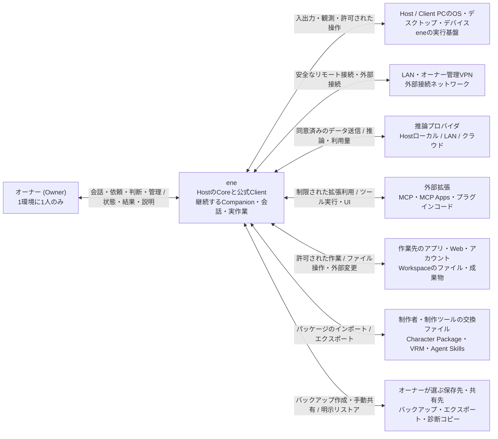

# System Context（システム境界と全体像）

対象: [要件Baseline](../../requirements/README.md) と [Architecture Drivers](architecture-drivers.md)。本書では、eneが製品として責任を持つ範囲と、外部環境との境界を定めます。実行コンポーネントの配置は [Runtime Topology](runtime-topology.md) で扱い、内部サブシステムや実装構造の詳細はここでは扱いません。

## Overview（概要）

eneは、1人のオーナーのための「継続的なパートナー（Companion）」であり、「日々の実作業をこなす」システムです。オーナーが管理するHostマシン上で動く「Core」と、そのHostに接続する「公式Client（第一者Client）」をあわせて、1つのeneというシステムを構成します。Companionは外部サービスや独立したクラウドエージェントではなく、ene自身が個性や継続的な記憶・状態を管理する大切な存在です。

この境界は、物理的なPCやプロセスの区切りとは一致しません。Clientが別のPCや端末にあってもeneの一部ですし、逆にHost PC内にある外部の推論プロバイダ、MCPサーバー、作業フォルダ（Workspace）のファイルなどは、単に同じPCにあるからといってeneの内部には含めません。eneは内部の状態、処理の実行許可、外部へのデータ送信同意、そしてオーナーへの説明に責任を持ちますが、外部サービスの状態や外部ファイルの所有権、すでに実行された外部への影響そのものを直接支配するわけではありません。

なお、Clientが接続していない間でもCompanionが活動を続けられるのは、「起動中（Running）」の個体だけです。「停止中（Stopped）」の個体はアクティブなClientを持たず、ClientにもHostにも滞在（presence）しておらず、Observerの観測対象人数にも数えません。Hostに保存されている個体データや復帰候補は、現在の滞在（presence）とはみなされません（SC-02）。

推論エンジンはHostローカル、LAN内、クラウドのいずれにも配置できますが、eneのマスターデータと継続して処理を動かす責任は、常にHostにあります。見た目の姿（Body）や音声の入出力場所を切り替えたり、推論モデルを変更したり、Clientや拡張機能で一時的なトラブルが起きたりしても、Companionが消えてしまったり作業履歴が失われたりしない設計を最優先とします。

## System Boundary（システムの責任範囲）

### eneが責任を持つ範囲

| 境界内に置くもの | 境界をここに置く理由 |
|---|---|
| Host上のene Coreと公式Client | 継続して存在する個体・作業と、その表示・会話・操作をひとつの製品として一貫して提供するためです。Clientの入出力、安全な接続保護、一時データもeneの品質責任の対象です。ただし、Host PC全体やOSそのものをeneと同一視するわけではありません。HostとClientが同じ1台のPCで動いている場合でも、「Hostが持つマスターデータ」と「Clientが担う姿や入出力」の境界は明確に区別します。 |
| Companionの継続、会話、Task・委任・Scheduleの管理 | オーナーからの依頼、自発的な作業、進捗状況、オーナーの判断待ち、処理の停止、結果の報告など、作業全般をeneが管理します。まとまった実作業は基本的に「Task」として扱い、原則として専用の「Task Agent」へ委任して実行します。Task（やること）とTask Agent（実行役）は明確に区別します。Task Agentは一時的な作業代行者であり、外部のアクターや別の長期的な人格ではありません。 |
| ene内部状態とその保存・由来・削除・復旧 | Companionの継続的な状態、内部学習（Learning）、会話履歴、作業記録、各種設定などの「マスターデータ」はHostに置きます。長期記憶（Memory）、圧縮された要約、元々の生ログ、派生データの意味の違いは明確に保ちますが、それらを別のシステムへ分離することはしません。 |
| Permission、Capability、Rule、Provider割当同意、費用・リソース制限、Credential保護 | オーナーが定めた安全基準や利用制限を、eneのあらゆる実行パスへ確実に適用する責任を持ちます。この安全確認の責任をLLMや外部拡張、Client上のUIなどに丸投げすることはありません。 |
| 外部形式の受け入れ・出力、拡張機能の接続と制限 | MCP、MCP Apps、Agent Skills、VRM 1.0などの標準規格との連携や、Local MCPをデフォルトでサンドボックスで動かすこと、制限されたPlugin拡張ポイントの提供はene側の責任です。ただし、外部のコードやコンテンツそのものをene本体の信頼権限へ取り込むわけではありません。 |

一般的なアプリケーションデータ（App Data）は、Hostマシン上でオーナーのOSアカウントだけがアクセスできる安全な領域に保存し、登録された認証情報（Credential）はそれと分離して安全に保管します。この保護方針は製品としてのセキュリティ契約であり、特定のDB製品や暗号アルゴリズム、クラウドサービスなどの利用を縛るものではありません。

個体を削除した後でも、1対1・グループ・Companion同士の会話履歴、Taskの記録、保存された活動記録などは、ene内部の「過去の記録（historical record）」として残ります。通常のデータ保持・バックアップ・指定データの完全削除（targeted deletion）の責任はそのまま維持され、削除された個体固有の記憶・学習（Memory / Learning）、要約（Summary）、関係性（Relationship）、Companion状態の削除とは明確に切り離して扱われます（SC-06・SC-07）。

### eneの外側に残すもの

**実行環境:**
HostやClientが動くPC、OS（Windows / Linux）、デスクトップセッション、入出力デバイス、ファイルシステム、ネットワーク、LAN、オーナー管理のVPNなどは、eneが動作するための土台（基盤）です。Hostはオーナーが管理するPCであり、Clientはオーナーが操作するための窓口です。ペアリングしたからといって、ClientのOSや周囲のネットワーク環境全体を丸ごと無条件に信頼するわけではありません。また、オーナーがPC全体の管理者であるからといって、eneにそのPC上のあらゆる操作を何でも許可してよいわけでもありません。OSレベルのファイルアクセス権限と、eneが個別のアクションに適用する権限（Capability / Permission）は別の安全境界です。

**推論と拡張の提供者:**
推論プロバイダによるモデル実行、MCPサーバー、外部から導入するプラグインのコード、MCP Appsのコンテンツなどは、ene本体とは異なる信頼境界・障害境界に置かれます。たとえ同じHost PC内で動いていたり、認証が成功していたり、サンドボックスに隔離されていたとしても、それらが出力する内容が常に正しいとは限りませんし、オーナーの事前承認を勝手にパスできるわけでもありません。ene本体に組み込まれた通信処理と、接続先の外部コードの責任は明確に区別します。プラグインの具体的な配置や隔離方法は後続の設計で定めます。

ここでの「外部」とは、コードやコンテンツの提供元および権限の境界を指します。eneが受け入れた拡張機能やツール用UIの動作を制限したり、eneが管理する一時データを保護・消去したりする責任まで外部へ放棄するわけではありません。Client上にMCP AppsのUIを表示することはあっても、それを第一者の重要な承認・設定・復旧UIとしては使いません。また、ツール用UIの表示や操作が終わったことと、MCPサーバーや裏で実行中のアクションが完了したことも別物として扱います。

**作業対象と成果物:**
Workspaceとして紐付けたフォルダ、ファイル、外部リソース、外部アカウント、そして通常ファイルとして生成された作業成果物は、eneの外側に残ります。eneが所有するのは、TaskとWorkspaceの関連付け情報や作業の進捗記録などです。Workspaceとの関連付けを解除したり、ene内部を初期化（Reset）したりしても、外部のファイルが勝手に消えることはありません。同じフォルダを複数のTaskで共有して使っていても、Taskごとの作業状態やオーナー承認は完全に独立しています。作業のために必要なコンテンツをene内部に取り込んで保持した場合、そのコピーにはene内部のプライバシー保護ルールが適用されます。

**交換ファイルとバックアップ:**
Character PackageやAgent Skillsの外部配布ファイル、オーナーが外部にエクスポートしたコピー、ポータブルなフルバックアップなどは、eneが現在稼働中に使っているマスターデータとは区別して扱います。インポート後にeneが管理するCharacterデータや内部Skillはene内部のデータとなりますが、元となった外部配布ファイルの所有権までeneが取得するわけではありません。Character Packageには特定のオーナーやCompanionに固有の体験要約、長期記憶、関係性、状態、会話履歴、認証情報、権限設定を含めないようにします。また、フルバックアップには要件で定められた内部状態を含めますが、認証情報（Credential）などの秘密情報や外部Workspaceの実ファイルは含めません。バックアップをリストアする際は、現在のHostの認証情報ストアを維持したまま対象の内部データを置き換え、復元された参照情報と現在の認証情報を照合します。情報が不足していたり無効になっていたりする場合は再認証を求め、バックアップから復元された設定や同意だけで直ちに危険な自動処理を再開することはありません。バックアップの作成や世代管理はeneの便利な機能ですが、一度外部に作成されたバックアップコピーまで、ene内部のデータ削除操作で勝手に消去できるとは説明しません。

ene公式が運営する中継サーバー、ユーザーアカウント管理、クラウド上のマスターデータ、マーケットプレイス、課金システム、高度な自作制作環境などは、このシステム境界には含めません。既存の他社製品の構成や将来的な拡張の可能性を理由に、不要な中央依存を境界内へ持ち込むことはしません。

## External Actors and Systems（外部アクターと外部システム）

以下の区分はシステム間のやり取りにおける役割を示したものであり、外部システムの具体的な個数を固定するものではありません。1つの外部サービスが推論、MCP、アカウント操作などをまとめて提供している場合でも、それぞれの機能に対する同意、権限、送信先は明確に区別して管理します。

| アクター / システム / リソース | eneとの関係・主なやり取り | 所有権 / 信頼 / 責任と制約 |
|---|---|---|
| **オーナー (Owner)** | Companionとの会話、Taskの依頼・指示・承認・キャンセル、自発的な作業の確認・停止・引き継ぎ、スケジュール設定、各種設定、Clientペアリング、プライバシー・費用・復旧の管理。 | 1つのene環境につき1人のみです。複数のClient端末を使っている場合でも、すべて同じオーナーの入り口であり、複数ユーザー向けのマルチテナント構成ではありません。いま目の前で行われた明確な依頼は1回のアクション承認として扱えますが、恒久的な拒否（Deny）、毎回確認（Always ask）、権限境界を勝手に上書きすることはできません。重要な管理操作には、簡単に見つけられる画面導線と、確実なキーボード操作を設けます。 |
| **Host / ClientのOS・デスクトップ・デバイス** | アバター（Body）のオーバーレイ表示、キーボードや音声の入出力、周囲や画面の観測（ambient Observation）、許可されたデバイスやファイルへの作用。 | 外部環境の状態はOSやオーナー側にあります。周囲の観測（ambient Observation）はObserverがClient単位で共有し、Companionが存在しているClientのデスクトップ全体が対象となります（特定の1ウィンドウ限定とは説明しません）。CompanionがいないClientは観測しません。PCを直接操作するComputer Useの対象は、Companionが現在滞在しているアクティブなClientだけに限定し、ペアリングされている他のClientをTaskが勝手に選んで操作することはできません。音声入力には話者識別がないため、周囲の人の声もオーナーの発話として拾われる可能性があります。 |
| **オーナーのLAN・VPN・外部ネットワーク** | リモートClientとHost間の安全な通信、LAN内やクラウドの推論プロバイダ、外部サービスへの接続。 | リモート接続は同じLAN内またはオーナー管理のVPNを経由します。同じネットワークにいるからといって無条件に信頼することはせず、新しいClientを追加する際はHost側で承認する「ペアリング手順」を必須とし、通信の暗号化保護やデバイスごとの個別失効をene自身が担います。ene公式の中継サーバーやクラウド管理アカウントは不要です。 |
| **推論プロバイダ (Inference Provider)** | LLMや音声合成などの推論処理、結果や利用トークン量・利用料金の返却。実行場所はHostローカル、LAN内マシン、クラウドから選択可能。 | 実行環境の管理はオーナー自身または外部提供者が行います。接続先を登録しただけでは勝手に利用せず、特定の機能に割り当てる際に「送信先」「送るデータ」「利用規約・プライバシー」「費用」についてオーナーの同意を得ます。事前に承認された順序以外のフォールバック（別モデルへの自動切り替え）は行いません。プロバイダ側のキャッシュや保存データをeneのマスターデータとみなすことはしません。 |
| **MCPサーバー・MCP Apps・外部プラグインコード** | ツールの実行、リソースやプロンプトの取得、ツール用インタラクティブUIの提供、限定された機能拡張。 | 外部から提供されるコードやコンテンツは、信頼できない入力となり得ます。ローカルのMCPサーバーはサンドボックスでの実行を標準とし、特定のMCPに対する明示的な例外設定なしに勝手に解除することはありません。例外を設定した場合でもeneが仲介するアクション権限チェックは有効ですが、外部プロセス内部の挙動まで保証するものではありません。MCP Appsを第一者の重要管理UIの代わりにすることはしません。 |
| **作業対象のアプリ・Web・外部アカウント・ファイル** | 読み取り、作成、編集、コマンド実行、データ送信、公開などの許可されたアクションの実行と、その結果の受け取り。直接操作またはMCP経由で利用。 | 操作対象や実行による実際の影響はすべて外部にあります。ファイル操作はオーナーが指定したフォルダ範囲と操作種別だけに限定し、得られた許可を他の権限や別のTaskへ流用しません。外部コンテンツ内に書かれた指示をオーナーからの正式な依頼と誤認しません。認証設定と個別アクションの実行承認は別物であり、結果が不明・取り消し不能・二重実行のリスクがあることを隠さずにオーナーへ伝えます。 |
| **Character・Body・Voice・Skillの制作者と交換ファイル** | Character Package、VRM 1.0アバター、Agent Skillsなどのインポート/エクスポート、既存の外部制作ツールでの作成や編集。 | 制作作業や著作権・ライセンスの管理は外部制作者の責任です。eneはエクスポート前に内容や権利上の注意点を確認できるようにします。配布パッケージとCompanionの継続的な記憶・状態は明確に分離し、Characterの更新はパーツごとの明示的な適用とし、内部Skillの変更は元ファイルを保護したリビジョン管理で扱います。外部制作ツールへの常時接続や専用の配布ストアを必須とはしません。 |
| **オーナーが選ぶバックアップ保存先・外部共有先** | フルバックアップの作成とリストア、エクスポートデータの保管、オーナーが選んだ診断情報の手動共有。 | 保存先の媒体が同じPC内にあっても、現在稼働中のマスターデータとは別物です。バックアップは暗号化保護、保存先、スケジュール、保持世代数をオーナーが選択できます。外部に保存されたコピーの完全消去まで「指定データの完全削除（targeted deletion）」で保証することはできず、全データ初期化を実行した場合でも、オーナーが別の場所に退避させたバックアップまで勝手に削除することはありません。テレメトリやクラッシュレポートを外部へ自動送信することはしません。 |

## Context Diagram（コンテキスト図）

以下の図ではeneをひとつのまとまりとして表しています。矢印はシステムレベルでの相互作用の向きを示しており、内部API、物理的な通信ケーブル、個々のプロセス構成を表すものではありません。

HostやClientのOS・ハードウェアはeneを動かすための土台であり、公式Clientはene自身の一部です。外部の拡張機能がHost PC内で実行される場合でも、そのコードの信頼境界は図の外側に位置づけられます。また、複数のCompanion同士の交流はene内部の出来事であり、別システム同士の外部通信としては扱いません。

デスクトップの周囲を観測する「Observer」も、Clientに紐づくene内部の特別な共有機構であり、独立したCompanionやTask Agent、外部アクターではありません。Observerには専用の軽量モデルやプロバイダ割り当てを使用し、個別のCompanion設定で上書きすることはしません。観測したイベントを各Companionへ届ける（delivery）あとの推論は、各Companionの設定に従います。ルーティングの際には、本来の持ち主を通じて必要最小限に要約・制限した文脈だけを利用できます。プライベートな文脈全体を勝手に他Companionへ漏らすことはなく、要約後であっても元の利用制約とObserver専用の送信同意が適用されます。共有の検知処理にもクラウドへの送信同意、プライバシー、費用制限が適用され、「共有処理だから」という理由で同意の範囲を勝手に広げることは認められません（SC-03・SC-04）。

## Boundary Invariants

SC番号は本設計における判断を参照するための識別子です（境界設計の不変条件）。各判断の背景にある詳しい要件は [Architecture Drivers](architecture-drivers.md) を参照してください。

| 判断 | 今後の設計・実装で守り続けるべきルール（不変条件） | 根拠となる方針・要件 |
|---|---|---|
| **SC-01: 1環境・1オーナー・Hostマスター** | 公式Clientを含む1つの製品として提供しますが、Client端末やクラウドを勝手なマスターデータ（正本）に昇格させることはありません。Clientが切断されていても、スケジュール起動や実行継続が許可されたHost上のTask、スケジュール管理、データ保存はそのまま続行します。Client不在のためオーナーに伝えられなかった重要事項は、次回Clientに接続した際にまとめて報告します。 | AD-01・AD-09 / [製品定義](../../requirements/product.md)「利用者と実行場所」、[要件](../../requirements/requirements.md)「所有と実行」「Remote Client」 |
| **SC-02: 個体・存在場所・作業の明確な分離** | たとえ同じCharacterパッケージから生まれたCompanionであっても、個々の個体を混同しません。アバターの姿（Body）、リアルタイム音声/テキスト会話、周囲の観測（ambient Observation）、自発的な行動、PC操作（Computer Use）は、「1つの個体につき1つのアクティブなClient」に紐付けます。起動中（Running）のままアクティブなClientがない間も、Host上のマスターデータとして同一の個体として存続し、Clientを必要とする対話や操作だけを行わない状態となります。この間もCompanion同士の会話、通知の生成、Clientを必要としない内部調査などは継続でき、オーナーへの伝達は次回Client接続時まで保留します。接続中のClientへの自発的な移動は通常の移動ルールと同一の条件で行い、強制的に自動移動させることはしません。Hostが再起動した際は、Running状態だったCompanionを再起動前のClientへ自動復旧しようと試み、そのClientが繋がるまではアクティブClientなしとして扱います。別のClientへ勝手に移動させたり、停止中（Stopped）の個体を勝手に起動したりはしません。途中のTaskの明示的な再開とも区別します。Client間を移動しても個体が複製されたりHost上のTask所有権が移転したりすることはありません。別のClientからテキストで話しかけられた場合は、呼び出しや移動の手順を踏みます。Companionを削除する際は、その個体固有の内部Skillを過去のリビジョンを含めて完全に削除し、全体（Global）設定へ勝手に昇格させることはしません。まとまった作業は基本的にTaskとして扱い、原則としてTask Agentへ委任します。TaskとTask Agentは明確に区別します。 | AD-02・AD-03・AD-04・AD-08・AD-09・AD-12 / 要件「CompanionとCharacter」「Remote Client」「Task」「Computer Use」「Observationと自発性」 |
| **SC-03: 制御権限とコンテンツの厳格な分離** | 外部から取得したコンテンツ、推論結果、Characterデータ、内部学習（Learning）や関係性の状態であっても、システムの制御権限を直接変更することはできません。自発的な行動、スケジュール実行、処理の委任、外部拡張の実行などを通じて、Permission、Deny（拒否）、費用やリソースの制限を迂回することは許されません。Observerの共有検知やルーティングを理由に、同意範囲を勝手に広げることも禁止します。1人のオーナーが使う環境であっても、個体固有のプライベートな状態が不用意に漏洩しないよう守ります。 | AD-04・AD-06・AD-12 / 要件「Permissionと安全境界」「Learningと成長」「Observationと自発性」 |
| **SC-04: 外部送信と認証の厳格な限定** | プロバイダの所在地や登録済みの接続設定があることと、実際のデータ送信同意を同一視しません。オーナーが割り当てに同意し、承認されたフォールバックの範囲内でのみデータを送信します。また、APIキーなどの認証情報（Credential）は、モデルのプロンプト（Context）や一般的な実行結果へ絶対に露出させません。推論プロバイダを変更したからといって、eneの継続的な状態が分断されたり、利用できる情報に不自然な格差が生じたりしないようにします。 | AD-10・AD-14 / 要件「Provider、費用、接続障害」 |
| **SC-05: 外部コードの安全な参加** | MCP、MCP Apps、Agent Skills、VRM 1.0などの規格を活用し、プラグインは制限された拡張ポイントにのみ配置します。ローカルMCPのサンドボックス例外は、オーナーが明示的に許可し、いつでも取り消せる個別設定であり、一般的なAction承認やプラグイン全体の包括的な例外とはみなされません。外部ツールのUI（MCP Appsなど）をene本体の管理権限へ昇格させず、受け入れ後もene管理下のデータには内部のプライバシー契約を厳格に適用します。 | AD-06・AD-07・AD-11・AD-14 / 要件「拡張」「信頼境界」「履歴、保持、Privacy」 |
| **SC-06: 内部状態と外部ファイルの区別** | WorkspaceはTaskに対する作業フォルダの関連付けであり、独立した上位階層の入れ物ではありません。作業の成果物は通常のファイルとして保存し、ene内部のデータ削除や初期化（Reset）、バックアップ操作によって、外部の実ファイルが勝手に変更・削除されないようにします。配布用パッケージに個人のプライベートな状態を混入させません。Companionを削除する場合でも、GlobalスコープのSkillを含む共通の学習データは残し、外部Workspaceのファイルや外部Skillを勝手に削除することはありません。 | AD-04・08・15 / 要件「Task、Workspace、成果物」「Character Package」「保護、Backup、復旧」 |
| **SC-07: 内部消去の確実性と外部コピーの限界** | 指定データの完全削除（targeted deletion）は、内部の判断根拠、派生データ、接続中Clientの一時データ、および実行中処理からの再保存まで確実に消去対象とします。削除処理が始まってから完了するまでの間に再び届いたり生成されたりした対象情報も、漏れなく消去します。未完了の処理を完了したと嘘をつくことはせず、すでに外部へ送信されたデータやエクスポート・外部バックアップされたコピーまで消去できるとは保証しません。通常の文脈更新や履歴の保持期限管理とは明確に区別します。 | AD-05・AD-07・AD-14・AD-15 / 要件「履歴、保持、Privacy」 |
| **SC-08: 外部作用と内部記録の非同一性** | 処理のキャンセルや通信切断が起きたとき、「外部への作用も発生しなかった（または正常に取り消された）」と勝手に推測しません。実行に成功したか不明なときは自動で再実行せず、ネットワークの再接続やClient間の移動を理由にした別端末での勝手な再実行やアクションの再再生（replay）も行いません。判明している事実と不明な点をオーナーへ正直に説明します。Client不在時に伝えられなかった重要事項は記録しておき、次回Client接続時にまとめて報告します。リストアされたルールや同意を、確認なしに即座の自動処理へ直結させることはしません。 | AD-09・AD-15 / 要件「Task」「Schedule」「OfflineとPrompt cache」「Backupとrestore」「Remote Client」 |
| **SC-09: 一部機能の障害時でも基本機能を保護** | 3Dアバター表示（Body）、音声入出力、推論プロバイダ、拡張機能などで障害が発生しても、テキスト操作、システム管理、セキュリティ、バックアップ復旧、保存済みデータへのアクセスといった基本機能は利用できるように保ちます。ただし、Hostマシン自体が落ちている場合に、Clientが単独で代行実行できると保証するものではありません。 | AD-01・AD-03・AD-13 / 要件「BodyとVoice」「拡張」「品質と利用可能性」 |
| **SC-10: 最小限のデータ共有と透明な説明** | ClientがHostから受け取るドメインデータは、画面表示や操作に必要な最小限の一時コピーに限定します。端末固有の接続情報はHostのマスターデータや登録済み認証情報とは区別し、保持する場合でも接続目的の限定、秘密情報の非露出、端末ごとの個別失効を適用します（SO第8節）。画面キャプチャの生画像や音声データ、詳細な通信ログ、モデルの内部思考ログなどを常時無制限に保存することを、システムの前提にはしません。ObserverのClient単位・全体の停止（Pause / OFF）と、Companionごとの自発性制御は混同せず個別に管理します。監査ログやデバッグ収集でも秘密情報の保護を徹底し、診断情報を外部へ自動送信することはありません。 | AD-01・AD-05・AD-12・AD-14 / 要件「Remote Client」「通常保存しないdata」「AuditとTelemetry」「Observationと自発性」 |

