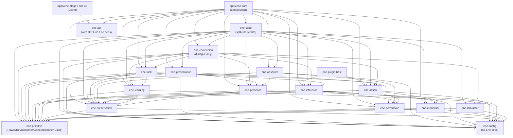

# Crate / Module 分解と依存方向の具体設計 — Step 13 Concrete Design

本書は Step 13 の Crate / Module 分解 artifact である。Step 11（Context Assembly, Action Execution, Targeted Deletion, Client Presence Transition, Backup / Restore）および Step 12（Subsystem Decomposition, 各 subsystem 詳細設計, State Ownership (SO), Dependency Rules (DR), Cross-cutting Design (CC), Runtime Topology, Runtime Flows, System Context）と Step 13 の `correspondence-identity.md`（CI）、`persistence-recovery.md`（PR）、`concurrency-control.md`（CCT）、`interface-boundaries.md`（IB）を**固定前提**とする。12 Subsystem の semantic ownership、identity / revision / generation / correlation / boundary token の型分離、`app.db` / `derived.db + sqlite-vec` / filesystem internal copies / OS credential store / external backup の役割分離、serialization domain / compare-before-commit / 短 transaction / 長時間処理の lock 外実行、caller ≠ authority / typed expected revision / generation / domain-specific acceptance / technical error 分離 / secret 非返却 / Host-local・remote-capable の区別を変更しない。変更が必要に見えた場合は設計で吸収せず Issue として報告する（第15節）。

製品挙動の source of truth は[要件 Baseline](../../requirements/README.md)、[製品定義](../../requirements/product.md)、[要件](../../requirements/requirements.md)とする。[受け入れ条件](../../requirements/acceptance.md)も検証範囲へ含め、[参考資料](../../requirements/references.md)は非規範として扱う。既存実装から製品挙動を補わない。

実装コードは変更しない。本書の Rust pseudo-type / module 名は提案であり、コンパイル対象ではない。型名・crate 名の同義改名は許すが、ownership 分離・依存方向・public boundary の意味は維持すること。

## 1. 対象と非対象・判断材料

### 1.1 今回具体化するもの

- workspace crate 一覧、各 crate の責務、主要 module、public / private boundary。
- crate 間 dependency（allowed / prohibited / adapter inversion / test dependency）。
- Host / Client / shared 配置、repository / adapter 配置、remote-facing type 配置。
- 新規実装が最終的に満たす workspace tree と依存制約。**実装の時系列は [`docs/implementation/README.md`](../../implementation/README.md) を正本**とし、本書は第4節の crate 一覧を先に空実装する順序を要求しない。旧 Repository との対応は、目標境界の由来を説明する**非規範の参考対応**としてのみ示し、旧 crate / module の copy・move・re-export shim・互換維持を実装要件にしない。
- 第12節の validation walkthrough による crate 依存だけでの実現可能性確認。

### 1.2 今回決めないもの

- 完全な `CREATE TABLE`、index、migration code、IPC wire byte 仕様、version negotiation、retry / timeout 値、scheduling / scoring algorithm、prompt 組立。
- 各 crate の完全な関数一覧、内部 helper の列挙。
- 暗号方式、archive 形式、署名方式。

### 1.3 分解基準（固定チェックリストではない）

crate を分けるか module に留めるかの材料として次を用いた。すべてを満たす必要はない。

- dependency direction（IB §16 の caller → owner を crate 依存の第一材料にする。owner が caller 内部を知る逆依存を作らない）。
- semantic cohesion（同じ semantic owner の lifecycle 群は同一 crate へ寄せるが、一つの state・trait・table・actor へ潰さない）。
- platform dependency（OS store / sandbox / wgpu / audio / tray を domain logic から隔離する）。
- process boundary（Host canonical と Client 一時利用の寿命差）。
- unsafe / native dependency（`sqlite-vec`、`seccomp`、`wgpu` 等を隔離する）。
- compilation isolation（重い native / UI 依存を葉へ追い出す）。
- feature dependency（voice / sqlite-vec / slint を feature / 別 crate へ閉じ込める）。
- testability（repository / provider / action / observer / credential の fake 差替え点）。
- independent replacement / adapter boundary（Provider protocol / MCP / Plugin / OS store の差替え）。
- Host / Client 共有可能性（Client が Host domain crate へ直接依存せずに済むか）。

## 2. 設計原則（固定 premise の crate 落とし込み）

1. **crate ≠ Subsystem ≠ semantic owner。** 複数 Subsystem が一つの crate に載っても ownership を統合しない。一つの Subsystem が複数 crate へ分かれても owner を分裂させない。各 crate の責務表（第4節）に owner を明示し、table group ごとに owner を注記する（PR §4 と同様）。
2. **型分離を潰さない。** `CompanionId` / `TaskId` / `TaskRevision` / `PresenceGeneration` / `RestoreGeneration` / `DeletionOperationId` / `DeletionSweepGeneration` 等は各 owner crate が定義する。内部表現が同じでも相互 `From` / 比較を設けない。`Revision(u64)` / `Generation(u64)` の共通内部形は `ene-primitive` の opaque 実装だけを共有し、semantic newtype を集めない。
3. **循環回避のための shared crate へ domain 型を集めない。** すべての domain ID を `ene-primitive` や `ene-api` へ移す設計は禁止する。cross-domain 参照は第5節の `RawId` + 用途別 premise による inversion で解決し、crate 依存を一方向に保つ。
4. **storage crate を semantic owner にしない。** `ene-store` は row mapping / SQL / migration / fs 配置 / orphan cleanup だけを持ち、revision bump 可否・採否・達成・許可・確定度の意味判断を持たない。repository trait は各 domain crate が定義し、`ene-store` が実装する方向に依存させる（第7節）。
5. **serialization domain を統合しない。** SD-Task / SD-Attempt / SD-Presence / SD-Cap / SD-CharApply / SD-Undelivered / SD-Deletion / SD-Restore / SD-RuleConsent / SD-CompanionLife（CCT §4）を一つの Runtime lock / global coordinator / universal actor へまとめない。`ene-store` の短 transaction は各 SD の不可分性を隠蔽するだけで、意味変更権を統合しない。
6. **caller ≠ authority を crate 依存で守る。** 呼べたことを確定にしない。`Ok` 側 domain outcome と `Err` 側 technical error を潰さない（IB §11）。`SecretValue` 型を public に返さない。`rusqlite::Transaction` を business layer へ露出させない。
7. **中央 orchestrator を作らない。** `ene-host-service` 的な万能 crate、`common` / `shared` / `utils` / `core` / `services` / `managers` / `models` 的な dumping ground、crate per entity / per table / per use case、内部 domain 用 plugin framework、service locator、全面 dynamic dispatch を導入しない。orchestration は caller 側の用途別 module（対話は Companion、作業は Task、全域 fan-out は Host composition + Preservation trait）に分散させる（第6節）。
8. **巨大 `ene-core` を composition root へ痩せさせる。** 旧 `apps/ene-core` の構造を維持すること自体を要件にしない。意味判断は各 owner crate、永続化は `ene-store`、外部 hosting は `ene-plugin-host`、wire DTO は `ene-api` へ置き、`ene-core` は wiring / lifecycle / storage init / route 配線だけに留める。
9. **旧実装は実装契約ではない。** `.old/` や旧 crate / module の名前・配置・actor / store / shutdown pattern は、設計判断の参考にはできるが、新規実装で保持・移植・re-export・互換 shim 化する理由にはしない。目標責務を直接実装し、旧構造との互換性のために依存方向・ownership・public boundary を歪めない。

## 3. 旧 Repository との参考対応（非規範）

以下は、旧 Repository に存在した責務が目標設計のどこに相当するかを説明する**参考表**である。旧 code を copy / move / split して実装する指示ではなく、旧 crate 名を残すこと、re-export shim を置くこと、旧 API / 挙動との互換性を保つことも要求しない。新規実装の source of truth は Requirements / Design と第4節以降の目標構成である。

| 旧 crate / app | 主な中身（参考） | 目標設計での対応 | 境界上の注意 |
|---|---|---|---|
| `ene-config` | config・schema・path 解決 | narrow な typed config / path 解決に相当 | domain state・secret・runtime 判断を持たせない |
| `ene-card` | Character card container（V3, PNG/CHARX import）・diff | `ene-character` の静的構成・revision・import/export の参考 | 適用関係（Companion）と分離する |
| `ene-companion` | soul / affect / memory(+scope) / inner / proactive / package / presence / store | 旧責務は `ene-companion` / `ene-learning` / `ene-character` / `ene-presence` / repository 境界へ分かれる | 旧 crate の split・module move 自体は要求しない |
| `ene-work` | delegation / jobs / schedules / skills / MCP / vision / learning / observe / task / store | `ene-task` / `ene-learning` / `ene-action` / `ene-observer` / `ene-store` の責務理解の参考 | 作業・学習・実行・観測を再び一つに集めない |
| `ene-kernel` | dialogue lane / context assembly / visibility / observability | 対話 orchestration は `ene-companion::dialogue`、用途別 context は各 owner、Audit は `ene-preservation` | **互換 shim・lane 移植を要求しない。** Context Assembly を中央 pipeline に戻さない |
| `ene-access-control` | approval / audit / vault | `ene-permission` / `ene-credential` / `ene-preservation` の境界の参考 | Permission・Credential・Audit を再統合しない |
| `ene-session` | event log / usage ledger / history projection + rusqlite | owner 別 repository + `ene-store` / derived の参考 | **re-export shim・旧 session store 維持を要求しない。** History・usage・projection を一つの正本にしない |
| `ene-tool-registry` | tool registry / builtins / pipeline / deny-by-default | `ene-action` の adapter / extension 境界の参考 | 旧 registry crate の保持を要求せず、目標 adapter 境界を直接実装する |
| `ene-body` | performance queue / emotion mapping / duplex voice | `ene-presentation` + Client adapter、内的意味は `ene-learning` の参考 | 旧 queue / voice pattern の移植を要求しない |
| `ene-api` | HTTP/WS API types・OpenAPI・typed client | narrow な wire DTO crate の参考 | Host domain 依存・secret・durable row を露出させない |
| `ene-plugin-ipc` | length-prefixed MessagePack frames | transport 表現の adapter 候補 | domain 意味を持たせない |
| `ene-plugin-host` | process supervision / host-context / broker grants | 外部 code hosting adapter の参考 | 推論解決・Action 認可の意味を持たせない |
| `ene-provider-assets` | catalog / manifest / download helpers | catalog / manifest helper の参考 | 割当同意・送信可否の意味を持たせない |
| `ene-sandbox` | Landlock + seccomp + Job Object | OS 隔離 adapter の参考 | domain 意味を持たせない |
| `ene-vrm` | VRM 1.0 renderer (wgpu) | Client renderer adapter の参考 | 適用関係・経験状態・権限を持たせない |
| `ene-stage-ui` / `ene-tray-linux` | Slint bindings / ksni tray | Client UI / tray adapter の参考 | domain 意味を持たせない |
| `ene-stage-poc` | PoC stage | 目標 product Client には含めない | 旧 PoC の互換維持を要求しない |
| `apps/ene-core` | Host process（session store・lane・lock・HTTP/WS） | `apps/ene-core` composition root の責務検討材料 | 旧全依存・旧 runtime pattern を維持しない |
| `apps/ene-desktop` | frozen desktop client | 目標新規実装の product Client ではない | 新規設計の互換対象にしない |
| `apps/ene-stage` / `apps/ene-ctl` | product stage client / CLI client | Client composition の参考 | `ene-api` DTO 経由で Host authority と分離する |

## 4. 目標 workspace 構成

### 4.1 Workspace tree 例

以下は**最終目標の構成例**であり、旧 crate の互換 shim を含めない。**これは stage completion checklist や全 crate 先行作成の指示ではない。** 実際の実装では実装ガイドの vertical slice を優先し、その slice で必要になった boundary から第4・10節の責務と依存方向を満たす形で追加する。

```text
Cargo.toml  # members = ["crates/*", "apps/*", "plugins/tool/*", "plugins/provider/*"]
crates/
  ene-primitive/        # opaque RawId / RevisionInner / GenerationInner / WallClockWithTz（tiny）
  ene-config/           # typed config・path・schema
  ene-character/        # 静的構成・revision・import/export・provenance
  ene-companion/        # 同一性・対話調整・未伝達・自発性・適用関係（I-1〜I-7）
  ene-task/             # Task・委任・Schedule・WorkspaceAssoc・TaskContext（W-1〜W-7）
  ene-learning/         # Summary・Memory・Skill・Relationship・State・scope 意味（L-1〜L-8）
  ene-presence/         # 接続事実・帰属・hint/復旧先・切替（CN-1〜CN-7）
  ene-presentation/     # Host: round 実際・Body/Voice staging・一般設定・管理面・MCP Apps UI（IO-1〜IO-8）
  ene-observer/         # 対象・時機・Capture・候補・routing 派生（OB-1〜OB-7）
  ene-permission/       # Rule・同意・cap・device・sandbox 例外・control constraint・live check（C-1〜C-8）
  ene-credential/       # 秘密登録・照合・認証用途供給・backup 除外（S-1〜S-5）+ OS store 抽象
  ene-inference/        # 登録・能力観測・割当解決・per-use 送信・fallback・利用量原記録（I-1〜I-7）
  ene-action/           # 作用・確定度・拡張受入・Client 限定（E-1〜E-6）+ adapter/repository trait
  ene-preservation/     # 保持・Backup/Restore/Reset・Audit/Debug・全域調整（PE-1〜PE-7）
  ene-store/            # app.db + derived.db + internal_copies 実装（D1/D2/D3/R/T の機構のみ）
  ene-api/              # Host↔Client wire-neutral DTO（remote-capable のみ）
  ene-plugin-ipc/       # transport frames
  ene-plugin-host/      # 外部 code hosting adapter（inference/action trait 実装）
  ene-provider-assets/  # catalog/manifest/download helper
  ene-sandbox/          # OS 隔離
  ene-vrm/              # Client renderer adapter
  ene-stage-ui/         # Client Slint bindings
  ene-tray-linux/       # Client tray adapter
apps/
  ene-core/             # Host composition root（wiring/lifecycle/storage init/route）
  ene-stage/            # product Client（ene-api 経由）
  ene-ctl/              # CLI Client（ene-api 経由）
plugins/tool/*, plugins/provider/*  # 外部拡張（ene-plugin-host 経由でのみ参加）
```

上記粒度は navigation・compile boundary・ownership 追跡・循環防止・test 容易性を優先したものであり、crate 数の最小化・最大分離自体を目標にしない。`ene-presentation` / `ene-observer` を `ene-presence` へ畳まないのは、帰属（Companion 単位排他）・round 実際（入出力）・観測対象（Client 単位共有）の制御単位・lifecycle が異なり、一つの state・boolean・actor へ潰すと X-1〜X-10 の契約が失われるためである。`ene-permission` / `ene-credential` を分けるのは、説明・context に載せてよい情報と秘密値の保護・失効・backup 除外の契約が異なり（DR-05）、同一 crate では非露出を強制できないためである。`ene-inference` / `ene-action` を分けるのは、推論失敗と外部作用不明の再試行・確定度・replay 契約が異なり（CCT §6・§8）、統合すると不明の自動再実行が生まれるためである。

### 4.2 Crate 責務・主要 module・public boundary

凡例：`pub` = workspace 公開、`priv` = crate 内限定。`Transaction` / `SecretValue` / 生 SQL はいずれも `pub` にしない。

| crate | owner / 役割 | 主要 module（logical boundary。初期は module 開始可） | pub boundary（公開するもの） / 公開しないもの |
|---|---|---|---|
| `ene-primitive` | 全 crate の性質共有（opaque・単調・有向・比較の形）。semantic owner ではない | `raw_id`（`RawId`: UUID 互換 128bit opaque）、`revision`（`RevisionInner(u64)` + 単調 helper）、`generation`（`GenerationInner(u64)`）、`clock`（`WallClockWithTz`: wall-clock + 作成時 tz。revision 代替にしない）、`correlation`（有向 pair の形だけ。domain 別 struct は各 owner が定義） | pub: 上記 5 module の型・helper のみ。非公開・禁止: `CompanionId` 等の domain newtype、domain logic、wire DTO、DB・IPC・OS 依存。`uuid`・`chrono` 以外の重依存を持たない |
| `ene-config` | 起動・path・schema の意味（一般設定の各値は各 owner。Host 自動起動の選択は `ene-presentation`） | `typed`（typed config struct）、`paths`（OS account 領域・data dir 解決）、`schema`（schemars 生成） | pub: typed config・path 解決・schema のみ。禁止: domain state、secret 値、runtime 判断、repository |
| `ene-character` | Character（静的構成・revision・import/export・provenance。CH-1〜CH-7、CD-1〜CD-7、C-A/C-C/C-D） | `identity`（`CharacterId`・静的定義）、`revision`（`CharacterRevision`・差分提示）、`import`（validation・provenance。実行許可にしない）、`export`（静的範囲選択・権利注意）、`supply`（適用供給。適用確定は Companion） | pub: `CharacterId`・`CharacterRevision`・`GetCharacterRevisionQuery`・`CharacterRevisionView`・`ValidatePackageQuery`・`PackageValidationReport`・`ExportCharacterCommand`。priv: archive 展開・diff algorithm 詳細。禁止: 適用関係（Companion）、学習意味（Learning）、許可・秘密・作用の確定 |
| `ene-companion` | 個体調整（同一性・対話・未伝達・自発性・適用関係。I-1〜I-7、H-A caller、H-B/C caller、H-F 仲介、H-G owner、X-A caller） | `lifecycle`（`CompanionId`・Running/Stopped/Deleted tombstone 最小）、`applied`（適用関係正本 + `CharacterApplicationRepository` trait 利用）、`dialogue`（対話 orchestration。Task/Learning/Inference への caller 依存をここに閉じ込める）、`history`（History・活動記録の意味。row は `ene-store`）、`undelivered`（`UndeliveredRef`・報告状況。提示事実は Presentation）、`spontaneity`（個体別抑制・loop 抑制） | pub: `CompanionId`・`ProposeTaskCommand`・`ProposeSteeringCommand`・`ProposeExperienceCandidate`・`RegisterUndeliveredFact`・`RequestMoveCommand`（caller 側）・各 domain outcome（`TaskProposalOutcome` 等の再掲ではなく自 crate の要求型）。priv: LLM prompt・要約・scoring。禁止: Task 達成確定（Task）、形成意味（Learning）、帰属成立（Presence）、秘密値、SQL |
| `ene-task` | 作業（Task・委任・Schedule・Workspace・TaskContext。W-1〜W-7、H-A owner、H-H owner） | `task`（`TaskId`・`TaskRevision`・`TaskRef`・steering forward）、`delegation`（`DelegationId`・ephemeral Agent・scope 写し）、`schedule`（設定・occurrence・各回 Task）、`workspace`（関連付け・保存先確認・中間整理）、`context`（TaskContextEntry。本文複製しない）、`orchestrate`（委任・steering・結果受入の SD-Task 順序付け） | pub: `TaskId`・`TaskRevision`・`TaskRef`・`CreateDelegationCommand`・`TaskAgentResultArrival`・`TaskRepository` trait・`TaskCommitOutcome`・`DelegationOutcome`。priv: 分割・並列機構・harness 詳細。禁止: 会話意味（Companion）、学習意味（Learning）、作用確定度（Action）、許可確定（Permission） |
| `ene-learning` | 認識・学習（Summary・Memory・Skill・Relationship・State・scope 意味。L-1〜L-8、H-B/C/D/E owner、H-F source） | `summary`（圧縮 evidence・`SummaryGroundsRef`）、`memory`（現在・過去 revision・重要度・scope）、`skill`（有効 revision・原本対応・復帰）、`relationship`（主体別解釈）、`companion_state`（一時/持続・経過時間解釈）、`scope`（意味判断。強制は Permission + 各利用箇所） | pub: `LearningId`・`LearningRevision`・`ProposeExperienceCandidate` 受入側・`FormationDecision`・`CorrectionOutcome`・`ScopeDecision`・`LearningRepository` trait。priv: 検索・要約・scoring・減衰式。禁止: History 所有（Companion）、Task 所有（Task）、強制所有（Permission） |
| `ene-presence` | 接続・存在（接続事実・帰属・hint/復旧先・切替。CN-1〜CN-7、X-A owner） | `connection`（識別・最終接続・現接続・可用性）、`attribution`（`PresenceAttribution`・`PresenceGeneration`・SD-Presence CAS）、`hint`（`RelocationHint`・復旧先。presence にしない）、`transition`（旧→移行中→新。live 到達性は DB 外） | pub: `ClientId`・`PresenceGeneration`・`PresenceAttributionFact`・`PresenceRepository` trait・`MoveDecision`。priv: 切断検知・調停 mechanism。禁止: 移動必要性（Companion）、pairing/device 意味（Permission）、round 実際（Presentation） |
| `ene-presentation` | 入出力・提示 Host 側（round 実際・staging・一般設定・管理面・MCP Apps UI。IO-1〜IO-8、X-B/X-C/X-H、H-G/H-H の提示側） | `round`（受付・提示・区切り。timeline 終了にしない）、`body_voice`（staging・縮退・Mute/keyboard 経路。内的状態の正本にしない）、`settings`（UI 言語・Body 位置・Voice 一般・Host 自動起動選択）、`management`（Setup・管理経路。各 owner の受理に従う）、`mcp_apps`（外部 Tool UI の一時扱い。Control plane にしない） | pub: `RoundId`・`SubmitClientInputCandidate` 受入側・`RoundClosureFact`・`ConfirmPresentationObservation`・`UndeliveredSummaryFact`。priv: 描画・音声処理・layout。禁止: 会話意味（Companion）、帰属成立（Presence）、Task 達成・許可・作用の確定 |
| `ene-observer` | 共有観測（対象・時機・Capture・候補・routing 派生。OB-1〜OB-7、X-D/X-E） | `eligibility`（対象・時機。Stopped 除外・Pause/OFF・fullscreen・cap）、`capture`（Client 単位共有・時機ずらし。adapter は trait）、`routing`（専用 assignment 前提・関連 Companion のみ・派生性維持）、`explain`（状態・範囲・Learning 利用の説明。Raw 非保存） | pub: `ObservationCandidateId`・`PublishObservationCandidate`・`RoutingDecision`・`DeliverEventNotification`・Capture adapter trait。priv: scoring・選択 algorithm・cadence。禁止: 個体意味判断（Companion）、最終 Action（Task/Action）、同意確定（Permission） |
| `ene-permission` | 権限・制約（Rule・同意・cap・device・sandbox 例外・control constraint・live check。C-1〜C-8、K-A/K-B/K-D/K-F/K-G） | `rule`（`RuleId`・`RuleRevision`・解釈・Undo）、`consent`（割当同意・fallback 順序・Observer 専用）、`cap`（SD-Cap 予約/commit/release）、`device`（許可・失効）、`sandbox_exception`（特定 Local MCP 例外。Plugin 流用禁止）、`check`（live authorization。保存 Allow 再利用禁止） | pub: `RuleId`・`RuleRevision`・`CheckLiveAuthorizationQuery`・`LiveAuthorizationDecision`・`ReserveUsageCommand`・`UsageRepository` の可否側・`PermissionEvaluationId`。priv: evaluator algorithm。禁止: 学習意味（Learning）、秘密値（Credential）、作用確定度（Action）、Task 達成（Task） |
| `ene-credential` | 認証秘密（登録・照合・認証用途供給・backup 除外。S-1〜S-5、K-C） | `registry`（`CredentialRef` 非秘密・用途・有効性）、`use`（限定利用供給。`with_credential` 的な値非返却）、`notify`（失敗・失効・再認証。秘密なし）、`store`（OS 抽象：DPAPI/libsecret/Keychain。`cfg` 隔離） | pub: `CredentialRef`・`RequestAuthenticatedUseCommand`・`AuthenticatedUseOutcome`・OS store trait。禁止: 秘密値の `pub` 返却（`SecretValue` は priv）、model context・log・Audit・backup への露出、同意・許可の確定 |
| `ene-inference` | 推論利用（登録・能力観測・割当解決・per-use 送信・fallback・利用量原記録。I-1〜I-7、K-D/E/F） | `registry`（非秘密登録・能力観測）、`resolve`（Host 既定→override→継承・Observer 専用。解決済み経路は派生）、`send`（per-use 成立・同意・費用・保留照合）、`fallback`（承認順序のみ）、`usage`（報告/推定/不明/処理中。cap 可否は Permission） | pub: `ResolveAssignmentQuery`・`RequestInferenceCommand`・`InferenceUseOutcome`・`InferenceResultArrival`・Provider transport trait。priv: prompt 組立・圧縮・cache。禁止: 意味確定（利用元）、同意確定（Permission）、秘密所有（Credential） |
| `ene-action` | 実行・拡張（作用・確定度・拡張受入・Client 限定。E-1〜E-6、K-H/I/J） | `candidate`（`ActionCandidate`。構築＝許可にしない）、`execute`（開始前 atomic compare・`RealTargetRef` 解決）、`effect`（`ActionAttemptId`・`ActionCertainty`・per-attempt CAS）、`extension`（MCP/Plugin/MCP Apps 受入・sandbox 適用）、`client_bound`（現在 active 限定・device 許可連言）、`adapters`（OS・device・MCP 境界。具体実装は `ene-plugin-host` / Client adapter / narrow platform module） | pub: `ActionAttemptId`・`ActionCandidate`・`ExecuteActionCommand`・`ActionStartOutcome`・`ReportEffectFact`・`ActionAttemptRepository` trait・OS/device/MCP adapter trait。priv: 実対象解決の詳細・shell 実行詳細。禁止: 許可確定（Permission）、Task 達成（Task）、秘密値 |
| `ene-preservation` | 保全・消去（保持・Backup/Restore/Reset・Audit/Debug・全域調整。PE-1〜PE-7、D-A〜D-E、DP-0〜DP-8） | `retention`（保持・opt-in cleanup。既定 OFF）、`backup`（対象時点・参照・除外・未完了対応）、`restore`（staging・switch・保留・一括有効化）、`deletion`（範囲確定・`ErasureConditionRef`・残存検証・全域完了）、`reset`（Settings/FullData 区別）、`audit`（追記順・保持。本文別保管庫にしない）、`debug`（明示・短期・停止・削除）、`coordination`（`ErasureParticipant` trait・完了集約。任意編集権を持たない） | pub: `DeletionOperationId`・`DeletionSweepGeneration`・`BackupPointId`・`RestoreGeneration`・`DemandLocalErasureCommand`・`ParticipantCompletionFact`・`PreservationRepository` trait。priv: 探索・検証実装・archive 形式。禁止: 各 domain の意味変更、秘密値取得、外部所有物管理 |
| `ene-store` | 機構のみ（PR Group A〜K の D1/D2/D3 + R/T の保持。semantic owner ではない） | `sqlite`（`app.db` owner 別 group。`Immediate` 短 transaction のみ。await なし）、`derived`（`derived.db` + sqlite-vec。feature 隔離。再構築可能）、`fs`（`internal_copies/` + `*.ene-backup` staging。temp→fsync→publication guard→rename→pointer commit→guard release→orphan cleanup）、`migrate`（schema version・migration。前方のみ。downgrade 保証しない） | pub: 各 group の row 型への mapping 関数・`new`/`open`・cleanup のみ。`Transaction` を pub にしない。各 domain の `*Repository` trait 実装（`ene-store` が各 domain に依存する方向）。cleanup は live 参照も active publication もないことを削除直前に同じ同期境界で再確認する。禁止: 採否・達成・許可・確定度の判断、revision bump 可否の決定、秘密値の保持、derived からの正本復活 |
| `ene-api` | Host↔Client wire-neutral DTO（remote-capable のみ。IB §15） | `round`（`SubmitClientInputCandidate` wire 形・`RoundClosureFact`・`ConfirmPresentationObservation`）、`presence`（`RequestMoveCommand` wire 形・`PresenceAttributionFact` wire 形）、`undelivered`（`UndeliveredSummaryFact` wire 形）、`character_asset`（表示資材参照のみ）、`management`（`ManagementOperationCommand` wire 形）、`erasure_client`（Client 一時参加分） | pub: serde DTO のみ。`ene-companion`/`ene-task` 等への依存禁止。Host 内部 newtype・secret・durable row を露出させない。内部正本の主 key として再利用できる形で渡さない |
| `ene-plugin-ipc`/`ene-plugin-host`/`ene-provider-assets`/`ene-sandbox` | transport / hosting / catalog / 隔離（外部境界） | 必要な最小 adapter 実装（第8節） | pub: transport・hosting・catalog・隔離 API のみ。domain 意味を持たせない |
| `ene-vrm`/`ene-stage-ui`/`ene-tray-linux` | Client adapter（renderer / UI bindings / tray） | Client 必要範囲 | pub: adapter API のみ。domain 正本・権限を持たせない |

`pub(crate)` を既定とし、`pub` は上表の型・command・outcome・trait に限定する。`allow_attributes` の workspace 規約に従い、例外は narrow な `#[expect]` のみとする。`unsafe` は必要な OS / native adapter の狭い境界に閉じ込め、各 `unsafe` ブロックに `// SAFETY:` を付す（AGENTS.md）。

## 5. Core domain types の配置（巨大 common を作らない）

### 5.1 `ene-primitive` に入るもの・入らないもの

入るもの（本当に小さい primitive のみ）：`RawId`（128bit opaque。衝突回避・再利用禁止・推測不能の性質のみ）、`RevisionInner` / `GenerationInner`（`u64` 単調 helper。単独で持ち歩かない）、`WallClockWithTz`（wall-clock + 作成時 tz。revision 代替にしない）、有向 pair の形（`{from_raw, to_raw, purpose}` の shape のみ。本文複製しない）。

入らないもの：`CompanionId`・`TaskId`・`ActionAttemptId`・`ClientId`・`RoundId`・`LearningId`・`CharacterId`・`RuleId`・`CredentialRef`・`DeletionOperationId`・`BackupPointId` 等の domain newtype、`TaskRevision`・`PresenceGeneration`・`RestoreGeneration`・`DeletionSweepGeneration` 等の lifecycle 別 revision / generation、`UndeliveredRef`・`DelegationRef`・`RoutingContextRef`・`SummaryGroundsRef` 等の correlation struct、wire DTO、DB row、OS 依存。理由：primitive を巨大化させると ownership 追跡・compile boundary・Host/Client 分離が崩れるためである。

### 5.2 Domain 固有型の owner 別配置

| 型 | owner crate | 備考（分離の理由） |
|---|---|---|
| `CompanionId`・`CompanionCharacterApplication`・`UndeliveredRef`・`ConversationRound`（対応側） | `ene-companion` | 適用関係・未伝達の正本は個体調整。Character 内容・Task 記録とは別 lifecycle |
| `TaskId`・`TaskRevision`・`TaskRef`・`DelegationId`・`DelegationRef`・`WorkspaceAssocId`・`ScheduleId`・`ScheduleOccurrenceId` | `ene-task` | Task・委任・Schedule・関連付けを一つの state へ潰さない。担当削除で Task 記録を消さない |
| `LearningId`・`LearningRevision`・`SummaryId`・`SummaryGroundsRef`・`SourceRangeRef` | `ene-learning` | Memory・Skill・Relationship・State・Summary を一つの canonical / schema / revision へ潰さない。各概念で別 module とする |
| `CharacterId`・`CharacterRevision`・`CharacterPart`・`AppliedPart`（供給側） | `ene-character` | 内容の正本は Character、適用関係の正本は Companion。二重編集しない |
| `ActionAttemptId`・`ActionAttemptRef`・`ActionCertainty`・`PermissionEvaluationId`・`PermissionEvaluationRef` | `ene-action`（attempt・certainty）、`ene-permission`（evaluation の意味。attempt と混同しない） | 試行・判断記録・Task 達成を同一視しない。retry は新 `AttemptId` とする |
| `RuleId`・`RuleRevision`・`AssignmentConsentId`・`CapId`・`ReservationId`・`CurrentPermissionBoundary`（照合材料） | `ene-permission` | 保存 Allow・委任時 copy・事前判定・復元 Rule・文脈内許可文・cache 判定を生きた許可にしない |
| `CredentialRef`（非秘密） | `ene-credential` | 秘密値本体（E）は OS store 側。`SecretValue` を pub にしない。参照を持つことは利用可能ではない |
| `ClientId`・`RoundId`・`PresenceGeneration`・`PresenceAttribution`・`ClientPresenceClaim`・`RelocationHint` | `ene-presence`（帰属・世代）、`ene-presentation`（round 実際。authority は分離） | presence・Host 継続・接続・許可を分離する。Client 主張を authority にしない |
| `ObservationCandidateId`・`RoutingContextRef`（派生） | `ene-observer` | 新正本・新 scope・包括共有にしない。元 owner の制約と専用 assignment 同意を変換後も適用する |
| `DeletionOperationId`・`DeletionSweepGeneration`・`DeletionOperationRef`・`ErasureConditionRef`・`BackupPointId`・`RestoreGeneration`・`RestoreRef`・`HoldConditionRef` | `ene-preservation` | `DeletionOperationRef` の完了は全域確定であり、各 domain の意味変更は各 owner が行う。検索 token は操作期間のみ保持し、除去・復元不能化を確認してから全域完了を確定する |

### 5.3 循環回避のための inversion（重要）

Samsara を避けるため、cross-domain 参照は次の inversion で解決する。複数 domain 型を一つの shared crate へ移すだけの設計は採らない。

- 各 owner crate は他 owner crate の domain newtype に依存しない。必要な相手情報は `RawId` + `u64`（revision / generation 値）+ 用途・scope・provenance の premise struct（自 crate 定義）として受け取る。例：`ene-action::AttemptCommitPremise { expected_task: Option<TaskPremise { task: RawId, revision: u64 }>, ... }` は `ene-task::TaskRef` に依存しない。
- `RawId` ↔ domain newtype の mapping は orchestration 層（caller 側の `dialogue` / `orchestrate` module + Host composition `apps/ene-core`）だけが行う。`From<CompanionId> for AssigneeRef` 等の domain 間 `From` を設けない。field 名と型で区別し、接頭辞判別を照合 logic に使わない（CI §4.1）。
- 逆向きの参照依存（例：Permission が Task 委任範囲・推論消費事実を読む、Learning が History・Task 事実を読む、Preservation が各 holder の source 関係を読む）は、owner が caller 内部を知る依存ではなく、caller が premise として供給する形で満たす。DR-12 の双方向は意味上の必要性であり、crate 依存の双方向にしない。
- `ErasureParticipant` 等の横断 trait は `ene-preservation` が定義し、各 participant crate が実装する方向（participant → preservation）に依存させる。`ene-preservation` は participant 具体 crate に依存しない。fan-out 呼出しは Host composition が行う（第6・7節）。

## 6. Domain logic vs orchestration

DDD を機械適用しない。依存方向と変更理由で分ける。

- pure domain logic（不変条件・採否・確定度・scope 意味・世代対応）は各 owner crate の `logic` / `policy` module に置く。`trait` 化しない。例：Task steering の目的区別、Learning の保存価値・訂正種別、Presence の二重 active 禁止、Permission の再評価要否、Action の実対象解決。
- state transition / acceptance（SD 単位の compare・forward・CAS）は各 owner crate の `transition` / `commit` module に置き、`*Repository` trait 経由で durable 化する。DB transaction を business が保持しない（IB §13）。
- orchestration（複数 owner の premise 収集・順序付け・遅延帰属・未伝達接続）は caller 側に分散させる。対話 orchestration は `ene-companion::dialogue`、作業 orchestration は `ene-task::orchestrate`、観測 routing は `ene-observer::routing`（Host 供給の context を受ける形）、全域 fan-out は Host composition + `ene-preservation::coordination` が行う。万能 mediator を新設しない。
- repository access（trait 定義）は各 domain crate、implementation は `ene-store`（第7節）。business から `rusqlite::Transaction` を漏らさない。
- external adapter（transport・OS・device・MCP）は `ene-plugin-host` / `ene-action::adapters` / Client app module に置き、domain が adapter 具体に依存しない方向（adapter → domain trait 実装）に反転させる（第8節）。旧 adapter crate の存在を新規実装の前提にしない。

中央 orchestrator にならないことの担保：`ene-companion` は対話用途の Task/Learning/Inference/Action/Presence 呼びに限定し（`dialogue` module に隔離。軽微応答・軽微本体のみ直接。削除・Backup/Restore・予約・adapter 選択を知らない）、`ene-task` は作業用途の Action/Inference/Learning 呼びに限定し、帰属切替・観測 routing・表示を知らない。`ene-preservation` は完了集約・hold・token 最終消去・全域完了確定に限定し、対話・作業の意味を知らない。`apps/ene-core` は wiring・lifecycle・storage init・route 配線に限定し、採否・達成・許可・確定度を決めない。各 crate の禁止事項は第4.2節の表に従う。

## 7. Persistence 配置

### 7.1 Repository trait / implementation / schema / migration

| 関心 | 配置 | 依存方向 |
|---|---|---|
| domain-facing repository contract（`TaskRepository`・`ActionAttemptRepository`・`PresenceRepository`・`UsageRepository`・`LearningRepository`・`CharacterApplicationRepository`・`PreservationRepository`・`UndeliveredRepository`。IB §13） | 各 owner crate（`ene-task`・`ene-action`・`ene-presence`・`ene-permission`・`ene-learning`・`ene-character`+`ene-companion`・`ene-preservation`・`ene-companion`） | owner crate は `ene-store` に依存しない。戻り値は domain outcome（`Committed` / `StaleExpected` / `HeldByOperation`）であり row count ではない |
| SQLite implementation（`app.db` owner 別 group A〜K。短 `Immediate` transaction のみ。await なし。PR §4・§7 の AU 対応） | `ene-store::sqlite` | `ene-store` → 各 owner crate（row mapping のため）。逆（owner → store）は禁止。cross-owner 更新を一つの巨大 transaction へまとめない。必要な短 cross-owner atomic read のみ共有する |
| derived search implementation（`derived.db` + sqlite-vec。embedding / index / score。R） | `ene-store::derived`（feature `sqlite-vec` 隔離） | `ene-store` 内部。primary 破壊なしに削除・再構築できる。primary の backup に含めない。古派生から権限・状態を復活させない |
| filesystem copy implementation（`internal_copies/` blob・`*.ene-backup` staging。temp→fsync→publication guard→rename→pointer commit→guard release→orphan cleanup。CCT §13） | `ene-store::fs` | `ene-store` 内部。DB 指標先行の可視中間を作らない。cleanup は live DB / backup / restore 参照と active publication の両方がないことを同じ同期境界で削除直前に再確認する。rename 後・pointer commit 前の publish 中 file を orphan と誤認して削除しない |
| schema / migration | `ene-store::migrate` | 前方 migration のみ。対応 upgrade 前に backup 確認。downgrade 保証しない。storage 共有は ownership 統合ではない |
| credential secret 本体（E） | `ene-credential::store`（OS 抽象） | DB / Backup / Audit / log / Debug へ流さない。`ene-store` に置かない |
| Client 接続材料の秘密部分・Host device-auth record | `ene-credential` の用途分離 store（E）＋ `ene-presence` の非秘密参照。trust / 機能許可・失効の意味は `ene-permission`（SO §8、PR Group K） | Host 検証材料は非秘密でも backup 除外・Restore 維持。失効時に E 側材料を無効化・削除し、Full Reset では trust も削除する。現在 trust 範囲を復元 DB 許可で広げない。既存 premise / Host 媒介で適用し、具体 crate 間の依存を追加しない |

business/domain layer から `rusqlite::Transaction`・生 SQL・`sqlite-vec`・fsync・rename を漏らさない。repository method が内部で短 transaction を行い、compare と durable 更新を不可分にする。transaction 内で await・外部 I/O を行わない。filesystem publication guard は DB transaction の代替ではなく、publish と cleanup の競合だけを狭く同期する。

### 7.2 Table group と crate の対応（抜粋）

PR §4 の Group A〜K に対応する。storage 上で近くても owner は統合しない。

| group | owner crate（意味） | `ene-store` module（機構） |
|---|---|---|
| A Character | `ene-character` | `sqlite::character` |
| B Companion/History/undelivered（round 実際は Presentation） | `ene-companion` + `ene-presentation` | `sqlite::companion` |
| C Learning | `ene-learning` | `sqlite::learning` + `derived`（embedding/index） |
| D Task/委任/context/Workspace/Schedule | `ene-task` | `sqlite::task` + `fs`（internal copy blob） |
| E Action attempt | `ene-action` | `sqlite::action` |
| F 権限・利用量（原記録は各利用 owner） | `ene-permission`（可否）+ 各利用 owner（原記録） | `sqlite::permission` + `sqlite::usage` |
| G 接続・帰属 | `ene-presence` | `sqlite::presence` |
| H 入出力・提示 / 観測設定 | `ene-presentation` / `ene-observer` | `sqlite::io_observer` |
| I Provider 登録・観測 | `ene-inference`（登録・観測）+ `ene-permission`（同意） | `sqlite::provider` |
| J 保全・消去（操作・backup・audit・debug） | `ene-preservation` | `sqlite::preservation` + `fs`（backup file） |
| K Credential 参照（非秘密） | `ene-credential` | `sqlite::credential_ref`（秘密なし）。秘密本体は OS store |

## 8. Provider / MCP / Plugin / OS 境界

SDK 選定より依存方向を固定する。trait を置く crate と実装 crate を分け、adapter ごとに過剰な crate を増やさない。

| 境界 | trait を置く crate（domain 側） | 実装 crate（adapter 側） | 依存方向・約束 |
|---|---|---|---|
| LLM Provider transport（既知 protocol 直接・未対応 protocol の Plugin 補完） | `ene-inference`（`ProviderTransport` trait。論理 context 選択・prompt 組立は trait にしない） | `ene-plugin-host` + `plugins/provider/*` + `ene-provider-assets`（catalog/helper） | adapter → domain（実装が trait を実装）。domain → adapter 禁止。解決済み経路を authority にしない。Prompt cache・session は最適化に限る |
| Credential store（DPAPI / libsecret / Keychain 抽象） | `ene-credential`（`CredentialStore` trait） | `ene-credential::store` の `cfg` 別 module（OS 実装） | domain logic → trait のみ。秘密値を通常経路に載せない。`get_secret() -> String` 的な汎用取得を設けない |
| MCP（Tool/Resource/Prompt。Local 既定 sandbox・特定例外・Remote） | `ene-action`（`McpAdapter`・`ExtensionUse` trait。受入・制限の意味） | `ene-plugin-host` + `ene-action::adapters` + `plugins/tool/*`。sandbox 適用は `ene-sandbox` | adapter → domain。外部 code・結果を信頼済み control にしない。隔離の黙解除をしない。例外を Plugin へ流用しない |
| Plugin（限定拡張点：未対応 protocol / Observer adapter / Body renderer 等） | 各機能 owner（`ene-inference`・`ene-observer`・`ene-presentation`/`ene-vrm` が拡張点型を定義） | `ene-plugin-host`（hosting・supervision・`ene-sandbox` 適用・`ene-plugin-ipc` transport） | adapter → domain。任意 Core 改変・Control plane 変更・Permission 回避・恒久 UI 置換を許さない。Local MCP 例外を流用しない |
| Computer Use / OS integration（filesystem・shell・device・外部 account） | `ene-action`（`OsActionAdapter`・`DeviceAdapter` trait。実対象解決・確定度は domain） | `ene-action::adapters`（thin）+ `ene-plugin-host`（外部 process）+ Client app の device module。隔離は `ene-sandbox` | adapter → domain。path traversal・link・mount の境界外を拒否する。Deny の迂回（別経路・別表現）を許さない。確認不能作用は不明とする |
| Client device（capture・audio・VAD・描画・通知） | `ene-presentation`（`CaptureAdapter`・`AudioAdapter`・`RenderAdapter` の Host 側 trait は最小限）・`ene-observer`（`CaptureAdapter`） | `apps/ene-stage`・`apps/ene-ctl` 内 module + `ene-vrm` + `ene-stage-ui` + OS crates（xcap/pipewire/cpal/rodio/tray） | Client adapter → Host trait 実装ではなく、Host は DTO（`ene-api`）で受け、Client は DTO を送る。Client を正本・owner にしない。全 payload の Host 中継は固定しないが、制約・秘密非露出・一時保護を満たせない経路は使わない |
| audio / Body / observation capture | 同上 | 同上 + `ene-sandbox`（該当範囲） | Raw・候補・routing 用 data を通常保存しない。候補を Learning 正本にしない。画面内指示を Owner 依頼にしない |
| filesystem external action（Workspace 実体・成果物・export/backup 出力） | `ene-task`（関連付け）・`ene-character`（export 範囲）・`ene-preservation`（backup 出力範囲）の各意味 | `ene-action`（作用）+ `ene-store::fs`（内部 copy） | 関連付け削除の外部 cascade をしない。外部実体を backup 収集しない。成果物を専用 library へ複製しない |

`ene-sandbox` はいずれの domain 意味も持たず、適用可否の意味（Permission の sandbox 例外）と適用結果（Action の作用）は各 owner に残る。`ene-plugin-ipc` は transport 表現だけを持ち、意味を持たない。

## 9. Host / Client / shared 配置

Client が Host domain crate へ直接依存して canonical mutation API を利用できる構造にしない。共有できる型まで複製しない。

| crate | Host | Client | shared（両用 utility） | 備考 |
|---|---|---|---|---|
| `ene-primitive` | ● | ● | ●（opaque・単調・clock のみ） | Host/Client 双方で利用可能な唯一の共有 domain 基盤。domain 型を含まない |
| `ene-config` | ● | ●（path・locale のみ） | — | secret・domain state を含まない |
| `ene-character`・`ene-companion`・`ene-task`・`ene-learning`・`ene-presence`・`ene-permission`・`ene-credential`・`ene-inference`・`ene-action`・`ene-preservation`・`ene-observer`・`ene-presentation`（Host 側） | ●（authority・repository trait・SD 順序付け） | —（直接依存禁止） | — | Client は `ene-api` DTO 経由でのみ利用する。Client から `CompanionId` 等の内部 newtype を主 key として再利用させない |
| `ene-store`（sqlite/derived/fs/migrate） | ●（Host のみ） | — | — | DB transaction を Client・Provider・MCP へ露出させない。`derived.db` を backup に含めない |
| `ene-api` | ●（serve・mapping） | ●（DTO・typed client） | ●（wire-neutral request/result のみ） | 秘密・内部 newtype・durable row を含まない。ID は用途限定参照として露出させる |
| `ene-plugin-ipc` | ● | —（Plugin が Client 側配置の場合のみ該当 adapter が利用） | transport のみ | 意味を持たせない |
| `ene-plugin-host`・`ene-provider-assets`・`ene-sandbox` | ●（hosting・catalog・隔離） | —（Client 側拡張点は該当 adapter が `ene-sandbox` 利用可） | — | 外部 code を正本・owner にしない |
| `ene-vrm`・`ene-stage-ui`・`ene-tray-linux` | — | ●（adapter） | — | 資材利用・表示・tray に限定する |
| `apps/ene-core` | ●（composition root） | — | — | 意味判断を持たない |
| `apps/ene-stage`・`apps/ene-ctl` | — | ●（presentation・capture・device adapter・管理面入口） | — | `ene-api` 経由。Host domain・`ene-store`・secret に依存しない |

初期実装では Client capture（screenshot・audio・VAD・barge-in・通知）・device adapter を app 内 module で開始し、境界が安定したら crate 分離可能とする。その場合も logical boundary（`CaptureAdapter`・`AudioAdapter`・`RenderAdapter` の trait 位置と `ene-observer` / `ene-presentation` との premise 受け渡し）は本書の表に従う。

## 10. 依存方向・グラフ

### 10.1 Allowed dependency 表（crate 依存。`A → B` は A が B に依存する）

| 依存元 | 依存先（allowed） | 理由（caller → owner / 機構共有） |
|---|---|---|
| `ene-companion` | `ene-primitive`・`ene-config`・`ene-character`・`ene-task`・`ene-learning`・`ene-presence`・`ene-inference`・`ene-action`・`ene-preservation`（trait のみ） | 対話 orchestration の caller → owner（H-A・H-B/C・X-A・K-E 軽微応答・K-H 軽微本体・D-B 参加）。`ene-inference`・`ene-action` への依存は `dialogue` module に隔離し、削除・Backup・予約・adapter 選択を知らせない。`ene-store`・secret・adapter 具体への依存禁止 |
| `ene-task` | `ene-primitive`・`ene-config`・`ene-learning`・`ene-action`・`ene-inference`・`ene-preservation`（trait のみ） | 作業 orchestration の caller → owner（H-B・K-H・K-E・D-B 参加）。`ene-companion`・`ene-presence`・`ene-permission` 具体への依存禁止（premise 供給で満たす） |
| `ene-learning` | `ene-primitive`・`ene-config`・`ene-preservation`（trait のみ） | 形成・訂正・scope 意味の owner。`ene-companion`・`ene-task`・`ene-permission`・`ene-presence` への依存禁止（History・Task 事実・制約・世代は premise として受ける） |
| `ene-action` | `ene-primitive`・`ene-config`・`ene-permission`・`ene-credential`・`ene-preservation`（trait のみ） | K-B live check・K-C 秘密利用・D-B 参加の caller → owner。`ene-task`・`ene-presence`・`ene-inference`・`ene-store` 具体への依存禁止 |
| `ene-inference` | `ene-primitive`・`ene-config`・`ene-permission`・`ene-credential`・`ene-preservation`（trait のみ） | K-B/K-C/D-B 参加の caller → owner。`ene-task`・`ene-action`・`ene-presence` 具体への依存禁止 |
| `ene-observer` | `ene-primitive`・`ene-config`・`ene-presence`・`ene-permission`・`ene-preservation`（trait のみ） | X-D/X-E の帰属・同意・消去照合の caller → owner。`ene-companion`・`ene-task`・`ene-learning` 具体への依存禁止（routing 文脈は Host 供給の data として受ける） |
| `ene-presentation` | `ene-primitive`・`ene-config`・`ene-presence`・`ene-permission`・`ene-preservation`（trait のみ） | X-B/X-C/X-H の帰属・許可・保留照合の caller → owner。`ene-companion`・`ene-task`・`ene-learning` 具体への依存禁止（要約報告材料は Host 供給の data として受ける） |
| `ene-presence` | `ene-primitive`・`ene-config`・`ene-preservation`（trait のみ） | 帰属 authority の owner。`ene-companion`・`ene-presentation`・`ene-action`・`ene-permission` 具体への依存禁止（必要性・区切り・許可は premise として受ける） |
| `ene-permission`・`ene-credential`・`ene-character` | `ene-primitive`・`ene-config` のみ（+ `ene-preservation` trait のみ） | 制御・秘密・静的構成の owner。互いに依存しない。他 domain 具体への依存禁止 |
| `ene-preservation` | `ene-primitive`・`ene-config` のみ | 全域調整の coordinator。participant 具体への依存禁止（`ErasureParticipant` trait を定義し、participant が実装する） |
| `ene-config` | Ene 内依存なし（外部 serde/figment/directories のみ） | typed config・path・schema の葉。domain・storage・adapter に依存しない |
| `ene-api` | Ene 内依存なし（外部 serde/uuid/chrono のみ。`ene-primitive` にも依存しない） | wire-neutral DTO のみ。Host domain・`ene-store`・secret に依存しないことが Client 分離の条件 |
| `ene-store` | `ene-primitive`・`ene-config` + 各 owner crate（row mapping のため） | adapter → domain（実装が trait を実装）。owner → store 禁止。`rusqlite`・`sqlite-vec`・fs 依存はここに隔離する |
| `ene-plugin-host` | `ene-primitive`・`ene-config`・`ene-inference`・`ene-action`・`ene-sandbox`・`ene-plugin-ipc`・`ene-provider-assets` | adapter → domain（trait 実装）。domain → adapter 禁止。意味判断を持たない |
| `apps/ene-core` | 上記 Host crate + `ene-api`・`ene-store`・`ene-config` | composition（wiring・lifecycle・storage init・route）。意味判断を持たない。`ene-vrm`・Client adapter に依存しない |
| `apps/ene-stage`・`apps/ene-ctl` | `ene-api`・`ene-config`・Client adapter（`ene-vrm`・`ene-stage-ui`・OS crates） | `ene-api` DTO 経由。Host domain・`ene-store`・secret・`ene-plugin-host` に依存しない |
| tests（各 crate） | 対象 crate + `tempfile` + in-memory fake（repository・provider・action・observer・credential） | SQLite・Provider・OS を使わず stale / hold / delayed を再現する。`unwrap`・`panic` は test のみ narrow `#[expect]` で許す |

prohibited reverse の要点：owner → caller（例：`ene-task` → `ene-companion`、`ene-learning` → `ene-companion`/`ene-task`、`ene-permission` → `ene-task`/`ene-action`、`ene-preservation` → participant 具体、`ene-store` → の逆である owner → store、`ene-api` → domain、`ene-credential` → `ene-permission` 具体とその逆）を禁止する。双方向に見える意味依存は第5.3節の premise 供給・Host 媒介・trait 反転で一方向に保つ。

### 10.2 Dependency graph（crate 依存。矢印は依存方向）



`ene-store` の fan-in は機構共有であり ownership 統合ではない。`apps/ene-core` の fan-in は wiring であり意味判断ではない。`ene-companion`・`ene-task` の fan-in は用途別 orchestration であり、全域の万能化ではない。graph に cycle はない。

## 11. IPC readiness（次工程への boundary）

具体的 wire protocol / serialization schema / version negotiation は次工程へ残す。今回固定するのは boundary の両側と wire-neutral type の置き場所である。

| boundary 両側 | 位置 | wire-neutral type の置き場所 |
|---|---|---|
| Client input → Host Companion（X-B `SubmitClientInputCandidate`・`RoundIntakeOutcome`） | Client（`apps/ene-stage`・`ene-ctl`） ↔ Host（`ene-presentation` 受付 + `ene-presence` 照合 + `ene-companion` 受理。`apps/ene-core` が媒介） | `ene-api::round`。Client 主張（`claimed_generation`）を authority にしない。旧 round 付け替え・Client copy 上書き・自動 queue をしない |
| Host output → Client presentation（X-B `RoundClosureFact`・`ConfirmPresentationObservation`・X-H `UndeliveredSummaryFact`） | Host（`ene-companion` 要約報告材料 + `ene-presentation` 提示事実） ↔ Client（表示・提示確認） | `ene-api::round` + `ene-api::undelivered`。送信≠報告完了。提示不明を保持する。exactly-once・既読保証を追加しない |
| presence 移動・復帰（X-A `RequestMoveCommand`・`PresenceAttributionFact`） | Client（呼出し意図） ↔ Host（`ene-presence` 成立。`ene-companion` 必要性 + `ene-presentation`/`ene-action` 区切りを `apps/ene-core` が対応付け） | `ene-api::presence`。hint・復旧先だけで成立させない。二重 presence を禁止する |
| 観測 eligibility 表示（X-D `NotifyPresenceChangeFact` の Client 向け表示分） | Host（`ene-observer`・`ene-presence`） → Client（表示） | `ene-api::observer_display`。Raw・候補・routing 用 data・私的 context を送らない |
| Targeted Deletion の Client 一時参加（D-B の Client 宛て分） | Host（`ene-preservation` 調整） ↔ Client（一時 data 保持者） | `ene-api::erasure_client`。切断・応答なしを成功にしない。未確認範囲を保全・消去へ伝える。再接続時に旧 copy を戻さない |
| Character 表示資材（C-A の資材利用） | Host（`ene-character` 供給） → Client（表示利用） | `ene-api::character_asset`。適用関係・経験状態を送らない。内部主 key として再利用できる形で渡さない |
| 管理面の表示・操作（IB 第9節 `ManagementOperationCommand` の Client 側入口） | Client（入口） ↔ Host（各 owner の受理・確認・結果） | `ene-api::management` は intent・filtered view。高権限操作の最終確認は Host PC 上の trusted first-party management surface に限定する（IPC §18）。`ene-presentation::management` と Host 管理入口が確認を担当 owner へ供給し、`apps/ene-core` は配線・中継する。UI に任意書換権を与えず、本体 LLM・長時間 Task を介在させない |

Host-local に留め、越境させないもの：H-B〜H-E の形成・訂正・scope 意味判断、K-A〜K-C の制御確定・秘密利用、K-D〜K-G の割当解決・送信条件・予約確定、K-H の認可・作用確定、D-A・D-C・D-D の範囲確定・完了確定・switch、第13節の repository compare-and-commit 群。durable compare を Host 単一 SQLite transaction で不可分にするため、DB transaction を Client・Provider・MCP へ露出させない。秘密値を通常経路に載せない。ID・revision・generation・correlation を明示 field として serialize し、本文中文字列を照合に使わない（CI §4.6）。時刻は wall-clock + 作成時 tz を保持し、Schedule tz を黙置換しない。

## 12. Validation（crate 依存だけでの確認）

特定 crate が何でも知る中央 orchestrator になっていないことも含めて確認する。各 walkthrough は crate hop のみを追う（意味の再定義はしない）。

- Owner text → Companion → inference → response → Learning：Client（`ene-api::round`）→ `apps/ene-core`（媒介）→ `ene-presentation`（受付）→ `ene-presence`（照合）→ `ene-companion::dialogue`（受理・用途確定）→ `ene-learning`（参照。premise 供給）→ `ene-permission`（live check。`ene-companion`/`ene-task` 経由ではなく `ene-inference` が caller として呼ぶ）→ `ene-credential`（認証用途。値非返却）→ `ene-inference`（送信）→ `ene-companion`（応答統合）→ `ene-presentation`（提示）→ `ene-learning`（形成。`ProposeExperienceCandidate`）。`ene-companion` は削除・Backup・adapter を知らない。`ene-inference` は対話意味を知らない。
- Task → Task Agent → Action：`ene-companion`（`ProposeTaskCommand`）→ `ene-task`（受理・`CreateDelegationCommand`。cost 予約は自 crate の gate trait 経由）→ `ene-action`（`ExecuteActionCommand`。Action が caller として内部で `ene-permission` live check と必要範囲の `ene-credential` 限定利用を行い、`StartedAsAttempt`）→ `ene-action`（`ReportEffectFact`・per-attempt CAS）→ `ene-task`（`TaskAgentResultArrival`・現在受入）。steering 競合は `ene-task` の SD-Task 順序付けで直列化する。`ene-task` は帰属切替・観測 routing を知らない。
- Permission → Credential → Provider / effect：`ene-action`/`ene-inference`（caller）→ `ene-permission`（`AllowForThisUse`。今回確定のみ）→ `ene-credential`（`UsedWithinScope`。値非返却）→ Provider transport（`ene-plugin-host` 実装）/ OS・device・MCP（`ene-action` adapter + `ene-sandbox`）。保存 Allow・解決済み経路だけでの開始をしない。`ene-permission` は作用確定度・Task 達成を知らない。`ene-credential` は同意・許可を決めない。
- Client input → Host Companion：Client（`ene-api::round` DTO）→ `apps/ene-core` → `ene-presentation` + `ene-presence` 照合 → `ene-companion` 受理。Client が `ene-companion`/`ene-task`/`ene-store` に直接依存せず、Client message だけで presence・許可・Task 反映を成立させない。`StaleRound` は元 round へ対応付け、新 round へ付け替えない。
- Host output → Client presentation：`ene-companion`（`UndeliveredSummaryFact` 材料）+ `ene-preservation`（消去状況）→ `apps/ene-core`（現在 filter）→ `ene-api::undelivered` → Client（表示）→ `ene-api::ConfirmPresentationObservation` → `ene-presentation` + `ene-companion`（`Presented`/`Unknown` 確定）。送信だけで報告完了にしない。`ene-presentation` は Task 達成・作用成功を確定しない。
- shared Observation → Host routing → Companion：Client adapter（Capture）→ `apps/ene-core` → `ene-observer`（`PublishObservationCandidate`。`ene-presence` + `ene-permission` + `ene-preservation` 照合）→ Host 供給の routing 文脈（各 source owner：`ene-companion` / `ene-learning` / `ene-task` が自身の範囲限定で IB H-F の `RoutingContextOffer` を生成し、`apps/ene-core` は `ene-observer` へ中継する。選択・範囲判断は各 owner の pub API に置き、`ene-core` は内容を読んで選択しない。Task 文脈は既存の個体調整–作業協調経由。`ene-observer` は三者に依存しない）→ `ene-observer`（`RoutedTo`）→ `apps/ene-core` → `ene-companion`（`CompanionUnderstandingFact`・個体意味）。Observer routing と個体 inference を別 boundary に保つ。`ene-observer` は最終 Action を決めない。
- Targeted Deletion across owners：Owner（`ene-api::management`）→ `apps/ene-core` → `ene-preservation`（`DeletionScopeDecision`・先行 durable）→ `apps/ene-core` fan-out（`DemandLocalErasureCommand`）→ 各 participant（`ene-companion`・`ene-task`・`ene-learning`・`ene-action`・`ene-inference`・`ene-presence`・`ene-presentation`・`ene-observer`・`ene-permission`・`ene-credential`・Client）→ `ene-preservation`（`ParticipantCompletionFact` 集約・残存検証・区間内再到着取込み→検索 token の除去 / 復元不能化→全域完了確定）。token と完了 marker が不可分でない間は `finalizing` を未完了として保持する。`ene-preservation` は各 domain の意味変更をしない。各 owner は全体完了待ちで局所検証を止めない。`ene-store` は token の最終消去を機構として実行するだけである。
- Backup / Restore：Owner → `ene-preservation`（設定・対象時点・参照・除外・未完了対応）→ 各 owner（復旧可能対応で提供）→ `ene-store::fs` + `ene-action`（保存先出力）→ `BackupPointFact`。Restore は staging（`ene-store::fs` 隔離）→ `ene-preservation`（`SwitchRestoreDecision`・`restore_generation` bump）→ 各 owner（保留適用）→ Owner 一括有効化。旧 live 混入・外部巻戻し・secret 復元をしない。`ene-preservation` は各 domain の意味を決めない。
- Character import → Companion creation：Owner → `ene-character`（`ValidatePackageQuery`・受入。実行許可にしない）→ `ene-action`（外部 file 作用）→ `ene-character`（`CharacterRevisionView` 供給）→ `ene-companion`（Owner 部品選択付き適用・別個体生成）。推奨＝実行許可・有効切替えにしない。適用関係と経験状態を混同しない。`ene-character` は適用確定・学習意味・許可を決めない。
- external adapter replacement：`ene-inference` の `ProviderTransport`・`ene-action` の `McpAdapter`/`OsActionAdapter`・`ene-observer` の `CaptureAdapter`・`ene-credential` の `CredentialStore` を差し替える。`ene-plugin-host`・`plugins/*`・Client adapter を交換し、domain crate・`ene-store`・`ene-api` を変更しない。未対応 protocol の Plugin 補完・Local MCP 例外・Client 直結でも同意・費用・秘密・消去契約を維持する。adapter が domain の authority にならない。
- filesystem publish → periodic cleanup：`ene-store::fs` が file durable 後に publication guard を確立し rename、DB pointer commit 後に guard を解除する。周期 cleanup は live 参照・active publication を同じ同期境界で再確認するため、rename 後・pointer commit 前の file を削除しない。process crash で guard が失われ、durable pointer もない file は recovery / orphan cleanup 対象にできる。

## 13. 実装順序との関係 — vertical slice が正本

本書は crate / module の**目標責務・public boundary・dependency direction**を固定するが、crate を作る時系列は定めない。実装順の source of truth は [`docs/implementation/README.md`](../../implementation/README.md) であり、ユーザーから観測できる vertical slice に必要になった boundary だけを追加する。

- **全 crate を先に scaffold しない。** 第4節の一覧、全 repository trait、全 adapter を architecture compliance のためだけに先行実装しない。未使用 crate・将来用 abstraction・空 owner shell を増やさない。
- **必要になった boundary で目標設計を直接満たす。** slice が新しい owner / repository / adapter を必要とした時点で、第4・10節の責務・禁止事項・依存方向を満たす最小実装を追加する。旧 crate の shim / re-export / compatibility layer を経由して段階移行することは要求しない。
- **共有 contract は先に小さく固定できる。** 複数 stack が同じ public contract に依存する場合は実装ガイドの PR 分割の原則に従い、その contract だけを小さい prerequisite PR として固定してから並列化する。これは全 owner の skeleton 先行作成を意味しない。
- **Persistence は必要になった時点で安全契約も同時に入れる。** internal copy / backup file と DB pointer を扱う slice で `ene-store::fs` を初めて追加するなら、CCT §13 の publication guard・cleanup の最終再確認をその slice の acceptance に含める。単に「Store を先に完成させる」段階は設けない。
- **Targeted Deletion も Stage 6 より前に scaffold しない。** 実装対象になった時点で PR / CCT の `finalizing` と検索 token の wipe / 復元不能化-before-completion を満たす。Stage 1 / Stage 2 に deletion owner・table・coordination の空実装を先行追加する必要はない。
- **現在の Stage 1 は整合している。** `ene-primitive` / `ene-config` / 最小 `ene-api` / Host・CLI entrypoint のみを先に成立させ、まだ `ene-store`・Deletion・Task 等を作っていない構成は本書と矛盾しない。第4節の tree は target topology であり stage completion checklist ではない。

各 PR は、その時点で存在する package と vertical slice に対して focused な `cargo check -p <pkg>` / `cargo test -p <pkg>` を回し、必要な範囲で workspace validation を行う。具体 command・workspace members は実装の進行に合わせて更新してよく、将来の package 一覧を先に満たすことを合格条件にしない。

旧 Repository との対応表（第3節）は、必要な責務を見落とさないための参考に限る。旧 crate 名の残置、旧 module の物理 move、段階的 re-export、互換 wrapper、旧 shutdown / actor / store pattern の再現は実装順序にも各 Stage の完了条件にも含まれない。

## 14. 意図的に残した Design Freedom

- 各 crate の concrete method 名・module 粒度・同期 / 非同期の粒度（IB は `async fn` を提案するが、actor / channel / 直接呼出し等の mechanism は固定しない）。
- `RawId` ↔ domain newtype の mapping 方式（Host composition の最小 helper に留める。具体 code は固定しない）。
- provenance・source_range・selection_premise 等の具体表現、Permission evaluator の内部 algorithm、識別・鮮度確認・競合制御の mechanism（CCT の三択：楽観 CAS / owner-local mailbox / 短 DB transaction 内 atomic read＋insert のいずれでもよい）。
- Context Assembly・routing 用 context の生成方法・形式・更新頻度・鮮度・選択 algorithm、要約・検索・scoring、prompt template、cache 実装。
- 費用予約量の算定式・集計期間・推定方式、資源配分、反復抑制・Capture 時機、駆動・待機の機構。
- pairing / bootstrap の認証材料の具体形式・保護・受渡し、再起動後の元 Client への再接続・待機、切断検知、帰属調停、安全な round・作用の区切り、停止伝達の mechanism。
- 探索・無効化・検証の実装、backup の整合時点・形式、restore 切替・復旧、保存・暗号化方式、`SealedSearchToken` の実装。
- audit format、診断・telemetry stack、提示確認、要約粒度、具体保持期間、UI layout。
- Client capture・audio・device adapter の crate 分離時期（初期は app 内 module 開始可。logical boundary は本書に従う）。
- legacy code を参考にするかどうか、参考にする場合の具体箇所。ただし旧 compatibility / shim / copy / move を architecture requirement に格上げすることは Freedom に含まれない。
- 上記の対応関係から統一 Context layer、Policy Engine、Manager、Service、Coordinator の追加を導かない。既存の12責務、semantic owner、Host／Client 配置と trust boundary の下で実現方法を選ぶ。

## 15. Escalation — Requirement / Architecture Issue の有無

Step 11 / Step 12 semantic contract 変更、correspondence / persistence / concurrency / interface contract 変更、semantic owner 変更、subsystem boundary 変更、Requirement / Security / Privacy semantics 変更を必要とする事項は検出しなかった。crate / module 配置の選択は Issue ではないため、ここに Issue を報告しない。

- CI・PR・CCT・IB の意味を変更していない。identity / revision / generation / correlation / boundary token の分離、durable 分類、serialization domain、compare-before-commit、caller ≠ authority、typed expected、domain outcome / technical error 分離、secret 非返却、Host-local / remote-capable の区別を維持した。
- H-1〜H-10、K-1〜K-12、X-1〜X-10、CH/CD、DP/PE の semantic contract を再定義・移動していない。各 crate の owner 注記は SO・DR の再掲であり、新しい semantic owner・第二の正本・万能 Manager / Coordinator / Policy Engine・統一 state machine・共通 Context layer を追加していない。
- 新規実装方針との整合のため、旧 Repository の retain / rename / move / split / shim 指示は規範から外し、第3節を非規範の参考対応にした。さらに第13節では実装時系列を実装ガイドの vertical-slice 方針へ明示的に委譲し、第4節の target crate 一覧を build-order / Stage checklist と誤読できないようにした。これは architecture 変更ではなく、Requirements / Design と実装ガイドの責務分担の明確化である。
- CCT §13 と整合させ、`ene-store::fs` の publish 中 file を周期 orphan cleanup から保護する publication guard / 最終再確認を明記した。具体 lock / registry 実装は Freedom のままである。
- 将来 Issue になり得る観測事項（いずれも現時点では Issue にしない）：Client 一時 data の到達不能時の完了根拠の具体方式、観測停止時の取得済み候補の扱い、旧 live 結果を区別する具体手段の選択。これらはいずれも既決の制約を満たす後続設計上の自由度として残る（CC §10・IB §19 と同様）。

## 16. 次工程への申送り

### 16.1 Host ↔ Client IPC 設計の固定前提として使えること

- remote-capable interface は第11節の7群（round 受付・提示・区切り、移動・復帰、未伝達報告、eligibility 表示、Client 一時参加、表示資材、管理面）に限定する。Host-local（形成・訂正・scope 意味、制御確定・秘密利用、割当解決・予約確定、認可・作用確定、範囲確定・完了確定・switch、repository compare 群）を越境させない。
- wire-neutral type は `ene-api` に置く。Host 内部 newtype・secret・durable row を露出させない。内部正本の主 key として再利用できる形で渡さない。ID・revision・generation・correlation を明示 field として serialize し、本文中文字列を照合に使わない。時刻は wall-clock + 作成時 tz とする。
- Client は `ene-api` 経由で Host authority と通信し、Host domain・`ene-store`・secret に依存しない。Host は DTO ↔ domain premise の mapping を composition / adapter 層で行い、domain crate に wire 依存を持ち込まない。
- boundary token の欠落は「制約なし」ではなく不受理の理由にする。`StaleRound`・`StalePremise`・`HeldForTransition`・`NeedsRevalidation` 等は `Ok` 側 domain outcome で返し、`Err` 側 retry 対象にしない。
- 第3節の旧 Repository 対応は非規範であり、後続実装は旧 shim / re-export / compatibility を設計前提にしてはならない。
- **crate を追加する時系列は実装ガイドが正本**であり、第4節の workspace tree は最終 target の責務・依存制約である。後続 Stage は必要な vertical slice から crate / module を追加し、全 target crate の先行 scaffold をしない。

### 16.2 Step 13 で次に具体化すべき領域（本書の対象外として残したもの）

- Host ↔ Client IPC の wire schema・version negotiation（第11節の DTO を材料にする）。
- 具体 DB schema・index・migration code（PR §4 と IB §13 の repository premise を材料にする）。
- concurrency mechanism の確定（CCT の SD・AU と第10節の compare を材料にする）。
- Provider protocol adapter・MCP・Plugin の受入境界の concrete API（第8節の extension 種別を材料にする）。
- Client capture・audio・device adapter の crate 分離時期と platform 隔離の確定（第9節の app 内 module 開始を材料にする）。
