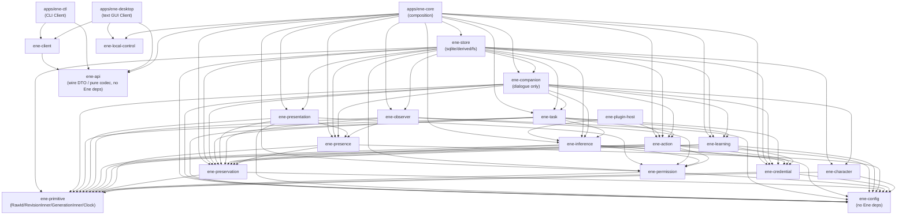

# Crate / Module 分解と依存方向の具体設計 — Step 13 Concrete Design

本書は、Step 13 にあたる Crate / Module の分解と依存関係を具体化する設計文書です。[対応関係・識別](correspondence-identity.md)（CI）、[永続化と復旧（Persistence / Recovery）](persistence-recovery.md)（PR）、[並行性制御（Concurrency Control）](concurrency-control.md)（CCT）、[インターフェース境界（Interface Boundaries）](interface-boundaries.md)（IB）で定めた識別子（ID）の型分離、ストレージの役割分担、並行処理とインターフェースの規約を前提とし、これらを変更しません。上位設計との優先順位や食い違いが生じた際のルールは、[設計文書 README](../README.md#設計文書の優先順位と信頼できる情報源) に従います。なお、本文中の SO / DR はそれぞれ [State Ownership（状態の所有権）](../architecture/state-ownership.md) / [Dependency Rules（依存ルール）](../architecture/dependency-rules.md) を指します。

本書に登場する Rust の擬似型やモジュール名は設計の提案であり、そのままコンパイルすることを目的としたコードではありません。型の名前やクレートの名前を分かりやすい同義の名前に改名することは差し支えありませんが、所有権（Ownership）の分離、依存の向き、および公開境界（Public Boundary）の意味合いは必ず維持してください。

## 1. 対象と非対象・判断材料

### 1.1 本書が具体化するもの

- Workspace 内のクレート（crate）一覧、各クレートの責務、主要モジュール、および公開（public）／非公開（private）の境界。
- クレート間の依存関係（許可する依存、禁止する依存、アダプターによる依存性の逆転、テスト専用の依存）。
- Host / Client / 共有モジュールの配置、リポジトリやアダプターの配置、外部・ネットワーク向け型の配置。
- 新しい実装が最終的に満たすべきワークスペースツリー構造と依存の制約。**実装を進める順序やスケジュールは [`docs/implementation/README.md`](../../implementation/README.md) を信頼できる情報源（source of truth）**とし、本書に記載されたクレート一覧をあらかじめ空の状態で一括作成するような手順は求めません。
- 第11節の検証ウォークスルー（Validation Walkthrough）を通じ、クレートの依存関係だけで各ユースケースが実現可能であることの確認。

### 1.2 本書が決めないもの

- 完全な `CREATE TABLE` 文、インデックス設計、マイグレーションコードの詳細、IPC 通信のバイナリ仕様、バージョン交渉、リトライ回数やタイムアウト秒数、スケジューリングやスコアリングの計算式、プロンプトの組み立てロジック。
- 各クレートに含まれる全関数の一覧や内部ヘルパー関数の細かな列挙。
- 暗号化のアルゴリズム、アーカイブのファイルフォーマット、電子署名の方式。

### 1.3 分解基準（固定チェックリストではない）

コードを独立したクレートに分けるか、単一クレート内のモジュールに留めるかを判断する材料として、以下の視点を用いました（これらすべてを同時に満たす必要はありません）。

- **依存の向き（Dependency Direction）**: IB §16 の原則（呼び出し側 caller → 状態の所有者 owner）をクレート依存の第一基準とします。状態の所有者が呼び出し側の内部事情を知ってしまうような逆向きの依存を作らないようにします。
- **意味的なまとまり（Semantic Cohesion）**: 同じ担当責任者（semantic owner）が管理する一連のライフサイクルは同一クレートにまとめます。ただし、複数の異なる状態・trait・テーブル・actor を1つに無理やり押し込めないように注意します。
- **プラットフォーム依存（Platform Dependency）**: OS の資格情報ストア、サンドボックス、wgpu、音声入出力、システムトレイなどをドメインロジックから完全に隔離します。
- **プロセスの境界（Process Boundary）**: Host 側のマスターデータと Client 側の一時的な利用データとの寿命（ライフタイム）の違いを分離します。
- **unsafe / ネイティブ依存（Unsafe / Native Dependency）**: `sqlite-vec`、`seccomp`、`wgpu` などのネイティブライブラリや unsafe コードを専用クレートへ隔離します。
- **コンパイルの隔離（Compilation Isolation）**: コンパイルが重いネイティブライブラリや UI 依存を末端のクレートに追い出し、コアロジックのビルドを高速に保ちます。
- **機能フラグ（Feature Dependency）**: 音声合成/認識、sqlite-vec、GUI 生成束縛などを Cargo feature や別クレートに閉じ込めます。first-party の text GUI と VRM overlay の process / 依存選定は [First-party desktop](first-party-desktop.md) が所有します。toolkit crate は同文書第7節の provisional です。
- **テストのしやすさ（Testability）**: リポジトリ、プロバイダー、アクション、オブザーバー、認証情報ストアを、テスト用フェイク（Fake）に差し替えやすくします。
- **独立した交換・アダプター境界（Independent Replacement / Adapter Boundary）**: LLM プロバイダーの通信プロトコル、MCP、プラグイン、OS ストアなどを柔軟に差し替えられるようにします。
- **Host と Client の共有可能性**: Client 側が Host 側の内部ドメインクレートに直接依存せずに済むように設計します。

## 2. 設計原則（crate 固有の判断）

1. **「Crate ≠ サブシステム ≠ 状態の担当責任者（semantic owner）」を徹底する。** 複数のサブシステムが1つのクレートに同居しても所有権を混ぜてはいけません。逆に1つのサブシステムが複数クレートに分かれても担当責任者を分裂させてはいけません。各クレートの責務表（第3節）に担当責任者を明記し、テーブルグループごとにも担当責任者を注記します（PR §4 と同様）。
2. **意味を持つ型（Semantic newtype）は担当クレート内に残す。** 内部表現（`u64` や UUID など）が同じであっても、異なる概念の ID 間で安易な `From` 変換や直接の大小比較を設けてはいけません。基盤クレート `ene-primitive` は中身を解釈しない素の ID（`RawId`）やリビジョン内部値（`RevisionInner`）、世代内部値（`GenerationInner`）だけを共有し、ドメイン固有の意味を持つ型を集めて肥大化させないようにします。
3. **循環参照を回避するためだけの雑多な共有クレート（shared crate）にドメイン型を集めない。** すべてのドメイン ID を `ene-primitive` や `ene-api` に移すような安易な設計は禁止します。ドメイン間の参照は、第4節で述べる「素の ID（`RawId`）＋利用用途ごとの前提情報（premise struct）」による依存性の反転で解決し、クレート依存を常に一方向に保ちます。
4. **ストレージクレート `ene-store` をドメインの担当責任者にしない。** `ene-store` はテーブル行のマッピング、SQL 発行、マイグレーション、ファイル配置、不要孤立ファイルのクリーンアップ機構だけを持ちます。「リビジョンを進めてよいか」「この提案を採用するか」「タスクが達成されたか」「実行を許可するか」「作用が確定したか」といった意味的な判断を一切行いません。リポジトリのインターフェース（trait）は各ドメインクレート側で定義し、`ene-store` がそれを実装するという向きで依存させます（第6節）。
5. **直列化ドメイン（Serialization Domain: SD）を巨大な単一ロックや汎用アクターへまとめない。** `ene-store` の短いトランザクションは各直列化ドメインの不可分性を支える機構にすぎず、状態の意味を変更する権限を統合するものではありません。
6. **クレートの公開 API（public API）で確定を偽装しない。** 秘密情報そのものを表す `SecretValue` 型を public に返してはいけません。また、`rusqlite::Transaction` などのデータベース内部型をビジネス層へ漏洩させてはいけません。
7. **何でもこなす「中央オーケストレーター」を作らない。** `ene-host-service` のような万能クレート、`common` / `shared` / `utils` / `core` / `services` / `managers` / `models` といった何でも詰め込むゴミ捨て場クレート、エンティティごと・テーブルごと・ユースケースごとの過剰な微小クレート、内部ドメイン用の過度なプラグイン構造、サービスロケーター、全面的な動的ディスパッチ（dynamic dispatch）を導入してはいけません。連携や順序付けの処理は、呼び出し側の用途別モジュール（対話は Companion、作業は Task、システム全域のファンアウトは Host の組み立て＋Preservation の横断 trait）に分散させます（第5節）。
8. **巨大な `ene-core` を純粋な結合ルート（Composition Root）へとスリム化する。** 過去実装（`apps/ene-core`）の構造を維持すること自体を目的にしません。意味判断は各ドメインクレートに、永続化は `ene-store` に、外部拡張の実行ホストは `ene-plugin-host` に、通信用 DTO は `ene-api` に配置し、`apps/ene-core` はそれらの配線（wiring）、ライフサイクル管理、ストレージ初期化、ルーティング設定だけに専念させます。
9. **過去実装は設計の縛り（契約）ではない。** 過去の実装のクレート／モジュールの構成・名称、アクターやストアのパターンをそのまま引き継ぐ必要はなく、新しい実装でそれらを移植したり、互換 shim レイヤーを設けたりする理由にはしません。目指すべき責務を直接シンプルに実装し、過去の構造に引きずられて依存の向きや所有権、公開境界を歪めてはいけません。

## 3. 目標 workspace 構成

### 3.1 Workspace tree 例

以下は**最終的に目指す構成の例**です。**これは各ステージの作業完了チェックリストでもなければ、全クレートを最初に一括作成せよという指示でもありません。** 実際の実装にあたっては実装ガイドの「動く単位（Vertical Slice）」を最優先とし、その単位で必要になった境界から、第3節および第9節の責務と依存方向を満たす形で順次追加していきます。

```text
Cargo.toml  # members = ["crates/*", "apps/*", "plugins/tool/*", "plugins/provider/*"]
crates/
  ene-primitive/        # 中身を解釈しない RawId / RevisionInner / GenerationInner / WallClockWithTz（極小）
  ene-config/           # 型安全な設定構造体・パス解決
  ene-character/        # 静的構成・リビジョン・インポート/エクスポート・出所追跡
  ene-companion/        # 個体調整・対話制御・未伝達メッセージ・自発的行動・適用関係（I-1〜I-7）
  ene-task/             # タスク管理・作業委任・スケジュール・ワークスペース・TaskContext（W-1〜W-7）
  ene-learning/         # 要約・記憶・スキル・関係性・状態・スコープの意味判断（L-1〜L-8）
  ene-presence/         # 接続事実・帰属先・移動ヒント/復旧先・接続切替（CN-1〜CN-7）
  ene-presentation/     # Host側：やり取り（Round）の実際・立ち絵/音声の中継・一般設定・管理画面（IO-1〜IO-8）
  ene-observer/         # 観測対象・観測タイミング・キャプチャ・候補生成・ルーティング派生（OB-1〜OB-7）
  ene-permission/       # ルール判定・同意管理・利用量上限（Cap）・デバイス許可・サンドボックス例外・事前制約・その場検証（C-1〜C-8）
  ene-credential/       # 秘密情報の登録・照合・認証用途での限定供給・バックアップ除外（S-1〜S-5）＋ OS ストア抽象
  ene-inference/        # LLM登録・能力観測・割り当て解決・1回ごとの送信・フォールバック・利用量元帳（I-1〜I-7）
  ene-action/           # 外部作用の実行・確定度管理・拡張受け入れ・Client限定作用（E-1〜E-5）＋ アダプター/リポジトリ trait
  ene-preservation/     # データ保持・バックアップ/復元/リセット・監査/デバッグログ・全域協調（PE-1〜PE-7）
  ene-store/            # app.db + derived.db + internal_copies の実装（D1/D2/D3/R/T の永続化機構のみ）
  ene-api/              # Host↔Client 間の通信用中立 DTO と純粋な MessagePack codec
  ene-plugin-ipc/       # プラグイン向けプロセス間通信フレーム（Body 投影 IPC ではない）
  ene-plugin-host/      # 外部コード実行用ホストアダプター（推論/作用 trait の実装）
  ene-provider-assets/  # カタログ/マニフェスト/ダウンロード補助
  ene-sandbox/          # OS レベルのプロセス隔離
  ene-client/           # Host Client WSS（接続先の発見 / TLS / handshake / correlation / erasure）
  ene-local-control/    # Host-local control DTO。ene-api に載せない
apps/
  ene-core/             # Host 側の結合ルート（配線・起動・store・要求専用 listener・GUI spawn）
  ene-desktop/          # 製品版 text GUI（ene-api Client channel + control。toolkit は provisional）
  ene-body/             # VRM overlay process（wgpu。Host に接続しない。VRM runtime は provisional）
  ene-ctl/              # CLI クライアント（ene-api 経由。control は話さない）
plugins/tool/*, plugins/provider/*  # 外部拡張（ene-plugin-host 経由でのみ参加）
```

`ene-stage` / `ene-stage-ui` / `ene-vrm` / `ene-tray-linux` は作らない。トレイは Milestone 1 に無い。GUI 生成束縛が workspace clippy と衝突する場合だけ、`ene-desktop` 隣の compile-isolation に閉じ、名前は `ene-stage-ui` に戻さない。process 寿命と toolkit 選定（provisional 含む）は [First-party desktop](first-party-desktop.md)。

上記のような粒度に分割しているのは、コードの見通し、コンパイル単位の分離、所有権の明確化、循環参照の防止、テストの容易性を確保するためであり、クレート数を最小化することや無闇に細分化すること自体を目的としているわけではありません。例えば、`ene-presentation` や `ene-observer` を `ene-presence` にまとめないのは、「帰属先（Companion ごとに排他）」「やり取りの実際（入出力の区切り）」「観測対象（Client 単位で共有）」のライフサイクルや制御単位が根本から異なり、これらを1つの状態変数や actor に押し込めると X-1〜X-10 の契約が崩れてしまうためです。また、`ene-permission` と `ene-credential` を分けるのは、説明やプロンプト文脈に含めてよい情報と、決して漏らしてはならない秘密情報の保護・失効・バックアップ除外の契約が本質的に異なり（DR-05）、同一クレート内では秘密の非露出をコンパイラレベルで強制できないためです。さらに、`ene-inference` と `ene-action` を分けるのは、推論の失敗と外部作用の成否不明とで、再試行や確定度、再生（リプレイ）に関する契約が大きく異なり（CCT §6・§8）、一緒にすると成否不明の外部作用を勝手に自動再実行してしまう危険があるためです。

### 3.2 Crate 責務・主要 module・public boundary

凡例：`pub` = ワークスペース全体へ公開、`priv` = クレート内限定。`Transaction`、`SecretValue`、生 SQL はいずれも決して `pub` として公開しません。

| クレート | 担当責任者 / 役割 | 主要モジュール（論理境界。初期は単一モジュールから開始可） | 公開境界（pub として公開するもの） / 公開してはならないもの |
|---|---|---|---|
| `ene-primitive` | 全クレート共通の最小基盤（中身を解釈しない ID・単調増加値・時刻の形式）。ドメインの担当責任者ではない | `raw_id`（`RawId`: UUID 互換 128bit 不透明値）、`revision`（`RevisionInner(u64)` + 単調増加ヘルパー）、`generation`（`GenerationInner(u64)`）、`clock`（`WallClockWithTz`: 壁時計時刻 + 作成時タイムゾーン。リビジョンの代わりには使わない） | pub: 上記 4 モジュールの型とヘルパー関数のみ。非公開・禁止: `CompanionId` 等のドメイン型、ビジネスロジック、通信用 DTO、DB・IPC・OS への依存。`uuid`・`chrono` 以外の重い外部依存を持たせない |
| `ene-config` | 起動時設定やディレクトリパスの管理（各種設定値の意味判断は各担当クレートが行う。Host 自動起動の選択は `ene-presentation`） | `typed`（型安全な設定構造体）、`paths`（OS ユーザー領域・データディレクトリの解決） | pub: 型安全な設定値とパス解決関数のみ（`schemars` によるスキーマ生成は必要な段階で導入）。禁止: ドメイン状態、秘密情報、ランタイムの意味判断、リポジトリ |
| `ene-character` | キャラクター定義（静的構成・リビジョン・インポート/エクスポート・出所追跡。CH-1〜CH-7、CD-1〜CD-7、C-A/C-C/C-D） | `identity`（`CharacterId`・静的定義）、`revision`（`CharacterRevision`・差分提示）、`import`（バリデーション・出所記録。実行許可にはしない）、`export`（静的候補の内容・資材・由来の配布可能性検証、不明時の除外・拒否、著作権注意）、`supply`（適用用データの供給。適用を確定するのは Companion 側） | pub: `CharacterId`、`CharacterRevision`、`GetCharacterRevisionQuery`、`CharacterRevisionView`、`ValidatePackageQuery`、`PackageValidationReport`、`ExportCharacterCommand`、`CharacterExportOutcome`。priv: アーカイブ展開処理、差分計算ロジックの詳細。禁止: 適用関係の管理（Companion の責務）、学習データの意味判断（Learning の責務）、許可・秘密・作用の確定 |
| `ene-companion` | 個体調整（同一性・対話制御・未伝達・自発的行動・適用関係。I-1〜I-7、H-A caller、H-B/C caller、H-F 仲介、H-G owner、X-A caller） | `lifecycle`（`CompanionId`、稼働中/停止中/削除済み tombstone の最小状態）、`applied`（適用関係のマスターデータ ＋ `CharacterApplicationRepository` trait の利用）、`dialogue`（対話のオーケストレーション。Task/Learning/Inference への呼び出し依存をここに閉じ込める）、`history`（会話履歴・活動記録の意味。DB 行そのものは `ene-store`）、`undelivered`（`UndeliveredRef`・報告状況。提示したという事実は Presentation）、`spontaneity`（個体ごとの自発的発言・ループ抑制） | pub: `CompanionId`、`ProposeTaskCommand`、`ProposeSteeringCommand`（呼び出し側。`dialogue` が `TaskProposalPremise` と方針変更の値前提（`SteeringProposalPremise`）へ変換し、作業側の `orchestrate` が識別子（方針変更では新リビジョンの採用目的項目IDと採用指示項目ID）を発行して `TaskCreationPremise` / `TaskCommitPremise` を構成する）、`ProposeExperienceCandidate`、`RegisterUndeliveredFact`、`RequestMoveCommand`（呼び出し側）、各ドメイン判定結果型（他クレートの判定結果型の再掲ではなく自クレートの要求に応じた型）。priv: LLM プロンプト、会話要約、スコアリング。禁止: タスク達成の確定（Task の責務）、学習意味の決定（Learning の責務）、帰属の確定（Presence の責務）、秘密情報、SQL 発行 |
| `ene-task` | 作業管理（Task・委任・スケジュール・ワークスペース・TaskContext・結果到着記録/採用/進捗/中断。W-1〜W-7、H-A owner、H-H owner） | `task`（`TaskId`、`TaskRevision`、`TaskRef`、指示の転送、`TaskProgress`。AU3/AU4/AU5/AU15b の terminal gate と cancel 受付（AU16、`cancel_task` が非 terminal から `cancelled` へ CAS。受理と停止完了を分離）を含む）、`delegation`（`DelegationId`、一時的な作業エージェント、スコープの複製）、`result`（`TaskResultId`、final result 本文の finalization 時 1 行保存と delegation の execution seal、delegation = execution lifetime からの authoritative set 検証、採用判定・完了確定。確認済み無作用失敗の非依拠判断は Task owner が代替達成・残作業・客観的根拠を検証し、採用時に理由必須で durable 記録する。読戻しは消去後の理由欠如と記録済みを closed disposition で区別し、試行・根拠 identity を保持する。部分的作用・不足は保留。AU15b は同じ不分区間で Task-wide completion barrier（同じ `TaskId` に属する全 revision / 全 delegation の Action 試行に `Unknown` が無いこと）を確認してから `Completed` へ CAS）、`schedule`（スケジュール設定、実行回、各回の Task）、`workspace`（関連付け、保存先確認、中間ファイルの整理）、`context`（TaskContextEntry。本文は複製しない）、`orchestrate`（作業委任・指示・結果受け入れ・Task Agent 推論ターンの直列化順序付け。推論試行 claim の terminal gate と execution seal gate を含む） | pub: `TaskId`、`TaskRevision`、`TaskRef`、`TaskPurpose`、`TaskPurposeRef`、`SteeringPremiseRef`、`SteeringProposalPremise`、`TaskContextEntry`、`TaskContextEntryId`、`TaskContextItem`、`TaskContextOrigin`、`TaskContextOriginKind`、`AssigneeRef`、`WorkspaceFolderRef`、`WorkspaceNeedRef`、`WorkspaceAssocId`、`WorkspaceAssociation`、`WorkspaceAssociationPremise`、`Task`、`TaskProgress`、`TaskRevisionRecord`、`TaskRecord`、`TaskCreationPremise`、`TaskProposalPremise`、`TaskPurposeAdoptionPremise`、`TaskInstructionAdoptionPremise`、`TaskCommitPremise`、`TaskProposalOutcome`、`TaskCommitOutcome`、`CancelTaskCommand`、`TaskCancelSource`、`TaskCancelOutcome`、`TaskResultId`、`TaskResultRecord`、`TaskResultAdoptionClaim`、`TaskCompletionAssessment`、`VerifiedNonReliance`、`RecordedNonReliance`、`NonRelianceReasonDisposition`、`TaskResultAcceptance`、`DelegationId`、`DelegationRef`、`DelegationScope`、`DelegatedWorkspace`、`TaskAgentEphemeralId`、`DelegationCreationPremise`、`CreateDelegationCommand`、`TaskAgentResultArrival`（sealed `ScrubbedText` と `CredentialSetRevision` 前提）、`TaskResultArrivalOutcome`（`StaleCredentialSet { current }` を含む）、`TaskResultArrivalDisposition`、`TaskAgentTurnPremise`、`TaskAgentTurnOutcome`、`TaskAgentInferenceOutcome`、`TaskAgentInference`（port trait。`input_budget` で論理入力の上限を公開し、実行ローカルの Action transcript はこの予算内へ収める。claim 済み attempt の利用実績を記録してから `Aborted` を返す）、`TaskInstructionSource`（採用指示本文の解決 port trait）、`TaskInstructionSourceRecord`、`TaskInstructionRole`、`TaskInstructionSourceError`、`TaskRepository` trait（`delegation_has_started_work` による delegated execution の durable start marker の bounded probe を含む）、`DelegationOutcome`。priv: タスク分割・並列処理機構・実行ハーネス詳細。禁止: 会話の意味判断（Companion の責務）、学習意味の決定（Learning の責務）、外部作用の確定度（Action の責務）、権限の確定（Permission の責務） |
| `ene-learning` | 認識・学習（要約・記憶・スキル・関係性・状態・スコープの意味判断。L-1〜L-8、H-B/C/D/E owner、H-F source） | `summary`（圧縮された根拠情報、`SummaryGroundsRef`）、`memory`（現在および過去のリビジョン、重要度、スコープ）、`skill`（有効な手順リビジョン、原本との対応、復元）、`relationship`（ユーザーや相手ごとの関係性解釈）、`companion_state`（一時的/持続的な状態、経過時間の解釈）、`scope`（公開・利用範囲の意味判断。強制は Permission と各利用箇所） | pub: `LearningId`、`LearningRevision`、`ProposeExperienceCandidate` 受付側、`FormationDecision`、`CorrectionOutcome`、`ScopeDecision`、`LearningRepository` trait。priv: 検索・要約・スコアリング・記憶減衰の計算式。禁止: 会話履歴の所有（Companion の責務）、タスクの所有（Task の責務）、権限ルールの強制（Permission の責務） |
| `ene-presence` | 接続・存在（接続事実・帰属先・移動ヒント/復旧先・接続切替。CN-1〜CN-7、X-A owner） | `connection`（識別子、最終接続、現在の接続、可用性）、`attribution`（`PresenceAttribution`、`PresenceGeneration`、直列化ドメイン SD-Presence の CAS 更新）、`hint`（`RelocationHint`、復旧先情報。これ自体を presence とみなさない）、`transition`（旧 Client → 移行中 → 新 Client。ライブな疎通性は DB の管轄外） | pub: `ClientId`、`PresenceGeneration`、`PresenceAttributionFact`、`PresenceRepository` trait、`MoveDecision`。priv: 切断検知・調停メカニズム。禁止: 移動の必要性判断（Companion の責務）、ペアリングやデバイス承認の意味（Permission の責務）、やり取り（Round）の実際（Presentation の責務） |
| `ene-presentation` | 入出力・提示の Host 側制御（やり取りの区切り・中継・一般設定・管理画面。IO-1〜IO-8、X-B/X-C/X-H、H-G/H-H の提示側） | `round`（入力受付・提示・やり取りの区切り。タイムライン全体の終了とはみなさない）、`body_voice`（立ち絵/音声の中継・縮退運転・ミュート/キーボード代替経路。キャラクターの内的状態のマスターデータではない）、`settings`（UI 表示言語・立ち絵表示位置・音声全般設定・Host 自動起動の選択）、`management`（セットアップ・管理経路。各担当者の承認に従う） | pub: `RoundId`、`SubmitClientInputCandidate` 受付側、`UndeliveredSummaryFact`。priv: 描画・音声再生処理・レイアウト計算。禁止: 会話の意味判断（Companion の責務）、帰属の確定（Presence の責務）、タスク達成・権限許可・外部作用の確定 |
| `ene-observer` | 共有観測（観測対象・タイミング・キャプチャ・候補生成・ルーティング派生。OB-1〜OB-7、X-D/X-E） | `eligibility`（対象とタイミングの判定。停止中の除外・一時停止/OFF・全画面表示時抑制・利用量上限）、`capture`（Client 単位での共有キャプチャ・実行タイミングのずらし。アダプターは trait）、`routing`（専用の同意割り当て前提・関連する Companion のみへの配信・派生データとしての扱い）、`explain`（観測状態・観測範囲・Learning への利用に関する説明責任。生のキャプチャ画像等は永続化しない） | pub: `ObservationCandidateId`、`PublishObservationCandidate`、`RoutingDecision`、`DeliverEventNotification`、キャプチャ用アダプター trait。priv: スコアリング、選別アルゴリズム、実行頻度制御。禁止: 個別の意味判断（Companion の責務）、最終的な外部作用（Task/Action の責務）、同意の確定（Permission の責務） |
| `ene-permission` | 権限・制約（ルール・同意・利用量上限・デバイス許可・サンドボックス例外・事前制約・その場検証。C-1〜C-8、K-A/K-B/K-D/K-F/K-G） | `rule`（ルールストア導入段階で追加）、`consent`（割り当て同意・フォールバック順序・Observer 専用同意）、`cap`（SD-Cap の予約/確定/解放）、`device`（デバイスの接続許可・失効）、`sandbox_exception`（特定のローカル MCP に対する例外許可。一般プラグインへの流用禁止）、`check`（実行直前のその場検証。過去の許可結果の安易な使い回し禁止） | pub: `CheckLiveAuthorizationQuery`、`LiveAuthorizationDecision`、`ReserveUsageCommand`、`UsageRepository` の利用可否側、`PermissionEvaluationId`、`ActionKind`、`ActionUseCandidate`、`CurrentActionPremise`、`ActionAuthorizationDecision`、`ActionDenyCode`、`ActionPermissionEvaluationId`、`ActionEvaluationTracker`、`authorize_action_use`。priv: 権限評価アルゴリズム。禁止: 学習データの意味判断（Learning の責務）、秘密情報の保持（Credential の責務）、外部作用の確定度（Action の責務）、タスク達成の判断（Task の責務） |
| `ene-credential` | 認証用の秘密情報（登録・照合・認証用途での限定供給・バックアップ除外。S-1〜S-5、K-C） | `registry`（`CredentialRef` 非秘密参照、用途、有効性）、`use`（限定されたコンテキストでのみ供給する機能。`with_credential` のように生値を外に返さない）、`notify`（認証失敗・失効・再認証の通知。秘密は含めない）、`scrub`（入力では現行値、provider 結果では現行値と元 ticket の verified な旧 used-version 集合を除去。Task Agent final は delegation の全 ticket を対象にし、旧値が不明・取得不可なら本文なし）、`store`（OS 抽象層：DPAPI / libsecret / Keychain。`cfg` で切り替え） | pub: `CredentialRef`、`CredentialSetRevision`、`ScrubbedText`（credential owner だけが mint する sealed proof）、`SecretScrubber`、`SecretScrubError`、`RequestAuthenticatedUseCommand`、`AuthenticatedUseOutcome`、OS ストア用 trait。禁止: 秘密情報の平文返却（`SecretValue` はクレート内 private）、プロンプト文脈・ログ・監査ログ・バックアップへの露出、ユーザー同意や権限の確定 |
| `ene-inference` | LLM 推論利用（モデル登録・能力観測・割り当て解決・1回ごとの安全送信・フォールバック・利用量元帳。I-1〜I-7、K-D/E/F） | `registry`（非秘密のモデル登録、能力観測）、`resolve`（Host 既定 → 個別上書き → 継承、Observer 専用。解決済み経路は派生情報として扱う）、`send`（1回ごとの送信。claim と予約に加え、cap 未設定でも実課金先・system の UTC 日/月 window を restore gap と照合し、dispatch 直前にも費用現在性・全適用 cap の現在 revision / amount・残枠と予約 window を確認。cap 更新と first byte を短い境界で直列化。provider 結果は ticket の verified な旧 used-version 集合と現行 credential 値で scrub した `ScrubbedText` のみを各利用元へ渡し、stream chunk も渡す直前に照合。旧版不明・旧item取得不可なら本文は ResultUnavailable、利用量 fact は保持。未送信確定時のみ release、開始済み / 不明なら Unknown を保持）、`fallback`（ユーザー承認済みの順序のみ）、`usage`（プロバイダー報告/成否不明/処理中。推定機能は必要段階で導入。上限判定は Permission） | pub: `ResolveAssignmentQuery`、`AdmissionRequest`、`AuthorizedInference`、`InferenceExecutor`、`DispatchAbort`（ローカル・best-effort の協調停止トークン。canonical state ではなく、claim 済み dispatch の利用実績記録を Future drop で skip させない）、`InferenceAttempt`、`TaskAgentAttemptPremise`、`InferenceDispatchOutcome`、`InferenceResultArrival`、Provider 通信用 trait。priv: プロバイダー要求への適応・圧縮・キャッシュ（論理コンテキストの選択とプロンプト組み立ては利用元の責務）。禁止: 出力結果のドメイン的な意味確定（呼び出し元の責務）、同意の確定（Permission の責務）、秘密情報の保持（Credential の責務） |
| `ene-action` | 外部作用の実行・拡張（作用・確定度・拡張受け入れ・Client限定作用。E-1〜E-5、K-H/I/J） | `candidate`（`ActionCandidate`。候補を作ることと実行を許可することは別。producer を持つスライスで追加）、`execute`（実行直前の不可分な前提検証、`RealTargetRef` の実体解決、mount/reparse 境界の照合。このスライスは `filesystem` モジュールで Workspace 内の List/Read/Create/Edit を実装。後続の管理起点 Direct は手動 backup 外部 Create、Character package 原本 Read、個体非依存 Character export Create を用途別に追加する。実書込本文と既知 source・実対象の消去照合を AU5 / 作用直前に行い、Read/List の取得結果は返却前に再照合）、`effect`（`ActionAttemptId`、`ActionCertainty`、Task所属なら委任（execution lifetime）相関と seal gate、直接操作ならオーナー指示・optional Companion・許可された system operation への帰属、試行ごとの CAS 更新。Companion 付きは Stop 後の新規開始を拒否し、管理起点 None は Stop 非適用で削除・復元保留を照合する）、`extension`（MCP Tool/Resource/Prompt・限定プラグインの受け入れ、サンドボックス適用。後続スライス）、`client_bound`（現在アクティブな Client 限定、デバイス許可との AND 条件。後続スライス）、`adapters`（OS・デバイス・MCP との境界。具体実装は `ene-plugin-host` / Client アダプター / プラットフォームモジュール） | pub: このスライスで具象化する `ActionAttemptId`、`ActionCertainty`、`OperationKind`（List/Read/Create/Edit）、`RealTargetRef`、`EffectGrounds`、`WorkspaceErasureCandidate`（本文借用）/ `WorkspaceErasureAssessmentRef`（非永続の currentness 比較材料）、`AttemptCommitPremise`、`ActionStartOutcome`（`DataUseHeld`・`TaskTerminal`・`ExecutionSealed` を独立 variant とする）、`CertaintyUpdateOutcome`、`ActionAttemptRecord`、`ActionAttemptRepository` trait、`WorkspaceRoot`（と `WorkspaceRootError` / `TargetRejection`）、`ObservedEffect`（と `ActionOutput` / `ListEntry`）、`WorkspaceActionCommand`、`ActionNotStarted`、`ActionRunOutcome`、`orchestrate_workspace_action`。`ActionCandidate`、`ExecuteActionCommand`、`ReportEffectFact`、OS/デバイス/MCP アダプター trait は producer を持つスライスが同じ設計変更で追加します。priv: 実際の操作対象を解決する詳細処理、シェル実行の内部詳細。禁止: 実行許可の確定（Permission の責務）、タスク達成の判断（Task の責務）、秘密情報の保持 |
| `ene-preservation` | データ保全・消去（データ保持期間・バックアップ/復元/リセット・監査/デバッグログ・全域協調。PE-1〜PE-7、D-A〜D-E、DP-0〜DP-8） | `retention`（データ保持期間・オプトインでのクリーンアップ。既定は OFF）、`backup`（バックアップ時点の固定・参照・秘密除外・未完了処理への対応）、`restore`（ステージング領域での展開・アトミック切り替え・適用保留・ユーザーによる一括有効化）、`deletion`（完全削除範囲の確定、`ErasureConditionRef`、残存データの検証、全域完了の判定）、`reset`（設定のみリセットと全データリセットの明確な区別）、`audit`（追記順の保護・長期保持。本文とは別保管庫にしない）、`debug`（明示的な有効化・短期間での自動停止・安全な削除）、`coordination`（`ErasureParticipant` trait・各ドメインの削除完了の集約。他ドメインのデータを勝手に書き換える権限は持たない） | pub: `DeletionOperationId`、`DeletionSweepGeneration`、`BackupPointId`、`RestoreGeneration`、`DemandLocalErasureCommand`、`ParticipantCompletionFact`、`PreservationRepository` trait。priv: ファイル探索・検証の詳細実装、アーカイブフォーマット。禁止: 各ドメインの状態を勝手に変更すること、秘密情報の取得、外部所有ファイルの管理 |
| `ene-store` | 永続化の機構のみ（PR Group A〜K の D1/D2/D3 + R/T の保存。ドメインの担当責任者ではない） | `sqlite`（`app.db` のドメイン別テーブルグループ。`Immediate` による短いトランザクションのみを使用し、トランザクション内で await しない）、`derived`（`derived.db` + sqlite-vec。feature で隔離し、いつでも安全に再構築可能）、`fs`（`internal_copies/` と `*.ene-backup` のステージング。temp書き込み → ファイル同期 → 公開保護確立 → 未使用名へ rename → ディレクトリ永続化 → DBポインタ確定 → 保護解除 → 不要ファイル掃除）、`migrate`（空DBのスキーマ初期化とバージョン照合。未対応バージョンは変更せず拒否する） | pub: 各テーブルグループの行型へのマッピング関数、`new`/`open`、クリーンアップ関数のみ。`Transaction` 型は公開しない。各ドメインの `*Repository` trait の実装（`ene-store` が各ドメインに依存する向き）。クリーンアップ時は、削除直前に同じ同期境界内で「アクティブな参照も公開中保護もないこと」を再確認する。禁止: 採否・達成・許可・確定度の意味判断、リビジョンを進めてよいかの決定、秘密情報の保持、派生データからマスターデータを勝手に捏造すること |
| `ene-api` | Host↔Client 間の中立な通信用 DTO と純粋な MessagePack codec（IB §15、IPC §7・25） | `round`（`SubmitClientInputCandidate` の通信用形式）、`presence`（`RequestMoveCommand` や `PresenceAttributionFact` の通信用形式）、`undelivered`（`UndeliveredSummaryFact` の通信用形式）、`character_asset`（表示アセットの参照情報のみ）、`management`（`ManagementOperationCommand` の通信用形式）、`erasure_client`（Client 側の一時データ削除参加用）、`codec`（電文・バイト列の変換） | pub: serde 対応 DTO、長さプレフィックスを持たない encode / decode、型付き codec error。WSS / TLS / OS の I/O、認証材料の保管、Ene 内部 crate への依存は禁止。Host 内部 newtype、秘密情報、DB 行構造を漏洩させず、ID を内部マスターの主キーとして流用させない |
| `ene-plugin-ipc` / `ene-plugin-host` / `ene-provider-assets` / `ene-sandbox` | 通信 / ホスティング / カタログ / プロセス隔離（外部との境界） | 必要な最小限のアダプター実装（第7節参照） | pub: 通信フレーム、外部ホスティング、カタログ管理、プロセス隔離の API のみ。ドメインとしての意味を持たせない |
| `ene-client` | Client 側の Host WSS 接続（接続先の発見・TLS 検証、handshake、correlation、device identity、erasure participant）。ドメインの担当責任者ではない | `transport`、`session`、`correlation`、`erasure` | pub: 接続・相関・local erasure の API。codec は `ene-api` を使用。接続認証材料は保護して扱い、通常 API / Debug / log へ返さない。禁止: clap/stdio、Host ドメインクレート、`ene-store`、Provider credential 生値、control DTO |
| `ene-local-control` | Host-local の request / confirmation DTO。remote-capable ではない | `request`、`confirmation` | pub: 別々の serde frame enum。request は非秘密候補と outcome、confirmation は Host-spawned seat の session と redacted secret intake。Host 内部 newtype、通常 Debug / log / 永続化可能な秘密返却を禁止。authority の発行は Host が行う |
| `apps/ene-desktop` | Host-spawned text GUI、専用 control seat、Body の親、確認面。通常起動時は短命 launcher | `ui`、`session`、`control`、`body_supervise`、`i18n`、`erasure` | Host 内部ドメインの master や authority を持たない。確認 channel は Host が渡した endpoint だけを使い、Body に継承しない。公開 listener・同一 UID を本人確認にしない。Computer Use は確認面への注入を拒否する |
| `apps/ene-body` | VRM overlay だけの child process | `window`、`vrm`、`render`、`ipc` | Host に接続しない。秘密・会話本文・Task を持たない。crate 名 `ene-vrm` は使わない |

`ene-action::orchestrate_workspace_action` は実書込本文を確定して同じ非永続 buffer と保持対象を `AttemptCommitPremise` から外部作用まで使います。保全・消去 owner の mechanical coverage / 既知 source / 対象 / 完了後 provenance cut を transaction 外で評価し、`ene-store` の `insert_attempt_if_current`（AU5）が同じ master の短い `Immediate` で active condition generation / phase と候補の同一性を確かめます。変化時は外で再スキャンするか `DataUseHeld` で fail closed、covered / unknown は試行・作用とも 0 です。`WorkspaceErasureAssessmentRef` や `ErasureConditionRef` の古い snapshot を permission としません。AU5 が先なら action_attempt は body-free な lineage / identity / 順序を持つ already-started fact として削除参加の対象となり、実作用の開始直前には deletion start と直列化して同一本文・source・保持した実対象を再照合します。作用の開始と比較の間に割り込みを許さず、外部 I/O 完了までは同期区間を保持しません。`Read / List` は対象・既知 source を AU5 で照合し、読み出した本文・列挙名も返却・利用・再保存前に照合します。結果の本文再保存は current condition / provenance cut に従い、covered / 旧由来は body-free な事実だけを残します。試行に本文・hash・検索材料を複製せず、既存の `Unknown` を無作用と推定しません（IB K-H、CCT §8、Targeted Deletion lifecycle §7.1）。

手動 backup は `ene-preservation::backup` が確定した出力を Host 結合ルートから `ene-action` の `Direct { Management, companion: None, system_operation: ManualBackupExport }` に渡し、Character package import は `ene-action` の同じ管理帰属の `CharacterPackageImport` による原本 Read の結果を `ene-character::import` が検証します。Companion に依存しない export も `ene-character::export` の検証候補から `CharacterExport` 用途の Direct を通します。いずれも `ene-permission` が管理 source・用途・操作・scope・保持実対象を single-use 評価し、`ene-store::sqlite::action` が AU5 / 最終作用 gate・結果と `Unknown` を保存します。管理経路の認証や保存先指定、Character 検証、backup 完了判定を Action 側が自己申告で確定しません。TaskBound / 会話起点 Direct と Companion 付き管理 Direct の Running gate は維持します（IB K-B.1 / K-H、PR Group E / V45 / AU5）。

手動管理バックアップでは `ene-preservation::backup` / `ene-store::sqlite::preservation` が認証済み `Management(ActivityId)` ごとに唯一の point と確定出力 scope を同じ master に保存し、受付 retry は既存 point を返します。Host 結合ルートは source / point / 確定出力を `ene-permission` の single-use 評価と `ene-action` の Direct へ同じ対応で渡し、`ene-store::sqlite::action` は AU5 で point と現在の許可・実対象を再比較して source / point ごとの一試行を強制します。最終作用 gate も同じ対応を確認し、`Unknown` を保持して同じ source から再送しません。別の出力は Owner の新たな明示管理要求 / 新 point と現在の許可・二重出力リスクを評価します。`ene-preservation` の point 成功はファイルの整合性・永続化と Action の当該試行の `ConfirmedSuccess` を検証してのみ確定し、結果不明や欠けた成功を補いません（PR Group J/E、IB D-D / K-H）。

Schedule backup は `ene-task::schedule` の Started occurrence または認証済み Owner Run now 操作から独立の Backup 専用 TaskRef と閉じた source を発行し、`ene-preservation::backup` へ依頼します。Run now は元回の状態・cursor を変更しません。保全 owner が確定した point / 出力 scope と Owner 選択の現在 `backup_setting` revision / 保存先を Host 結合ルートが `ene-action` の `TaskBound { scope: BackupTaskExport }` に渡します。`ene-permission` は保存済み source / purpose・Run now 元操作の認証済み帰属・外部 Create / 実対象を single-use 評価し、Action owner は AU5 と作用直前に Task / source・point・scope・設定・担当 Running Companion・削除 / 復元を再照合して確定度を保持します。`ene-store::sqlite::action` の Task 単位一意制約は P1 Unknown 後の P2 を別 point からも拒否します。`ene-task::delegation` は Backup 専用 Task の AU3 を常に拒否し、`ene-task::result` の通常 AU15b も同じ transaction で種別と source を照合して拒否します。通常 Task の委任 / Workspace は維持し、通常 Task の Workspace Action はこの backup 出力候補に流用せず、`ene-preservation` の point 成功を Agent 成果と混同しません。保全 owner の同じ point のファイル整合性成功 marker は Action の唯一の試行の ConfirmedSuccess と区別し、`ene-task` の専用 producer が両事実と Task-wide Unknown barrier を検証して agentless Task の完了を確定します（PR V47 / AU5 / AU10、IB D-D）。

`ene-task::orchestrate` / `ene-store::sqlite::task` の AU17 は保存済み `task_kind` と source で分岐し、通常 Task は新 revision・採用指示・delegation / agent を commit し、Backup 専用 Task は同じ TaskRef / source / purpose を維持して新 Owner 指示の body-free 受付 fact だけを commit し agentless 予約へ渡します。Task-wide Unknown は受付を保留し、既存出力が `ConfirmedSuccess` なら `ene-preservation` の同じ point の残りの検証と専用完了だけ、試行 0 件なら現行の権限・設定・担当状態で未開始出力だけ、`ConfirmedFailure` なら同じ Task の再出力は拒否します。`ene-task::task` の AU4 は種別 / source を不変にし backup 以外への目的転換と既存 point の TaskRef を切断する revision 前進を拒否します。Schedule currentness と Run now 会話入力の最新性は AU18 / AU2 でのみ評価し、既開始 Task の Action / resume では元 source の帰属を照合します。後の Schedule 変更・停止・削除や無関係な Owner 入力で Task を取消さず、管理 source identity 自体の失効、同じ Task の Cancel / steering と現在の Permission / Companion / `backup_setting` / 消去・復元をそれぞれの gate で扱います（IB H-A.1 / H-H、PR AU17）。

`ene-preservation::backup` は Backup 専用 Task の point を作成し、出力試行 0 件・外部未開始を `ene-store` と同じ writer で証明できる場合だけ、その同じ point の保存先 / 保護設定と設定 revision を現在値へ CAS で再確定します。`ene-permission` の古い評価を捨て、必要なら未公開の一時ファイルを現在設定で作り直し、保護方式・出力内容・実対象を再検証した新評価だけを `ene-action` の AU5 に渡します。出力試行後は point を付け替えません。回復不能な作成失敗は保全 owner の検証済み failure fact と Action owner の確定度・作用根拠を `ene-task::task` の `fail_task` に渡し、Task-wide Unknown が空で外部影響の範囲が判明し残作業に達成可能性がない場合だけ同じ master の `Failed` CAS と失敗帰属・未伝達を確定します。影響範囲が不明な部分作用、`Unknown`、再評価可能な設定変更や一時的技術障害は terminal failure にしません。既知の部分作用は失敗の影響として報告します（PR §4.5、IB D-D）。

`ene-action` の Backup 専用 AU5 と作用直前 gate は、`ene-preservation` が確定した同じ point の出力準備完了・回復不能な失敗 marker の不存在を、Task と現在の Permission に加えて同じ writer で照合します。point の失敗が Task の `Failed` CAS より先に決まっても新しい出力を始めず、AU5 後の失敗なら元試行の未開始証明または `Unknown` を保持して settlement します（CCT §8.1、PR AU5）。

保存済み provider 由来本文の正本と閲覧可能性は `ene-companion::history`（Dialogue）、`ene-learning` の各本文 owner（Summary / Memory の過去改訂を含む）、`ene-task::result` および Task intermediate の owner がそれぞれ管理します。各 owner の repository は本文 ID → 全由来 ticket（Task final は result → delegation → 全 ticket）の bounded read と、ticket / delegation → 閲覧可能な本文の索引付き bounded page を提供し、保存・retention・消去と由来 / 閲覧可能性を同じ master で確定します。`ene-inference` は ticket と verified / unknown used-version 相関を保持し、`ene-credential` は現行値と旧 OS item による scrub・sealed proof・退役 item の cleanup を担当します。Host の port adapter と `ene-store` は退役 version → ticket → 各 owner の保存済み本文を索引付きで照合し、未完了受入 / stream だけでなく表示可能な本文が残る限り通常 cleanup を保留します。lease の解放・Task の seal / 採用は本文の閲覧可能性を終了させません。削除可否と本文保存・閲覧可能性変更は同じ SQLite master の短い比較点と cleanup fence で直列化し、OS I/O 中に transaction を保持せず、複数 writer が fence を迂回しません。`unknown`・由来欠落・旧 item 不達なら本文表示を unavailable とし、利用量・Action facts は残します。対象 Credential の Targeted Deletion では各 owner が該当本文を body-free unavailable / erased に固定してから OS item を消去し、Task final は `body_erased` に進めても identity・seal・採用事実を残します（PR §4 Group B/C/D/K、§4.5）。

可視性は `pub(crate)` を基本とし、`pub` は上表の型、コマンド、結果型、trait に限定します。`allow_attributes` のワークスペース規約に従い、警告の抑制は狭いスコープでの `#[expect]` のみに留めます。また、`unsafe` コードは OS やネイティブライブラリを呼び出す最小限のアダプター境界内に閉じ込め、すべての `unsafe` ブロックの直前に健全性の根拠を説明する `// SAFETY:` コメントを必ず記載します（AGENTS.md 参照）。

## 4. Core domain types の配置（巨大 common を作らない）

### 4.1 `ene-primitive` に入るもの・入らないもの

- **入るもの（中身を解釈しない真の基本型のみ）**: `RawId`（UUID 互換の 128bit 不透明な値。衝突回避、再利用の禁止、推測不可能性という性質のみを保証）、`RevisionInner` / `GenerationInner`（単調増加を保証する `u64` ヘルパー型。単独でビジネスロジックを持たない）、`WallClockWithTz`（壁時計時刻＋作成時のタイムゾーン。リビジョンの代用としては使用しない）。※相関関係を表すペア構造体（correlation primitive）は、現在の実装フェーズで利用箇所がないため、必要になった段階で導入します。
- **入らないもの**: `CompanionId`、`TaskId`、`ActionAttemptId`、`ClientId`、`RoundId`、`LearningId`、`CharacterId`、`CredentialRef`、`DeletionOperationId`、`BackupPointId` などのドメイン固有の newtype、および `TaskRevision`、`PresenceGeneration`、`RestoreGeneration`、`DeletionSweepGeneration` などのライフサイクルごとの世代型、`UndeliveredRef`、`DelegationRef`、`RoutingContextRef`、`SummaryGroundsRef` などの相関構造体、通信用 DTO、データベース行構造体、OS 依存の型。
  - **理由**: 基本クレートを巨大化させてしまうと、状態の所有権追跡が困難になり、コンパイル単位の分離が崩れ、Host と Client の境界が曖昧になるためです。

### 4.2 Domain 固有型の owner 別配置

| 型 | 担当クレート（owner） | 分離の理由と留意点 |
|---|---|---|
| `CompanionId`、`CompanionCharacterApplication`、`UndeliveredRef`、`ConversationRound`（対話側） | `ene-companion` | キャラクターの適用関係や未伝達情報のマスターデータは個体調整の担当です。キャラクターの定義内容そのものや、作業タスクの記録とはライフサイクルが明確に異なります |
| `TaskId`、`TaskRevision`、`TaskRef`、`TaskProgress`、`TaskPurpose(Ref)`、`SteeringPremiseRef`、`SteeringProposalPremise`、`TaskContextEntry(Id)`、`TaskContextItem`、`TaskContextOrigin(Kind)`、`AssigneeRef`、`WorkspaceFolderRef`、`WorkspaceNeedRef`、`WorkspaceAssocId`、`WorkspaceAssociation(Premise)`、`Task(RevisionRecord)`、`TaskRecord`、`TaskCreationPremise`、`TaskProposalPremise`、`TaskPurposeAdoptionPremise`、`TaskInstructionAdoptionPremise`、`TaskCommitPremise`、`CancelTaskCommand`、`TaskCancelSource`、`TaskCancelOutcome`、`TaskResultId`、`TaskResultRecord`、`TaskResultAdoptionClaim`、`TaskCompletionAssessment`、`VerifiedNonReliance`、`RecordedNonReliance`、`NonRelianceReasonDisposition`、`TaskResultAcceptance`、`DelegationId`、`DelegationRef`、`DelegationScope`、`DelegatedWorkspace`、`DelegationCreationPremise`、`TaskAgentEphemeralId`、`ScheduleId`、`ScheduleOccurrenceId` | `ene-task` | タスク、作業委任、スケジュール、ワークスペースの関連付けを1つの状態に混同してはいけません。Task revision（目的・指示）と `TaskProgress`（開始〜terminal）は別軸であり、terminal（Completed / Failed / Cancelled）は AU3/AU4/AU14/AU5/AU15b の admission gate として `TaskTerminal` / `RecordedToOriginalOnly` で拒否します。中断（AU16）は `cancel_task` が非 terminal から `cancelled` へ CAS して受理し（受理と停止完了は別事実）、cancel 専用の停止フラグ・停止行・gate 条件は持ちません（cancel が禁じるのは新規 work の admission と現在 Task への採用・lifecycle 前進だけであり、already-started activity の事実記録は妨げません。再実行は新しい Task の下に新しい delegation を作成します）。execution seal（final result 到着で閉じる 1 delegation の lifetime）は Task の terminal とは別軸であり、AU14/AU5 が `ExecutionSealed` で拒否します。許可された結果本文の正本は `task_result` の 1 行だけ（消去 held は body-free）であり、AU15a は sealed scrub 証明に結合した credential-set revision と delegation の旧 used-version set を現在 revision と旧 version の authoritative set に本文受入・seal 前の同一トランザクションで比較し、stale は書き込みなしで返す。確定済み ID の retry は帰属を照合し、本文が残る recorded では本文も比較して不一致を技術的エラーとし、body-free 行は帰属だけを比較する。外部作用を再実行しない。final result の到着 record・seal と採用判定を分離し、採用は delegation（execution lifetime）から列挙した authoritative set（membership は seal 時点で固定）との完全一致の下でのみ行います。確認済み無作用の失敗は Task owner の代替達成・残作業なし・客観的根拠の検証を経て、非依拠理由と根拠参照を全試行相関とともに採用 commit で記録した場合のみ許容し、対象本文を含む理由は Task owner が消去して `RecordedNonReliance` の `Erased` / `reason: None` で読み戻す（attempt / evidence refs は body-free に保持、参照先本文は各 owner が消去する）。Action owner の確定度は変更しません。完了確定（AU15b）は、この result-local 検証に加えて、同じ `TaskId` に属する全 revision / 全 delegation の Action 試行に `Unknown` が無いこと（Task-wide completion barrier）を同じ不分区間で確認してから `Completed` へ CAS し、barrier で見つけた試行は result-local 相関へ刻印しません。担当キャラクターが削除されてもタスクの実行記録は独立して保全されます |
| `LearningId`、`LearningRevision`、`SummaryId`、`SummaryGroundsRef`、`SourceRangeRef` | `ene-learning` | 記憶、スキル、関係性、状態、要約を1つの巨大スキーマや共通リビジョンに押し込んではいけません。概念ごとに独立したモジュールとして管理します |
| `CharacterId`、`CharacterRevision`、`CharacterPart`、`AppliedPart`（供給側） | `ene-character` | キャラクター定義内容のマスターデータは Character が持ち、それを Companion に適用しているという関係性のマスターデータは Companion が持ちます。二重更新を防ぎます |
| `ActionAttemptId`、`ActionCertainty`、`OperationKind`、`RealTargetRef`、`EffectGrounds`、`ActionAssociation`、`ActionAttemptRef`、`ActionErasureCandidate`（Direct producer と対で追加）、`AttemptCommitPremise`、`ActionStartOutcome`、`CertaintyUpdateOutcome`、`ActionAttemptRecord` | `ene-action`（試行・確定度・実対象・作用事実） | 外部作用の試行、権限の判定記録、タスクの達成を同一視してはいけません。再試行する際は常に新しい `ActionAttemptId` を発行します。`RealTargetRef` は入力文字列から直接組み立てず、実行直前の解決処理を通します。これは永続記録用であり、実行時の guard は非永続で同じ解決済み実対象を AU5 の前後で保持します（path を再オープンして別実体へ作用しない）。Task所属の試行行は委任（1 delegated Task Agent execution の lifetime）の opaque な相関を保存し、結果採用時の authoritative set 列挙キーになります（Task lifecycle の値型は import しません）。Task所属の AU5 は同じ不分区間で execution seal（その delegation の `task_result` 行の不存在）を必須とし、seal 済みは `ExecutionSealed` で開始しません。後続の Direct Action は、存在しない Task・委任を補わず、オーナー指示の由来と許可対象 scope、optional Companion / system operation に結合した別の閉じた帰属で同じ許可・実対象・削除・消去・確定度の境界を通します。Companion 付きだけ Stop gate を通し、管理起点の None は列挙用途と現在の管理操作・復元保留を照合します。Task 完了確定は action_attempt の facts を `task_id` で読むだけで、Action certainty の所有権は ene-action に残ります（Task-wide completion barrier も同じ facts を読み、cross-domain write はしません） |
| `PermissionEvaluationId`、`PermissionEvaluationRef`、`ActionPermissionEvaluationId`、`ActionUseCandidate`、`CurrentActionPremise`、`ActionAuthorizationDecision` | `ene-permission`（評価結果の意味。試行と混同しない） | Action の評価 ID は推論用の `PermissionEvaluationId` / `EvaluationTracker` と別の型・別のトラッカーで、候補 fingerprint に束縛された single-use です。判断記録を試行やタスク達成と混同しません |
| `AssignmentConsentId`、`CapId`、`ReservationId`、`CurrentPermissionBoundary`（照合材料） | `ene-permission` | 過去の「許可」ログ、委任時のコピー、事前の静的判定、復元されたルール、プロンプト内の指示文、キャッシュされた判定結果を、現在の生きた許可として誤認してはいけません。なお、ルールの識別子（`RuleId`）とリビジョン（`RuleRevision`）はルールストア導入時にまとめて追加します |
| `CredentialRef`（非秘密の参照情報） | `ene-credential` | 秘密情報の実体そのものは OS のセキュアストアに保管します。`SecretValue` 型を public に公開してはいけません。参照情報（Ref）を持っていることと、実際に利用可能であることは明確に区別します |
| `ClientId`、`RoundId`、`PresenceGeneration`、`PresenceAttribution`、`RelocationHint` | `ene-presence`（帰属・世代）、`ene-presentation`（やり取りの区切り。権限境界は分離） | 存在事実（Presence）、Host の稼働継続、ネットワーク接続、権限許可を明確に分離します。Client 側の主張をそのまま正当な決定権として扱ってはいけません |
| `ObservationCandidateId`、`RoutingContextRef`（派生データ） | `ene-observer` | 観測データから勝手な新マスターデータを作ったり、無制限な全体共有を行ったりしてはいけません。データ変換後も、元の所有者のアクセス制約やユーザー同意の適用範囲を厳格に引き継ぎます |
| `DeletionOperationId`、`DeletionSweepGeneration`、`DeletionOperationRef`、`ErasureConditionRef`、`BackupPointId`、`RestoreGeneration`、`RestoreRef`、`HoldConditionRef` | `ene-preservation` | 削除操作の完了は全領域での消去が確定して初めて成立するものであり、各ドメインデータの消去自体は各担当者が実行します。検索用トークンは削除処理中のみ保持し、確実に破棄・復元不能化されたことを確認してから全体の完了を確定します。`HoldConditionRef` は生成元の存在するスライスで具象化し、他機能のクレート境界では受け入れ側の前提構造体に写して照合します（IB §4。`HoldConditionRef` 自体を他クレートから直接 import させません） |

### 4.3 循環回避のための inversion（重要）

クレート間の循環参照（依存のループ）を回避するため、ドメインをまたぐ参照は以下の「依存性の反転（Inversion）」を用いて解決します。複数のドメイン型を1つの共通クレートに集めるだけの安易な設計は採用しません。

- 各担当クレートは、他ドメインの固有型（newtype）に直接依存しません。必要な相手の情報は、素の ID（`RawId`）＋世代数値（`u64`）＋用途・スコープ・出所を自クレート内で定義した前提構造体（premise struct）として受け取ります。
  - 例：`ene-action::AttemptCommitPremise { expected_task: Option<TaskPremise { task: RawId, revision: u64 }>, ... }` は、`ene-task::TaskRef` 型に直接依存することなく安全に前提を表現できます。同様に `ene-task` は担当 Companion を `AssigneeRef { companion: RawId }` として自クレートで定義し、保全・消去所有の `RestoreGeneration` は `GenerationInner` を包む Task 所有 premise として受けます。
- `RawId` と各ドメイン固有の newtype との相互変換（マッピング）は、全体の組み立てを行う層（呼び出し側の `dialogue` / `orchestrate` モジュールや Host 側の結合ルート `apps/ene-core`）だけで行います。`From<CompanionId> for AssigneeRef` のような、ドメイン型同士の直接変換を設けてはいけません。フィールド名と型によって意味を区別し、文字列の接頭辞判別に頼った照合を行ってはいけません（CI §4.1）。
- 一見すると逆向きに見える参照（例：Permission が Task の委任スコープや推論利用実績を確認する、Learning が会話履歴や Task 実績を参照する、Preservation が各ドメインのデータ出所関係を把握する）は、「状態の所有者が呼び出し側の内部事情を知る」のではなく、「呼び出し側が必要な前提情報（premise）として所有者へ手渡す」という形で解決します。設計上双方向に必要とされる情報であっても、クレートの依存関係自体を双方向にしてはいけません。
- `ErasureParticipant` などの横断的な trait は `ene-preservation` 側で定義し、各参加クレートがそれを実装する向き（参加者 → preservation）で依存させます。`ene-preservation` が各参加クレートの具体型に直接依存してはいけません。全域への呼び出し（ファンアウト）は、上位の結合ルート（Host composition）が担当します（第5・6節）。

## 5. Domain logic vs orchestration

ドメイン駆動設計（DDD）のパターンを機械的に当てはめるのではなく、変更の理由と依存の向きに基づいて分離します。

- **純粋なドメインロジック（Pure Domain Logic）**: 不変条件の検証、採否の判断、確定度の判定、スコープの意味付け、世代の整合性チェックなどは、各担当クレートの `logic` や `policy` モジュールに直接配置します。無闇に trait 化しません。
  - 例: Task の指示変更（steering）の目的分類、Learning の保存価値判定や訂正種別の区別、Presence の二重アクティブ禁止、Permission の再検証要否判定、Action の実際の操作対象解決など。
- **状態遷移と確定（State Transition / Acceptance）**: 直列化ドメイン（SD）ごとの比較・リビジョン前進・CAS（Compare-And-Swap）更新は、各担当クレートの `transition` や `commit` モジュールに置き、後述の `*Repository` trait 経由で安全に永続化します。ビジネスロジック層がデータベースの生トランザクションを直接抱え込んではいけません（IB §13）。
- **オーケストレーション（Orchestration）**: 複数ドメインにまたがる前提情報の収集、実行順序の制御、遅延した結果の帰属付け、未伝達メッセージの再接続などは、呼び出し側の用途別モジュールに分散させます。対話のオーケストレーションは `ene-companion::dialogue`、作業のオーケストレーションは `ene-task::orchestrate`、観測のルーティングは `ene-observer::routing`（Host から渡された文脈を利用）、システム全域のファンアウトは Host の結合ルートと `ene-preservation::coordination` が担います。すべてを一手に引き受ける万能な仲介役（メディエーター）を新設してはいけません。
- **リポジトリへのアクセス（Repository Access）**: インターフェース（trait）の定義は各ドメインクレートが行い、その具体的な実装は永続化クレート `ene-store` が行います（第6節）。ビジネスロジックから `rusqlite::Transaction` を外に漏らしてはいけません。
- **外部アダプター（External Adapter）**: 通信、OS、デバイス、MCP との接続アダプターは、`ene-plugin-host`、`ene-action::adapters`、または Client アプリ内のモジュールに配置し、ドメインが個別のアダプターに依存しないよう依存性を反転（アダプター側がドメインの trait を実装）させます（第7節）。

特定のクレートが何でも知っている「中央オーケストレーター」化しないための防壁：
- `ene-companion` の連携呼び出しは、対話用途における Task / Learning / Inference / Action / Presence の呼び出しに限定します（`dialogue` モジュール内に隔離。軽い応答や軽い動作のみ直接行い、完全削除、バックアップ/復元、利用量予約、アダプターの選定などは一切知りません）。
- `ene-task` は作業用途における Action / Inference / Learning の呼び出しに限定し、接続帰属の切り替えや観測ルーティング、UI 表示については知りません。
- `ene-preservation` は各ドメインの削除完了の集約、削除保留、検索トークンの最終消去、全域完了の確定のみに特化し、対話や作業の意味的な中身には関知しません。
- `apps/ene-core` は初期配線、ライフサイクル管理、ストレージ初期化、ルーティング設定に限定し、ビジネス上の採否、達成、許可、確定度の判定を行いません。各クレートの禁止事項は第4.2節の表を厳格に守ります。

## 6. Persistence 配置

### 6.1 Repository trait / implementation / schema / migration

| 関心事 | 配置場所 | 依存の向き |
|---|---|---|
| ドメイン向けリポジトリ規約（`TaskRepository`、`ActionAttemptRepository`、`PresenceRepository`、`UsageRepository`、`LearningRepository`、`CharacterApplicationRepository`、`PreservationRepository`、`UndeliveredRepository` など。IB §13） | 各担当クレート（`ene-task`、`ene-action`、`ene-presence`、`ene-permission`、`ene-learning`、`ene-character`+`ene-companion`、`ene-preservation`、`ene-companion`） | ドメインクレートは `ene-store` に一切依存しません。リポジトリ関数の戻り値は単なる更新行数ではなく、ドメイン判定結果（例: Task は `TaskCommitOutcome`。IB §13.2）とします |
| SQLite による具体実装（`app.db` の担当別テーブルグループ A〜K。短い `Immediate` トランザクションのみを使用し、トランザクション内で await しない。PR §4・§7 の AU に対応） | `ene-store::sqlite` | `ene-store` → 各担当クレート（DB 行とドメイン型の相互マッピングのため）。逆向き（ドメイン → store）は厳禁です。複数ドメインの更新を1つの巨大なトランザクションにまとめてはいけません。安全に必要な短い不可分読み取りのみを共有します |
| 派生検索の実装（`derived.db` + sqlite-vec。ベクトル埋め込み、インデックス、類似度計算。R） | `ene-store::derived`（`sqlite-vec` の feature フラグで隔離） | `ene-store` 内部のみ。マスターデータを損なうことなく安全に削除・再構築できます。マスターデータのバックアップには含めません。古い派生データから勝手に権限や状態を復活させてはいけません |
| ファイルシステムのコピー処理（`internal_copies/` の Blob データ、`*.ene-backup` のステージング。temp書き込み → ファイル同期 → 公開保護確立 → 未使用名へ rename → ディレクトリ永続化 → DBポインタ確定 → 保護解除 → 不要ファイル掃除。CCT §13） | `ene-store::fs` | `ene-store` 内部のみ。DB のポインタが確定する前に中途半端なファイルを可視化してはいけません。クリーンアップ処理では、削除直前に同じ同期境界内で「DB やバックアップからの有効な参照も公開中保護もないこと」を再確認します。rename 完了後・ポインタ確定前のファイルを誤って削除してはいけません |
| スキーマ定義と初期化 | `ene-store::migrate` | 空DBへのスキーマ・初期値・バージョンの書き込みを単一トランザクションで行います。保全対象の稼働DBには PR §4.5 の明示された forward-only schema evolution（V42 → V43 の Stage 5 採用根拠、V43 → V44 の Stage 6 result / 非依拠理由 disposition を含む）を原子的に適用して既存の記憶・設定・結果 identity と採用事実を保護します。対応を定義していない version は変更せず拒否します。退役実装や旧 protocol の互換層・任意の旧版からの汎用移行は提供しません。ストレージファイルを共有していることと、所有権が同一であることは全く別の問題です |
| 認証用の秘密情報の実体（E） | `ene-credential::store`（OS のセキュアストア抽象） | 通常のデータベース、バックアップ、監査ログ、一般ログ、デバッグ情報には絶対に流しません。`ene-store` には保存しません |
| Client 接続用の秘密情報・Host デバイス認証レコード | `ene-credential` の用途別ストア（秘密実体 E）＋ `ene-presence` の非秘密参照情報。信頼や機能の許可・失効の意味判断は `ene-permission`（SO §8、PR Group K） | Host 側の検証データは非秘密であってもバックアップからは除外し、リストア時も現在の状態を維持します。失効時は秘密情報側の実体を無効化・削除し、フルリセット時にはデバイス信頼関係も削除します。復元された過去の DB データによって現在の信頼範囲を勝手に広げてはいけません。既存の前提構造体や Host の仲介を通じて適用し、クレート間の直接依存を増やさないようにします |

ビジネスロジックやドメイン層から、`rusqlite::Transaction`、生 SQL、`sqlite-vec`、fsync、rename などの低レイヤー操作を漏洩させてはいけません。リポジトリのメソッド内部で短いトランザクションを実行し、前提条件の比較と永続化データの更新を不可分に行います。トランザクションの内部で await したり外部 I/O を行ったりしてはいけません。ファイルシステムの公開保護（publication guard）は DB トランザクションの代わりではなく、公開処理とクリーンアップ処理の競合を狭い範囲で安全に防ぐための機構です。

### 6.2 Table group と crate の対応（抜粋）

PR §4 のグループ A〜K に対応します。ストレージ上で同じ SQLite ファイル内に同居していても、担当責任者の境界を曖昧にしてはいけません。

| グループ | 担当クレート（意味の決定） | `ene-store` 側のモジュール（永続化機構） |
|---|---|---|
| A Character | `ene-character` | `sqlite::character` |
| B Companion / 会話履歴 / 未伝達メッセージ（やり取りの実際は Presentation） | `ene-companion` + `ene-presentation` | `sqlite::companion` |
| C Learning | `ene-learning` | `sqlite::learning` + `derived`（埋め込みベクトル・インデックス） |
| D Task / 委任 / context / Workspace / Schedule / 結果採用 | `ene-task` | `sqlite::task`（task / task_revision / task_context_entry / task_result / task_result_attempt / delegation / workspace_assoc）+ `fs`（内部コピー blob） |
| E Action attempt（外部作用の試行記録） | `ene-action` | `sqlite::action` |
| F 権限・利用量（利用実績の原記録は各利用担当者） | `ene-permission`（利用可否）+ 各利用担当者（実績原記録） | `sqlite::permission` + `sqlite::usage` |
| G 接続・帰属 | `ene-presence` | `sqlite::presence` |
| H 入出力・提示 / 観測設定 | `ene-presentation` / `ene-observer` | `sqlite::io_observer` |
| I Provider 登録・観測 | `ene-inference`（登録・観測）+ `ene-permission`（利用同意） | `sqlite::provider` |
| J 保全・消去（削除操作・バックアップ・監査・デバッグ） | `ene-preservation` | `sqlite::preservation` + `fs`（バックアップファイル） |
| K Credential 参照（非秘密） | `ene-credential` | `sqlite::credential_ref`（秘密情報は含まない。実体は OS ストア） |

## 7. Provider / MCP / Plugin / OS 境界

特定の SDK に縛られる前に、まず依存の向きを厳格に固定します。trait を定義するクレートと、それを実装するアダプタークレートを明確に分離し、アダプターごとに過剰なクレートを乱立させないようにします。

| 境界 | trait を定義するクレート（ドメイン側） | 実装を行うクレート（アダプター側） | 依存の向き・守るべき約束 |
|---|---|---|---|
| LLM プロバイダー通信（既知プロトコルの直接通信・未知プロトコルのプラグイン拡張） | `ene-inference`（`ProviderTransport` trait。論理的なコンテキスト選択やプロンプト組み立ては trait の責務外） | `ene-plugin-host` + `plugins/provider/*` + `ene-provider-assets`（カタログ・補助） | アダプター → ドメイン（実装側が trait を実装）。ドメイン → アダプターの依存は禁止。一度解決された通信経路を不変の権威として扱わない。プロンプトキャッシュやセッションはあくまで最適化として扱い、状態のマスターデータとしない |
| 資格情報ストア（DPAPI / libsecret / Keychain の抽象化） | `ene-credential`（`CredentialStore` trait） | `ene-credential::store` の `cfg` ごとのモジュール（OS ネイティブ実装） | ドメインロジック → trait のみ。秘密情報の平文を通常の通信経路に乗せない。`get_secret() -> String` のような無制限な汎用ゲッターを設けない |
| MCP（ツール / リソース / プロンプト。ローカル既定はサンドボックス適用・特定例外・リモート） | `ene-action`（`McpAdapter`、`ExtensionUse` trait。受け入れと制限の意味付け） | `ene-plugin-host` + `ene-action::adapters` + `plugins/tool/*`。サンドボックス適用は `ene-sandbox` | アダプター → ドメイン。外部コードやツールの実行結果を信頼済みの制御プレーンとして扱わない。ユーザーの意図しない隔離解除を行わない。ローカル MCP への例外許可を一般プラグインへ流用しない |
| プラグイン（未対応プロトコル / オブザーバーアダプター / 立ち絵レンダラー等の限定拡張点） | 各機能の担当クレート（`ene-inference`、`ene-observer`、`ene-presentation` が拡張ポイントの型を定義） | `ene-plugin-host`（プロセスのホスティング、監視、`ene-sandbox` 適用、`ene-plugin-ipc` による通信） | アダプター → ドメイン。コア機能の改変、制御プレーンの乗っ取り、権限チェックの迂回、UI の恒久的な乗っ取りを決して許さない。ローカル MCP 用の例外許可をプラグインに流用しない。first-party の VRM overlay はプラグインではなく `apps/ene-body` |
| コンピュータ操作 / OS 統合（ファイルシステム、シェル、デバイス、外部アカウント） | `ene-action`（`OsActionAdapter`、`DeviceAdapter` trait。実際の操作対象解決や確定度管理はドメイン側） | `ene-action::adapters`（薄い層）+ `ene-plugin-host`（外部プロセス実行）+ Client アプリのデバイスモジュール。隔離は `ene-sandbox` | アダプター → ドメイン。ディレクトリトラバーサル、シンボリックリンク、マウント境界を越えたアクセスを拒否する。拒否（Deny）判定を別経路で迂回させない。成否が確認できない操作は「成否不明（Unknown）」として扱う |
| Client デバイス（画面キャプチャ、マイク音声、発話検知（VAD）、描画、通知） | `ene-presentation`（`CaptureAdapter`、`AudioAdapter`、`RenderAdapter` の Host 側 trait は最小限）、`ene-observer`（`CaptureAdapter`） | `apps/ene-desktop` / `apps/ene-body` / `apps/ene-ctl` 内のモジュール + OS ライブラリ（xcap/pipewire/cpal/rodio）。tray は Milestone 1 に無い | Client アダプターが Host の trait を直接実装するのではなく、Host は通信用 DTO（`ene-api`）でデータを受け取り、Client は DTO を送信する。Body は Host に接続せず、desktop からの投影だけを描く。[First-party desktop](first-party-desktop.md)。Client をマスターデータの所有者にしない |
| 音声 / 立ち絵 / 観測キャプチャデータ | 同上 | 同上 + `ene-sandbox`（該当範囲） | 生のキャプチャデータ、候補データ、ルーティング用の一時データを通常ストレージに永続化しない。一時的な候補データを勝手に Learning のマスターデータに昇格させない。画面内に表示された指示文をユーザーからの直接依頼と誤認しない |
| 外部ファイル操作（ワークスペース実体、成果物ファイル、エクスポート/バックアップ出力） | `ene-task`（関連付けと明示的な成果物保存先）、`ene-character`（エクスポート候補の配布可能性と削除条件）、`ene-preservation`（バックアップ出力範囲）の各担当 | `ene-action`（実際のファイル作用）+ `ene-store::fs`（内部コピー） | Workspace の書込み権だけで最終成果物の保存先を確定しない。エクスポート公開時に旧検証候補を無条件に出力しない。関連付けを削除したからといって外部の元ファイルを巻き添え削除しない。外部の実体ファイルを勝手にバックアップ対象として抱え込まない。成果物ファイルを専用ライブラリへ無駄に二重コピーしない |

`ene-sandbox` はいかなるドメイン的な意味判断も持たず、適用可否の判断（Permission によるサンドボックス例外判定）と適用結果の管理（Action による作用確定）は各担当クレートに残ります。また、`ene-plugin-ipc` は単なる通信フレームの表現だけを持ち、ドメイン的な意味は一切持ちません。

## 8. Host / Client / shared 配置

Client が Host 側のドメインクレートに直接依存して、マスターデータの書き換え API を勝手に叩けるような構造にしてはいけません。一方で、安全に共有できる型まで無駄に複製する必要はありません。

| クレート | Host 側 | Client 側 | shared（両用共通） | 備考・留意点 |
|---|---|---|---|---|
| `ene-primitive` | ● | ● | ●（中身を解釈しない ID・単調増加値・時刻のみ） | Host と Client の双方が利用可能な唯一の共通ドメイン基盤です。ドメイン固有の意味を持つ型は含めません |
| `ene-config` | ● | ●（パス解決・ロケール設定のみ） | — | 秘密情報やドメイン状態は含みません |
| `ene-character`、`ene-companion`、`ene-task`、`ene-learning`、`ene-presence`、`ene-permission`、`ene-credential`、`ene-inference`、`ene-action`、`ene-preservation`、`ene-observer`、`ene-presentation`（Host 側） | ●（決定権威・リポジトリ trait・直列化ドメインの順序付け） | —（直接の依存は禁止） | — | Client は `ene-api` の DTO 経由でのみ機能を利用します。Client が `CompanionId` などの内部 newtype を主キーとして勝手に再利用してはいけません |
| `ene-store`（sqlite/derived/fs/migrate） | ●（Host のみ） | — | — | DB トランザクションを Client や Provider、MCP へ露出させてはいけません。また、派生 DB `derived.db` をバックアップに含めてはなりません |
| `ene-api` | ●（DTO / codec の利用） | ●（DTO / codec の利用） | ●（中立な DTO と純粋な codec） | I/O、認証判断、リクエスト処理・マッピングは利用側が持ちます。秘密情報、内部 newtype、DB 行を漏洩させず、ID は用途を限定した参照として公開します |
| `ene-plugin-ipc` | ● | —（プラグインを Client 側に配置する場合のみ該当アダプターが利用） | 通信フレームのみ | ドメイン的な意味を持たせません |
| `ene-plugin-host`、`ene-provider-assets`、`ene-sandbox` | ●（ホスティング・カタログ・プロセス隔離） | —（Client 側の拡張ポイントで必要な場合に限り該当アダプターが `ene-sandbox` を利用可） | — | 外部コードをマスターデータや権限の決定者にしてはなりません |
| `ene-client` | ●（Host 側の対向） | ● | ●（handshake / correlation。ドメイン状態は持たない） | GUI と CLI が `ene-ctl` バイナリに依存しないための抽出。clap/stdio は CLI に残す |
| `ene-local-control` | ●（Host listener / GUI spawn、`ene-core approve-*` requester） | ●（desktop launcher / 専用確認面） | —（remote / `ene-api` に載せない） | 要求専用と確認専用の DTO を分離。requester は seat も秘密 intake も使えない。`ene-ctl` / Body は依存しない |
| `apps/ene-core` | ●（Host 側の結合ルート） | — | — | ドメインとしての意味判断を持ちません。Client 側アダプターや `ene-body` には依存しません |
| `apps/ene-desktop` | — | ●（Host-spawned text GUI、専用 seat、Body の親） | — | `ene-api` + `ene-client` + `ene-local-control`。Host 内部ドメイン・`ene-store` に依存しない。秘密は入力 widget と redacted 確認 frame の揮発区間に限る |
| `apps/ene-body` | — | ●（VRM overlay child） | — | Host に接続しない。`ene-api` / `ene-client` / 秘密に依存しない |
| `apps/ene-ctl` | — | ●（CLI Client） | — | `ene-api` + `ene-client`。control は話さない |

初期の実装段階では、Client 側のキャプチャ処理（スクリーンショット、音声入力、発話検知（VAD）、割り込み検知、通知など）やデバイスアダプターを Client アプリ内のモジュールとして開始し、インターフェース境界が安定した段階で独立したクレートに切り出す運用で構いません。その場合でも、論理的な境界（`CaptureAdapter`、`AudioAdapter`、`RenderAdapter` の trait の位置や、`ene-observer` / `ene-presentation` との前提構造体の受け渡し規約）は本書の設計表に従います。

## 9. 依存方向・グラフ

### 9.1 Allowed dependency 表（crate 依存。`A → B` は A が B に依存する）

| 依存元 | 依存先（許可された依存） | 理由（呼び出し側 caller → 状態所有者 owner / 機構の共有） |
|---|---|---|
| `ene-companion` | `ene-primitive`、`ene-config`、`ene-character`、`ene-task`、`ene-learning`、`ene-presence`、`ene-inference`、`ene-action`、`ene-credential`（scrub 境界の非秘密型のみ）、`ene-preservation`（trait のみ） | 対話のオーケストレーションにおける呼び出し側 → 状態所有者の依存（H-A、H-B/C、X-A、K-E 軽い応答、K-H 軽い動作、D-B 削除参加）。`ene-inference` や `ene-action` への依存は `dialogue` モジュール内に隔離し、完全削除・バックアップ・利用量予約・アダプター選定などの詳細は知らせません。`ene-store`、秘密情報、個別アダプターへの依存は禁止します |
| `ene-task` | `ene-primitive`、`ene-config`、`ene-learning`、`ene-action`、`ene-inference`、`ene-credential`（scrub 境界の非秘密型のみ）、`ene-preservation`（trait のみ） | 作業のオーケストレーションにおける呼び出し側 → 状態所有者の依存（H-B、K-H、K-E、D-B 参加）。Task Agent の推論ターンは、作業側が定義する port（`TaskAgentInference`）を Host 結合ルート（`apps/ene-core`）のアダプター（`InferenceExecutor` 実装）が実装する依存性の反転で接続し、権限・割り当ての解決ロジックや `ene-permission` の具象型を `ene-task` に持ち込みません。採用指示本文の解決も同じ inversion とし、作業側が定義する `TaskInstructionSource` port を Host 結合ルートのアダプターが `HistoryRepository` の単一メッセージ bounded read（`message_id` PK）で実装し、`ene-companion` の `HistoryMessage` / `HistoryRole` / `CompanionId` を `ene-task` に import しません。caller が本文列を組み立てて渡す形は canonical History source の検証を迂回できるため採用しません。送信 admission では、解決済みの採用目的・採用指示の canonical source 相関（`RawId`。本文・hash を含まない）を推論側 premise に渡し、保全・消去 owner の現在の消去条件との coverage 照合は Task Agent 推論試行 claim と同じ不分区間で行います。`ene-task` は保全・消去の semantic newtype（`ErasureConditionRef` / `DeletionSweepGeneration` 等）を直接 import せず、現在条件の意味判断は保全・消去 owner に残します。`ene-credential` への依存は `ScrubbedText` / `CredentialSetRevision` / `SecretScrubber` / `SecretScrubError` など秘密値を含まない scrub 境界型に限定します。Task Agent final answer の旧 `SecretVersionId` set は credential owner の sealed 証明と store の非秘密相関として扱い、旧秘密の取得・scrub は credential owner 内に閉じます。`ene-companion`、`ene-presence`、`ene-permission` の具象クレートへの依存は禁止します（必要な情報は呼び出し元からの前提情報 premise 供給で受け取ります） |
| `ene-learning` | `ene-primitive`、`ene-config`、`ene-credential`（scrub 境界の非秘密型のみ）、`ene-preservation`（trait のみ） | 記憶形成・訂正・スコープ解釈の担当責任者。`ene-companion`、`ene-task`、`ene-permission`、`ene-presence` への依存は禁止します（会話履歴、タスク実績、権限制約、世代情報などはすべて呼び出し側から前提情報 premise として受け取ります） |
| `ene-action` | `ene-primitive`、`ene-config`、`ene-permission`、`ene-credential`、`ene-preservation`（trait のみ） | K-B の実行直前検証、K-C の秘密利用、D-B の削除参加における呼び出し側 → 状態所有者の依存。`ene-task`、`ene-presence`、`ene-inference`、`ene-store` の具象クレートへの依存は禁止します |
| `ene-inference` | `ene-primitive`、`ene-config`、`ene-permission`、`ene-credential`、`ene-preservation`（trait のみ） | K-B、K-C、D-B 参加における呼び出し側 → 状態所有者の依存。`ene-task`、`ene-action`、`ene-presence` の具象クレートへの依存は禁止します。Task Agent attempt の `data_use`（送信する論理入力の canonical source 相関）は receiver-owned の opaque な `RawId` 相関であり、claim が保全・消去 owner の現在の消去条件と同一の不分区間で coverage を照合します（推論側は削除の意味や coverage の意味判断を行わず、`ErasureConditionRef` / `DeletionSweepGeneration` 等の newtype を import しません）。producer の存在しない「削除なし」既定値や placeholder を置かず、採用指示本文を含む送信経路は Stage 4 erasure-currentness foundation（canonical current-condition store と AU14 claim 内の data-use 照合）の実装後に enable します。active condition が 0 件でも store を実際に照会した authoritative な「被覆なし」であれば current condition の判定は通り（完了後の旧由来 barrier は別）、Stage 6 の full deletion producer を待ちません |

Task Agent の execution-local Action / Workspace transcript は `ene-task` の組み立てた論理入力にだけ加わり、`ene-inference` の durable `data_use` に架空の canonical source を作りません。Host 結合ルートは保全・消去 owner の mechanical coverage port を AU14 と dispatch の送信前比較へ配線し、本文を DB premise / attempt / audit に渡さず照合します。`ene-task::result` の AU15a は sealed scrub 証明に結合した credential-set revision と delegation の 0..N inference claims に由来する旧 used-version IDs の body-free authoritative set を、現在 revision と現在 set に同じ transaction で照合し、変化したら結果本文・seal を書かず `StaleCredentialSet { current }` とします。確定済み ID の再到着は帰属と、本文が残る recorded では本文も比較して不一致を技術的エラーとします。erasure_held / body_erased / legacy_body_unverified は帰属だけを比較し本文を再充填しません。V43→V44 では旧秘密除去を証明できない結果本文・非依拠理由を NULL にする移行専用の legacy_body_unverified / Erased を使い、採用済みの事実・相関を保持し、未採用は再採用せず、旧本文・理由を復元・通常バックアップの対象にしません。credential 更新後の再 scrub で本文が変わり既存 recorded 行が確定済みなら冪等成功にせず技術的エラーとし、既存行を bounded に読み戻して帰属・disposition を説明します。外部作用を再実行しません。保全・消去 owner の condition / 完了後 provenance cut を参照して `TaskResultArrivalOutcome::ErasureHeld` と body-free `task_result` seal を確定し、AU15b は `TaskResultAcceptance::ErasureHeld` を採用・完了と区別します。削除参加は保存済み `Recorded` 行を `BodyErased` に遷移させ、採用済みでも結果 identity・seal・`adopted_revision`・Action 相関を残します。非依拠理由の対象本文は Task owner が消去し、読戻しは `RecordedNonReliance { reason: None, reason_disposition: Erased }` で attempt / evidence identity のみ保持し、参照先の本文は各 owner が消去します。`ene-store` は Stage 6 V44 の closed `arrival_disposition` / nullable `body` と非依拠理由の closed `reason_disposition` / nullable `reason` の DB CHECK、bounded recovery filter を保持し、`ene-preservation` が operation cut と protected search material の寿命を管理します。cut と attempt の durable 対応は完了後の旧 in-flight 拒否に必要な範囲で残し、本文 / hash は保持しません。具体 crate の相互直接依存を増やさず Host の port adapter と同一 SQLite master の短い transaction で配線します。
| `ene-observer` | `ene-primitive`、`ene-config`、`ene-presence`、`ene-permission`、`ene-preservation`（trait のみ） | X-D/X-E の帰属先・同意・消去状況の確認における呼び出し側 → 状態所有者の依存。`ene-companion`、`ene-task`、`ene-learning` の具象クレートへの依存は禁止します（ルーティングに必要な文脈データは Host 側から渡されます） |
| `ene-presentation` | `ene-primitive`、`ene-config`、`ene-presence`、`ene-permission`、`ene-preservation`（trait のみ） | X-B/X-C/X-H の帰属先・権限許可・削除保留の確認における呼び出し側 → 状態所有者の依存。`ene-companion`、`ene-task`、`ene-learning` の具象クレートへの依存は禁止します（未伝達メッセージの要約データなどは Host 側から渡されます） |
| `ene-presence` | `ene-primitive`、`ene-config`、`ene-preservation`（trait のみ） | 接続帰属の決定権を持つ責任者。`ene-companion`、`ene-presentation`、`ene-action`、`ene-permission` の具象クレートへの依存は禁止します（移動の必要性、やり取りの区切り、権限許可などは呼び出し側からの前提情報 premise として受け取ります） |
| `ene-permission`、`ene-credential`、`ene-character` | `ene-primitive`、`ene-config` のみ（＋ `ene-preservation` の trait のみ） | 権限制御・秘密管理・静的構成の各担当責任者。これら同士は互いに依存しません。他のドメインの具象クレートへの依存も禁止します |
| `ene-preservation` | `ene-primitive`、`ene-config` のみ | システム全域の保全・消去を取りまとめる調整役（コーディネーター）。各参加クレートの具象型への依存は禁止します（`ErasureParticipant` などの横断 trait を定義し、各参加クレート側がそれを実装します）。送信 currentness の最小基盤（canonical current erasure-condition state と durable store、`data_use` source coverage 判定）は Stage 4 erasure-currentness foundation として先行導入してよく、そのために最小の保全・消去 owner 境界（`ene-preservation` production crate がまだ無ければ最小 crate / contract）を導入できます。ただし backup / restore / retention / full deletion orchestration / audit manager を同時に実装しません。ユーザー向け Targeted Deletion の operation producer は Stage 6 で、enforcement より先に `DeletionOperationId` + `DeletionSweepGeneration` + 対象 source 相関を durable に確定して同じ canonical store へ active condition を投入し、各利用・送信箇所（少なくとも Task Agent 推論試行 claim の data-use 照合）が coverage の有無を機械的に判定できる形を提供します。Stage 6 は Stage 4 の gate を置き換えず、別の currentness store / 別の source correlation を作りません。利用側に「削除なし」既定値を置かせず、active condition が 0 件の場合も store を実際に照会した authoritative な「被覆なし」として扱います |
| `ene-config` | Ene プロジェクト内のクレート依存なし（外部の serde / serde_json / directories 等のみ） | 型安全な設定構造体とパス解決に専念する末端クレート。ドメイン、ストレージ、アダプターに依存しません |
| `ene-api` | Ene プロジェクト内のクレート依存なし（外部の serde / MessagePack codec / uuid 等のみ。`ene-primitive` にも依存しない） | 通信用 DTO と純粋な codec。Host 内部ドメイン、`ene-store`、WSS / TLS / OS の I/O、認証材料の保管には依存しません |
| `ene-store` | `ene-primitive`、`ene-config` ＋ 各ドメインの担当クレート（DB 行のマッピングのため） | アダプター → ドメイン（永続化の実装側がドメインの trait を実装）。ドメイン → store への逆依存は禁止です。`rusqlite`、`sqlite-vec`、ファイルシステム操作などの低レイヤー依存はすべてここに隔離します |
| `ene-plugin-host` | `ene-primitive`、`ene-config`、`ene-inference`、`ene-action`、`ene-sandbox`、`ene-plugin-ipc`、`ene-provider-assets` | アダプター → ドメイン（ドメイン側の trait を実装）。ドメイン → アダプターの依存は禁止です。ドメイン的な意味判断は持ちません |
| `apps/ene-core` | 上記の Host 側全クレート ＋ `ene-api`、`ene-local-control`、`ene-store`、`ene-config` | システム全体の組み立て役（配線・ライフサイクル管理・ストレージ初期化・ルート登録・control listener）。ドメインとしての意味判断は行いません。`ene-body` や desktop UI には依存しません |
| `ene-client` | `ene-api`、`ene-config`、`ene-primitive`（必要な範囲）、外部の WSS / TLS ライブラリ | Client 接続を共有し、接続認証材料を保護します。Host 内部ドメイン、`ene-store`、Provider credential 生値、`ene-local-control`、`ene-plugin-ipc` には依存しません |
| `ene-local-control` | Ene プロジェクト内のクレート依存なし（外部の serde 等のみ。`ene-api` にも依存しない） | Host-local DTO。remote-capable と混ぜない |
| `apps/ene-desktop` | `ene-api`、`ene-client`、`ene-local-control`、`ene-config`、text GUI toolkit（provisional: Slint） | `ene-api` の DTO 経由で Client channel を話す。control は `ene-local-control`。Host 側の内部ドメイン、`ene-store`、`ene-plugin-host` には依存しません。生値は入力 widget と redacted control field の揮発区間に限り、通常 DTO / log / 永続 state に載せません |
| `apps/ene-body` | `ene-config`（パス程度）、VRM runtime（provisional: `vrm-runtime`）、wgpu、OS overlay | Host に接続しない。`ene-api` / `ene-client` / 秘密に依存しません |
| `apps/ene-ctl` | `ene-api`、`ene-client`、`ene-config` | Client channel のみ。control は話さない |
| テスト（各 crate） | 対象クレート ＋ `tempfile` ＋ インメモリのフェイク実装（リポジトリ、プロバイダー、アクション、オブザーバー、認証情報） | 実際の SQLite、LLM プロバイダー、OS ストアを動かすことなく、リビジョン不一致（Stale）、処理保留（Hold）、遅延（Delayed）などの異常系を安全かつ高速に再現します。`unwrap` や `panic` の使用はテストコード内に限り、狭い範囲の `#[expect]` で許可します |

**禁止される逆向き依存（Prohibited Reverse Dependencies）の重要原則**:
状態の所有者から呼び出し側への依存（例：`ene-task` → `ene-companion`、`ene-learning` → `ene-companion` / `ene-task`、`ene-permission` → `ene-task` / `ene-action`、`ene-preservation` → 各参加クレートの具体型、`ene-store` の逆である ドメイン → store、`ene-api` → ドメイン、`ene-credential` → `ene-permission` の具体型およびその逆）は一切禁止します。一見すると双方向の知識が必要に見える関係であっても、前提情報（premise）の手渡し、Host 側による仲介、およびインターフェース（trait）による依存性の反転によって、常に一方向の依存関係を維持します。

### 9.2 Dependency graph（crate 依存。矢印は依存方向）



`apps/ene-body` は Host crate にも `ene-api` にも依存しない。投影 IPC は desktop が渡す socketpair / 匿名 pipe であり、このグラフの crate 依存ではない。

`ene-store` に多くの矢印が集まっている（ファンイン）のは永続化機構の共通利用のためであり、所有権の統合を意味しません。`apps/ene-core` に矢印が集まっているのも全体の配線のためであり、ドメインの意味判断を行うためではありません。`ene-companion` や `ene-task` への集約もそれぞれの用途に応じたオーケストレーションに限定されており、万能な巨大オブジェクト化を許すものではありません。このグラフ上に循環依存（サイクル）は一切存在しません。

## 10. IPC boundary

通常 Client channel は同一 PC を含め WSS＋MessagePack とします。Host と `ene-client` が I/O を持ち、DTO / codec は `ene-api` に集約します。`ene-core` と `ene-client` は通常通信のために `ene-plugin-ipc` へ依存せず、同 crate はプラグイン用の責務だけを持ちます。将来の transport を見越した共通 crate や trait は新設しません。接続情報の生成・公開は serving Host、読込・検証は `ene-client` が担当し、ローカルトークンを `ene-config` の通常設定へ入れません。

Host と Client のプロセス境界を越えるインターフェースの選定、通信用 DTO のモジュール配置、および Host ローカルに留めるべき処理のルールは、[Host↔Client IPC](host-client-ipc.md) の第2節および第25節で定めています。本書はその前提として、ネットワーク中立な型を `ene-api` のみに配置し（第3節・第8節）、Client 側が Host の内部ドメインクレート、`ene-store`、秘密情報に直接依存しないという依存ルール（第9節）を厳格に固定します。first-party の control channel は `ene-local-control` に置き、`ene-api` に混ぜません。[First-party desktop](first-party-desktop.md)。

## 11. Validation（crate 依存だけでの確認）

特定のクレートが何でも知っている「中央オーケストレーター」に陥っていないかを検証します。各ウォークスルーではクレート間の呼び出しの流れ（ホップ）を確認します（ドメインの意味の再定義は行いません）。

- **ユーザー発話 → Companion 対話 → LLM推論 → 応答提示 → 記憶形成**:
  1. Client が通信用 DTO（`ene-api::round`）を送信します。
  2. Host の結合ルート `apps/ene-core` がこれを受け取り、`ene-presentation` で入力を受け付け、`ene-presence` で現在の接続帰属を照合します。
  3. `ene-companion::dialogue` が入力を受理して対話の用途を確定します。
  4. 必要な文脈を `ene-learning` から参照します（前提情報 premise として供給）。
  5. `ene-inference` が呼び出し側となって、`ene-permission` で実行直前のその場検証を行い、`ene-credential` から認証用途での限定利用（秘密値の平文は返却しない）を受け取って LLM へ安全にリクエストを送信します。
  6. 得られた応答を `ene-companion` で統合し、`ene-presentation` を通じて Client へ提示します。
  7. やり取りの結果をもとに、`ene-learning` が経験候補（`ProposeExperienceCandidate`）として記憶の形成判断を行います。
  - ※`ene-companion` はデータ完全削除やバックアップ、アダプターの詳細を知りません。また、`ene-inference` は対話全体のドメイン的な意味を知りません。
- **タスク立案 → 作業エージェント委任 → 外部作用の実行**:
  1. `ene-companion` がタスク提案コマンド（`ProposeTaskCommand`）を発行します。
  2. `ene-task` がこれを受理し、作業委任（`CreateDelegationCommand`）を作成します（AU3 の同一トランザクションで `task.progress` を非 terminal から `Started → InProgress` へ進めます。terminal は `TaskTerminal` で拒否。利用量枠の予約は自クレートのゲート経由で管理）。
  3. `ene-action` に外部作用コマンド（`ExecuteActionCommand`）を依頼します。`ene-action` が呼び出し側となって `ene-permission` のその場検証と必要な範囲での `ene-credential` の限定利用を行い、AU5 の同一トランザクションで現在の `task.progress` が非 terminal であること、その delegation が seal 済みでないこと、委任（execution lifetime）を照合・保存して、試行を開始（`StartedAsAttempt`）します（terminal は `TaskTerminal`、seal 済みは `ExecutionSealed` で開始なし）。
  4. 作用の実行後、`ene-action` が結果を報告（`ReportEffectFact`）し、試行ごとの CAS 更新を行います。
  5. Task Agent の tool loop は、run ごとの一度だけの開始（Host runtime の per-delegation registration による二重 run の拒否（`ExecutionAlreadyRunning`）と、最初の AU14 claim / AU5 開始を start marker とする durable probe による開始済み unsealed execution の拒否（`ExecutionAlreadyStarted`）。terminal / execution seal / revision 前進は各 owner の outcome を先に成立させる）を経て複数の inference turn を実行し、final answer を提出した finalization 境界で、`ene-task` が `TaskResultId` を発行し、sealed `ScrubbedText` と `CredentialSetRevision` を伴う `TaskAgentResultArrival` を受け取り、現在の credential-set revision と delegation の旧 used-version authoritative set を同じ AU15a transaction で証明と比較します。更新・新 claim により stale なら `StaleCredentialSet { current }` として本文・seal を残さず、元の final answer を現行値と全旧 lease 値で bounded に再 scrub / 提出し、外部作用を再実行しません。旧 item を取得できなければ本文保存・提示なしの unavailable とします。同じ result ID で最終結果の可視化より前に許可された結果本文・identity または body-free erasure-held 到着を 1 行として durable に記録（AU15a）し、同じ不分区間でその delegation を seal します（1 delegation につき final result は最大 1 つ。1 turn の `Produced` 出力は finalization ではないため AU15a に入れません）。body-free held は `ErasureHeld` として採用・完了せず、その後の安全な本文の採用判定（AU15b）で、delegation（execution lifetime）から列挙した authoritative set と claim の完全一致、delegation 行から解決した依拠リビジョン・purpose identity、各 Action 試行の確定度・確認済み無作用失敗の Task owner による非依拠判断（代替達成・残作業・客観的根拠を検証して採用時に記録）、および同じ `TaskId` に属する全 revision / 全 delegation の Action 試行に `Unknown` が無いこと（Task-wide completion barrier）を 1 つの短いトランザクションで照合して、採用と `TaskProgress::Completed` を同時に確定します（claim の欠如・追加・重複は技術的エラー、result-local の `Unknown` / 非依拠判断が成立しない失敗、または barrier の `Unknown` が残れば `WithheldByEffectFacts` として完了せず、barrier で見つけた試行は result-local 相関へ刻印せず、revision が前進または progress が terminal なら `RecordedToOriginalOnly` とします）。seal 後は同じ execution からの新規 inference claim / Action 開始を拒否し、Task が non-terminal なら新しい delegation D2 として work を継続できます。
  6. 個体調整（会話）または第一者管理経路からの中断要求は `ene-task` の `cancel_task`（AU16）へ直接届き、本体LLM の応答完了や Task Agent の終了を待たずに `task.progress` を非 terminal から `cancelled` へ CAS して即座に受理します。以後の AU3/AU4/AU14/AU5/AU15b は既存の非 terminal gate が新規 work の admission と現在 Task への採用・lifecycle 前進を拒否しますが、already-started activity の事実記録（AU15a の到着 record と seal、AU15b の検証済み相関、Action certainty の CAS、利用量など）は妨げません。開始済みの inference / Action 試行と `Unknown` は変更しません（受理と停止完了は別事実。遅延結果は `RecordedToOriginalOnly`）。`Cancelled` の Task は再開せず、再実行は新しい Task の下に新しい delegation を作成して行います。`ene-action` は Task lifecycle の値型を import せず、`TaskTerminal` として開始拒否を受け取ります。
  - ※作業指示の変更（steering）の競合は、`ene-task` の直列化ドメイン SD-Task による順序付けで安全に直列化されます。`ene-task` は接続帰属の切り替えや観測ルーティングを知りません。
- **権限検証 → 認証秘密の利用 → プロバイダー送信 / 外部作用**:
  1. `ene-action` や `ene-inference` が呼び出し側となり、`ene-permission` へ検証を問い合わせます（`AllowForThisUse`。今回の1回限りの確定）。
  2. 許可された場合、`ene-credential` を通じて限定されたスコープ内でのみ秘密情報を利用（`UsedWithinScope`。生の値は返さない）します。
  3. プロバイダー通信（`ene-plugin-host` 実装）または OS・デバイス・MCP 操作（`ene-action` アダプター ＋ `ene-sandbox`）を実行します。
  - ※過去の「許可」ログや一度解決された通信経路だけで安易に処理を開始してはなりません。`ene-permission` は作用の確定度やタスクの達成を知りませんし、`ene-credential` はユーザー同意や権限の決定を行いません。
- **Client 入力受付 → Host Companion 受理**:
  1. Client から通信用 DTO（`ene-api::round`）が送られます。
  2. `apps/ene-core` を経由して `ene-presentation` が受け付け、`ene-presence` で現在の接続事実と照合した上で `ene-companion` が受理します。
  - ※Client が `ene-companion`、`ene-task`、`ene-store` に直接依存することはありません。Client からのメッセージだけで presence や権限許可、タスク反映が勝手に成立することはありません。やり取りの世代が古い場合（`StaleRound`）は元のやり取りに対応付けられ、新しいやり取りへ勝手にすり替えられることはありません。
- **Host 出力 → Client への提示**:
  1. `ene-companion` が未伝達メッセージの要約データ（`UndeliveredSummaryFact`）を用意し、`ene-preservation` の消去状況を確認します。
  2. `apps/ene-core` が現在のフィルタリングを適用し、通信用 DTO（`ene-api::undelivered`）へ変換して Client へ送信します。
  3. Client が画面や音声で提示した後、確認電文（`ene-api::ConfirmPresentationWire`）を返信します。
  4. Host 側の受信窓口で、該当メッセージの未伝達状態を「提示完了（Presented）」または「成否不明（Unknown）」として確定します。
  - ※メッセージを送信したことだけをもって報告完了とみなしてはなりません。また、`ene-presentation` がタスクの達成や外部作用の成功を勝手に確定することはありません。
- **共有観測キャプチャ → Host ルーティング → Companion 理解**:
  1. Client アダプターが画面等をキャプチャし、`apps/ene-core` を経由して `ene-observer` へ候補（`PublishObservationCandidate`）を通知します（`ene-presence`、`ene-permission`、`ene-preservation` の制約を照合）。
  2. Host 側から渡されたルーティング文脈（各データ所有者である `ene-companion`、`ene-learning`、`ene-task` が自らの責任範囲で作成した `RoutingContextOffer`。Host の結合ルートは中身を勝手に解釈して選別しない）をもとに、`ene-observer` が適切な Companion への配信を決定（`RoutedTo`）します。
  3. `apps/ene-core` 経由で対象の `ene-companion` に届き、個体としての理解データ（`CompanionUnderstandingFact`）として処理されます。
  - ※観測データのルーティング処理と各キャラクターの思考・推論処理は明確に分離されます。`ene-observer` が最終的なアクションを勝手に決めることはありません。
- **複数ドメインにまたがる個人データ完全削除（Targeted Deletion）**:
  1. ユーザーから管理用 DTO（`ene-api::management`）を通じて削除要求が出されます。
  2. `apps/ene-core` 経由で `ene-preservation` が削除範囲を決定（`DeletionScopeDecision`）し、先行して永続化します。
  3. `apps/ene-core` がシステム全域の参加クレート（`ene-companion`、`ene-task`、`ene-learning`、`ene-action`、`ene-inference`、`ene-presence`、`ene-presentation`、`ene-observer`、`ene-permission`、`ene-credential`、Client）へ一斉に削除要求コマンド（`DemandLocalErasureCommand`）をファンアウトします。
  4. 各参加クレートが局所的な削除を実施し、`ene-preservation` が完了報告（`ParticipantCompletionFact`）を集約します。残存データの検証と処理期間中の再到着データの取り込みを行い、検索トークンを確実に破棄・復元不能化した上で、システム全域での削除完了を確定します。
  - ※トークンの破棄と完了マーカーの記録が完了するまでの間は、削除処理中の状態（`finalizing`）を維持します。`ene-preservation` が各ドメインデータの意味を勝手に書き換えることはありませんし、各ドメイン側も全体の完了を待つことなく自身の局所的な検証を確実に進めます。`ene-store` はトークンの完全消去を低レイヤーの機構として実行するだけです。
- **バックアップと復元（Backup / Restore）**:
  1. ユーザーの指示により、`ene-preservation` がバックアップ時点の固定、対象範囲の特定、秘密情報の除外、未完了処理への対応を定めます。
  2. 各ドメイン担当者が復旧可能な形式でデータを抽出し、`ene-store::fs` と `ene-action` を通じてバックアップファイル（`BackupPointFact`）を出力します。
  3. 復元時は、まず `ene-store::fs` のステージング領域に展開して隔離し、`ene-preservation` が切り替え決定（`SwitchRestoreDecision`）を行って世代番号（`restore_generation`）を進めます。
  4. 各ドメイン担当者が復元データを保留状態で適用し、最後にユーザーの明示的な一括承認によって正式に有効化されます。
  - ※古い稼働中データの混入、外部ファイルの意図しない巻き戻し、秘密情報の復元を決して行ってはいけません。`ene-preservation` が各ドメインの意味的な中身を勝手に書き換えることはありません。
- **キャラクターインポート → 新規個体（Companion）生成**:
  1. ユーザーがキャラクター定義パッケージを提供し、`ene-character` がバリデーション（`ValidatePackageQuery`）を実施して受け入れます（これ自体を実行許可とはみなさない）。
  2. `ene-action` を通じて外部ファイルを安全に読み込み、`ene-character` がキャラクター定義リビジョン（`CharacterRevisionView`）を供給します。
  3. ユーザーが構成部品を選択した上で、`ene-companion` が適用関係を確定し、新しい個体を生成します。
  - ※パッケージの推奨設定をそのまま実行許可や自動有効化とみなしてはなりません。また、キャラクターの適用関係と、個体が積み重ねてきた経験データを混同してはいけません。`ene-character` は適用の確定、学習の意味判断、権限許可を一切行いません。
- **外部アダプターの差し替え**:
  1. `ene-inference` の `ProviderTransport`、`ene-action` の `McpAdapter` / `OsActionAdapter`、`ene-observer` の `CaptureAdapter`、`ene-credential` の `CredentialStore` などのインターフェースを差し替えます。
  2. `ene-plugin-host`、各種プラグイン、Client アダプターを柔軟に交換しても、ドメインクレート、`ene-store`、`ene-api` に変更を波及させません。
  - ※未知の通信プロトコルをプラグインで補完する場合や、ローカル MCP の例外許可、Client との直接接続などを行う場合でも、ユーザー同意、利用枠、秘密保護、データ消去の契約は厳格に維持されます。アダプターがドメインの決定権威になることはありません。
- **ファイル公開保護 → 定期クリーンアップ**:
  1. `ene-store::fs` は、新規保存先ディレクトリとその祖先の作成エントリを親側まで永続化し、一時ファイルの本体を永続化した後、公開保護（publication guard）を確立してから既存参照先と衝突しない名前へ変更（rename）し、その名前をディレクトリへ永続化します。
  2. 名前の永続化が確認できてからデータベース側のポインタを確定し、公開保護を解除します。
  3. 定期的なクリーンアップ処理は、DB やバックアップからの有効な参照がなく、かつ現在公開保護中でもないことを同じ同期境界内で再確認してから削除を実行するため、名前変更後からポインタ確定までの間に処理中のファイルを誤って孤立ファイル（orphan）として削除することはありません。
  - ※プロセスクラッシュ等によって保護が失われ、かつ DB ポインタも存在しない中途半端なファイルは、復旧時やその後のクリーンアップによって安全に対処できます。

## 12. 実装順序との関係 — 縦断スライス（Vertical Slice）が基準

本書はクレートおよびモジュールの**目指すべき責務・公開境界・依存の向き**を明確に固定するものですが、各クレートを作成する時間的な順序を縛るものではありません。実装を進める順序の source of truth は [`docs/implementation/README.md`](../../implementation/README.md) であり、ユーザーから見て動作を確認できる縦断的な実装単位（Vertical Slice）で必要になった境界から順次追加していきます。

- **すべてのクレートを最初にあらかじめ作っておかない（Scaffold しない）。** 第3節に並んだクレート一覧、すべてのリポジトリ trait、すべてのアダプターを、設計書に書いてあるからという理由だけで先行して一括作成してはいけません。使われないクレート、将来のための空虚な抽象化、中身のないスケルトンコードを増やさないようにします。
- **必要になった境界から、目指すべき設計を直接満たす。** ある縦断スライスが新しいドメイン担当者、リポジトリ、またはアダプターを必要とした瞬間に、第3節および第9節に定められた責務、禁止事項、依存の向きを完全に満たす最小限の実装を追加します。
- **共通のインターフェース規約は小さく先行して固定できる。** 複数の作業スタックが同一の公開規約に依存する場合は、実装ガイドの PR 分割の原則に従い、そのインターフェース規約だけを小さな前提 PR として先に確定させてから並行開発に入ります。これは全ドメインの骨組みをあらかじめ全部作るという意味ではありません。
- **永続化機構は、必要になった時点で安全契約も同時に実装する。** 内部コピーやバックアップファイル、DB ポインタを扱うスライスで `ene-store::fs` を初めて導入する際は、CCT §13 で定めた公開保護（publication guard）やクリーンアップ前の最終再確認を、そのスライスの受け入れ条件として最初から含めます。「とりあえず動くストアだけを先に作る」という中途半端な段階は設けません。
- **個人データ完全削除（Targeted Deletion）も Stage 6 より前に先行作成しない。** 実際に実装対象となった段階で、PR / CCT に定められた削除中状態（`finalizing`）や検索トークンの完全消去・復元不能化の契約を満たすように実装します。Stage 1 や Stage 2 の段階で、削除担当者やテーブル、協調処理の空実装を先行して追加する必要はありません。ただし、Stage 4 の Task Agent provider send を完成させるための最小基盤（canonical current erasure-condition state と durable store、`data_use` coverage 判定、AU14 claim 内の data-use 照合、`DataUseHeld`）は full Targeted Deletion ではなく **Stage 4 erasure-currentness foundation** として Stage 4 の prerequisite slice で先行導入できるものとします。この foundation は上記の空実装や orchestration を先取りせず、Stage 6 の producer が同じ canonical store を拡張します。

## 13. 意図的に残した Design Freedom

以下の事項は実装者に裁量（Design Freedom）として委ねられており、設計文書として過剰に固定しません。

- 各クレートにおける具体的なメソッド名、モジュールの詳細な分割粒度、同期的・非同期的な呼び出しの粒度（IB では `async fn` を提案していますが、アクターモデル、チャネル通信、直接のメソッド呼び出しなどの具体的な機構は固定しません）。
- `RawId` とドメイン固有の newtype との相互変換ヘルパーの内部実装（Host の結合ルートに置く最小限のヘルパーに留め、具体的なコード構成は自由とします）。
- 出所情報（provenance）、ソース範囲（source_range）、選択前提（selection_premise）などの具体的な構造体フィールド表現、Permission 評価エンジンの内部アルゴリズム、識別子・鮮度の照合や競合制御の具体的な方式（CCT で示した「楽観的 CAS 更新」「所有者ローカルのメールボックス」「短い DB トランザクション内の不可分な読み取り＋挿入」のいずれを採用しても構いません）。
- Context Assembly やルーティング用文脈データの具体的な生成手法、フォーマット、更新頻度、鮮度判定、選択アルゴリズム、要約・検索・スコアリングの計算式、プロンプトテンプレートの構造、キャッシュの実装。
- 利用枠（費用）予約量の算定式、集計期間、推定方式、リソース配分、重複動作の抑制やキャプチャ頻度、駆動とスリープの制御機構。
- ペアリングや初期セットアップにおける認証材料の具体的な形式、暗号保護、受け渡し方法、再起動後に元の Client へ再接続・待機する処理、切断検知、接続帰属の調停、安全なやり取りの区切り方、停止状態の伝達メカニズム。
- ファイル探索、無効化、残存検証の実装詳細、バックアップの一貫性時点の取り方やファイル形式、リストアの切り替え・復旧手順、保存時の暗号化方式、検索トークンを保護する `SealedSearchToken` の実装。
- 監査ログの出力フォーマット、診断・テレメトリの収集スタック、提示確認の受け取り方、要約の粒度、具体的なデータ保持期間、Client 側の UI レイアウト。
- first-party desktop の process 名、Body 隔離、要求専用 / 確認専用 channel、Host-spawned GUI への `FirstPartyControlSeat` 発行と直接確認、性能の分母は [First-party desktop](first-party-desktop.md) が固定しており、ここでの Freedom ではない。toolkit / VRM runtime / overlay backend / `keyring` crate は同文書第7節の provisional であり、probe 前に恒久 contract としない。
- Client 側のキャプチャ、音声、デバイスアダプターを別クレートに切り出すタイミング（初期はアプリ内モジュールとして開始可能。ただし論理的な境界は本書に従います）。
- 上記の対応関係から、全体を束ねるような「統合コンテキスト層」「ポリシーエンジン」「マネージャー」「サービス」「コーディネーター」といった万能オブジェクトを新設してはいけません。本書で定めた12の責務、状態の担当責任者、Host / Client の配置、および信頼境界の枠組みの中で、最適な実現手法を選択してください。
