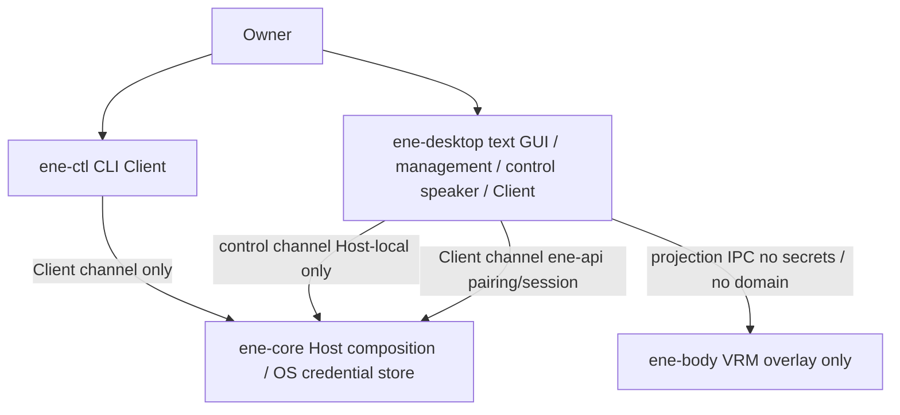
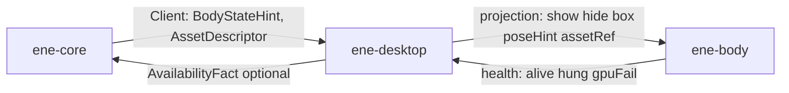

# First-party desktop の実行構成 — Host / GUI / Body

本書は、first-party のデスクトップ実行（初回セットアップ、text GUI、透明 VRM overlay、Host-local の高権限確認）について、プロセス境界・信頼境界・依存選定・性能の測り方を具体化する。製品 behavior は [要件](../../requirements/requirements.md) と [受け入れ条件](../../requirements/acceptance.md) が正本である。Host が durable authority であること、connection / incarnation / presence / presentation を同一視しないこと、credential 生値を Client wire・DB・log に出さないことは、[実行トポロジ](../architecture/runtime-topology.md)、[Host↔Client IPC](host-client-ipc.md)、[インターフェース境界](interface-boundaries.md) が既に固定しており、本書はそれを再設計しない。

crate 名と依存方向の表は [Crate / Module 分解](crate-module-decomposition.md) が所有する。本書は **process 寿命、障害境界、Host-local control、投影 IPC、性能の分母、実機 probe 契約** を所有する。上位設計との優先順位は [設計文書 README](../README.md#設計文書の優先順位と信頼できる情報源) に従う。

`.old/` の `ene-stage` 画面・3D 合成・`.slint` 資産は参考にも移植対象にもしない。Slint を採るのは旧実装の継続ではなく、text GUI のレイアウト自由度に対する独立選定である。

## 1. 対象と非対象

### 1.1 本書が具体化するもの

- first-party 実行を構成する process と寿命（第2節）。
- text UI と VRM overlay を同一 process にしない理由、および Body を paired Client にしない理由（第3節）。
- desktop と Body の投影 IPC（Host Client プロトコルではない）（第4節）。
- Client channel と Host-local control channel の区別、credential の区間、失敗の非同一視（第5節）。
- application / crate / module の命名と「作らない名前」（第6節）。詳細な Host ドメイン分解は CM が所有する。
- 外部依存の採用と有力な不採用（第7節）。
- acceptance の Performance Gates を弱めない測り方と縮退順（第8節）。
- Windows 11 と NixOS 26.11 KDE Wayland で production 前に潰す probe。この文書を書いた時点では未実施である（第9節）。

### 1.2 本書が決めないもの

- Host 内部の semantic owner、CAS、store 契約。
- Client wire の DTO 一覧（IPC が所有する）。control のバイト列・メッセージ名の最終形。
- `.slint` の画面レイアウト、文言、テーマ。
- MToon GPU shader の完成度。未完の間は unlit/PBR fallback を許す。
- 同じ Client に複数個体が居るときの Body process 数（Milestone 1 は同梱 `ene` 1体で Body は1 process。GUI process に戻してはいけない、だけを固定する）。
- Voice、Observation、tray、remote Client、character 配布。Milestone 1 の非対象。

## 2. 導出した process 構成

必要な責務は3つで、寿命が違う。

- **Host (`apps/ene-core`)** は GUI / wgpu を持たない。Client 切断後も Task を続ける。control listener を serving 中に持つ。Body process の有無を知らない。
- **First-party GUI (`apps/ene-desktop`)** は通常ウィンドウの text / management（Slint）。Host より短命。閉じても Host は止まらない。overlay / 3D は持たない。Host の Client channel と control channel の両方を話す。Body の親。
- **Body (`apps/ene-body`)** は GUI の任意 child。Host にも Client protocol にも接続しない。落ちても chat / settings は生きる。`vrm-runtime` で VRM を動かし、wgpu に載せる。
- **CLI (`apps/ene-ctl`)** は Client channel のみ。control は話さない。製品 idle に常駐させない。

製品起動: `ene-desktop` が Host 未起動なら `ene-core serve` を detach 起動し、その後 control と Client に接続する。Host を GUI の子にしたままにしない。GUI を閉じても Host の serve は続く。

## 3. VRM 表示と text UI の分離

分離は3層ある。混同しない。

1. **Host vs Client（既存）** — マスターデータと Task 継続は Host。画面は投影。
2. **text UI vs VRM overlay（本書の process 分割）** — 同じ first-party 端末の中で、会話/管理の通常ウィンドウと透明アバターを別 process にする。
3. **描画 vs presence（Body は Client ではない）** — overlay が動いていることは「個体がその端末にいる」ことではない。帰属は Host の Client channel が決める。

IO-1（text）と IO-3（Body）と IO-5（管理）は同じ「入出力・提示」でも、単一の障害境界にまとめてはいけない（[client-presence-io-observation](../subsystems/client-presence-io-observation.md)）。acceptance §2.4 / §6、AD-13、SC-09 が「アバター描画が落ちても chat / 設定 / 復旧が使える」を要求する。crate 境界やスレッドでは足りない。

### 3.1 なぜ同一 process では足りない

GPU driver abort、wgpu device lost からの native panic、Wayland / DWM の overlay 不具合、SpringBone や shader のバグは、同じアドレス空間の chat を巻き込む。`catch_unwind` も別スレッドも、process ごと死ぬ abort は止められない。

ウィンドウの種類も違う。

- **text UI**: 不透明な通常ウィンドウ。IME、テキスト選択、リスト、ウィザード、キーボード。Slint + winit。
- **VRM overlay**: 透明、常時最前面相当、非矩形 hit-test、透明部分は click-through。Windows は layered/DWM、KDE は `zwlr_layer_shell_v1` + `wl_surface` input region。wgpu 直接。Slint に overlay をやらせない。

### 3.2 誰が何を持つか

- **`ene-desktop`**: Slint 画面、Client session、control speaker、Body の親。Host から `BodyStateHint` と asset descriptor を受け、投影に落とす。秘密・会話本文・management 決定は Body に渡さない。Body の起動完了を待たずに chat / 設定を出す。
- **`ene-body`**: overlay 窓、`vrm-runtime`、wgpu。hint から expression / SpringBone / LookAt を局所計算する。Host に繋がない。pairing / presence / credential / Task を知らない。crate 名 `ene-vrm` は使わない。
- **`ene-core`**: hint と静的 asset を Client（desktop）へ出すだけ（IPC §19）。Body crash を Companion stop / Task cancel にしない。

### 3.3 不採用

- 同一 process の2ウィンドウ / 描画スレッド — abort が chat を殺す。
- Body を第2の paired Client にする — presence / pairing を描画に混ぜる。overlay が落ちると「端末が居ない」になる。
- Body を Host に入れる — GPU が durable authority を殺す。
- Slint に wgpu overlay を合成する — 旧 `ene-stage` の失敗モード。
- iced_layershell で 3D — iced は 2D。Body は wgpu 直接。

## 4. 投影 IPC

Host の Client プロトコルではない。[ene-plugin-ipc](crate-module-decomposition.md) も Client listener も使わない。親 `ene-desktop` が child 起動時に socketpair / 匿名 pipe を渡す。長さ付きの小さなメッセージだけ。

desktop → body:

- `show` / `hide`
- 配置箱（位置・サイズ・HiDPI scale）
- pose hint（idle / listening / speaking / working / attention）。関節角や blendshape は載せない
- asset ref（パスまたは bytes への一時参照。Host 内部 PK ではない）
- shutdown

body → desktop:

- `ready` / `gpu_fail` / `asset_fail`
- health tick（無ければ hung）
- 局所 UI 事実（overlay の drag / resize / hide）。一般設定の候補であり、Host マスターへの直接書き込みではない
- 正常 exit / panic 相当の切断

禁止: API キー、会話本文、pairing token、Task command、management intent、Host アドレス。Body は秘密の erasure participant にしない（持たせないので消すものがない）。asset 一時キャッシュは desktop 側の erasure がファイルを消し、body には drop / restart を指示する。

## 5. Trust / credential / failure

現行実装の穴（design をコードに合わせない）:

1. `ene-core approve-*` は HostLock で serving 中に失敗する。テストだけ in-process `HostHandle` を使う。
2. 秘密は env にしか無く、Host 起動後に GUI から入れられない。
3. IPC §18 は「公式第一者画面」と書くが、判定手段が無かった。

### 5.1 二つの channel

- **Client channel**（既存 unix socket / named pipe、`ene-api`）: pairing, session, chat, filtered management, Task, erasure。`ene-desktop` と `ene-ctl` が話す。high-priv 最終確定はここで成立させない。`confirmed=true` 自己申告は `DeniedByBoundary`。`ManagementIntent` は候補のまま（IPC M-18）。
- **Control channel**（別ソケット。Linux: runtime dir の control socket + peer UID。Windows: より狭い DACL の named pipe + peer token）: setup wizard の秘密入力、credential `put`+approve、pairing 承認、deletion / reset 等の最終確認。DTO は `ene-local-control` に置き、`ene-api` に載せない。remote-capable ではない。`ene-ctl` は話さない。`ene-core approve-*` は serving 中この channel を使い、未起動時だけ現行の offline lock を使う。

SameMachine や同一 UID や paired だけでは足りない、の意味は **「Client protocol では足りない」**。単一ユーザー製品では、同一 OS ユーザーで data dir を読める攻撃者は Owner と同一視する。control socket を開ける同一 UID の process を、コード署名で `ene-desktop` だけに制限することは Milestone 1 ではしない。区別するのは remote Client、LLM、tool、plugin、Computer Use である。それらが control の最終確認を代理できないこと、および Client wire の自己申告が確認を代替できないことを契約にする。

### 5.2 Credential

本番 GUI 経路の正本は OS 秘密店（`keyring`: Windows Credential Manager、Linux Secret Service / KWallet）。現行 `EnvCredentialStore`（起動時に `ENE_OPENAI_API_KEY` を pin）はテスト / dev に残し、serving 中の `put` が必要な製品セットアップの正本にしない。

生キーの区間: Owner の control 入力 → Host credential owner → OS store。Client payload / Body / log には乗らない。desktop の入力 widget メモリは erasure participant。

Setup readiness は wizard boolean ではなく、credential usable + assignment / consent の既存 durable fact から導出する。登録だけでは provider 0 呼出し。

### 5.3 寿命と失敗（混同しない）

- GUI を開く ≠ Body が ready。chat は Body なしで動く。
- Body を hide する ≠ Companion Stop。個体は Host 上で Running のまま。
- Body が exit / crash する ≠ Task cancel。Host は Client 切断とも見なさない（desktop は生きている）。
- Body を restart する ≠ domain replay。同じ hint / asset を再投影するだけ。Host に command を再送しない。
- GUI を閉じる → child Body は落とす。Host は serve 継続。
- Host を止める → desktop は切断を表示する。Body は最後の hint のまま動かすか hide する。どちらも「個体が別端末に移った」ことにはしない。

高負荷や fullscreen は desktop が検知して body に quality down / pause を出す。chat の入力経路は止めない。優先順位は第8節。

## 6. Application / crate / module

| 名前 | 役割 | いつ作るか |
|---|---|---|
| `apps/ene-core` | Host composition。control listener を serving 中に持つ | 既存。Stage 7 A1 で control を足す |
| `apps/ene-ctl` | CLI Client。Client channel のみ | 既存。control は話さない |
| `apps/ene-desktop` | 製品 GUI（Slint） | A1/B |
| `apps/ene-body` | VRM overlay（`vrm-runtime` + wgpu） | D。compile 隔離のため別 package |
| `crates/ene-client` | Host Client IPC（handshake, correlation, device identity, erasure participant） | A1 で `ene-ctl` から抽出。GUI は `ene-ctl` に依存しない |
| `crates/ene-local-control` | Host-local control DTO。`ene-api` に載せない | A1 と同時の最小 crate |

作らない: `ene-stage`, `ene-stage-ui`, `ene-vrm`, `ene-tray-linux`。トレイは Milestone 1 に無い。`ene-character` / `ene-plugin-host` も GUI のために先行 scaffold しない。同梱 `ene` の VRM は install asset とし、Host が W-7 descriptor を出し、GUI が Body へパス/バイトだけ渡す。

生成 Slint 束縛が workspace clippy（`-D warnings`）と衝突する場合だけ、生成物専用の compile-isolation モジュール/crate を `ene-desktop` の隣に置いてよい。名前は `ene-stage-ui` に戻さない。ドメイン判断・IPC・秘密は入れない。

`ene-desktop` 内 module: `ui`（`.slint` + 束縛）、`session`（`ene-client`）、`control`、`body_supervise`、`i18n`、`erasure`。`ene-body` 内: `window`（OS overlay）、`vrm`（`vrm-runtime`）、`render`、`ipc`。

Host ドメイン分解（companion / task / …）は CM を維持する。

## 7. 依存の採用と不採用

### 7.1 Text GUI: Slint（採用）

winit backend、通常ウィンドウのみ。Royalty-free Desktop。About から辿れる画面に `AboutSlint`（または同等 attribution）を置く。GPL にはしない。旧 `.slint` / `ene-stage-ui` はコピーしない。Qt backend は入れない。overlay / layer-shell / 透明ヒットテストは Slint にやらせない。

採る理由:

- 宣言的レイアウト、テーマ、複数画面、リスト/フォーム、キーボード導線を、imgui 風の見た目に落とさずに組める。
- Body を別 process にしたので、Slint と wgpu overlay の同一 process 合成はしない。
- Windows 11 と Linux を一つの `.slint` セットで賄える。GTK のような OS 二重 UI にしない。
- IME は winit の composition イベント（Wayland `zwp_text_input_v3` / Windows TSF）に乗る。未確定入力は commit まで送らない。

不採用:

- **egui / eframe**: 即時モードのツール UI 向きで、会話タイムライン・セットアップウィザード・日英の製品画面としての自由度が足りない。
- **iced**: MIT でアプリらしいが、レイアウト/見た目の自由度は Slint より低い。**Slint の IME / Wayland / Windows 実機 probe が失敗したときの fallback** であり、既定にはしない。
- **GTK / relm4**: KDE は強いが Windows 11 が第二級。
- **Tauri / webview**: CSS 級の自由度と IME は強い。秘密入力面・二言語 runtime・常駐重量が Stage 7 と 2 GiB gate に対して過大。

### 7.2 VRM: `vrm-runtime`（採用）

renderer-agnostic な VRM 1.0 loader / runtime（expression・humanoid・LookAt・SpringBone・VRMA・MToon 評価）。0.1 でも手書き extras より小さい。待機/発話の仕草に SpringBone は要る。同梱 `ene` がそれを前提にするならなおさら自前にしない。

`ene-body` は `AvatarAsset` / `AvatarRuntime` から `GpuFrameView` を受けて wgpu に載せる。バージョンは Cargo.lock で固定し、0.1 の API 変動は lock 更新で追う。MToon の GPU 実装まで `vrm-runtime` は肩代わりしない。shader が未完の間は spec どおり unlit/PBR fallback を許すが、SpringBone や expression の CPU runtime を理由に落とさない。

不採用:

- **gltf + 手書き `VRMC_vrm` extras**: loader は小さくなるが SpringBone / expression / LookAt を自前で持つ。実装量が増える。
- **Bevy / bevy_vrm**: compile / idle CPU / 2 GiB 常駐に対して過大。
- **winit AlwaysOnTop on Wayland**: プロトコル上存在せず、GNOME/KDE で失敗する既知制約。

### 7.3 Overlay windowing と描画

- Windows: `winit` + layered/DWM 透明と非矩形 hit-test。
- KDE Wayland: `wayland-client` + `zwlr_layer_shell_v1` + ARGB + input region。XWayland 成功を KDE Wayland 証拠にしない。
- 描画: `wgpu`。GPU device は `ene-body` だけ。desktop は Slint の 2D で wgpu overlay を持たない。

### 7.4 Credential store: `keyring`（採用）

第5.2節。テスト / dev の env pin は残してよい。

## 8. パフォーマンス

閾値の正本は [acceptance の Performance Gates](../../requirements/acceptance.md#性能基準-performance-gates)。本書は数値を下げず、分母と比較不能な％を同じ合格にしてはいけない、という測り方を固定する。この文書の時点では未測定であり、合格したとは書かない。

### 8.1 何が gate か

通常 avatar 表示中・推論なしの待機が基準。Body 非表示や renderer 停止は補助測定で、それで idle 合格を代替しない。Voice 等の未提供操作は対象外と明記する。headless CI の成功は実 GPU / compositor 性能の合格ではない。

- **idle CPU**: セットアップ後、推論なし 5 分。起動している全 ene process（`ene-core` + `ene-desktop` + `ene-body`。動かしているなら `ene-ctl` も）の CPU time を合計する。Body を除外しない。
- **resident memory**: 同じ区間の Host + 全 Client process 合計 ≤ 2 GiB。Body を除外しない。
- **avatar**: 同梱 `ene` の通常表示で平均 ≥ 30 FPS。他のデスクトップ操作を 1 秒以上 block しない。
- **操作受付**: cancel 等は入力から 1 秒以内に受付状態を出す。ローカルの「送信待ち」を Host 受付済みと偽らない。受付と完了は別。

### 8.2 分母

Windows と Linux で Task Manager / top の％は同じ意味ではない。生値を残し、合格判定の式を一つにする。

- **CPU 生値**: 各 PID の user+system time（Linux: `/proc/<pid>/stat` の utime+stime。Windows: `GetProcessTimes`）。5 分の wall と online logical CPU 数も記録する。
- **合格に使う％**: `100 * Σ cpu_seconds / (elapsed_wall * logical_cpus) ≤ 10`。マシン全体に対する使用率。
- **busy-wait 検出（追加。gate を弱めない）**: 同時に 1-core equivalent `Σ cpu_seconds / elapsed` を記録する。idle 中にどれか 1 process がほぼ 1 コアを埋めている（目安: その process の 1-core equivalent ≥ 0.5）なら、全体％が 10 未満でも不合格。16 コア機で 1 スレッド spin が 6％に見える穴を塞ぐ。
- **RSS**: Linux は各 PID の `VmRSS` 合計。Windows は Working Set 合計。ピークと区間平均を残す。GPU 専用 VRAM は診断として別記録し、RSS の代わりにしない。debug / sanitizer は対象外。release、exact SHA、build flags を添える。
- **FPS**: Body が実際に present した時刻（Windows: DXGI present。Wayland: frame callback）。要求した redraw 回数を FPS と数えない。warmup（初回 shader / pipeline）の後の連続区間。
- **desktop block**: overlay の透明領域が click-through であること、および描画 hitch が 1 秒以上ポインタ/キーボードを奪わないこと。合成器側の証拠（入力が下の窓へ届く）を残す。
- **操作受付**: Slint が「受付」を描いた時刻。Body frame や provider 応答を待たない。

記録する環境: OS、nixpkgs revision、KDE session / Windows build、CPU/GPU/driver、解像度と scale、UI 言語、asset、描画 backend、warmup と測定区間。

### 8.3 3 process でも 2 GiB / 10％に入れる

分割は RSS を増やす（Rust runtime が3つ）。その代わり GPU / wgpu は `ene-body` だけ、Host は vsync wait に入らない、高負荷時に Body だけ落とせる。

常駐を膨らませない選択が Bevy 不採用と Tauri/webview 不採用である。同梱 `ene` は一度ロードする。Host は VRM バイトのマスターを Client に二重キャッシュし続けない（IPC §19 の transient cache。revision で捨てる）。`ene-ctl` を製品 idle に常駐させない。

### 8.4 idle CPU と 30 FPS

危ないのは、何も起きていないのに 60/120 Hz で SpringBone + present し続けること。

- Body の目標は平均 30 FPS（gate が 30。60 を追わない）。present 待ち（vsync / frame callback）。busy present しない。
- pose hint は状態変化のときだけ。関節角を IPC しない。SpringBone / LookAt / expression は body 局所、30 Hz。
- hide / fullscreen / 高負荷 pause では present を止める。GPU を回したまま透明描画しない。
- desktop の Slint はイベント駆動。Host I/O・provider wait・body IPC で event loop を塞がない。
- Host は描画 tick を持たない。health tick は数 Hz 以下。

SpringBone は待機の仕草に要るので idle でランタイムごと外さない。足りなければイテレーション回数やコライダ精度を先に落とす。MToon の重い GPU が未完なら unlit/PBR fallback を許す。見た目の品質であり、SpringBone を理由に 30 FPS を捨てない。初回 PSO は測定前 warmup。GUI の redraw と Body の present は同じループにしない。

透明 overlay の入力領域を実シルエットに近づけ、デスクトップ全体を hit-test しない。これが「他の操作を邪魔しない」の本体である。

### 8.5 操作の 1 秒と縮退順（AD-13）

cancel / 一時停止等は `ene-desktop` の経路。Body の frame 完了も GPU reset も待たない。「受付」は Host が command を intake した事実の投影。overlay の drag / resize は body 局所。毎ピクセル Host に投げない。離したあと一般設定候補として desktop が Host に出す。

守るもの（先）: 入力受付、cancel、設定/復旧、Host-only Task、chat 本文の送受信。

落とすもの（先）: Body の解像度 / MSAA / SpringBone 精度 → 15 FPS → present pause / hide。fullscreen 中は Body を休止（要件どおり）。Host を落とさない。Body を殺しても chat は生きる。

## 9. 実機 probe（未実施）

この文書を書いた Cloud Agent 環境は Windows 11 desktop も NixOS 26.11 KDE Wayland session も持たない。以下は必須項目として固定し、**未実施**と明示する。合格したとは書かない。A1 の Host/control/`ene-client` は Stage 6 完了後の統合 base に積んでよい。B（画面）と D（描画）の production は、該当 probe が潰れてから入る。

対象: Windows 11 x86-64 / NixOS 26.11 x86-64 KDE Wayland。実際の session / backend を記録する。

- Slint 通常ウィンドウ: 日本語 IME composition（未確定を送らない、候補ウィンドウ位置）、HiDPI、focus、日英切り替え。
- Body 透明ウィンドウ、drag / resize、hide / restore。
- HiDPI / scaling、focus / pointer（Body 側）。
- `vrm-runtime` で VRM 1.0 を読み、透明描画、idle / speaking の expression、SpringBone が動くこと。
- Wayland: layer-shell + input region の click-through。XWayland 成功を KDE Wayland 証拠にしない。
- Windows: layered/DWM 透明と非矩形 hit-test。
- Body crash / hang / GPU init failure のあと chat / cancel / settings が生きる。
- 第8節の測り方そのもの（5分 idle の全 PID CPU time、logical CPU 分母、1-core equivalent、VmRSS / Working Set 合計、present 時刻、click-through）。release SHA と session/GPU を記録する。

## 10. 残した Design Freedom

- control / 投影 IPC の具体的なメッセージ識別子とフレーム長上限（契約は「小さい」「秘密を載せない」まで）。
- Body の camera / lighting、MToon をいつ完成させるか。
- 複数 Companion を同じ Client に出すときの renderer 数。
- iced へ切り替える判断は第9節の IME / windowing probe が失敗したときに限る。

プロセスを GUI と Body で分けること、Host に GPU を入れないこと、control を `ene-api` に載せないことは Freedom ではない。

## 11. Traceability

| 判断 | 根拠 |
|---|---|
| Host に GUI/wgpu を置かない | RT-01、SC-09、AD-01 |
| text と Body を別 process | IO-3 / IO-7、acceptance §2.4 / §6、AD-13、SC-09 |
| Body は Client ではない | RT-02、IPC §19、X-C |
| high-priv は control、Client の intent は候補 | 要件「信頼境界」、IPC §18、IB 第9節 |
| credential 生値は OS store まで | AD-14、IPC §18.1 |
| 性能の分母と全 process 計上 | acceptance Performance Gates、#1636 §6 |
| Slint / `vrm-runtime` / `keyring` | 第7節の比較。要件に toolkit 名は無い |
