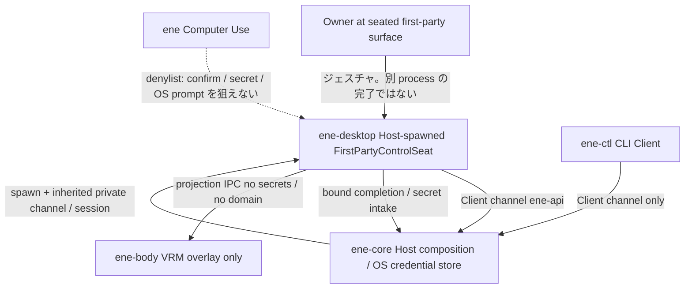
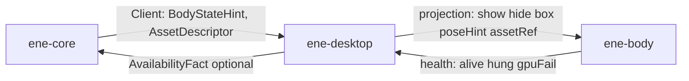

# First-party desktop の実行構成 — Host / GUI / Body

本書は、first-party のデスクトップ実行（初回セットアップ、text GUI、透明 VRM overlay、Host-local の高権限確認）について、プロセス境界・信頼境界・依存選定・性能の測り方を具体化する。製品 behavior は [要件](../../requirements/requirements.md) と [受け入れ条件](../../requirements/acceptance.md) が正本である。Host が durable authority であること、connection / incarnation / presence / presentation を同一視しないこと、credential 生値を Client wire・DB・log に出さないことは、[実行トポロジ](../architecture/runtime-topology.md)、[Host↔Client IPC](host-client-ipc.md)、[インターフェース境界](interface-boundaries.md) が既に固定しており、本書はそれを再設計しない。

crate 名と依存方向の表は [Crate / Module 分解](crate-module-decomposition.md) が所有する。本書は **process 寿命、障害境界、Host-local control、Owner 確認、credential の区間と破棄、投影 IPC、性能の分母、provisional 依存、実機 probe と最終 acceptance の分離** を所有する。上位設計との優先順位は [設計文書 README](../README.md#設計文書の優先順位と信頼できる情報源) に従う。

`.old/` の `ene-stage` 画面・3D 合成・`.slint` 資産は参考にも移植対象にもしない。text GUI toolkit を採るのは旧実装の継続ではなく、レイアウト自由度に対する独立選定である。未検証の crate / OS backend は第7節の **provisional** であり、probe 合格前に恒久 contract として固定しない。

## 1. 対象と非対象

### 1.1 本書が具体化するもの

- first-party 実行を構成する process と寿命（第2節）。
- text UI と VRM overlay を同一 process にしない理由、および Body を paired Client にしない理由（第3節）。
- desktop と Body の投影 IPC（Host Client プロトコルではない）（第4節）。
- Client channel、要求専用 control listener、Host が起動した GUI だけに継承する確認 channel の区別、exclusive `FirstPartyControlSeat`、直接確認、ene Computer Use の denylist、credential の区間と破棄、失敗の非同一視（第5節）。
- application / crate / module の命名と「作らない名前」（第6節）。詳細な Host ドメイン分解は CM が所有する。
- 確定する不採用と、probe 前は provisional に留める依存（第7節）。
- acceptance の Performance Gates を弱めない測り方と縮退順（第8節）。
- 今実施できる技術成立 probe と、Support Matrix 上の最終 acceptance の分離（第9節）。この文書を書いた時点ではどちらも未実施である。

### 1.2 本書が決めないもの

- Host 内部の semantic owner の再分割。credential の世代公開は [Credential publication](credential-publication.md) が所有する。
- Client wire の DTO 一覧（IPC が所有する）。control のバイト列・メッセージ名の最終形。
- 画面レイアウト、文言、テーマ。
- MToon GPU shader の完成度。未完の間は unlit/PBR fallback を許す。
- 同じ Client に複数個体が居るときの Body process 数（Milestone 1 は同梱 `ene` 1体で Body は1 process。GUI process に戻してはいけない、だけを固定する）。
- Voice、Observation、tray、remote Client、character 配布。Milestone 1 の非対象。
- 未検証 crate のバージョン pin を恒久 contract にすること（第7節）。

## 2. 導出した process 構成

必要な責務は3つで、寿命が違う。この分割自体は確定である。toolkit 名は第7節の provisional を指す。

- **Host (`apps/ene-core`)** は GUI / wgpu を持たない。Client 切断後も Task を続ける。要求専用 control listener を持ち、公式 GUI の起動・専用 channel・生存記録から `FirstPartyControlSeat` を発行する。`ConfirmationSession` の唯一の minter / binder である。Body process の有無は知らない。
- **First-party GUI (`apps/ene-desktop`)** は通常ウィンドウの text / management。Host が起動する短命の子であり、閉じても Host は止まらない。overlay / 3D は持たない。Client channel と継承した確認 channel を話し、Body の親となる。公開 endpoint の接続者を確認面へ昇格させない（第5.1節）。
- **Body (`apps/ene-body`)** は GUI の任意 child。Host にも Client protocol にも接続しない。落ちても chat / settings は生きる。VRM runtime（provisional: 第7.2節）で VRM を動かし、wgpu に載せる。
- **CLI (`apps/ene-ctl`)** は Client channel のみ。control を話さず、Body と同様に確認 channel を継承しない。製品 idle に常駐させない。

製品起動: ユーザーが起動した `ene-desktop` は短命の launcher として、Host 未起動なら `ene-core serve` を detach 起動し、要求専用 listener へ `OpenDesktop` を送り終了する。Host が公式 `ene-desktop` を GUI mode で起動して専用 channel を継承させる。既存 GUI がある場合は新しい席を作らず、その GUI を表示する。常駐は Host / GUI / Body の3 process であり、launcher 終了や GUI close は Host を止めない。Host の自動ログイン起動は導入しない。

## 3. VRM 表示と text UI の分離

分離は3層ある。混同しない。

1. **Host vs Client（既存）** — マスターデータと Task 継続は Host。画面は投影。
2. **text UI vs VRM overlay（本書の process 分割）** — 同じ first-party 端末の中で、会話/管理の通常ウィンドウと透明アバターを別 process にする。
3. **描画 vs presence（Body は Client ではない）** — overlay が動いていることは「個体がその端末にいる」ことではない。帰属は Host の Client channel が決める。

IO-1（text）と IO-3（Body）と IO-5（管理）は同じ「入出力・提示」でも、単一の障害境界にまとめてはいけない（[client-presence-io-observation](../subsystems/client-presence-io-observation.md)）。acceptance §2.4 / §6、AD-13、SC-09 が「アバター描画が落ちても chat / 設定 / 復旧が使える」を要求する。crate 境界やスレッドでは足りない。

### 3.1 なぜ同一 process では足りない

GPU driver abort、wgpu device lost からの native panic、Wayland / DWM の overlay 不具合、SpringBone や shader のバグは、同じアドレス空間の chat を巻き込む。`catch_unwind` も別スレッドも、process ごと死ぬ abort は止められない。

ウィンドウの種類も違う。

- **text UI**: 不透明な通常ウィンドウ。IME、テキスト選択、リスト、ウィザード、キーボード。
- **VRM overlay**: 透明、常時最前面相当、非矩形 hit-test、透明部分は click-through。Windows は layered/DWM、KDE は layer-shell + input region を **provisional** に置く（第7.3節）。wgpu 直接。text GUI toolkit に overlay をやらせない。

### 3.2 誰が何を持つか

- **`ene-desktop`**: 画面、Client session、control speaker、Body の親。Host から `BodyStateHint` と asset descriptor を受け、投影に落とす。秘密・会話本文・management 決定は Body に渡さない。Body の起動完了を待たずに chat / 設定を出す。
- **`ene-body`**: overlay 窓、VRM runtime、wgpu。hint から expression / SpringBone / LookAt を局所計算する。Host に繋がない。pairing / presence / credential / Task を知らない。crate 名 `ene-vrm` は使わない。
- **`ene-core`**: hint と静的 asset を Client（desktop）へ出すだけ（IPC §19）。Body crash を Companion stop / Task cancel にしない。

### 3.3 不採用

- 同一 process の2ウィンドウ / 描画スレッド — abort が chat を殺す。
- Body を第2の paired Client にする — presence / pairing を描画に混ぜる。overlay が落ちると「端末が居ない」になる。
- Body を Host に入れる — GPU が durable authority を殺す。
- text GUI toolkit に wgpu overlay を合成する — 旧 `ene-stage` の失敗モード。
- iced_layershell で 3D — iced は 2D。Body は wgpu 直接。

## 4. 投影 IPC

Host の Client プロトコルではない。[ene-plugin-ipc](crate-module-decomposition.md) も Client listener も使わない。親 `ene-desktop` が child 起動時に socketpair / 匿名 pipe を渡す。長さ付きの小さなメッセージだけ。

desktop → body:

- `show` / `hide`
- 配置箱（位置・サイズ・HiDPI scale）
- pose hint（idle / listening / speaking / working / attention）。関節角や blendshape は載せない
- asset ref（パスまたは bytes への一時参照。Host 内部 PK ではない）
- shutdown

body → desktop:

- `ready` / `gpu_fail` / `asset_fail`
- health tick（無ければ hung）
- 局所 UI 事実（overlay の drag / resize / hide）。一般設定の候補であり、Host マスターへの直接書き込みではない
- 正常 exit / panic 相当の切断

禁止: API キー、会話本文、pairing token、Task command、management intent、Host アドレス。Body は秘密の保持者にしない（持たせないので消すものがない）。asset 一時キャッシュは desktop 側の通常 erasure がユーザー内容ファイルを消し、body には drop / restart を指示する。秘密寿命を Targeted Deletion に依存させない（第5.2節）。

## 5. Trust / credential / failure

現行実装の穴（design をコードに合わせない）:

1. `ene-core approve-*` は HostLock で serving 中に失敗する。テストだけ in-process `HostHandle` を使う。
2. 秘密は env にしか無く、Host 起動後に GUI から入れられない。
3. IPC §18 は「公式第一者画面」と書くが、判定手段が無かった。同一 UID や control socket を開けたことをその手段にしてはいけない。
4. nonce だけの `ConfirmationSession` は freshness しか証明しない。seat の exclusive 性と接続束縛は、空席を先に取った process の真正性を証明しない。

### 5.1 二つの channel と Owner 確認

要件「信頼境界」の本人による直接確認を、[Runtime Topology の信頼前提](../architecture/runtime-topology.md#第一者確認面の信頼前提)の下で満たす。確認面の由来、確認対象の freshness、ユーザーの直接操作は別の条件であり、すべて必要である。

- **Client channel**（既存の unix socket / named pipe、`ene-api`）: pairing、session、chat、filtered management、Task、erasure。`ManagementIntent` は候補であり、`confirmed=true` は `DeniedByBoundary`。通常の GUI Client 経路も最終確認にはならない。
- **Host-local control**（`ene-local-control`）: **要求専用 listener** と **非公開の確認 channel** に分ける。前者は公開 local endpoint の request / 非秘密 outcome、後者は Host が起動した GUI への challenge、秘密 intake、session completion を扱う。二つの役割は別の frame enum と dispatch にし、requester に確認 frame を decode・転送させない。どちらも remote WebSocket や `ene-api` に載せない。

要求専用 listener は Linux の保護された runtime directory + peer UID、Windows の logon SID DACL + peer token / `PIPE_REJECT_REMOTE_CLIENTS` で同じ local user に限定する。ただし local transport の適格性を確認権限にしない。複数 requester は利用できるが、listener から seat を取得する操作は提供しない。

#### 5.1.1 `ConfirmationSession` の成立条件

1. Host が、操作種別・対象 identity・expected revision / generation・request または mutation ID に束縛した one-shot session を mint する。
2. 提示先は第5.1.2節で発行した live な seat の専用 channel だけである。Host が正規化した対象と影響を GUI が表示し、ユーザーがその面で直接確認する。起動要求、画面の表示、CLI 入力、OS store unlock だけでは完了しない。
3. 完了は mint 時と同じ Host incarnation / seat generation / 専用 channel から届き、Host の子 process 生存記録とも一致する。nonce は freshness のためであり、知っていることや PID を申告したことは権限にならない。
4. owner の確定境界で現在の対象と前提、期限、未消費、seat の live 性を再照合して消費する。GUI close / channel 切断 / session expiry と確定は Host の control admission 内で直列化し、失効が先なら拒否、commit が先なら確定結果を保持する。credential 更新の取得順序は control admission → credential publication guard → SQLite とする。前提が変わったら新しい確認が必要である。
5. Client / requester の `confirmed=true`、別 channel の nonce、tool / plugin / LLM の DTO、`EffectReport` は最終確認として拒否する。

nonce・確認 frame・秘密は通常 log / Debug、公開 request outcome、Client wire、投影 IPC に出さない。登録された秘密の有効化と session の消費は [Credential publication](credential-publication.md) の commit 境界に従う。

#### 5.1.2 `FirstPartyControlSeat` の発行と再起動

Host が公式 GUI を起動して渡した endpoint だけを seat として登録する。空席でも、一般 local 接続者を seat へ昇格させない。

- Host は信頼されたインストールから固定した GUI executable を選ぶ。request のパス、cwd、`PATH`、読み込むコードを変更する環境変数で選ばない。子の cwd / loader 環境を固定し、launcher から任意の GUI 引数を引き継がない。
- Linux は Host が作る unnamed socketpair の片端、Windows は一組の匿名 pipe の必要な child handles だけを渡す。Linux の不要 fd は close-on-exec、Windows は `PROC_THREAD_ATTRIBUTE_HANDLE_LIST` による限定継承とする。GUI は受け取った確認 endpoint を直ちに非継承化し、Body / tool / plugin へ渡さない。
- Host は spawn で得た child identity / process handle と専用 endpoint、Host incarnation、seat generation を一緒に保持する。PID の数値や実行パスを申告させて既存 process を認証する方式ではない。Linux の socketpair 作成時の `SO_PEERCRED` は creator の情報なので、それを起動後 GUI の PID 証明に使わない。
- `OpenDesktop` の並行要求は Host で直列化し、起動中の child も席の予約に含める。既存 GUI が生きていれば表示要求に収束し、第二 requester が席を奪うことはない。子の起動失敗 / init timeout は endpoint を閉じ、`ConfirmationUnavailable` を返す。
- GUI close / crash / 専用 channel 喪失は未消費 session をすべて失効させる。GUI を再び開く際は Host が新しい子と endpoint を作る。通常 Client channel の再接続とは区別する。古い GUI が専用 channel を失った場合は秘密を破棄して確認面を閉じ、公開 listener から復帰しない。
- Host restart は seat も session も復旧しない。旧 GUI は専用 channel の EOF で終了し、新 Host が新 GUI を起動する。live な旧子の終了が確認できない同一 Host 内の再起動では、旧席を再利用せず unavailable とする。

OS の継承仕様は [Windows handle inheritance](https://learn.microsoft.com/en-us/windows/win32/procthread/inheritance) と [Linux unix sockets](https://man7.org/linux/man-pages/man7/unix.7.html) に従う。これは信頼されたコードの起動由来を固定する方式であり、OS / インストール / process が侵害されていても真正性を証明できるという主張ではない。

#### 5.1.3 Computer Use と直接操作

GUI は Host が提示した対象を表示し、当該面の直接確認イベントだけを completion に写す。自動起動、focus、既定ボタンの自動実行、CLI の affirmative flag を completion に写さない。

- Host は `ClientActionCommand` の対象から、first-party 確認面・credential 入力面・OS 保護ストア prompt を除外する。
- Computer Use adapter もこれらへの pointer / key 注入を拒否する。画面・focus の対象を確実に特定できない操作は実行しない。Host の誤発行や座標変化を理由に確認面へ入力を通さない。
- Observation も秘密面をキャプチャ対象にしない。`EffectReport` は確認完了型ではない。
- Stage 7 で Computer Use production を提供しない場合、その経路は unsupported のままにする。将来追加するときも、この拒否を有効化の gate にする。

#### 5.1.4 Threat model

| 主体・条件 | 最終確認 | 強制手段・前提 |
|---|---|---|
| remote / 通常 Client、製品 `ene-ctl` | 不可 | Client wire に完了権限がない |
| 同一 UID の requester（空席時を含む）、`ene-core approve-*` | 不可 | 要求専用 listener は seat 発行も completion も提供しない |
| Host が起動した公式 GUI | 直接操作後だけ可能 | 継承 endpoint + child 生存記録 + session + owner の現在性照合 |
| Body / tool / plugin / LLM の入力 | 不可 | endpoint を渡さず、結果 DTO を completion にしない |
| ene が認可する Computer Use | 不可 | 確認面・秘密面への発行と注入を拒否 |
| OS / 公式コードの改変、debugger、handle 窃取、ene 外の OS 入力注入 | アプリ protocol の保証外 | Runtime Topology の OS・インストール・対話セッション完全性の前提 |

同じ UID であるだけの接続者は保証対象内であり、空席の取得を残差として許可しない。unlocked OS store の `put` 成功は本人確認を代替しない。Windows Hello 等の未検証 attestation を必須機構として仮定せず、上記の起動・専用 channel・直接確認を両 OS の probe で検証する。

#### 5.1.5 要求受付・GUI 不在・CLI

高権限の対象はペアリング承認、credential 登録・更新・失効、バックアップ復元と復元後の一括有効化、全データリセット、同等の信頼基点変更である。Targeted Deletion 等の既存 Host-local 最終確認も同じ要求/確認分離を使い、対象の意味は各 owner が保持する。

`ene-core approve-*` は要求専用 listener へ対象と期待前提を送り、Host 発行の request ID と非秘密 outcome を受ける。名前に approve を含んでも CLI は最終確認者ではない。GUI の seat が埋まっていても要求を受付可能とし、Host がその GUI へ challenge を渡す。

| 状態 | 要求側の outcome / 動作 |
|---|---|
| GUI が live | `AwaitingOwnerConfirmation`。GUI の直接確認または拒否を待つ |
| GUI 不在、起動可能 | Host が GUI を起動し、同じ要求を提示する。起動だけでは適用しない |
| GUI 未実装・起動失敗・対話 session 不在 | `ConfirmationUnavailable`。mutation はゼロ。CLI の `--yes` 等へ降格しない |
| 対象または revision が変化 | `StalePremise`。最新対象への自動承認をしない |
| 確認の拒否 / 期限切れ | `Rejected` / `Expired`。適用しない |
| owner が commit | owner の確定 outcome。完了前の受付を成功表示しない |

Host 未起動時の `approve-*` は `HostUnavailable` を返して明示起動を案内する。旧 offline mutation を fallback として残さない。製品の初回起動は第2節の launcher が Host を起動するため、通常セットアップで CLI 起動手順を要求しない。

requester が切断しても確認 authority は移らない。受理済み request の状況は同じ request ID で照会できる。未確定 session は Host restart で失効し、確定済み操作は各 owner の durable outcome から確認する。応答喪失を理由に mutation を自動再送しない。outcome が判明しない場合は `OutcomeUnavailable` と読み取り導線を返す。queue、pending 数、待機時間には上限を置き、満杯は `BackpressureHold` とする。

初回 pairing の端末認証材料は [IPC 第9.2節](host-client-ipc.md#92-pairing) の認証専用 frame を通じ、確認対象に束縛した元の pairing Client へ渡す。承認を要求した CLI の outcome / stdout や通常の業務 DTO には返さず、接続喪失後に別 requester へ渡し直さない。GUI 自身の初回 pairing も、専用 channel 上の本人確認と Client channel 上の認証手続きを分ける。provider credential 生値は GUI の秘密入力面からだけ受け、要求専用 listener には載せない。

### 5.2 Credential の区間と破棄

要件 Credential、S-1〜S-5、AD-14、IB K-C が正本である。生値はプロンプト・UI 表示・履歴・Memory・Task 結果・log・audit・debug・backup に出さない。`SecretValue` は public に返さない。利用は `with_credential` 型のスコープに閉じる。

本番の durable 置き場は **OS 保護ストア**（CM 既存: DPAPI / libsecret / Keychain 抽象。Windows Credential Manager、Linux Secret Service / KWallet）。Rust crate `keyring` はその adapter の **provisional 候補**であり、probe 前の恒久 contract ではない（第7.4節）。現行 `EnvCredentialStore`（起動時に `ENE_OPENAI_API_KEY` を pin）はテスト / dev に残し、serving 中の `put` が必要な製品セットアップの正本にしない。

ene が所有し、破棄を **強制できる** 区間:

| 区間 | 場所 | 生値 | 破棄 |
|---|---|---|---|
| C0 | 確認 session のみ。未入力 | 無い | — |
| C1 | first-party 秘密入力 widget が ene で確保したバッファ | Owner が打った直後だけ | control intake 成功直後に zeroize。cancel / timeout / 窓 close でも破棄。crash は best-effort |
| C2 | GUI と Host の専用確認 channel の secret-bearing frame | intake 中だけ | candidate の保存または拒否後に drop / zeroize。通常 request listener では受理しない |
| C3 | `ene-credential` 私有の candidate / immutable snapshot / scoped lease | 保存準備、公開世代、実行中利用・遅延結果の秘密除去に必要な間 | candidate 不採用時、snapshot / lease の最終利用終了時に zeroize。[世代公開契約](credential-publication.md)に従い、通常 DTO や public 戻り値に出さない |
| C4 | OS 保護ストアの version ごとの item | durable な正本と未公開 candidate | 明示更新・失効の後処理、または全データリセット。未確認の破棄は CleanupPending。backup に入れず、restore で巻き戻さない |
| C5 | 認証用途の scoped request/header | 当該 I/O 中だけ | I/O 完了・取消時に破棄。lease は遅延結果の秘密除去まで保持し、Task 結果やツール引数へ clone しない |

C1 は通常のテキスト入力ではない。timeline / 検索 / 永続 undo / 下書き保存の対象にしない。IME の未確定を chat へ commit しない。ene のコードが clipboard へコピーしない。

**ene が作らないこと（強制）:**

- `ene-api` Client payload、Body 投影、通常の management DTO
- `app.db` / `ene-store`、通常の GUI 永続 state、コマンドライン、製品の env put 経路
- 通常 DTO の `Debug` / `Display` / serde エラー、tracing、audit、debug dump
- バックアップ、crash report の自動外部送信
- Targeted Deletion の検索コーパス・検索トークン・削除対象本文。削除 sweep は秘密デストラクタではない。登録キーを「ユーザー内容」として ingest しない
- widget を `ErasureParticipant` に見立てて秘密寿命を削除協調へ預けること。ユーザーが chat に貼ったキー類似文字列の除去は既存 scrub（S-3）であり、OS store の破棄ではない

`ene-local-control` の秘密フィールドは redacted 型にする。通常 DTO の Debug 実装・log マクロ・永続化に秘密寿命を依存させない。Control 完了や拒否の監査は `CredentialRef` / session id / outcome だけを残し、生値を残さない。

**ene が破棄を保証できない残差（脅威として残し、無いとは書かない）:**

- GUI toolkit 内部の複製（ウィジェット文字列、描画テクスチャ、アクセシビリティツリー）
- IME / TSF / `zwp_text_input_v3` 側の composition バッファ、候補ウィンドウ
- ユーザーが自ら行った clipboard コピー、OS の clipboard 履歴、パスワードマネージャ
- compositor が短時間保持する入力イベント
- swap / pagefile / hibernation、OS の crash dump（WEN / systemd-coredump）
- `/proc/<pid>/mem`、debugger、同一 UID のメモリ読み
- C4 の keyring デーモン内部コピー（正本として残るのは意図どおり。unlocked セッションからの他 process 読みは OS store の脅威モデル）

残差を「zeroize したのでプロセスメモリに無い」と主張しない。保証するのは **ene が所有する durable コピーが C4 以外に無いこと** と、C1–C3–C5 の ene バッファを破棄することである。toolkit / OS の複製が残るかは probe で観測し、見つけたら追加の緩和（password 属性、アクセシビリティ非公開）を B で入れる。緩和できない分は残差のまま残す。

秘密更新の有効化時点、OS item と DB の失敗回復、snapshot / lease の寿命は [Credential publication](credential-publication.md) を正本とする。OS `put` 成功だけでは GUI に登録完了を返さない。Setup readiness は wizard boolean ではなく、credential usable + assignment / consent の既存 durable fact から導出する。登録だけでは provider 0 呼出し。

### 5.3 寿命と失敗（混同しない）

- GUI を開く ≠ Body が ready。chat は Body なしで動く。
- Body を hide する ≠ Companion Stop。個体は Host 上で Running のまま。
- Body が exit / crash する ≠ Task cancel。Host は Client 切断とも見なさない（desktop は生きている）。
- Body を restart する ≠ domain replay。同じ hint / asset を再投影するだけ。Host に command を再送しない。
- GUI を閉じる → child Body は落とす。Host は serve 継続。
- Host を止める / 専用確認 channel が切れる → GUI は session と一時秘密を破棄し、Body を終了して閉じる。次回起動は新しい seat とする。通常 Client channel だけの一時切断なら切断を表示して Body を hide し、古い表示を現在の滞在として示さない。どちらも「個体が別端末に移った」ことにはしない。

高負荷や fullscreen は desktop が検知して body に quality down / pause を出す。chat の入力経路は止めない。優先順位は第8節。

## 6. Application / crate / module

| 名前 | 役割 | いつ作るか |
|---|---|---|
| `apps/ene-core` | Host composition。要求専用 listener、GUI spawn と seat、session の minter | 既存。Stage 7 A1 で control を足す |
| `apps/ene-ctl` | CLI Client。Client channel のみ | 既存。control は話さない |
| `apps/ene-desktop` | 製品 GUI と first-party 確認面 | A1（接続）/ B（画面） |
| `apps/ene-body` | VRM overlay | D。compile 隔離のため別 package |
| `crates/ene-client` | Host Client IPC（handshake, correlation, device identity, erasure participant） | A1 で `ene-ctl` から抽出。GUI は `ene-ctl` に依存しない |
| `crates/ene-local-control` | 要求専用 DTO と専用確認 DTO を分ける。`ene-api` に載せず、秘密フィールドは redacted | A1 と同時の最小 crate |

作らない: `ene-stage`, `ene-stage-ui`, `ene-vrm`, `ene-tray-linux`。トレイは Milestone 1 に無い。`ene-character` / `ene-plugin-host` も GUI のために先行 scaffold しない。同梱 `ene` の VRM は install asset とし、Host が W-7 descriptor を出し、GUI が Body へパス/バイトだけ渡す。

生成 GUI 束縛が workspace clippy（`-D warnings`）と衝突する場合だけ、生成物専用の compile-isolation モジュール/crate を `ene-desktop` の隣に置いてよい。名前は `ene-stage-ui` に戻さない。ドメイン判断・IPC・秘密は入れない。

`ene-desktop` 内 module: `ui`、`session`（`ene-client`）、`control`、`body_supervise`、`i18n`、`erasure`。`ene-body` 内: `window`（OS overlay）、`vrm`、`render`、`ipc`。

Host ドメイン分解（companion / task / …）は CM を維持する。

## 7. 依存 — 確定する不採用と provisional 候補

process 分割・信頼境界・性能ゲートは確定である。**新しい GUI / VRM / overlay / keyring crate を、実機 probe 前に恒久 design contract として固定しない。** 以下は preferred candidate である。probe が通った時点で「採用」へ昇格し、失敗したら第7節の fallback / 再選定だけを動かす。要件は toolkit 名を固定していない。

### 7.1 Text GUI: Slint（provisional preferred）

候補: winit backend、通常ウィンドウのみ。Royalty-free Desktop。About から辿れる画面に `AboutSlint`（または同等 attribution）を置く。GPL にはしない。旧 `.slint` / `ene-stage-ui` はコピーしない。Qt backend は入れない。overlay / layer-shell / 透明ヒットテストは Slint にやらせない。

候補にする理由（probe で覆り得る）:

- 宣言的レイアウト、テーマ、複数画面、リスト/フォーム、キーボード導線を、imgui 風の見た目に落とさずに組める。
- Body を別 process にしたので、同一 process 合成はしない。
- Windows 11 と Linux を一つの UI 記述で賄える見込み。GTK のような OS 二重 UI にしない。
- IME は winit の composition イベント（Wayland `zwp_text_input_v3` / Windows TSF）に乗れる見込み。未確定入力は commit まで送らない。これは probe 項目である。

確定する不採用:

- **egui / eframe**: 即時モードのツール UI 向きで、会話タイムライン・セットアップウィザード・日英の製品画面としての自由度が足りない。
- **GTK / relm4**: KDE は強いが Windows 11 が第二級。
- **Tauri / webview**: CSS 級の自由度と IME は強い。秘密入力面・二言語 runtime・常駐重量が Stage 7 と 2 GiB gate に対して過大。

**iced** は MIT でアプリらしいが、レイアウト自由度は Slint より低い。**Slint の IME / Wayland / Windows 技術成立 probe が失敗したときの fallback 候補**であり、既定にも、probe 前の第二の確定採用にもしない。iced を使う判断が必要になった時点で、その IME / windowing も probe する。

### 7.2 VRM: `vrm-runtime`（provisional preferred）

renderer-agnostic な VRM 1.0 loader / runtime（expression・humanoid・LookAt・SpringBone・VRMA・MToon 評価）を使う案。0.1 でも手書き extras より小さい見込み。待機/発話の仕草に SpringBone は要るので、ランタイム選定の理由で SpringBone を落とさない。crate 名 `ene-vrm` は復活させない。

`ene-body` は loader/runtime から GPU 向け view を受けて wgpu に載せる。MToon の GPU 実装まで runtime crate は肩代わりしない。shader が未完の間は spec どおり unlit/PBR fallback を許す。0.1 の API 変動を恒久 contract にしない。lock へ入れるのは probe 後の採用決定のとき。

確定する不採用:

- **gltf + 手書き `VRMC_vrm` extras**: loader は小さくなるが SpringBone / expression / LookAt を自前で持つ。実装量が増える。`vrm-runtime` probe が失敗したあとの再選定であり、最初から自前 extras を正本にしない。
- **Bevy / bevy_vrm**: compile / idle CPU / 2 GiB 常駐に対して過大。
- **winit AlwaysOnTop on Wayland**: プロトコル上存在せず、GNOME/KDE で失敗する既知制約。

### 7.3 Overlay windowing と描画

描画 API として Body だけが `wgpu` を持つことは確定（Host / desktop に GPU device を置かない）。overlay の OS 手段は provisional:

- Windows: `winit` + layered/DWM 透明と非矩形 hit-test。
- KDE Wayland: `wayland-client` + `zwlr_layer_shell_v1` + ARGB + input region。

XWayland 成功を KDE Wayland 証拠にしない。desktop は 2D toolkit の通常ウィンドウだけを持ち、wgpu overlay を持たない。

### 7.4 Credential store adapter: `keyring`（provisional preferred）

OS 保護ストア抽象（DPAPI / libsecret / Keychain）は既存の確定契約である。`keyring` crate はそれを呼ぶ adapter 候補。Windows Credential Manager と Linux Secret Service / KWallet で version ごとの put / get / delete、永続性、store locked / OS 認可 dialog / restart 時の outcome を probe する。OS store の unlock は Owner の確認を代行しない。失敗したら同じ抽象のまま別 adapter を選ぶ。テスト / dev の env pin は残してよい。

## 8. パフォーマンス

閾値の正本は [acceptance の Performance Gates](../../requirements/acceptance.md#性能基準-performance-gates)。本書は数値を下げず、分母と比較不能な％を同じ合格にしてはいけない、という測り方を固定する。この文書の時点では未測定であり、合格したとは書かない。技術成立 probe の成功を性能合格の代替にしない。

### 8.1 何が gate か

通常 avatar 表示中・推論なしの待機が基準。Body 非表示や renderer 停止は補助測定で、それで idle 合格を代替しない。Voice 等の未提供操作は対象外と明記する。headless CI の成功は実 GPU / compositor 性能の合格ではない。

- **idle CPU**: セットアップ後、推論なし 5 分。起動している全 ene process（`ene-core` + `ene-desktop` + `ene-body`。動かしているなら `ene-ctl` も）の CPU time を合計する。Body を除外しない。
- **resident memory**: 同じ区間の Host + 全 Client process 合計 ≤ 2 GiB。Body を除外しない。
- **avatar**: 同梱 `ene` の通常表示で平均 ≥ 30 FPS。他のデスクトップ操作を 1 秒以上 block しない。
- **操作受付**: cancel 等は入力から 1 秒以内に受付状態を出す。ローカルの「送信待ち」を Host 受付済みと偽らない。受付と完了は別。

### 8.2 分母

Windows と Linux で Task Manager / top の％は同じ意味ではない。生値を残し、合格判定の式を一つにする。

- **CPU 生値**: 各 PID の user+system time（Linux: `/proc/<pid>/stat` の utime+stime。Windows: `GetProcessTimes`）。5 分の wall と online logical CPU 数も記録する。
- **合格に使う％**: `100 * Σ cpu_seconds / (elapsed_wall * logical_cpus) ≤ 10`。マシン全体に対する使用率。
- **busy-wait 検出（追加。gate を弱めない）**: 同時に 1-core equivalent `Σ cpu_seconds / elapsed` を記録する。idle 中にどれか 1 process がほぼ 1 コアを埋めている（目安: その process の 1-core equivalent ≥ 0.5）なら、全体％が 10 未満でも不合格。16 コア機で 1 スレッド spin が 6％に見える穴を塞ぐ。
- **RSS**: Linux は各 PID の `VmRSS` 合計。Windows は Working Set 合計。ピークと区間平均を残す。GPU 専用 VRAM は診断として別記録し、RSS の代わりにしない。debug / sanitizer は対象外。release、exact SHA、build flags を添える。
- **FPS**: warmup 後に固定した連続区間で、Body の内容更新が実際に表示された件数を wall time で割る。未表示 / 欠測を分子に入れず、欠測区間を黙って分母から除かない。Wayland は `wp_presentation.feedback` を commit に対応付け、`presented` の時刻・clock_id・output を記録する。`discarded` は表示件数ゼロ、未解決 feedback は欠測とする。`wl_surface.frame` は次の描画のタイミング通知にだけ使い、FPS の証拠にしない。Windows も `Present()` 呼出し回数ではなく、Body の PID / swap chain と対応した display timing（例: PresentMon の表示済みイベント）を使う。計測 API が利用できない、相関できない、trace が欠落した場合は「測定不能」であり合格にしない。
- **desktop block**: overlay の透明領域が click-through であること、および描画 hitch が 1 秒以上ポインタ/キーボードを奪わないこと。合成器側の証拠（入力が下の窓へ届く）を残す。
- **操作受付**: first-party GUI が「受付」を描いた時刻。Body frame や provider 応答を待たない。

計測根拠: [Wayland frame](https://wayland.freedesktop.org/docs/html/apa.html#protocol-spec-wl_surface-request-frame) は描画の pacing、[presentation feedback](https://docs.rs/wayland-protocols/latest/wayland_protocols/wp/presentation_time/server/wp_presentation_feedback/enum.Event.html) は presented / discarded の区別、[PresentMon](https://github.com/GameTechDev/PresentMon/blob/main/README-ConsoleApplication.md) は表示と drop の区別に使う。raw trace、commit / swap-chain 相関、集計方法を証拠に残す。

記録する環境: OS、nixpkgs revision または Windows build、KDE session、CPU/GPU/driver、解像度と scale、UI 言語、asset、描画 backend、warmup と測定区間。Linux 測定が 26.11 公式 acceptance でない場合は、その旨を記録する（第9節）。

### 8.3 3 process でも 2 GiB / 10％に入れる

分割は RSS を増やす（Rust runtime が3つ）。その代わり GPU / wgpu は `ene-body` だけ、Host は vsync wait に入らない、高負荷時に Body だけ落とせる。

常駐を膨らませない選択が Bevy 不採用と Tauri/webview 不採用である。同梱 `ene` は一度ロードする。Host は VRM バイトのマスターを Client に二重キャッシュし続けない（IPC §19 の transient cache。revision で捨てる）。`ene-ctl` を製品 idle に常駐させない。

### 8.4 idle CPU と 30 FPS

危ないのは、何も起きていないのに 60/120 Hz で SpringBone + present し続けること。

- Body は平均 30 FPS 以上の実表示を目標とし、pacing は vsync / frame callback で待つ。busy present しない。目標 tick 数を実表示 FPS の証拠にせず、30 Hz 固定で drop が発生する場合は測定に基づき余裕を設ける。
- pose hint は状態変化のときだけ。関節角を IPC しない。SpringBone / LookAt / expression は body 局所、30 Hz。
- hide / fullscreen / 高負荷 pause では present を止める。GPU を回したまま透明描画しない。
- desktop の GUI はイベント駆動。Host I/O・provider wait・body IPC で event loop を塞がない。
- Host は描画 tick を持たない。health tick は数 Hz 以下。

SpringBone は待機の仕草に要るので idle でランタイムごと外さない。足りなければイテレーション回数やコライダ精度を先に落とす。MToon の重い GPU が未完なら unlit/PBR fallback を許す。見た目の品質であり、SpringBone を理由に 30 FPS を捨てない。初回 PSO は測定前 warmup。GUI の redraw と Body の present は同じループにしない。

透明 overlay の入力領域を実シルエットに近づけ、デスクトップ全体を hit-test しない。これが「他の操作を邪魔しない」の本体である。

### 8.5 操作の 1 秒と縮退順（AD-13）

cancel / 一時停止等は `ene-desktop` の経路。Body の frame 完了も GPU reset も待たない。「受付」は Host が command を intake した事実の投影。overlay の drag / resize は body 局所。毎ピクセル Host に投げない。離したあと一般設定候補として desktop が Host に出す。

守るもの（先）: 入力受付、cancel、設定/復旧、Host-only Task、chat 本文の送受信。

落とすもの（先）: Body の解像度 / MSAA / SpringBone 精度 → 15 FPS → present pause / hide。fullscreen 中は Body を休止（要件どおり）。Host を落とさない。Body を殺しても chat は生きる。

## 9. Probe と最終 acceptance の分離

NixOS 26.11 は acceptance の Support Matrix 上の Linux 対象である。この文書の時点では正式リリース前であり、公式 26.11 desktop が無いことを理由に Stage 7 全体を止めてはいけない。技術成立 probe と最終 acceptance を混ぜない。

本設計の記載だけでは実機検証を実施したことにならない。以下の probe は各 OS の結果・exact tip が記録されるまで **未実施** と扱う。

### 9.1 今実施する技術成立 probe

目的: 第7節の provisional 候補を採用へ昇格できるか、または fallback 再選定が要るかを決める。性能ゲート合格の代替ではない。

Linux は **今使える KDE Wayland** でよい。実際の distro / nixpkgs revision / Plasma / compositor を記録する。これは NixOS 26.11 公式 acceptance の代用ではない。Windows は Windows 11 x86-64 が用意できたとき。

- text GUI toolkit（既定候補 Slint）: 日本語 IME composition（未確定を送らない、候補ウィンドウ位置）、HiDPI、focus、日英切り替え。
- Body 透明ウィンドウ、drag / resize、hide / restore。
- HiDPI / scaling、focus / pointer（Body 側）。
- VRM runtime 候補で VRM 1.0 を読み、透明描画、idle / speaking の expression、SpringBone が動くこと。
- Wayland: layer-shell + input region の click-through。XWayland 成功を KDE Wayland 証拠にしない。
- Windows: layered/DWM 透明と非矩形 hit-test。
- Body crash / hang / GPU init failure のあと chat / cancel / settings が生きる。
- OS 保護ストア adapter: version ごとの put / read-back / delete、locked / unavailable、再起動、partial failure を確認する。DB 有効化・snapshot 公開との競合と復旧は [Credential publication 第6節](credential-publication.md#6-実装-gate) に従う。unlocked store を Owner 証明にしない。
- 秘密入力 widget: ene バッファの zeroize、chat/undo/clipboard へ載せないこと。toolkit / IME / アクセシビリティツリーに残る複製は **保証できない残差** として観測し、無いとは書かない。
- 第8節の測り方そのもの（全 PID CPU time、VmRSS / Working Set、Wayland presented / discarded、Windows display timing、欠測検出、click-through）。描画要求より表示件数が少ないケースを注入し、誤合格しないことを検証する。数値ゲートの合否は slice F。

**slice との関係:**

- **A1** の接続抽出と control 基盤は GUI / overlay probe を待たない。Stage 6 完了後の統合 base に積む。Host が起動した child への限定継承・再起動と、credential publication の競合 / crash gate は A1 自身の必須検証である。GUI 未実装時は `ConfirmationUnavailable` とし、test child を製品承認面にしない。
- **B** の production GUI は、text GUI toolkit と秘密入力面、実 OS store adapter の両 OS probe、および A1 の後。製品の直接確認から有効化までをここで初めて開通する。
- **D** の production overlay は overlay + VRM runtime probe の後。renderer 単体は B と並行できるが、実 GUI の障害分離 gate は B の確認面・text 操作へ統合して通す。
- **C** の管理画面は B の GUI 面の後。overlay は待たない。

### 9.2 後日の最終 acceptance（slice F）

対象は acceptance Support Matrix: Windows 11 x86-64 と **正式リリースされた NixOS 26.11** x86-64 KDE Wayland。日本語と英語。性能ゲートを含む。

- 今の KDE Wayland probe 成功 ≠ 26.11 acceptance。
- headless CI 成功 ≠ desktop 合格。
- XWayland 成功 ≠ KDE Wayland 合格。
- 26.11 が F 開始時点で未リリースなら、Linux 最終 acceptance は open のまま残す。未リリース OS 上の測定を 26.11 合格と書かない。その間も A1 以降の Host / GUI 作業は止めてはいけない。

## 10. 残した Design Freedom

- control / 投影 IPC の具体的な frame encoding と上限値。要求専用と確認専用の区別、限定継承、結果・秘密の境界は変更しない。
- `ConfirmationSession` の nonce 長・期限秒・確認面の文言。surface 識別の OS 具体値。
- Body の camera / lighting、MToon をいつ完成させるか。
- 複数 Companion を同じ Client に出すときの renderer 数。
- Slint から iced への切替は第9.1節の IME / windowing probe が失敗したときに限る。別 toolkit を probe 無しで正本にしない。

GUI / Body の process 分離、Host に GPU を入れないこと、Host が起動した GUI への専用 endpoint 継承、requester へ seat を与えないこと、同一 UID を Owner 確認にしないこと、session と実際の直接確認、Computer Use の確認面拒否、credential の世代公開・秘密寿命は Freedom ではない。OS / インストール侵害まで排除できるという過剰保証をしない。

## 11. Traceability

| 判断 | 根拠 |
|---|---|
| Host に GUI/wgpu を置かない | RT-01、SC-09、AD-01 |
| text と Body を別 process | IO-3 / IO-7、acceptance §2.4 / §6、AD-13、SC-09 |
| Body は Client ではない | RT-02、IPC §19、X-C |
| high-priv は Host-spawned GUI の専用 seat と直接確認、requester は要求のみ | 要件「信頼境界」、Runtime Topology、IPC §18、IB 第9節、X-10 |
| ene Computer Use は確認面 / 秘密面を対象にできない。クリック後の区別はできない | X-10、DR 4.1 / 5.2、IPC §15 |
| credential の区間 C1–C5、世代公開、snapshot / lease 破棄 | 要件 Credential、S-1〜S-5、AD-14、IB K-C、Credential publication |
| 性能の分母と全 process 計上 | acceptance Performance Gates、#1636 §6 |
| Slint / `vrm-runtime` / `keyring` / layer-shell は provisional | 第7節。要件に toolkit 名は無い。probe 後に採用へ昇格 |
| 技術成立 probe と 26.11 最終 acceptance を分離 | acceptance Support Matrix。未リリース OS で Stage 7 全体を止めない |
