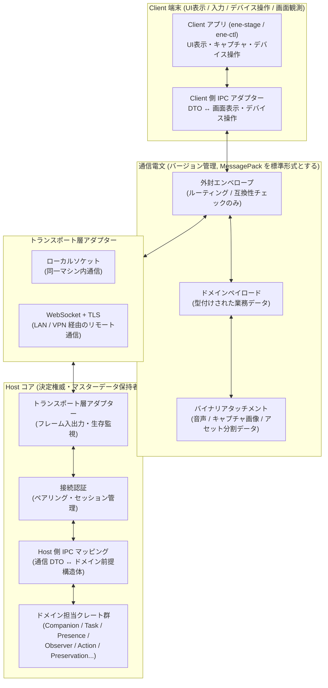

# Host↔Client IPC / wire protocol の具体設計 — Step 13 Concrete Design

本書は、Step 13 にあたる Host↔Client 間の IPC（プロセス間通信）および通信電文プロトコル（wire protocol）を具体化する設計文書です。[対応関係・識別](correspondence-identity.md)（CI）、[永続化と復旧](persistence-recovery.md)（PR）、[並行性制御](concurrency-control.md)（CCT）、[インターフェース境界](interface-boundaries.md)（IB）、[Crate / Module 分解](crate-module-decomposition.md)（CM）で定めた識別子の型分離、データの保存分類、並行性制御、インターフェース規約、クレート依存の向きを前提とし、これらを変更しません。上位設計との優先順位や食い違いが生じた際のルールは、[設計文書 README](../README.md#設計文書の優先順位と信頼できる情報源) に従います。

本書に記載された Rust の擬似コード型は、設計意図を明確にするためのものであり、そのままコンパイルすることを目的としたコードではありません。型名・フィールド名・メッセージ名を分かりやすい同義の名前に改名することは差し支えありませんが、型の分離と各フィールドの意味合いは必ず維持してください。Host と Client のクレート配置および通信 DTO クレート `ene-api` の境界は [Crate / Module 分解](crate-module-decomposition.md) 第8節に、識別子や世代の鮮度管理は CI / CCT の規定に従い、本書ではそれらを通信電文（wire）へ安全に落とし込む具体的な仕様を定めます。

## 1. 対象と非対象

### 1.1 本書が具体化するもの

- Host と Client のプロセス・ネットワーク境界を越える必要があるインターフェースの選定（第2節）。
- プロトコルの階層構造（通信電文の意味とトランスポート層の分離、エンベロープ（外封）とペイロード（中身）の分離）（第3・5節）。
- 通信インタラクションパターンの分類（第4節）。
- 電文識別子とドメイン識別子の明確な分離、リクエスト/レスポンスの相関付け、再試行の受入条件、冪等性の保持期間、コマンド ID の衝突を表現する型付き電文定義（第6・21・24節）。
- Client の起動世代（Incarnation）の管理と古い電文（Stale）の安全な拒否（第11節）。
- 存在状態（Presence）、テキスト対話、音声通信、提示制御（第12・13節）。
- 画面等の共有観測（Observation）プロトコル（第14節）。
- Client 端末に依存する外部操作（Computer Use 等）の安全な実行（第15節）。
- 処理の中断・キャンセル制御（Cancellation）（第16節）。
- 個人データ完全削除（Targeted Deletion）への Client 側の参加（第17節）。
- オーナー管理画面（Management Surface）と高権限操作の確認境界（第18節）。
- 3D/VRM 立ち絵などの表示リソースの供給（第19節）。
- 通信電文 DTO の擬似コード定義（第21節）。Host 側の内部ドメイン型に安易に `Serialize` を付けて直接公開することはせず、通信 DTO からドメインコマンドへの変換点を明確にします。
- シリアライズ形式の選定と比較（第7節）。単にデータ形式を選ぶだけで後方互換性が自動的に解決されるとは仮定しません。
- プロトコルのバージョン管理と互換性ルール（第7節）。
- 機能の交渉（Capability Negotiation）（第8節）。Client の自己申告は事実の提示にすぎず、実行権限（Permission）そのものとはみなしません。
- 認証とペアリング（第9節）。暗号ライブラリや鍵形式を過剰に固定せず、秘密情報を平文の通常電文に乗せない規約を定めます。
- トランスポート層のサポート範囲とアダプター境界（第10節）。
- 背圧制御（Backpressure）とストリーム制御（第22節）。システム全域での完全な大域順序を要求せず、重要な制御電文と高頻度なキャプチャ電文で同じ破棄ポリシーを適用しないようにします。
- セキュリティ境界（第23節）。型安全な DTO を使っていることだけでセキュリティ境界の代わりにはしません。
- エラーと拒否のモデル（第24節）。低レイヤーの通信エラーとビジネス上の正当な拒否（Stale や Denied 等）を混同しないようにします。
- クレート配置（第25節）。`ene-api` にビジネスロジックを置かず、相互マッピング処理を適切に分離します。
- 各ユースケースのウォークスルー検証（第26節）。通信の送信成功をビジネス処理の成功と勝手に読み替えないことを検証します。

### 1.2 本書が決めないもの（Design Freedom。第28節）

以下の事項は実装の裁量（Design Freedom）として残し、本書では固定しません。

- 具体的な暗号ライブラリ、鍵のフォーマット、鍵導出関数、証明書運用の詳細（満たすべきセキュリティ要件は第9節で固定）。
- ハートビートの間隔、キープアライブやタイムアウトの秒数、再試行回数、スケジューリングや画面キャプチャのアルゴリズム、利用枠（費用）の算定式。
- 具体的な TCP ポート番号、mDNS の有無、NAT 越え、リレーサーバーの運用（そもそも中央リレーは非目標であり導入しません）。
- 音声コーデックや画面キャプチャ画像形式の最終選定（満たすべき制約条件のみ第13・14節で固定）。
- Client 側の UI レイアウト、画面の文言、具体的なデータ保持期間、監査ログの出力形式。

## 2. Remote-capable 選別 — 何を wire へ出すか

IB 第15節で定めた「ネットワーク越境可能なインターフェース（Remote-capable interface）」を起点として、「ネットワークやプロセス境界を越えなければシステムとして成立しないか」という観点で厳密に選別します。内部インターフェースを機械的にすべて通信電文へ変換するような設計は行いません。

### 2.1 越境させるもの（wire 化する）

| # | 電文グループ | 境界を越境させる理由 | 対応する IB インターフェース | 越境させる最小限の内容 |
|---|---|---|---|---|
| W-1 | ユーザーのテキスト・音声入力および応答の提示 | Client は入力デバイスや画面表示の一時的な表現を受け持ち、Host 側がマスターデータを持つため | X-B（やり取り Round の受付・提示・区切り） | 入力候補（input candidate）、やり取りの参照 ID、ストリーム電文、提示完了の確認。会話のドメイン的な意味判断や履歴・記憶そのものは送信しない |
| W-2 | キャラクターの存在状態（Presence）と移動 | キャラクターの呼び出しや移動の意思は Client から届くが、存在の確定権威は Host 側の帰属記録にあるため | X-A（移動・復帰） | 移動の意図（intent）、切り替え受付確認（transition ack）、帰属事実の通知。移動ヒントや復旧先情報だけで勝手に存在を成立させない |
| W-3 | 未伝達メッセージの提示 | 別の Client に切り替わった後の要約報告は、Host 側の元記録と照合して生成される派生データであるため | X-H / H-G（未伝達メッセージの報告） | フィルタリング済みの要約データ、提示完了の確認。元のタスクや活動記録のマスターデータそのものは出さない |
| W-4 | Client 側の接続事実とデバイス能力 | Host 側がキャラクターの帰属、観測、外部操作の可否を判断する前提として、Client 側の動作状況を知る必要があるため | X-D・X-F の観測事実部分 | 利用可能状態の事実、対応機能（Capability）の通知・更新。これ自体を実行許可とはみなさない |
| W-5 | 画面観測の適格性判定に必要な Client 側情報 | 観測の対象やタイミングを判定する材料（全画面アプリの起動、一時停止、負荷状況など）が Client 側にあるため | X-D（適格性連動） | 観測状態の表示、Client の状態事実。生のキャプチャ画像や未処理の候補、ルーティング文脈は出さない |
| W-6 | 共有画面観測・キャプチャの Client 側入出力 | キャプチャを実行する実体が Client であり、Host が発行する許可チケットによって制御されるため | X-E（ルーティングの両端のみ） | キャプチャチケット、キャプチャ画像フレーム（候補データ）、受入結果。ルーティングの内部判断や専用のプロバイダー割り当て情報は出さない |
| W-7 | 立ち絵や演出用のアセットリソース | 表示用のアセット（3Dモデル・モーション等）の提供元が Host（静的定義）で、利用者が Client であるため | C-A のアセット利用部分 | アセット記述子＋バイナリデータ分割チャンク。キャラクターの適用関係や個体の経験状態は出さない |
| W-8 | 個人データ完全削除（Targeted Deletion）への Client 参加 | 接続中の Client 端末が一時的に保持しているキャッシュデータも削除対象となるため | D-B の Client 宛て部分 | 削除要求コマンド（削除対象の平文本文は含めない）、ローカル削除結果。削除対象の本文や検索用トークンを Client 側で永続化させてはならない |
| W-9 | オーナー管理画面の入口と表示 | 設定や管理操作の入力画面が Client にあっても、操作の確定は Host 側の各担当者が行うため | IB 第9節 `ManagementOperationCommand` の Client 側入口 | 管理操作の意図（intent）、フィルタリングされた表示データ。高権限操作の要求を送信することは可能だが、最終確認は必ず Host PC 上の信頼された第一者管理画面で行う（§18）。制御のマスターデータ、秘密情報、過去の判定結果のコピーは出さない |
| W-10 | Client 端末依存の外部操作（Computer Use 等）の遂行 | 実際の操作を実行する対象デバイスが Client 端末そのものであるため | K-J（Client 限定作用）＋ K-H の Client 向け投影 | 操作コマンド（具体的なデバイス操作指示のみ）、受付確認、進捗報告、実行結果事実。権限の認可判定ロジックや許可条件は出さない |

### 2.2 越境させないもの（Host-local に留める）

以下の処理やデータはプロセス境界を越えさせず、Host 内部で完結させます。

- 記憶の形成・訂正・公開範囲の意味判断（H-B〜H-E）、権限制御の確定と秘密情報の利用（K-A〜K-C）、推論割り当ての解決・送信条件の判定・利用枠の予約確定（K-D〜K-G）、外部操作の認可・確定（K-H）、完全削除の範囲確定・完了判定、バックアップ復元の一括有効化（D-A、D-C、D-D）、およびリポジトリでの前提比較とコミット処理。
  - **理由**: 前提条件の比較とデータ更新を Host 側の単一 SQLite トランザクション内で不可分に実行するためです。DB トランザクションを Client 側へ露出させてはいけません。また、認証の秘密情報を通常の通信経路に乗せてはなりません。
- 画面観測専用の LLM プロバイダー割り当て情報や、ルーティングのドメイン的な判断そのもの。Client に権威ある情報として公開しません。Client が見るのはキャプチャチケットと自分自身のキャプチャ結果だけです。
- リポジトリの不可分な前提比較、利用枠の事前予約、バックアップ復元の本番切り替え。これらを通信電文に乗せてはなりません。
- 高権限操作の最終確認（§18）。ネットワーク経由で届いた操作要求や「確認済み」という自己申告を、Host 側での正式な確認として扱ってはなりません。

### 2.3 選別の帰結

- Client が受け取る各種 ID は、すべて**用途を限定した一時的な参照情報（non-secret reference）**です。Host 内部のマスターデータの主キーとして勝手に再利用できる形式で渡してはいけません（CI §4.6、CM §3.2）。
- Client が保持・返送する相関情報は、第6節で定める最小限のセットに限定します。Host 内部の完全な検証情報（タスクリビジョンの前提、委任スコープ、権限評価ログ、消去条件、復元条件の全文など）を渡してはなりません。Client が返信するのは「どの電文参照に対して」「Host から提示されたどの世代の表示を前提として操作したか」という事実だけであり、Host 側が現在の最新状態と再照合します。

## 3. Protocol layer 構成

通信電文の意味（セマンティクス）と、下位の通信トランスポート層を明確に分離します。また、メッセージの配送や互換性を担うエンベロープ（外封）と、ビジネスデータを運ぶペイロード（中身）を分離し、エンベロープ自体にドメインとしての決定権限を持たせないようにします。



各層の責務と境界：

| レイヤー | 担当するもの（持つもの） | 担当しないもの（持ってはいけないもの） |
|---|---|---|
| トランスポート層アダプター | フレームの送受信、生存監視（ハートビート）、背圧（バックプレッシャー）の伝達、相手の切断検知 | ドメイン的な意味、存在状態、権限許可、リビジョン世代の判定。単に通信がつながっていることだけをもって存在状態や報告完了とみなさない |
| 接続認証 | デバイスのペアリング、セッション確立、失効処理、再認証（第9節） | ドメインとしての権限許可、タスクへの進捗反映、外部作用の確定 |
| 外封エンベロープ | ルーティング先ヒント、互換性検証（プロトコルバージョン・メッセージ種別・相関 ID）、重複配送の抑止キー（第5・6節） | ドメインの担当責任、決定権限。エンベロープが正しく届いたことだけをもって処理の完了とみなさない |
| ドメインペイロード | 型付けされたメッセージデータ（第4節のパターン別）。Client からは候補・観測結果・確認を送り、Host からは確定事実・決定結果・指示コマンドを送る | Host 内部限定の判定条件全文、認証用の秘密情報、判定ログの生コピー |
| バイナリアタッチメント | 音声フレーム、キャプチャ画像、アセット分割データの生バイト列（記述子 DTO と対応付けられる） | ドメイン的な解釈。対応する記述子のない独立したアタッチメントを解釈してはならない |
| Host 側 IPC マッピング | 通信 DTO のバリデーション、電文参照からドメイン前提構造体への変換、ドメイン確定事実から DTO への投影（第25節） | 採否、達成、許可、確定度の判断（これらは各ドメイン担当者の責務） |
| Client 側 IPC アダプター | 通信 DTO から画面表示やデバイス操作への変換、デバイス事実から DTO への変換 | マスターデータの直接書き換え、マスターデータの自己保持、権威の勝手な宣言 |

## 4. Protocol model — interaction pattern

すべての通信を1つの汎用的な「イベント電文」に無理やり統合してはいけません。トランスポート層で共通のエンベロープを使用する場合でも、メッセージのセマンティックな型は用途ごとに明確に区別します。

| パターン | 意味合い | 応答に関する約束 | 主な利用ドメイン（例） |
|---|---|---|---|
| **リクエスト / レスポンス (request / response)** | 問い合わせとそれに対する回答。回答はその時点の閲覧ビュー（view）にすぎず、将来にわたる永続的な許可ではない | `request_id` によって 1:1 で対応付ける。タイムアウトは「成否不明」の原因であり、勝手に成功・失敗・未実行と決めつけてはならない | ペアリング時のチャレンジ照合、接続後の能力問い合わせ、管理ビューの取得、アセット記述子の取得 |
| **コマンド ＋ 受付確認 (command + ack)** | 「〜してほしい」という指示と、その受付確認。ack は「受け取って記録した」ことを示すのみであり、処理の成功や完了を意味しない | `command_id` で対応付ける。ack は `Received`、`RejectedStale`、`DeniedByHold`、`Unsupported` などのドメイン結果型を返す。完了は別のメッセージで通知される | 移動指示 → 移動受付確認、デバイス操作指示 → 受領確認、削除要求 → ローカル削除結果、キャンセル要求 → 受理確認 |
| **一方向の確定事実通知 (one-way fact)** | 決定権威を持つ側からの決定事項の伝達。相手が受信したことは、相手が理解・採用したことを意味しない | 返信は不要。最新値としての意味を持つものは、新しい通知によって古い通知が自動的に上書き（supersede）される | 存在帰属の確定ブロードキャスト、観測適格性の表示、稼働可能事実、失効通知、立ち絵状態のヒント |
| **購読 ＋ 条件付き通知 (subscription + notification)** | イベントの購読登録と、その後の条件に応じた通知。購読していること自体は、権限や存在状態の根拠にはならない | `subscription_id` で管理する。条件の不成立、停止、失効時にはサーバー側から終了や保留を明示的に通知する | 存在状態の購読、未伝達メッセージ要約の更新通知、画面観測の適格性変更通知 |
| **順序付きストリーム (stream: open / frame / close)** | 順序が保証されたフレームの連続送信。open によって前提条件（チケットやセッション、Round）を確定し、各フレームはその範囲内でのみ有効となる | `StreamWireId` ＋ 連番 `seq` で管理する。close 時には `Completed`、`Interrupted`、`Cancelled`、`Stale` などを明示的に区別する。古いストリームを自動継続してはならない | テキストトークンの逐次出力、音声データの送受信、アセット分割データの転送 |
| **進捗報告 ＋ 最終確定 (progress + completion)** | 長時間かかる処理の中間報告と最終確定。進捗報告が届いていることと処理が完了したことは別である | 進捗報告は `operation_id` ＋ 単調増加する `progress_seq` で運ぶ。完了通知には必ず確定度（成功 / 失敗 / 成否不明）を伴わせる | デバイス操作の進捗 → 確定結果報告、アセット転送進捗 → 組み立て完了、完全削除のローカル進捗 → ローカル削除結果 |

**全パターン共通の禁止事項**:
- 受付確認（ack）、受信完了、画面表示、ローカル保存の成功をもって、業務的な効果・処理完了・権限許可・報告完了とみなしてはなりません（CC-07）。
- 購読（subscription）が存在することを、存在状態（Presence）や権限許可、処理再開の根拠にしてはなりません。
- ストリームの open が成功したことだけをもって、やり取り（Round）や存在状態、権限が成立したとみなしてはなりません。
- 進捗報告（progress）が届いたことだけで確定度を進めてはなりません。完了結果が「成否不明（Unknown）」であった場合、それを勝手に未実行や成功へ書き換えてはなりません。

## 5. Wire envelope — routing / compatibility 用

外封エンベロープは、電文のルーティングと互換性検証のためだけに存在します。エンベロープ自体がドメインの決定権威になってはなりません。エンベロープの検証が通ったことと、中のデータ（ペイロード）が受け入れられたことは全く別の問題です。Host 側のマッピング処理は、エンベロープの正当性を確認した後にペイロードをバリデーションし、ドメインの前提構造体に変換して各担当者の照合へ渡します。

```rust
// ene-api::v1::envelope（擬似コード。通信 DTO であり内部ドメイン型ではない）
struct WireEnvelope {
    protocol: ProtocolVersion,      // プロトコルのメジャー・マイナーバージョン（第7節）
    message_id: WireMessageId,      // トランスポート層での重複排除用キー（第6節）
    correlation: WireCorrelation,   // リクエスト/レスポンス、コマンド/ack の対応付け
    sender: WireSender,             // 送信デバイス / インカーネーション / コネクション（第11節）
    observed: ObservedMarks,        // Client が前提として確認した世代情報の写し（照合材料）
    message_type: WireMessageType,  // ペイロードの型識別子（未知の型は拒否。第7節）
    payload: WirePayload,           // 型付けされたドメインデータ（第21節）
}

struct WireCorrelation {
    request_id: Option<RequestWireId>,  // リクエスト/レスポンス用。Client 発行可能
    command_id: Option<CommandWireId>,  // コマンド/ack 用。発行者は方向ごとに固定（第6節）
    reply_to: Option<WireMessageId>,    // 応答対象のメッセージ ID（トランスポート層の対応用）
}

struct WireSender {
    device_id: Option<DeviceWireId>,        // 初回ペアリング前の PairingRequest のみ None を許可
    incarnation_id: ClientIncarnationId,    // Client の起動インスタンス世代
    connection_id: Option<ConnectionWireId>,// 認証成功後に Host が払い出す。認証前は None
}

struct ObservedMarks {
    presence_generation_view: Option<u64>,  // Client が画面等で確認した presence 世代の写し
    round_view: Option<RoundWireId>,        // Client が属しているつもりでいる Round ID
}
```

エンベロープの取り扱いルール：
- `message_type` はルーティングのヒントにすぎず、ペイロードの意味を勝手に決めるものではありません。未知のメッセージ種別を受信した場合は `UnsupportedMessage` として安全に拒否し、中身を推測して処理してはいけません。
- ストリームの対応付けは、ペイロード側の `StreamWireId`（第13節）で運びます。
- `observed` フィールドは Client の勝手な主張ではなく、「Client がどの時点の表示を見てこの電文を送ったか」という前提の写しです。Host はこれを永続化データおよび現在の最新状態と比較し、食い違いがあれば古い電文（Stale）として安全に不受理にします。Client が「自分は最新である」と自称しただけで処理を受け入れてはなりません。
- ペアリングトークンやセッション証明、暗号鍵などの秘密情報を、通常のペイロードやエンベロープに乗せてはいけません。これらは認証専用の独立した電文フレーム（第9節）でのみ扱います。
- 時刻情報は壁時計時刻＋作成時のタイムゾーンを保持します（CI §4.6）。時刻の前後関係をリビジョン世代の代わりにしたり、古いかどうかの判定根拠にしたりしてはいけません。

## 6. Message identity and correlation

### 6.1 識別子の分離

| 識別子 | 発行者 | 寿命・スコープ | 主な用途 | 再利用の可否 |
|---|---|---|---|---|
| `WireMessageId` | 送信者（Host / Client 双方） | その電文の送信1回限り。受信側のキャッシュは短期間（数分〜接続継続期間） | トランスポート層での重複配送の抑止 | 再利用しない。内容が同じ再送であっても新しい ID を発行する |
| `RequestWireId` | リクエスト送信者 | リクエストとレスポンスの1往復 | 問い合わせと回答の 1:1 の対応付け | 再利用しない |
| `CommandWireId` | コマンド送信者（方向ごとに固定。第6.2節） | コマンド → 受領確認 → 完了報告の一連の処理（Saga）。再実行抑止マーカーは認証済みセッションの有効期間全体をカバーする | ドメイン処理の冪等性（二重実行防止）キー。詳細結果が整理（compact）された後も再実行禁止の対応関係を失わない | トランスポート層の再送時は同一 ID ＋ 新規 `message_id`。新しいユーザー意図や再試行では絶対に再利用しない |
| `StreamWireId` | Host が払い出し（Client は開始要求のみ） | ストリームの開始から終了まで | 各フレームの帰属先。古いストリームのフレームを新しいストリームへすり替えない | 再利用しない。再接続時に古いストリームをそのまま継続しない |
| ドメイン電文参照（`CompanionWireRef`、`ClientWireRef`、`RoundWireId`、`AttemptWireRef`、`OperationWireId`、`TicketWireId` 等） | Host が払い出し | 用途ごと（Round、試行、チケット、削除操作など） | 通信電文上での安全な対応付け。Host 側で内部の真の ID へ解決される | 再利用しない。対象が削除された後に同じ ID を再発行しない |
| `ClientInputLocalId`、`CaptureLocalId` | Client | Client 端末ローカルのみ。Host へ送るのは対応付けの照合用 | Client 側での送信電文と受付確認・結果の対応付け | Client 内で単調増加。Host 側のマスター識別子には昇格させない |
| ドメイン固有識別子（`CompanionId`、`TaskId`、`ActionAttemptId` 等） | Host 側の各担当クレート | 永続化期間（Durable） | マスターデータとしての一意性保証 | 再利用しない。**`MessageId` などの通信用 ID をドメイン固有識別子として流用してはならない** |

通信用の参照 ID（wire ref）は、Host 側のマッピング層が内部の真のドメイン ID へ解決するための中身を解釈しない不透明な値（opaque reference）であり、内部の型名をそのまま文字列化したものではありません。Client 側でその構造を勝手に解釈したり、合成したり、推測したりしてはいけません。Host 側は解決できない参照を受け取った場合、推測で処理を進めることなく `UnknownRef`（ドメイン結果）として安全に処理を拒否します。

### 6.2 発行者規則・retry admissibility・idempotency retention

- **認証前のリクエスト**: ペアリングや接続認証前の要求（`PairingRequest` 等）は、まだ認証済みの送信者セッション（sender epoch）が確立していないため、本節のコマンド再試行・冪等性管理の対象にはしません。これらは `request_id` や `message_id`、および第9節で定める使い捨ての nonce や証明によって対応付けます。認証前の送信者情報をドメインコマンドの冪等性空間として使ってはなりません。
- **Client から Host への指示**: ユーザー入力、確認、事実通知、機能申告などの `command_id` / `request_id` は Client が発行します。Host は認証後のドメインコマンドについて、その `command_id` を冪等性キーとして扱い、同一セッション内で同じ `command_id` が再送された場合は処理を再実行せず、前回の確定結果（または再実行を安全に禁止する型付きの処理済み結果）を返します。
- **Host から Client への指示**: 移動指示、デバイス操作指示、削除要求、キャプチャチケットの `command_id` / `operation_id` は Host が発行します。Client がこれらを勝手に捏造・発行してはなりません。Client が推測や合成によってコマンドを送信することはプロトコル違反として即座に拒否します。
- **再試行を受理可能な送信者セッション（Retry-admissible sender epoch）**: Client から Host への通信では、Host が現在有効として受け入れている認証済みの `(device_id, incarnation_id, connection_id)` の組み合わせを、コマンド再試行の有効期間（エポック）とします。接続の切断・再接続、Client の再起動、デバイスの失効などによってそのエポックが無効になった後は、古いエポックのコマンドを実行に進める前に `StaleConnection` や `StaleIncarnation` として安全に拒否します。同様に、Host から Client へのコマンドも、新しい接続へ自動的に引き継いだり勝手に再送したりしてはいけません。
- **冪等性マーカーの保持期間**: コマンドの受信側は、その送信者セッションが有効である間、受信済みの各 `command_id` について少なくとも「二重実行を禁止する」判定を下せる冪等性マーカーを確実に保持します。詳細なレスポンスや進捗ログをメモリ節約のために破棄（compact）することは許されますが、マーカーそのものを先に捨ててしまって同じ `command_id` を新規コマンドとして誤って再実行してはなりません。また、Round のような新しい永続化 ID を発行するコマンドの場合は、再試行時にも初回の ID をそのまま返せるよう、結果をセッション期間中保持するか、永続化データから確実に再構成できるようにします。
- **フィンガープリントによる内容一致の検証**: 冪等性マーカーは、同じ `command_id` で送られてきた電文が「本当に同じ内容のコマンドであるか」を検証できるフィンガープリントを保持します。このフィンガープリントには、メッセージの種類、ペイロードの中身、および前提となる世代情報（`observed`）を含めます（送信ごとに変わる `message_id` やログ用メタデータは含めません）。
- **古いマーカーの安全な破棄**: 送信者セッションが無効化（stale）された後は、古い電文自体をセッション検証の段階で確実に拒否できるようになるため、そのエポックに紐づく冪等性マーカーをメモリからクリーンアップして構いません。**「マーカーをすでに破棄したのに、古いコマンドの再試行を受け入れてしまう」という二重実行の穴を決して作ってはなりません。**
- **通信レベルの再送とビジネスレベルの再試行の区別**:
  - **通信の再送（Transport retry）**: ネットワークの一時的な不調による再送は、**同一の `command_id` ＋ 新規の `message_id`** で行います。受信側は `message_id` キャッシュによって同一電文の重複配送を静かに破棄し、`command_id` の処理済みマーカーによって処理の二重実行を防ぎます。
  - 同一セッション・同一 `command_id` でありながらフィンガープリントが一致しない（＝ID を使い回して中身を変えた）場合は、ビジネスロジックに渡す前に `CommandReplayRejectWire::CommandIdConflict` を返し、副作用を起こさずに安全に拒否します。
  - 外部作用の再試行（External effect retry）は、単なる通信の再送ではなく**新しい試行（Attempt）**として扱い、必ずユーザーの確認・判断を経る必要があります（第15節）。通信の再送によって外部への実操作が勝手に二重実行されるような設計にしてはなりません。

### 6.3 Round・presence generation・incarnation の区別

以下の3つの概念を1つの「セッション ID」などに安易にひとまとめにして混同してはいけません。

- **やり取りの区切り（Round）**: 会話の1往復ごとの区切りであり、Host が発行する `RoundWireId` で識別します。`message_id` や `request_id` とは全く別物です。古い Round への入力や未提示の出力を、新しい Round へ勝手に付け替えてはなりません（CI §3.5）。
- **存在状態の世代（Presence Generation）**: Host 側が絶対的な決定権を持つライフサイクルの世代番号（`PresenceGeneration`）です。Client 側は `observed.presence_generation_view` として自分が見た値の写しを返すだけにすぎません。世代番号が一致していることだけでは不十分であり、現在の接続状態、デバイスの利用可能性、権限許可、一時停止や保留状態なども Host 側が厳密に照合します（CI §5.6）。
- **Client の起動世代（Client Incarnation）**: Client アプリが新しく起動するたびに新しく発行される識別子（第11節）です。接続セッションやプロセス、存在世代とは独立した概念です。

## 7. Serialization と protocol versioning

### 7.1 serialization 選択

| 形式の候補 | デバッグのしやすさ | Rust / 他言語サポート | スキーマ進化への適応 | 総合評価 |
|---|---|---|---|---|
| **JSON（テキスト）** | ◎（そのまま人間が読める） | ◎（全言語で標準対応） | △（フィールド追加規約次第） | 制御用メッセージの可読性は最高ですが、音声・画面キャプチャ・アセットなどのバイナリデータを含むストリームではサイズやエンコード負荷が大きく不利。バイナリを base64 で包むような非効率な設計は避けたい |
| **MessagePack** | ○（JSON へ容易に相互変換可能） | ◎（serde および多言語ライブラリが充実） | ○（フィールド規約＋バージョン管理と併用） | **採用。** JSON と互換性のある論理データモデルのまま、コンパクトなバイト効率を得られます。トランスポート層のフレームとして素直に扱えます |
| **CBOR** | ○（JSON へ相互変換可能） | ○ | ○ | MessagePack と同系統ですが、Rust や将来的な Client 言語でのライブラリ普及度・安定性で MessagePack が有利です |
| **Protocol Buffers** | △（デコードしないと読めない） | ○（コード生成ツールが必要） | ◎（フィールド番号による互換性） | スキーマレジストリの運用やコード生成ツールの配布、可読ログのための追加機構が必要となり、単一ユーザーが管理する Ene のトポロジーには過剰です。「独自のバイナリプロトコルを作らない」という基本方針とも衝突します |

**設計上の決定: MessagePack を標準の電文エンコーディング（canonical wire encoding）とし、論理データモデルは JSON 互換を保ちます。**
すべての通信 DTO は、JSON としても自然に表現できるデータ構造（文字列、数値、真偽値、配列、マップのみで構成し、巨大なバイナリデータはアタッチメントとして分離）として定義し、実際の通信電文上は MessagePack で効率的にエンコードします。デバッグ表示、一般ログ、監査ログでは JSON 形式で出力します。また、音声フレームやキャプチャ画像、アセットのバイナリデータはペイロード内に base64 埋め込みするのではなく、バイナリアタッチメントフレームとして記述子 DTO と対応付けて送信します（第21節）。

データ形式を選んだことだけで互換性が自動的に保証されるわけではありません。互換性は以下の規約によって厳格に維持します。

**データフィールドの互換性規約**:
- オプショナルなフィールド（`Option<T>`）の追加は後方互換として許容します。受信側は未知のフィールドを受信した場合、エラーにせず無視して処理を継続します（ログに残すことは推奨）。ただし、無視したことを理由に元の意味を勝手に改変してはなりません。
- 必須フィールドの追加、既存フィールドの意味変更、単位の変更、enum のバリアントの意味変更は互換性を壊す変更（破壊的変更）とみなし、メジャーバージョンの引き上げ（major version bump）を必須とします。推測で適当に処理してはなりません。
- enum は無制限に拡張可能（open enum）としては扱いません。未知のバリアントを受信した場合は、そのメッセージを `UnsupportedFieldValue` として安全に拒否します。デフォルトのバリアントへ勝手に読み替えてはなりません。
- 各種 ID、リビジョン番号、世代番号、相関キーは、必ず独立した明示的なフィールドとしてシリアライズします。本文のテキスト文字列をパースして照合に使うような実装は禁止します（CI §4.6）。

### 7.2 protocol versioning

- エンベロープに `ProtocolVersion { major: u16, minor: u16 }` を含めます。`major` は互換性のない仕様変更の境界を表し、`minor` はオプショナル項目の追加など後方互換性のある範囲を表します。
- 接続時に行う機能交渉（第8節）において、コネクションごとに合意したバージョン（negotiated version）を確定し、接続レコードに記録します。以降の電文はすべてその合意バージョンに基づいて解釈されます。1つの接続の中で異なるバージョンが勝手に混在することを許しません。
- 未知のオプショナルフィールドを受信した場合 → 無視して処理を継続します。
- 未知のメッセージ種別を受信した場合 → `UnsupportedMessage`（ドメイン結果）として安全に拒否し、接続自体は維持します。その指示による副作用は一切発生させません。
- 破壊的変更を伴う場合 → メジャーバージョンを引き上げます。理解できないメジャーバージョンの電文は処理を行わず、`IncompatibleProtocol` で明確に拒否します。
- **Host 側が新しく、Client 側が古い場合**: Host は合意した古いバージョンの範囲内でやり取りするか、共通するバージョンが存在しない場合はバージョンアップを促す情報（upgrade hint）を添えて接続を拒否します。古い Client に対して、解釈できない新しい仕様の電文を黙って送りつけてはいけません。
- **Client 側が新しく、Host 側が古い場合**: Client は Host が対応している上限バージョンへダウングレードして通信するか、対応不能として切断します。Host 側は理解できない新しい仕様の電文を推測で処理してはなりません。

バージョン互換性の判定基準マトリクス：

| 組み合わせ | 処理方針 |
|---|---|
| メジャー一致・マイナー一致 | 通常通り安全に処理します |
| メジャー一致・片方のマイナーが古い | 古い側の理解できる範囲で処理します。未知のオプショナルフィールドは無視します。古い側から送信されなかった不足フィールドは、新しい側でデフォルト値に無理に当てはめるのではなく「省略された（未指定）」として扱います（「制約なし」への勝手な読み替えは禁止） |
| メジャー不一致（共通のメジャーがない） | 相互運用を中止し、`IncompatibleProtocol { host_max, client_max, hint }` で接続を拒否します。適当な互換動作は行いません |
| 未知のメッセージ種別（合意バージョン内） | その電文のみを `UnsupportedMessage` として拒否し、接続は維持します |
| 未知の enum バリアント / 必須フィールドの欠落 | その電文のみを拒否（`UnsupportedFieldValue` / `MissingRequiredField`）し、他の正常な通信には波及させません |

## 8. Capability negotiation

## 8. Capability negotiation

Client 端末によって、3D立ち絵（Body）、音声合成/認識（Voice）、画面キャプチャ（Screen capture）、PC操作（Computer Use）、システム通知、OSトレイなどの対応能力（Capability）は異なります。そのため、接続確立時に Client の対応機能を Host 側へ申告して交渉を行います。

```rust
// ene-api::v1::capability（擬似コード）
struct CapabilityAdvertise {
    supported_protocol: Vec<ProtocolVersion>, // 対応プロトコルバージョンの一覧
    limits: ClientLimits,                     // フレームサイズ上限や同時ストリーム数上限の申告
    platform: PlatformDescriptor,             // OSやデバイス種別の表示情報（権限許可の根拠には使わない）
}

struct NegotiatedConnection {
    version: ProtocolVersion,          // Host が合意・決定したプロトコルバージョン
}
```

- ※詳細な機能フラグ（`ClientFeature` / `accepted_features`）は現在の実装段階で直接の利用箇所がないため、必要になった段階で順次追加します。
- **機能申告（Claim）と権限許可（Permission）は別物です。** Host 側は Client からの「対応可能」という事実申告と、実際の「実行権限」や「現在の接続帰属」を別々に照合します。Client が対応可能と申告していても、ユーザーによる明示的な許可、キャラクターの存在帰属、デバイスの承認がない限り処理を開始してはいけません。
- Host は Client からの申告を「現在利用可能な事実（Availability Fact）」として記録し、外部操作の可否判定、画面観測の対象選定、ルーティング、UI表示の判断材料として活用します。申告があることだけで能力を盲信せず、必要に応じて到達性やデバイス許可を合わせて確認します。
- Client 側の状態変化（全画面表示の開始、デバイスの切断、高負荷、マイクのミュート等）は、`CapabilityUpdate` や `AvailabilityFact` の電文によって随時 Host へ通知されます。ただし、状態変化の前に発行されたチケットやコマンドの有効期限が勝手に延長されることはなく、各処理の受付時に最新状態と照合されます。
- 合意されたプロトコルバージョンは接続レコードに保持され、復元世代（`RestoreGeneration`）や存在世代（`PresenceGeneration`）とは独立した別次元の情報として管理します。これらを混同してはいけません。

## 9. Authentication / pairing

アーキテクチャで定めた基本方針（Client ごとの個別接続情報、認証秘密との明確な区別、Host 側での厳重保護・失効管理・復元時の整合性確認）を具体的な通信プロトコルへ落とし込みます。特定の暗号ライブラリや鍵形式に過剰に縛られることなく、秘密情報を平文の通常電文に決して乗せない規約を定めます。

### 9.1 概念の区別

以下の3つの概念は明確に区別し、決して混同してはなりません。

| 概念 | 意味合い | 取り扱いルール |
|---|---|---|
| **Credential（登録済み認証秘密）** | LLM プロバイダーや MCP サーバーへ接続するための、ユーザーが登録した秘密情報（API キー等） | OS のセキュアストア等で完全に分離保管します。平文で通信電文に乗せてはならず、Client 端末へ渡してもいけません。Client 認証の材料として流用してはなりません |
| **ペアリング情報 (Pairing material)** | 特定の Client 端末を Host が正式に認識するための接続用材料 | Host 側のマスターデータでもなければ、上記 Credential のキャッシュでもありません。Client 側で保持する場合は暗号化等で保護し、接続目的のみに限定します。デバイス失効の対象となります |
| **セッション情報 (Session material)** | 確立された1回の通信セッションのための一時的な証明材料 | コネクションごとに発行され、切断時に破棄されます。古いセッション情報を使って新しいセッションを勝手に再開させてはなりません |

### 9.2 pairing

1. 初めて接続する Client 端末は、Host 側でオーナー（ユーザー）自身が明示的に確認・承認する「デバイスペアリング」が必須です（Remote Client のセキュリティ要件）。ペアリングの開始は Client からの `PairingRequest { device_descriptor }` によって行われ、Host PC 上の信頼された第一者管理画面におけるユーザーの最終確認待ち状態となります（§18）。ペアリング済みの別のリモート端末からの遠隔承認だけでは成立させてはなりません。また、初回ペアリング前の `PairingRequest` はデバイス ID が未発行であるため、エンベロープの送信者情報を `device_id: None`、自インカーネーション、`connection_id: None` とし、これ以外の通信で `device_id` が欠落しているものは一切受け付けません（§5 の規則）。
2. ユーザーの確認・承認を経て、Host は新しいペアリング識別子と `DeviceWireId` を発行します。デバイス情報の非秘密な表示参照は PR Group G に、許可された機能の記録は Group F に、Host 側の所有証明検証材料・信頼範囲・失効状態は Group K のデバイス認証ストア（E）に安全に保存します。ペアリング情報は認証専用の電文フレームで Client へ手渡し、通常のメッセージペイロードには含めません。
3. 過去の古い接続情報だけで、Host 側のペアリングや機能許可を勝手に復活させてはなりません。ペアリングが失効した後の再接続は、新規ペアリングとして必ずユーザーの再確認を経る必要があります。

### 9.3 connection authentication・reconnect authentication

1. コネクションが確立するたびに、`AuthChallenge（Host の使い捨て乱数 nonce）→ AuthProof（Client の所有証明）→ AuthResult（Host の判定結果 ＋ ConnectionWireId 付与）` のハンドシェイクを実行します。Host は現在のデバイス認証ストア（E）にある有効なペアリング情報および検証材料と照合し、存在しない場合、失効している場合、または確認できない場合は接続を拒否します。Client は秘密情報そのものを平文で送るのではなく、暗号学的な所有証明のみを送信します。具体的な方式は自由としますが、「秘密情報を平文で露出させないこと」「nonce を使い捨てること」「過去の証明を再利用させないこと」を必須条件とします。
2. 認証が成功した際、Host はそのコネクション専用の `ConnectionWireId` を発行し、デバイスごとの現在の有効な接続を更新します。以降、Client から Host への電文には必ず `sender.connection_id` を付与します。認証前の電文はペアリングおよび認証手続き専用のものに限定し、業務的なドメイン操作は一切受け付けません。
3. 再接続（Reconnect）時は、常に新しいコネクションとしてゼロから認証をやり直します。古い `ConnectionWireId`、古いストリーム、古いチケット、古いやり取り（Round）をそのまま引き継いではなりません。古いコネクション ID を乗せた電文は、ドメイン処理を実行する前に `StaleConnection` として安全に拒否します。

### 9.4 revoke

- ユーザーは、ペアリング済みのデバイス一覧、最終接続日時、許可された機能を確認し、デバイス単位で即座にアクセス権を失効（Revoke）させることができます（セキュリティ要件）。§18 の第一者管理画面での最終確認を経て、`ene-permission` が失効を判断し、`ene-credential` のデバイス認証ストア（E）にある検証材料を確実に無効化・削除します。同時に `ene-presence` は現在の接続セッションを切断します。以降の認証拒否は、ストア（E）から有効な材料が完全に消去されたことを根拠として行い、単なるフラグの書き換えだけに頼りません。消去が完了する前に「失効完了」とみなしてはならず、途中で失敗した場合は未完了の保留状態として扱います。
- 失効したデバイスの古い接続情報やセッション情報を使って、再接続したり権限を復活させたりすることはできません。失効の事実は `RevocationNotice` 電文によって該当 Client へ通知されます（相手端末がオフラインで届かない場合であっても、Host 側での失効は即座に確定します）。
- Host の再起動やバックアップからの復元後であっても、失効状態は確実に維持されます。デバイス認証ストアはバックアップの対象外であり、リストア時も現在の状態がそのまま維持されます（PR §9.2）。復元された過去のデータによって、現在の信頼範囲を勝手に広げてはなりません。また、全データのリセット（Full Reset）時にはデバイス信頼関係や検証材料もすべて完全に削除されます。再ペアリングを行うには、新しい識別子を発行し、Host PC 上での正式なユーザー確認をやり直す必要があります。

## 10. Transport

### 10.1 範囲の判断

電文の意味（セマンティクス）と下位のトランスポート層を明確に分離します。エンベロープ、ペイロード、バイナリアタッチメントのエンコーディング方式、識別子・相関・バージョン・認証要件、およびドメインパターンの意味はトランスポート層によらず共通とします。通信方式による差異は、すべてアダプター境界の内側に閉じ込めます。

| トランスポート方式 | 主な用途 | 採用する通信技術 |
|---|---|---|
| **同一マシン内通信 (Same-machine)** | Host と同じ PC 上で動作する Client | OS ローカルソケット（Linux: Unixドメインソケット、Windows: 名前付きパイプまたは loopback ＋ OS ピア認証）。OS のユーザーアカウント権限による保護を前提とし、TLS は必須としません。フレームは長さプレフィックス（4バイト・ビッグエンディアン、上限値付き）で区切ります |
| **LAN / リモート端末通信** | 別の PC や端末で動作する Client（同一 LAN または VPN 経由） | WebSocket（バイナリメッセージ）＋ TLS。外部のリレーサーバーやクラウドサービス、外部アカウントへの依存は一切排除します。1本の接続上で論理ストリームを多重化（ペイロードの `StreamWireId` で識別）します |
| **将来の通信方式** | 将来的な拡張 | 新しいトランスポートアダプターを追加することで対応します。電文のセマンティクス、DTO 定義、バージョン管理、認証要件は一切変更しません |

現時点では QUIC 等の複雑なプロトコルは採用しません。現在のトポロジー（単一ユーザーが管理する単一 Host、少数の Client 端末、チケット制による低頻度な画面キャプチャ、WebSocket で十分なストリーム多重化）においては過剰設計（Over-engineering）となるためです。必要になった段階でアダプターとして素直に追加できる設計としています（第28節）。

「Host PC 上で動いている Client であるか」の判定は、Host のトランスポートアダプターが接続経路および OS のピア認証情報から判定する `transport_class = SameMachine | Remote` に基づいて行います。Client 端末から送られてくるプラットフォーム情報や IP アドレスなどの自己申告を鵜呑みにして判定してはなりません。この情報は接続記録に保持され、実際の処理時にもリアルタイムに再確認されます。なお、管理画面における「信頼された第一者（first-party）」の資格判定には、これに加えて §18 で定める厳格な確認境界が必須となります。

### 10.2 transport adapter boundary

```rust
// Host と Client が共有するアダプターの抽象概念（擬似 trait。クレート配置は第25節参照）
trait TransportAdapter {
    async fn send_frame(&self, frame: TransportFrame) -> Result<(), TransportError>;
    async fn recv_frame(&self) -> Result<TransportFrame, TransportError>;
    async fn peer_liveness(&self) -> PeerLiveness; // Reachable（疎通）| Suspected（疑い）| Lost（切断）
}

enum TransportFrame {
    ControlFrame { bytes: Vec<u8> },
    BinaryFrame { descriptor_ref: WireMessageId, bytes: Vec<u8> },
}
```

- フレームサイズには厳格な上限を設け、超過したフレームは `FrameTooLarge`（通信エラー）として受信前に安全に拒否します。具体的な上限値は実装の裁量としますが、制御用フレームとバイナリフレームで別々の上限を設け、重要な制御電文が高頻度な画像キャプチャの巻き添えで破棄されないようにします（第22節）。
- ハートビート通信は単なるネットワーク疎通確認のためだけに利用し、存在状態（Presence）、キャラクターの帰属、機能許可、報告完了などの決定権威にしてはなりません。通信状態が `Suspected` や `Lost` になったとしても、それは一時的な切断の検知にすぎず、永続化された帰属状態を即座に破棄してはなりません（CCT §10）。

## 11. Client incarnation / stale rejection

### 11.1 三者の区別

以下の3つの概念はそれぞれ異なるライフサイクルを持ちます。

| 概念 | 識別子の型 | 発行者・生存期間 | 意味・役割 |
|---|---|---|---|
| **コネクション識別子** | `ConnectionWireId` | Host が接続確立ごとに発行 | その接続セッション自体の識別。認証成功時に現在有効な接続となる |
| **起動世代 (Client Incarnation)** | `ClientIncarnationId` | Client がプロセス起動ごとに発行（永続カウンタ ＋ 乱数） | Client アプリのプロセス世代の識別。アプリを再起動するたびに必ず新しくなる |
| **存在世代 (Presence Generation)** | `PresenceGeneration`（値の写し） | Host 側のキャラクター帰属ライフサイクルが発行 | そのキャラクターがどの帰属期間に存在しているかの識別 |

これら3つを1つの「セッション ID」に押し込んではいけません。コネクションが変われば、起動世代の新旧にかかわらず古いコネクションは無効（Stale）です。アプリが再起動して起動世代が変われば、接続の新旧にかかわらず古い起動世代からの電文は無効（Stale）です。そして存在世代はキャラクターの帰属区間を表すものであり、接続やプロセスの新旧で代用することはできません。

### 11.2 wire property

- Client から Host へ送信されるすべての電文のエンベロープには、必ず `sender { device_id, incarnation_id, connection_id }` を付与します（第5節）。これらの欠落は無条件での不受理の理由となります（「制限なし」と勝手に解釈してはなりません）。唯一の例外は認証前の電文であり、初回ペアリング前の `PairingRequest` では `device_id: None, connection_id: None`、ペアリング済み端末の認証要求では `device_id: Some, connection_id: None` を許容します（§5、§9.2、§9.3 の規則）。
- Host はデバイスごとに現在有効な `(incarnation_id, connection_id)` を保持します。認証済みの業務コマンドを受信した際は、**コマンドの冪等性チェックや業務ロジックの実行に入る前に**、以下の前提条件を必ず検証します：
  1. `device_id` が正式にペアリング済みであり、失効していないこと。
  2. `connection_id` がそのデバイスの現在有効な接続と一致していること（認証後の通常電文に適用）。
  3. `incarnation_id` が Client の現在の起動世代と一致していること（過去のプロセスからの遅延電文は拒否）。
  4. `observed.presence_generation_view` が現在のキャラクター存在世代と一致していること（Client 端末に依存する操作の場合）。
  5. `round_view` が現在のやり取り（Round）と一致していること（該当する操作の場合）。
- 認証済みのコマンドは、上記の 1〜3 を満たした有効なセッションのものだけが第6.2節の冪等性検証へ進みます。無効になった過去セッションからの電文はセッション検証の段階で即座に拒否されるため、古いマーカーをクリーンアップした後であっても処理が勝手に再実行される危険はありません。
- Client 側が「自分は最新である」と主張しただけでは成立しません。Host 側の永続化データおよびリアルタイムの最新状態との照合が必須です。確認が取れない状態を「最新である」と勝手に推定してはなりません。

### 11.3 stale 時の扱い

- 世代の不一致（Stale）は、トランスポート層の通信エラーではなく、業務上の正当な判定結果（`StaleConnection`、`StaleIncarnation`、`StaleRound`、`StaleTicket` 等の型付き拒否 DTO）として Client へ返信します。通信コネクション自体は切断せずに維持します（第24節参照）。
- 古い電文の到着を理由にして、キャラクターの存在状態、権限許可、タスクへの反映、外部操作の開始、削除への参加を勝手に成立・復活させてはなりません。古い Round に対する入力は元の Round に正しく対応付け、新しい Round へ勝手にすり替えてはなりません。

## 12. Presence protocol

Host 側が管理する確定的な存在世代（Presence Generation）を絶対の基準とします。同一のキャラクターについて、2つの異なる Client 端末が同時にアクティブであると誤認されることのないプロトコルを構築します。Client 端末側の「画面に表示した」という受付確認（UI ack）を、存在成立そのものの決定権威にしてはなりません。

### 12.1 message 群

| 電文名 | 通信方向 | パターン | 意味・役割 |
|---|---|---|---|
| `MoveIntent` | Client → Host | コマンド | 呼び出し・移動の意思通知（ユーザーによる呼び出し、事前指示、自発行動の別 ＋ `expected_generation`）。成立ではなくあくまで提案 |
| `TransitionAck` | Host → 関係 Client | 受付確認 ＋ 確定事実 | `旧端末 → 移行中 → 新端末` への永続的な状態遷移結果（新世代番号付き）。移動元と移動先の両方の Client へ送信 |
| `PresenceAttributionFact` | Host → 購読 Client | 確定事実通知 | 現在の正式な帰属情報（対象キャラクター・状態・アクティブ端末・世代番号）。最新値として古い通知を自動上書き |
| `DisconnectNotice` | 双方向 | 確定事実通知 | 切断を検知した側から送信する観測事実。永続化された帰属状態を即座に破棄するものではない |

### 12.2 規則

- キャラクターの移動は、Host 側で `expected_generation ＋ expected_state` の CAS（Compare-And-Swap）更新を行い、`旧端末 → 移行中 → 新端末` の順で安全に永続化されることで初めて確定します（CCT §10）。複数の端末から同時に呼び出し要求があった場合（simultaneous summon）は、先着の1件のみを成立させ、後着の要求は `StalePresence` として安全に却下して再評価へ戻します。
- 状態が「移行中」である間は、移動元・移動先のいずれの端末からも、Client 依存の新規処理を開始してはなりません。移動元で処理中だった作業は安全な区切りまで継続させ、古い端末で行っていた外部操作を新しい端末へ勝手に自動継続させてはなりません。
- Client 側の画面表示確認（`PresencePresentedAck`）は「画面にキャラクターを描画した」という事実の確認にすぎず、存在が成立したかどうかの決定権威ではありません。この確認が届かなくても帰属自体は成立しますし、確認が届いたからといって帰属状態が変わるわけでもありません。
- 一時的な通信途絶が発生した際、帰属状態を即座に破棄してはならず、新しい Client 依存処理の開始を安全に抑止します。通常の Client 切断やアプリ終了が確定した場合、Host の `ene-presence` は、現在利用可能な Host PC 上の Client（§10.1 の同一マシン判定、有効な認証、デバイス許可、排他性を確認できるもの）へ、CAS 更新によって `旧端末 → 移行中 → Host PC Client` と安全に切り替えます。利用可能な候補端末が存在しない場合や確認が取れない場合は、アクティブ端末なし（`NoActive`）として確定します。Host 側の Client 環境をバックグラウンドで勝手に自動起動してはなりません。切断された端末の復帰を待つ一時待機（`RecoveryWait`）は、Host 自体が再起動した直後の復旧処理に限定されます。通常の切断から再接続しただけでは過去の帰属を自動復帰させず、ユーザーの呼び出しや事前指示、通常の自発的判断を改めて経る必要があります。なお、キャラクターの「明示的な停止（Stop）」は単なる「通信切断（Disconnect）」とは異なり、停止中のキャラクターに対して代替端末へのフォールバックや自動復旧を適用してはなりません。
- **Host 再起動時の復旧手順**: Host は再起動後、永続化された帰属レコードと復旧先ヒント（非現在の参考情報）を読み込み、まず一時待機状態（`RecoveryWait`）として再構成します。その上で、再起動前に接続していた Client が再認証して応答することを確認します。現在の接続、機能許可、排他性が確認できた場合に限り正式に `Present` として確定し、確認が取れなければアクティブ端末なしとします。別の Client へ無条件に自動移動させたり、停止中のキャラクターに適用したり、中断されたタスクを勝手に再開させたりしてはなりません。

### 12.3 DTO（抜粋。全体は第21節）

```rust
struct MoveIntent {
    companion: CompanionWireRef,
    from_client: Option<ClientWireRef>,
    to_client: ClientWireRef,
    reason: MoveIntentReason,
    expected_generation: u64,
    intent_id: CommandWireId,
}
enum MoveIntentReason {
    OwnerSummon,        // ユーザーが明示的に呼び出した
    PriorInstruction,   // 事前指示に基づく移動
    SpontaneousNeed,    // キャラクター自身の自発的な必要性
}
enum MoveOutcome {
    Transitioning { new_generation: u64 },
    RejectedStalePresence { current_generation: u64 },
    DeniedByConstraint { reason: DenyReasonWire },
}
```

切断時のフォールバックや再起動復旧の理由は Host 側の記録に留め、Client から送信する `MoveIntentReason` の選択肢としては要求しません。

## 13. Text / Voice / presentation

「LLM のテキスト生成が完了したこと」「Host が電文を送信したこと」「Client が受信したこと」「ユーザーの画面や耳に実際に提示されたこと」を、同一の事実として混同してはなりません。

### 13.1 Text

| 電文名 | 通信方向 | パターン | 意味・役割 |
|---|---|---|---|
| `SubmitTextInput` | Client → Host | コマンド | ユーザーのテキスト入力候補（対象キャラクター参照・Round 参照または新規開始の None・`ClientInputLocalId`・本文）。受理ではなく提案 |
| `RoundIntakeOutcome` | Host → Client | 受付確認（ドメイン結果） | `AcceptedForRound \| StaleRound \| HeldForTransition \| NeedsRevalidation`。古い Round に対する入力は元の Round に対応付け、新 Round へすり替えない |
| `TextStreamOpen` | Host → Client | ストリーム開始 | 応答テキストストリームの開始（`StreamWireId`・Round・世代番号付き）。開始成功は提示完了やタスク達成ではない |
| `TextStreamFrame` | Host → Client | ストリームフレーム | 逐次出力されるテキスト差分（連番 `seq`・差分文字列・完了フラグ `is_final`）。Client は `seq` 順に提示する |
| `TextStreamClose` | Host → Client | ストリーム終了 | ストリームの終了理由（`Completed \| Interrupted \| Cancelled \| Stale`）の明示 |
| `ConfirmPresentation` | Client → Host | 観測結果報告 | 画面表示の確認（`Presented \| Unknown \| Failed` ＋ 詳細）。送信成功と報告完了は別 |

- **入力の帰属 (Input Attribution)**: 入力電文には「どの Client 端末の、どのやり取り（Round）において、どの世代のキャラクターに対して送られたか」という厳密な対応情報を含めます。これをもって生体認証的な「話者認証」が完了したと過剰に解釈してはなりません。
- **やり取りの識別 (Round Identity)**: Round は Host が発行する `RoundWireId` で識別します。移動、切断、再起動が発生したからといって、古い Round の入力や未提示の出力を新しい Round へ勝手に付け替えてはなりません。
- **新規対話の開始**: 会話の最初の入力では、`SubmitTextInput.round = None` を指定して新しい Round の開始を要求できます（`observed.presence_generation_view` は必須、`observed.round_view` は None）。Host 側の `ene-presentation::round` が現在の接続、帰属、権限許可、停止・保留状態を厳格に照合した上で新しい Round を発行し、`AcceptedForRound { round }` を返します。通信マッピング層が勝手に Round ID を発行してはなりません。以降のその対話に対する入力は、払い出された `Some(round)` を使用し、古い Round が拒否されたからといって勝手に None で再送してチェックを迂回してはなりません。
- **新規 Round 要求の再試行と冪等性**: 初回入力（round = None）がネットワーク不調で再送された場合、第6.2節の冪等性ルールに従います。同一セッション内で同じ `command_id` かつ同じフィンガープリントの再送であれば、Host は初回に発行した Round ID と結果をそのまま返し、2つ目の異なる Round を勝手に発行してはなりません。セッションが有効である間はこの対応を確実に保持します。
- **逐次出力の完了条件**: テキストのストリーミングは `StreamWireId` ＋ `seq` ＋ `is_final` で順序制御します。`is_final = true` を伴わないフレームの到着をもって出力を完了とみなしてはなりません。
- **未提示メッセージの引き継ぎ**: 画面表示前に切断等が発生した未提示の出力は、後述の `UndeliveredSummary`（第18節、W-3）に引き継がれ、次に接続した Client 端末上で、最新の状況や削除状態と照合された上で要約報告されます。送信や受信の完了をもって「報告完了」とみなしてはなりません。

### 13.2 Voice

| 電文名 | 通信方向 | パターン | 意味・役割 |
|---|---|---|---|
| `VoiceStreamOpen` | 双方向の合意 | ストリーム開始 | 音声セッションの開始（`VoiceSessionWireId`・Round・コーデック・世代番号付き） |
| `VoiceAudioFrame` | 双方向 | ストリームフレーム | 音声バイナリデータ（アタッチメント。連番 `seq`・タイムスタンプ付き） |
| `VoiceControl` | 双方向 | コマンド ＋ 確定事実 | ミュート、発話割り込み（barge-in）、中断、停止要求などの制御。ミュートは Client 側で即座に適用し、Host へ通知する |
| `VoiceStreamClose` | 双方向 | ストリーム終了 | セッション終了理由（`Completed \| Interrupted \| Cancelled \| Stale`）の明示 |

- 音声ストリームの再接続時に、古いストリームを自動継続してはなりません。ストリームごとに一意な `VoiceSessionWireId` を発行し、再接続時は必ず新規にストリームを開き直します。古いセッションの音声フレームを新しいセッションへすり替えてはならず、遅延して届いた古いフレームは `StaleStream` として破棄します。
- **キーボード等による代替手段の保証**: マイクのミュート、音声の停止、会話の中断、権限の拒否は、音声入力だけに依存せず、キーボード操作等で確実に実行できるようにします（アクセシビリティ・安全性要件）。プロトコル上も `VoiceControl` とは独立した管理コマンド（`ManagementIntent`）を通じて停止や拒否を送信できるようにします。単に音声データが途切れたことだけをもって「ユーザーが停止を指示した」あるいは「承認を拒否した」とみなしてはなりません。
- 発話検知（VAD）や割り込み判定、音声バッファの管理は Client 端末内の局所的な一時データであり、通信電文として状態のマスターデータを送る必要はありません。送受信するのは制御電文と実際の音声フレームのみです。
- マイクが周囲の環境音や他人の声を拾う可能性があることへの注意喚起は UI や管理画面の責務であり、プロトコルとして「話者認証が完了している」かのような意味付けを行ってはなりません。

### 13.3 presentation acknowledgement・delivery failure・undelivered

- Client から Host へ送信される提示確認電文 `ConfirmPresentation { Presented | Unknown | Failed }` において、`Presented` は「その端末の画面に表示した / スピーカーから音を出した」という出力確認の事実にすぎず、タスクの達成や外部作用の成功、ユーザーの承認を意味するものではありません。出力が確認できなかった場合（`Unknown`）は成否不明として保持し、勝手に完了扱いにしてはなりません。
- 通信エラー、デコード失敗、Client アプリのクラッシュ等による配信失敗（Delivery failure）が発生した場合、Host は該当するメッセージを「未伝達（Undelivered）」として永続化し、次回復帰した Client または別端末において要約報告します。配信失敗を理由にして勝手に報告完了とみなしたり、メッセージを闇に葬ったり、無制限に自動再送を繰り返したりしてはなりません。再送を行う場合は、新しい Round や新しいストリームとして現在の前提条件を再照合します。

## 14. Observation

画面等の共有観測機能について、観測の適格性判定、キャプチャデータ候補の提出、ルーティングに必要な情報の伝達、古いキャプチャデータの安全な破棄を、通信電文上で厳格に扱います。プライバシー保護および負荷軽減の観点から、生の画面キャプチャを Host へ常時ストリーミングするような設計は行わず、**Host が発行する一回限りのチケットに基づくオンデマンド取得（Ticket 制 Pull モデル）**を採用します。

### 14.1 message 群

| 電文名 | 通信方向 | パターン | 意味・役割 |
|---|---|---|---|
| `EligibilityFact` | Host → Client | 確定事実通知 | その Client における観測の可否や条件（対象範囲＝デスクトップ全体、取得頻度上限、一時停止/OFF、全画面アプリによる休止等）の表示用 |
| `CaptureTicket` | Host → Client | コマンド | 1回分のキャプチャ実行許可チケット（`TicketWireId`・対象範囲・有効期限・世代番号付き）。チケットのない勝手なキャプチャ送信は受け付けない |
| `CaptureFrame` | Client → Host | コマンド（候補提出） | キャプチャ結果の提出（`CaptureLocalId`・チケット参照・取得時刻・記述子 ＋ 画像バイナリアタッチメント）。チケットに対する1回限りの応答 |
| `CaptureOutcome` | Host → Client | 受付確認（ドメイン結果） | `AcceptedForRouting \| SuppressedByControl \| StaleTicket \| StaleGeneration`。受信したことはルーティング採用や理解、発話の決定を意味しない |
| `AvailabilityFact` | Client → Host | 確定事実通知 | 全画面アプリの起動、一時停止、端末負荷、キャプチャ機能の可否など、Client 側の動作状況の通知 |

### 14.2 規則

- Host は対象となる Client 端末に対して、タイミングを適切にずらしながら順番にチケットを発行します（負荷集中の防止要件）。複数の端末に同時にキャプチャを実行させてはなりません。各チケットは1回限り有効かつ有効期限付きであり、期限切れ、端末の移動、停止、一時休止が発生した時点で即座に無効化されます。
- Client は有効なチケットを受け取ったときにのみ画面キャプチャを実行し、チケット参照を添えて送信します。チケットがない電文、古いチケット、古い世代番号のキャプチャデータは、Host 側で `StaleTicket` や `StaleGeneration` として安全に破棄し、現在の処理に紛れ込ませてはなりません。
- ルーティングに必要な情報（どの端末の、いつの、どのチケットに対するキャプチャか）は、エンベロープおよび `CaptureFrame` の明示的なフィールドとして伝達します。画像バイナリを解析して推測するような実装にしてはなりません。
- キャラクターの停止や端末移動の後に遅延して届いたキャプチャ結果は、元のチケットや世代に正しく対応付けて記録するに留め、現在の観測やルーティングに勝手に採用してはなりません。古い端末の古いキャプチャデータを使って新しい処理を継続させてはなりません。
- 生のキャプチャ画像データは通常ストレージに永続化しません（プライバシー保護要件）。Host は受信したキャプチャを一時的なルーティング判断の範囲でのみ利用し、作業タスクにおける Computer Use の実行結果とは明確に区別します。また、キャプチャされた画面内に表示されている指示文を、ユーザーからの直接の依頼や承認と誤認してはなりません。
- 画面観測専用の LLM プロバイダー割り当てやルーティングの内部ロジックは Host 側の責務であり、Client へ権威ある情報として公開しません。Client が関知するのは、チケット、自分自身のキャプチャ受入結果（`CaptureOutcome`）、および現在の適格性表示（`EligibilityFact`）のみです。

## 15. Client-dependent Action（Computer Use 等）

Host 側での実行直前検証（Live authorization）、対象端末の特定、試行識別子（Attempt ID）、存在世代、具体的なデバイス操作指示、受付確認、および実行結果の確定度（成功 / 失敗 / 成否不明）を通信電文上で厳格に管理します。**「Client 端末に操作コマンドが届いたこと」と「実際の外部操作が成功したこと」は全く別の問題です。** 通信切断や応答消失が発生した際に、Host が「自動的に再試行できる」と誤認してしまうようなプロトコルにしてはなりません。トランスポート層の再送と、外部への実操作の再試行は完全に分離します。

### 15.1 message 群

| 電文名 | 通信方向 | パターン | 意味・役割 |
|---|---|---|---|
| `ClientActionCommand` | Host → Client | コマンド | 具体的なデバイス操作の指示（`OperationWireId`・`AttemptWireRef`・対象Client参照・世代番号・操作内容・制約条件・冪等性キー）。認可の内部判定ロジック自体は含めない |
| `ActionReceiptAck` | Client → Host | 受付確認 | 受領確認（`Received \| RejectedStale \| DeniedByHold \| UnsupportedCapability`）。受け取ったことの確認であり、操作の成功や完了ではない |
| `ActionProgress` | Client → Host | 進捗報告 | 処理の中間報告（`progress_seq`・状態ヒント）。処理の完了ではない |
| `EffectReport` | Client → Host | 完了報告 | 実際の操作結果報告（`ConfirmedSuccess \| ConfirmedFailure \| Unknown` ＋ 根拠参照）。成否不明（`Unknown`）は安全に維持される |
| `ActionCancel` | Host → Client | コマンド | 操作の中断・停止要求（第16節参照）。電文が届いたことだけをもって停止完了とみなさない |

### 15.2 規則

- Host は、実行直前のその場検証（K-B による今回の1回限りの確定）を通過して初めて `ClientActionCommand` を発行します。電文には、今回の試行参照（`AttemptWireRef`）、一連の論理操作ID（`OperationWireId`）、存在世代、対象端末参照、および具体的なデバイス操作指示を含めます。タスクのリビジョン前提、委任スコープ、操作対象の詳細な解決情報、依拠した権限ルールの全文などは電文に乗せず、Host 側のマッピング層で保持します。
- Client はコマンドを受信したら直ちに `ActionReceiptAck` を返信します。ここで返される `Received` は「電文を正しく受け取った」という確認にすぎず、操作の成功、実行開始、完了のいずれをも意味しません。世代番号が古い場合や能力不足である場合は、`RejectedStale` などを返して処理を拒絶します。
- 外部作用の最終結果は、Client からの `EffectReport` に含まれる確定度（Certainty）によって確定します。通信途絶や応答消失、確認不能によって生じた「成否不明（`Unknown`）」を、勝手に「未実行」「成功」「失敗」へ書き換えてはなりません。Host は試行状態を `Unknown` のまま永続化し、二重実行のリスクを明示した上でユーザーの判断を仰ぎます（CCT §8）。
- **成否不明時の安易な自動再試行の禁止**: 通信切断や応答消失が発生したからといって、システムが勝手に外部操作を自動再試行してはなりません。トランスポート層の再送（同一 `command_id` ＋ 新規 `message_id`）は、同一セッション内での重複受信の防止と ack の再送に限定されます。外部への実操作をやり直すには、必ず新しい試行識別子（新 `AttemptWireRef`）を発行し、ユーザーの明示的な確認・判断を経る必要があります。Client 側も再接続時に古いコマンドを勝手に自動再実行してはなりません。
- 外部操作（Computer Use）の実行対象は、現在アクティブな Client 端末に厳格に限定されます（安全性要件）。キャラクターの移動が発生した場合は、操作が安全に区切れるところまで移動の確定を遅らせ、移動前の端末で行っていた外部操作を移動先の別端末で勝手に自動再実行させてはなりません。また、環境観測が有効化されていることだけをもって、外部操作の実行が承認されたと誤認してはなりません。

## 16. Cancellation

通信を介した処理の中断・キャンセル制御において、「キャンセル要求の発行」「相手によるキャンセルの受付確認」「実際の処理・外部作用の停止確認」「作用結果の最終的な確定度」を明確に区別します。**キャンセル電文が相手に届いたこと（Delivery）をもって、停止が完了したとみなしてはなりません。**

| 電文名 | 通信方向 | パターン | 意味・役割 |
|---|---|---|---|
| `CancelRequest` | 双方向（要求元 → 実行側） | コマンド | 処理の停止要求（対象の operation / stream / attempt 参照 ＋ 中断理由）。受付と完了は明確に分離 |
| `CancelReceived` | 実行側 → 要求元 | 受付確認 | 要求の受領確認（記録したことの確認）。停止が完了したわけではない |
| `StopAck` | 実行側 → 要求元 | 完了報告（停止側） | 実際の停止結果（`Stopped \| AlreadyCompleted \| StopUnknown` ＋ すでに発生した作用や未保存状態の報告）。外部作用のロールバックを保証するものではない |
| `EffectCertaintyUpdate` | 実行側 → 要求元 | 確定事実通知 | 外部作用の最終的な確定度（`ConfirmedSuccess \| ConfirmedFailure \| Unknown`）。新しい客観的証拠が得られた場合にのみ更新 |

- Host から Client へのデバイス操作のキャンセルと、Client から Host への推論・ストリーム中断（発話割り込みや回答生成の停止等）の双方向において、全く同一の区別を適用します。
- 将来の破棄（Future drop）やネットワーク接続の切断をもって、処理の停止が完了したとみなしてはなりません。停止指示の後に遅延して届いた実行結果は、元の試行（Attempt）や操作（Operation）に正しく記録し、現在の処理に勝手に採用したり、後続の処理を自動開始させたりしてはなりません。

## 17. Targeted Deletion 参加

Client 端末内に Ene 管理下の一時的なキャッシュデータが存在する場合、個人データ完全削除（Targeted Deletion）への確実な参加を成立させます。ただし、削除対象の平文本文そのものを「照合用」として Client へ無制限に再配布するような本末転倒な設計は行いません。また、Client 端末側での局所的な削除完了をもって、システム全域での完全削除完了とみなしてはなりません。

### 17.1 message 群

| 電文名 | 通信方向 | パターン | 意味・役割 |
|---|---|---|---|
| `DeletionDemand` | Host → Client | コマンド | ローカルキャッシュの削除要求（`DeletionOpWireId`・走査世代 sweep・有効期間・対象記述子。平文本文は含めない） |
| `DeletionProgress` | Client → Host | 進捗報告 | 削除処理の進捗報告（任意） |
| `LocalErasureResult` | Client → Host | 完了報告（局所） | Client 内での検証・削除結果（消去完了・未確認範囲・到達不能などの内訳）。これ自体は全域完了ではない |
| `DeletionCompletedNotice` | Host → Client | 確定事実通知 | 全参加者の完了、残存検証、処理期間中の再到着データの取り込み、検索トークンの完全破棄・復元不能化までがすべて完了した後の「全域完了通知」。Client 側の免責証拠としては扱わない |

### 17.2 target / condition の Client 向け representation（本文を送らない）

```rust
struct DeletionDemand {
    operation: DeletionOpWireId,
    sweep: u64,
    valid_interval: ValidIntervalWire,
    targets: Vec<DeletionTargetWire>,
}

enum DeletionTargetWire {
    WipeClass { class: ClientTempClass, range: TimeRangeWire },
    EraseItemRef { item: ItemWireRef },
}
```

- 削除対象の機械的検索文字列そのものを Client へ送ることはしません。Client は、データ分類（class）＋ 時間範囲（interval）＋ アイテム参照（item ref）によって特定できる一時データを確実に消去（wipe）し、消去範囲および確認できなかった範囲を Host へ報告します。システム全体の機械的な検索・残存検証は Host 側が責任を持って実行します（意味的な言い換え特定などの完全性を Client 側に要求・保証しません。CI §3.6）。
- Client は `LocalErasureResult { wiped, unverified_range, unreachable_detail }` を返信します。通信途絶や未確認の範囲を勝手に「消去成功」と読み替えてはなりません。また、再接続時に古いキャッシュデータを Host へ持ち帰って記憶を再形成させてはなりません。
- 過去の古い削除操作（旧 operation や旧 sweep）に対する遅延報告は、現在の全域完了の証拠としては採用せず、元の操作記録に留めます。
- `DeletionDemand` に含まれる Client 向けの対象記述子は削除処理中のみメモリに保持し、処理完了後に速やかに破棄します。Host 側の機械的検索トークンは、PR / CCT の規約に従い、すべての参加者の完了集約、残存検証、および処理期間中の再到着データの取り込みを終えた後に、確実に消去または復元不能化（暗号鍵の破棄等）を行い、その完了を確認してからシステム全域での完全削除完了を永続化します。最終消去と完了マーカーの記録が不可分に完了するまでの間は、削除処理中（`finalizing`）として保留状態を維持します。完了記録や監査ログに対象の平文本文を戻してはなりません。

## 18. Management surface

オーナー管理画面が Client アプリ内に存在する場合であっても、Client から送信される制御の変更は**「オーナーの意思・候補リクエスト（Owner intent / candidate request）」**にすぎず、Host 側の各制御担当者が最終的に成立させるという既存のアーキテクチャ規約（IB 第9節、K-A）を維持します。管理画面から権限ルール、プロバイダー設定、利用枠などを変更できる場合であっても、Client が制御状態のマスターデータを所有するようなプロトコルにしてはなりません。

### 18.1 高権限操作の確認境界

デバイスペアリングの承認など、システムの信頼の基点（Trust root）を変更する高権限操作の最終確認は、必ず **Host PC 上の信頼された第一者管理画面（trusted first-party management surface）** で直接実行します。リモートの Client 端末から変更要求（intent）を送信すること自体は許容されますが、リモート端末の操作だけで完結させてはなりません。

- **対象となる操作**: デバイスのペアリング承認・再ペアリング、デバイスの信頼関係や機能許可の変更・失効（自身の端末を含む）、認証秘密（Credential）の登録・更新・差し替え・失効、バックアップ復元の実行確認と復元データの一括有効化、全データ削除（Full Reset）の確認。また、同一の信頼境界やアクセス制御を変更する操作（ローカル MCP のサンドボックス外実行の例外許可や重要変更など）も同一の厳格な確認を通します。操作種別の名前ではなく、実際の操作対象とシステムへの影響度に基づいて分類し、汎用設定のリセットなどを経由した迂回を決して許しません。
- **Host PC 上の第一者管理画面の判定**: Host は、§10.1 で定めた同一マシン接続（SameMachine）および OS のピア認証情報に加え、Host 自体の管理下にある公式（第一者）の管理画面であることを厳格に確認します。単に同じマシン上で動いている別の Client や、ペアリング済みであること、自己申告の機能一覧、画面上の説明文などは、この高権限の資格を与えません。初回のセットアップも、リモート通信に依存せず直接操作できるこの Host ローカルの管理画面を使用します。
- **リモートからの要求の受入フロー**: リモート端末からの高権限操作の要求はリクエストとして受け付け、`NeedsClarification` とフィルタリングされた閲覧ビューを返し、Host PC 側での最終確認待ち状態であることを画面に表示します。「リモート側ですでに承認済みである」という申告や、リモートからの代行承認は `DeniedByBoundary` として拒否し、変更は適用しません。Host PC 上でユーザー自身が変更内容と影響を確認した事実があって初めて、Host 内部で現在の前提条件と紐付けられて各担当者へ手渡されます。この最終確認の電文をリモート通信に乗せることはなく、確認完了後に操作対象が変更された場合や前提世代が古くなった場合は、再確認を必須とします。確認結果の使い回しや包括的な流用は禁止します。
- **自動化・外部入力による代理確認の禁止**: 第一者管理画面を、Computer Use、ツール実行、MCP Apps、プラグイン、LLM の出力、あるいはリモートからの代理入力によって操作しようとしても、ユーザー自身の最終確認としては決して受理しません。なお、管理画面の利用においてキャラクターが稼働中であることは必須ではなく、テキスト操作から直接アクセス可能であり、メイン LLM や長時間タスク、立ち絵描画、音声出力の成功を待つことなく確実に操作できます。
- **通常操作との分離**: 通常のフィルタリングされた設定閲覧、キャラクターの停止、キャンセル、承認の拒否などは、既存のリモート通信経路から安全に実行できます。バックアップ作成や通常の会話削除を含む複合操作全体を一括して高権限扱いにするのではなく、上記に該当する危険な操作に対してのみ個別の確認条件を適用します。また、認証秘密の平文入力や保管は保護された Host ローカルの設定経路でのみ扱い、通信電文のペイロードに乗せることは決してありません。

### 18.2 DTO と受入

```rust
struct ManagementIntent {
    intent_id: CommandWireId,
    kind: ManagementIntentKind,
    target: ManagementTargetWire,
    base_view: BaseViewMark,
    rationale: IntentRationaleWire,
}
enum ManagementOutcome {
    AppliedAsOneTime,                   // 今回限りの適用として完了
    StoredAsRuleView,                   // ルールとして保存完了
    NeedsClarification,                 // Host PC でのユーザー確認待ち
    DeniedByBoundary,                   // セキュリティ境界違反による拒否
    StaleBaseView { current: ViewMark },// 閲覧した前提が古いため再取得が必要
    HeldByOperation,                    // 他の重要処理（削除中等）による保留
}
```

- Host は要求された intent をドメイン前提構造体（`ProposeControlChangeCommand` など）へマッピングし、各ドメイン担当者の検証・確定を経て `ManagementOutcome` を返します。Client が電文の送信に成功したことや、Client 側の画面表示を書き換えたことだけをもって確定とみなしてはなりません。
- `ManagementOutcome::HeldByOperation` は、管理意図（management intent）の判断がまだ確定・記録されていない状態を示しており、各ドメインにおける安全保留（`HeldByGlobalHold`。IB §13.2）とは概念が異なります。ドメイン側の保留状態を Client へ提示する必要がある場合は、それを担当するスライスが自身の通信用 DTO として個別に追加します。
- Client が受け取る閲覧ビュー（ルール概要、同意状態、利用量上限、デバイス一覧、監査ログ概要など）は、表示用にフィルタリングされた派生データ（Display fact）にすぎず、マスターデータではありません。秘密情報、過去の判定結果のコピー、権限ルールの全文などを送ることはありません。ビューに付与されたリビジョン番号は表示の整合性を確認するための写しであり、Client がそれを自らの権限の根拠として利用することはできません。

## 19. Body / presentation resources

- Host は、3D立ち絵（VRM）、モーション設定、音声プロファイルなどの静的表示アセットを、アセット記述子（Descriptor）＋ 分割チャンクストリームとして供給します。キャラクターの適用関係や個体の経験状態は送信しません。また、Host 内部のマスターデータの主キーとして勝手に再利用できる形式でアセット ID を渡してはなりません。
- Client は受信したアセットを一時的なキャッシュ（Transient cache）として扱います（マスターデータとはみなしません）。キャラクター定義リビジョン（`CharacterRevision` の表示ラベル）が更新された場合は、古いキャッシュを破棄します。個人データ完全削除や全データリセットの実行時には、アセットキャッシュも確実に消去対象に含めます。
- Host から Client への身体表現の指示は、高レベルな状態ヒント（待機中 idle / 傾聴中 listening / 発話中 speaking / 作業中 working / 注目中 attention 等の事実）に留めます。具体的な関節角度やブレンドシェイプ（表情モーフ）などの細かなステージング計算は Client 側で局所的に行い、通信電文上のマスターデータとはしません。画面に描画された表情やモーションの出力結果を、キャラクターの内的な心境状態のマスターデータや恒久的な変化の根拠にしてはなりません。
- 描画処理のクラッシュ、全画面アプリの起動、端末の高負荷などは Client 側の動作状況として Host へ通知されますが、それによってテキスト会話、タスク管理、システム設定、データ復旧などの基本機能へ悪影響を及ぼしてはなりません。3D立ち絵の描画に失敗した場合であっても、テキストチャットや設定操作は確実に利用可能である必要があります（基本要件）。

## 20. Message inventory

プロトコル全体を構成するメッセージ一覧、通信方向、パターン、および決定権威の所在を整理します（外封エンベロープ自体は除きます）。

| # | 電文名 | 通信方向 | パターン | 決定権威 / 確定担当者 |
|---|---|---|---|---|
| M-1 | `PairingRequest / PairingResult` | Client → Host / Host → Client | リクエスト / レスポンス | Host（§18 の Host PC 上でのユーザー最終確認）。Client 要求はあくまで申込み |
| M-2 | `AuthChallenge / AuthProof / AuthResult` | Host → Client / Client → Host / Host → Client | リクエスト / レスポンス（認証専用） | Host。古い証明や材料を使って復活させてはならない |
| M-3 | `CapabilityAdvertise / NegotiatedConnection` | Client → Host / Host → Client | リクエスト / レスポンス（接続時） | Host（合意バージョンの決定）。Client 申告は動作状況の事実 |
| M-4 | `CapabilityUpdate / AvailabilityFact` | Client → Host | 確定事実通知 | Host（判断材料として受領）。権限許可や存在成立ではない |
| M-5 | `MoveIntent / MoveOutcome (TransitionAck)` | Client → Host / Host → Client | コマンド ＋ 受付確認 | 接続・存在担当（帰属の確定）。移動意図は個体調整または Client |
| M-6 | `PresenceAttributionFact` | Host → Client | 確定事実通知（購読型） | 接続・存在担当。最新値として古い通知を自動上書き |
| M-7 | `DisconnectNotice` | 双方向 | 確定事実通知 | 接続・存在担当。切断検知通知であり、永続化された帰属の即時破棄ではない |
| M-8 | `SubmitTextInput / RoundIntakeOutcome` | Client → Host / Host → Client | コマンド ＋ 受付確認 | 入出力・提示担当（Round 発行）＋ 個体調整担当（対話受理）＋ 接続・存在担当（帰属照合） |
| M-9 | `TextStreamOpen / Frame / Close` | Host → Client | 順序付きストリーム | 入出力・提示担当（Round の実際）。対話の意味付けは個体調整担当 |
| M-10 | `ConfirmPresentation` | Client → Host | 観測結果報告 | 個体調整担当（報告状況の記録）。送信成功と報告完了は別 |
| M-11 | `UndeliveredSummary / UndeliveredAck` | Host → Client / Client → Host | 購読 ＋ 事実通知 / 観測結果報告 | 個体調整担当（要約の必要性）＋ 入出力・提示担当（提示事実） |
| M-12 | `VoiceStreamOpen / AudioFrame / VoiceControl / VoiceStreamClose` | 双方向 | ストリーム ＋ コマンド | やり取りの実際は入出力・提示担当。会話の意味判断は個体調整担当 |
| M-13 | `EligibilityFact / CaptureTicket` | Host → Client | 確定事実通知 / コマンド | 共有観測担当（観測対象・タイミングの制御） |
| M-14 | `CaptureFrame / CaptureOutcome` | Client → Host / Host → Client | コマンド ＋ 受付確認 | 共有観測担当（ルーティングの採否）。受信は理解や発話判断ではない |
| M-15 | `ClientActionCommand / ActionReceiptAck / ActionProgress / EffectReport` | Host → Client / Client → Host | コマンド ＋ 受付確認 ＋ 進捗 ＋ 完了報告 | 実行・拡張担当（外部作用・確定度）。コマンド到着と操作成功は別 |
| M-16 | `ActionCancel (CancelRequest) / CancelReceived / StopAck / EffectCertaintyUpdate` | 双方向 | コマンド ＋ 受付確認 ＋ 完了 ＋ 確定事実通知 | 各担当者（事実の帰属）。電文到着と停止完了は別 |
| M-17 | `DeletionDemand / DeletionProgress / LocalErasureResult / DeletionCompletedNotice` | Host → Client / Client → Host | コマンド ＋ 受付確認相当 ＋ 確定事実通知 | 保全・消去担当（全域完了の確定）。局所完了と全域完了は別 |
| M-18 | `ManagementIntent / ManagementOutcome` | Client → Host / Host → Client | コマンド ＋ 受付確認（要求 ＋ 決定結果） | 各制御担当者。intent は提案。高権限操作の最終確認は本電文ではなく §18 の Host PC 側で直接行う |
| M-19 | `ManagementViewRequest / ManagementView` | Client → Host / Host → Client | リクエスト / レスポンス | 各担当者（表示用データへの投影）。ビューはマスターデータではない |
| M-20 | `AssetDescriptorRequest / AssetDescriptor / AssetChunkStream` | Client → Host / Host → Client | リクエスト / レスポンス ＋ ストリーム | キャラクター担当（静的定義の供給）。適用の確定は個体調整担当 |
| M-21 | `BodyStateHint` | Host → Client | 確定事実通知 | 個体調整担当（活動状態）＋ 認識・学習担当（内的状態の意味）。描画の直接指示ではない |
| M-22 | `RevocationNotice` | Host → Client | 確定事実通知 | 権限担当 ＋ 接続担当。電文が届かない場合でも失効自体は即座に確定 |
| M-23 | `UnsupportedMessage / IncompatibleProtocol` | Host → Client（主に） | 拒否通知（第24節） | トランスポート / マッピング層。副作用なし |
| M-24 | `CommandReplayRejectWire` | 受信側 → コマンド送信側 | 型付き通信拒否通知 | コマンド相関・冪等性境界。ドメイン処理に入る前に `CommandIdConflict` や、結果を保持していない非ID発行コマンドの `AlreadyProcessed` を返す。副作用なし |

## 21. Wire DTO（pseudo-code）

以下はすべて `ene-api::v1::*` に配置される通信用 DTO です。Host 内部のドメイン型、データベース行型、認証秘密は一切含みません。通信用の参照（wire ref）は、Host 側のマッピング層が内部の真の ID へ解決するための中身を解釈しない不透明な値です。Client 端末側でその構造を勝手に解釈したり合成したりしてはなりません。

```rust
// ---- 共通型 ----
struct ProtocolVersion { major: u16, minor: u16 }
struct WireMessageId(/* 不透明値; 新規送信ごとに必ず新しく発行 */);
struct RequestWireId(/* 不透明値 */);
struct CommandWireId(/* 不透明値 */);
struct StreamWireId(/* 不透明値 */);
struct ConnectionWireId(/* 不透明値 */);
struct DeviceWireId(/* 不透明値 */);
struct ClientIncarnationId { counter: u64, random: u64 }
struct CompanionWireRef(/* 不透明値; Host が発行 */);
struct ClientWireRef(/* 不透明値; Host が発行 */);
struct RoundWireId(/* 不透明値; Host が発行 */);
struct VoiceSessionWireId(/* 不透明値; Host が発行 */);
struct TicketWireId(/* 不透明値; Host が発行 */);
struct OperationWireId(/* 不透明値; Host が発行 */);
struct AttemptWireRef(/* 不透明値; Host が発行 */);
struct DeletionOpWireId(/* 不透明値; Host が発行 */);
struct ItemWireRef(/* 不透明値; Host が発行 */);

enum CommandReplayRejectWire {
    CommandIdConflict { command_id: CommandWireId },
    AlreadyProcessed { command_id: CommandWireId },
}
// コマンドの相関・冪等性検証専用の型付き拒否電文。
// 単なる通信エラーでもなければ、全ドメイン共通の巨大なエラー型でもない。
// 新しい ID を発行したコマンドでは AlreadyProcessed で逃げず、初回に発行した ID や結果を確実に再現する。

// ---- 存在状態 (Presence) ----
struct PresenceAttributionWire {
    companion: CompanionWireRef,
    state: PresenceStateWire,
    active_client: Option<ClientWireRef>,
    generation: u64,
}

// ---- テキスト対話 (Text) ----
struct SubmitTextInput {
    companion: CompanionWireRef,
    round: Option<RoundWireId>,
    local_id: ClientLocalId,
    body: TextBodyWire,
}
struct TextBodyWire { text: String, lang: TextLangWire }
enum RoundIntakeOutcomeWire {
    AcceptedForRound { round: RoundWireId },
    StaleRound { current_round: Option<RoundWireId>, current_generation: u64 },
    HeldForTransition,
    NeedsRevalidation { reason: RevalidationReasonWire },
}
struct TextStreamFrameWire {
    stream: StreamWireId,
    seq: u64,
    delta: String,
    is_final: bool,
}
struct ConfirmPresentationWire {
    round: RoundWireId,
    stream: Option<StreamWireId>,
    status: PresentationStatus,
    detail: Option<String>,
}

// ---- 音声通信 (Voice) ----
struct VoiceStreamOpenWire {
    session: VoiceSessionWireId,
    round: RoundWireId,
    codec: VoiceCodecWire,
    generation: u64,
}
struct VoiceControlWire {
    session: VoiceSessionWireId,
    control: VoiceControlKindWire,
}

// ---- 画面共有観測 (Observation) ----
struct CaptureTicketWire {
    ticket: TicketWireId,
    scope: CaptureScopeWire,
    expires_at: WallClockWire,
    generation: u64,
}
struct CaptureFrameWire {
    ticket: TicketWireId,
    local_id: ClientLocalId,
    captured_at: WallClockWire,
    descriptor: CaptureDescriptorWire,
}
enum CaptureOutcomeWire {
    AcceptedForRouting,
    SuppressedByControl { reason: IneligibilityReasonWire },
    StaleTicket,
    StaleGeneration { current_generation: u64 },
}

// ---- 外部操作 (Action) ----
struct ClientActionCommandWire {
    operation: OperationWireId,
    attempt: AttemptWireRef,
    target_client: ClientWireRef,
    generation: u64,
    device_op: DeviceOpWire,
    constraint: ActionConstraintWire,
    idempotency_key: CommandWireId,
}
struct DeviceOpWire {
    kind: DeviceOpKindWire,
    target: DeviceTargetWire,
    params: DeviceParamsWire,
}
enum ActionReceiptAckWire {
    Received,
    RejectedStale { current_generation: u64 },
    DeniedByHold { reason: HoldReasonWire },
    UnsupportedCapability,
}
struct EffectReportWire {
    operation: OperationWireId,
    attempt: AttemptWireRef,
    certainty: CertaintyWire,
    grounds_ref: GroundsRefWire,
}

// ---- 中断・キャンセル (Cancel) ----
struct CancelRequestWire {
    target: CancelTargetWire,
    reason: CancelReasonWire,
}
enum CancelReceivedWire { Recorded }
enum StopAckWire { Stopped, AlreadyCompleted, StopUnknown }

// ---- 個人データ完全削除 (Deletion) ----
struct DeletionDemandWire {
    operation: DeletionOpWireId,
    sweep: u64,
    valid_interval: ValidIntervalWire,
    targets: Vec<DeletionTargetWire>,
}
struct LocalErasureResultWire {
    operation: DeletionOpWireId,
    wiped: Vec<WipedClassWire>,
    item_results: Vec<ItemErasureResultWire>,
    unverified_range: Vec<UnverifiedRangeWire>,
}

// ---- オーナー管理 (Management) ----
struct ManagementViewWire {
    mark: ViewMarkWire,
    sections: Vec<ViewSectionWire>,
}
```

通信 DTO から Host 内部ドメインコマンドへの変換点（Host 側受信マッピング層。意味判断は各担当者が行う）：

| 通信 DTO | マッピング先のドメイン構造体（前提情報） | 判定を行う担当責任者 |
|---|---|---|
| `SubmitTextInput` | §13.1 の規則に従い入出力・提示担当が None を新規 `RoundId` へ解決した後、`SubmitClientInputCandidate { companion, client, claimed_generation, round }`（IB X-B） | 入出力・提示担当（Round 発行）＋ 個体調整担当（対話受理）＋ 接続・存在担当（帰属照合） |
| `ConfirmPresentation` | 該当 Round の未伝達報告状況の更新（提示 Round と presented / unknown。wire の `Failed` は presented=false の unknown として記録） | 個体調整担当（報告状況）＋ 入出力・提示担当 |
| `MoveIntent` | `RequestMoveCommand`（IB X-A） | 接続・存在担当 |
| `CaptureFrame` | `PublishObservationCandidate` の Client 由来部分（IB X-E） | 共有観測担当 |
| `ActionReceiptAck` / `EffectReport` | `ReportEffectFact` の Client 由来部分（IB K-H） | 実行・拡張担当 |
| `LocalErasureResult` | `ParticipantCompletionFact` の Client 参加分（IB D-B） | 保全・消去担当（集約） |
| `ManagementIntent` | `ProposeControlChangeCommand` 等の意図データ供給（IB K-A、第9節） | 権限・制約担当 ＋ 各ドメイン担当 |
| `CommandReplayRejectWire` | ドメイン層へマッピングしない。送信者セッション、フィンガープリント、冪等性マーカーの通信境界で直接処理する | プロトコル相関境界（ドメイン決定権威ではない） |

## 22. Backpressure and streams

すべてのメッセージに対して、システム全体での厳密な一意の順序付け（global total ordering）を求める必要はありません。順序が厳密に求められるのは、特定のストリーム内（`StreamWireId`＋`seq`）だけであり、独立したストリーム間や、各種の事実（fact）・コマンド（command）の間には大域的な順序関係を課しません。また、重要な制御メッセージ（control message）を高頻度な画面キャプチャフレームと同じ方針で安易に破棄（drop）してはなりません。

| ドメイン | バッファリング方針 | 破棄（drop）／期限切れ（stale）方針 | 順序付け |
|---|---|---|---|
| 制御系（control：在席・移動・中断・削除・管理・認証） | 上限付きキュー＋バックプレッシャー（送信側へ `BackpressureHold` を返し、無言で破棄しない） | 勝手に破棄しない。期限切れは拒絶用DTO（reject DTO）を返す。未知の型は明示的に拒否する | 全体順序は不要。世代・ラウンド・操作の対応関係で正当性を判定する |
| テキストトークンストリーム | ストリームごとの上限付きバッファ。受信が遅いクライアントには一時停止のヒント（`StreamPauseHint`）を送出 | 古いストリームのフレームは破棄。`seq` に抜けがある場合は勝手に推測せず、`StaleStream` としてストリームの再オープンへ戻す | ストリーム単位で厳密に順序付け（`seq`） |
| 音声ストリーム | 上限付きバッファ＋最新値重視（古い音声フレームをキューに溜め込まない。抜けは `AudioGapMark` で明示） | 期限切れセッションのフレームは破棄。再送は行わない。過去の音声を勝手に新しいセッションへ引き継がない | ストリーム単位で厳密に順序付け（`seq`）。途切れは明示する |
| 画面キャプチャフレーム | 同時に発行可能なチケット（outstanding ticket）はクライアントごとに最大1枚（新しいチケットが発行されると古いチケットは無効化） | 期限切れチケットや旧世代のフレームは `StaleTicket` として破棄。Rawデータの再送や常時送信は行わない | 順序付けは不要（チケットとの対応関係で判定） |
| 在席帰属・資格・状態ヒント | 最新値重視（新しい事実が古い事実を自動的に上書き・置換する） | 古い事実は破棄。メッセージの欠落を「成功」や「現在の正常状態」と勝手にみなさない | 不要 |
| アクション進捗状況 | 上限付き（最新の進捗のみ保持可能） | 古い `progress_seq` は破棄。進捗報告を「完了の確定」と混同しない | 操作（operation）ごとに単調増加する `progress_seq` で管理 |
| アセットチャンクストリーム | 上限付きバッファ＋Ack駆動（受信側からの次チャンク要求に応じて送信） | 古いバージョンのチャンクは破棄。対応する記述子（descriptor）がない添付データは解釈しない | ストリーム単位で厳密に順序付け |

トランスポートアダプターは、下位層の負荷やバックプレッシャーを確実に上位層へ伝えます（`send_frame` の保留や `BackpressureHold`）。また、ブロードキャスト（UI表示や観測情報の同報配信）を権限判断・確定順序の決定・排他制御に使ってはならず、遅延（`Lagged`）が発生した場合は古いデータをスキップし、欠落を「成功」や「現在も有効」と誤認してはなりません（CCT §15）。

## 23. Security

- **通信路（wire）に絶対に流してはならない情報**：
  各種認証情報（Credential）の秘密値、ホスト内部でのみ必要な権限判定の詳細、他のパートナー（Companion）のプライベートなルーティング情報、必要以上の過去ログや記憶データ（Memory / History）、削除対象となった個人データの本文の不要な複製。
  UI表示用のビュー・要約・記述子は適切にフィルタリングした投影データに留め、判断の根拠となった私的な全文、判定情報のコピー、内部の秘密情報を含めてはなりません。
- **クライアントから受け取るフィールドは未検証入力（untrusted input）として厳格に検証する**：
  ホスト側の受信マッピングでは、文字列長の上限チェック、enumバリアントの正当性確認、IDの不透明形式チェック、数値の範囲チェック、クライアントが申告した `observed`（観測値）とホスト側の現在値との照合（クライアントの申告を勝手にマスターデータ化しない）、認証情報や秘密情報らしき文字列の混入検査（検出時は受信拒否して監査ログに記録。ただし完全な自動検出は保証できないため、要件の認証情報管理節に従う）を必ず行います。
- **型安全な Rust の DTO であることをセキュリティ境界の代替と過信しない**：
  DTO のデシリアライズに成功したことと、入力値が正当で安全であることは別です。マッピング処理の必須フェーズとして明示的な `validate()` の呼び出しを義務付けます。
- **ログ・監査ログ・デバッグ出力に秘密値や削除対象の本文を出力しない**：
  削除対象となった本文、不要な会話の全文、ファイル本文などを出力してはなりません。デバッグログには通信用の参照ID、世代、処理結果（outcome）などのメタ情報のみを残し、本文やバイナリデータは適切にマスキング（redact）します。
- **トランスポート層の保護**：
  同一マシン内（same-machine）通信では OS のユーザーアカウント領域とピア認証を活用し、リモート接続では TLS 暗号化、LAN/VPN 制限、ペアリング認証、コネクションごとの個別認証を組み合わせます。いずれの場合も、Ene の開発・運営元が管理する外部リレーサーバーや外部アカウントには依存しません。

## 24. Error and rejection model

通信レベルのエラー（transport error）と、業務・ドメイン判断による拒絶（domain rejection）を明確に区別します。ドメイン判断による拒絶は、Result の `Ok` 側で型付けされた拒絶DTO（typed DTO）として返し、`Err` 側のネットワーク再試行（retry）の対象にしてはなりません（IB §11）。また、コマンドの重複や同一性に関する違反は、ドメイン担当者の判断に入る手前の **型定義された通信拒絶（typed wire reject）** として扱い、通信障害とも共通のドメインエラーとも混同しないようにします。

| レイヤー | 種別 | 具体例 | 扱い・対処方針 |
|---|---|---|---|
| 通信（transport） | 接続切断（connection lost） | ピアの切断・TLSハンドシェイク失敗 | コネクションを終了する。現在の在席帰属・試行状態・未伝達メッセージはホストの永続ストレージに残し、再接続時は新しいコネクションとして再度認証を行う |
| 通信（transport） | デコード失敗（decode failure） | MessagePack デコード失敗・フレームサイズ上限超過 | 該当フレームを破棄し、可能であれば `DecodeFailed` を相手へ通知する。副作用は発生させない。エラーが頻発・累積する場合は接続を切断する |
| 通信（transport） | 非対応プロトコル | メジャーバージョンの不一致・認証前のドメイン操作要求 | `IncompatibleProtocol` で直ちに拒絶する。勝手な推測で解釈しない |
| 通信（transport） | 認証失敗 | 証明書の不一致・失効済みデバイス・ナンス（nonce）の再利用 | `AuthFailed` で拒絶する。古い認証情報を使って勝手に復活させない |
| 通信拒絶（wire reject） | コマンド同一性の衝突／過去結果の取得不能 | `CommandReplayRejectWire::CommandIdConflict`・`AlreadyProcessed` | 現在認証されている送信者エポックのマーカーおよびフィンガープリントと照合し、ドメイン層へ渡す前に通信境界で直ちに返却する。`CommandIdConflict` は同一IDで内容が異なる不正な再送を副作用なしで拒絶する。`AlreadyProcessed` は過去の詳細な結果を保持していない非ID発行型コマンドにのみ用いる。クライアントに安易な新IDでの再送を促してはならない |
| ドメイン拒絶（domain reject） | 期限切れ（stale）の世代／接続／化身 | `StaleConnection`・`StaleIncarnation`・`StalePresence`・`StaleRound`・`StaleTicket`・`StaleStream` | 現在の状態への反映を不採用とする。元のラウンド・元の試行・元のチケットへの紐付け記録に留め、新しいラウンドや試行へ勝手に付け替えない |
| ドメイン拒絶（domain reject） | 有効な在席なし | `NoCurrentPresence` | 新しい処理を開始しない。ユーザーの判断待ちや保留状態へ戻す |
| ドメイン拒絶（domain reject） | 制約や保留による拒絶 | `DeniedByConstraint`・`DeniedByHold`・`HeldForTransition` | 実行せずに待機・判断待ちとする。勝手にキューに溜めたり裏で再実行したりしない |
| ドメイン拒絶（domain reject） | 権能・機能の不足 | `UnsupportedCapability`・`InsufficientCapability` | 実行前に機能不足を明示する。勝手に内容を削って無理に処理を進めない |
| ドメイン拒絶（domain reject） | 削除処理の世代交代 | `DeletionSuperseded{ current_operation }` | 古い削除操作の結果を、最新の全域削除完了として採用しない |
| ドメイン拒絶（domain reject） | 再検証が必要 | `NeedsRevalidation{ reason }` | 現在の前提条件を改めて再照合するフローへ戻す |

ドメイン固有の拒絶DTOは、第21節で定義した各処理結果（outcome）の enum が担当します。`CommandReplayRejectWire` はコマンドの同一性検証に特化した狭い通信専用の型であり、システム全体の巨大な汎用エラー型や単一のエラーコードではありません。また、`stale`（期限切れ）、`denied`（拒絶）、`held`（保留）、`not-current`（現在無効）、`cap exceeded`（権能超過）といった業務上の判定結果を安易に通信層の `Err` に混ぜてはなりません。呼び出し側が `Err` を単なる拒絶と誤読し、誤った成功・拒絶の画面表示を行わないように徹底します（CC-07）。

## 25. IPC crate placement

クレート・モジュール分割方針（CM）を前提とし、安易な新規クレートの追加や依存方向の変更は行いません。通信マッピング処理は既存クレート内のモジュールとして配置します。

| 配置場所 | 責務 | 保持するもの／保持してはならないもの |
|---|---|---|
| `ene-api`（`ene-api::v1::*`） | 通信用DTOの定義のみ。バージョニングされたモジュール（`v1`）配下に、エンベロープ・ペイロード・機能申告・認証フレーム型・拒絶DTOを配置する。`CommandReplayRejectWire` は `v1::command` などのコマンド検証モジュールに配置 | **保持するもの**: serde対応DTO、バージョン定義型、メッセージ種別識別子、JSON表示用ヘルパー。<br>**保持してはならないもの**: ビジネスロジック、権限判定ロジック、ホスト内部のドメイン型、秘密情報、永続化データ行、ネットワークI/O処理。Ene内部の他クレートへの依存を持たない状態（外部のserde等のみに依存）を維持する |
| ホスト側アダプター（`apps/ene-core` の `ipc_map` モジュール ＋ 各ドメインの前提受付） | DTOの入力検証、通信用参照（wire ref）からドメインの前提条件（premise）への変換、ドメインの事実からDTOへの投影、コネクション・化身・バージョン・機能申告の保持（永続化データは各担当ドメインが保持）、現在の送信者エポックにおけるコマンド再実行抑止マーカーの参照 | **保持するもの**: `validate()` 関数、各種マッピング関数、購読管理、ストリーム多重化（mux）、送信者の期限切れチェック、コマンドフィンガープリント照合。<br>**保持してはならないもの**: 採否・達成・許可・確信度の最終判断（これらは各ドメイン担当者が行う）。ドメイン層クレートに通信層への逆依存を持ち込んではならない |
| クライアント側アダプター（`apps/ene-stage`・`apps/ene-ctl` 内の `ipc` モジュール ＋ デバイスアダプター） | 受信DTOから画面表示・デバイス操作への変換、デバイス側で生じた事実のDTO化、一時キャッシュの管理、個人データ削除参加時のローカルデータ完全消去、ホストからクライアントへの指示コマンドに対する再実行抑止マーカーの管理 | **保持するもの**: プレゼンテーション表示、画面・音声キャプチャ、音声出力、トレイ常駐用のアダプター。<br>**保持してはならないもの**: ホスト側ドメインクレートへの依存、マスターデータの更新権限、マスターデータの保持。依存先は `ene-api`、`ene-primitive`、およびクライアント自身のアダプターのみに限定する |

マッピングの方向性（CM §4.3 および §9 の依存性逆転原則に従う）：

- ホスト側のマッピングでは、通信用参照（wire ref）からドメイン前提条件（domain premise）への解決のみを行い、異なるドメインの newtype 間で安易な `From` 実装を設けてはなりません。ドメインを跨ぐ参照は、`RawId` と用途別の前提条件を用いた依存性逆転によって解決し、クレート間の依存を一方向に保ちます。
- `ene-api` に `ene-primitive` への依存を持ち込んではなりません（CM §9.1 の独立性を維持）。不透明な識別子の共有が必要な場合でも、バイト列や整数値などのプリミティブな表現に留め、意味論を持つ newtype を無秩序に集めてはなりません。
- `rusqlite::Transaction` や生の SQL、`SecretValue` をマッピング層や DTO へ露出させてはなりません。リポジトリとの照合は、ホストの各ドメイン側が短いトランザクションの中で安全に実行します（IB §13）。
- 再実行抑止マーカー（idempotency marker）の保存先やフィンガープリントの具体的な表現形式は実装の自由度ですが、ホスト→クライアント、クライアント→ホストの双方向ともに、第6.2節の「再試行を受理し得る有効期間よりも先に、再実行抑止情報を破棄してはならない」という契約を満たす必要があります。これはクライアントをドメインのマスターデータ保持者にするという意味ではなく、すでに処理済みのコマンドによる不要な副作用を確実に抑止するための通信プロトコル上の状態管理です。
- 現在の Stage 1 の `ene-api::v1` に `CommandReplayRejectWire` がまだ定義されていないとしても、それは Stage 2 におけるトランスポートおよび拒絶DTOの実装スコープであり、既存の `RoundIntakeOutcomeWire` や `ManagementOutcome` に無関係な汎用エラーバリアントを場当たり的に追加する理由にしてはなりません。

## 26. Validation — wire message だけを追う walkthrough

各検証シナリオの合格基準は、「通信層での送受信成功を、ドメイン層での処理成功へ勝手に読み替えないこと」です。

### V-1 Client connect → authenticate → capability advertise

1. 未ペアリングのクライアントからの最初の `PairingRequest` は、`sender.device_id = None`、自前の化身ID（incarnation）、`connection_id = None` で送信され、`request_id` または `message_id` でメッセージを対応付けます。これはまだ認証済みのコマンド送信者エポックではありません。ペアリング済みのクライアントは `AuthChallenge` → `AuthProof` の手順を踏み、`AuthProof` 等の認証メッセージでは `device_id = Some` かつ `connection_id = None` が許容されます。通常のペイロードに秘密情報を直接載せてはなりません。
2. ホストは認証成功時に `ConnectionWireId` を発行し、これ以降のドメインコマンドにおいて「現在認証済みの送信者エポック」が成立します。続いてクライアントから `CapabilityAdvertise` を受け取り、双方が合意したプロトコルバージョンを確定します。なお、クライアントからの機能申告は単なる「利用可能な状態の事実（availability fact）」であり、実行許可や在席の成立を意味するものではありません。高度な機能の申告は、必要な開発ステージで段階的に導入します。
3. **失格条件**: 上記の認証前（pre-auth）の例外を除き、送信者（sender）フィールドを欠落させてはなりません。認証を受けていない状態でのドメイン操作要求は一切受理せず、失効したデバイスの古い認証情報を使って接続を復活させてはなりません。

### V-2 Owner Text → Host → response stream → presentation acknowledgement

1. クライアントが `SubmitTextInput`（初回は round = None、現在の世代番号の写し、local_id、入力本文）を送信します。ホストは §13.1 の照合とラウンド（対話の一区切り）の発行を行い、受理時に返したラウンドIDを、その後の同一ラウンド内での追加入力に使用します。メッセージの送信成功は、ホストでの受理を意味しません。
2. ホスト側のマッピング層が入力検証を行い、ドメイン候補型（`SubmitClientInputCandidate`）へ変換します。ホストは現在の在席帰属、現行の接続、実行許可、停止中や保留中のフラグを照合し、問題がなければ `RoundIntakeOutcome::AcceptedForRound` を返します。古いラウンドに対する追加入力であれば `StaleRound` として拒絶し、勝手に新しいラウンドへ付け替えてはなりません。
3. 確認応答（Ack）がネットワーク上で失われ、同一の送信者エポック内で初回 None のコマンドが同一のフィンガープリントで再送されてきた場合、ホストは保持している同一 `command_id` のマーカーや過去の結果から、前回と同じ `AcceptedForRound { round }` を返し、余計な2つ目のラウンドを発行しません。もし同一のIDでありながら本文や対象、前提条件が異なっていた場合は、ドメイン処理に入る前に通信境界で `CommandIdConflict` として拒絶します。
4. ホストはクライアントへテキストをストリーミング送信します（`TextStreamOpen` → `Frame(seq, is_final)` → `Close(Completed)`）。モデルによる文章生成の完了、ネットワーク送信、クライアントでの受信完了は、それぞれ別の事実として厳格に区別します。
5. クライアントは画面への提示が完了した後に `ConfirmPresentation::Presented` をホストへ返送します。送信や受信が成功しただけで提示完了とみなしてはなりません。提示されたかどうかが不明な場合は、状態を `Unknown` として保持します。

### V-3 Companion move A → B

1. デバイスBのクライアントが `MoveIntent { companion, from=A, to=B, expected_generation }`（パートナーの移動意図）をホストへ送信します。意図を伝えただけでは移動は成立していません。
2. ホストは状態定義（SD-Presence）の CAS（比較照合によるアトミック更新）を用いて、「旧デバイス → 移行中 → 新デバイス」と状態を安全に遷移させ、AとBの双方へ `TransitionAck { new_generation }` を返し、購読者全員へ `PresenceAttributionFact`（在席帰属の事実）を配信します。移行中の過渡状態では、新旧どちらのクライアントでも新しい処理を開始してはなりません。
3. **二重アクティブの禁止**: ほぼ同時に呼び出し（summon）が競合した場合、後から到着した要求は `RejectedStalePresence` として確実に拒絶します。クライアントのUI側の確認応答（Ack）を、移動成立の決定権威とみなしてはなりません。

### V-4 stale A から late input

1. デバイスBへの移動が確定した後、取り残された古いデバイスAから、古い `connection_id`・旧世代番号・旧ラウンドIDを載せた `SubmitTextInput` が遅れて届きます。
2. ホストはこれを `StaleConnection` または `StaleRound` として不受理にし、元の古いラウンドの記録に紐付けます。新しいラウンドへ勝手に付け替えたり、Aの在席や実行許可を勝手に復活させたりしてはなりません。

### V-5 Client disconnect during Computer Use

1. クライアント上で外部アクション（`ClientActionCommand { operation, attempt }`）を実行している最中に、クライアントのネットワーク切断を検知します。切断の検知は、ホスト側の在席帰属の永続記録を直ちに破棄することを意味しません。
2. ホストは該当のアクション試行（attempt）を「成否不明（`Unknown`）」として保持し、ベストエフォートでの停止処理を試みます。停止できなかった可能性、判明している副作用、不明な状態をそのまま正確に記録して報告します。勝手に「成功」や「未実行」へ書き換えてはなりません。
3. 自動的な再試行（retry）や、別のクライアントでの自動的な再実行を行ってはなりません。再実行には必ず新しい試行IDの発行と、オーナー自身による再判断が必要です。
4. 切断が確定した場合、実行中（Running）だった在席は状態定義（SD-Presence）の CAS に基づき、利用可能なホストPC本体のクライアントへ安全にフォールバック（引き継ぎ）します。引き継ぎ候補がない場合や確認できない場合は `NoActive`（在席なし、理由: `DisconnectFallback`）とします。ホスト側クライアントを勝手にバックグラウンド起動してはならず、過去のアクションは元の試行IDに紐付けたまま保持します。切断されたクライアントが後から再接続してきても、この在席を自動的に元へ戻してはなりません。

### V-6 reconnect with unresolved Action

1. クライアントが新しいコネクションとして再度認証を行います。過去の古いストリーム、古いチケット、古いラウンド、古い送信者エポックをそのまま引き継いではなりません。
2. ホストは未確定のアクション試行を `Unknown` のままクライアントに提示し、重複実行のリスクを明示してオーナーの判断を求めます。過去のコマンドを自動再実行したり、古い確認応答（Ack）を復活させたりしてはなりません。
3. 古いコネクション情報を載せたままの通信再試行は、ドメイン処理を実行する手前で `StaleConnection` として拒絶します。新しい接続先で同じ外部アクションを再度実行したい場合は、通信の再送ではなく、新しい試行IDの発行とオーナーの明確な判断を経て行わなければなりません。

### V-7 Voice interruption

1. `VoiceStreamOpen { session=S1 }` で音声セッションを開始し、連続する `AudioFrame(seq)` を送信します。その途中で割り込み発話（barge-in）、ミュート操作、停止要求などが発生します。
2. ホストとクライアントは `VoiceControl { Interrupt }` → `VoiceStreamClose { Interrupted }` の手順で即座に中断し、旧セッションS1の音声フレームを新セッションS2へ混入させてはなりません。再開する場合は、必ず新しい `VoiceStreamOpen { session=S2 }` を発行して行います。
3. 旧セッションから遅れて届いた音声フレームは、すべて `StaleStream` として破棄します。音声出力の停止完了と、指示の効果が確定したことを混同してはなりません。

### V-8 Observation capture during Companion movement

1. パートナーがデバイスAに在席している間に発行された `CaptureTicket { ticket=T1, generation=G1 }` に対し、デバイスBへの移動が確定（世代G2）した後に、Aから古い `CaptureFrame { ticket=T1 }` が遅れて届きます。
2. ホストはこれを `StaleTicket` または `StaleGeneration` として不受理にし、現在のルーティング処理には一切採用しません。元のチケットT1に対する破棄記録としてのみ扱います。
3. 移動先の新クライアントBに対しては、必要に応じて新しいチケットを発行します。古い画面キャプチャを流用して、新しい分析や配信処理を続けてはなりません。

### V-9 Targeted Deletion while Client offline

1. ホストが個人データ完全削除の要求（`DeletionDemand { operation }`）を発行します。このときオフライン等で到達できないクライアントは `pending/unreachable`（保留・到達不能）として記録し、決して「削除成功」と誤認してはなりません。
2. そのクライアントが後から再接続してきた際、ホストは進行中の一連の削除要求（demand）を再送します（クライアントに残存していた古いデータがホストへ持ち帰られるのを防ぐため）。クライアントは該当クラスのキャッシュ消去と対象データの参照破棄を行い、`LocalErasureResult { wiped, unverified_range }` をホストへ返します。
3. ホストは、すべての参加者の消去結果の集約、残存データの機械的検証、および処理区間内に遅れて届いたデータの取り込み確認をすべて満たした上で、検索用トークンを完全に除去または復元不能化し、その安全な完了を確認してから、全域での削除完了を永続ストレージに記録します。トークンの最終消去と完了フラグの書き込みを1つの不可分な処理として完了できない間は、状態を `finalizing`（最終処理中）として安全のための保留（hold）を維持します。一部のクライアントでの消去が完了しただけで安易に全体の保留を解除してはならず、完了ログに対象の本文データを復元してはなりません。

### V-10 Host restart → reconnect → presence restoration

1. ホストの再起動後、在席状態は `RecoveryWait`（復旧待機中）として安全に再構成されます。中断されたタスクはオーナーによる明示的な再開指示を待ち、成否不明のアクション試行は `Unknown` のまま保持され、未完了のデータ削除や安全保留はそのまま維持されます。
2. ホストは、再起動前に接続していたクライアントからの再認証や応答を、現在の `RecoveryWait` の状態、復旧先の正当性、現行の接続、権限、および排他性と厳格に照合します。すべての正当性が確認できた場合にのみ `Present`（在席中）として確定し、確認できなければアクティブな在席なしとします。クライアント側からの単なる `MoveIntent` を復旧の根拠として受け入れてはなりません。
3. 再起動前の古い一時状態、古い承認フラグ、すでに解決済みの経路情報だけを根拠にして、在席・実行許可・処理再開を勝手に成立させてはなりません。中断されたタスクやアクションを、事前の確認なしに自動実行する権限を与えてはなりません。

### V-11 Host newer / old Client

1. ネゴシエーションの結果、双方がサポートするプロトコルに共通のメジャーバージョンが存在しない場合、ホストは `IncompatibleProtocol { host_max, client_max, hint }` を返して接続を明示的に拒絶します。互換性があると思い込んで勝手な推測で通信を継続してはなりません。
2. 共通のメジャーバージョンが存在する場合、ホストは古い側のクライアントが理解できるバージョンの範囲に合わせて通信を行います。クライアントが理解できない未知のオプショナルフィールドは無視し、未対応の必須フィールドを含むメッセージは送信しません。理解できない新しい意味論のメッセージを、古いクライアントへ無言で送りつけてはなりません。

### V-12 duplicate / delayed message and idempotency retention

1. 同一の `message_id` を持つ重複メッセージが届いた場合、通信層の短期間キャッシュによって静かに破棄します（副作用の再実行は行わず、必要に応じて前回のAckのみを再送）。なお、この通信キャッシュが破棄（eviction）された後であっても、業務上の同一性を保証する `command_id` のマーカーは別の長期契約に基づいて安全に残り続けます。
2. 現在の送信者エポック内で、同一の `command_id` に新しい `message_id` が付与された再試行が同一のフィンガープリントで届いた場合、ホストは過去の結果（prior outcome）をそのまま返し、二重実行を確実に防ぎます。たとえば `SubmitTextInput.round = None` の初回要求であれば、最初に発行したラウンドIDを返し、不要な2つ目のラウンドを発行しません。
3. 同じ `(sender epoch, command_id)` の組み合わせでありながら、メッセージのフィンガープリントが異なっていた場合は、`CommandReplayRejectWire::CommandIdConflict` として処理し、いかなる副作用も発生させずに直ちに拒絶します。`RoundIntakeOutcomeWire` などの既存ドメインの enum に、無関係な汎用エラーバリアントを混ぜてはなりません。
4. 送信者エポックが有効である間は、再実行抑止マーカーを決して破棄（eviction）してはなりません。過去の詳細な結果データをメモリ節約のために要約（compact）する場合であっても、「再実行を禁止するマーカー」と「識別子発行型コマンドに必要な最小限の結果情報」は確実に保持・復元できなければなりません。過去の詳細結果を保持しない非識別子発行型のコマンドに限り、`AlreadyProcessed`（処理済み）を返すことができます。
5. コネクションや化身が交代して送信者エポックが期限切れ（stale）になった後は、古いメッセージを同一性検索やドメイン処理へ回す手前で、安全に stale として拒絶できます。この条件が確実に成立して初めて、古いマーカーをクリーンアップして構いません。
6. 遅延して届いたメッセージは、必ず元のラウンド・試行・チケット・操作に対応付け、現在の新しい目的に勝手に流用したり、後続処理を自動開始したりしてはなりません。「最後に届いたから最新である」と勝手に解釈して受け入れてはなりません。

### V-13 device 失効前 backup → 失効 → Restore / Full Reset

1. デバイスDが有効だった時点のバックアップを取得し、その後ホストPC上での厳格な最終確認を経て、デバイスDを失効させます。ホストは外部検証用の認証材料（E側材料）を永続ストレージから完全に削除・無効化し、現在のセッションを直ちに無効化します。
2. その後バックアップから復元（Restore）を行っても、`device_ref` や `device_permission` などの設定情報が復元されるだけであり、削除されたE側の暗号材料は復元されないため、デバイスDの古い認証情報による再接続は確実に拒絶されます。機能設定のみを復元した場合であっても、復元された権限が現在の信頼境界（E側 trust）を超えて勝手に有効化されることはありません。
3. 完全初期化（Full Reset）を実行すると、E側の信頼情報や認証材料もすべて安全に消去されます。初期化後に古いバックアップを復元したり、古いクライアントの認証材料を使ったりしても、過去の信頼関係が復活することはありません。再ペアリングを行うには、新しい識別子を発行し、信頼できるホストPC上での直接の最終確認を改めて行う必要があります。

### V-14 Remote 管理要求 → Host-local 最終確認

1. ペアリング済みのリモートクライアントから、新しいデバイスの追加承認、認証情報の差し替え、デバイスの失効、バックアップ復元や完全初期化などの管理意図（intent）が送られてきます。ホストはこの要求を受け取っても、`NeedsClarification`（確認が必要）を返してホストPCの画面に確認待ちのダイアログを表示するに留め、設定変更や破壊的な処理を勝手に開始してはなりません。
2. リモート側から「承認した」と申告されたり、同一マシンからの自己申告であったり、Computer Use機能による自動入力であったとしても、それらを管理操作の「最終確認」として受理してはなりません（`DeniedByBoundary` として拒絶）。他のいかなる管理操作であっても、実際の運用において同様の厳格な判定を適用します。
3. 信頼できるホストPC本体の画面（Host-local surface）において、オーナー自身が対象・変更内容・影響範囲を目視で確認した後、担当ドメインが現在の前提条件を再照合して初めて変更を適用します。確認中に対象の状態が変わったり期限切れになったりした場合は、最初から確認をやり直します。なお、バックアップ復元の実行と、復元された設定の一括有効化は、安全のため必ず別々の手順として確認を行います。

## 27. Avoid over-engineering — 導入しないもの

- **トランスポート層での厳密な1回のみ配送（exactly-once transport）**：
  少なくとも1回届く配送保証（at-least-once）に加え、`message_id` による通信レベルの重複排除と、第6.2節で規定した送信者エポック単位の `command_id` による再実行抑止を組み合わせることで十分な整合性が得られます。業務レベルの同一性マーカーの生存期間を、短命なネットワーク通信キャッシュと同じにしてはなりません。
- **分散合意プロトコル・大域的メッセージ順序・全域イベントログ・汎用RPCインターフェース**：
  単一のオーナーが管理するホスト環境を中心としたトポロジーにおいて、複雑な分散合意（RaftやPaxosなど）は不要です。ストリーム単位の厳密な順序付け、世代番号の比較、短いトランザクションでの比較照合（CAS）を用いることで、シンプルかつ確実に整合性を保ちます。
- **スキーマレジストリサービス・独自のバイナリプロトコル**：
  MessagePack によるシリアライズ、バージョニングされた明示的な DTO、および明確なフィールド命名規約があれば十分です。
- **QUIC などの高度な新規トランスポートプロトコルの先行導入**：
  現時点で不要な複雑さを持ち込まず、将来的に真に必要となった段階でアダプターとして追加します。

## 28. 意図的に残した Design Freedom

- 具体的な暗号ライブラリの選定、鍵フォーマット、鍵導出関数、証明書の運用手順、ペアリング用データの具体的な表現形式や保存方法、ナンス（nonce）や署名検証の具体的手法。
- ハートビート／キープアライブの間隔、タイムアウト値、再試行回数やバックオフ値、`message_id` キャッシュの保持期間、`command_id` マーカーの保存形式、過去結果の要約方法、送信者エポック終了後のクリーンアップのタイミング、コマンドフィンガープリントの正規化エンコーディングやハッシュ算出方式。
  **ただし、「再試行を受理し得る有効期間よりも先に再実行抑止マーカーを破棄すること」や、「同一IDでありながら内容の異なるコマンドを一致とみなすこと」は、許容される自由度（Freedom）には含まれません。**
- 具体的な TCP ポート番号、mDNS によるサービス検出の有無、NAT 越え（トラバーサル）の具体的手法（外部リレーサーバーは導入しません）。
- 音声コーデックの選定、画面キャプチャの画像形式、解像度の上限、チャンクサイズ、添付ファイル等のチャンクサイズやキャッシュ容量の上限。
- 画面キャプチャの実行間隔、負荷分散アルゴリズム、LLM呼び出し等の費用予約量の計算式や集計期間、身体状態ヒント（BodyState hint）の粒度や更新頻度。
- 画面ビューの具体的な項目配置、表示文言、UIレイアウト、監査ログの出力フォーマット、提示確認ダイアログの具体的なUIデザイン。
- なお、上記の設計自由度があるからといって、システム全体を統制するような単一の巨大コンテキスト層、ポリシーエンジン、統合マネージャー、集中コーディネーター、スキーマレジストリ、分散合意機構などを後から無秩序に追加してはなりません。本書で定めた既存の責務分担、各領域の担当責任者（semantic owner）、およびホスト／クライアント間の信頼境界を厳格に守りながら、具体的な実装方法を選択します。
