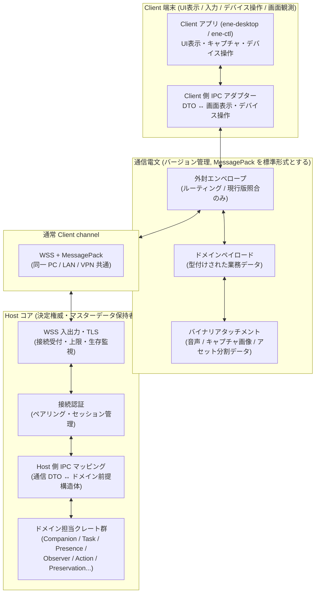

# Host↔Client IPC / wire protocol の具体設計 — Step 13 Concrete Design

本書は、Step 13 にあたる Host↔Client 間の IPC（プロセス間通信）および通信電文プロトコル（wire protocol）を具体化する設計文書です。[対応関係・識別](correspondence-identity.md)（CI）、[永続化と復旧](persistence-recovery.md)（PR）、[並行性制御](concurrency-control.md)（CCT）、[インターフェース境界](interface-boundaries.md)（IB）、[Crate / Module 分解](crate-module-decomposition.md)（CM）で定めた識別子の型分離、データの保存分類、並行性制御、インターフェース規約、クレート依存の向きを前提とし、これらを変更しません。上位設計との優先順位や食い違いが生じた際のルールは、[設計文書 README](../README.md#設計文書の優先順位と信頼できる情報源) に従います。

本書に記載された Rust の擬似コード型は、設計意図を明確にするためのものであり、そのままコンパイルすることを目的としたコードではありません。型名・フィールド名・メッセージ名を分かりやすい同義の名前に改名することは差し支えありませんが、型の分離と各フィールドの意味合いは必ず維持してください。Host と Client のクレート配置および通信 DTO クレート `ene-api` の境界は [Crate / Module 分解](crate-module-decomposition.md) 第8節に、識別子や世代の鮮度管理は CI / CCT の規定に従い、本書ではそれらを通信電文（wire）へ安全に落とし込む具体的な仕様を定めます。

## 1. 対象と非対象

### 1.1 本書が具体化するもの

- Host と Client のプロセス・ネットワーク境界を越える必要があるインターフェースの選定（第2節）。
- プロトコルの階層構造（通信電文の意味とトランスポート層の分離、エンベロープ（外封）とペイロード（中身）の分離）（第3・5節）。
- 通信インタラクションパターンの分類（第4節）。
- 電文識別子とドメイン識別子の明確な分離、リクエスト/レスポンスの相関付け、再試行の受入条件、冪等性の保持期間、コマンド ID の衝突を表現する型付き電文定義（第6・21・24節）。
- Client の起動世代（Incarnation）の管理と古い電文（Stale）の安全な拒否（第11節）。
- 存在状態（Presence）、テキスト対話、音声通信、提示制御（第12・13節）。
- 画面等の共有観測（Observation）プロトコル（第14節）。
- Client 端末に依存する外部操作（Computer Use 等）の安全な実行（第15節）。
- 処理の中断・キャンセル制御（Cancellation）（第16節）。
- 個人データ完全削除（Targeted Deletion）への Client 側の参加（第17節）。
- オーナー管理画面（Management Surface）と高権限操作の確認境界（第18節）。最終確認の判定手段は [First-party desktop](first-party-desktop.md) と第10.3節。
- 3D/VRM 立ち絵などの表示リソースの供給（第19節）。Body overlay process は本プロトコルの参加者ではない。
- 通信電文 DTO の擬似コード定義（第21節）。Host 側の内部ドメイン型に安易に `Serialize` を付けて直接公開することはせず、通信 DTO からドメインコマンドへの変換点を明確にします。
- シリアライズ形式の選定と比較（第7節）。データ形式とは独立に、現行プロトコルとの一致を検証します。
- プロトコルの現行版照合と不一致時の拒否（第7節）。
- 機能の交渉（Capability Negotiation）（第8節）。Client の自己申告は事実の提示にすぎず、実行権限（Permission）そのものとはみなしません。
- 認証とペアリング（第9節）。暗号ライブラリや鍵形式を過剰に固定せず、秘密情報を平文の通常電文に乗せない規約を定めます。
- トランスポート層のサポート範囲とアダプター境界（第10節）。
- 背圧制御（Backpressure）とストリーム制御（第22節）。システム全域での完全な大域順序を要求せず、重要な制御電文と高頻度なキャプチャ電文で同じ破棄ポリシーを適用しないようにします。
- セキュリティ境界（第23節）。型安全な DTO を使っていることだけでセキュリティ境界の代わりにはしません。
- エラーと拒否のモデル（第24節）。低レイヤーの通信エラーとビジネス上の正当な拒否（Stale や Denied 等）を混同しないようにします。
- クレート配置（第25節）。`ene-api` にビジネスロジックを置かず、相互マッピング処理を適切に分離します。
- 各ユースケースのウォークスルー検証（第26節）。通信の送信成功をビジネス処理の成功と勝手に読み替えないことを検証します。

### 1.2 本書が決めないもの（Design Freedom。第28節）

以下の事項は実装の裁量（Design Freedom）として残し、本書では固定しません。

- 具体的な暗号ライブラリ、鍵のフォーマット、鍵導出関数、証明書更新の実装詳細（満たすべき認証・接続保護の条件は第9・10節で固定）。
- ハートビートの間隔、キープアライブやタイムアウトの秒数、再試行回数、スケジューリングや画面キャプチャのアルゴリズム、利用枠（費用）の算定式。
- LAN / VPN 向けの具体的な TCP ポート番号。ローカルは `127.0.0.1` の動的ポートとし、自動探索・NAT 越え・外部リレーは導入しません（第10節）。
- 音声コーデックや画面キャプチャ画像形式の最終選定（満たすべき制約条件のみ第13・14節で固定）。
- Client 側の UI レイアウト、画面の文言、具体的なデータ保持期間、監査ログの出力形式。first-party の process 分割、要求 / 確認 channel の分離、Host-spawned GUI への seat 発行と直接確認は [First-party desktop](first-party-desktop.md) が固定する。toolkit / overlay backend / keyring crate は同文書第7節の provisional であり、probe 前に恒久 contract としない。

## 2. Remote-capable 選別 — 何を wire へ出すか

IB 第15節で定めた「ネットワーク越境可能なインターフェース（Remote-capable interface）」を起点として、「ネットワークやプロセス境界を越えなければシステムとして成立しないか」という視点から厳密に選別します。内部インターフェースを機械的にすべて通信電文へ変換するような設計は行いません。

### 2.1 越境させるもの（wire 化する）

| # | 電文グループ | 境界を越境させる理由 | 対応する IB インターフェース | 越境させる最小限の内容 |
|---|---|---|---|---|
| W-1 | ユーザーのテキスト・音声入力および応答の提示 | Client は入力デバイスや画面表示の一時的な表現を受け持ち、Host 側がマスターデータを持つため | X-B（やり取り Round の受付・提示・区切り） | 入力候補（input candidate）、やり取りの参照 ID、ストリーム電文、提示完了の確認。会話のドメイン的な意味判断や履歴・記憶そのものは送信しない |
| W-2 | キャラクターの存在状態（Presence）と移動 | キャラクターの呼び出しや移動の意思は Client から届くが、存在の確定権威は Host 側の帰属記録にあるため | X-A（移動・復帰） | 移動の意図（intent）、切り替え受付確認（transition ack）、帰属事実の通知。移動ヒントや復旧先情報だけで勝手に存在を成立させない |
| W-3 | 未伝達メッセージの提示 | 別の Client に切り替わった後の要約報告は、Host 側の元記録と照合して生成される派生データであるため | X-H / H-G（未伝達メッセージの報告） | フィルタリング済みの要約データ、提示完了の確認。元のタスクや活動記録のマスターデータそのものは出さない |
| W-4 | Client 側の接続事実とデバイス能力 | Host 側がキャラクターの帰属、観測、外部操作の可否を判断する前提として、Client 側の動作状況を知る必要があるため | X-D・X-F の観測事実部分 | 利用可能状態の事実、対応機能（Capability）の通知・更新。これ自体を実行許可とはみなさない |
| W-5 | 画面観測の適格性判定に必要な Client 側情報 | 観測の対象やタイミングを判定する材料（全画面アプリの起動、一時停止、負荷状況など）が Client 側にあるため | X-D（適格性連動） | 観測状態の表示、Client の状態事実。生のキャプチャ画像や未処理の候補、ルーティング文脈は出さない |
| W-6 | 共有画面観測・キャプチャの Client 側入出力 | キャプチャを実行する実体が Client であり、Host が発行する許可チケットによって制御されるため | X-E（ルーティングの両端のみ） | キャプチャチケット、キャプチャ画像フレーム（候補データ）、受入結果。ルーティングの内部判断や専用のプロバイダー割り当て情報は出さない |
| W-7 | 立ち絵や演出用のアセットリソース | 表示用のアセット（3Dモデル・モーション等）の提供元が Host（静的定義）で、利用者が Client であるため | C-A のアセット利用部分 | アセット記述子＋バイナリデータ分割チャンク。キャラクターの適用関係や個体の経験状態は出さない |
| W-8 | 個人データ完全削除（Targeted Deletion）への Client 参加 | 接続中の Client 端末が一時的に保持しているキャッシュデータも削除対象となるため | D-B の Client 宛て部分 | 削除要求コマンド（削除対象の平文本文は含めない）、ローカル削除結果。削除対象の本文や検索用トークンを Client 側で永続化させてはならない |
| W-9 | オーナー管理画面の入口と表示 | 設定や管理操作の入力画面が Client にあっても、操作の確定は Host 側の各担当者が行うため | IB 第9節 `ManagementOperationCommand` の Client 側入口 | 管理操作の意図（intent）、フィルタリングされた表示データ。Host-local 高権限操作の最終確認は Host PC 上の専用第一者面で行う（§18）。Targeted Deletion の専用確認は §18.3 に従う。制御のマスターデータ、秘密情報、過去の判定結果のコピーは出さない |
| W-10 | Client 端末依存の外部操作（Computer Use 等）の遂行 | 実際の操作を実行する対象デバイスが Client 端末そのものであるため | K-J（Client 限定作用）＋ K-H の Client 向け投影 | 操作コマンド（具体的なデバイス操作指示のみ）、受付確認、手動入力による割込事実、進捗報告、実行結果事実。権限の認可判定ロジックや許可条件は出さない |
| W-11 | Targeted Deletion 専用 Owner 確認 | Host GUI が無くてもペアリング済み Client から削除を開始できるため | D-A の deletion admission | Host が提示する操作 ID・目的・対象範囲・影響・expected currentness と一回限りの challenge、同じ認証済み Client の専用確認フローからの completion。Owner の直接操作は信頼する Client 側の責務であり、Host が物理入力を証明するものではない（§18.3）。通常の intent や一般 credential 管理に流用しない |

### 2.2 越境させないもの（Host-local に留める）

以下の処理やデータはプロセス境界を越えさせず、Host 内部で完結させます。

- 記憶の形成・訂正・公開範囲の意味判断（H-B〜H-E）、権限制御の確定と秘密情報の利用（K-A〜K-C）、推論割り当ての解決・送信条件の判定・利用枠の予約確定（K-D〜K-G）、外部操作の認可・確定（K-H）、完全削除の範囲確定・完了判定、バックアップ復元の一括有効化（D-A、D-C、D-D）、およびリポジトリでの前提比較とコミット処理。
  - **理由**: 前提条件の比較とデータ更新を Host 側の単一 SQLite トランザクション内で不可分に実行するためです。DB トランザクションを Client 側へ露出させてはいけません。また、認証の秘密情報を通常の通信経路に乗せてはなりません。
- 画面観測専用の LLM プロバイダー割り当て情報や、ルーティングのドメイン的な判断そのもの。Client に権威ある情報として公開しません。Client が見るのはキャプチャチケットと自分自身のキャプチャ結果だけです。
- リポジトリの不可分な前提比較、利用枠の事前予約、バックアップ復元の本番切り替え。これらを通信電文に乗せてはなりません。
- Host-local 高権限操作の最終確認（§18.1）。Client の自己申告は確認ではありません。[First-party desktop](first-party-desktop.md) 第5節に従い、Host が起動した GUI に継承した専用 channel 上の `ConfirmationSession` と直接操作を必要とします。公開 local listener の接続者は空席でも seat を取れません。nonce は freshness のみであり、Computer Use の `EffectReport` は完了ではありません。Targeted Deletion 専用の認証済み Client 直接確認（§18.3）は別の経路であり、この seat を遠隔に渡しません。

### 2.3 選別の帰結

- Client が受け取る各種 ID は、すべて**用途を限定した一時的な参照情報（non-secret reference）**です。Host 内部のマスターデータの主キーとして勝手に再利用できる形式で渡してはいけません（CI §4.6、CM §3.2）。
- Client が保持・返送する相関情報は、第6節で定める最小限のセットに限定します。Host 内部の完全な検証情報（タスクリビジョンの前提、委任スコープ、権限評価ログ、消去条件、復元条件の全文など）を渡してはなりません。Client が返信するのは「どの電文参照に対して」「Host から提示されたどの世代の表示を前提として操作したか」という事実だけであり、Host 側が現在の最新状態と再照合します。

## 3. Protocol layer 構成

通信電文の意味（セマンティクス）と、下位の通信トランスポート層を明確に分離します。また、メッセージの配送や現行版照合を担うエンベロープ（外封）と、ビジネスデータを運ぶペイロード（中身）を分離し、エンベロープ自体にドメインとしての決定権限を持たせないようにします。



通常 Client channel の transport は WSS に統一します。Host-local control と GUI–Body 間の投影 IPC はこの図の対象外です。Host-local 高権限確認・秘密入力経路を通常 Client channel に統合しません（第10.3節）。Targeted Deletion の専用確認電文だけは §18.3 に従います。

各層の責務と境界：

| レイヤー | 担当するもの（持つもの） | 担当しないもの（持ってはいけないもの） |
|---|---|---|
| トランスポート層アダプター | フレームの送受信、生存監視（ハートビート）、背圧（バックプレッシャー）の伝達、相手の切断検知 | ドメイン的な意味、存在状態、権限許可、リビジョン世代の判定。単に通信がつながっていることだけをもって存在状態や報告完了とみなさない |
| 接続認証 | デバイスのペアリング、セッション確立、失効処理、再認証（第9節） | ドメインとしての権限許可、タスクへの進捗反映、外部作用の確定 |
| 外封エンベロープ | ルーティング先ヒント、現行版照合（プロトコルバージョン・メッセージ種別・相関 ID）、重複配送の抑止キー（第5・6節） | ドメインの担当責任、決定権限。エンベロープが正しく届いたことだけをもって処理の完了とみなさない |
| ドメインペイロード | 型付けされたメッセージデータ（第4節のパターン別）。Client からは候補・観測結果・確認を送り、Host からは確定事実・決定結果・指示コマンドを送る | Host 内部限定の判定条件全文、認証用の秘密情報、判定ログの生コピー |
| バイナリアタッチメント | 音声フレーム、キャプチャ画像、アセット分割データの生バイト列（記述子 DTO と対応付けられる） | ドメイン的な解釈。対応する記述子のない独立したアタッチメントを解釈してはならない |
| Host 側 IPC マッピング | 通信 DTO のバリデーション、電文参照からドメイン前提構造体への変換、ドメイン確定事実から DTO への投影（第25節） | 採否、達成、許可、確定度の判断（これらは各ドメイン担当者の責務） |
| Client 側 IPC アダプター | 通信 DTO から画面表示やデバイス操作への変換、デバイス事実から DTO への変換 | マスターデータの直接書き換え、マスターデータの自己保持、権威の勝手な宣言 |

## 4. Protocol model — interaction pattern

すべての通信を1つの汎用的な「イベント電文」に無理やり統合してはいけません。トランスポート層で共通のエンベロープを使用する場合でも、メッセージのセマンティックな型は用途ごとに明確に区別します。

| パターン | 意味合い | 応答に関する約束 | 主な利用ドメイン（例） |
|---|---|---|---|
| **リクエスト / レスポンス (request / response)** | 問い合わせとそれに対する回答。回答はその時点の閲覧ビュー（view）にすぎず、将来にわたる永続的な許可ではない | `request_id` によって 1:1 で対応付ける。タイムアウトは「成否不明」の原因であり、勝手に成功・失敗・未実行と決めつけてはならない | ペアリング時のチャレンジ照合、接続後の能力問い合わせ、管理ビューの取得、アセット記述子の取得 |
| **コマンド ＋ 受付確認 (command + ack)** | 「〜してほしい」という指示と、その受付確認。ack は「受け取って記録した」ことを示すのみであり、処理の成功や完了を意味しない | `command_id` で対応付ける。ack は `Received`、`RejectedStale`、`DeniedByHold`、`Unsupported` などのドメイン結果型を返す。完了は別のメッセージで通知される | 移動指示 → 移動受付確認、デバイス操作指示 → 受領確認、削除要求 → ローカル削除結果、キャンセル要求 → 受理確認 |
| **一方向の確定事実通知 (one-way fact)** | 決定権威を持つ側からの決定事項の伝達。相手が受信したことは、相手が理解・採用したことを意味しない | 返信は不要。最新値としての意味を持つものは、新しい通知によって古い通知が自動的に上書き（supersede）される | 存在帰属の確定ブロードキャスト、観測適格性の表示、稼働可能事実、失効通知、立ち絵状態のヒント |
| **購読 ＋ 条件付き通知 (subscription + notification)** | イベントの購読登録と、その後の条件に応じた通知。購読していること自体は、権限や存在状態の根拠にはならない | `subscription_id` で管理する。条件の不成立、停止、失効時にはサーバー側から終了や保留を明示的に通知する | 存在状態の購読、未伝達メッセージ要約の更新通知、画面観測の適格性変更通知 |
| **順序付きストリーム (stream: open / frame / close)** | 順序が保証されたフレームの連続送信。open によって前提条件（チケットやセッション、Round）を確定し、各フレームはその範囲内でのみ有効となる | `StreamWireId` ＋ 連番 `seq` で管理する。close 時には `Completed`、`Interrupted`、`Cancelled`、`Stale` などを明示的に区別する。古いストリームを自動継続してはならない | テキストトークンの逐次出力、音声データの送受信、アセット分割データの転送 |
| **進捗報告 ＋ 最終確定 (progress + completion)** | 長時間かかる処理の中間報告と最終確定。進捗報告が届いていることと処理が完了したことは別である | 進捗報告は `operation_id` ＋ 単調増加する `progress_seq` で運ぶ。完了通知には必ず確定度（成功 / 失敗 / 成否不明）を伴わせる | デバイス操作の進捗 → 確定結果報告、アセット転送進捗 → 組み立て完了、完全削除のローカル進捗 → ローカル削除結果 |

**全パターン共通の禁止事項**:
- 受付確認（ack）、受信完了、画面表示、ローカル保存の成功をもって、業務的な効果・処理完了・権限許可・報告完了とみなしてはなりません（CC-07）。
- 購読（subscription）が存在することを、存在状態（Presence）や権限許可、処理再開の根拠にしてはなりません。
- ストリームの open が成功したことだけをもって、やり取り（Round）や存在状態、権限が成立したとみなしてはなりません。
- 進捗報告（progress）が届いたことだけで確定度を進めてはなりません。完了結果が「成否不明（Unknown）」であった場合、それを勝手に未実行や成功へ書き換えてはなりません。

## 5. Wire envelope — routing / version check 用

外封エンベロープは、電文のルーティングと現行版照合のためだけに存在します。エンベロープ自体がドメインの決定権威になってはなりません。エンベロープの検証が通ったことと、中のデータ（ペイロード）が受け入れられたことは全く別の問題です。Host 側のマッピング処理は、エンベロープの正当性を確認した後にペイロードをバリデーションし、ドメインの前提構造体に変換して各担当者の照合へ渡します。

```rust
// ene-api::v1::envelope（擬似コード。通信 DTO であり内部ドメイン型ではない）
struct WireEnvelope {
    protocol: ProtocolVersion,      // 現行プロトコルの識別子（第7節）
    message_id: WireMessageId,      // トランスポート層での重複排除用キー（第6節）
    correlation: WireCorrelation,   // リクエスト/レスポンス、コマンド/ack の対応付け
    sender: WireSender,             // 送信デバイス / インカーネーション / コネクション（第11節）
    observed: ObservedMarks,        // Client が前提として確認した世代情報の写し（照合材料）
    message_type: WireMessageType,  // ペイロードの型識別子（未知の型は拒否。第7節）
    payload: WirePayload,           // 型付けされたドメインデータ（第21節）
}

struct WireCorrelation {
    request_id: Option<RequestWireId>,  // リクエスト/レスポンス用。Client 発行可能
    command_id: Option<CommandWireId>,  // コマンド/ack 用。発行者は方向ごとに固定（第6節）
    reply_to: Option<WireMessageId>,    // 応答対象のメッセージ ID（トランスポート層の対応用）
}

struct WireSender {
    device_id: Option<DeviceWireId>,        // 初回ペアリング前の PairingRequest のみ None を許可
    incarnation_id: ClientIncarnationId,    // Client の起動インスタンス世代
    connection_id: Option<ConnectionWireId>,// 認証成功後に Host が払い出す。認証前は None
}

struct ObservedMarks {
    presence_generation_view: Option<u64>,  // Client が画面等で確認した presence 世代の写し
    round_view: Option<RoundWireId>,        // Client が属しているつもりでいる Round ID
}
```

エンベロープの取り扱いルール：
- `message_type` はルーティングのヒントにすぎず、ペイロードの意味を勝手に決めるものではありません。未知のメッセージ種別を受信した場合は `UnsupportedMessage` として安全に拒否し、中身を推測して処理してはいけません。
- ストリームの対応付けは、ペイロード側の `StreamWireId`（第13節）で運びます。
- `observed` フィールドは Client の勝手な主張ではなく、「Client がどの時点の表示を見てこの電文を送ったか」という前提の写しです。Host はこれを永続化データおよび現在の最新状態と比較し、食い違いがあれば古い電文（Stale）として安全に不受理にします。ただし `ManualInputInterrupt` は元試行で手動入力を検出した事実であり、§11.2・§15.2 の相関検証を満たす場合、`observed.presence_generation_view` が元の G で現在が G+1 でもドメイン入口より前に破棄しません。再接続時の `ActionFenceState` は元試行の事実通知ではなく現在のローカル fence 状態の同期であり、元 G の `observed` を流用しません（§11.2）。Client が「自分は最新である」と自称しただけで処理を受け入れてはなりません。
- `LocalErasureResult` の相関にはエンベロープの `correlation.command_id` / `reply_to` に加え、ペイロード内の必須 `(operation, sweep)` を使います。応答先が存在する場合は元の demand との一致も検証します。通信上の応答先や到着順だけから current sweep を推定してはなりません（§17）。
- ペアリングトークンやセッション証明、暗号鍵などの秘密情報を、通常のペイロードやエンベロープに乗せてはいけません。これらは認証専用の独立した電文フレーム（第9節）でのみ扱います。
- 時刻情報は壁時計時刻＋作成時のタイムゾーンを保持します（CI §4.6）。時刻の前後関係をリビジョン世代の代わりにしたり、古いかどうかの判定根拠にしたりしてはいけません。

## 6. Message identity and correlation

### 6.1 識別子の分離

| 識別子 | 発行者 | 寿命・スコープ | 主な用途 | 再利用の可否 |
|---|---|---|---|---|
| `WireMessageId` | 送信者（Host / Client 双方） | その電文の送信1回限り。受信側のキャッシュは短期間（数分〜接続継続期間） | トランスポート層での重複配送の抑止 | 再利用しない。内容が同じ再送であっても新しい ID を発行する |
| `RequestWireId` | リクエスト送信者 | リクエストとレスポンスの1往復 | 問い合わせと回答の 1:1 の対応付け | 再利用しない |
| `CommandWireId` | コマンド送信者（方向ごとに固定。第6.2節） | コマンド → 受領確認 → 完了報告の一連の処理（Saga）。再実行抑止マーカーは認証済みセッションの有効期間全体をカバーする | ドメイン処理の冪等性（二重実行防止）キー。詳細結果が整理（compact）された後も再実行禁止の対応関係を失わない | トランスポート層の再送時は同一 ID ＋ 新規 `message_id`。新しいユーザー意図や再試行では絶対に再利用しない |
| `StreamWireId` | Host が払い出し（Client は開始要求のみ） | ストリームの開始から終了まで | 各フレームの帰属先。古いストリームのフレームを新しいストリームへすり替えない | 再利用しない。再接続時に古いストリームをそのまま継続しない |
| ドメイン電文参照（`CompanionWireRef`、`ClientWireRef`、`RoundWireId`、`AttemptWireRef`、`OperationWireId`、`TicketWireId` 等） | Host が払い出し | 用途ごと（Round、試行、チケット、削除操作など） | 通信電文上での安全な対応付け。Host 側で内部の真の ID へ解決される | 再利用しない。対象が削除された後に同じ ID を再発行しない |
| `ClientInputLocalId`、`CaptureLocalId` | Client | Client 端末ローカルのみ。Host へ送るのは対応付けの照合用 | Client 側での送信電文と受付確認・結果の対応付け | Client 内で単調増加。Host 側のマスター識別子には昇格させない |
| ドメイン固有識別子（`CompanionId`、`TaskId`、`ActionAttemptId` 等） | Host 側の各担当クレート | 永続化期間（Durable） | マスターデータとしての一意性保証 | 再利用しない。**`MessageId` などの通信用 ID をドメイン固有識別子として流用してはならない** |

通信用の参照 ID（wire ref）は、Host 側のマッピング層が内部の真のドメイン ID へ解決するための中身を解釈しない不透明な値（opaque reference）であり、内部の型名をそのまま文字列化したものではありません。Client 側でその構造を勝手に解釈したり、合成したり、推測したりしてはいけません。Host 側は解決できない参照を受け取った場合、推測で処理を進めることなく `UnknownRef`（ドメイン結果）として安全に処理を拒否します。

### 6.2 発行者規則・retry admissibility・idempotency retention

- **認証前のリクエスト**: ペアリングや接続認証前の要求（`PairingRequest` 等）は、まだ認証済みの送信者セッション（sender epoch）が確立していないため、本節のコマンド再試行・冪等性管理の対象にはしません。これらは `request_id` や `message_id`、および第9節で定める使い捨ての nonce や証明によって対応付けます。認証前の送信者情報をドメインコマンドの冪等性空間として使ってはなりません。
- **Client から Host への指示**: ユーザー入力、確認、事実通知、機能申告などの `command_id` / `request_id` は Client が発行します。Host は認証後のドメインコマンドについて、その `command_id` を冪等性キーとして扱い、同一セッション内で同じ `command_id` が再送された場合は処理を再実行せず、前回の確定結果（または再実行を安全に禁止する型付きの処理済み結果）を返します。
- **Host から Client への指示**: 移動指示、デバイス操作指示、削除要求、キャプチャチケットの `command_id` / `operation_id` は Host が発行します。Client がこれらを勝手に捏造・発行してはなりません。Client が推測や合成によってコマンドを送信することはプロトコル違反として即座に拒否します。
- **再試行を受理可能な送信者セッション（Retry-admissible sender epoch）**: Client から Host への通信では、Host が現在有効として受け入れている認証済みの `(device_id, incarnation_id, connection_id)` の組み合わせを、コマンド再試行の有効期間（エポック）とします。接続の切断・再接続、Client の再起動、デバイスの失効などによってそのエポックが無効になった後は、古いエポックのコマンドを実行に進める前に `StaleConnection` や `StaleIncarnation` として安全に拒否します。同様に、Host から Client へのコマンドも、新しい接続へ自動的に引き継いだり勝手に再送したりしてはいけません。
- **冪等性マーカーの保持期間**: コマンドの受信側は、その送信者セッションが有効である間、受信済みの各 `command_id` について少なくとも「二重実行を禁止する」判定を下せる冪等性マーカーを確実に保持します。詳細なレスポンスや進捗ログをメモリ節約のために破棄（compact）することは許されますが、マーカーそのものを先に捨ててしまって同じ `command_id` を新規コマンドとして誤って再実行してはなりません。また、Round のような新しい永続化 ID を発行するコマンドの場合は、再試行時にも初回の ID をそのまま返せるよう、結果をセッション期間中保持するか、永続化データから確実に再構成できるようにします。
- **フィンガープリントによる内容一致の検証**: 冪等性マーカーは、同じ `command_id` で送られてきた電文が「本当に同じ内容のコマンドであるか」を検証できるフィンガープリントを保持します。このフィンガープリントには、メッセージの種類、ペイロードの中身、および前提となる世代情報（`observed`）を含めます（送信ごとに変わる `message_id` やログ用メタデータは含めません）。
- **古いマーカーの安全な破棄**: 送信者セッションが無効化（stale）された後は、古い電文自体をセッション検証の段階で確実に拒否できるようになるため、そのエポックに紐づく冪等性マーカーをメモリからクリーンアップして構いません。**「マーカーをすでに破棄したのに、古いコマンドの再試行を受け入れてしまう」という二重実行の穴を決して作ってはなりません。**
- **通信レベルの再送とビジネスレベルの再試行の区別**:
  - **通信の再送（Transport retry）**: ネットワークの一時的な不調による再送は、**同一の `command_id` ＋ 新規の `message_id`** で行います。受信側は `message_id` キャッシュによって同一電文の重複配送を静かに破棄し、`command_id` の処理済みマーカーによって処理の二重実行を防ぎます。
  - 同一セッション・同一 `command_id` でありながらフィンガープリントが一致しない（＝ID を使い回して中身を変えた）場合は、ビジネスロジックに渡す前に `CommandReplayRejectWire::CommandIdConflict` を返し、副作用を起こさずに安全に拒否します。
  - 外部作用の再試行（External effect retry）は、単なる通信の再送ではなく**新しい試行（Attempt）**として扱い、必ずユーザーの確認・判断を経る必要があります（第15節）。通信の再送によって外部への実操作が勝手に二重実行されるような設計にしてはなりません。

### 6.3 Round・presence generation・incarnation の区別

以下の3つの概念を1つの「セッション ID」などに安易にひとまとめにして混同してはいけません。

- **やり取りの区切り（Round）**: 会話の1往復ごとの区切りであり、Host が発行する `RoundWireId` で識別します。`message_id` や `request_id` とは全く別物です。古い Round への入力や未提示の出力を、新しい Round へ勝手に付け替えてはなりません（CI §3.5）。
- **存在状態の世代（Presence Generation）**: Host 側が絶対的な決定権を持つライフサイクルの世代番号（`PresenceGeneration`）です。Client 側は `observed.presence_generation_view` として自分が見た値の写しを返すだけにすぎません。世代番号が一致していることだけでは不十分であり、現在の接続状態、デバイスの利用可能性、権限許可、一時停止や保留状態なども Host 側が厳密に照合します（CI §5.6）。
- **Client の起動世代（Client Incarnation）**: Client アプリが新しく起動するたびに新しく発行される識別子（第11節）です。接続セッションやプロセス、存在世代とは独立した概念です。
- **Action dispatch namespace / epoch / Interrupt fence token**: Computer Use の発行区間は Host が発行する `(ActionDispatchNamespaceWire, ActionDispatchEpochWire)` で識別します。epoch の大小は同じ namespace・対象 Client 内でだけ比較し、復元による master 切替では新しい namespace を発行します。`InterruptFenceToken` は対象 Client が手動入力時に新たに生成してローカル fence に結び付ける本文を持たない推測不能値です（§15）。いずれも接続・incarnation、presence generation、Round、§6.2 の retry-admissible sender epoch や権限許可とは別物です。

## 7. Serialization と現行 protocol version の照合

### 7.1 serialization 選択

| 形式の候補 | デバッグのしやすさ | Rust / 他言語サポート | スキーマ進化への適応 | 総合評価 |
|---|---|---|---|---|
| **JSON（テキスト）** | ◎（そのまま人間が読める） | ◎（全言語で標準対応） | △（フィールド追加規約次第） | 制御用メッセージの可読性は最高ですが、音声・画面キャプチャ・アセットなどのバイナリデータを含むストリームではサイズやエンコード負荷が大きく不利。バイナリを base64 で包むような非効率な設計は避けたい |
| **MessagePack** | ○（JSON へ容易に相互変換可能） | ◎（serde および多言語ライブラリが充実） | ○（フィールド規約＋バージョン管理と併用） | **採用。** JSON と互換性のある論理データモデルのまま、コンパクトなバイト効率を得られます。トランスポート層のフレームとして素直に扱えます |
| **CBOR** | ○（JSON へ相互変換可能） | ○ | ○ | MessagePack と同系統ですが、Rust や将来的な Client 言語でのライブラリ普及度・安定性で MessagePack が有利です |
| **Protocol Buffers** | △（デコードしないと読めない） | ○（コード生成ツールが必要） | ◎（フィールド番号による互換性） | スキーマレジストリの運用やコード生成ツールの配布、可読ログのための追加機構が必要となり、単一ユーザーが管理する Ene のトポロジーには過剰です。「独自のバイナリプロトコルを作らない」という基本方針とも衝突します |

**設計上の決定: MessagePack を標準の電文エンコーディング（canonical wire encoding）とし、論理データモデルは JSON 互換を保ちます。**

通常 DTO の1電文を、1つの WebSocket binary message で運びます。独自の4バイト長さプレフィックスは付けません。バイナリアタッチメントも記述子と対応付けた1チャンクを1つの binary message で運び、既存の `StreamWireId`・連番・記述子との相関を保ちます。WebSocket の分割フレームは通信層が上限内で再構成し、業務電文の分割や再試行とは区別します（第10.2節）。純粋な MessagePack codec は DTO とともに `ene-api` に置きます（第25節）。

すべての通信 DTO は、JSON としても自然に表現できるデータ構造（文字列、数値、真偽値、配列、マップのみで構成し、巨大なバイナリデータはアタッチメントとして分離）として定義し、実際の通信電文上は MessagePack で効率的にエンコードします。デバッグ表示、一般ログ、監査ログでは JSON 形式で出力します。また、音声フレームやキャプチャ画像、アセットのバイナリデータはペイロード内に base64 埋め込みするのではなく、バイナリアタッチメントフレームとして記述子 DTO と対応付けて送信します（第21節）。

データ形式を選んだことだけでは、現行プロトコルへの適合は保証されません。受信時には以下を検証します。

**現行スキーマの検証規約**:
- 必須フィールドの欠落や未知のフィールド（オプショナル項目も含む）は拒否します。受信側は未知の項目を無視して旧スキーマとして処理しません。既知の `Option<T>` の省略だけを定義済みの意味で扱います。
- フィールドや enum の意味・単位を変更する際は現行スキーマとプロトコル識別子を更新します。古い形式を推測して解釈しません。
- enum は無制限に拡張可能（open enum）としては扱いません。未知のバリアントを受信した場合は、そのメッセージを `UnsupportedFieldValue` として安全に拒否します。デフォルトのバリアントへ勝手に読み替えてはなりません。
- 各種 ID、リビジョン番号、世代番号、相関キーは、必ず独立した明示的なフィールドとしてシリアライズします。本文のテキスト文字列をパースして照合に使うような実装は禁止します（CI §4.6）。

### 7.2 現行 protocol version の照合

- エンベロープの `ProtocolVersion { major: u16, minor: u16 }` は現行スキーマの識別子です。major / minor の一部だけで互換性を判定しません。変更時は現行版を更新し、旧版の解釈・フォールバックは設けません。
- `CapabilityAdvertise.protocol` とそのエンベロープの `protocol` は Host の現行版と完全一致させます。Host は `CapabilityAcknowledged` で同じ版を確認し、Client も Host の版を照合します。この確認は Paired phase（再接続では Accepted からの bind と一体）の同一 connection 上で認証チャレンジより先に行い、接続レコードに版を記録します（§9.3）。機能・利用可能状態の申告（§8）とプロトコル版の選択を混同しません。
- 版が一致しない場合は major / minor のいずれでも `IncompatibleProtocol { host_version, client_version }` として明示的に拒否して接続を終了します。未知の版の電文を解釈したり、古い版へダウングレードしたりしません。以降の同一接続の電文にも、記録された現行版との一致を要求します。
- 現行版の未知のメッセージ種別は `UnsupportedMessage` としてその電文を拒否し、副作用を起こしません。未知のフィールド、enum バリアント、必須フィールドの欠落もそれぞれ不正な電文として拒否し、既知の値へ読み替えません。

## 8. Capability negotiation

Client 端末によって、3D立ち絵（Body）、音声合成/認識（Voice）、画面キャプチャ（Screen capture）、PC操作（Computer Use）、システム通知、OSトレイなどの対応能力（Capability）は異なります。そのため、接続確立時に Client の対応機能を Host 側へ申告して交渉を行います。

```rust
// ene-api::v1::capability（擬似コード）
struct CapabilityAdvertise {
    protocol: ProtocolVersion,                // 現行版との一致確認用。選択候補の一覧ではない
    limits: ClientLimits,                     // フレームサイズ上限や同時ストリーム数上限の申告
    platform: PlatformDescriptor,             // OSやデバイス種別の表示情報（権限許可の根拠には使わない）
}

struct CapabilityAcknowledged {
    protocol: ProtocolVersion,         // Host の現行版。一致しなければ認証へ進まない
}
```

- ※詳細な機能フラグ（`ClientFeature` / `accepted_features`）は現在の実装段階で直接の利用箇所がないため、必要になった段階で順次追加します。
- **機能申告（Claim）と権限許可（Permission）は別物です。** Host 側は Client からの「対応可能」という事実申告と、実際の「実行権限」や「現在の接続帰属」を別々に照合します。Client が対応可能と申告していても、ユーザーによる明示的な許可、キャラクターの存在帰属、デバイスの承認がない限り処理を開始してはいけません。
- Host は Client からの申告を「現在利用可能な事実（Availability Fact）」として記録し、外部操作の可否判定、画面観測の対象選定、ルーティング、UI表示の判断材料として活用します。申告があることだけで能力を盲信せず、必要に応じて到達性やデバイス許可を合わせて確認します。
- Client 側の状態変化（全画面表示の開始、デバイスの切断、高負荷、マイクのミュート等）は、`CapabilityUpdate` や `AvailabilityFact` の電文によって随時 Host へ通知されます。ただし、状態変化の前に発行されたチケットやコマンドの有効期限が勝手に延長されることはなく、各処理の受付時に最新状態と照合されます。
- 照合済みの現行プロトコル版は接続レコードに保持され、復元世代（`RestoreGeneration`）や存在世代（`PresenceGeneration`）とは独立した別次元の情報として管理します。これらを混同してはいけません。

## 9. Authentication / pairing

アーキテクチャで定めた基本方針（Client ごとの個別接続情報、認証秘密との明確な区別、Host 側での厳重保護・失効管理・復元時の整合性確認）を具体的な通信プロトコルへ落とし込みます。特定の暗号ライブラリや鍵形式に過剰に縛られることなく、秘密情報を平文の通常電文に決して乗せない規約を定めます。

### 9.1 概念の区別

以下の認証材料は用途と寿命を区別します。TLS・ローカル接続の受付・端末認証・第一者管理画面の確認権限は、それぞれ別の境界です。

| 概念 | 意味合い | 取り扱いルール |
|---|---|---|
| **Credential（登録済み認証秘密）** | LLM プロバイダーや MCP サーバーへ接続するための、ユーザーが登録した秘密情報（API キー等） | OS のセキュアストア等で完全に分離保管します。平文で通信電文に乗せてはならず、Client 端末へ渡してもいけません。Client 認証の材料として流用してはなりません |
| **ペアリング情報 (Pairing material)** | 特定の Client 端末を Host が正式に認識するための接続用材料 | Host 側のマスターデータでもなければ、上記 Credential のキャッシュでもありません。Client 側で保持する場合は暗号化等で保護し、接続目的のみに限定します。デバイス失効の対象となります |
| **セッション情報 (Session material)** | 確立された1回の通信セッションのための一時的な証明材料 | コネクションごとに発行され、切断時に破棄されます。古いセッション情報を使って新しいセッションを勝手に再開させてはなりません |
| **Host TLS 鍵・信頼情報** | Client が接続先 Host の真正性を検証するための材料 | Host 秘密鍵は保護ストアに用途を分けて保存します。Client は信頼済みの公開鍵 pin で Host を検証します。端末の利用許可や最終確認を与える材料ではありません（第10.4節） |
| **ローカル接続用トークン** | 同一 OS ユーザーのローカル Client を通常 listener に受け入れるための材料 | Host 起動ごとに更新し、保護された runtime ファイルで渡します。TLS の Host 検証後にのみ送信し、端末ペアリング・所有証明・第一者確認の代用にしません（第10.4・10.5節） |

### 9.2 pairing

`PairingRequest` より前に、第10節の TLS・listener 受付条件を満たす必要があります。これは未ペアリング端末に業務操作を許可するものではありません。

1. 初めて接続する Client 端末は、Host 側でオーナー（ユーザー）自身が明示的に確認・承認する「デバイスペアリング」が必須です（Remote Client のセキュリティ要件）。ペアリングの開始は Client からの `PairingRequest { device_descriptor }` によって行われ、Host PC 上の信頼された第一者管理画面におけるユーザーの最終確認待ち状態となります（§18）。ペアリング済みの別のリモート端末からの遠隔承認だけでは成立させてはなりません。また、初回ペアリング前の `PairingRequest` はデバイス ID が未発行であるため、エンベロープの送信者情報を `device_id: None`、自インカーネーション、`connection_id: None` とし、これ以外の通信で `device_id` が欠落しているものは一切受け付けません（§5 の規則）。
2. ユーザーの確認・承認を経て、Host は新しいペアリング識別子と `DeviceWireId` を発行します。デバイス情報の非秘密な表示参照は PR Group G に、許可された機能の記録は Group F に、Host 側の所有証明検証材料・信頼範囲・失効状態は Group K のデバイス認証ストア（E）に安全に保存します。ペアリング情報は認証専用の電文フレームで Client へ手渡し、通常のメッセージペイロードには含めません。
3. 過去の古い接続情報だけで、Host 側のペアリングや機能許可を勝手に復活させてはなりません。ペアリングが失効した後の再接続は、新規ペアリングとして必ずユーザーの再確認を経る必要があります。

### 9.3 connection authentication・reconnect authentication

1. コネクションが確立するたびに、Paired phase で `CapabilityAdvertise → CapabilityAcknowledged` により現行プロトコル版を相互確認し、続いて `AuthChallenge（Host の使い捨て乱数 nonce）→ AuthProof（Client の所有証明）→ AuthResult（Host の判定結果 ＋ ConnectionWireId 付与）` のハンドシェイクを実行します。Host は現在のデバイス認証ストア（E）にある有効なペアリング情報および検証材料と照合し、存在しない場合、失効している場合、または確認できない場合は接続を拒否します。Client は秘密情報そのものを平文で送るのではなく、暗号学的な所有証明のみを送信します。具体的な方式は自由としますが、「秘密情報を平文で露出させないこと」「nonce を使い捨てること」「過去の証明を再利用させないこと」を必須条件とします。
2. 認証が成功した際、Host はそのコネクション専用の `ConnectionWireId` を発行し、デバイスごとの現在の有効な接続を更新します。以降、Client から Host への電文には必ず `sender.connection_id` を付与します。認証前の電文はペアリング、capability 申告と現行版照合、認証手続き専用のものに限定し、業務的なドメイン操作は一切受け付けません。
3. 再接続（Reconnect）時は、常に新しいコネクションとしてゼロから認証をやり直します。古い `ConnectionWireId`、古いストリーム、古いチケット、古いやり取り（Round）をそのまま引き継いではなりません。古いコネクション ID を乗せた電文は、ドメイン処理を実行する前に `StaleConnection` として安全に拒否します。

#### connection phase と replacement（Stage 5）

current の選択に paired socket count を使う案は、未認証・superseded の残存によって切断を見失うため採用しません。認証ごとに presence generation を進める案も、同じ Client の接続 replacement と帰属移動を混同します。現在の connection slot と不可逆な phase を使い、帰属が変わらない replacement では generation を保持しつつ古い Round/receipt を失効させます。

`authenticated` は、その connection で所有証明が成功した事実です。`current` は Host の device ごとの current slot がその connection を指すことです。domain ingress と presence の到達性に使えるのは、両方を満たし、閉じておらず、device が現在も有効な connection だけです。paired socket の数や過去の認証成功回数は使用しません（[#1384](https://github.com/pexisgle/ene/issues/1384)）。

connection は `Accepted → Paired → Challenged → Authenticated → Superseded | Closed` の一方向に進めます。失敗した認証は `Closed`、任意 phase の transport 終了も `Closed` とします。新規 pairing は承認完了で Accepted から Paired へ進みます。再接続では最初の `CapabilityAdvertise.sender.device_id` を既存の非失効 device と照合し、Accepted からの device bind・Paired への移行・capability 受付を一つの phase 操作にします（ID 解決だけでは authenticated/current になりません）。以後 `CapabilityAdvertise` は Paired で一度だけ受け、現行版の完全一致を確認してから challenge を発行し、nonce は Challenged の AuthProof 一度で消費します。phase 不一致には `InvalidHandshakePhase` を返し、nonce や確認済みの版・機能申告を変更しません。版の不一致は `IncompatibleProtocol` で接続を終了します。Superseded は復活不能で、同じ socket の pairing/capability/auth を含め、帰属を検証できる電文は `StaleConnection` とします（[#1385](https://github.com/pexisgle/ene/issues/1385)）。§11.3 の型付き stale 拒否後も socket を維持してよいものの、新規認証には必ず別 connection を開きます。

- AuthProof の検証後、Host は短い connection 所有区間で phase と device の有効性を再確認し、旧 current を Superseded にして新 current を設置します。`AuthResult::Accepted` はこの変更の後に送ります。応答が失われても旧 current へ戻しません。認証処理が同時ならこの設置順で最後の成功 connection が current になり、非 current の socket が AuthProof を再送して競争し直すことはできません。
- replacement が同じ Client の `Present` 中に、current 不在区間なしで成立した場合、帰属先と PresenceGeneration は維持します。ただし旧 connection の Round、stream、presentation receipt、再試行 epoch は無効になり、新 connection は新しい Round だけを使います。旧 socket を持つことは新 connection の認証や提示の成功を意味しません。
- close は connection identity を比較して current slot を除去します。superseded/unauthed connection の close は新 current を消しません。current の close 後に stale socket が残っても、presence fallback の条件は成立します。古い close 通知を非同期で処理する際の再比較は [CCT §10.4](concurrency-control.md#104-connection-の現在性と-presence-commit) に従います。
- WSS の Close、EOF、read/write error、明示 DisconnectNotice は確定した切断として共通の close admission に渡します。Ping / Pong の監視で疎通を確認できない間は Client-dependent admission を止め、定めた生存監視期限を過ぎた接続は閉じます。業務応答の timeout だけで帰属を捨てたり、作用を未実行とみなしたりしません（第10.2節）。
- 新規 `PairingRequest` は Host の権限・制約 owner が不透明な pending identity（既存の pending device ID）を発行し、同じ connection・request_id・同一本文の再送には同じ pending を返し、対応は元 connection の終了まで保持します。異なる本文での request_id 再利用は拒否し、認証後の command epoch を使いません。承認は pending ID と元 connection を指定し、その行を CAS して Paired にします。Host restart / 元接続終了後の未承認 pending は認証に使えず、新接続は新しい要求を出します。pending の表示属性や画面上の行番号から承認先を逆引きしません。
- device descriptor は表示属性です。既存ペアリングの再接続は保存済みの `DeviceWireId` から Host が device を解決して認証し、descriptor を identity lookup に使いません。同じ descriptor の新規要求にはそれぞれ別の pending request identity と Owner 確認を与えます（[#1389](https://github.com/pexisgle/ene/issues/1389)）。descriptor による接続 identity の取り違えを、Stage 5 の replacement として扱ってはなりません。

### 9.4 revoke

- ユーザーは、ペアリング済みのデバイス一覧、最終接続日時、許可された機能を確認し、デバイス単位で即座にアクセス権を失効（Revoke）させることができます（セキュリティ要件）。§18 の第一者管理画面での最終確認を経て、`ene-permission` が失効を判断し、`ene-credential` のデバイス認証ストア（E）にある検証材料を確実に無効化・削除します。同時に `ene-presence` は現在の接続セッションを切断します。以降の認証拒否は、ストア（E）から有効な材料が完全に消去されたことを根拠として行い、単なるフラグの書き換えだけに頼りません。消去が完了する前に「失効完了」とみなしてはならず、途中で失敗した場合は未完了の保留状態として扱います。
- 失効したデバイスの古い接続情報やセッション情報を使って、再接続したり権限を復活させたりすることはできません。失効の事実は `RevocationNotice` 電文によって該当 Client へ通知されます（相手端末がオフラインで届かない場合であっても、Host 側での失効は即座に確定します）。
- Host の再起動やバックアップからの復元後であっても、失効状態は確実に維持されます。デバイス認証ストアはバックアップの対象外であり、リストア時も現在の状態がそのまま維持されます（PR §9.2）。復元された過去のデータによって、現在の信頼範囲を勝手に広げてはなりません。また、全データのリセット（Full Reset）時にはデバイス信頼関係や検証材料もすべて完全に削除されます。再ペアリングを行うには、新しい識別子を発行し、Host PC 上での正式なユーザー確認をやり直す必要があります。

## 10. Transport

### 10.1 範囲の判断

通常の Host–Client 通信は、Windows / Linux、同一 PC / LAN / VPN のいずれも **WSS（WebSocket + TLS）＋ MessagePack** に統一します。エンベロープ、相関、認証、接続の置き換え、再接続、ストリーム処理を共通にし、接続先の発見と受付条件だけを listener の役割に応じて分けます。

| listener | 接続範囲 | 受付条件 |
|---|---|---|
| **ローカル専用** | 既定で `127.0.0.1` の動的ポートに bind。外部 interface には公開しない | TLS による Host 検証と、現在のローカル接続用トークンを必須とする（第10.4節） |
| **remote** | 明示設定された LAN / VPN 向けアドレスだけに公開 | 信頼済み Host 鍵による TLS 検証を必須とする。ローカル用トークンを配布・要求せず、常に `Remote` として扱う |

両方とも、第9節の端末ペアリング・接続ごとの所有証明を通します。通常 Client channel に Unix socket / named pipe、平文 WS、旧方式へのフォールバックは設けません。QUIC、自動探索、NAT 越え、外部リレー、ブラウザ Client は追加しません。remote Client の製品提供は Stage 14 に残し、ローカルの WSS 化だけで remote listener を有効化しません。

### 10.2 transport adapter boundary

`ene-api` の純粋な codec は、第7節の電文とバイト列の変換だけを担います。Host と `ene-client` が WSS の入出力・接続監視を持ち、業務処理へは再構成・検証済みの電文を渡します。1本の接続上の論理ストリームは既存の `StreamWireId` で識別します。複数 transport のための汎用 trait、factory、共通 transport crate は新設しません。

- WebSocket の frame サイズと、分割後に再構成する message 全体のサイズを両方制限します。受信・再構成中に上限を適用し、全量確保後に切り詰めません。業務制御電文とアタッチメントには用途別の上限を適用し、送信側も上限内の電文・チャンクだけを生成します。Text message や不正な framing は通信層で拒否し、業務上の stale / denied と区別します。
- TLS / HTTP Upgrade / 端末認証の待機時間、認証前接続数と pending pairing 数、送受信キューと書込待ちを制限します。HTTP Upgrade は通常 Client 用の接続先だけを受け付け、`Origin` ヘッダーを持つ要求は拒否します。native Client は Origin を送らず、欠落だけを認証成功の根拠にしません。
- Ping / Pong、Close、EOF、read/write error を共通の接続監視で処理します。疎通を確認できない `Suspected` の間は Client-dependent admission を止め、生存監視期限の超過で接続を閉じ、既存の close admission へ渡します。Ping / Pong は presence、許可、提示 ACK、業務完了を代替しません。
- Close や timeout で作用を未実行・失敗へ決めつけず、再接続は新しい connection として認証し直します。成否不明の作用や旧電文を自動再実行しません。低速 Client が Host-only Task を止めないこと、業務制御電文を無言で捨てないことは第22節に従います。

Origin の制約、分割 message の上限、TLS と認証の区別は [RFC 6455 §10](https://www.rfc-editor.org/rfc/rfc6455.html#section-10) に従います。ライブラリ、上限値、監視間隔は実装時に決めますが、これらの制限を無効にした経路は設けません。

### 10.3 Host-local control transport（Client channel ではない）

Host-local control は、要求専用 listener と Host-spawned GUI に継承する非公開の確認 channel に分けます。前者は複数 requester の非秘密 request / outcome、後者だけが session completion と秘密 intake を扱います。listener の peer UID / DACL は local transport の適格性であり、確認権限を与えません。seat は Host が起動した GUI に高々1つ発行し、任意接続の先着では発行しません。`ene-core approve-*` は requester、`ene-ctl` は Client channel のみ、Body はどちらも使いません。control DTO は `ene-local-control` に置き、同一 PC を含め通常 Client の WSS / `ene-api` には載せません。起動・限定継承・GUI 不在時の outcome・切断失効は [First-party desktop 第5.1節](first-party-desktop.md#51-二つの-channel-と-owner-確認) を正本とします。GUI–Body 間の投影 IPC も同文書第4節の専用経路を維持します。

### 10.4 接続先の発見と Host の検証

Host の証明書はアプリが生成・管理します。Host 秘密鍵は既存の保護ストアに専用用途で保存し、Provider credential や端末のペアリング秘密を流用しません。証明書の更新と Host 鍵の変更を区別し、信頼済み公開鍵 pin と一致しない鍵を自動承認しません。保護ストアや検証材料が使えない場合は接続不能とし、平文や証明書検証の無効化へ縮退しません。

ローカル接続は次の順に準備・検証します。

1. serving Host は、startup mutation より前に data directory の単一 writer lock を取得し、終了まで保持します（PR §6.4）。起動ごとに予測不能なローカル接続用トークンを生成し、TLS と listener の準備を完了します。
2. 接続 URL、Host 公開鍵 pin、Host 起動世代、ローカルトークンを一つの runtime ファイルとして原子的に公開します。親 directory と一時ファイルを含め、Linux の所有者権限 / Windows の明示 ACL で同一 OS ユーザーだけが読み書きできる状態を作成時から保証します。保護を確認できなければ公開しません。ファイルは通常設定やマスターデータに含めません。
3. Client はファイルと保護条件を読み取り専用で確認します。接続先がローカル用の `wss://127.0.0.1` であることと TLS の Host 鍵を検証してから、HTTP Upgrade の認証ヘッダーでトークンと起動世代を提示します。Host は現在値と照合して受け入れます。トークンを URL、通常 DTO、環境変数、ログへ出さず、redirect や別 listener へ転送しません。
4. ファイルの欠落・破損・保護不備、pin 不一致、古いトークン・起動世代は接続不能として扱います。Client はファイルや Host 鍵を修復・再作成しません。新しい runtime 情報を読み直す場合も、接続・端末認証は最初から行い、旧電文を再送しません。

Host の正常終了時は自身が公開した runtime ファイルを削除します。crash 後に残っていても、ファイルの存在は Host の生存証明になりません。次の Host は lock を取得してから新しい情報を公開し、古い情報で再利用されたポートへつないでも、Host 検証または起動ごとの受付条件で拒否します。原子的公開は torn read を防ぐためのもので、writer 排他の代わりにはしません。

remote Client は初回ペアリング時に、Host の信頼された画面など接続先の自己申告だけに依存しない別経路で Host 公開鍵 pin を確認・登録します。Host 鍵が変わった場合は再確認し、新規ペアリングが必要な場合は第9節の Owner 確認も行います。

ローカルも信頼済み Host 鍵の変更は Owner の再確認を通し、runtime ファイルの更新だけで自動承認しません。初回の信頼情報は保護された runtime ファイルから取得し、以後の信頼済み pin と照合します。秘密鍵・信頼情報と runtime 情報の保存・復元・Full Reset は PR の Group K と第9.2節に従います。

### 10.5 SameMachine の根拠

Host は `transport_class = SameMachine | Remote` を現在の connection に束縛します。`SameMachine` は、ローカル専用 listener で現在のローカルトークンと Host 起動世代を検証した接続に限ります。トークンの欠落・不一致を `Remote` として受け入れ直しません。remote listener は、接続元が loopback に見えたりトークンが提示されたりしても `Remote` のままです。

TCP の接続元 IP、Client の platform / descriptor、保存済みの通信種別だけから判定しません。認証済みで現在有効な connection、端末許可、排他性の再照合を満たして初めて presence の fallback 候補にできます（CCT §10.4）。接続が失効・置き換え・終了した後は、このローカル判定を次の connection へ引き継ぎません。

これは同一 OS ユーザーに保護された接続情報へのアクセスを根拠とする判定です。OS セッションや同一ユーザーの秘密領域が侵害されていない前提は Runtime Topology に従います。トークンを知ることは、Host が起動した第一者 GUI である証明や、本人の直接確認にはなりません（第10.3・18節）。

## 11. Client incarnation / stale rejection

### 11.1 三者の区別

以下の3つの概念はそれぞれ異なるライフサイクルを持ちます。

| 概念 | 識別子の型 | 発行者・生存期間 | 意味・役割 |
|---|---|---|---|
| **コネクション識別子** | `ConnectionWireId` | Host が接続確立ごとに発行 | その接続セッション自体の識別。認証成功時に現在有効な接続となる |
| **起動世代 (Client Incarnation)** | `ClientIncarnationId` | Client がプロセス起動ごとに発行（永続カウンタ ＋ 乱数） | Client アプリのプロセス世代の識別。アプリを再起動するたびに必ず新しくなる |
| **存在世代 (Presence Generation)** | `PresenceGeneration`（値の写し） | Host 側のキャラクター帰属ライフサイクルが発行 | そのキャラクターがどの帰属期間に存在しているかの識別 |

これら3つを1つの「セッション ID」に押し込んではいけません。コネクションが変われば、起動世代の新旧にかかわらず古いコネクションは無効（Stale）です。Host は current connection に束縛した incarnation と一致しない電文を Stale にします。incarnation の大小は認証の優先順位ではなく、新しい socket で所有証明を成功させた旧プロセスが最後に install すれば current を置き換え得ます。旧 incarnation を永久失効させる high-water record は追加しません。そして存在世代はキャラクターの帰属区間を表すものであり、接続やプロセスの新旧で代用できません。

Client は process boot 時にローカルな Client data directory ごとの永続 counter を排他更新し、乱数と組み合わせた `ClientIncarnationId` を一度だけ生成して全 connection で再利用します（[#1387](https://github.com/pexisgle/ene/issues/1387)）。同じ process の reconnect では counter を進めません。counter の読込・書込・排他・上限確認に失敗した場合は接続を開始せず、PID や時刻へ fallback しません。

counter の owner は Client で、`client-incarnation.counter` に 1 個の u64 を保持します。初回 pairing 前にも生成でき、接続先 Host や DeviceWireId の発行には依存しません。Client data directory が新規作成ならその作成エントリを持つ親（新規作成した祖先も含む）を永続化します。安定した別ファイル `client-incarnation.lock` の OS 排他を取り、counter 読込 → checked increment → 同じ directory 内の temp file の sync → atomic rename → 親 directory の永続化を完了してから生成値を公開します。rename の原子性だけでは電源断後の counter 更新を保証できません。永続化に失敗した場合は接続せず、counter 初期値は 0、最初の公開値は 1 です。元ファイルが存在するのに読めない・壊れている場合は初期化し直しません。restart ではこの counter だけを読み戻し、過去の incarnation 自体は復元しません。接続 metadata の全消去時だけ counter も除去し、新しい乱数との組で旧区間と区別します。これは接続用 metadata であり、私的な本文キャッシュではありません。Host の照合は §11.1 の current slot と認証済み組の一致によります。

### 11.2 wire property

- Client から Host へ送信されるすべての電文のエンベロープには、必ず `sender { device_id, incarnation_id, connection_id }` を付与します（第5節）。これらの欠落は無条件での不受理の理由となります（「制限なし」と勝手に解釈してはなりません）。唯一の例外は認証前の電文であり、初回ペアリング前の `PairingRequest` では `device_id: None, connection_id: None`、ペアリング済み端末の認証要求では `device_id: Some, connection_id: None` を許容します（§5、§9.2、§9.3 の規則）。
- Host はデバイスごとに現在有効な `(incarnation_id, connection_id)` を保持します。認証済みの業務コマンドを受信した際は、**コマンドの冪等性チェックや業務ロジックの実行に入る前に**、以下の前提条件を必ず検証します：
  1. `device_id` が正式にペアリング済みであり、失効していないこと。
  2. `connection_id` がそのデバイスの現在有効な接続と一致していること（認証後の通常電文に適用）。
  3. `incarnation_id` が Client の現在の起動世代と一致していること（過去のプロセスからの遅延電文は拒否）。
  4. `observed.presence_generation_view` が現在のキャラクター存在世代と一致していること（Client 端末に依存する操作の場合。ただし下記の `ManualInputInterrupt` の元試行への事実通知を除く）。
  5. `round_view` が現在のやり取り（Round）と一致していること（該当する操作の場合）。
- 認証済みのコマンドは、上記の 1〜3 を満たした有効なセッションのものだけが第6.2節の冪等性検証へ進みます。無効になった過去セッションからの電文はセッション検証の段階で即座に拒否されるため、古いマーカーをクリーンアップした後であっても処理が勝手に再実行される危険はありません。
- `ManualInputInterrupt` に限り、1〜3 の current sender 接続・incarnation と active namespace を必須として先に照合した上で、4 の現在値との一致を入口の条件にしません。必須の `observed.presence_generation_view = Some(G)` と payload の `generation = G` を元 `ClientActionCommand` の G に照合し、現在が G+1 でも元試行の割込事実として §21 の担当へ渡します。元の operation / attempt / `(namespace, epoch)` / 対象 Client / 発行先 connection・incarnation と必須の fence token、同 namespace の元 epoch 以上の `fenced_through` を照合し、欠落・未知・不一致は拒否します。旧 connection・旧 restore namespace の再送はこの例外の対象外です。fence 範囲は対象 Client の既発行区間に限り、古い G の通知だけで範囲外の新試行を hold しません。
- `ActionFenceState` は bind 後または同じ現行接続での token 更新時に current sender からのみ受け、現在の接続・incarnation・対象 Client・bind namespace と highwater / token / fenced stamp の整合を検証して当該 Client の発行 gate に反映します。token があっても受付済み open がなければ stamp は `None` です。元 G の観測や旧接続の `ManualInputInterrupt` を再生する電文ではなく、元試行への割込事実・作用結果・certainty へ変換しません。ただし元の通知が失われた場合でも、検証済みの fence 範囲に対する新規発行を保留し、結果不明の元試行を再開しません（§15.2・§21）。
- Action の新しい接続では、現在の Host を §10.4 の方法で検証し、§9.3 の所有証明と current slot の設置が成功した**後**、Host が現在の master に結び付けた `ActionNamespaceBind` を当該接続・incarnation・対象 Client に送ります。bind の発行、master 切替、接続の失効を直列化し、切替前に認証成功した接続でも切替後に旧 bind を設置しません。Client は検証済み Host の現行認証接続でだけ bind を採用し、古い接続・namespace の受信キューを無効にしてから、token が `None` の場合も必ず `ActionFenceState` を返信します。Host はその bind に対する状態を current sender から受け取り、発行 gate と直列に照合するまで open を発行しません。Client も bind と状態送信前は open / command を開始しません。Client の申告はローカル観測値であり、master の切替・接続認証・発行権限を作りません。
- 復元 staging では発行を止め、復元前の live 発行 gate の `highest_issued` と到達可能な認証済み Client から得た highwater を把握します。Client 不達・highwater 不明を backup の値と一致する証拠にはしません。復元 backup の最大値より live 値が高くても、その値や復元前の外部作用 fact を新 master に混ぜません。完全置換の切替に合わせて Host が新しい推測不能な namespace（既知の namespace との衝突は拒否）を Host-local の復元制御記録に永続化し、どの master が active かと不可分に公開します。これはバックアップの業務マスターの一部ではなく、新 master 上で新規発行を隔離する制御 metadata です。切替失敗・再起動・対応不明なら発行 gate を閉じ、旧 namespace の認証接続を復活させません。旧接続を失効させて再認証・新 bind を要求し、旧接続や旧 namespace のコマンド・割込・結果を新 master の試行へ写像しません（§15.2）。
- Client 側が「自分は最新である」と主張しただけでは成立しません。Host 側の永続化データおよびリアルタイムの最新状態との照合が必須です。確認が取れない状態を「最新である」と勝手に推定してはなりません。

### 11.3 stale 時の扱い

- 世代の不一致（Stale）は、トランスポート層の通信エラーではなく、業務上の正当な判定結果（`StaleConnection`、`StaleIncarnation`、`StaleRound`、`StaleTicket` 等の型付き拒否 DTO）として Client へ返信します。通信コネクション自体は切断せずに維持します（第24節参照）。
- 古い電文の到着を理由にして、キャラクターの存在状態、権限許可、タスクへの反映、外部操作の開始、削除への参加を勝手に成立・復活させてはなりません。古い Round に対する入力は元の Round に正しく対応付け、新しい Round へ勝手にすり替えてはなりません。

## 12. Presence protocol

Host 側が管理する確定的な存在世代（Presence Generation）を絶対の基準とします。同一のキャラクターについて、2つの異なる Client 端末が同時にアクティブであると誤認されることのないプロトコルを構築します。Client 端末側の「画面に表示した」という受付確認（UI ack）を、存在成立そのものの決定権威にしてはなりません。

### 12.1 message 群

| 電文名 | 通信方向 | パターン | 意味・役割 |
|---|---|---|---|
| `MoveIntent` | Client → Host | コマンド | 呼び出し・移動の意思通知（ユーザーによる呼び出し、事前指示、自発行動の別 ＋ `expected_generation`）。成立ではなくあくまで提案 |
| `TransitionAck` | Host → 関係 Client | 受付確認 ＋ 確定事実 | `旧端末 → 移行中 → 新端末` への永続的な状態遷移結果（新世代番号付き）。移動元と移動先の両方の Client へ送信 |
| `PresenceAttributionFact` | Host → 購読 Client | 確定事実通知 | 現在の正式な帰属情報（対象キャラクター・状態・アクティブ端末・世代番号）。最新値として古い通知を自動上書き |
| `DisconnectNotice` | 双方向 | 確定事実通知 | 切断を検知した側から送信する観測事実。永続化された帰属状態を即座に破棄するものではない |

### 12.2 規則

- キャラクターの移動は、Host 側で `expected_generation ＋ expected_state` の CAS（Compare-And-Swap）更新を行い、`旧端末 → 移行中 → 新端末` の順で安全に永続化されることで初めて確定します（CCT §10）。複数の端末から同時に呼び出し要求があった場合（simultaneous summon）は、先着の1件のみを成立させ、後着の要求は `StalePresence` として安全に却下して再評価へ戻します。
- 状態が「移行中」である間は、移動元・移動先のいずれの端末からも、Client 依存の新規処理を開始してはなりません。移動元で処理中だった作業は安全な区切りまで継続させ、古い端末で行っていた外部操作を新しい端末へ勝手に自動継続させてはなりません。
- Client 側の画面表示確認（`PresencePresentedAck`）は「画面にキャラクターを描画した」という事実の確認にすぎず、存在が成立したかどうかの決定権威ではありません。この確認が届かなくても帰属自体は成立しますし、確認が届いたからといって帰属状態が変わるわけでもありません。
- 一時的な通信途絶が発生した際、帰属状態を即座に破棄してはならず、新しい Client 依存処理の開始を安全に抑止します。通常の Client 切断やアプリ終了が確定した場合、Host の `ene-presence` は、現在利用可能な Host PC 上の Client（§10.1 の同一マシン判定、有効な認証、デバイス許可、排他性を確認できるもの）へ、CAS 更新によって `旧端末 → 移行中 → Host PC Client` と安全に切り替えます。利用可能な候補端末が存在しない場合や確認が取れない場合は、アクティブ端末なし（`NoActive`）として確定します。Host 側の Client 環境をバックグラウンドで勝手に自動起動してはなりません。切断された端末の復帰を待つ一時待機（`RecoveryWait`）は、Host 自体が再起動した直後の復旧処理に限定されます。通常の切断から再接続しただけでは過去の帰属を自動復帰させず、ユーザーの呼び出しや事前指示、通常の自発的判断を改めて経る必要があります。なお、キャラクターの「明示的な停止（Stop）」は単なる「通信切断（Disconnect）」とは異なり、停止中のキャラクターに対して代替端末へのフォールバックや自動復旧を適用してはなりません。
- **Host 再起動時の復旧手順**: Host は再起動後、永続化された帰属レコードと復旧先ヒント（非現在の参考情報）を読み込み、まず一時待機状態（`RecoveryWait`）として再構成します。その上で、再起動前に接続していた Client が再認証して応答することを確認します。現在の接続、機能許可、排他性が確認できた場合に限り正式に `Present` として確定し、確認が取れなければアクティブ端末なしとします。別の Client へ無条件に自動移動させたり、停止中のキャラクターに適用したり、再起動で中断されたタスクを勝手に再開させたり（cancel された Task は再開せず、再実行は新しい Task の下に新しい delegation を作成して行います）してはなりません。

### 12.3 DTO（抜粋。全体は第21節）

```rust
struct MoveIntent {
    companion: CompanionWireRef,
    from_client: Option<ClientWireRef>,
    to_client: ClientWireRef,
    reason: MoveIntentReason,
    expected_generation: u64,
    intent_id: CommandWireId,
}
enum MoveIntentReason {
    OwnerSummon,        // ユーザーが明示的に呼び出した
    PriorInstruction,   // 事前指示に基づく移動
    SpontaneousNeed,    // キャラクター自身の自発的な必要性
}
enum MoveOutcome {
    Transitioning { new_generation: u64 },
    RejectedStalePresence { current_generation: u64 },
    DeniedByConstraint { reason: DenyReasonWire },
}
```

切断時のフォールバックや再起動復旧の理由は Host 側の記録に留め、Client から送信する `MoveIntentReason` の選択肢としては要求しません。

## 13. Text / Voice / presentation

「LLM のテキスト生成が完了したこと」「Host が電文を送信したこと」「Client が受信したこと」「ユーザーの画面や耳に実際に提示されたこと」を、同一の事実として混同してはなりません。

### 13.1 Text

| 電文名 | 通信方向 | パターン | 意味・役割 |
|---|---|---|---|
| `SubmitTextInput` | Client → Host | コマンド | ユーザーのテキスト入力候補（対象キャラクター参照・tagged `RoundTarget`（`New` / `Existing(RoundWireId)`）・`ClientInputLocalId`・本文）。受理ではなく提案 |
| `RoundIntakeOutcome` | Host → Client | 受付確認（ドメイン結果） | `AcceptedForRound \| StaleRound \| HeldForTransition \| NeedsRevalidation`。古い Round に対する入力は元の Round に対応付け、新 Round へすり替えない |
| `TextStreamOpen` | Host → Client | ストリーム開始 | 応答テキストストリームの開始（`StreamWireId`・Round・世代番号付き）。開始成功は提示完了やタスク達成ではない |
| `TextStreamFrame` | Host → Client | ストリームフレーム | 逐次出力されるテキスト差分（連番 `seq`・差分文字列・完了フラグ `is_final`）。Client は `seq` 順に提示する |
| `TextStreamClose` | Host → Client | ストリーム終了 | ストリームの終了理由（`Completed \| Interrupted \| Cancelled \| Stale`）の明示 |
| `ConfirmPresentation` | Client → Host | 観測結果報告 | 画面・音声提示の確認（`Presented \| Unknown \| Failed` ＋ 詳細）。送信成功と報告完了は別 |

- **入力の帰属 (Input Attribution)**: 入力電文には「どの Client 端末の、どのやり取り（Round）において、どの世代のキャラクターに対して送られたか」という厳密な対応情報を含めます。これをもって生体認証的な「話者認証」が完了したと過剰に解釈してはなりません。
- **やり取りの識別 (Round Identity)**: Round は Host が発行する `RoundWireId` で識別します。移動、切断、再起動が発生したからといって、古い Round の入力や未提示の出力を新しい Round へ勝手に付け替えてはなりません。
- **新規対話の開始と追加入力**: Round の指定は tagged `RoundTarget` で1つのフィールドに集約し、`round: Option<_>` と `fresh: bool` のような別々のフラグ組合せは持ちません（基盤計画 F1）。`RoundTarget::New` で新しい Round の開始を要求し、`RoundTarget::Existing(round)` で払い出された Round への追加入力を指定します。`observed.presence_generation_view` は必須、`observed.round_view` は `New` では None（有れば `StaleRound`）、`Existing` では指定した Round と同じ写し（不一致は `StaleRound`）とし、第一者 Client はターゲットと一致する写しを必ず載せます。Host 側の `ene-presentation::round` が現在の接続、帰属、権限許可、停止・保留状態を厳格に照合した上で Round を解決し、`AcceptedForRound { round }` を返します。通信マッピング層が勝手に Round ID を発行してはいけません。以降のその対話への追加入力は `Existing` に払い出された ID を指定し、古い Round が拒否されたからといってターゲットを `New` へすり替えて再送し、チェックを迂回してはいけません（再送は同一 `command_id`・同一ターゲットのまま行います）。
- **新規 Round 要求の再試行と冪等性**: 初回入力（`RoundTarget::New`）がネットワーク不調で再送された場合、第6.2節の冪等性ルールに従います。同一セッション内で同じ `command_id` かつ同じフィンガープリントの再送であれば、Host は初回に発行した Round ID と結果をそのまま返し、2つ目の異なる Round を勝手に発行してはなりません。セッションが有効である間はこの対応を確実に保持します。
- **逐次出力の完了条件**: テキストのストリーミングは `StreamWireId` ＋ `seq` ＋ `is_final` で順序制御します。`is_final = true` を伴わないフレームの到着をもって出力を完了とみなしてはなりません。
- **provider 本文の送信境界**: `TextStreamFrame` 等の provider 由来の本文は、[Credential Publication §4](credential-publication.md#4-並行する-scrub利用と失効) の ticket / delegation と revision に束縛した連続 scrub 後の確定済み部分に限ります。生 chunk や個別 chunk だけを scrub した断片を送信キュー・codec・WSS へ渡しません。credential 更新と競合した未送信部分は元の stream に継ぎ足さず、stale として閉じてから、必要なら元の論理本文を現在の秘密集合で再 scrub した別の送信として扱います。既に始まった部分は送信・受信・提示を区別して元の `StreamWireId` と順序に帰属させます。
- **未提示メッセージの引き継ぎ**: テキスト表示・音声再生のいずれも成立する前に切断等が発生した未提示の出力は、後述の `UndeliveredSummary`（第18節、W-3）に引き継がれ、次に接続した Client 端末上で、最新の状況や削除状態と照合された上で要約報告されます。送信や受信の完了をもって「報告完了」とみなしてはなりません。

### 13.2 Voice

| 電文名 | 通信方向 | パターン | 意味・役割 |
|---|---|---|---|
| `VoiceStreamOpen` | 双方向の合意 | ストリーム開始 | 音声セッションの開始（`VoiceSessionWireId`・Round・コーデック・世代番号付き） |
| `VoiceAudioFrame` | 双方向 | ストリームフレーム | 音声バイナリデータ（アタッチメント。連番 `seq`・タイムスタンプ付き） |
| `VoiceControl` | 双方向 | コマンド ＋ 確定事実 | ミュート、発話割り込み（barge-in）、音声の中断・再生停止などの制御。ミュートは Client 側で即座に適用し、Host へ通知する。Task 中止の受理とは別 |
| `VoiceStreamClose` | 双方向 | ストリーム終了 | セッション終了理由（`Completed \| Interrupted \| Cancelled \| Stale`）の明示 |

- 音声ストリームの再接続時に、古いストリームを自動継続してはなりません。ストリームごとに一意な `VoiceSessionWireId` を発行し、再接続時は必ず新規にストリームを開き直します。古いセッションの音声フレームを新しいセッションへすり替えてはならず、遅延して届いた古いフレームは `StaleStream` として破棄します。
- 音声認識で確定した発言だけを、現在の connection / presence / Round に束縛した X-B の入力候補として Host の通常の会話受付へ渡します。部分認識や音声フレーム到着を Task 指示の受理にしません。マイク・認識サービスの障害時は同じ会話のテキスト入力へ切り替え、既に受理済みの Task 指示を失わせたり再送したりしません。
- `VoiceControl` の割り込み・再生停止は音声セッションを区切る制御です。Task の中止は別の明示指示を Task owner の cancel 境界で受理し、読み上げが止まったことを `CancelAccepted` に変換しません。
- **キーボード等による代替手段の保証**: マイクのミュート、音声の停止、会話の中断、権限の拒否は、音声入力だけに依存せず、キーボード操作等で確実に実行できるようにします（アクセシビリティ・安全性要件）。プロトコル上も `VoiceControl` とは独立した管理コマンド（`ManagementIntent`）を通じて停止や拒否を送信できるようにします。単に音声データが途切れたことだけをもって「ユーザーが停止を指示した」あるいは「承認を拒否した」とみなしてはなりません。
- 発話検知（VAD）や割り込み判定、音声バッファの管理は Client 端末内の局所的な一時データであり、その状態をマスターデータとして送る必要はありません。音声ストリームでは制御電文と音声フレームを送受信し、確定した発言は上記の X-B 入力候補として渡します。
- マイクが周囲の環境音や他人の声を拾う可能性があることへの注意喚起は UI や管理画面の責務であり、プロトコルとして「話者認証が完了している」かのような意味付けを行ってはなりません。

### 13.3 presentation acknowledgement・delivery failure・undelivered

- Client から Host へ送信される提示確認電文 `ConfirmPresentation { Presented | Unknown | Failed }` において、`Presented` は、その receipt に含む各事項の要約本文全体を会話タイムラインへ実際に表示したか、対応する音声を最後まで再生したという出力確認の事実です。音声のみが失敗・ミュート・中断しても全文テキストの提示が成立していれば `Presented` にできます。生成、送信、受信、一部だけの表示・再生は証拠になりません。どちらの出力も確認できなければ `Unknown` / `Failed` として未伝達を保持します。提示確認は既読・理解、タスク達成、外部作用の成功、ユーザーの承認を意味しません。
- 通信エラー、デコード失敗、Client アプリのクラッシュ等による配信失敗（Delivery failure）が発生した場合、Host は該当するメッセージを「未伝達（Undelivered）」として永続化し、次回復帰した Client または別端末において要約報告します。配信失敗を理由にして勝手に報告完了とみなしたり、メッセージを闇に葬ったり、無制限に自動再送を繰り返したりしてはなりません。再送を行う場合は、新しい Round や新しいストリームとして現在の前提条件を再照合します。

#### Stage 5 で導入した未伝達提示 DTO

```rust
struct UndeliveredSummary {
    receipt: PresentationReceiptWireRef,
    round: RoundWireId,
    presence_generation: u64,
    items: Vec<UndeliveredItemView>, // 今回実際に表示する事項だけ。最大 50
    reports: Vec<TaskReportView>,  // 下記の bounded な表示 DTO。同じ Task はまとめる
    has_more: bool,
}
struct UndeliveredItemView {
    reference: UndeliveredWireRef,
    source: UndeliveredSourceView, // CI §5.2 の source を表示用に写す。Task/attempt/result refs と certainty を保持
    excerpt: String,              // source 本文の bounded な抜粋。scrub 後のみ
    truncated: bool,
}
struct UndeliveredAck {
    receipt: PresentationReceiptWireRef,
    status: PresentationStatus,    // Presented | Unknown | Failed
}
```

`TaskReportView` は `{ task, revision, progress, details_available }` という Task の現在の見出し情報とし、記録/採用・certainty・要約は今回の items の source に限定します。同一 Task の全 Action/result を展開しません。`HistoryMessage` / `ActivityRecord` も items の型付き表示内容として同じ上限に含めます。source 本文は最大 2 KiB の UTF-8 境界で切った抜粋と省略表示にし、frame 全体が §10.3 / §22 の合意した上限に収まるまで選択件数を減らします。選ぶのは取得したページの prefix とし、cursor は実際に処理した prefix の末尾だけ進めます。frame から外した後続事項は次ページに残します。1 件も収まらない場合は FrameTooLarge を返して提示を保留し、未提示行や cursor を更新しません。receipt は実際に載せた source に限り、要約として提示したことへの ACK であって原文の全文閲覧を要求しません。§13.3 の「要約本文全体」はこの bounded な提示内容を指し、source 原文の全文ではありません。残りの facts は paged な `GetTaskReport`、本文は `GetReportSource { source, cursor, limit_bytes }` で読みます。後者は同じ source に束縛した byte cursor と `4..=16384`（省略時 4096）の上限を持ち、UTF-8 境界で区切ります。source owner の消去・閲覧条件に従い、read による ACK や実行は行いません。本文を安全に scrub した bounded view を作れなければ InputUnavailable とし、生の断片を送信しません。

認証完了後も通常の Task 操作のために一覧を画面へ出す必要はありません。診断用の Task read query は利用でき、`NoActive` でも管理ビューを読めますが、Companion としての要約提示は正式な presence 成立後に行います。Client の「この画面で開く」操作は新しい `MoveIntent(OwnerSummon)` として伝え、認証だけから召喚を合成しません。Host restart の `RecoveryWait` だけが元 Client への自動復旧を行います。復旧・召喚成立時は Owner が問い合わせなくても現在の事実に基づく未伝達を音声と会話タイムラインのテキストで提示します。

各接続の購読で backlog と以降の新着を扱い、同じ Companion に同時に発行する receipt は 1 個とします。ページは最大 50 件です。`begin_presentation` の commit 時から monotonic clock で 30 秒を receipt の期限とし、ACK・送信失敗・期限到来のいずれかで receipt を解放して次ページへ進みます。失敗を確定できない行は PresentationUnknown を保ち、期限後の ACK は StalePresentation とします。送信待ちもこの期限内に含め、接続が残っていても ACK 喪失で後続を止めません。

購読は走査済み挿入キーをメモリで保持し、新着 pass はその先だけを走査します。明示再表示または新たな有効接続・presence の開始時だけ先頭へ戻します。`Unknown` / `Failed` は新着 pass を含めた同じ購読内で再送せず、次の明示再表示または次の有効な接続・presence 成立時に再提示します。送信 buffer は bounded とし、満杯・切断でも Task runner の継続を待たせません。本文生成と receipt 作成、登録、ACK の所有境界は IB H-G / X-H、PR §4.6 に従います。

Client は今回の選択事項を含む最終 frame まで受け、その要約本文全体を画面に反映するか音声を最後まで再生した後にだけ `Presented` を送ります。一部しか提示できなかった batch は `Unknown` / `Failed` とし、Host は全件を提示済みにしません。読み上げのみが失敗しても全文テキストが提示されれば `Presented` にできます。Host は current connection・incarnation、receipt、Round、presence generation、選択 ID 集合を照合します。認証後でも未知の receipt は `UnknownRef`、古い receipt は `StalePresentation`、古い connection は `StaleConnection` です。新しい接続へ古い ACK を付け替えてはなりません。receipt が失われた restart 後は新 receipt で再提示します。

## 14. Observation

画面等の共有観測機能について、観測の適格性判定、キャプチャデータ候補の提出、ルーティングに必要な情報の伝達、古いキャプチャデータの安全な破棄を、通信電文上で厳格に扱います。プライバシー保護および負荷軽減の観点から、生の画面キャプチャを Host へ常時ストリーミングするような設計は行わず、**Host が発行する一回限りのチケットに基づくオンデマンド取得（Ticket 制 Pull モデル）**を採用します。

### 14.1 message 群

| 電文名 | 通信方向 | パターン | 意味・役割 |
|---|---|---|---|
| `EligibilityFact` | Host → Client | 確定事実通知 | その Client における観測の可否や条件（対象範囲＝デスクトップ全体、取得頻度上限、一時停止/OFF、全画面アプリによる休止等）の表示用 |
| `CaptureTicket` | Host → Client | コマンド | 1回分のキャプチャ実行許可チケット（`TicketWireId`・対象範囲・有効期限・世代番号付き）。チケットのない勝手なキャプチャ送信は受け付けない |
| `CaptureFrame` | Client → Host | コマンド（候補提出） | キャプチャ結果の提出（`CaptureLocalId`・チケット参照・取得時刻・記述子 ＋ 画像バイナリアタッチメント）。チケットに対する1回限りの応答 |
| `CaptureOutcome` | Host → Client | 受付確認（ドメイン結果） | `AcceptedForRouting \| SuppressedByControl \| StaleTicket \| StaleGeneration`。受信したことはルーティング採用や理解、発話の決定を意味しない |
| `AvailabilityFact` | Client → Host | 確定事実通知 | 全画面アプリの起動、一時停止、端末負荷、キャプチャ機能の可否など、Client 側の動作状況の通知 |

### 14.2 規則

- Host は対象となる Client 端末に対して、タイミングを適切にずらしながら順番にチケットを発行します（負荷集中の防止要件）。複数の端末に同時にキャプチャを実行させてはなりません。各チケットは1回限り有効かつ有効期限付きであり、期限切れ、端末の移動、停止、一時休止が発生した時点で即座に無効化されます。
- Client は有効なチケットを受け取ったときにのみ画面キャプチャを実行し、チケット参照を添えて送信します。チケットがない電文、古いチケット、古い世代番号のキャプチャデータは、Host 側で `StaleTicket` や `StaleGeneration` として安全に破棄し、現在の処理に紛れ込ませてはなりません。
- ルーティングに必要な情報（どの端末の、いつの、どのチケットに対するキャプチャか）は、エンベロープおよび `CaptureFrame` の明示的なフィールドとして伝達します。画像バイナリを解析して推測するような実装にしてはなりません。
- キャラクターの停止や端末移動の後に遅延して届いたキャプチャ結果は、元のチケットや世代に正しく対応付けて記録するに留め、現在の観測やルーティングに勝手に採用してはなりません。古い端末の古いキャプチャデータを使って新しい処理を継続させてはなりません。
- 生のキャプチャ画像データは通常ストレージに永続化しません（プライバシー保護要件）。Host は受信したキャプチャを一時的なルーティング判断の範囲でのみ利用し、作業タスクにおける Computer Use の実行結果とは明確に区別します。また、キャプチャされた画面内に表示されている指示文を、ユーザーからの直接の依頼や承認と誤認してはなりません。
- 画面観測専用の LLM プロバイダー割り当てやルーティングの内部ロジックは Host 側の責務であり、Client へ権威ある情報として公開しません。Client が関知するのは、チケット、自分自身のキャプチャ受入結果（`CaptureOutcome`）、および現在の適格性表示（`EligibilityFact`）のみです。

## 15. Client-dependent Action（Computer Use 等）

Host 側での実行直前検証（Live authorization）、対象端末の特定、試行識別子（Attempt ID）、存在世代、具体的なデバイス操作指示、受付確認、および実行結果の確定度（成功 / 失敗 / 成否不明）を通信電文上で厳格に管理します。**「Client 端末に操作コマンドが届いたこと」と「実際の外部操作が成功したこと」は全く別の問題です。** 通信切断や応答消失が発生した際に、Host が「自動的に再試行できる」と誤認してしまうようなプロトコルにしてはなりません。トランスポート層の再送と、外部への実操作の再試行は完全に分離します。

### 15.1 message 群

| 電文名 | 通信方向 | パターン | 意味・役割 |
|---|---|---|---|
| `ActionNamespaceBind` | Host → Client | 接続の Action 発行空間の通知 | 認証・current slot 設置後、active master の namespace を現行接続に束縛する。Client の申告から namespace を採用しない |
| `ActionEpochOpen` | Host → Client | 発行区間の開始 | bind 済みの現在認証接続に新 attempt の `(namespace, epoch)` を束縛する。割込後は Client の最新 fence token を返す。割込前に受付済みの open は token を後付けしても再有効化しない。受付は操作成功や旧試行の確定ではない |
| `ClientActionCommand` | Host → Client | コマンド | 具体的なデバイス操作の指示（`OperationWireId`・`AttemptWireRef`・action dispatch epoch・対象Client参照・世代番号・操作内容・制約条件・冪等性キー）。認可の内部判定ロジック自体は含めない |
| `ActionReceiptAck` | Client → Host | 受付確認 | 受領確認（`Received \| RejectedStale \| DeniedByHold \| UnsupportedCapability`）。受け取ったことの確認であり、操作の成功や完了ではない |
| `ActionProgress` | Client → Host | 進捗報告 | 処理の中間報告（`progress_seq`・状態ヒント）。処理の完了ではない |
| `EffectReport` | Client → Host | 完了報告 | 実際の操作結果報告（`ConfirmedSuccess \| ConfirmedFailure \| Unknown` ＋ 根拠参照）。成否不明（`Unknown`）は安全に維持される |
| `ManualInputInterrupt` | Client → Host | 割込事実通知 | 実対象 Client 上の手動入力で新しい fence token を生成し受付済み区間を無効化した事実。元コマンドの operation / attempt / epoch / presence generation / connection / incarnation と、その時点の fence 上限に結び、停止完了や Task Cancel を宣言しない |
| `ActionFenceState` | Client → Host | fence / highwater 同期 | bind 済みの現行接続で token の有無にかかわらず、ローカル fence の対象区間と Client が実際に見た・受け付けた最大 epoch を伝える。元試行の割込事実・作用結果の再送ではない |
| `ActionCancel` | Host → Client | コマンド | 操作の中断・停止要求（第16節参照）。電文が届いたことだけをもって停止完了とみなさない |

### 15.2 規則

- Host は、実行直前のその場検証（K-B による今回の1回限りの確定）を通過して初めて `ClientActionCommand` を発行します。電文には、対象 Companion（`CompanionWireRef`）、今回の試行参照（`AttemptWireRef`）、一連の論理操作ID（`OperationWireId`）、発行区間（`ActionEpochStampWire`）、存在世代、対象端末参照、発行先 connection・incarnation、および具体的なデバイス操作指示を含めます。タスクのリビジョン前提、委任スコープ、操作対象の詳細な解決情報、依拠した権限ルールの全文などは電文に乗せず、Host 側のマッピング層で保持します。
- **Stop と command transport 開始の境界**: AU5 の attempt commit、`ActionEpochOpen` の発行・受付、Host の application queue / writer queue への投入は、後日の `ClientActionCommand` 送信許可でも外部作用開始の証拠でもありません。Host writer はコマンドごとに、元 attempt / `(namespace, epoch)` / operation / 対象 Companion・Client / 発行先 connection・incarnation / generation を固定し、codec / TLS / OS の取り消せない送信経路へ渡す直前の短い gate で、同じ SQLite master の現在の Companion `Running`・削除開始 hold・消去条件・帰属・認可等の開始条件と元試行の発行 hold を再比較します。この gate は Stop の `Stopped` commit と直列化します。Stop が先なら writer は未送信 command を全 queue から取り消し、transport に **0 byte** と証明できる場合だけ未送信と記録します。後の Resume・再接続・新しい token を旧 attempt の送信許可にしません。比較後に背圧・接続待機・非同期 queue が残るなら開始済みとせず gate を解放し、その待機の後で同じ比較をやり直します。
- Stop の commit と Host の command 送信開始は、同じ master の単一 writer と短い共有 publication gate で直列化します。Host は元 attempt・接続・incarnation・namespace・epoch・command の対応と配送可能性を durable commit して DB transaction を解放し、gate を保持したまま ready 済みの順序付き transport writer で有界・同期・nonblocking first-write を行います。OS 側が正の byte を受理するか、実際に開始した byte の不可逆 handoff を確認した点だけを Host dispatch の線形化点とし、Stop より先なら元 attempt の **started external attempt（送信開始済み・作用可能）** とします。queue / TLS buffer への格納や将来の flush は開始ではありません。未開始と以後の送信不能を証明できれば gate を解放し、現在条件を再照合するまで再試行せず、未送信 terminal 化には元 command の送信不能を fence します。証明不能・部分開始なら `Unknown` を維持し、残りの byte は再 gate できなければ送信不能にします。DB lock を持ったまま `.await` や I/O をせず、gate 内で接続・背圧待ち、blocking TLS / OS I/O、配送・ACK・実操作完了を待ちません。first-write をこの境界で保証できない transport は 0 byte のまま保留します。durable fact と first-write の間の crash は作用可能 / `Unknown` とし、起動時にその行を送信待ちとして replay しません。事前記録や first-write だけを Client の実操作成功と断定しません。
- Stop が送信開始より後でも、届いた command が Client の queue に留まり、Stop commit 後かつ Client の停止通知到達前に実入力を始める可能性があります。Host の線形化で保証する「Stop 先勝ちなら新規開始なし」は新しい **Host dispatch** についてであり、分散した Client の物理入力開始を Stop commit と原子的に同期できるとの主張ではありません。その到達前の in-flight は Stop より先に不可逆 dispatch された元試行にのみ帰属させ、Host は `Stopped` の `PresenceAttributionFact` と当該試行の `ActionCancel` を速やかに伝え、Client は現行接続・帰属・世代・停止状態の受信後にローカルの開始 gate / queue を閉じます。ローカル fence 成立後は旧 command を開始せず、既に開始した作用は best-effort で止めます。停止通知の遅延・喪失、Client 切断、ACK だけから停止完了も未実行も推定せず、証拠がなければ元試行を `Unknown` に保ちます。手動割込の `InterruptFenceToken` は別のローカル fence であり、Host Stop の通知や認可に代用しません。
- Host は active master に結び付く namespace と対象 Client ごとの発行区間を直列化し、各 attempt に一意な、同じ namespace・対象 Client 内で厳密に増加する epoch（0・欠落は無効）を発行します。同じ attempt の複数の `ClientActionCommand` は同じ `(namespace, epoch)` を持ち、新 epoch に元 attempt を再利用しません。割込を観測した後は対象 Client の fence 範囲にある既発行試行を hold し、**その割込後**のユーザーと合意した明示的な新指示、結果不明なら重複リスクへの判断、現在条件での再認可を経てのみ新 epoch と新 attempt を mint し、現在認証済みの接続に束縛した `ActionEpochOpen` に観測済みの最新 fence token を echo します。割込前に作成・送信・キュー済みの別 attempt の open に後から token を付けたり、元 attempt を新 epoch に転用したりしません。Host は namespace ごとの発行済み最大 epoch（`highest_issued`）と `(namespace, epoch)` / attempt / 発行先の対応を復旧可能に保持します。`highest_issued` は未配送の open も含む Host の mint 済み最大値で、Client は知り得ず発行権威も持ちません。同じ namespace で次に発行する値は `highest_issued`、現行接続で検証した Client の `highest_seen` と `highest_accepted`、restore staging の live highwater のいずれよりも大きくします。overflow や対応関係・上限の確認不能時は発行しません。Host restart / connection replacement で旧 attempt を再開せず、接続が変わっても同じ namespace の epoch を再利用しません。新 epoch の受付は元試行の `Unknown` を解消しません。
- Client の `highest_seen` はその起動中、検証済み Host の認証接続で対象・namespace が一致した `ActionEpochOpen` を受信した最大値で、token 不一致などで拒否した open も含みます。`highest_accepted` はそのうち実際に受理した最大値です（未観測は `None`）。両者は同じ namespace 内でしか比較せず、`highest_accepted <= highest_seen` とします。受信したことと Host が発行したことは異なり、Client に未着の `highest_issued` は Host が保持します。Client は同一プロセスの再接続ではこの観測 highwater と fence/token を維持し、bind に応じて現在 namespace の値（未観測なら `None`）と切替直前の旧 namespace の値を `ActionFenceState` で報告します。Host は current sender / bind を検証して観測値を発行 gate の下限として取り込むだけで、Client の報告を Owner 指示・権限・未記録の外部作用 fact とみなしません。現行 namespace に Host の発行記録にない高値が報告された場合、単に counter を進めて正当な発行とみなさず、対応不明として gate を閉じます。
- backup の master 最大値が 4 で復元前の Host live `highest_issued` または同じ Client の `highest_seen` が 10 なら、4 から旧 namespace で再開しません。復元切替時に新しい推測不能な namespace を mint・永続化し、新 master の新 namespace の発行最大値を 0 から開始します。旧 namespace の 10 と新 namespace の 1 は大小比較せず、旧 namespace の open / command は新 bind で無条件に拒否します。復元が繰り返されても毎回新 namespace とし、通常の Host restart は namespace を維持して発行最大値を読み戻します。Host-local の active namespace と master の対応が失われたときは推測で旧 namespace を再利用せず、再度の隔離・新 namespace の耐久的な切替が確定するまで発行しません。新しい Client process が旧 highwater / token を知らなくても、新しい incarnation と接続への認証・新 bind の後にだけ新 namespace の指示を受け付けます。復元前の元試行は新 attempt の根拠にならず、元の作用が既に始まった可能性は `Unknown` として扱い、Owner の新指示・重複リスク判断・現在条件での再認可を経ずに再実行しません。
- Client はコマンドを受信したら直ちに `ActionReceiptAck` を返信します。妥当な stamp の `Received` は「電文を正しく受け取った」という確認にすぎず、操作の成功、実行開始、完了のいずれをも意味しません。元 epoch の fence や未受付・旧 epoch には `DeniedByHold` / `RejectedStale`、世代番号が古い場合や能力不足にも該当する拒否を返し、操作を開始しません。
- Client は `Received` の返信・キュー投入後も、実入力の各開始点で現行接続・incarnation・namespace / epoch・対象 Companion / Client / generation・現在のローカル停止 / 手動割込 fence を同じローカル排他下で再照合します。現行の `Stopped` の `PresenceAttributionFact` を受けたら対象 Companion の受付済み open と未開始 command を無効化し、当該試行の `ActionCancel` でも該当する未開始 command を無効化します。同じ排他下で新しい入力開始を拒否し、後の Resume や別試行の受付によって旧 command を復活させません。通信断・connection replacement・bind 切替では旧接続の未開始 queue を破棄し、停止の通知が届かなかった可能性を Host の成功証拠にしません。Stop の通知と競合して Client 側で既に開始した入力は元試行の進行中作用であり、停止結果・作用結果を別々に報告します。
- Client は bind 済みの現在認証接続上で `ActionEpochOpen` の active namespace・発行先 connection・incarnation / 対象 Companion・Client / generation / operation / 新 attempt を照合し、同じ namespace の既知の `highest_seen` より大きい Host 発行 epoch のみ受付けます。一度でもローカル fence を立てた起動区間では epoch の大小だけでは受付けず、open の `interrupt_fence_token` がその対象 Client・incarnation の**現在の**ローカル token と一致することを必須にします。割込前に限り token は `None` とし、値を伴う open は拒否します。新 epoch を受け付けても token は消さず、その起動区間の後続 open にも最新 token を要求します。割込前にキュー・送信された高い epoch の open は token 欠落・不一致で拒否し、token を後から得た同じ open / attempt の再送でも解除しません。さらに、割込前に**受付済み**の別 epoch / attempt の open も割込時に全て無効化し、同じ open / attempt を token 付きで再送しても復活させません。新 epoch の受付と操作開始を fence 更新との排他下で確定するまで元の fence を緩めません。各 `ClientActionCommand` は開始点でも current 接続・incarnation・namespace と**割込後に受付けた** epoch / attempt / operation / 対象 Companion・Client / generation の完全一致を要求し、手動入力がなお継続中なら新 epoch でも開始しません。epoch 欠落・0・未知、別 namespace、既に fenced またはより古い epoch、未受付の新 epoch の指示は副作用なしで拒否します。新 epoch を受け付けた後で旧 epoch の未着コマンドや旧 `ActionEpochOpen` が届いても旧操作を開始しません。`command_id`・到着順・同一 presence generation だけで新旧を推定しません。
- Computer Use 中は実対象 Client でユーザーのマウス移動・キーボード入力を検出し、自身が発行した自動入力を除外します。画面観測やモデル出力を手動入力の証拠にしません。検出・自己入力との区別・操作開始との排他性を確保できない Client は操作を開始せず、実行中に検出の保証を失ったときも新たな操作を止めます。検出時は Host の応答を待たず、対象 Client の**全ての受付済み Computer Use epoch / command** を、open 受付・各操作開始と同じ排他下で無効化します。その時点の active namespace の `highest_accepted` を `fenced_through` とし、本文を持たず推測不能な新しい `InterruptFenceToken` をローカル fence に束縛します。`fenced_through` は割込時点の受付上限であり、操作中の元 epoch だけや `highest_seen`、Host の未配送分 `highest_issued` ではありません。該当する受付済み指示は command の到着前・受領確認済み・キュー済みでも fence 後に開始しません。再度手動入力を検出したら token を更新し、新たな受付上限で fence を更新して前の token を echo する open も拒否します。元コマンドのない区間の更新は現行接続の `ActionFenceState` で伝え、Host はそれ以前に mint した attempt を解除に使いません。token を安全に生成・保持できなければ fence を解除せず操作を開始しません。各操作の開始点では Client が把握する直近の帰属・許可・中断状態と、受付時の token が現在の token に一致することを排他下で照合します。割込前に開始した作用だけはベストエフォートで停止し、止まったと推定しません。
- Client は fence を立てた後、当該時点でコマンドを受け取っていた影響試行ごとに `ManualInputInterrupt` を送ります。元の `OperationWireId` / `AttemptWireRef` / action dispatch epoch、コマンドの presence generation、受信時の connection / incarnation、新 token と同時に確定した `fenced_through` を必須で運び、`observed.presence_generation_view` も元の G とします。open だけを受付けて command がまだない試行は架空の元コマンド通知を作らず、現行接続の `ActionFenceState` によって fence 範囲を同期します。通知送信の成否にかかわらず受付済み区間の無効化を維持します。Host は現在の認証済み接続・incarnation と元コマンドおよび同 namespace・対象 Client の発行記録に対する fence 上限を検証し、元試行ごとに割込事実を帰属させます。対象 Client の当該 namespace で `fenced_through` 以下の既発行 attempt は個別に発行 hold とし、上限を超える割込前の open / command も古い attempt として再開・token 後付けしません。元試行のない状態同期も発行 gate を止めます。Client は同じ接続の割込通知・状態同期を fence 更新順に送信し、Host は同順に gate へ反映します。fence 更新・hold と次の指示の発行判定を直列化し、hold 後に旧 attempt へ発行しません。最新の token を後続の古い通知で巻き戻さず、順序を確認できなければ新 open を発行せず状態を同期し直します。通知受信と競合して既に送信済みの指示も Client の fence が抑止します。遅延した旧 token / 旧 fence 上限の通知を割込後の新 attempt の hold に転用しません。通知は停止 ACK でも作用の確定結果でもありません。
- 入力終了・接続 replacement・再接続・在席回復・復元切替だけで fence / Host 側の保留を解除したり、元のコマンドを再送・再開したりしません。通知より先に切断した場合、Host は停止成功を推定せず作用可能性を排除できない試行をそれぞれ `Unknown` として保留し、接続 replacement 時も未解決の Computer Use を引き継ぎません。Client は同一プロセスの再接続でもローカル fence / token と namespace ごとの観測 highwater を保持し、旧接続の受付済み command は無効のまま、再認証後の現在接続で Host の `ActionNamespaceBind` を検証して `ActionFenceState` を送ります。新規接続では token が `None` でもこの状態を送信し、Host は状態を照合するまで open を発行せず、Client も bind・状態送信前に open を受け付けません。割込通知が旧接続で失われても、旧 `ManualInputInterrupt` を新接続で再送せず、状態同期は元試行の割込事実・停止成功・certainty を捏造しません。未解決の試行は各々の作用可能性と証拠に応じて `Unknown` / hold とし、同期した token の後で明示された新指示・重複リスクの判断・再認可を経た新 attempt にだけ echo します。復元の新 namespace でも同一プロセスの現在の token は維持し、旧 namespace の fenced stamp と token を現行接続で報告しますが、旧 stamp は新 namespace の epoch 比較には用いません。旧 namespace の受付済み open / command は bind 切替時に無効にし、新 namespace の新規 open だけが最新 token で受付可能です。Client の再起動・別 incarnation では token と揮発性 highwater を持ち越さず、旧接続・旧 incarnation 宛ての指示は無効で、新接続に旧 epoch / command を受理・持ち込みません。新しい操作はユーザーと合意した新指示、現在条件による再認可、新 attempt・新 namespace 内の新 epoch の現在認証済み接続での受付を要し、元試行の結果不明は別に保持します。token の一致は割込後の鮮度照合に限り、Owner 確認・認証・Action の許可や外部への権限付与にはなりません。
- 外部作用の最終結果は、Client からの `EffectReport` に含まれる確定度（Certainty）によって確定します。通信途絶や応答消失、確認不能によって生じた「成否不明（`Unknown`）」を、勝手に「未実行」「成功」「失敗」へ書き換えてはなりません。Host は試行状態を `Unknown` のまま永続化し、二重実行のリスクを明示した上でユーザーの判断を仰ぎます（CCT §8）。
- **成否不明時の安易な自動再試行の禁止**: 通信切断や応答消失が発生したからといって、システムが勝手に外部操作を自動再試行してはなりません。トランスポート層の再送（同一 `command_id` ＋ 新規 `message_id`）は、同一セッション内での重複受信の防止と ack の再送に限定されます。外部への実操作をやり直すには、必ず新しい試行識別子（新 `AttemptWireRef`）を発行し、ユーザーの明示的な確認・判断を経る必要があります。Client 側も再接続時に古いコマンドを勝手に自動再実行してはなりません。
- 外部操作（Computer Use）の実行対象は、現在アクティブな Client 端末に厳格に限定されます（安全性要件）。キャラクターの移動が発生した場合は、操作が安全に区切れるところまで移動の確定を遅らせ、移動前の端末で行っていた外部操作を移動先の別端末で勝手に自動再実行させてはなりません。また、環境観測が有効化されていることだけをもって、外部操作の実行が承認されたと誤認してはなりません。
- Host は `ClientActionCommand` の対象に、first-party 確認面、credential 入力面、OS の保護ストア / polkit / UAC 相当 prompt を含めません。これらの surface は Computer Use allowlist に入りません。`EffectReport` は `ConfirmationSession` を完了できません。座った GUI へのクリックは Host から Owner ジェスチャと区別できないため、禁止は事後却下ではなく対象から外すことで強制します（[First-party desktop](first-party-desktop.md) 第5.1.3節、X-10）。

## 16. Cancellation

通信を介した処理の中断・キャンセル制御において、「キャンセル要求の発行」「相手によるキャンセルの受付確認」「実際の処理・外部作用の停止確認」「作用結果の最終的な確定度」を明確に区別します。**キャンセル電文が相手に届いたこと（Delivery）をもって、停止が完了したとみなしてはなりません。**

| 電文名 | 通信方向 | パターン | 意味・役割 |
|---|---|---|---|
| `CancelRequest` | 双方向（要求元 → 実行側） | コマンド | 処理の停止要求（対象の operation / stream / attempt 参照 ＋ 中断理由）。受付と完了は明確に分離 |
| `CancelReceived` | 実行側 → 要求元 | 受付確認 | 要求の受領確認（記録したことの確認）。停止が完了したわけではない |
| `StopAck` | 実行側 → 要求元 | 完了報告（停止側） | 実際の停止結果（`Stopped \| AlreadyCompleted \| StopUnknown` ＋ すでに発生した作用や未保存状態の報告）。外部作用のロールバックを保証するものではない |
| `EffectCertaintyUpdate` | 実行側 → 要求元 | 確定事実通知 | 外部作用の最終的な確定度（`ConfirmedSuccess \| ConfirmedFailure \| Unknown`）。新しい客観的証拠が得られた場合にのみ更新 |

- `ManualInputInterrupt`（§15.1）は Client が手動入力を検出し最新の fence token を mint して対象 Client の受付済み Computer Use 区間を無効化した事実を元コマンドの試行に結び付ける通知です。`ActionFenceState` は現行接続へのローカル fence 範囲の同期であって、元試行の割込事実や結果の通知ではありません。`CancelRequest` は相手へ停止を要求する別のコマンドであり、Client が Host 往復を待ってから止める経路として使いません。Host の `ActionCancel` もローカル fence の代わりにはなりません。Host は割込を受けたら当該対象 Client・namespace の fence 範囲の以後の発行を試行ごとに止め、進行中の作用をベストエフォートで停止させますが、通知・停止要求・`CancelReceived`・`StopAck` を `EffectReport` の代わりにはしません。確認できた作用と不明な作用の certainty は各元試行について独立に更新します。
- 手動入力による割込を Task 全体の `cancel_task` へ写像しません。無関係な Host 側作業を一律停止せず、入力終了や通知消失を再開許可とも扱いません。通知より前の切断では Host は停止成功を推定せず、元試行の `Unknown` と発行 hold を維持します。
- Host から Client へのデバイス操作のキャンセルと、Client から Host への推論・ストリーム中断（発話割り込みや回答生成の停止等）の双方向において、全く同一の区別を適用します。
- 将来の破棄（Future drop）やネットワーク接続の切断をもって、処理の停止が完了したとみなしてはなりません。停止指示の後に遅延して届いた実行結果は、元の試行（Attempt）や操作（Operation）に正しく記録し、現在の処理に勝手に採用したり、後続の処理を自動開始させたりしてはなりません。
- **タスクの中断（Task Cancel）との境界**: タスク単位の中断は、ここで扱う operation / stream / attempt 単位の wire-level cancel とは別の境界です。タスク中断は Host 内で個体調整（会話）または第一者管理経路から作業担当（`cancel_task`、AU16）へ直接届き、`reason` 本文を Task へ複製せず、要求元（会話履歴・管理経路の記録）が理由を保持します。`CancelRequestWire.reason` は wire-level の停止要求専用であり、Task の durable state には渡しません。cancel 後に禁止されるのは新規 work の admission と現在 Task への採用・lifecycle 前進であり、already-started activity の事実記録（AU15a の到着 record/seal、AU15b の検証済み相関、Action certainty、利用量など）は引き続き許可されます。

## 17. Targeted Deletion 参加

Client 端末内に Ene 管理下の一時的なキャッシュデータが存在する場合、個人データ完全削除（Targeted Deletion）への確実な参加を成立させます。ただし、削除対象の平文本文そのものを「照合用」として Client へ無制限に再配布するような本末転倒な設計は行いません。また、Client 端末側での局所的な削除完了をもって、システム全域での完全削除完了とみなしてはなりません。

### 17.1 message 群

| 電文名 | 通信方向 | パターン | 意味・役割 |
|---|---|---|---|
| `DeletionDemand` | Host → Client | コマンド | ローカルキャッシュの削除要求（`DeletionOpWireId`・走査世代 sweep・有効期間・対象記述子。平文本文は含めない） |
| `DeletionProgress` | Client → Host | 進捗報告 | `(operation, sweep)` に紐づく削除処理の進捗報告（任意） |
| `LocalErasureResult` | Client → Host | 完了報告（局所） | `(operation, sweep)` に紐づく Client 内での検証・削除結果（消去完了・未確認範囲・到達不能などの内訳）。これ自体は全域完了ではない |
| `DeletionCompletedNotice` | Host → Client | 確定事実通知 | 全参加者の完了、残存検証、処理期間中の再到着データの取り込み、検索トークンの完全破棄・復元不能化までがすべて完了した後の「全域完了通知」。Client 側の免責証拠としては扱わない |

### 17.2 target / condition の Client 向け representation（本文を送らない）

```rust
struct DeletionDemand {
    operation: DeletionOpWireId,
    sweep: u64, // DeletionSweepGeneration の wire 表現。0 は無効
    valid_interval: ValidIntervalWire,
    targets: Vec<DeletionTargetWire>,
}

enum DeletionTargetWire {
    WipeClass { class: ClientTempClass, range: TimeRangeWire },
    EraseItemRef { item: ItemWireRef },
}
```

`DeletionProgress` も必須 `(operation, sweep)` に進捗を結び、`LocalErasureResult` と同じ demand に対してのみ送信します。進捗は完了 fact になりません。

- 削除対象の機械的検索文字列そのものを Client へ送ることはしません。Client は、データ分類（class）＋ 時間範囲（interval）＋ アイテム参照（item ref）によって特定できる一時データを確実に消去（wipe）し、消去範囲および確認できなかった範囲を Host へ報告します。システム全体の機械的な検索・残存検証は Host 側が責任を持って実行します（意味的な言い換え特定などの完全性を Client 側に要求・保証しません。CI §3.6）。
- Client は `LocalErasureResult { operation, sweep, wiped, item_results, unverified_range }` を要求の `(operation, sweep)` とともに返信します。通信途絶や未確認の範囲を勝手に「消去成功」と読み替えてはなりません。また、再接続時に古いキャッシュデータを Host へ持ち帰って記憶を再形成させてはなりません。
- Host は応答の必須 `(operation, sweep)`（sweep 0 は無効）を元の demand・required participant・Host の current erasure condition と照合し、同じ組の結果だけを current sweep の participant fact に変換します。欠落、要求との不一致、未知の参照は不受理とし、到着順・`command_id`・`reply_to` から sweep を補いません。過去の古い削除操作（旧 operation や旧 sweep）に対する遅延報告は、現在の全域完了の証拠としては採用せず、元の操作記録に留めます。
- Host はストリームの最初だけでなく、本文を持つ各 frame / attachment chunk の送信確定点で current erasure condition と phase を照合し、配送可能性をその部分より先に durable に記録します。対象文字列を frame 境界で分断して照合から逃がしてはなりません。Client も各部分の表示・保持前に現在の削除 fence を適用します。削除要求を受けた後、該当 class に対する旧送信区間の body-bearing frame を遅れて受信しても表示・保持せずに拒否します。同じ connection 上では削除要求と body-bearing frame の送信・処理順を保ち、接続置換後は旧 connection からの body-bearing frame を拒否します。並行処理やアタッチメントによってこの順序・区間の区別を保証できない場合は、Client が確認なしに受け取る経路を作らず保留します。Host は送信前の durable な配送可能性と outstanding delivery を追跡し、旧送信区間の収束・Client 側の不受理と class 全域の消去を確認してから current sweep の `LocalErasureResult` を `Verified` に採用します。古い frame が消去後に届き得る状態や確認不能な状態は `Held` とし、単なる ACK や再接続を完了証拠にしません（[Targeted Deletion Lifecycle §8.1](targeted-deletion-lifecycle.md#81-client-participant)）。
- `DeletionDemand` に含まれる Client 向けの対象記述子は削除処理中のみメモリに保持し、処理完了後に速やかに破棄します。Host 側の機械的検索トークンは、PR / CCT の規約に従い、すべての参加者の完了集約、残存検証、および処理期間中の再到着データの取り込みを終えた後に、確実に消去または復元不能化（暗号鍵の破棄等）を行い、その完了を確認してからシステム全域での完全削除完了を永続化します。最終消去と完了マーカーの記録が不可分に完了するまでの間は、削除処理中（`finalizing`）として保留状態を維持します。完了記録や監査ログに対象の平文本文を戻してはなりません。

## 18. Management surface

オーナー管理画面が Client アプリ内に存在する場合であっても、Client から送信される制御の変更は**「オーナーの意思・候補リクエスト（Owner intent / candidate request）」**にすぎず、Host 側の各制御担当者が最終的に成立させるという既存のアーキテクチャ規約（IB 第9節、K-A）を維持します。管理画面から権限ルール、プロバイダー設定、利用枠などを変更できる場合であっても、Client が制御状態のマスターデータを所有するようなプロトコルにしてはなりません。

### 18.1 高権限操作の確認境界

デバイスペアリングの承認など、システムの信頼の基点（Trust root）を変更する高権限操作の最終確認は、必ず **Host PC 上の信頼された第一者管理画面（trusted first-party management surface）** で直接実行します。リモートの Client 端末から変更要求（intent）を送信すること自体は許容されますが、リモート端末の操作だけで完結させてはなりません。

- **対象となる操作**: デバイスのペアリング承認・再ペアリング、デバイスの信頼関係や機能許可の変更・失効（自身の端末を含む）、認証秘密（Credential）の登録・更新・差し替え・失効、バックアップ復元の実行確認と復元データの一括有効化、全データ削除（Full Reset）の確認。また、同一の信頼境界やアクセス制御を変更する操作（ローカル MCP のサンドボックス外実行の例外許可や重要変更など）も同一の厳格な確認を通します。操作種別の名前ではなく、実際の操作対象とシステムへの影響度に基づいて分類し、汎用設定のリセットなどを経由した迂回を決して許しません。
- **Host PC 上の第一者管理画面の判定**: Host が信頼されたインストールから GUI を起動し、その child にだけ継承した専用 endpoint と process 生存記録から `FirstPartyControlSeat` を発行します。session は Host incarnation / seat generation / channel / 操作対象 / expected revision に束縛し、GUI の直接確認後に同じ channel から届く completion を owner の確定境界で照合します。通常 Client、要求専用 listener、別 endpoint の nonce、PID の自己申告は `DeniedByBoundary` です。空席でも同一 UID の接続者を確認者にしません。Host / GUI restart は session を失効させます。初回セットアップも同じ経路です。OS・インストール・対話 session の完全性という保証前提は [Runtime Topology](../architecture/runtime-topology.md#第一者確認面の信頼前提)、実行手順と outcome は [First-party desktop](first-party-desktop.md) 第5節に従います。
- **リモートからの要求の受入フロー**: リモート端末からの高権限操作の要求はリクエストとして受け付け、`NeedsClarification` とフィルタリングされた閲覧ビューを返し、Host PC 側での最終確認待ち状態であることを画面に表示します。「リモート側ですでに承認済みである」という申告や、リモートからの代行承認は `DeniedByBoundary` として拒否し、変更は適用しません。Host PC 上でユーザー自身が変更内容と影響を確認した事実があって初めて、Host 内部で現在の前提条件と紐付けられて各担当者へ手渡されます。この最終確認の電文をリモート通信に乗せることはなく、確認完了後に操作対象が変更された場合や前提世代が古くなった場合は、再確認を必須とします。確認結果の使い回しや包括的な流用は禁止します。
- **自動化・外部入力による代理確認の禁止**: Computer Use、ツール実行、プラグイン、LLM の出力、リモートからの代理入力は、確認完了の入力経路ではない。ene 認可の Computer Use は確認面を操作対象にできない。座った GUI をクリックした後から「Computer Use だった」と却下することはできない。管理画面の利用においてキャラクターが稼働中であることは必須ではなく、テキスト操作から直接アクセス可能であり、メイン LLM や長時間タスク、立ち絵描画、音声出力の成功を待つことなく確実に操作できます。
- **通常操作との分離**: 通常のフィルタリングされた設定閲覧、キャラクターの停止、キャンセル、承認の拒否などは、既存のリモート通信経路から安全に実行できます。バックアップ作成や通常の会話削除を含む複合操作全体を一括して高権限扱いにするのではなく、上記に該当する危険な操作に対してのみ個別の確認条件を適用します。Credential の通常登録・更新・差し替え用の秘密平文 intake は保護された Host-local 設定経路だけで扱い、通常の通信電文には載せません。Targeted Deletion の remote `ExactText` は §18.3 の削除専用 WSS secret-bearing input frame に限る例外であり、登録・更新の遠隔許可にはなりません。

Targeted Deletion は上記 Host-local 高権限操作の一覧に含めません。指定 Credential deletion は §18.3 の削除専用確認と credential owner participation に従い、登録・更新・差し替えの通常経路とは区別します。

### 18.2 DTO と受入

```rust
struct ManagementIntent {
    intent_id: CommandWireId,
    kind: ManagementIntentKind,
    target: ManagementTargetWire,
    base_view: BaseViewMark,
    rationale: IntentRationaleWire,
}
enum ManagementOutcome {
    AppliedAsOneTime,                   // 今回限りの適用として完了
    StoredAsRuleView,                   // ルールとして保存完了
    NeedsClarification,                 // 操作ごとの Owner 確認待ち
    DeniedByBoundary,                   // セキュリティ境界違反による拒否
    StaleBaseView { current: ViewMark },// 閲覧した前提が古いため再取得が必要
    HeldByOperation,                    // 他の重要処理（削除中等）による保留
}
```

- Host は要求された intent をドメイン前提構造体（`ProposeControlChangeCommand` など）へマッピングし、各ドメイン担当者の検証・確定を経て `ManagementOutcome` を返します。Client が電文の送信に成功したことや、Client 側の画面表示を書き換えたことだけをもって確定とみなしてはなりません。
- `ManagementOutcome::HeldByOperation` は、管理意図（management intent）の判断がまだ確定・記録されていない状態を示しており、各ドメインにおける安全保留（`HeldByGlobalHold`。IB §13.2）とは概念が異なります。ドメイン側の保留状態を Client へ提示する必要がある場合は、それを担当するスライスが自身の通信用 DTO として個別に追加します。
- Client が受け取る閲覧ビュー（ルール概要、同意状態、利用量上限、デバイス一覧、監査ログ概要など）は、表示用にフィルタリングされた派生データ（Display fact）にすぎず、マスターデータではありません。秘密情報、過去の判定結果のコピー、権限ルールの全文などを送ることはありません。ビューに付与されたリビジョン番号は表示の整合性を確認するための写しであり、Client がそれを自らの権限の根拠として利用することはできません。

#### Stage 5 の Task 読込・resume・retry

第一者 Client は `ListTasks { cursor, limit }`、`GetTaskReport { task, cursor, limit }`、`ResumeTask { task, expected_revision, expected_purpose, instruction }` を使用します。Task/目的は Host 発行の opaque wire ref、revision は比較用の値の写しとし、resume outcome は IB H-A.1 の variant をそのまま表示用 DTO に写します。query の limit は `1..=50`、省略時は 50、不正値は `UnsupportedFieldValue`、cursor は Host が発行し、別 query/Task への流用は `StaleBaseView` とします。read は state の起動・修復・再評価・提示済み更新をしません。

Task 一覧は canonical TaskId の byte 順、report の明細は ActionAttempt → TaskResult の種別順と各 canonical ID の byte 順に keyset page を作ります。cursor は query 種別・Task・最後の key に束縛し、SQL の LIMIT と索引で上流の work を制限します。各 page は一つの read transaction の現在値であり、複数 page 全体の snapshot を保証しません。ページ間で変わった lifecycle/revision は更新として明示し、resume の前提は Owner に提示した TaskRef/purpose の組に固定します。opaque ref の登録も返す page の範囲だけに限定します。

Stage 5 の第一者画面には `SelectTask { task }` による一時的な表示選択があります。これは Task/通知への durable mutation や execution 起動をしません。Stage 10 の通常操作ではこれを対象特定の必須入口とせず、個体調整が会話文脈と Task owner の上限付き read query から候補を確かめ、曖昧なら会話で確認します。Task ID や revision を LLM に生成させず、Host が現在の `TaskRef/purpose` を確認して command を作ります。表示選択や再接続前の projection を現在の対象として復活させません。

Task の read query は保存済み lifecycle と現在の実行登録の有無を分け、report は全 revision の Action 事実と sealed/adopted result を paged に読めます。通常の明示 resume は会話で確かめた対象を既存の command に写し、LLM の出力だけで対象・前提を最新化しません。診断・安全操作の第一者管理経路は presence や dialogue provider の成功を必要とせず、online の serving Host へ届けます。offline DB を開く CLI から runner を直接起動しません。

同じ retry epoch・command ID・fingerprint の再送は、処理中なら `InFlight`、確定後なら初回の outcome と Task/delegation の参照を返し、再度 commit/launch しません。結果保持に失敗した実行済み command は `OutcomeUnavailable` と query への導線を返し、再実行しません。epoch が変わったら旧 command の自動再送は禁止します。ACK/応答を失った Owner は read query で状態を確認でき、同じ古い `expected_revision` を新 command で提出しても、前の受理が commit 済みなら `StalePremise` です。Host restart を跨ぐ専用 resume receipt table は作りません。

wire ref はこの接続の query で Host が canonical ID から発行・解決します。restart 後に古い wire ref が解決不能なら `UnknownRef` とし、Client は query で再取得します。wire ref を TaskId へ cast したり、失われた会話 projection を履歴の全文走査で推測したりしません。

### 18.3 Targeted Deletion 専用の Owner 確認

`RequestDeletionBackupRestoreReset` 等の management intent は削除開始権限を持ちません。Targeted Deletion に限り、ペアリング済み remote を含む同じ通常 Client の専用 first-party 面で Owner が直接確認できます。Host は操作 / request ID、明示された privacy / security purpose、機械的な対象・範囲、影響・除外事項、expected revision / generation を正規化して提示します。公式 Client はこの内容を表示し、現在の Owner の明示的な操作後だけ専用 completion を生成します。通常 `ManagementIntent`、chat、CLI や tool / plugin にその生成経路を公開せず、ene 管理の LLM / tool / Computer Use に確認を代行させません。Host 発行の一回限り・短期限 challenge を操作・目的・対象・影響・expected currentness と device / authenticated session / current connection / Client incarnation / Host incarnation に束縛し、当該接続の専用電文と一致・期限・未消費・現在性を検証します。これは認証済み Client の現在の Owner confirmation の報告を信頼して受理する境界です。Host は同じ端末での偽造 UI 入力や completion と実際の物理入力を区別できず、first-party UI 由来・人の操作自体を暗号学的に証明しません。Client process / OS / 公式コード / 対話 session の完全性を信頼前提とします。`confirmed=true`、認証済みの一般電文のみ、nonce の自己申告、画面表示 ACK、別 Client の代理承認、LLM / tool / Computer Use の出力は確認に昇格させません。Client の専用確認面は ene Computer Use の対象・入力注入から除外します。

対象選択の wire は二経路です。`RegisteredCredential { ref }` は Client が非秘密の登録参照を選び、通常の削除専用 request / preview / completion に参照と非秘密の範囲だけを載せます。`ExactText` は Owner が入力した任意の文字列が Host で判定される前から登録秘密値と同一になり得るため、通常の request / preview / completion、management / chat DTO、Client 長期 cache、replay queue、log / Debug / telemetry には載せません。remote の値指定を提供する場合に限り、認証済み first-party WSS connection 上の **secret-bearing deletion input frame** を分離し、削除専用入力面から一回だけ送ります。frame の型・長さ上限と request ID、device / session / current connection / incarnation、短期限、削除専用 scope を受信入口で検証し、通常 handler や plugin / tool / Body に公開せず、Host は限定 buffer で受けて直ちに認証秘密 owner に直接照合させます。Client・Host は intake / 拒否 / 切断 / timeout で一時 buffer を無効化・zeroize し、再接続や retry 時に値を再送しません。Host は登録値に一致した場合も生値を Client DTO / 通常 SQLite へ移さず、非秘密の対象参照・同値登録の影響を提示します。preview と confirmation challenge は値や hash ではなく一時入力 handle と確定した範囲に束縛し、値入力の失効時には確認も失効させます。登録秘密値を検証材料として OS に保存する場合は非秘密の準備 identity を先に durable 化し、開始 commit でその材料を operation に結び付けます。確認失効や開始失敗時は孤立材料を検証消去し、開始後は機械的残存検証まで保護します（[Targeted Deletion Lifecycle §3.1](targeted-deletion-lifecycle.md#31-operation-中だけ保持する検索材料)）。この限定 frame の非保持・短寿命・owner 到達を保証できない接続では remote 値指定を受理せず、登録対象は ref 指定へ誘導します。

確認を受けても Host の preservation owner が deletion-start の短い admission 境界で operation、目的、対象・影響、expected currentness、接続と確認 provenance、期限・未消費状態を現在値と再比較して一回だけ消費します。失効・接続置換・切断・Host restart・対象の変化・確認不能は mutation 前に hold / refusal とし、古い確認を新しい接続へ引き継ぎません。Host GUI が無いことだけを理由に remote Client の ref 指定を拒否しません。開始後の durable condition・sweep・復旧は [Targeted Deletion Lifecycle](targeted-deletion-lifecycle.md) に従います。登録済み Credential の ref 指定では秘密値を wire へ出さず、値指定時の限定入力は登録・更新の remote 解放に使いません。§18.1 の Host-local 高権限 seat は引き続き API キー登録、端末 pairing、backup restore、全 reset 等に必須です。

## 19. Body / presentation resources

- Host は、3D立ち絵（VRM）、モーション設定、音声プロファイルなどの静的表示アセットを、アセット記述子（Descriptor）＋ 分割チャンクストリームとして供給します。キャラクターの適用関係や個体の経験状態は送信しません。また、Host 内部のマスターデータの主キーとして勝手に再利用できる形式でアセット ID を渡してはなりません。
- Client は受信したアセットを一時的なキャッシュ（Transient cache）として扱います（マスターデータとはみなしません）。キャラクター定義リビジョン（`CharacterRevision` の表示ラベル）が更新された場合は、古いキャッシュを破棄します。個人データ完全削除や全データリセットの実行時には、アセットキャッシュも確実に消去対象に含めます。
- Host から Client への身体表現の指示は、高レベルな状態ヒント（待機中 idle / 傾聴中 listening / 発話中 speaking / 作業中 working / 注目中 attention 等の事実）に留めます。具体的な関節角度やブレンドシェイプ（表情モーフ）などの細かなステージング計算は Client 側で局所的に行い、通信電文上のマスターデータとはしません。画面に描画された表情やモーションの出力結果を、キャラクターの内的な心境状態のマスターデータや恒久的な変化の根拠にしてはなりません。
- 描画処理のクラッシュ、全画面アプリの起動、端末の高負荷などは Client 側の動作状況として Host へ通知されますが、それによってテキスト会話、タスク管理、システム設定、データ復旧などの基本機能へ悪影響を及ぼしてはなりません。3D立ち絵の描画に失敗した場合であっても、テキストチャットや設定操作は確実に利用可能である必要があります（基本要件）。
- Body overlay は Host の Client ではない。`BodyStateHint` と asset は Host → `ene-desktop`（Client channel）までとし、desktop が child `ene-body` へ投影する。投影 IPC は本プロトコルに載せない。[First-party desktop](first-party-desktop.md) 第3・4節。Body crash を Companion stop / Task cancel / Client 切断と同一視しない。

## 20. Message inventory

プロトコル全体を構成するメッセージ一覧、通信方向、パターン、および決定権威の所在を整理します（外封エンベロープ自体は除きます）。

| # | 電文名 | 通信方向 | パターン | 決定権威 / 確定担当者 |
|---|---|---|---|---|
| M-1 | `PairingRequest / PairingResult` | Client → Host / Host → Client | リクエスト / レスポンス | Host（§18 の Host PC 上でのユーザー最終確認）。Client 要求はあくまで申込み |
| M-2 | `AuthChallenge / AuthProof / AuthResult` | Host → Client / Client → Host / Host → Client | リクエスト / レスポンス（認証専用） | Host。古い証明や材料を使って復活させてはならない |
| M-3 | `CapabilityAdvertise / CapabilityAcknowledged` | Client → Host / Host → Client | リクエスト / レスポンス（Paired phase） | 双方が現行版の一致を確認。Client の機能申告は動作状況の事実 |
| M-4 | `CapabilityUpdate / AvailabilityFact` | Client → Host | 確定事実通知 | Host（判断材料として受領）。権限許可や存在成立ではない |
| M-5 | `MoveIntent / MoveOutcome (TransitionAck)` | Client → Host / Host → Client | コマンド ＋ 受付確認 | 接続・存在担当（帰属の確定）。移動意図は個体調整または Client |
| M-6 | `PresenceAttributionFact` | Host → Client | 確定事実通知（購読型） | 接続・存在担当。最新値として古い通知を自動上書き |
| M-7 | `DisconnectNotice` | 双方向 | 確定事実通知 | 接続・存在担当。切断検知通知であり、永続化された帰属の即時破棄ではない |
| M-8 | `SubmitTextInput / RoundIntakeOutcome` | Client → Host / Host → Client | コマンド ＋ 受付確認 | 入出力・提示担当（Round 発行）＋ 個体調整担当（対話受理）＋ 接続・存在担当（帰属照合） |
| M-9 | `TextStreamOpen / Frame / Close` | Host → Client | 順序付きストリーム | 入出力・提示担当（Round の実際）。対話の意味付けは個体調整担当 |
| M-10 | `ConfirmPresentation` | Client → Host | 観測結果報告 | 個体調整担当（報告状況の記録）。送信成功と報告完了は別 |
| M-11 | `UndeliveredSummary / UndeliveredAck` | Host → Client / Client → Host | 購読 ＋ 事実通知 / 観測結果報告 | 個体調整担当（要約の必要性）＋ 入出力・提示担当（提示事実） |
| M-12 | `VoiceStreamOpen / AudioFrame / VoiceControl / VoiceStreamClose` | 双方向 | ストリーム ＋ コマンド | やり取りの実際は入出力・提示担当。会話の意味判断は個体調整担当 |
| M-13 | `EligibilityFact / CaptureTicket` | Host → Client | 確定事実通知 / コマンド | 共有観測担当（観測対象・タイミングの制御） |
| M-14 | `CaptureFrame / CaptureOutcome` | Client → Host / Host → Client | コマンド ＋ 受付確認 | 共有観測担当（ルーティングの採否）。受信は理解や発話判断ではない |
| M-15 | `ActionNamespaceBind / ActionFenceState / ActionEpochOpen / ClientActionCommand / ActionReceiptAck / ActionProgress / ManualInputInterrupt / EffectReport` | Host → Client / Client → Host | 認証後の namespace bind・必須 highwater 同期 ＋ 発行区間の開始 ＋ コマンド ＋ 受付確認 ＋ 進捗 ＋ Client ローカル割込事実 ＋ 完了報告 | 実行・拡張担当（元 namespace・epoch・試行の割込帰属、外部作用・確定度）と接続担当（現行接続の照合）。旧 restore namespace の command / report は新 master に採用せず、Client は割込前の高い epoch の open も token で拒否する |
| M-16 | `ActionCancel (CancelRequest) / CancelReceived / StopAck / EffectCertaintyUpdate` | 双方向 | 停止要求コマンド ＋ 受付確認 ＋ 停止結果 ＋ 確定事実通知 | 各担当者（事実の帰属）。`ManualInputInterrupt` は停止要求・Task Cancel ではなく、電文到着と停止完了は別 |
| M-17 | `DeletionDemand / DeletionProgress / LocalErasureResult / DeletionCompletedNotice` | Host → Client / Client → Host | コマンド ＋ 受付確認相当 ＋ 確定事実通知 | 保全・消去担当（全域完了の確定）。局所完了と全域完了は別 |
| M-18 | `ManagementIntent / ManagementOutcome` | Client → Host / Host → Client | コマンド ＋ 受付確認（要求 ＋ 決定結果） | 各制御担当者。intent は提案。Host-local 高権限確認は §18.1、Targeted Deletion の専用確認は §18.3 に従い、本電文の自己申告では完了しない |
| M-19 | `ManagementViewRequest / ManagementView` | Client → Host / Host → Client | リクエスト / レスポンス | 各担当者（表示用データへの投影）。ビューはマスターデータではない |
| M-20 | `AssetDescriptorRequest / AssetDescriptor / AssetChunkStream` | Client → Host / Host → Client | リクエスト / レスポンス ＋ ストリーム | キャラクター担当（静的定義の供給）。適用の確定は個体調整担当 |
| M-21 | `BodyStateHint` | Host → Client | 確定事実通知 | 個体調整担当（活動状態）＋ 認識・学習担当（内的状態の意味）。描画の直接指示ではない |
| M-22 | `RevocationNotice` | Host → Client | 確定事実通知 | 権限担当 ＋ 接続担当。電文が届かない場合でも失効自体は即座に確定 |
| M-23 | `UnsupportedMessage / IncompatibleProtocol` | Host → Client（主に） | 拒否通知（第24節） | トランスポート / マッピング層。副作用なし |
| M-24 | `CommandReplayRejectWire` | 受信側 → コマンド送信側 | 型付き通信拒否通知 | コマンド相関・冪等性境界。ドメイン処理に入る前に `CommandIdConflict` や、結果を保持していない非ID発行コマンドの `AlreadyProcessed` を返す。副作用なし |
| M-25 | `DeletionConfirmationChallenge / DeletionConfirmationResponse / DeletionStartOutcome` | Host → Client / Client → Host / Host → Client | 専用 first-party 確認 ＋ 開始結果 | 保全・消去担当。認証済み接続・専用面の入力由来と Host の開始直前再比較が揃ったときだけ admission。intent や表示 ACK は確認ではない（§18.3） |

## 21. Wire DTO（pseudo-code）

以下はすべて `ene-api::v1::*` に配置される通信用 DTO です。Host 内部のドメイン型、データベース行型、認証秘密は一切含みません。通信用の参照（wire ref）は、Host 側のマッピング層が内部の真の ID へ解決するための中身を解釈しない不透明な値です。Client 端末側でその構造を勝手に解釈したり合成したりしてはなりません。

```rust
// ---- 共通型 ----
struct ProtocolVersion { major: u16, minor: u16 }
struct IncompatibleProtocol { host_version: ProtocolVersion, client_version: ProtocolVersion }
struct WireMessageId(/* 不透明値; 新規送信ごとに必ず新しく発行 */);
struct RequestWireId(/* 不透明値 */);
struct CommandWireId(/* 不透明値 */);
struct StreamWireId(/* 不透明値 */);
struct ConnectionWireId(/* 不透明値 */);
struct DeviceWireId(/* 不透明値 */);
struct ClientIncarnationId { counter: u64, random: u64 }
struct CompanionWireRef(/* 不透明値; Host が発行 */);
struct ClientWireRef(/* 不透明値; Host が発行 */);
struct RoundWireId(/* 不透明値; Host が発行 */);
struct VoiceSessionWireId(/* 不透明値; Host が発行 */);
struct TicketWireId(/* 不透明値; Host が発行 */);
struct OperationWireId(/* 不透明値; Host が発行 */);
struct AttemptWireRef(/* 不透明値; Host が発行 */);
struct DeletionOpWireId(/* 不透明値; Host が発行 */);
struct ItemWireRef(/* 不透明値; Host が発行 */);

enum CommandReplayRejectWire {
    CommandIdConflict { command_id: CommandWireId },
    AlreadyProcessed { command_id: CommandWireId },
}
// コマンドの相関・冪等性検証専用の型付き拒否電文。
// 単なる通信エラーでもなければ、全ドメイン共通の巨大なエラー型でもない。
// 新しい ID を発行したコマンドでは AlreadyProcessed で逃げず、初回に発行した ID や結果を確実に再現する。

// ---- 存在状態 (Presence) ----
struct PresenceAttributionWire {
    companion: CompanionWireRef,
    state: PresenceStateWire,
    active_client: Option<ClientWireRef>,
    generation: u64,
}

// ---- テキスト対話 (Text) ----
enum RoundTarget {
    New,
    Existing(RoundWireId),
}
struct SubmitTextInput {
    companion: CompanionWireRef,
    target: RoundTarget,
    local_id: ClientLocalId,
    body: TextBodyWire,
}
struct TextBodyWire { text: String, lang: TextLangWire }
enum RoundIntakeOutcomeWire {
    AcceptedForRound { round: RoundWireId },
    StaleRound { current_round: Option<RoundWireId>, current_generation: u64 },
    HeldForTransition,
    NeedsRevalidation { reason: RevalidationReasonWire },
}
struct TextStreamFrameWire {
    stream: StreamWireId,
    seq: u64,
    delta: String,
    is_final: bool,
}
struct ConfirmPresentationWire {
    round: RoundWireId,
    stream: Option<StreamWireId>,
    status: PresentationStatus,
    detail: Option<String>,
}

// ---- 音声通信 (Voice) ----
struct VoiceStreamOpenWire {
    session: VoiceSessionWireId,
    round: RoundWireId,
    codec: VoiceCodecWire,
    generation: u64,
}
struct VoiceControlWire {
    session: VoiceSessionWireId,
    control: VoiceControlKindWire,
}

// ---- 画面共有観測 (Observation) ----
struct CaptureTicketWire {
    ticket: TicketWireId,
    scope: CaptureScopeWire,
    expires_at: WallClockWire,
    generation: u64,
}
struct CaptureFrameWire {
    ticket: TicketWireId,
    local_id: ClientLocalId,
    captured_at: WallClockWire,
    descriptor: CaptureDescriptorWire,
}
enum CaptureOutcomeWire {
    AcceptedForRouting,
    SuppressedByControl { reason: IneligibilityReasonWire },
    StaleTicket,
    StaleGeneration { current_generation: u64 },
}

// ---- 外部操作 (Action) ----
struct ActionDispatchNamespaceWire(/* Host が master 切替ごとに新規発行する推測不能値 */);
struct ActionDispatchEpochWire(/* 同 namespace・対象 Client 内で Host が単調増加させる値。0 は無効 */);
struct ActionEpochStampWire { namespace: ActionDispatchNamespaceWire, epoch: ActionDispatchEpochWire }
struct InterruptFenceToken(/* Client が手動入力ごとに新規生成する推測不能な本文なし値。許可ではない */);
struct ActionNamespaceBindWire {
    namespace: ActionDispatchNamespaceWire,
    target_client: ClientWireRef,
    target_connection: ConnectionWireId,
    target_incarnation: ClientIncarnationId,
}
struct ActionEpochOpenWire {
    stamp: ActionEpochStampWire,
    operation: OperationWireId,
    attempt: AttemptWireRef,
    companion: CompanionWireRef,
    target_client: ClientWireRef,
    generation: u64,
    target_connection: ConnectionWireId,
    target_incarnation: ClientIncarnationId,
    interrupt_fence_token: Option<InterruptFenceToken>, // 同 incarnation で割込前は None、割込後は最新 token
}
struct ClientActionCommandWire {
    operation: OperationWireId,
    attempt: AttemptWireRef,
    stamp: ActionEpochStampWire,
    companion: CompanionWireRef,
    target_client: ClientWireRef,
    generation: u64,
    target_connection: ConnectionWireId,
    target_incarnation: ClientIncarnationId,
    device_op: DeviceOpWire,
    constraint: ActionConstraintWire,
    idempotency_key: CommandWireId,
}
struct DeviceOpWire {
    kind: DeviceOpKindWire,
    target: DeviceTargetWire,
    params: DeviceParamsWire,
}
struct ActionReceiptAckWire {
    stamp: ActionEpochStampWire,
    operation: OperationWireId,
    attempt: AttemptWireRef,
    outcome: ActionReceiptOutcomeWire,
}
enum ActionReceiptOutcomeWire {
    Received,
    RejectedStale { current_generation: u64 },
    DeniedByHold { reason: HoldReasonWire },
    UnsupportedCapability,
}
struct ActionProgressWire {
    stamp: ActionEpochStampWire,
    operation: OperationWireId,
    attempt: AttemptWireRef,
    progress_seq: u64,
    state_hint: ActionProgressHintWire,
}
struct EffectReportWire {
    operation: OperationWireId,
    attempt: AttemptWireRef,
    stamp: ActionEpochStampWire,
    certainty: CertaintyWire,
    grounds_ref: GroundsRefWire,
}
struct ManualInputInterruptWire {
    operation: OperationWireId,
    attempt: AttemptWireRef,
    stamp: ActionEpochStampWire,
    fenced_through: ActionEpochStampWire, // 同じ割込で無効化した受付済み epoch の上限。同 namespace で stamp 以上
    generation: u64,                       // 元の ClientActionCommand の presence generation
    origin_connection: ConnectionWireId, // 指示を受けた接続。sender と照合する
    origin_incarnation: ClientIncarnationId,
    interrupt_fence_token: InterruptFenceToken,
}
struct ActionFenceStateWire {
    namespace: ActionDispatchNamespaceWire, // 現行接続の bind と一致
    highest_seen: Option<ActionDispatchEpochWire>, // この namespace の受信済み open 最大値。拒否も含む
    highest_accepted: Option<ActionDispatchEpochWire>, // この namespace の受付済み open 最大値
    previous_highwater: Option<ActionHighwaterWire>, // 同一プロセスが直前の別 namespace を観測した場合
    fenced_through: Option<ActionEpochStampWire>, // 最後の割込時の受付上限。旧 namespace の stamp も保持・報告する
    interrupt_fence_token: Option<InterruptFenceToken>, // 割込後は必ず Some。受付済み open がなく fenced_through=None でも Some
}
struct ActionHighwaterWire {
    namespace: ActionDispatchNamespaceWire,
    highest_seen: Option<ActionDispatchEpochWire>,
    highest_accepted: Option<ActionDispatchEpochWire>,
}

// ---- 中断・キャンセル (Cancel) ----
struct CancelRequestWire {
    target: CancelTargetWire,
    reason: CancelReasonWire,
}
enum CancelReceivedWire { Recorded }
enum StopAckWire { Stopped, AlreadyCompleted, StopUnknown }

// ---- 個人データ完全削除 (Deletion) ----
struct DeletionDemandWire {
    operation: DeletionOpWireId,
    sweep: u64, // DeletionSweepGeneration の wire 表現。0 は無効
    valid_interval: ValidIntervalWire,
    targets: Vec<DeletionTargetWire>,
}
struct LocalErasureResultWire {
    operation: DeletionOpWireId,
    sweep: u64, // demand の sweep をそのまま返す。0 は無効
    wiped: Vec<WipedClassWire>,
    item_results: Vec<ItemErasureResultWire>,
    unverified_range: Vec<UnverifiedRangeWire>,
}

// ---- オーナー管理 (Management) ----
struct ManagementViewWire {
    mark: ViewMarkWire,
    sections: Vec<ViewSectionWire>,
}
```

通信 DTO から Host 内部ドメインコマンドへの変換点（Host 側受信マッピング層。意味判断は各担当者が行う）：

| 通信 DTO | マッピング先のドメイン構造体（前提情報） | 判定を行う担当責任者 |
|---|---|---|
| `SubmitTextInput` | §13.1 の規則に従い入出力・提示担当が `RoundTarget::New` を新規 `RoundId` へ解決した後、`SubmitClientInputCandidate { companion, client, claimed_generation, round }`（IB X-B） | 入出力・提示担当（Round 発行）＋ 個体調整担当（対話受理）＋ 接続・存在担当（帰属照合） |
| `ConfirmPresentation` | 該当 Round の未伝達報告状況の更新（提示 Round と presented / unknown。wire の `Failed` は presented=false の unknown として記録） | 個体調整担当（報告状況）＋ 入出力・提示担当 |
| `MoveIntent` | `RequestMoveCommand`（IB X-A） | 接続・存在担当 |
| `CaptureFrame` | `PublishObservationCandidate` の Client 由来部分（IB X-E） | 共有観測担当 |
| `ActionReceiptAck` / `ActionProgress` / `EffectReport` | current sender と active `(namespace, epoch)` / operation / attempt / 対象・発行先を元コマンドに照合した場合だけ `ReportEffectFact` の Client 由来部分（IB K-H）へ写像。復元前の旧接続・旧 namespace の報告を復元後 master の作用 fact にしない | 実行・拡張担当 |
| `ManualInputInterrupt` | §11.2 の current authenticated sender と必須 `origin_connection` / `origin_incarnation`、active namespace の一致、`observed.presence_generation_view = Some(generation)`、元コマンドの operation / attempt / `(namespace, epoch)` / generation / 対象 Client / 発行先、および必須 token・同 namespace で元 epoch 以上かつ検証済み発行上限以下の `fenced_through` を照合する。元 G が現在 G+1 でも入口で stale として捨てず、元試行への割込事実と対象 Client の fence 範囲に属する既発行 attempt ごとの hold・発行 gate の最新 token に写像。欠落・未知・旧 restore namespace の stamp は拒否し、遅延した旧 token の通知を新 attempt の hold や token の巻き戻しに使わない。作用結果は `ReportEffectFact` / `EffectReport` で別途確定 | 実行・拡張担当（該当試行の発行停止・事実の帰属）。接続・存在担当は sender の現在値を照合し、Task Cancel へは変換しない |
| `ActionFenceState` | bind 後、token が `None` でも必須。current sender・接続・incarnation・対象 Client・bind namespace と highwater の順序（`highest_accepted <= highest_seen`、未知は両方 None）を検証する。token が `None` なら fenced stamp は `None`、token が `Some` でも受付済み open のない割込なら stamp は `None`。stamp が現行 namespace なら `highest_accepted` 以下かつ既発行値であること、旧 namespace なら報告済みの旧 highwater と矛盾しないことを照合する。旧 namespace の highwater / fence は現行接続の発行 gate の鮮度入力に限り、旧接続の通知・元試行の fact / certainty に変換しない。不明・逆行・同一接続の更新順不定は発行保留 | 接続担当（現行接続）＋ 実行・拡張担当（発行 gate）。認可・Owner 確認ではない |
| `LocalErasureResult` | 必須 `(operation, sweep)` を demand と current condition に照合してから `ParticipantCompletionFact.condition` の Client 参加分（IB D-B）へ写像 | 保全・消去担当（集約） |
| `ManagementIntent` | `ProposeControlChangeCommand` 等の意図データ供給（IB K-A、第9節） | 権限・制約担当 ＋ 各ドメイン担当 |
| `CommandReplayRejectWire` | ドメイン層へマッピングしない。送信者セッション、フィンガープリント、冪等性マーカーの通信境界で直接処理する | プロトコル相関境界（ドメイン決定権威ではない） |

## 22. Backpressure and streams

以下の制御は同一 PC / remote の WSS 接続で共通に適用します。WebSocket の送信バッファだけに任せず、application queue、書込待ち、分割 message の再構成にも第10.2節の上限を適用します。Ping / Pong / Close の処理が業務電文の待ちで無期限に止まらない構成とし、通信層の Pong を業務上の ACK に変換しません。provider 由来の本文を含む queue / 書込待ちの項目は scrub 証明と由来相関を失わず、ready 済み connection の各 chunk の実送信開始点で Credential Publication §4 の最終 gate を通します。enqueue 時だけの照合や、既に codec / TLS buffer に渡した未開始の body-bearing bytes を後で無条件に flush する方式は使いません。送信 owner は共有 publication gate 下で同じ master の現在性と配送可能性を比較・durable commit し、SQLite transaction を解放して guard を保持したまま有界の同期 nonblocking first-write を実行します。TLS buffer への格納だけではなく当該 byte の OS への正の受理または実際に開始した不可逆 handoff を確認してから guard を解放します。EAGAIN・背圧で未開始なら guard を解放して待ち、再試行時に現在性を再比較します。開始を確定した部分だけを元の接続・stream・順序に帰属させ、後続 byte / chunk は再び gate を通します。送信前の削除条件・配送可能性の durable 記録に失敗した部分は Client へ 0 byte とし、送信結果不明なら Unknown として自動再送しません。gate 中の `.await` / blocking OS・TLS I/O や物理配送の完了待ちは行わず、上記の有界 nonblocking first-write のみを許します。

すべてのメッセージに対して、システム全体での厳密な一意の順序付け（global total ordering）を求める必要はありません。順序が厳密に求められるのは、特定のストリーム内（`StreamWireId`＋`seq`）だけであり、独立したストリーム間や、各種の事実（fact）・コマンド（command）の間には大域的な順序関係を課しません。また、重要な制御メッセージ（control message）を高頻度な画面キャプチャフレームと同じ方針で安易に破棄（drop）してはなりません。

| ドメイン | バッファリング方針 | 破棄（drop）／期限切れ（stale）方針 | 順序付け |
|---|---|---|---|
| 制御系（control：在席・移動・中断・削除・管理・認証） | 上限付きキュー＋バックプレッシャー（送信側へ `BackpressureHold` を返し、無言で破棄しない） | 勝手に破棄しない。期限切れは拒絶用DTO（reject DTO）を返す。未知の型は明示的に拒否する | 全体順序は不要。世代・ラウンド・操作の対応関係で正当性を判定する |
| テキストトークンストリーム | ストリームごとの上限付きバッファ。受信が遅いクライアントには一時停止のヒント（`StreamPauseHint`）を送出 | 古いストリームのフレームは破棄。`seq` に抜けがある場合は勝手に推測せず、`StaleStream` としてストリームの再オープンへ戻す | ストリーム単位で厳密に順序付け（`seq`） |
| 音声ストリーム | 上限付きバッファ＋最新値重視（古い音声フレームをキューに溜め込まない。抜けは `AudioGapMark` で明示） | 期限切れセッションのフレームは破棄。再送は行わない。過去の音声を勝手に新しいセッションへ引き継がない | ストリーム単位で厳密に順序付け（`seq`）。途切れは明示する |
| 画面キャプチャフレーム | 同時に発行可能なチケット（outstanding ticket）はクライアントごとに最大1枚（新しいチケットが発行されると古いチケットは無効化） | 期限切れチケットや旧世代のフレームは `StaleTicket` として破棄。Rawデータの再送や常時送信は行わない | 順序付けは不要（チケットとの対応関係で判定） |
| 在席帰属・資格・状態ヒント | 最新値重視（新しい事実が古い事実を自動的に上書き・置換する） | 古い事実は破棄。メッセージの欠落を「成功」や「現在の正常状態」と勝手にみなさない | 不要 |
| アクション進捗状況 | 上限付き（最新の進捗のみ保持可能） | 古い `progress_seq` は破棄。進捗報告を「完了の確定」と混同しない | 操作（operation）ごとに単調増加する `progress_seq` で管理 |
| アセットチャンクストリーム | 上限付きバッファ＋Ack駆動（受信側からの次チャンク要求に応じて送信） | 古いバージョンのチャンクは破棄。対応する記述子（descriptor）がない添付データは解釈しない | ストリーム単位で厳密に順序付け |

トランスポートアダプターは、下位層の負荷やバックプレッシャーを確実に上位層へ伝えます（`send_frame` の保留や `BackpressureHold`）。また、ブロードキャスト（UI表示や観測情報の同報配信）を権限判断・確定順序の決定・排他制御に使ってはならず、遅延（`Lagged`）が発生した場合は古いデータをスキップし、欠落を「成功」や「現在も有効」と誤認してはなりません（CCT §15）。

## 23. Security

- **通常の通信電文（wire）に流してはならない情報**：
  各種認証情報（Credential）の秘密値、ホスト内部でのみ必要な権限判定の詳細、他のパートナー（Companion）のプライベートなルーティング情報、必要以上の過去ログや記憶データ（Memory / History）、削除対象となった個人データの本文の不要な複製。唯一、remote Owner の任意 `ExactText` 入力が照合前から登録秘密と一致し得るため、§18.3 の削除専用 WSS secret-bearing input frame には入力値を一度だけ載せられます。通常の削除 DTO、chat、management、ログ・監査・Debug への複製は禁止し、この例外を Credential 登録・更新・差し替えに転用しません。
  UI表示用のビュー・要約・記述子は適切にフィルタリングした投影データに留め、判断の根拠となった私的な全文、判定情報のコピー、内部の秘密情報を含めてはなりません。
- **クライアントから受け取るフィールドは未検証入力（untrusted input）として厳格に検証する**：
  通常の受信マッピングでは、文字列長の上限チェック、enumバリアントの正当性確認、IDの不透明形式チェック、数値の範囲チェック、クライアントが申告した `observed`（観測値）とホスト側の現在値との照合（クライアントの申告を勝手にマスターデータ化しない）、認証情報や秘密情報らしき文字列の混入検査（検出時は受信拒否して秘密を含まない監査事実だけを記録。ただし完全な自動検出は保証できない）を行います。§18.3 の専用 frame は値が秘密かどうかを判定する前から保護し、通常フィールドの秘密混入拒否を適用して目的の入力を拒否しません。代わりに frame 種別・長さ・認証済みの現行 connection / device / session / incarnation・request / challenge・期限・未消費・削除専用 scope を入口で検証し、受信直後に限定 buffer から credential owner へ渡して短命の入力を zeroize します。拒否時も値・hash を audit に記録しません。
- **型安全な Rust の DTO であることをセキュリティ境界の代替と過信しない**：
  DTO のデシリアライズに成功したことと、入力値が正当で安全であることは別です。マッピング処理の必須フェーズとして明示的な `validate()` の呼び出しを義務付けます。
- **ログ・監査ログ・デバッグ出力に秘密値や削除対象の本文を出力しない**：
  削除対象となった本文、不要な会話の全文、ファイル本文などを出力してはなりません。デバッグログには通信用の参照ID、世代、処理結果（outcome）などのメタ情報のみを残し、本文やバイナリデータは適切にマスキング（redact）します。
- **トランスポート層の保護**：
  通常 Client channel は同一 PC も含め WSS とし、信頼済み pin による Host 検証、端末ペアリング、接続ごとの所有証明を組み合わせます。ローカルの受付と `SameMachine` 判定には第10.4・10.5節の保護された runtime 情報を使い、remote は明示設定された LAN / VPN 向け listener に限定します。認証ヘッダーも秘密として伏せ、HTTP Upgrade や TLS のエラーに値を残しません。Origin 検査・資源上限は第10.2節に従います。外部リレーや外部アカウントには依存しません。Host-local control の OS peer 認証と継承確認 channel は第10.3節のまま維持します。

## 24. Error and rejection model

通信レベルのエラー（transport error）と、業務・ドメイン判断による拒絶（domain rejection）を明確に区別します。ドメイン判断による拒絶は、Result の `Ok` 側で型付けされた拒絶DTO（typed DTO）として返し、`Err` 側のネットワーク再試行（retry）の対象にしてはなりません（IB §11）。また、コマンドの重複や同一性に関する違反は、ドメイン担当者の判断に入る手前の **型定義された通信拒絶（typed wire reject）** として扱い、通信障害とも共通のドメインエラーとも混同しないようにします。

| レイヤー | 種別 | 具体例 | 扱い・対処方針 |
|---|---|---|---|
| 通信（transport） | 接続切断（connection lost） | ピアの切断・TLSハンドシェイク失敗 | コネクションを終了する。現在の在席帰属・試行状態・未伝達メッセージはホストの永続ストレージに残し、再接続時は新しいコネクションとして再度認証を行う |
| 通信（transport） | デコード失敗（decode failure） | MessagePack デコード失敗・フレームサイズ上限超過・現行版スキーマに未知のフィールドや必須フィールドの欠落 | 該当フレームを破棄し、可能であれば `DecodeFailed` を相手へ通知する。副作用は発生させない。エラーが頻発・累積する場合は接続を切断する |
| 通信（transport） | 非対応プロトコル | 現行版との major または minor の不一致 | `IncompatibleProtocol { host_version, client_version }` で明示的に拒絶し、接続を終了する。認証前のドメイン操作要求は `InvalidHandshakePhase` で拒否する。勝手な推測で解釈しない |
| 通信（transport） | 認証失敗 | 証明書の不一致・失効済みデバイス・ナンス（nonce）の再利用 | `AuthFailed` で拒絶する。古い認証情報を使って勝手に復活させない |
| 通信拒絶（wire reject） | コマンド同一性の衝突／過去結果の取得不能 | `CommandReplayRejectWire::CommandIdConflict`・`AlreadyProcessed` | 現在認証されている送信者エポックのマーカーおよびフィンガープリントと照合し、ドメイン層へ渡す前に通信境界で直ちに返却する。`CommandIdConflict` は同一IDで内容が異なる不正な再送を副作用なしで拒絶する。`AlreadyProcessed` は過去の詳細な結果を保持していない非ID発行型コマンドにのみ用いる。クライアントに安易な新IDでの再送を促してはならない |
| ドメイン拒絶（domain reject） | 期限切れ（stale）の世代／接続／化身 | `StaleConnection`・`StaleIncarnation`・`StalePresence`・`StaleRound`・`StaleTicket`・`StaleStream` | 現在の状態への反映を不採用とする。元のラウンド・元の試行・元のチケットへの紐付け記録に留め、新しいラウンドや試行へ勝手に付け替えない |
| ドメイン拒絶（domain reject） | 有効な在席なし | `NoCurrentPresence` | 新しい処理を開始しない。ユーザーの判断待ちや保留状態へ戻す |
| ドメイン拒絶（domain reject） | 制約や保留による拒絶 | `DeniedByConstraint`・`DeniedByHold`・`HeldForTransition` | 実行せずに待機・判断待ちとする。勝手にキューに溜めたり裏で再実行したりしない |
| ドメイン拒絶（domain reject） | 権能・機能の不足 | `UnsupportedCapability`・`InsufficientCapability` | 実行前に機能不足を明示する。勝手に内容を削って無理に処理を進めない |
| ドメイン拒絶（domain reject） | 削除処理の世代交代 | `DeletionSuperseded{ current_operation }` | 古い削除操作の結果を、最新の全域削除完了として採用しない |
| ドメイン拒絶（domain reject） | 再検証が必要 | `NeedsRevalidation{ reason }` | 現在の前提条件を改めて再照合するフローへ戻す |

ドメイン固有の拒絶DTOは、第21節で定義した各処理結果（outcome）の enum が担当します。`CommandReplayRejectWire` はコマンドの同一性検証に特化した狭い通信専用の型であり、システム全体の巨大な汎用エラー型や単一のエラーコードではありません。また、`stale`（期限切れ）、`denied`（拒絶）、`held`（保留）、`not-current`（現在無効）、`cap exceeded`（権能超過）といった業務上の判定結果を安易に通信層の `Err` に混ぜてはなりません。呼び出し側が `Err` を単なる拒絶と誤読し、誤った成功・拒絶の画面表示を行わないように徹底します（CC-07）。

## 25. IPC crate placement

クレート・モジュール分割方針（CM）を前提とし、安易な新規クレートの追加や依存方向の変更は行いません。通信マッピング処理は既存クレート内のモジュールとして配置します。

通常 Host–Client の DTO / codec を `ene-api` へ集約し、`ene-core` と `ene-client` は通常通信のために `ene-plugin-ipc` へ依存しません。`ene-plugin-ipc` はプラグイン用の責務に限定します。WSS / TLS の I/O は Host と `ene-client` が担当し、Client channel の統一のために新しい transport crate は作りません。ローカル接続情報の読込・検証は `ene-client`、生成・公開・失効は serving Host が所有し、秘密を `ene-config` の通常設定へ移しません。

| 配置場所 | 責務 | 保持するもの／保持してはならないもの |
|---|---|---|
| `ene-api`（`ene-api::v1::*`、codec） | 通信用 DTO と純粋な MessagePack codec。`v1` 配下にエンベロープ・ペイロード・機能申告・認証フレーム型・拒絶 DTO を置き、codec は電文とバイト列の変換だけを担う | **保持するもの**: serde 対応 DTO、バージョン・種別、JSON 表示用ヘルパー、長さプレフィックスを持たない encode / decode と型付き codec error。<br>**保持してはならないもの**: ビジネスロジック、権限判断、Host 内部のドメイン型、認証材料の保管、DB 行、WSS / TLS / OS / ネットワーク I/O。Ene 内部の他 crate へ依存しない |
| ホスト側アダプター（`apps/ene-core` の `ipc_map` モジュール ＋ 各ドメインの前提受付） | DTOの入力検証、通信用参照（wire ref）からドメインの前提条件（premise）への変換、ドメインの事実からDTOへの投影、コネクション・化身・バージョン・機能申告の保持（永続化データは各担当ドメインが保持）、現在の送信者エポックにおけるコマンド再実行抑止マーカーの参照 | **保持するもの**: `validate()` 関数、各種マッピング関数、購読管理、ストリーム多重化（mux）、送信者の期限切れチェック、コマンドフィンガープリント照合。<br>**保持してはならないもの**: 採否・達成・許可・確信度の最終判断（これらは各ドメイン担当者が行う）。ドメイン層クレートに通信層への逆依存を持ち込んではならない |
| クライアント側アダプター（`crates/ene-client` ＋ `apps/ene-desktop` / `apps/ene-ctl` 内の session / ipc モジュール） | 受信DTOから画面表示・デバイス操作への変換、デバイス側で生じた事実のDTO化、一時キャッシュの管理、個人データ削除参加時のローカルデータ完全消去、ホストからクライアントへの指示コマンドに対する再実行抑止マーカーの管理 | **保持するもの**: プレゼンテーション表示、画面・音声キャプチャ、音声出力のアダプター。<br>**保持してはならないもの**: ホスト側ドメインクレートへの依存、マスターデータの更新権限、マスターデータの保持。依存先は `ene-api`、`ene-primitive`、およびクライアント自身のアダプターのみに限定する。tray は Milestone 1 に無い |
| `ene-local-control` | Host-local の要求 DTO と専用確認 DTO | 要求専用 listener と継承確認 channel は別の frame enum / dispatch。requester は確認・秘密 frame を処理しない。`ene-api` / remote へ載せず、秘密の Debug / log / 永続化可能な返却を禁止。seat の発行は Host の spawn / 専用 endpoint で行い、DTO の自己申告では行わない |
| `apps/ene-body` | overlay 描画。本プロトコルの参加者ではない | Host に接続しない。投影 IPC は desktop が渡す |

マッピングの方向性（CM §4.3 および §9 の依存性逆転原則に従う）：

- ホスト側のマッピングでは、通信用参照（wire ref）からドメイン前提条件（domain premise）への解決のみを行い、異なるドメインの newtype 間で安易な `From` 実装を設けてはなりません。ドメインを跨ぐ参照は、`RawId` と用途別の前提条件を用いた依存性逆転によって解決し、クレート間の依存を一方向に保ちます。
- `ene-api` に `ene-primitive` への依存を持ち込んではなりません（CM §9.1 の独立性を維持）。不透明な識別子の共有が必要な場合でも、バイト列や整数値などのプリミティブな表現に留め、意味論を持つ newtype を無秩序に集めてはなりません。
- `rusqlite::Transaction` や生の SQL、`SecretValue` をマッピング層や DTO へ露出させてはなりません。リポジトリとの照合は、ホストの各ドメイン側が短いトランザクションの中で安全に実行します（IB §13）。
- 再実行抑止マーカー（idempotency marker）の保存先やフィンガープリントの具体的な表現形式は実装の自由度ですが、ホスト→クライアント、クライアント→ホストの双方向ともに、第6.2節の「再試行を受理し得る有効期間よりも先に、再実行抑止情報を破棄してはならない」という契約を満たす必要があります。これはクライアントをドメインのマスターデータ保持者にするという意味ではなく、すでに処理済みのコマンドによる不要な副作用を確実に抑止するための通信プロトコル上の状態管理です。
- 現在の Stage 1 の `ene-api::v1` に `CommandReplayRejectWire` がまだ定義されていないとしても、それは Stage 2 におけるトランスポートおよび拒絶DTOの実装スコープであり、既存の `RoundIntakeOutcomeWire` や `ManagementOutcome` に無関係な汎用エラーバリアントを場当たり的に追加する理由にしてはなりません。

## 26. Validation — wire message だけを追う walkthrough

各検証シナリオの合格基準は、「通信層での送受信成功を、ドメイン層での処理成功へ勝手に読み替えないこと」です。

### V-1 Client connect → capability advertise → challenge → authenticate

1. 未ペアリングのクライアントからの最初の `PairingRequest` は、`sender.device_id = None`、自前の化身ID（incarnation）、`connection_id = None` で送信され、`request_id` または `message_id` でメッセージを対応付けます。これはまだ認証済みのコマンド送信者エポックではありません。新規ペアリングは承認後に Paired へ進みます。承認済みデバイスの再接続では、最初の `CapabilityAdvertise.sender.device_id` で device を bind して Paired への移行とその申告の受付を一体で行います。
2. Client は `connection_id = None` の `CapabilityAdvertise { protocol, limits, platform }` をこの接続で一度だけ送り、Host はエンベロープを含め現行版との完全一致を確認して `CapabilityAcknowledged { protocol }` を返します。Client も Host の版を確認します。版の不一致では `IncompatibleProtocol` により接続を閉じ、チャレンジへ進みません。機能申告は「利用可能な状態の事実（availability fact）」であり、実行許可や在席ではありません。高度な機能の申告は必要な開発ステージで段階的に導入します。
3. その後に Host の `AuthChallenge` → Client の `AuthProof` → Host の `AuthResult` を同じ接続で実行します。`AuthProof` 等の認証メッセージでは `device_id = Some` かつ `connection_id = None` が許容されます。Host は認証成功時に `ConnectionWireId` を発行し、以降のドメインコマンドで現在認証済みの送信者エポックが成立します。通常のペイロードに秘密情報を直接載せてはなりません。
4. **失格条件**: 上記の認証前（pre-auth）の例外を除き、送信者（sender）フィールドを欠落させてはなりません。認証を受けていない状態でのドメイン操作要求、認証後の capability 再申告、失効したデバイスの古い認証情報による接続復活は受理しません。

### V-2 Owner Text → Host → response stream → presentation acknowledgement

1. クライアントが `SubmitTextInput`（初回は `RoundTarget::New`、現在の世代番号の写し、local_id、入力本文）を送信します。ホストは §13.1 の照合とラウンド（対話の一区切り）の発行を行い、受理時に返したラウンドIDを、その後の同一ラウンドへの追加入力（`RoundTarget::Existing`）に使用します。メッセージの送信成功は、ホストでの受理を意味しません。
2. ホスト側のマッピング層が入力検証を行い、ドメイン候補型（`SubmitClientInputCandidate`）へ変換します。ホストは現在の在席帰属、現行の接続、実行許可、停止中や保留中のフラグを照合し、問題がなければ `RoundIntakeOutcome::AcceptedForRound` を返します。古いラウンドに対する追加入力であれば `StaleRound` として拒絶し、勝手に新しいラウンドへ付け替えてはなりません。
3. 確認応答（Ack）がネットワーク上で失われ、同一の送信者エポック内で初回 None のコマンドが同一のフィンガープリントで再送されてきた場合、ホストは保持している同一 `command_id` のマーカーや過去の結果から、前回と同じ `AcceptedForRound { round }` を返し、余計な2つ目のラウンドを発行しません。もし同一のIDでありながら本文や対象、前提条件が異なっていた場合は、ドメイン処理に入る前に通信境界で `CommandIdConflict` として拒絶します。
4. ホストはクライアントへテキストをストリーミング送信します（`TextStreamOpen` → `Frame(seq, is_final)` → `Close(Completed)`）。モデルによる文章生成の完了、ネットワーク送信、クライアントでの受信完了は、それぞれ別の事実として厳格に区別します。
5. クライアントは対象事項の要約本文全体の画面提示または音声再生完了を確認した後に `ConfirmPresentation::Presented` をホストへ返送します。送信や受信が成功しただけで提示完了とみなしてはなりません。提示されたかどうかが不明な場合は、状態を `Unknown` として保持します。

### V-3 Companion move A → B

1. デバイスBのクライアントが `MoveIntent { companion, from=A, to=B, expected_generation }`（パートナーの移動意図）をホストへ送信します。意図を伝えただけでは移動は成立していません。
2. ホストは状態定義（SD-Presence）の CAS（比較照合によるアトミック更新）を用いて、「旧デバイス → 移行中 → 新デバイス」と状態を安全に遷移させ、AとBの双方へ `TransitionAck { new_generation }` を返し、購読者全員へ `PresenceAttributionFact`（在席帰属の事実）を配信します。移行中の過渡状態では、新旧どちらのクライアントでも新しい処理を開始してはなりません。
3. **二重アクティブの禁止**: ほぼ同時に呼び出し（summon）が競合した場合、後から到着した要求は `RejectedStalePresence` として確実に拒絶します。クライアントのUI側の確認応答（Ack）を、移動成立の決定権威とみなしてはなりません。

### V-4 stale A から late input

1. デバイスBへの移動が確定した後、取り残された古いデバイスAから、古い `connection_id`・旧世代番号・旧ラウンドIDを載せた `SubmitTextInput` が遅れて届きます。
2. ホストはこれを `StaleConnection` または `StaleRound` として不受理にし、元の古いラウンドの記録に紐付けます。新しいラウンドへ勝手に付け替えたり、Aの在席や実行許可を勝手に復活させたりしてはなりません。

### V-5 Client disconnect during Computer Use

1. クライアント上で外部アクション（`ClientActionCommand { operation, attempt, epoch }`）を実行している最中に、クライアントのネットワーク切断を検知します。切断の検知は、ホスト側の在席帰属の永続記録を直ちに破棄することを意味しません。
2. ホストは該当のアクション試行（attempt）を「成否不明（`Unknown`）」として保持し、ベストエフォートでの停止処理を試みます。停止できなかった可能性、判明している副作用、不明な状態をそのまま正確に記録して報告します。勝手に「成功」や「未実行」へ書き換えてはなりません。
3. 自動的な再試行（retry）や、別のクライアントでの自動的な再実行を行ってはなりません。再実行には必ず新しい試行IDの発行と、オーナー自身による再判断が必要です。
4. 切断が確定した場合、実行中（Running）だった在席は状態定義（SD-Presence）の CAS に基づき、利用可能なホストPC本体のクライアントへ安全にフォールバック（引き継ぎ）します。引き継ぎ候補がない場合や確認できない場合は `NoActive`（在席なし、理由: `DisconnectFallback`）とします。ホスト側クライアントを勝手にバックグラウンド起動してはならず、過去のアクションは元の試行IDに紐付けたまま保持します。切断されたクライアントが後から再接続してきても、この在席を自動的に元へ戻してはなりません。

### V-5a Stop vs ClientActionCommand の送信開始・Client queue

1. AU5 が先に commit し、同じ `(namespace, epoch)` の open と command が Host queue に入ります。Client の `ActionReceiptAck`、open の受付、queue への投入だけでは外部作用の開始・停止結果を確定しません。Stop が writer の最終 gate に先行して `Stopped` を commit した場合、Host は当該 command を transport に 0 byte のまま破棄し、Client 側に既に配送されていないことを確認できる command だけ未送信とします。古い open だけでは実操作を開始しません。
2. 逆順では、Host の短い gate が不可逆な command 送信開始を引き受け、元 attempt にその可能性を durable に残した後で Stop が commit します。Client がまだ queue に置いていても、この command は Stop より先に発行済みの試行として扱います。停止通知を受けた Client はその command の未開始入力をローカル gate で拒否し、開始済みの入力は best-effort で停止します。通知の到達前に Client が入力を開始し得ることを Stop 後の新 Host dispatch と混同せず、`StopAck` / `ActionReceiptAck` だけで作用なし・停止成功とはしません。結果不明なら元 attempt の `Unknown` を維持します。
3. 書込待ち・transport 開始前の crash・切断で 0 byte と以後の送信不能が証明できない場合は未送信と断定せず、元試行に作用可能性を残します。再接続後の `ActionNamespaceBind` / `ActionFenceState` は旧 command の replay 許可にならず、新接続・別 incarnation・restore 後の別 namespace では旧 queue / open / command を受け付けません。手動割込 token の更新、Stop 後の Resume、`Received` の再送によって元 attempt を再開しません。

### V-6 reconnect with unresolved Action

1. クライアントが新しいコネクションとして再度認証を行い、Host の `ActionNamespaceBind` を検証してから現行接続で `ActionFenceState` を送ります。token が `None` でも必須です。同一プロセスならローカル fence / token と観測 highwater は維持し、Host は状態を照合するまで新しい open を発行しません。過去の古いストリーム、古いチケット、古いラウンド、古い送信者エポック、action dispatch `(namespace, epoch)` をそのまま引き継いではなりません。
2. ホストは未確定のアクション試行を `Unknown` のままクライアントに提示し、重複実行のリスクを明示してオーナーの判断を求めます。過去のコマンドを自動再実行したり、古い確認応答（Ack）を復活させたりしてはなりません。
3. 古いコネクション情報を載せたままの通信再試行は、ドメイン処理を実行する手前で `StaleConnection` として拒絶します。新しい接続先で同じ外部アクションを再度実行したい場合は、通信の再送ではなく、オーナーの明確な判断と新しい試行ID・新 epoch の発行、現在認証済みの接続での最新 token を伴う `ActionEpochOpen` 受付を経なければなりません。別 incarnation なら前の token を持ち越さず、元試行の `Unknown` / hold と明示的な再指示の条件を保ちます。

### V-6a Computer Use 中の手動入力と割込通知の競合

1. 対象 Client は現在認証済み接続 C・incarnation I 上で namespace N を bind し、`ActionFenceState { namespace=N, highest_seen=None, highest_accepted=None, fenced_through=None, interrupt_fence_token=None }` を送ります。`ActionEpochOpen { stamp=(N,E), operation=O, attempt=A, generation=G, target_connection=C, target_incarnation=I, interrupt_fence_token=None }` を受け付け、同じ stamp の `ClientActionCommand` の操作中に、別 attempt A2 の `ActionEpochOpen { stamp=(N,E2), interrupt_fence_token=None }` も**割込前に受付けます**（E2 > E、A2 の command は未開始）。ここで手動入力を検出した Client は操作開始・open 受付と排他に token T を mint し、受付済みの E と E2 の双方を無効化して `fenced_through=(N,E2)` とします。E の進行中の作用はベストエフォートで止めます。
2. E2 の command が割込後に到着しても、受付済み open の古い token は T に一致せず開始しません。先に command を受領確認・キュー済みだった場合も同じです。割込前に Host が送信・キュー済みで Client に未着の E3 > E2 の open は T 欠落で拒否し、元 attempt を token 付きで再送しても受付けません。異なる namespace の古いキューも現行 bind に一致せず拒否します。`highest_seen` は拒否した E3 を含みますが、fence 上限は割込時の `highest_accepted=E2` であって E3 ではありません。
3. Client は `ManualInputInterrupt { operation=O, attempt=A, stamp=(N,E), fenced_through=(N,E2), generation=G, origin_connection=C, origin_incarnation=I, interrupt_fence_token=T }` を `observed.presence_generation_view=Some(G)` とともに現在認証済みの C から送ります。現在の presence が G+1 でも Host は元コマンドと発行上限を照合し、A の割込事実を A にだけ帰属させ、A / E と A2 / E2 の発行を各々 hold します。A2 が open だけなら架空の `ManualInputInterrupt` や停止成功を作らず、`ActionFenceState` でも fence 上限を伝えます。A2 にも受信済み command があればその元コマンドに相関した通知を別に送り、開始有無・作用結果を A と独立に扱います。Host は割込前の A2 / E2 や E3 の attempt に T を後付けせず、割込後の明示的なユーザー指示、各結果不明の重複リスクへの判断、再認可を経て別の新 attempt A4 と E3 より高い epoch E4 を発行します。`ActionEpochOpen { stamp=(N,E4), attempt=A4, target_connection=C, target_incarnation=I, interrupt_fence_token=Some(T) }` の受付後にだけ E4 の指示を開始できます。再度手動入力で T2 を mint した後は T を伴う受付済み E4 も無効です。
4. 通知前に切断・connection replacement が起きて届かなかった場合、Host は物理的な停止を推定せず A を `Unknown` / hold とし、A2 も発行 hold とします。A2 に command を発行済みで作用可能性を排除できなければ A2 も独立に `Unknown`、open のみで command を一度も発行していないと発行記録から確定できるなら A2 の作用を捏造せず未開始とします。同一 process の Client は現行接続 C2 で N を bind し、`ActionFenceState { namespace=N, highest_seen=Some(E3), highest_accepted=Some(E2), fenced_through=Some((N,E2)), interrupt_fence_token=Some(T) }` を送ります（E3 拒否後の例）。Host は発行記録との照合により fence 範囲を hold し、新 epoch を E3 より高くします。旧 C の遅延通知は current sender 照合で拒否し、新接続へ付け替えません。状態同期は元の割込事実や停止結果を作らず、同期後の明示指示・再認可を経た別 attempt の open だけが T を echo できます。Client 再起動・別 incarnation では T を持ち越さず、旧 epoch の指示も新接続に持ち込みません。
5. 各試行の `EffectReport` と停止結果は元の operation / attempt / stamp / 発行先との相関が通ったものだけを独立に記録し、停止確認がない部分は `Unknown` のままです。復元で namespace が切り替われば旧接続の割込・結果は新 master の試行へ写像せず、新 namespace の新 attempt は明示指示・再認可を要します。入力終了・再接続・割込通知の消失を元指示の再開条件や Task Cancel と解釈しません。token は Owner 確認や Action 認可ではありません。

### V-6b backup master への全置換と Action epoch 巻き戻り

1. 旧 master の namespace N で Host は Client に epoch 10 まで発行し、Client は `highest_seen=Some(10)`、`highest_accepted=Some(10)` を保持しています（割込があれば `fenced_through=Some((N,10))` と token T も保持）。backup の発行最大値は 4 です。Host は restore staging で発行を止め、live `highest_issued=10` と Client の現行接続の highwater を把握します。旧接続・指示を失効させ、未確定の外部作用を「未実行」と断定しません。
2. 完全置換の確定時に Host は N と異なる新 namespace N2 を active master に不可分に bind して永続化します。backup の epoch 4 の元 attempt を N2 の試行として採用せず、N の 10 を新 master の外部作用 fact に混ぜません。元接続 C の遅延 `ActionEpochOpen { stamp=(N,10) }`、command、`ManualInputInterrupt`、`EffectReport` は旧区間として拒否し、N2 の認可・結果には転用しません。
3. 同一 Client process は検証済み Host に新接続 C2 で再認証して N2 の `ActionNamespaceBind` を受け、旧 C / N のキューを破棄します。`ActionFenceState { namespace=N2, highest_seen=None, highest_accepted=None, previous_highwater=Some((N,10,10)), fenced_through=Some((N,10)), interrupt_fence_token=Some(T) }` を current sender で返します。割込がなければ `fenced_through=None, interrupt_fence_token=None` でも送信は必須です。Host は報告を旧作用の確定結果にせず、active namespace と Client が知る同一 namespace の値、staging の live 値を照合します。N2 の値は未観測であり N の 10 と大小比較しません。
4. 復元後の安全保留と新 Owner 指示、結果不明なら重複リスクへの判断、現在条件での再認可を経て Host は N2 の新 attempt に epoch 1 を発行します。新接続・incarnation と現在の token（割込がなければ `None`）を伴う open に限り Client は受付けます。旧キューの高 epoch open は旧 namespace で拒否し、同じ namespace で割込前にキューされた高 epoch open は token 不一致で拒否します。新 process / incarnation I2 への再起動で旧 highwater と T が不明でも、旧 C / I 宛て指示は拒否し、I2 の再認証、N2 の bind、token None を含む必須状態同期、同じ新指示・再認可の後でだけ新 attempt を受付けます。どちらも旧 attempt の再送ではありません。

### V-7 Voice interruption

1. `VoiceStreamOpen { session=S1 }` で音声セッションを開始し、連続する `AudioFrame(seq)` を送信します。その途中で割り込み発話（barge-in）、ミュート操作、停止要求などが発生します。
2. ホストとクライアントは `VoiceControl { Interrupt }` → `VoiceStreamClose { Interrupted }` の手順で即座に中断し、旧セッションS1の音声フレームを新セッションS2へ混入させてはなりません。再開する場合は、必ず新しい `VoiceStreamOpen { session=S2 }` を発行して行います。
3. 旧セッションから遅れて届いた音声フレームは、すべて `StaleStream` として破棄します。音声出力の停止完了と、指示の効果が確定したことを混同してはなりません。

### V-8 Observation capture during Companion movement

1. パートナーがデバイスAに在席している間に発行された `CaptureTicket { ticket=T1, generation=G1 }` に対し、デバイスBへの移動が確定（世代G2）した後に、Aから古い `CaptureFrame { ticket=T1 }` が遅れて届きます。
2. ホストはこれを `StaleTicket` または `StaleGeneration` として不受理にし、現在のルーティング処理には一切採用しません。元のチケットT1に対する破棄記録としてのみ扱います。
3. 移動先の新クライアントBに対しては、必要に応じて新しいチケットを発行します。古い画面キャプチャを流用して、新しい分析や配信処理を続けてはなりません。

### V-9 Targeted Deletion while Client offline

1. ホストが個人データ完全削除の要求（`DeletionDemand { operation, sweep }`）を発行します。このときオフライン等で到達できないクライアントは `pending/unreachable`（保留・到達不能）として記録し、決して「削除成功」と誤認してはなりません。
2. そのクライアントが後から再接続してきた際、ホストは current `(operation, sweep)` の削除要求（demand）を送ります（クライアントに残存していた古いデータがホストへ持ち帰られるのを防ぐため）。クライアントは該当クラスのキャッシュ消去と対象データの参照破棄を行い、`LocalErasureResult { operation, sweep, wiped, item_results, unverified_range }` をホストへ返します。Host は元の demand と current condition の双方に `(operation, sweep)` が一致する結果だけを現在の participant fact に採用し、旧 sweep の遅延結果を元の記録に留めます。sweep 欠落・0・demand と異なる sweep の結果を current として採用しないことも検証します。
3. ホストは、すべての参加者の消去結果の集約、残存データの機械的検証、および処理区間内に遅れて届いたデータの取り込み確認をすべて満たした上で、検索用トークンを完全に除去または復元不能化し、その安全な完了を確認してから、全域での削除完了を永続ストレージに記録します。トークンの最終消去と完了フラグの書き込みを1つの不可分な処理として完了できない間は、状態を `finalizing`（最終処理中）として安全のための保留（hold）を維持します。一部のクライアントでの消去が完了しただけで安易に全体の保留を解除してはならず、完了ログに対象の本文データを復元してはなりません。

### V-10 Host restart → reconnect → presence restoration

1. ホストの再起動後、在席状態は `RecoveryWait`（復旧待機中）として安全に再構成されます。再起動で中断されたタスクはオーナーによる明示的な再開指示を待ち（cancel された Task は再開せず、再実行は新しい Task の下に新しい delegation を作成して行います）、成否不明のアクション試行は `Unknown` のまま保持され、未完了のデータ削除や安全保留はそのまま維持されます。このとき失われるのはローカルの Future・cancellation token・停止 handle だけであり、開始済みの provider 処理・外部作用が停止したとは推定せず、durable な attempt と `Unknown`、遅延結果の帰属を維持します。
2. ホストは、再起動前に接続していたクライアントからの再認証や応答を、現在の `RecoveryWait` の状態、復旧先の正当性、現行の接続、権限、および排他性と厳格に照合します。すべての正当性が確認できた場合にのみ `Present`（在席中）として確定し、確認できなければアクティブな在席なしとします。クライアント側からの単なる `MoveIntent` を復旧の根拠として受け入れてはなりません。
3. 再起動前の古い一時状態、古い承認フラグ、すでに解決済みの経路情報だけを根拠にして、在席・実行許可・処理再開を勝手に成立させてはなりません。中断されたタスクやアクションを、事前の確認なしに自動実行する権限を与えてはなりません。

### V-11 現行プロトコルの不一致

1. 同じ接続上の `CapabilityAdvertise` とそのエンベロープを Host の現行版と比較します。major が同じでも minor が異なる場合を含め、完全一致しなければ `IncompatibleProtocol { host_version, client_version }` で接続を拒否し、AuthChallenge や業務電文を開始しません。Client も `CapabilityAcknowledged` の版が自身の現行版と異なれば接続を終了します。
2. 認証後のエンベロープも接続に記録した現行版との完全一致を要求します。途中で別の版へ切り替わった電文は処理せず接続を終了します。現行版の未知のフィールドは無視せず拒否し、旧版へのダウングレードや旧 DTO の解釈を行いません。機能・利用可能状態の更新は版の選択には影響しません。

### V-12 duplicate / delayed message and idempotency retention

1. 同一の `message_id` を持つ重複メッセージが届いた場合、通信層の短期間キャッシュによって静かに破棄します（副作用の再実行は行わず、必要に応じて前回のAckのみを再送）。なお、この通信キャッシュが破棄（eviction）された後であっても、業務上の同一性を保証する `command_id` のマーカーは別の長期契約に基づいて安全に残り続けます。
2. 現在の送信者エポック内で、同一の `command_id` に新しい `message_id` が付与された再試行が同一のフィンガープリントで届いた場合、ホストは過去の結果（prior outcome）をそのまま返し、二重実行を確実に防ぎます。たとえば `RoundTarget::New` の初回要求であれば、最初に発行したラウンドIDを返し、不要な2つ目のラウンドを発行しません。
3. 同じ `(sender epoch, command_id)` の組み合わせでありながら、メッセージのフィンガープリントが異なっていた場合は、`CommandReplayRejectWire::CommandIdConflict` として処理し、いかなる副作用も発生させずに直ちに拒絶します。`RoundIntakeOutcomeWire` などの既存ドメインの enum に、無関係な汎用エラーバリアントを混ぜてはなりません。
4. 送信者エポックが有効である間は、再実行抑止マーカーを決して破棄（eviction）してはなりません。過去の詳細な結果データをメモリ節約のために要約（compact）する場合であっても、「再実行を禁止するマーカー」と「識別子発行型コマンドに必要な最小限の結果情報」は確実に保持・復元できなければなりません。過去の詳細結果を保持しない非識別子発行型のコマンドに限り、`AlreadyProcessed`（処理済み）を返すことができます。
5. コネクションや化身が交代して送信者エポックが期限切れ（stale）になった後は、古いメッセージを同一性検索やドメイン処理へ回す手前で、安全に stale として拒絶できます。この条件が確実に成立して初めて、古いマーカーをクリーンアップして構いません。
6. 遅延して届いたメッセージは、必ず元のラウンド・試行・チケット・操作に対応付け、現在の新しい目的に勝手に流用したり、後続処理を自動開始したりしてはなりません。「最後に届いたから最新である」と勝手に解釈して受け入れてはなりません。

### V-13 device 失効前 backup → 失効 → Restore / Full Reset

1. デバイスDが有効だった時点のバックアップを取得し、その後ホストPC上での厳格な最終確認を経て、デバイスDを失効させます。ホストは外部検証用の認証材料（E側材料）を永続ストレージから完全に削除・無効化し、現在のセッションを直ちに無効化します。
2. その後バックアップから復元（Restore）を行っても、`device_ref` や `device_permission` などの設定情報が復元されるだけであり、削除されたE側の暗号材料は復元されないため、デバイスDの古い認証情報による再接続は確実に拒絶されます。機能設定のみを復元した場合であっても、復元された権限が現在の信頼境界（E側 trust）を超えて勝手に有効化されることはありません。
3. 完全初期化（Full Reset）を実行すると、E側の信頼情報や認証材料もすべて安全に消去されます。初期化後に古いバックアップを復元したり、古いクライアントの認証材料を使ったりしても、過去の信頼関係が復活することはありません。再ペアリングを行うには、新しい識別子を発行し、信頼できるホストPC上での直接の最終確認を改めて行う必要があります。

### V-14 Remote 高権限管理要求 → Host-local 最終確認

1. ペアリング済みのリモートクライアントから、新しいデバイスの追加承認、認証情報の差し替え、デバイスの失効、バックアップ復元や完全初期化などの管理意図（intent）が送られてきます。ホストはこの要求を受け取っても、`NeedsClarification`（確認が必要）を返してホストPCの画面に確認待ちのダイアログを表示するに留め、設定変更や破壊的な処理を勝手に開始してはなりません。
2. リモート / 通常 Client / 同一 UID requester の自己申告、別 endpoint からの nonce、Computer Use の `EffectReport` を拒否します（`DeniedByBoundary`）。空席時も requester は seat を取得できません。Host が起動した GUI の専用 channel と直接確認だけが最終確認の経路であり、ene Computer Use はこの面へ入力できません。保証対象外の OS セッション侵害は Runtime Topology の信頼前提に従います。
3. 信頼できるホストPC本体の画面（Host-local surface）において、オーナー自身が対象・変更内容・影響範囲を目視で確認した後、担当ドメインが現在の前提条件を再照合して初めて変更を適用します。確認中に対象の状態が変わったり期限切れになったりした場合は、最初から確認をやり直します。なお、バックアップ復元の実行と、復元された設定の一括有効化は、安全のため必ず別々の手順として確認を行います。

Targeted Deletion はこの Host-local 高権限シナリオに含めません。ペアリング済み remote Client が Host GUI 不在でも同じ通常 Client の専用面で目的・対象・影響を表示して Owner の直接操作を受け、Host が専用 completion の現在の device / session / connection / incarnation と expected currentness を開始直前に再比較してから durable condition を commit するケースは §18.3 の信頼前提で受け入れます。`confirmed=true` や別端末の代理確認、切断後の古い確認では開始しません。

### V-15 WSS の接続準備・Host 検証・ローカル受付

1. Windows / Linux の実 WSS 接続で、初回起動時の証明書生成、runtime 情報の保護・公開、初回 pairing と再接続を通します。通常 Client の Unix socket / named pipe や平文 WS は使いません。
2. 別 OS ユーザーによる runtime ファイルの読取・書換えを拒否します。保護不備、偽 Host、pin 不一致、古いトークン・起動世代、Origin 付き Upgrade は業務操作前に拒否し、秘密をエラー・ログに出しません。Host 検証に失敗した相手にはトークンも送信しません。
3. 二重 Host 起動では lock を取得した一方だけが startup と runtime 公開を行います。ファイルの欠落・破損・残存、同じポートの再利用、Host restart を検証し、Client の read-only 接続先参照から修復や durable mutation が起きないことを確認します。
4. remote listener への接続元が loopback の場合や、Client がローカルと自称した場合も `Remote` のままです。ローカル専用 listener の検証と現在の端末認証・許可を満たした connection だけが fallback 候補となり、置き換え・切断後には失効します。Stage 7 で remote listener が未実装なら remote の実接続検証は Stage 14 に残し、合格扱いしません。
5. Host 鍵変更は再確認を必要とし、runtime の更新や接続先の自己申告だけで信頼済み pin を置き換えません。バックアップから鍵・pin・トークンを復活させず、Full Reset 後は過去の信頼情報を再利用できないことを確認します。

### V-16 WSS の上限・切断・既存 lifecycle

1. 過大な単一 frame、小さな frame を連続させた過大 message、不正 binary / Text message、認証前の無応答、pending pairing と送受信キューの飽和を検証します。受信中から資源を制限し、処理できない電文を業務上の成功へ変換しません。
2. Ping / Pong、Close、EOF、書込失敗、監視期限超過を通じて close admission を検証します。疎通確認が提示 ACK や presence 成立にならず、旧 connection の close が新 current を消さないことを確認します。
3. Windows / Linux の実 WSS で connection replacement、遅延 ACK、削除要求、slow consumer、Client 不在中の Host-only Task 継続を再検証します。再接続時に古い command / stream を自動再実行しません。シナリオは [acceptance S5-01〜24](../../requirements/acceptance.md) を用います。
4. TLS 追加後の起動時間、常駐メモリ、CPU、応答性を [First-party desktop 第8節](first-party-desktop.md) の測定に含めます。通常 Client channel の変更後も、Host-local control の本人確認と秘密入力、GUI–Body 投影 IPC の既存 gate を維持します。

## 27. Avoid over-engineering — 導入しないもの

- **通常 Client channel の複数 transport と汎用 transport 基盤**：
  WSS に統一し、Unix socket / named pipe の並行サポート、平文 WS、旧方式への自動フォールバックを設けません。管理用・投影用 IPC は異なる信頼境界を持つ専用経路として維持します。

- **トランスポート層での厳密な1回のみ配送（exactly-once transport）**：
  少なくとも1回届く配送保証（at-least-once）に加え、`message_id` による通信レベルの重複排除と、第6.2節で規定した送信者エポック単位の `command_id` による再実行抑止を組み合わせることで十分な整合性が得られます。業務レベルの同一性マーカーの生存期間を、短命なネットワーク通信キャッシュと同じにしてはなりません。
- **分散合意プロトコル・大域的メッセージ順序・全域イベントログ・汎用RPCインターフェース**：
  単一のオーナーが管理するホスト環境を中心としたトポロジーにおいて、複雑な分散合意（RaftやPaxosなど）は不要です。ストリーム単位の厳密な順序付け、世代番号の比較、短いトランザクションでの比較照合（CAS）を用いることで、シンプルかつ確実に整合性を保ちます。
- **スキーマレジストリサービス・独自のバイナリプロトコル**：
  MessagePack によるシリアライズ、バージョニングされた明示的な DTO、および明確なフィールド命名規約があれば十分です。
- **QUIC などの高度な新規トランスポートプロトコルの先行導入**：
  現在の通信には WSS を用い、将来の方式追加を見越した trait や拡張枠を作りません。方式変更が必要になった場合は、先に本書の設計を見直します。

## 28. 意図的に残した Design Freedom

- 具体的な暗号ライブラリの選定、鍵フォーマット、鍵導出関数、証明書更新の実装手順、ペアリング用データの具体的な表現形式、ナンス（nonce）や署名検証の具体的手法。Host 鍵の保護・pin 検証・鍵変更時の再確認、runtime 情報の保護・寿命・公開順は第10節の契約を守ります。
- ハートビート／キープアライブの間隔、タイムアウト値、再試行回数やバックオフ値、`message_id` キャッシュの保持期間、`command_id` マーカーの保存形式、過去結果の要約方法、送信者エポック終了後のクリーンアップのタイミング、コマンドフィンガープリントの正規化エンコーディングやハッシュ算出方式。
  **ただし、「再試行を受理し得る有効期間よりも先に再実行抑止マーカーを破棄すること」や、「同一IDでありながら内容の異なるコマンドを一致とみなすこと」は、許容される自由度（Freedom）には含まれません。**
- LAN / VPN 向けの具体的な TCP ポート番号、runtime ファイルや認証ヘッダーの具体的な名称・形式。ローカルの動的ポートと保護されたファイルによる発見は第10節に従い、自動探索・NAT 越え・外部リレーは導入しません。
- 音声コーデックの選定、画面キャプチャの画像形式、解像度の上限、チャンクサイズ、添付ファイル等のチャンクサイズやキャッシュ容量の上限。
- 画面キャプチャの実行間隔、負荷分散アルゴリズム、LLM呼び出し等の費用予約量の計算式や集計期間、身体状態ヒント（BodyState hint）の粒度や更新頻度。
- 画面ビューの具体的な項目配置、表示文言、UIレイアウト、監査ログの出力フォーマット、提示確認ダイアログの具体的なUIデザイン。
- なお、上記の設計自由度があるからといって、システム全体を統制するような単一の巨大コンテキスト層、ポリシーエンジン、統合マネージャー、集中コーディネーター、スキーマレジストリ、分散合意機構などを後から無秩序に追加してはなりません。本書で定めた既存の責務分担、各領域の担当責任者（semantic owner）、およびホスト／クライアント間の信頼境界を厳格に守りながら、具体的な実装方法を選択します。
