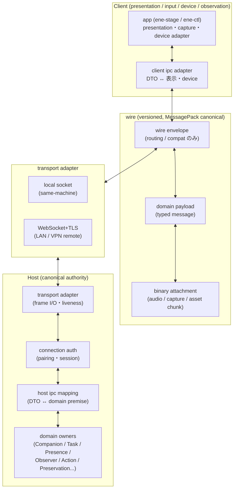

# Host↔Client IPC / wire protocol の具体設計 — Step 13 Concrete Design

本書は Step 13 の Host↔Client IPC / wire protocol artifact である。[対応関係・識別](correspondence-identity.md)（CI）、[Persistence / Recovery](persistence-recovery.md)（PR）、[Concurrency Control](concurrency-control.md)（CCT）、[Interface Boundaries](interface-boundaries.md)（IB）、[Crate / Module 分解](crate-module-decomposition.md)（CM）が定めた identity・保存分類・concurrency・interface contract・crate 依存方向を前提とし、変更しない。上位設計との優先順位と矛盾時の扱いは [設計文書 README](../README.md#正本と優先順位) に従う。

本書の Rust pseudo-type はコンパイル対象ではない。型名・field 名・message 名の同義改名は許すが、型の分離と field の意味は維持すること。Host / Client の crate 配置と `ene-api` 境界は [Crate / Module 分解](crate-module-decomposition.md)第8節、identity・currentness は CI / CCT に従い、本書はそれらを wire へ落とす。

## 1. 対象と非対象

### 1.1 本書が具体化するもの

- Host↔Client 間を越える必要がある semantic interface の選別（第2節）。
- protocol layer 構成（wire semantic と transport の分離、envelope と payload の分離）（第3・5節）。
- interaction pattern の区別（第4節）。
- message / domain identity の分離と correlation、retry admissibility・idempotency retention・command identity conflict の typed wire 表現（第6・21・24節）。
- Client incarnation / stale rejection（第11節）。
- Presence / Text / Voice / presentation（第12・13節）。
- Observation（第14節）。
- Client-dependent Action（第15節）。
- Cancellation（第16節）。
- Targeted Deletion 参加（第17節）。
- Management surface（第18節）。
- Body / presentation resources（第19節）。
- wire DTO pseudo-code（第21節）。Host domain type の derive Serialize 公開はしない。DTO → domain command への変換点を明示する。
- serialization 選択と比較（第7節）。format 選択だけで compatibility が成立するとは仮定しない。
- protocol versioning / compatibility（第7節）。
- capability negotiation（第8節）。claim ≠ Permission。
- authentication / pairing（第9節）。具体暗号 library・key format は固定しない。秘密 material を通常 payload へ載せない。
- transport 範囲と adapter boundary（第10節）。
- backpressure / streams（第22節）。global total ordering を要求しない。重要 control と高頻度 capture を同じ drop policy にしない。
- security（第23節）。typed DTO を boundary の代替にしない。
- error / rejection model（第24節）。transport error と domain rejection を潰さない。
- crate placement（第25節）。`ene-api` に logic を置かず、mapping module を別配置にする。
- walkthrough による検証（第26節）。transport success を domain success へ読み替えない。

### 1.2 本書が決めないもの（Design Freedom。第28節）

- 具体暗号 library・key format・鍵導出・証明書運用の詳細（property は第9節で固定）。
- heartbeat / keepalive / timeout / retry 回数・値、scheduling・capture 時機 algorithm、費用算定式。
- 具体 TCP port・mDNS 有無・NAT traversal・relay（relay は非目標のまま導入しない）。
- audio codec・capture 画像形式の最終選定（制約条件のみ第13・14節で固定）。
- UI layout・表示文言・具体保持期間・audit format。

## 2. Remote-capable 選別 — 何を wire へ出すか

IB 第15節の remote-capable interface を起点に、「network / process boundary を越えなければ成立しないか」で判定する。固定リストの機械的 protocol 化はしない。

### 2.1 越境させるもの（wire 化する）

| # | wire 群 | 越境する理由 | 対応する IB interface | 越境させる内容（最小） |
|---|---|---|---|---|
| W-1 | Owner Text / Voice input・presentation | Client が入力・表示の一時表現だけを持ち、Host 正本を持たないため | X-B（round 受付・提示・区切り） | input candidate、round 参照、stream frame、提示確認。会話の意味・History・Learning は出さない |
| W-2 | Companion presence / movement | 呼出し・移動意図は Client から届くが、成立は Host の帰属記録のため | X-A（移動・復帰） | move intent、transition ack、attribution fact。hint・復旧先だけでは成立させない |
| W-3 | undelivered presentation | 次 Client での要約報告は Host の元記録へ照合した派生表現のため | X-H / H-G（未伝達報告） | filtered summary、提示確認。元 Task・活動記録の正本は出さない |
| W-4 | Client availability / device capability | Host が presence・observation・Action 可否の前提として Client 側事実を必要とするため | X-D・X-F の観測事実部分 | availability fact、capability advertise/update。Permission にはならない |
| W-5 | Observer eligibility に必要な Client 側情報 | 対象・時機の判断材料が Client 側（fullscreen・pause・負荷等）にあるため | X-D（eligibility 連動） | eligibility 表示・状態 fact。Raw・候補・routing 文脈は出さない |
| W-6 | shared observation / capture の Client 側入出力 | Capture 実行者が Client であり、Host が ticket で統制するため | X-E（routing の両端のみ） | capture ticket、capture frame（candidate）、受入結果。routing semantic・専用 assignment は出さない |
| W-7 | Body / presentation resources | 表示資材の供給元が Host（Character 静的資材）で利用者が Client のため | C-A の資材利用分 | asset descriptor＋binary chunk。適用関係・経験状態は出さない |
| W-8 | Client-side Targeted Deletion 参加 | 接続中 Client の一時 data も holder として参加するため | D-B の Client 宛て分 | deletion demand（本文なし）、local result。対象本文・検索 token の永続化はしない |
| W-9 | Owner 管理面の入口と表示 | 管理操作の入口が Client にあっても確定は各 owner のため | IB 第9節 `ManagementOperationCommand` の Client 側入口 | management intent（candidate）、filtered view。高権限操作の要求は送れるが、最終確認は Host PC 上の trusted first-party management surface に限定する（§18）。control 正本・secret・判定 copy は出さない |
| W-10 | Client-dependent Action（Computer Use 等）の遂行 | 作用の実行者が Client device であるため | K-J（Client 限定）＋ K-H の Client 向け投影 | action command（concrete device op のみ）、receipt ack、progress、effect report。認可判断・許可条件は出さない |

### 2.2 越境させないもの（Host-local に留める）

- H-B〜H-E の形成・訂正・scope 意味判断、K-A〜K-C の制御確定・秘密利用、K-D〜K-G の割当解決・送信条件・予約確定、K-H の認可・作用確定、D-A・D-C・D-D の範囲確定・完了確定・switch、第13節の repository compare-and-commit 群。理由は IB 第15節のとおり。durable compare を Host 単一 SQLite transaction で不可分にするため、DB transaction を Client へ露出させない。秘密値を通常経路に載せない。
- Observer 専用 Provider assignment・routing semantic そのもの。Client へ authority として公開しない。Client が見るのは ticket と自身の capture 受入結果だけである。
- repository compare、cost reservation、Restore switch。wire へ出さない。
- 高権限操作の最終確認（§18）。remote の intent・確認済み申告を Host-local の確認として取り込まない。

### 2.3 選別の帰結

- Client が受け取る ID はすべて**用途限定参照（non-secret reference）**である。内部正本の主 key として再利用できる形で渡さない（CI §4.6、CM §3.2）。
- Client が保持・返送する correlation は第6節の最小 set に限定する。Host 内部の boundary token 全体（Task revision 前提・委任 scope・Permission evaluation・消去条件・復元条件の全文）は渡さない。Client が返すのは「どの wire 参照について」「Host が見たどの世代表示を前提にしたか」だけであり、Host が current と再照合する。

## 3. Protocol layer 構成

wire semantic と transport を分離する。envelope（routing / compatibility）と domain semantic payload を分離し、envelope を semantic owner・authority にしない。



層の責務：

| 層 | 持つもの | 持たないもの |
|---|---|---|
| transport adapter | frame I/O、liveness（heartbeat）、backpressure の伝達、peer 切断検知 | domain 意味・presence・許可・世代の判断。liveness を presence・報告完了にしない |
| connection auth | pairing・session・revoke・re-auth（第9節） | domain 許可・Task 反映・作用確定 |
| wire envelope | routing（recipient hint・stream mux）、compatibility（version・message type・correlation ID）、duplicate suppression key（第5・6節） | semantic owner・authority。envelope の存在・到着を確定にしない |
| domain payload | typed message（第4節の pattern 別）。Client は candidate / observation / ack を送り、Host は fact / decision 投影・command を送る | Host-local の確定条件全文・secret・判定 copy |
| binary attachment | audio frame・capture frame・asset chunk の byte 列（descriptor と対応付け） | 意味。descriptor なしの attachment を解釈しない |
| host ipc mapping | DTO validation、wire ref → domain premise への mapping、domain fact → DTO 投影（第25節） | 採否・達成・許可・確定度の判断（各 owner） |
| client ipc adapter | DTO → 表示・device 操作、device fact → DTO | canonical mutation・正本保持・authority 宣言 |

## 4. Protocol model — interaction pattern

すべてを一つの generic Event message へ統合しない。transport framing で共通 envelope を使っても semantic type は domain ごとに区別する。

| pattern | 意味 | 応答の約束 | 使う domain（例） |
|---|---|---|---|
| request / response | 問合せと回答。回答はその時点の view であり、後続利用の許可ではない | `request_id` で 1:1 対応。timeout は不明の原因であり、成功・失敗・未実行への書換えではない | pairing challenge、capability query（接続時以外）、management view 取得、asset descriptor 取得 |
| command + acknowledgement | Host→Client または Client→Host の「してほしい」と、その受付確認。ack は受信・記録であり、効果・完了ではない | `command_id` で対応。ack は `Received \| RejectedStale \| DeniedByHold \| Unsupported` 等の domain outcome。完了は別 message | move intent→transition ack、action command→receipt ack、deletion demand→local result（完了は Host 集約）、cancel request→cancel-received |
| one-way fact | authoritative 側からの一方向の伝達。受信は理解・採否を意味しない | 対応不要。最新値意味のものは supersede する | presence attribution broadcast、eligibility 表示、availability fact、revocation notice、body-state hint |
| subscription + notification | 購読登録と、その後の条件付き通知。購読は許可・presence ではない | `subscription_id` で管理。条件不成立・停止・失効で server 側が終了・保留を通知する | presence subscription、undelivered summary 更新、observation eligibility 変更 |
| stream (open / frame / close) | 順序付き frame 列。open が前提（ticket・session・round）を確定し、frame はその範囲内でのみ有効 | `stream_id`＋`seq`。close は `Completed \| Interrupted \| Cancelled \| Stale` を区別する。旧 stream の自動継続をしない | text token stream、voice audio stream、asset chunk stream |
| progress + completion | 長時間処理の中間報告と最終確定。progress は確定ではない | progress は `operation_id`＋単調 `progress_seq`。completion は certainty（成功 / 失敗 / 不明）を伴う | action progress→effect report、asset transfer progress→assembled、deletion local progress→local result |

pattern 横断の禁止：

- ack・受信・表示・保存成功を効果・完了・許可・報告完了にしない（CC-07）。
- subscription の存在を presence・許可・実行再開の根拠にしない。
- stream の open 成功を round・presence・許可の成立にしない。
- progress の到着を certainty の更新にしない。completion の `Unknown` を未実行・成功へ書き換えない。

## 5. Wire envelope — routing / compatibility 用

envelope は routing と compatibility のためだけに存在する。semantic owner・authority にならない。envelope の検証成功は payload の受入ではない。Host mapping は envelope 検証後に payload を validation し、domain premise へ mapping して各 owner の照合へ渡す。

```rust
// ene-api::v1::envelope（pseudo-code。wire DTO であり domain 型ではない）
struct WireEnvelope {
    protocol: ProtocolVersion,      // major.minor（第7節）
    message_id: WireMessageId,      // transport duplicate suppression key（第6節）
    correlation: WireCorrelation,   // request/response・command/ack・stream の対応付け
    sender: WireSender,             // device / incarnation / connection（第11節）
    observed: ObservedMarks,        // Client が見た世代表示の写し（主張ではなく照合材料）
    message_type: WireMessageType,  // payload の型識別（unknown type は拒否。第7節）
    payload: WirePayload,           // typed domain payload（第21節）
}

struct WireCorrelation {
    request_id: Option<RequestWireId>,  // request/response 用。Client 発行可
    command_id: Option<CommandWireId>,  // command/ack 用。発行者は方向別（第6節）
    stream_id: Option<StreamWireId>,    // stream 用。Host 発行が既定
    reply_to: Option<WireMessageId>,    // 応答対象 message（transport 対応用。domain 対応は ID 別）
    causation_span: Option<SpanWireId>, // 診断・追跡用。authority・順序の根拠にしない
}

struct WireSender {
    device_id: Option<DeviceWireId>, // pairing 前の PairingRequest のみ None
    incarnation_id: ClientIncarnationId,
    connection_id: Option<ConnectionWireId>, // auth 後に Host が付与。auth 前は None
}
// sender の方向別規則：Client→Host は自 device・自 incarnation・自 connection を載せる（device_id の None は
// pairing 前の PairingRequest に限定し、それ以外の欠落は不受理）。Host→Client は宛先 device・当該 Client の
// 最新 incarnation・当該 connection を載せる（connection_id の None は auth 前の応答に限定）。pairing 発行前の
// 応答（PairingResult の Pending / Denied 等）では device_id・connection_id とも None とし、request との対応付けは
// message_id / reply_to で行う。incarnation の echo は対応付けの補助であり、authority にはならない。

struct ObservedMarks {
    presence_generation_view: Option<u64>, // Client が見た presence generation 値の写し
    round_view: Option<RoundWireId>,       // Client が属するつもりの round
    ticket_view: Option<TicketWireId>,     // capture ticket 等の前提表示
}
```

envelope の扱い：

- `message_type` は routing の hint であり、payload の意味確定ではない。unknown type は `UnsupportedMessage` として拒否し、guess して処理しない。
- `observed` は Client の主張ではなく「Client が何を見て送ったか」の写しである。Host は durable・live と比較し、不一致なら stale として不受理にする。Client が自身を current だと宣言しただけでは成立しない。
- 秘密 material（pairing token・session proof・鍵）は通常 payload・envelope へ載せない。auth 専用 frame（第9節）でのみ扱う。
- 時刻は wall-clock＋作成時 timezone を保持する（CI §4.6）。時刻を revision / generation の代替・stale 判定の根拠にしない。

## 6. Message identity and correlation

### 6.1 識別子の分離

| 識別子 | 発行者 | 寿命・scope | 用途 | 再利用 |
|---|---|---|---|---|
| `WireMessageId` | 送信者（両方向） | 当該 message のみ。receiver cache は短期間（例：数分〜接続期間。値は Freedom） | transport duplicate suppression のみ | しない。新規送信・retry は新 ID |
| `RequestWireId` | request 送信者 | request/response 対 | request/response 対応 | しない |
| `CommandWireId` | command 送信者（方向別に発行者固定。第6.2節） | command→ack→completion の saga。semantic no-reexecute marker は、当該 authenticated sender epoch で command retry を受理し得る期間の全体を少なくとも覆う | domain idempotency key。詳細 outcome を compact しても再実行禁止の対応を失わない | transport retry は同 ID＋新 `message_id`。新しい user intent / effect retry では再利用しない |
| `StreamWireId` | Host が既定（Client は提案のみ） | stream open〜close | frame の帰属。旧 stream の frame を新 stream へ付け替えない | しない。再接続で旧 stream を継続しない |
| domain wire ref（`CompanionWireRef`・`ClientWireRef`・`RoundWireId`・`AttemptWireRef`・`OperationWireId`・`TicketWireId` 等） | Host が既定（Client-local ID は別系列） | 用途別（round・attempt・ticket・operation） | wire 上の対応付け。Host が内部 identity へ mapping する | しない。削除後に再発行しない |
| `ClientInputLocalId`・`CaptureLocalId` | Client | Client-local。Host へ送るのは対応付け用のみ | Client 側の送信物と ack・結果の対応 | Client 内で単調。Host の正本にしない |
| domain identity（`CompanionId`・`TaskId`・`ActionAttemptId` 等） | 各 lifecycle の owner（Host） | durable | canonical 対応 | しない。**`MessageId` を domain identity として再利用しない** |

wire ref と domain identity の関係：wire ref は Host mapping が内部 identity へ解決する opaque な参照であり、内部 newtype の文字列表現ではない。Client は wire ref の内部構造を解釈・合成・推測しない。Host は解決不能な ref を `UnknownRef`（domain outcome）として不受理にし、guess しない。

### 6.2 発行者規則・retry admissibility・idempotency retention

- Pairing / authentication の pre-auth request / response は authenticated sender epoch をまだ持たないため、本節の command retry idempotency の対象にしない。`PairingRequest` / auth frame は `request_id`・`message_id`・`reply_to` と第9節の単発 nonce / proof 規則で対応付け、認証前の sender tuple を domain command の idempotency namespace として使わない。
- Client→Host の input・ack・fact・capability・availability の `command_id` / `request_id` は Client が発行する。Host は認証後の domain command の `command_id` を domain idempotency key として扱い、同一 sender epoch 内の同一 `command_id` の再送には再実行せず prior outcome（または再実行を禁止できる typed 既処理結果）を返す。
- Host→Client の move transition・action command・deletion demand・capture ticket の `command_id` / `operation_id` / `stream_id` は Host が発行する。Client はこれらを minted しない。Client が command を合成・推測して送ることは protocol 違反として拒否する。
- **retry-admissible sender epoch。** Client→Host では、Host が current として受理している authenticated `(device_id, incarnation_id, connection_id)` の組を command retry の epoch とする。connection replacement・incarnation replacement・device revoke 等でその epoch が current でなくなった後は、旧 epoch の command を semantic 実行へ進める前に `StaleConnection` / `StaleIncarnation` 等で拒否する。Host→Client も同様に、当該 authenticated Client connection / incarnation へ発行した command を新 connection へ自動継続・replay しない。
- **保持期間の不変条件。** receiver は、retry を受理し得る sender epoch が current な間、受理済み `command_id` ごとに少なくとも「再実行禁止」を判定できる idempotency marker を保持する。詳細 response / progress を compact することはできるが、marker を先に捨てて同じ `command_id` を新規 command として実行してはならない。round 等の新しい durable identity を発行した command は、retry に同じ identity を返せる最小結果（例：`AcceptedForRound { round }`）も epoch の間保持するか、同じ durable 対応から再構成できること。
- marker は同じ `command_id` が同じ semantic command であることを確認できる fingerprint を持つ。fingerprint は少なくとも message kind、payload、target / premise に関係する `observed` field を含み、`message_id`・`reply_to`・診断用 span 等の送信ごとに変わる transport metadata を含めない。同一性を判定できる限り、canonical encoding / hash の具体方式は Freedom とする。
- sender epoch が stale になった後は、旧 envelope の sender tuple を stale check で拒否できるため、その epoch の idempotency marker を cleanup してよい。**marker eviction と old-command retry の受理を同時に許す状態を作らない。** exact retention 秒数を別契約として固定せず、受理可能範囲と保持範囲を同じ境界に結び付ける。
- retry の関係：transport retry（同一内容の再送）は**同一 `command_id`＋新規 `message_id`**で行う。receiver は `message_id` cache で重複配送を沈黙破棄し（再実行なし、ack 再送は可）、`command_id` の既処理 marker で二重実行を抑止する。前者を transport duplicate suppression、後者を domain idempotency とし、混同しない。`message_id` cache の短期 eviction は `command_id` の semantic no-reexecute 保証を弱めない。
- 同一 `(sender epoch, command_id)` で fingerprint が既処理時と一致しない場合は、owner の domain command へ mapping する前に `CommandReplayRejectWire::CommandIdConflict` を返し、副作用なしに拒否する。以前の結果を別内容へ流用したり、別 command として実行したりしない。
- fingerprint が一致する retry は prior domain outcome を再現して返す。詳細 prior outcome を保持できない command だけ `CommandReplayRejectWire::AlreadyProcessed` を返せるが、新しい identity を発行した command（例：`round=None`）はこの fallback を使わず、初回に発行した identity / outcome を保持または durable relation から再構成する。caller は `AlreadyProcessed` を新しい `command_id` で黙って retry する根拠にせず、現在 view の再取得・新しい user intent の明示へ戻す。
- external effect retry（作用の再実行）は transport retry ではなく**新しい attempt / operation**とし、Owner 判断を経る（第15節）。transport の再送で作用が二重実行される設計にしない。

### 6.3 Round・presence generation・incarnation の区別

- round（会話の区切り）は Host 発行の `RoundWireId` で識別する。`message_id`・`request_id` とは別である。旧 round の入力・未提示出力を新 round へ付け替えない（CI §3.5）。
- presence generation は Host-authoritative な lifecycle 順序（`PresenceGeneration`）であり、Client は `observed.presence_generation_view` として写しを返すだけである。一致だけでは不十分であり、現接続・機能可用性・許可・停止・保留も Host が照合する（CI §5.6）。
- Client incarnation（第11節）は connection identity・Client instance・presence generation とは別の次元である。三者を一つの「session id」へ潰さない。

## 7. Serialization と protocol versioning

### 7.1 serialization 選択

| 候補 | debuggability | Rust / 他言語 | schema 進化 | 評価 |
|---|---|---|---|---|
| JSON（text） | ◎（そのまま可読） | ◎ | △（field 規約次第） | control の可読性は最良だが、audio・capture・asset の binary を含む stream で size・encode 効率が悪い。binary を base64 で包む設計は避けたい |
| MessagePack | ○（JSON へ機械変換可） | ◎（serde＋多言語 library） | ○（field 規約＋version と併用） | JSON-compatible な論理 model のまま byte 効率を得られる。transport frame として素直に扱える |
| CBOR | ○（JSON へ機械変換可） | ○ | ○ | MessagePack と同系統。Rust・将来 Client 言語の library 普及では MessagePack が優位 |
| Protobuf | △（decode なしに読めない） | ○（codegen が必要） | ◎（field 番号） | schema registry 的運用・codegen 配布・可読 log の追加機構が必要になり、単一 Owner-managed Host の topology には過剰。custom binary protocol も作らない方針と衝突する |

**採用：MessagePack を canonical wire encoding とし、論理 data model は JSON-compatible に保つ。** すなわちすべての DTO は JSON としても表現できる形（string・integer・boolean・array・map のみ。binary は attachment へ分離）に定義し、wire 上は MessagePack で encode する。debug・log・監査表示では JSON rendering を用いる。binary blob（audio・capture・asset chunk）は payload に base64 埋めせず、binary attachment frame として descriptor と対応付けて送る（第21節）。

format 選択だけで compatibility が成立するとは仮定しない。互換性は第7.2節の version・capability・field 規約で成立させる。

field 規約（encoding によらず成立）：

- optional field の追加は許す。receiver は unknown field を無視する（log への記録は可）。無視したことを理由に意味を変えない。
- required field の追加・意味変更・unit 変更・enum variant の意味変更は required semantic change とし、major version bump を必要とする。guess して処理しない。
- enum は open にしない。unknown variant を受信したら当該 message を `UnsupportedFieldValue` として拒否する。default variant への黙読替えをしない。
- ID・revision・generation・correlation は明示 field として serialize する。本文中の文字列を照合に使わない（CI §4.6）。

### 7.2 protocol versioning

- `ProtocolVersion { major: u16, minor: u16 }` を envelope に載せる。`major` は semantic 互換の境界、`minor` は optional 追加等の後方互換の範囲である。
- capability negotiation（第8節）で connection ごとに negotiated version を確定し、connection record に保持する。以後の当該 connection の message は negotiated version で解釈する。version の混在を一つの connection 内で許さない。
- unknown optional field → 無視して処理継続する。
- unknown message type → `UnsupportedMessage`（domain outcome）で拒否し、connection は維持する。当該 command の副作用を起こさない。
- required semantic change → major bump。理解できない major の message は処理せず、`IncompatibleProtocol` で拒否する。guess しない。
- Host newer / Client older → Host は negotiated（older major/minor の共通範囲）で話すか、共通範囲がなければ upgrade hint 付きで拒否する。older Client へ newer 意味を黙って送らない。
- Client newer / Host older → Client は Host の advertised max へ downgrade するか、対応不能として拒否する。Host は理解できない newer 意味を guess しない。

version compatibility matrix：

| 組合せ | 方針 |
|---|---|
| major 一致・minor 一致 | 通常処理 |
| major 一致・片方が minor older | older の理解範囲で処理。unknown optional field は無視。不足 field は older の送信では送らず、newer の受信では default 扱いにせず「省略」として扱う（「制約なし」への変換禁止） |
| major 不一致（共通 major なし） | 相互運用しない。`IncompatibleProtocol{ host_max, client_max, hint }` で拒否する。自動互換にしない |
| unknown message type（negotiated 範囲内） | 当該 message のみ `UnsupportedMessage` で拒否。connection 維持 |
| unknown enum variant / required field 不足 | 当該 message のみ拒否（`UnsupportedFieldValue` / `MissingRequiredField`）。他 message へ波及させない |

## 8. Capability negotiation

Client によって Body・Voice・screen capture・Computer Use・notification・platform integration 等の対応能力が異なる。connection 時に Client capability を Host へ伝える。

```rust
// ene-api::v1::capability（pseudo-code）
struct CapabilityAdvertise {
    supported_protocol: Vec<ProtocolVersion>, // 対応 version 一覧
    features: Vec<ClientFeature>,             // 機能名＋可否＋制約
    limits: ClientLimits,                     // frame 上限・同時 stream 上限等の申告
    platform: PlatformDescriptor,             // OS・device 種別等の表示用。許可の根拠にしない
}

struct ClientFeature {
    kind: ClientFeatureKind, // Body2D | VoiceDuplex | ScreenCapture | ComputerUse |
                             // Notification | TrayIntegration | ...
    available: bool,
    detail: FeatureDetailRef, // codec・解像度上限等の申告。検証なしに信用しない
}

struct NegotiatedConnection {
    version: ProtocolVersion,          // Host が選択した negotiated version
    accepted_features: Vec<ClientFeatureKind>, // Host が受領した申告（許可ではない）
}
```

- capability claim ≠ Permission。Host は availability（申告）と Permission / current presence 等を別々に照合する。申告があっても許可・presence・device 許可なしには開始しない。
- Host は申告を availability fact として保持し、Action 可否・observation 対象・routing・UI 表示の材料にする。申告の存在を能力の証明にしない（必要なら Host が到達性・device 許可と合わせて確認する）。
- capability の変化（fullscreen 開始・device 喪失・負荷・mute 等）は `CapabilityUpdate` fact / `AvailabilityFact` で通知する。変化前に発行した ticket・command の有効性は延びない（各受入で現在照合する）。
- negotiated version・accepted features は connection record に保持し、`RestoreGeneration`・presence generation とは別の次元として扱う。混ぜない。

## 9. Authentication / pairing

上位 architecture の確定事項（Client-specific connection material、Credential との区別、Host 側での保護・revoke・recovery 確認）を具体 protocol へ落とす。具体暗号 library・key format は固定しない。秘密 material を通常 message payload へ載せない。

### 9.1 概念の区別

| 概念 | 意味 | 扱い |
|---|---|---|
| Credential（登録済み秘密） | Provider・MCP 等の認証のための Owner 登録秘密 | OS credential store 等の分離保管。wire へ平文で出さない。Client へ渡さない。Client auth の材料にしない |
| pairing material | 当該 Client device を Host が認識するための接続材料 | Host 正本の domain data でも Credential の cache でもない。Client で保持する場合は ene 内部の保護対象とし、接続目的へ限定する。device 失効を適用する |
| session material | 当該 connection のための一時的証明材料 | connection ごとに発行・破棄する。旧 session で新 session を復活させない |

### 9.2 pairing

1. 新しい Client は Owner が Host 側で確認できる device pairing を必要とする（要件 Remote Client）。pairing 開始は Client からの `PairingRequest{ device_descriptor }` とし、Host PC 上の trusted first-party management surface での Owner 最終確認待ちにする（§18）。pairing 済み Remote Client による承認だけでは成立させない。最初の `PairingRequest` は `DeviceWireId` 未発行のため envelope sender を `device_id: None`・自 incarnation・`connection_id: None` とし、これ以外の `device_id` 欠落は不受理にする（§5 の方向別規則）。
2. Owner 確認後、Host は新しい pairing identity と `DeviceWireId` を発行する。device record の非秘密表示参照（descriptor・pairing identity / wire 対応）は PR Group G、許可機能の記録は Group F、Host 側所有証明検証材料・現在 trust 範囲・失効状態は Group K の device-auth store（E）に保持する。最終接続は Group G に置く。pairing material は auth 専用 frame で Client へ渡し、通常 payload へ載せない。
3. 古い接続材料だけで Host 側の pairing・許可を復活させない。pairing 失効後の再 pairing は新規 pairing として Owner 確認を必要とする。

### 9.3 connection authentication・reconnect authentication

1. connection 確立ごとに `AuthChallenge (Host nonce) → AuthProof (Client 証明) → AuthResult (Host 判定＋ConnectionWireId 付与)` を行う。Host は現在の device-auth store（E）にある有効な pairing identity・検証材料へ照合し、不在・失効・確認不能なら拒否する。Client は秘密を平文で送らず、所有証明のみ送る。具体方式は Freedom とするが、「秘密の非露出」「nonce の単発性」「旧 proof の再利用禁止」の property を満たすこと。
2. 認証成功時に Host は当該 connection の `ConnectionWireId` を発行し、current connection（device ごと）を更新する。以後の Client→Host message は `sender.connection_id` を載せる。auth 前の message は pairing・auth 用に限定し、domain 操作を受け付けない。
3. reconnect は新規 connection として認証する。旧 `ConnectionWireId`・旧 stream・旧 ticket・旧 round を引き継がない。旧 connection の message は semantic idempotency lookup / domain 実行へ進める前に `StaleConnection` として拒否する。

### 9.4 revoke

- Owner は pairing 済み device・最終接続・許可された機能を確認し、device ごとに失効できる（要件）。§18 の最終確認を経て、`ene-permission` が失効を判断し、`ene-credential` の device-auth store（E）の Host 側検証材料を durable に無効化・削除する。`ene-presence` は現 connection・session を無効化して切断する。以後の auth 拒否は E 側の有効材料の不在を根拠とし、DB の表示用 flag だけに依存しない。E の無効化完了前に失効完了と返さず、途中失敗は未完了・利用保留として扱う。
- 失効した device の旧 material・旧 session では再接続・復活できない。失効の伝達は `RevocationNotice` fact で当該 Client へ知らせる（到達不能でも失効は成立する）。
- Host restart・Restore 後も失効は維持する。現在の device-auth store は backup 除外・Restore 維持対象であり（PR §9.2）、復元された device 参照・機能許可は現在の E 側 trust 範囲を広げない。全データ Reset では E 側 trust と検証材料も削除し、旧材料だけで復活させない。再 pairing は新 identity と現在の Host-local 最終確認を必要とする。

## 10. Transport

### 10.1 範囲の判断

wire semantic と transport を分離し、以下を共通化の範囲とする：envelope・payload・binary attachment の encoding、identity・correlation・version・auth property、domain pattern の意味。transport 差は adapter boundary の内側に閉じ込める。

| transport | 用途 | 選択 |
|---|---|---|
| same-machine | Host と同 PC の Client | OS local socket（Linux: Unix domain socket、Windows: named pipe または loopback＋OS peer 認証相当）。OS account 保護を前提とし、TLS は必須にしない。frame は length-prefixed（4-byte BE exclusive-length、上限付き） |
| LAN / remote device | 別 PC の Client（同一 LAN・Owner 管理 VPN） | WebSocket（binary message）＋TLS。ene 運営 relay・account・Cloud を接続要件にしない。単一 connection で論理 stream を多重する（`stream_id` で mux） |
| future transport | 将来の追加 | adapter 追加で対応する。wire semantic・DTO・version・auth property を変えない |

QUIC 等の採用は現時点でしない。理由：現在の topology（単一 Owner-managed Host、少数 Client、ticket 制御の低頻度 capture、WebSocket で足りる stream 多重）では必要性がなく、over-engineering になるためである。将来 transport は adapter として追加できる（第28節）。

「Host PC 上の Client」の判定材料は、Host transport adapter が接続経路と OS peer 認証から確定する `transport_class = SameMachine | Remote` とする。Client の platform・device descriptor・loopback アドレスの自己申告では確定しない。PR Group G の最終観測に記録し、現在の利用時には live connection の同じ分類と認証を再確認する。presence fallback はこの材料を使うが、管理面の trusted first-party 性はさらに §18 の確認境界を必要とする。

### 10.2 transport adapter boundary

```rust
// Host / Client 共有の adapter 概念（pseudo-trait。crate 配置は第25節）
trait TransportAdapter {
    async fn send_frame(&self, frame: TransportFrame) -> Result<(), TransportError>;
    async fn recv_frame(&self) -> Result<TransportFrame, TransportError>;
    async fn peer_liveness(&self) -> PeerLiveness; // Reachable | Suspected | Lost
}

enum TransportFrame {
    ControlFrame { bytes: Vec<u8> },
    BinaryFrame { descriptor_ref: WireMessageId, bytes: Vec<u8> },
}
```

- frame 上限を設け、超過は `FrameTooLarge`（transport error）として受信前に拒否する。具体値は Freedom とするが、control と binary で上限を分け、重要 control を高頻度 capture と同じ drop policy にしない（第22節）。
- heartbeat は transport liveness のためだけに使い、presence・帰属・許可・報告完了の authority にしない。`Suspected` / `Lost` は切断検知の一時状態であり、帰属 durable を即時破棄しない（CCT §10）。

## 11. Client incarnation / stale rejection

### 11.1 三者の区別

| 概念 | 識別子 | 発行者・寿命 | 意味 |
|---|---|---|---|
| connection identity | `ConnectionWireId` | Host が connection ごとに発行 | 当該 connection の識別。auth 成功時に current になる |
| Client instance / incarnation | `ClientIncarnationId` | Client が process boot ごとに発行（persisted counter＋random） | 当該 Client process 世代の識別。restart すれば変わる |
| presence generation | `PresenceGeneration`（値の写し） | Host の帰属 lifecycle が発行。Client は写しを返す | どの帰属区間に属するかの識別 |

三者を一つの session id へ潰さない。connection が変われば incarnation の新旧によらず旧 connection は stale であり、incarnation が変われば connection の新旧によらず旧 incarnation は stale である。presence generation は帰属の区間であり、connection・incarnation の新旧で代替しない。

### 11.2 wire property

- すべての Client→Host message の envelope は `sender{ device_id, incarnation_id, connection_id }` を載せる（第5節）。欠落は不受理の理由にする（「制約なし」への変換禁止）。例外は pre-auth の pairing・auth 用 message のみ：pairing 前の最初の `PairingRequest` は `device_id: None, connection_id: None`、paired Client の `AuthProof` 等は `device_id: Some`・`connection_id: None` で送る（§5 の方向別規則・§9.2・§9.3）。
- Host は device ごとの current `(incarnation_id, connection_id)` を保持する（durable の最終接続管理 record＋runtime の live 表）。認証後の domain command では、**command idempotency lookup / semantic execution より先に**次を照合する：
  1. `device_id` が pairing 済み・非失効であること（pairing 前の最初の `PairingRequest` を除く）。
  2. `connection_id` が当該 device の current であること（authentication 成功後の message にだけ適用する。pre-auth の pairing・auth 用 message は `None` を許可する）。
  3. `incarnation_id` が current incarnation と対応すること（旧 incarnation からの到着は stale）。
  4. `observed.presence_generation_view` が現在の帰属 generation と対応すること（Client 依存操作の場合）。
  5. `round_view` / `ticket_view` が現在の round / ticket と対応すること（該当操作の場合）。
- authenticated domain command では 1〜3 を満たした current sender epoch の command だけが第6.2節の semantic idempotency 判定へ進む。旧 epoch は stale reject されるため、旧 epoch の marker cleanup 後でも semantic 再実行へ到達しない。pre-auth pairing / auth message はこの idempotency lookup へ入れない。
- Client 側が自身を current だと宣言しただけでは成立しない。Host の durable・live との照合が必須である。確認不能を現在と推定しない。

### 11.3 stale 時の扱い

- stale は transport error ではなく domain outcome（`StaleConnection` / `StaleIncarnation` / `StaleRound` / `StaleTicket` 等の typed reject DTO）として返す。connection は維持する（auth 失敗・decode 失敗・unsupported protocol とは区別する。第24節）。
- stale message による presence・許可・Task 反映・作用開始・削除参加の成立・復活をしない。旧 round の入力は元 round へ対応付け、新 round へ付け替えない。

## 12. Presence protocol

Host 側の authoritative presence generation を基準とする。二つの Client が同一 Companion について同時に active だと確定できない protocol にする。Client 側 UI acknowledgment を presence 成立そのものの authority にしない。

### 12.1 message 群

| message | 方向 | pattern | 意味 |
|---|---|---|---|
| `MoveIntent` | Client→Host | command | 呼出し・移動意図（Owner 呼出し・事前指示・自発の別＋`expected_generation`）。成立ではなく提案 |
| `TransitionAck` | Host→関係 Client | ack＋fact | `旧→移行中→新` の durable 遷移結果（新 generation 付き）。移動元・移動先の両方へ送る |
| `PresenceAttributionFact` | Host→購読 Client | fact | 現在帰属（companion・state・active・generation）。最新値意味で supersede する |
| `DisconnectNotice` | 両方向 | fact | 切断の観測事実（検知側が送る）。帰属 durable の即時破棄ではない |
| `ReconnectHello` | Client→Host | command（再認証付き） | 再接続の申告。新規 connection auth を伴う。旧 state の復活要求ではない |
| `RecoveryInvite` | Host→Client | fact | Host restart 後の復旧誘い（復元前 Client への自動復元用）。presence 成立ではなく確認の求め |

### 12.2 規則

- 移動は Host の `expected_generation＋expected_state` の CAS による `旧→移行中→新` の durable 遷移で確定する（CCT §10）。simultaneous summon は先勝ちのみ成立させ、後着は `StalePresence` として不受理・再評価へ戻す。
- 移行中は新旧いずれでも Client 依存の新規開始をしない。旧 in-flight は安全な区切りまで継続し、旧作用の別 Client 自動継続をしない。
- Client の UI ack（`PresencePresentedAck`）は「表示した」ことの確認であり、presence 成立の authority ではない。ack がなくても帰属は成立し、ack があっても帰属は変わらない。
- 一時的な到達不能では帰属を直ちに捨てず、新規 Client 依存開始を抑止する。通常の Client 切断・process 終了が確定したら、Host の `ene-presence` は利用可能な Host PC 上の Client（§10.1 の SameMachine・現認証・`ene-permission` の device 許可・排他性を確認可能）へ、SD-Presence の CAS で `旧→移行中→Host PC Client` と遷移する。候補なし・確認不能なら `NoActive` に確定する。Host 側 Client 環境を自動起動しない。切断 Client 待ちの `RecoveryWait` は Host restart restoration に限る。通常切断後の再接続だけでは帰属を復帰させず、呼出し・事前指示・通常の自発判断を経る。Stop は disconnect と異なり、停止中 Companion に fallback・復旧を適用しない。
- Host restart restoration：Host は `presence_attribution`＋hint・復旧先（非現在の参照）を読み、`RecoveryWait` として再構成し、復元前 Client へ `RecoveryInvite` を送る。現接続・許可・排他性の確認ができれば `Present` へ確定し、できなければ active なしにする。別 Client への無条件自動移動・Stopped への適用・Task 再開権限化をしない。

### 12.3 DTO（抜粋。全体は第21節）

```rust
struct MoveIntent {
    companion: CompanionWireRef,
    from_client: Option<ClientWireRef>,
    to_client: ClientWireRef,
    reason: MoveIntentReason,
    expected_generation: u64,
    intent_id: CommandWireId,
}
enum MoveIntentReason { OwnerSummon, PriorInstruction, SpontaneousNeed }
enum MoveReason {
    OwnerSummon, PriorInstruction, SpontaneousNeed,
    DisconnectFallback,
    ReconnectRecovery,
}
enum MoveOutcome {
    Transitioning { new_generation: u64 },
    RejectedStalePresence { current_generation: u64 },
    DeniedByConstraint { reason: DenyReasonWire },
    HeldForSafeClosure,
}
```

`MoveReason` は Host の遷移記録と `TransitionAck` / `PresenceAttributionFact` の理由投影に使う。Client 起点の `MoveIntent` では Host 専用の二理由を送れない。`ReconnectRecovery` は Host が現在の `RecoveryWait`・復旧先へ対応付けた `RecoveryInvite` に対する再認証・`ReconnectHello` の応答事実を照合した場合だけ記録する。hello 単独では復旧待ちを作らない。

## 13. Text / Voice / presentation

生成完了、Host 送信、Client 受信、Owner への提示を同一事実として扱わない。

### 13.1 Text

| message | 方向 | pattern | 意味 |
|---|---|---|---|
| `SubmitTextInput` | Client→Host | command | Owner 入力 candidate（companion 参照・round 参照または新規開始 None・`ClientInputLocalId`・本文）。受理ではなく提案 |
| `RoundIntakeOutcome` | Host→Client | ack（domain outcome） | `AcceptedForRound \| StaleRound \| HeldForTransition \| NeedsRevalidation`。旧 round なら元 round へ対応付け、新 round へ付け替えない |
| `TextStreamOpen` | Host→Client | stream open | 応答 stream の開始（`stream_id`・round・generation 付き）。open 成功は提示・達成ではない |
| `TextStreamFrame` | Host→Client | stream frame | 部分出力（`seq`・delta text・`is_final`）。`seq` 順に提示する |
| `TextStreamClose` | Host→Client | stream close | `Completed \| Interrupted \| Cancelled \| Stale` の区別 |
| `ConfirmPresentation` | Client→Host | observation | 提示確認（`Presented \| Unknown \| Failed`＋理由）。送信≠報告完了 |

- input attribution：入力は「どの Client のどの round で Owner が送ったか」の対応（companion・client・round・generation）を伴う。話者認証の意味を足さない。
- round identity：round は Host 発行の `RoundWireId` である。移動・切断・再起動で旧 round の入力・未提示出力を新 round へ付け替えない。
- 初回入力は `SubmitTextInput.round = None` で新規 round の開始を要求できる。`observed.presence_generation_view` は必須、`observed.round_view` は None とする。Host の `ene-presentation::round` が現接続・帰属・許可・停止・保留を照合して round を発行し、IB X-B の非 optional `RoundId` へ解決して受理し、`AcceptedForRound { round }` を返す。mapping 自体は round を発行しない。以後の当該 round 入力は `Some(round)` を使い、旧 round の拒否を None への自動再送で迂回しない。
- **None 要求の retry は第6.2節の semantic idempotency に従う。** current sender epoch で同一 `command_id`・同一 fingerprint を再送した場合、Host は初回に発行した round / outcome を再現して返し、別 round を発行・別入力として受理しない。少なくともその epoch の間はこの対応を再構成できる marker / result を保持する。marker を evict した後も retry を新規 None 要求として受理する状態は作らない。sender epoch が stale なら round 発行より先に stale reject する。同じ ID で fingerprint が違えば `CommandReplayRejectWire::CommandIdConflict` とする。
- partial / streaming output：`stream_id`＋`seq`＋`is_final` で順序付ける。`is_final` なしの frame を完了にしない。
- 未提示出力は `UndeliveredSummary`（第18節・W-3）へ接続し、次 Client で現在の結果・利用制限・削除状況へ照合して要約報告する。送信・受信を報告完了にしない。

### 13.2 Voice

| message | 方向 | pattern | 意味 |
|---|---|---|---|
| `VoiceStreamOpen` | 両方向合意（Client 要求＋Host 確定） | stream open | voice session の開始（`VoiceSessionWireId`・round・codec・generation 付き） |
| `VoiceAudioFrame` | 両方向 | stream frame | audio binary（attachment。`seq`・時刻付き） |
| `VoiceControl` | 両方向 | command＋fact | Mute・barge-in・interruption・停止要求等の制御。`Mute` は Client-local 即時＋Host への fact 通知 |
| `VoiceStreamClose` | 両方向 | stream close | `Completed \| Interrupted \| Cancelled \| Stale` の区別 |

- Voice stream の再接続で旧 stream を自動継続しない。stream / session-specific identity（`VoiceSessionWireId`）を導入し、再接続は新規 open とする。旧 session の frame を新 session へ付け替えない。旧 session の到着は `StaleStream` として破棄・元記録に留める。
- Mute・Voice 停止・会話停止・承認拒否は Voice だけに依存せず keyboard で操作できる（要件）。protocol 上は `VoiceControl` とは別の `ManagementIntent`（停止・拒否）としても送れること。Voice frame の到着停止を停止完了・承認拒否とみなさない。
- VAD・barge-in・audio buffer は Client-local transient であり、wire へ状態正本として送らない。送るのは制御と frame のみである。
- Microphone が周囲発話を拾い得ることの明示は UI・管理面の責務であり、protocol は話者認証済みの意味を付与しない。

### 13.3 presentation acknowledgement・delivery failure・undelivered

- `ConfirmPresentation{ Presented | Unknown | Failed }` を Client→Host の observation とする。`Presented` は当該 Client での提示確認であり、Task 達成・作用成功・承認ではない。`Unknown`（提示不明）は保持し、確定済みにしない。
- delivery failure（transport 到達不能・decode 失敗・Client crash 等）は transport・Client adapter の事実であり、Host は該当出力を `Undelivered` として保持し、次 Client で要約報告する。failure を報告完了・削除・再送の自動化にしない。再送は新 round・新 stream の現在照合を経る。

## 14. Observation

共有 Observation について、capture request / eligibility・captured data / candidate・routing に必要な Client relation・stale capture・Stop / move 後の late capture / result を wire 上で安全に扱える形にする。Raw capture を必要以上に Host へ常時送る設計を前提にせず、privacy / performance 要件から ticket 制の pull にする。

### 14.1 message 群

| message | 方向 | pattern | 意味 |
|---|---|---|---|
| `EligibilityFact` | Host→Client | fact | 当該 Client の観測可否・条件（対象範囲＝desktop 全体、頻度上限、pause/off、fullscreen 休止等）の表示用 |
| `CaptureTicket` | Host→Client | command | 一回分の capture 許可（`TicketWireId`・対象・期限・generation 付き）。ticket なしの capture 送信を受け付けない |
| `CaptureFrame` | Client→Host | command（candidate 提出） | capture 結果（`CaptureLocalId`・ticket 参照・取得時刻・descriptor＋binary attachment）。Raw の常時送信ではなく ticket 応答の一回分 |
| `CaptureOutcome` | Host→Client | ack（domain outcome） | `AcceptedForRouting \| SuppressedByControl \| StaleTicket \| StaleGeneration`。受信は routing 採否・理解・発話判断ではない |
| `AvailabilityFact` | Client→Host | fact | fullscreen・pause・負荷・capture 可否等の Client 側事実 |

### 14.2 規則

- Host は対象 Client へ順番に timing をずらして ticket を配る（要件の負荷分散）。複数対象 Client に同時 capture させない。各 ticket は一回限り・期限付きであり、期限切れ・移動・Stop・Pause 後の ticket は無効になる。
- Client は ticket があるときだけ capture し、ticket 参照付きで送る。ticket なし・旧 ticket・旧 generation の capture は `StaleTicket` / `StaleGeneration` として不受理にし、現在活動へ付け替えない。
- routing に必要な Client relation（どの Client の・いつの・どの ticket の capture か）は envelope＋`CaptureFrame` の明示 field で運ぶ。本文・画像 byte の解析に依存しない。
- Stop / move 後の late capture / result は元の ticket・世代へ対応付け、現在の対象・routing への自動採用をしない。旧 Client の旧 capture・候補で新規 capture・delivery を続けない。
- Raw capture は通常保存しない（要件）。Host は受信した capture を routing 判断の範囲で利用し、Task の Computer Use とは区別する。画面内指示を Owner 依頼・承認にしない。
- Observer 専用 Provider assignment・routing semantic そのものは Host 側 contract であり、Client へ authority として公開しない。Client が見るのは ticket・自身の `CaptureOutcome`・`EligibilityFact` だけである。

## 15. Client-dependent Action（Computer Use 等）

Host での現在認可・Client target・attempt identity・presence generation・concrete device operation・acknowledgement・effect result / unknown を失わない wire contract にする。**Client へ action command が届いたこと ≠ effect 成功**である。disconnect / response loss 時に Host が自動 retry 可能だと誤認する protocol にしない。transport retry と external effect retry を分離する。

### 15.1 message 群

| message | 方向 | pattern | 意味 |
|---|---|---|---|
| `ClientActionCommand` | Host→Client | command | concrete device operation（`OperationWireId`・`AttemptWireRef`・target client・generation・操作記述・制約・idempotency key）。認可判断そのものは含めない |
| `ActionReceiptAck` | Client→Host | ack | 受信確認（`Received \| RejectedStale \| DeniedByHold \| UnsupportedCapability`）。受信は効果・成功ではない |
| `ActionProgress` | Client→Host | progress | 中間報告（`progress_seq`・状態 hint）。確定ではない |
| `EffectReport` | Client→Host | completion | 効果報告（`ConfirmedSuccess \| ConfirmedFailure \| Unknown`＋根拠参照）。`Unknown` は粘着させる |
| `ActionCancel` | Host→Client | command | 停止要求（第16節）。delivery を停止完了にしない |

### 15.2 規則

- Host は現在認可（K-B の今回確定）を経て初めて `ClientActionCommand` を発行する。command には `AttemptWireRef`（当該試行）・`OperationWireId`（論理操作。retry を束ねる対応）・presence generation・target client・concrete 操作を載せる。Task revision 前提・委任 scope・実対象・操作種別・依拠 Permission の全文は載せない（Host が mapping で保持する）。
- Client は受信したら `ActionReceiptAck` を返す。`Received` は「受け取った」ことであり、成功・実行開始・完了のいずれでもない。stale（旧 generation・旧 connection・旧 attempt・ capability 不足）は `RejectedStale` 等で返す。
- 効果の確定は `EffectReport` の certainty で行う。`Unknown`（disconnect・response loss・確認不能）は未実行・成功・失敗へ書き換えない。Host は attempt を `Unknown` のまま durable に保持し、重複 risk 付き Owner 判断へ戻す（CCT §8）。
- disconnect / response loss 時の自動 retry をしない。transport の再送（同一 `command_id`＋新 `message_id`）は、同じ sender epoch 内で第6.2節の marker により再実行を防ぎつつ受信・ack の再送に留める。作用の再実行は新しい attempt（新 `AttemptWireRef`）＋Owner 判断を必要とする。Client は再接続時に旧 command を自動再実行しない。
- Computer Use の対象は現在の active Client に限定する（要件）。移動時は安全に区切れるところまで移動を遅らせ、元 Client の Action を別 Client で自動再実行しない。ambient Observation の有効化を操作の承認にしない。

## 16. Cancellation

wire cancellation について、cancel request・Client receive acknowledgement・computation / action stop acknowledgement・actual effect certainty を区別する。Cancel message delivery を停止完了として扱わない。

| message | 方向 | pattern | 意味 |
|---|---|---|---|
| `CancelRequest` | 両方向（要求元→実行側） | command | 停止要求（対象 operation / stream / attempt 参照＋理由）。受付と完了を分ける |
| `CancelReceived` | 実行側→要求元 | ack | 受付確認（記録したこと）。停止完了ではない |
| `StopAck` | 実行側→要求元 | completion（停止側） | 停止結果（`Stopped \| AlreadyCompleted \| StopUnknown`＋既作用・未保存の対応）。外部作用の rollback 保証ではない |
| `EffectCertaintyUpdate` | 実行側→要求元 | fact | 最終の効果確定度（`ConfirmedSuccess \| ConfirmedFailure \| Unknown`）。新 evidence でのみ更新する |

- Host→Client の Action cancel と Client→Host の inference / stream cancel（barge-in・応答停止等）の両方向に同じ区別を適用する。
- future drop・connection 切断を停止完了とみなさない。停止後に届く遅延結果は元 attempt・元 operation へ記録し、現在の目的への自動採用・後続自動開始をしない。

## 17. Targeted Deletion 参加

Client 内に Ene 管理下の temporary copy が存在する場合の wire 参加を成立させる。削除対象本文そのものを「照合用」として無制限に Client へ再送しない。Client local completion だけを global completion にしない。

### 17.1 message 群

| message | 方向 | pattern | 意味 |
|---|---|---|---|
| `DeletionDemand` | Host→Client | command | local 削除要求（`DeletionOpWireId`・sweep・valid interval・target descriptor。本文なし） |
| `DeletionProgress` | Client→Host | progress | 処理中報告（任意） |
| `LocalErasureResult` | Client→Host | completion（局所） | local 検証・結果（wiped・unverified range・unreachable の区別）。全域完了ではない |
| `DeletionCompletedNotice` | Host→Client | fact | 全参加・残存検証・区間内再到着取込み・検索 token の除去 / 復元不能化まで完了した後の全域完了通知。Client の完了証拠にしない |

### 17.2 target / condition の Client 向け representation（本文を送らない）

```rust
struct DeletionDemand {
    operation: DeletionOpWireId,
    sweep: u64,
    valid_interval: ValidIntervalWire,
    targets: Vec<DeletionTargetWire>,
}

enum DeletionTargetWire {
    WipeClass { class: ClientTempClass, range: TimeRangeWire },
    EraseItemRef { item: ItemWireRef },
}
```

- 機械的条件の文字列そのものを Client へ送らない。Client は class＋interval＋item ref で特定できる一時 data を wipe し、範囲・未確認を報告する。Host 側の機械的検索・残存検証は Host が行う。意味的補助（言換え特定）の完全性は保証しない（CI §3.6）。
- Client は `LocalErasureResult{ wiped, unverified_range, unreachable_detail }` を返す。到達不能・未確認を成功と読まない。再接続時に旧 copy を Host へ戻して再形成しない。
- stale Client result（旧 operation・旧 sweep の結果）は現在の全域完了に採用しない。元 operation への記録に留める。
- `DeletionDemand` の Client-side target descriptor は操作期間のみ保持し、完了時に破棄する。Host の機械的検索 token は PR / CCT の契約に従い、全参加・残存検証・区間内再到着取込みの後に除去または復元不能化し、その成立を確認してから全域完了を durable に確定する。最終消去と完了 marker が不可分でない間は `finalizing` の未完了として扱う。完了記録・Audit へ対象本文を戻さない。

## 18. Management surface

Owner 管理面が Client に存在しても、Client から送られる control 変更は **Owner intent / candidate request** であり、Host-side control owner が最終的に成立させる既存 contract（IB 第9節・K-A）を維持する。管理画面から Permission・Provider・Rule 等を変更できる場合でも、Client が control state 正本を所有する protocol にしない。

### 18.1 高権限操作の確認境界

device pairing 承認など trust root を変更する高権限操作の最終確認は、**Host PC 上の trusted first-party management surface** で行う。Remote Client から要求を送ることは許すが、Remote Client だけでは成立させない。これは既存の Host 側確認 contract の具体化である。

- 対象は pairing / 再 pairing、device trust・機能許可の変更・revocation（自身の device を含む）、Credential の登録・更新・差替え・失効、Restore の実行確認と復元後の一括有効化、Full Reset の削除対象を列挙した強い確認である。同じ trust / 強制境界を変更する操作（Local MCP の sandbox 外許可・重要変更や、その境界を緩和する管理変更）も同じ確認を通す。`ManagementIntentKind` の名前でなく実際の操作・対象・影響で分類し、Rule・設定 Reset・別の汎用管理入口を経由して迂回しない。
- Host は §10.1 の SameMachine と OS peer 認証に加え、Host 管理下の第一者管理入口であることを確認する。任意の同居 Client、pairing 済みであること、capability claim、`rationale`、`base_view` はこの資格を与えない。初回 Setup も remote pairing に依存せず利用できるこの Host-local 入口を使う。具体的な OS 上の入口識別・保護方式は Freedom だが、自己申告では代替しない。
- Remote の高権限 intent は要求として受け付け、`NeedsClarification` と filtered view で Host PC での最終確認待ちを示す。承認済みの申告や最終確認の代行は `DeniedByBoundary` とし、変更を適用しない。Host-local 入口で Owner が対象・変更内容・影響を確認した事実を、Host 内で当該操作と現在の前提に結び付けて担当 owner へ渡す。最終確認は remote wire DTO に載せず、確認後の対象・内容変更や stale 前提には再確認を必要とする。確認の replay・包括的流用をしない。
- 第一者管理入口を Computer Use・Tool・MCP Apps・Plugin・LLM 出力や remote からの代理入力で操作しても、Owner の最終確認として受理しない。管理面の active presence は必須ではなく、Text から到達でき、本体 LLM・長時間 Task・Body・Voice の成功を待たない。
- 通常の filtered view・停止・Cancel・承認拒否等は既存の remote-capable 経路を使う。backup 作成や通常削除を含む複合 kind 全体を高権限と一括扱いせず、上記対象と既存の個別確認条件を担当 owner が適用する。Credential の秘密値入力・保管は保護された Host-local 認証設定経路で扱い、管理 wire payload に載せない。

### 18.2 DTO と受入

```rust
struct ManagementIntent {
    intent_id: CommandWireId,
    kind: ManagementIntentKind,
    target: ManagementTargetWire,
    base_view: BaseViewMark,
    rationale: IntentRationaleWire,
}
enum ManagementOutcome {
    AppliedAsOneTime,
    StoredAsRuleView,
    NeedsClarification,
    DeniedByBoundary,
    StaleBaseView { current: ViewMark },
    HeldByOperation,
}
```

- Host は intent を `ProposeControlChangeCommand` 等の domain premise へ mapping し、各 owner の確定を経て `ManagementOutcome` を返す。Client の送信成功・表示更新を確定にしない。
- Client が受け取る view（rule 概要・consent 概要・cap・device・audit 概要等）は filtered display fact であり、正本ではない。secret・判定 copy・内部 permission 条件の全文は送らない。view の revision 表示は correlation の写しであり、Client がそれを権限の根拠にしない。

## 19. Body / presentation resources

- Host は表示資材（VRM・motion 設定・voice 設定等の静的資材）を asset descriptor＋chunk stream で供給する。適用関係・経験状態は送らない。内部正本の主 key として再利用できる形で渡さない。
- Client は資材を transient cache として扱う（canonical にしない）。version（`CharacterRevision` の表示ラベル）が変われば旧 cache を破棄する。Targeted Deletion・Reset の参加時は asset cache も wipe 対象にする。
- Host→Client の身体表現は high-level body-state hint（idle / listening / speaking / working / attention 等の fact）に留める。関節角・blendshape 等の staging は Client-local で行い、wire 正本にしない。出力した表情・motion を Companion State の正本・永続変化の根拠にしない。
- 描画失敗・fullscreen・高負荷は Client fact として Host へ知らせるが、Text・管理・復旧へ波及させない。Body 表示に失敗してもテキスト会話・Task 管理・設定・復旧操作を利用できる（要件）。

## 20. Message inventory

pattern・方向・authority の所在を一覧する。envelope 自体は含めない。

| # | message | 方向 | pattern | authority / 確定者 |
|---|---|---|---|---|
| M-1 | `PairingRequest / PairingResult` | C→H / H→C | request/response | Host（§18 の trusted Host-local Owner 最終確認）。Client 要求は申込み |
| M-2 | `AuthChallenge / AuthProof / AuthResult` | H→C / C→H / H→C | request/response（auth 専用） | Host。旧 material で復活させない |
| M-3 | `CapabilityAdvertise / NegotiatedConnection` | C→H / H→C | request/response（接続時） | Host（選択）。申告は availability fact |
| M-4 | `CapabilityUpdate / AvailabilityFact` | C→H | fact | Host（材料）。許可・presence ではない |
| M-5 | `MoveIntent / MoveOutcome(TransitionAck)` | C→H / H→C | command+ack | 接続・存在（帰属成立）。意図は個体調整・Client |
| M-6 | `PresenceAttributionFact` | H→C | fact（subscribe） | 接続・存在。最新値意味 |
| M-7 | `DisconnectNotice / ReconnectHello / RecoveryInvite` | 両方向 | fact / command / fact | 帰属は接続・存在。hello は申告 |
| M-8 | `SubmitTextInput / RoundIntakeOutcome` | C→H / H→C | command+ack | 入出力・提示（None 要求の round 発行）＋個体調整（会話受理）＋接続・存在（帰属照合） |
| M-9 | `TextStreamOpen / Frame / Close` | H→C | stream | 入出力・提示（round 実際）。意味は個体調整 |
| M-10 | `ConfirmPresentation` | C→H | observation | 個体調整（報告状況）。送信≠報告 |
| M-11 | `UndeliveredSummary / UndeliveredAck` | H→C / C→H | subscription＋fact / observation | 個体調整（必要性）＋入出力・提示（提示事実） |
| M-12 | `VoiceStreamOpen / AudioFrame / VoiceControl / VoiceStreamClose` | 両方向 | stream＋command | round 実際は入出力・提示。会話意味は個体調整 |
| M-13 | `EligibilityFact / CaptureTicket` | H→C | fact / command | 共有観測（対象・時機） |
| M-14 | `CaptureFrame / CaptureOutcome` | C→H / H→C | command+ack | 共有観測（routing 採否）。受信は理解・採否ではない |
| M-15 | `ClientActionCommand / ActionReceiptAck / ActionProgress / EffectReport` | H→C / C→H | command+ack＋progress+completion | 実行・拡張（作用・確定度）。command 到着≠成功 |
| M-16 | `ActionCancel(CancelRequest) / CancelReceived / StopAck / EffectCertaintyUpdate` | 両方向 | command+ack＋completion＋fact | 各 owner（事実の帰属）。delivery≠停止完了 |
| M-17 | `DeletionDemand / DeletionProgress / LocalErasureResult / DeletionCompletedNotice` | H→C / C→H | command+ack相当＋fact | 保全・消去（全域確定）。局所完了≠全域完了 |
| M-18 | `ManagementIntent / ManagementOutcome` | C→H / H→C | command+ack（candidate+decision 投影） | 各 control owner。intent は提案。高権限の最終確認はこの remote wire を通さず §18 の Host-local 入口で行う |
| M-19 | `ManagementViewRequest / ManagementView` | C→H / H→C | request/response | 各 owner（表示用投影）。view は正本ではない |
| M-20 | `AssetDescriptorRequest / AssetDescriptor / AssetChunkStream` | C→H / H→C | request/response＋stream | Character（静的内容供給）。適用確定は個体調整 |
| M-21 | `BodyStateHint` | H→C | fact | 個体調整（活動状態）＋認識・学習（内的状態の意味）。表示 staging ではない |
| M-22 | `RevocationNotice` | H→C | fact | 権限・制約＋接続・存在。到達不能でも失効は成立 |
| M-23 | `UnsupportedMessage / IncompatibleProtocol` | H→C（主に） | reject（第24節） | transport / mapping。副作用なし |
| M-24 | `CommandReplayRejectWire` | receiver→command sender | typed wire reject | command correlation / idempotency boundary。domain owner へ mapping 前に `CommandIdConflict`、または replayable prior outcome を失った非 identity-minting command の `AlreadyProcessed` を返す。副作用なし |

## 21. Wire DTO（pseudo-code）

すべて `ene-api::v1::*` の wire DTO であり、Host domain newtype・durable row・secret を含まない。wire ref は Host mapping が内部 identity へ解決する opaque 参照である。Client は構造を解釈・合成しない。

```rust
// ---- 共通 ----
struct ProtocolVersion { major: u16, minor: u16 }
struct WireMessageId(/* opaque; 新規送信ごとに新規 */);
struct RequestWireId(/* opaque */);
struct CommandWireId(/* opaque */);
struct StreamWireId(/* opaque */);
struct ConnectionWireId(/* opaque */);
struct DeviceWireId(/* opaque */);
struct ClientIncarnationId { counter: u64, random: u64 }
struct CompanionWireRef(/* opaque; Host 発行 */);
struct ClientWireRef(/* opaque; Host 発行 */);
struct RoundWireId(/* opaque; Host 発行 */);
struct VoiceSessionWireId(/* opaque; Host 発行 */);
struct TicketWireId(/* opaque; Host 発行 */);
struct OperationWireId(/* opaque; Host 発行 */);
struct AttemptWireRef(/* opaque; Host 発行 */);
struct DeletionOpWireId(/* opaque; Host 発行 */);
struct ItemWireRef(/* opaque; Host 発行 */);

enum CommandReplayRejectWire {
    CommandIdConflict { command_id: CommandWireId },
    AlreadyProcessed { command_id: CommandWireId },
}
// command correlation 専用の typed reject。transport error でも domain owner の巨大共通 error でもない。
// identity を発行した command では AlreadyProcessed に逃がさず prior outcome / identity を再現する。

// ---- presence ----
struct PresenceAttributionWire {
    companion: CompanionWireRef,
    state: PresenceStateWire,
    active_client: Option<ClientWireRef>,
    generation: u64,
    move_reason: Option<MoveReason>,
}

// ---- text ----
struct SubmitTextInput {
    companion: CompanionWireRef,
    round: Option<RoundWireId>,
    local_id: ClientLocalId,
    body: TextBodyWire,
}
struct TextBodyWire { text: String, lang: TextLangWire }
enum RoundIntakeOutcomeWire {
    AcceptedForRound { round: RoundWireId },
    StaleRound { current_round: Option<RoundWireId>, current_generation: u64 },
    HeldForTransition,
    NeedsRevalidation { reason: RevalidationReasonWire },
}
struct TextStreamFrameWire {
    stream: StreamWireId,
    seq: u64,
    delta: String,
    is_final: bool,
}
struct ConfirmPresentationWire {
    round: RoundWireId,
    stream: Option<StreamWireId>,
    status: PresentationStatusWire,
    detail: Option<String>,
}

// ---- voice ----
struct VoiceStreamOpenWire {
    session: VoiceSessionWireId,
    round: RoundWireId,
    codec: VoiceCodecWire,
    generation: u64,
}
struct VoiceControlWire {
    session: VoiceSessionWireId,
    control: VoiceControlKindWire,
}

// ---- observation ----
struct CaptureTicketWire {
    ticket: TicketWireId,
    scope: CaptureScopeWire,
    expires_at: WallClockWire,
    generation: u64,
}
struct CaptureFrameWire {
    ticket: TicketWireId,
    local_id: ClientLocalId,
    captured_at: WallClockWire,
    descriptor: CaptureDescriptorWire,
}
enum CaptureOutcomeWire {
    AcceptedForRouting,
    SuppressedByControl { reason: IneligibilityReasonWire },
    StaleTicket,
    StaleGeneration { current_generation: u64 },
}

// ---- action ----
struct ClientActionCommandWire {
    operation: OperationWireId,
    attempt: AttemptWireRef,
    target_client: ClientWireRef,
    generation: u64,
    device_op: DeviceOpWire,
    constraint: ActionConstraintWire,
    idempotency_key: CommandWireId,
}
struct DeviceOpWire {
    kind: DeviceOpKindWire,
    target: DeviceTargetWire,
    params: DeviceParamsWire,
}
enum ActionReceiptAckWire {
    Received,
    RejectedStale { current_generation: u64 },
    DeniedByHold { reason: HoldReasonWire },
    UnsupportedCapability { kind: ClientFeatureKindWire },
}
struct EffectReportWire {
    operation: OperationWireId,
    attempt: AttemptWireRef,
    certainty: CertaintyWire,
    grounds_ref: GroundsRefWire,
}

// ---- cancel ----
struct CancelRequestWire {
    target: CancelTargetWire,
    reason: CancelReasonWire,
}
enum CancelReceivedWire { Recorded }
enum StopAckWire { Stopped, AlreadyCompleted, StopUnknown }

// ---- deletion ----
struct DeletionDemandWire {
    operation: DeletionOpWireId,
    sweep: u64,
    valid_interval: ValidIntervalWire,
    targets: Vec<DeletionTargetWire>,
}
struct LocalErasureResultWire {
    operation: DeletionOpWireId,
    wiped: Vec<WipedClassWire>,
    item_results: Vec<ItemErasureResultWire>,
    unverified_range: Vec<UnverifiedRangeWire>,
}

// ---- management ----
struct ManagementViewWire {
    mark: ViewMarkWire,
    sections: Vec<ViewSectionWire>,
}
```

DTO → Host domain command への変換点（Host ingress mapping。判断は各 owner）：

| wire DTO | mapping 先（domain premise） | 判断 owner |
|---|---|---|
| `SubmitTextInput` | §13.1 に従い入出力・提示が None を新規 `RoundId` へ解決した後、`SubmitClientInputCandidate{ companion, client, claimed_generation, round }`（IB X-B） | 入出力・提示（round 発行）＋個体調整（受理）＋接続・存在（帰属照合） |
| `ConfirmPresentation` | `ConfirmPresentationObservation`（IB X-B） | 入出力・提示＋個体調整 |
| `MoveIntent` | `RequestMoveCommand`（IB X-A） | 接続・存在 |
| `CaptureFrame` | `PublishObservationCandidate` の Client 由来部分（IB X-E） | 共有観測 |
| `ActionReceiptAck`・`EffectReport` | `ReportEffectFact` の Client 由来部分（IB K-H） | 実行・拡張 |
| `LocalErasureResult` | `ParticipantCompletionFact` の Client 参加分（IB D-B） | 保全・消去（集約） |
| `ManagementIntent` | `ProposeControlChangeCommand` 等の intent 供給（IB K-A・第9節） | 権限・制約＋各 owner |
| `CommandReplayRejectWire` | domain mapping しない。sender epoch / fingerprint / idempotency marker の wire boundary で処理する | protocol correlation boundary（authority ではない） |

## 22. Backpressure and streams

すべての message へ global total ordering を要求しない。順序が必要なのは stream 内（`stream_id`＋`seq`）だけであり、stream 間・fact・command 間は順序付けしない。重要 control message を高頻度 capture frame と同じ drop policy にしない。

| domain | buffering | drop / stale policy | ordering |
|---|---|---|---|
| control（presence・move・cancel・deletion・management・auth） | bounded queue＋backpressure（送信側へ `BackpressureHold` を返す。黙って drop しない） | drop しない。stale は reject DTO で返す。unknown type は拒否 | 不要。世代・round・operation の対応で判定する |
| text token stream | bounded buffer（stream ごと）。slow consumer には pause hint（`StreamPauseHint`） | 旧 stream の frame を破棄。`seq` 欠落は guess せず `StaleStream`・再 open へ戻す | per-stream ordered（`seq`） |
| voice audio stream | bounded＋latest-value 的な振舞い（古い audio frame を queue に溜めない。gap を `AudioGapMark` で明示する） | stale session の frame を破棄。再送しない。旧 audio を新 session へ付け替えない | per-stream ordered（`seq`）。gap は明示する |
| capture frame | outstanding ticket は Client ごとに 1（新規 ticket は旧 ticket を無効化する） | stale ticket・旧 generation は `StaleTicket` で破棄。Raw の再送・常時送信をしない | 不要（ticket 対応で判定） |
| presence attribution・eligibility・body hint | latest-value（新 fact が旧 fact を supersede する） | 旧 fact を破棄する。欠落を成功・現在と読まない | 不要 |
| action progress | bounded（最新 progress のみ保持可） | 旧 `progress_seq` を破棄。progress を certainty にしない | per-operation 単調 `progress_seq` |
| asset chunk stream | bounded＋ack 駆動（次 chunk 要求方式） | 旧 version の chunk を破棄。descriptor なし attachment を解釈しない | per-stream ordered |

transport adapter は backpressure を上位へ伝える（`send_frame` の pending・`BackpressureHold`）。broadcast（観測・表示配信）は authority・commit 順序・排他に使わず、`Lagged` は skip し、欠落を成功・現在と読まない（CCT §15）。

## 23. Security

- wire から漏らさないもの：Credential secret、Host-local permission internals で不要なもの、他 Companion の private routing context、unnecessary Memory / History、deletion target 本文の不要な複製。view・summary・descriptor は filtered 投影に留め、私的根拠全文・判定 copy・秘密を含めない。
- Client から受け取る field は untrusted input として validation する。Host ingress mapping は次を行う：length 上限、閉じた enum の variant 確認、ID の opaque 形式確認、数値範囲、`observed` と current の照合（authority 化しない）、secret・credential らしき値の混入検査（検出時は受信拒否＋監査。完全識別は保証しない。要件 Credential 節）。
- typed Rust DTO であることを security boundary の代替にしない。DTO の deserialize 成功は validation 成功ではない。`validate()` を mapping の必須段階とする。
- log・Audit・Debug へ秘密値・削除対象本文・不要な会話本文・file 本文を出さない。debug 表示では wire ref・generation・outcome を残し、本文・binary を redact する。
- transport 保護：same-machine は OS account 領域・peer 認証、remote は TLS＋LAN/VPN＋pairing＋per-connection auth を組み合わせる。いずれも ene 運営 relay・account を置かない。

## 24. Error and rejection model

transport error と domain rejection を区別する。domain rejection は `Ok` 側の typed DTO で返し、`Err` 側の retry 対象にしない（IB §11）。command correlation の整合性違反は domain owner の判断へ入る前の **typed wire reject** とし、transport failure にも共通 domain error にも潰さない。

| 層 | 種別 | 例 | 扱い |
|---|---|---|---|
| transport | connection lost | peer 切断・TLS 失敗 | connection 終了。帰属・attempt・未伝達は Host durable に残し、再接続は新規 connection として認証する |
| transport | decode failure | MessagePack decode 失敗・frame 上限超過 | 当該 frame を破棄し `DecodeFailed` を通知（可能な場合）。副作用なし。累積する場合は connection を切断する |
| transport | unsupported protocol | major 不一致・auth 前の domain 操作 | `IncompatibleProtocol` で拒否。guess しない |
| transport | auth failure | proof 不一致・失効 device・nonce 再利用 | `AuthFailed` で拒否。旧 material で復活させない |
| wire reject | command identity conflict / prior result unavailable | `CommandReplayRejectWire::CommandIdConflict`・`AlreadyProcessed` | current authenticated sender epoch の marker と fingerprint を照合して domain mapping 前に返す。`CommandIdConflict` は同じ ID の別内容を副作用なしに拒否する。`AlreadyProcessed` は exact prior outcome を保持しない非 identity-minting command に限る。新 ID への黙った再送を誘発しない |
| domain reject | stale generation / connection / incarnation | `StaleConnection`・`StaleIncarnation`・`StalePresence`・`StaleRound`・`StaleTicket`・`StaleStream` | 現在への不採用。元 round・元 attempt・元 ticket への対応付けに留める。新 round・新 attempt への付け替えをしない |
| domain reject | no current presence | `NoCurrentPresence` | 新規開始しない。判断待ち・保留へ戻す |
| domain reject | denied / held | `DeniedByConstraint`・`DeniedByHold`・`HeldForTransition`・`HeldForSafeClosure` | 実行せず待機・判断待ちにする。黙って queue・replay しない |
| domain reject | capability missing | `UnsupportedCapability`・`InsufficientCapability` | 利用前に不足を示す。本文削減で黙って解消しない |
| domain reject | deletion no longer current | `DeletionSuperseded{ current_operation }` | 旧 operation の結果を全域完了に採用しない |
| domain reject | needs revalidation | `NeedsRevalidation{ reason }` | 現在条件の再照合へ戻す |

必要な domain-specific reject DTO は第21節の各 outcome enum が担う。`CommandReplayRejectWire` は command correlation だけの狭い wire 型であり、共通巨大 error enum・単一 error code ではない。`stale` / `denied` / `held` / `not-current` / `cap exceeded` を `Err` 側に混ぜない。呼び出し側が `Err` を `Denied` と誤読して誤った成功・拒否表示をしないこと（CC-07）。

## 25. IPC crate placement

CM を前提とし、crate 追加・依存方向の変更をしない。mapping は既存 crate の module として配置する。

| 配置 | 責務 | 持つもの / 持たないもの |
|---|---|---|
| `ene-api`（`ene-api::v1::*`） | wire DTO のみ。versioned module（`v1`）に envelope・payload・capability・auth frame 型・reject DTO を置く。`CommandReplayRejectWire` は `v1::command` 等の狭い command-correlation module に置く | 持つ：serde DTO・version 型・message type 識別・JSON rendering helper。持たない：business logic・authority 判定・Host domain 型・secret・durable row・transport I/O。Ene 内依存なし（serde 等の外部のみ）を維持する |
| Host adapter（`apps/ene-core` の `ipc_map` module＋各 domain の premise 受付） | DTO validation、wire ref → domain premise mapping、domain fact → DTO 投影、connection・incarnation・version・capability の保持（durable は各 owner の record）、current sender epoch の command idempotency marker 参照 | 持つ：`validate()`・mapping 関数・subscription 管理・stream mux・sender stale check・command fingerprint check。持たない：採否・達成・許可・確定度の判断（各 owner）。domain crate に wire 依存を持ち込まない |
| Client adapter（`apps/ene-stage`・`apps/ene-ctl` 内の `ipc` module＋device adapter） | DTO → 表示・device 操作、device fact → DTO、transient cache 管理、削除参加時の local wipe、Host→Client command の idempotency marker | 持つ：presentation・capture・audio・tray adapter。持たない：Host domain crate への依存・canonical mutation・正本保持。依存は `ene-api`・`ene-primitive`・Client adapter のみ |

mapping の方向（CM §4.3・§9 の inversion に従う）：

- Host mapping は wire ref → domain premise の解決だけを行い、domain newtype 間の `From` を設けない。cross-domain 参照は `RawId`＋用途別 premise による inversion で解決し、crate 依存を一方向に保つ。
- `ene-api` に `ene-primitive` への依存を持ち込まない（CM §9.1 の条件を維持）。opaque 性質の共有が必要な場合は byte・integer の表現に留め、semantic newtype を集めない。
- `rusqlite::Transaction`・生 SQL・`SecretValue` を mapping・DTO へ露出させない。repository compare は Host domain 側の短 transaction で行う（IB §13）。
- idempotency marker の保存先・fingerprint 表現は実装自由度だが、Host→Client / Client→Host のどちらも第6.2節の「retry を受理する期間より先に再実行防止情報を失わない」契約を満たす。Client を canonical domain state holder にする意味ではなく、受領済み command の side-effect suppression に必要な protocol state である。
- 現在の Stage 1 `ene-api::v1` が `CommandReplayRejectWire` をまだ持たないことは Stage 2 の transport / reject DTO 実装範囲であり、既存 `RoundIntakeOutcomeWire` / `ManagementOutcome` へ generic variant を後付けする理由にしない。

## 26. Validation — wire message だけを追う walkthrough

transport success を domain success へ読み替えないことを、各 walkthrough の合格条件とする。

### V-1 Client connect → authenticate → capability advertise

1. 未 pairing Client の最初の `PairingRequest` は `sender.device_id=None`・自 incarnation・`connection_id=None` で送り、`request_id` / `message_id` で対応付ける。これは authenticated command sender epoch ではない。pairing 済み Client は `AuthChallenge→AuthProof` を行い、`AuthProof` 等は `device_id=Some`・`connection_id=None` を許す。秘密を通常 payload へ載せない。
2. Host は auth 成功時に `ConnectionWireId` を発行し、以後の domain command で current authenticated sender epoch を成立させる。`CapabilityAdvertise` を受けて negotiated version・accepted features を確定する。申告は availability fact であり、許可・presence ではない。
3. 失格条件：上記 pre-auth 例外以外で sender field を欠落させない。auth なしの domain 操作は不受理にし、失効 device の旧 material では復活させない。

### V-2 Owner Text → Host → response stream → presentation acknowledgement

1. Client が `SubmitTextInput`（初回は round=None・現在 generation の写し・local_id・本文）を送る。Host が §13.1 の照合と round 発行を行い、受理時に返す round を以後の当該 round 入力に用いる。送信成功は受理ではない。
2. Host mapping が validation→`SubmitClientInputCandidate` へ mapping し、現在帰属・現接続・許可・停止・保留を照合して `RoundIntakeOutcome::AcceptedForRound` を返す。旧 round なら `StaleRound` とし、新 round へ付け替えない。
3. ack が失われ同じ sender epoch で初回 None command を同じ fingerprint で再送しても、同じ `command_id` の marker / result から同じ `AcceptedForRound { round }` を返し、別 round を発行しない。同じ ID で本文・対象・premise が変われば domain mapping 前に `CommandIdConflict` とする。
4. Host は `TextStreamOpen→Frame(seq,is_final)→Close(Completed)` を送る。生成完了・送信・受信を同一事実にしない。
5. Client は提示後に `ConfirmPresentation::Presented` を送る。送信・受信だけでは報告完了にしない。提示不明は `Unknown` を保持する。

### V-3 Companion move A → B

1. B の Client が `MoveIntent{ companion, from=A, to=B, expected_generation }` を送る。意図は成立ではない。
2. Host が SD-Presence の CAS で `旧→移行中→新` を確定し、A・B へ `TransitionAck{ new_generation }`、購読者へ `PresenceAttributionFact` を送る。移行中は新旧いずれも新規開始しない。
3. 二重 active の禁止：simultaneous summon の後着は `RejectedStalePresence` とする。Client UI ack を成立の authority にしない。

### V-4 stale A から late input

1. 移動確定後に A から旧 `connection_id`・旧 generation・旧 round の `SubmitTextInput` が届く。
2. Host は `StaleConnection` / `StaleRound` として不受理にし、元 round へ対応付ける。新 round への付け替え・presence 復活・許可復活をしない。

### V-5 Client disconnect during Computer Use

1. 実行中の `ClientActionCommand{ operation, attempt }` に対し、Client 切断を検知する。切断検知は帰属 durable の即時破棄ではない。
2. Host は attempt を `Unknown` のまま保持し、best-effort 停止を試み、停止不能・既知作用・不明を残して報告する。成功・未実行へ書き換えない。
3. 自動 retry・別 Client での自動再実行をしない。再実行は新 attempt＋Owner 判断を必要とする。
4. 通常切断が確定したら、Running presence は SD-Presence の CAS で利用可能な Host PC Client へ fallback し、候補なし・確認不能なら `NoActive` にする（理由 `DisconnectFallback`）。Host 側 Client を自動起動せず、旧 Action は元 attempt に残す。切断 Client が再接続してもこの帰属を自動で戻さない。

### V-6 reconnect with unresolved Action

1. Client が新規 connection として再認証する。旧 stream・旧 ticket・旧 round・旧 sender epoch を引き継がない。
2. Host は未確定 attempt を `Unknown` のまま提示し、重複 risk を示して Owner 判断を求める。旧 command の自動再実行・旧 ack の復活をしない。
3. 旧 connection を載せた transport retry は `StaleConnection` で semantic execution 前に拒否する。新 connection で同じ外部作用を行うには transport retry ではなく新 attempt＋Owner 判断を必要とする。

### V-7 Voice interruption

1. `VoiceStreamOpen{ session=S1 }` で開始し、`AudioFrame(seq)` を送る。途中で barge-in・Mute・停止が起きる。
2. `VoiceControl{ Interrupt }`→`VoiceStreamClose{ Interrupted }` とし、S1 の frame を S2 へ付け替えない。再開は新規 `VoiceStreamOpen{ session=S2 }` とする。
3. 旧 session の遅延 frame は `StaleStream` として破棄する。停止完了と効果確定を混同しない。

### V-8 Observation capture during Companion movement

1. A 在室中に発行した `CaptureTicket{ ticket=T1, generation=G1 }` に対し、移動確定（G2）後に A から `CaptureFrame{ ticket=T1 }` が届く。
2. Host は `StaleTicket` / `StaleGeneration` として不受理にし、現在 routing へ採用しない。元 ticket への記録に留める。
3. 新 Client B には新規 ticket を発行する。旧 capture で新規 capture・delivery を続けない。

### V-9 Targeted Deletion while Client offline

1. Host が `DeletionDemand{ operation }` を発行する。到達不能 Client は `pending/unreachable` として保全し、成功と読まない。
2. Client 再接続時、Host は現 operation の demand を再送する（旧 copy の Host への持ち帰りをさせない）。Client は class wipe＋item ref 消去を行い、`LocalErasureResult{ wiped, unverified_range }` を返す。
3. Host は全参加の集約＋機械的残存検証＋区間内再到着の取込みを満たした後、検索 token を除去または復元不能化し、その成立を確認してから全域完了を durable に確定する。token の最終消去と完了 marker を一つにできない間は `finalizing` として hold を維持する。局所完了だけで hold を解除せず、完了記録へ対象本文を戻さない。

### V-10 Host restart → reconnect → presence restoration

1. Host restart 後、presence は `RecoveryWait` として再構成する。Task は明示再開待ち、Unknown attempt は `Unknown` のまま、未完了消去・保留は維持する。
2. Host は復元前 Client へ `RecoveryInvite` を送り、Client は新規 connection として再認証・`ReconnectHello` で応答する。Host は現在の `RecoveryWait` と復旧先への対応および現接続・許可・排他性を照合し、確認できれば `Present`（理由 `ReconnectRecovery`）へ確定し、できなければ active なしにする。Client の `MoveIntent` でこの理由を要求できない。
3. 古い一時 state・旧承認・解決済み経路だけでの presence・許可・再開の成立をしない。Task・Action の再開権限化をしない。

### V-11 Host newer / old Client

1. negotiated version が older major の共通範囲にない場合、`IncompatibleProtocol{ host_max, client_max, hint }` で拒否する。自動互換・guess をしない。
2. 共通 major がある場合、Host は older の理解範囲で話す。unknown optional field は無視し、required 意味は送らない。理解できない newer 意味を older へ黙って送らない。

### V-12 duplicate / delayed message and idempotency retention

1. 同一 `message_id` の重複配送は transport cache で沈黙破棄する（再実行なし、ack 再送は可）。その cache が eviction されても semantic `command_id` marker は別契約で残る。
2. current sender epoch 内で同一 `command_id`＋新 `message_id` の retry が同じ fingerprint で来たら、prior outcome を返し二重実行しない。`SubmitTextInput.round=None` なら初回の round を返し、二つ目の round を発行しない。
3. 同じ `(sender epoch, command_id)` で fingerprint が違えば `CommandReplayRejectWire::CommandIdConflict` とし、副作用なしに拒否する。`RoundIntakeOutcomeWire` 等の既存 domain enum に generic conflict variant を混ぜない。
4. sender epoch が current な間は idempotency marker を eviction しない。詳細 outcome を compact しても no-reexecute marker と、identity minting command に必要な最小 result は保持 / 再構成できること。exact prior outcome を保持しない非 identity-minting command だけ `AlreadyProcessed` を返せる。
5. connection / incarnation が置換され sender epoch が stale になった後は、旧 message を idempotency lookup / semantic execution より先に stale reject できる。その条件が成立して初めて旧 marker を cleanup してよい。
6. 遅延到着物は元の round・attempt・ticket・operation へ対応付け、現在の目的への自動採用・後続自動開始をしない。到着順が最後であることを受入根拠にしない。

### V-13 device 失効前 backup → 失効 → Restore / Full Reset

1. device D の有効時点の backup を取り、その後 Host-local 最終確認を経て失効する。Host は E 側検証材料を durable に無効化・削除し、現 session を無効化する。
2. backup を Restore しても `device_ref` / `device_permission` の復元だけでは E 側材料は戻らず、D の旧 proof による auth は拒否される。機能のみの失効でも、復元許可は現在 E 側 trust 範囲を超えない。
3. Full Reset は E 側 trust・検証材料も削除する。その後の旧 backup Restore・旧 Client material で trust を復活させない。再 pairing は新 identity と現在の trusted Host-local 最終確認を必要とする。

### V-14 Remote 管理要求 → Host-local 最終確認

1. pairing 済み Remote Client が新 device 承認・Credential 差替え・device 失効・Restore / Full Reset の intent を送る。要求受付は `NeedsClarification` と Host PC での確認待ち表示に留まり、変更・破壊的処理を開始しない。
2. remote の承認申告、same-machine 自己申告、Computer Use 等による代理確認は最終確認として受理しない（`DeniedByBoundary`）。別の汎用管理 kind でも実操作で同じ判定を行う。
3. trusted Host-local surface で Owner が対象・内容・影響を確認した後、担当 owner が現在前提を照合して適用する。対象変更・stale 確認は再確認へ戻す。Restore の実行と復元後の一括有効化は別確認とする。

## 27. Avoid over-engineering — 導入しないもの

- exactly-once transport。at-least-once 配送＋`message_id` による transport 重複抑止＋第6.2節の sender-epoch-scoped `command_id` idempotency で足りる。semantic marker の lifetime を短い transport cache と同じにしない。
- distributed consensus・global message ordering・universal event log・universal RPC interface。単一 Owner-managed Host の topology では不要であり、per-stream 順序・世代対応・短 commit compare で成立させる。
- schema registry service・custom binary protocol。MessagePack＋versioned DTO＋field 規約で足りる。
- QUIC 等の新 transport の先行導入。必要になれば adapter として追加する。

## 28. 意図的に残した Design Freedom

- 具体暗号 library・key format・鍵導出・証明書運用、pairing material の具体形式・保存方式、nonce・proof の具体方式。
- heartbeat / keepalive / timeout / retry 回数・値、`message_id` cache 期間、`command_id` marker の保存形式・詳細 outcome の compact 方法・sender epoch 終了後の cleanup 時機、command fingerprint の canonical encoding / hash 方式。**retry を受理し得る current sender epoch より先に no-reexecute marker を失うこと、または同じ ID の別 semantic command を一致扱いすることは Freedom に含まれない。**
- 具体 TCP port・mDNS 有無・NAT traversal（relay は導入しない）。
- audio codec・capture 画像形式・解像度上限・chunk size、asset chunk size・cache 上限。
- capture 時機・stagger algorithm、費用予約量算定式・集計期間、BodyState hint の粒度・更新頻度。
- view の具体項目・表示文言・UI layout・audit format・提示確認の具体 UI。
- 上記の対応関係から統一 Context layer、Policy Engine、Manager、Service、Coordinator、schema registry、consensus、global ordering の追加を導かない。既存の責務、semantic owner、Host／Client 配置と trust boundary の下で実現方法を選ぶ。
