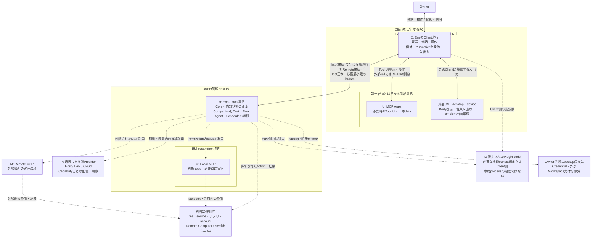

# Runtime Topology

対象: [要件Baseline](../requirements/README.md)（最終確認 2026-09-05）、[Architecture Drivers](architecture-drivers.md)、[System Context](system-context.md)。本書は実行場所、主体の寿命、接続、信頼・障害境界を決定する。図の箱はprocessやsubsystemを意味しない。

## Overview

Eneの実行の軸は、**Owner管理Hostで継続する実行・正本と、Clientのdesktopに帰属する対話・身体の入出力**である。Host上でCompanionの継続とTask・Task Agent・Scheduleを管理し、Clientの終了や移動から独立させる。一つのCompanionのBody、Realtime会話、Voice、ambient Observation、自発的interactionは、同時に一つのactive Clientへだけ帰属する。

推論はCapabilityごとにHost／LAN／Cloudへ配置できる。これはHostの実行管理や個体の所有を推論先へ移すことではない。外部MCPやPluginは利用する実行環境へ接続するが、第一者の制御権限から区別する。特にLocal MCPの既定sandboxと、その外で動く明示例外は、同じ拡張の異なる強制境界として表す。MCP AppsはClient側の外部Tool UIとして扱い、第一者UIの権限や提供serverの寿命と同一視しない。

Local構成ではHostとClientを同じPCに置ける。Remote構成ではClientを同じLANまたはOwner管理VPN上の別PCに置く。どちらでも同じ責任分担を維持する。このTopologyには、必要性が導かれないRemote専用Core、Cloud coordinator、Workspace server、Companionごとの専用runtime serviceを追加しない。

## Runtime Elements

### 実行場所と接続先

HとCはEneの第一者実行領域、P・M・Xは異なる信頼境界を持つ利用先・拡張code、UはClientに提示する外部Tool UIの領域である。これは分類であり、各項目を一つのprocessへ対応付ける指定ではない。任意Capabilityや拡張の起動も常駐必須とはしない。

区別の理由は、**H／Cの配置と寿命、Pへの推論data送信、Mの外部作用とsandbox、Xの限定された拡張権限、Uの第一者UIからの分離**である。Mが提供するUIでも、serverの実行環境とClient上の表示・操作は寿命と権限が異なるため同じ箱へ潰さない。一方、推論の用途別やCompanionごとの専用実行環境は、この理由だけでは追加しない。

| Element | Role・placement | Lifecycle・主な関係 | Authoritative state | Trust・failure上の性質 |
|---|---|---|---|---|
| **H: Host上のEne実行** | Windows／LinuxのOwner管理PC上でCoreを実行し、個体、会話・作業の継続、許可・同意・制限、内部保存を担う。 | Clientより長く存続できる。Task・委任の完了や外部event、Scheduleの到来待ちをLLMへの反復問い合わせで実現しない。Cからの操作を受け、P・M・Xや外部resourceを必要に応じて利用する。 | **Ene内部永続状態の正本を持つ。** 一般App DataとCredentialは保護範囲を分ける。下位の保存構造や個々の状態の所有先はまだ分解しない。 | Client／Provider／拡張へ権限の最終的な管理を委譲しない。Host停止はEneの継続実行と正本更新を利用不能にする境界であり、Clientによる代替正本や別Hostへの自動failoverを前提にしない。 |
| **C: Client上のEne実行** | Hostと同居またはRemoteのOwner利用PC。第一者の表示・会話・操作と、そのdesktop上のBody、音声・画面の入出力を担う。Windows／Linuxを対象とする。 | Hostへ接続して必要なdataを受け取る。起動・終了・切断・再接続はHostの存続と別。一つのClientに複数Companionが存在できる。activeの帰属はCompanionごとに扱う。 | **Ene内部永続状態の正本を持たない。** 表示・一時操作に必要なdataだけを保持し、長期private状態やCredentialを永続cacheしない。 | Remoteはpairingとdevice別の許可・失効対象。同じOwnerでも無条件に信頼しない。Body／Voiceの障害をText・管理操作へ波及させない設計を必要とする。Client全体の終了はその入口を失わせるが、Host上の許可済み処理を終了させない。 |
| **P: 推論Providerの実行** | Capabilityに応じた推論の利用先。Host内、OwnerのLAN、選択したCloudのいずれか。所在地ごとの別Ene runtimeを作らず、同じ種類の利用先の配置差として扱う。 | 呼出しやsessionの寿命はCompanion・Task・Clientの寿命と一致しない。接続登録と利用割当を分け、変更・障害・承認済みfallbackを扱う。起動管理をEneが担うか外部で担うかは配置方法に残す。 | Provider側のmodel・session・cache等はあり得るが、**Eneの個体・履歴・Learning・Task状態の正本ではない。** | Localでも推論出力は制御権限を持たない。停止・能力不足・費用制限は依存する処理に影響する。利用可能なLocal機能、履歴・設定・保存済みdataまで失わせない。 |
| **M: 外部MCPの実行** | Tool／Resource／Promptを提供する外部実行主体。Host上の作業を支えるLocal MCPはHost側に配置し、sandbox内を既定とする。Remote MCPは外部systemとして接続する。Computer UseにClient側の作用経路が必要かはG-01に留保する。 | 必要な接続・利用の期間に動作する。外部serverの寿命はHostやUと独立し得る。Eneが起動するLocal MCPの起動・停止方法やprocess共有は後続設計で決める。 | 外部serverが固有状態・外部作用を持つことはあるが、**Ene内部状態の正本を置かない。** | 結果・Prompt・MCP Appsは信頼できない入力。Local既定sandbox、明示的なsandbox外例外、Remote先の管理境界を区別する。拒否・停止・利用不能でもEneの管理面と保存済みdataは利用可能にする。 |
| **X: 限定された拡張点で実行するPlugin code** | 対応する機能が必要とするHost側またはClient側に置く。未対応Provider protocol、Observation adapter、Body renderer等の例示を、すべて独立runtimeへ実体化しない。 | 拡張の有効化・利用・停止は個体やHost正本の存続と別。接続する機能を補う。専用Plugin hostやPluginごとのprocessを前提にしない。 | **Eneの正本・制御権限を所有しない。** 一時data等を扱う場合もEneのPrivacy・削除契約を迂回させない。 | codeは明確に制限された拡張点から参加し、任意Core改変・Control plane変更・Permission回避・恒久的UI置換を許さない。利用不能時も管理・保存済みdataを維持する。具体的隔離方式は未固定で、Local MCPの例外を流用しない。 |
| **U: Client側の外部Tool UI（MCP Apps）** | Mが提供する対話型UIを、Cの第一者UIと権限を分けた領域で提示・操作する。Client側の入口として区別し、具体的なUI engineや計算配置は指定しない。 | Tool UIを必要とする間だけ存在し、Clientの終了でその入口は失われる。表示終了はMやHost上のTaskの終了を意味しない。MとのinteractionはEneが制限する関係を通る。 | **正本・制御権限を持たない。** 表示・操作用の一時dataはCと同じ最小化・非永続cache・削除契約の対象。外部server側の固有状態とは区別する。 | UI操作をEneの承認・設定操作へ無条件に昇格させず、ActionのPermissionを迂回させない。拒否・停止・表示失敗を第一者の管理・復旧・保存済みdataへの到達へ波及させない。 |

HostとClientは**異なるlifecycleを成立させる実行上の区別**である。同じPCへの同居はこの区別をなくさず、逆にこの区別だけでは専用process数を決めない。P・M・Xが同一PCにある場合も、Ene内部への所属や信頼を所在地から導かない。

### Hostで継続を管理する主体

次の主体はHの中での寿命と権限を区別するために記す。配置nodeや内部subsystemの追加ではない。推論の実行場所はP、身体・入出力の場所はCであり、この表の主体と同じ場所・寿命である必要はない。

| 主体 | 存続・関係 | 状態・権限・障害の境界 |
|---|---|---|
| **Companion** | Characterから作られた継続個体。再起動・Client切替・Provider変更を越えて同じ個体として扱い、停止・再開・削除を管理する。Ownerとの会話、Taskの担当、他Companionとの交流の主体である。 | 継続状態の正本はHost。各個体のMemory・Relationship・Companion State等の利用範囲を維持する。同じClientやグループにいることを共有許可にしない。停止はdataを保持しつつ新規活動を止め、実行中Taskをbest-effortでCancelする。 |
| **Task Agent** | CompanionからTaskの一部を委任された一時主体。必要に応じて複数へ並列委任し、委任元へ結果を返す。Client移動に伴って別個体として作り直すものではない。 | 独立した長期人格やRelationshipを持たず、Taskの記録はHostに残す。担当CompanionのProvider設定を継承し、Capability・Permission・費用・Task／Workspace境界を超えない。途中失敗は作業の未完了・既知の作用として扱い、Companionの消失や通常会話全体の停止にしない。 |

Companionの意味のある継続状態をProvider sessionやBody・Voice出力だけに置かない。再起動・再接続・Provider変更・restoreを越えて保持することと、一時的なCompanion Stateを経過時間にかかわらず保存時点の値へ固定することは異なる。更新・減衰の具体的方法は後続設計で決める。

Taskは追跡・制御される作業単位、ScheduleはHostが各回のTask開始を管理する定期実行の設定であり、この段階では独立した実行serverにしない。Workspace、Memory、Experience Summary、Relationship、Companion State、Rule、Credentialも配置nodeではない。それぞれの意味・利用範囲・保持契約を後続のState Ownershipへ渡す。Agent SkillsやCharacter Packageも交換・入力形式であり、それ自体を常駐主体にしない。付属script等を実行する場合は、形式を信頼の根拠にせず、利用するCapabilityとActionの境界を適用する。

### 実行が依存する外部resource

| Resource | 配置と正本 | Lifecycle・trust・failureとの関係 |
|---|---|---|
| **Clientのdesktop・入出力device** | Cが動くPCのOSが提供する表示面、screen、microphone等。Eneの正本ではない。 | Bodyの表示先、Voiceの物理的な入出力元、ambient Observationの取得対象はClient側にある。推論・候補検知の計算までClientへ固定しない。device故障・fullscreen・切断をHost全体の停止と混同しない。 |
| **作業先のFilesystem・アプリ・account・外部source** | Ownerが指定・許可した外部対象。HostにあるfileもEne内部dataにはしない。Remote Computer Useのdevice／desktop選択はG-01に留保する。 | 外部作用はTaskやEne終了後も残り得る。同じ対象を使うTask間で承認を共有しない。Link・mount等を含めFilesystem境界を守る。取得失敗・書込途中の停止・作用不明を保存成功と表示しない。 |
| **Hostの内部保存を支えるOS領域** | OwnerのOS accountだけが扱える領域。ここにHが正本を保持し、Credentialは一般App Dataと分離して保護する。 | 保存・migration・upgrade失敗で最後の正常状態を破壊しない。storageやOSそのものの喪失まで無停止で耐える配置を意味しない。 |
| **Ownerが選ぶbackup・交換fileの保存先** | 稼働中の正本とは別のcopy。媒体がHostと同じか別かはOwnerの選択に従う。 | 作成結果と失敗を示し、restoreでは対応backupから内部状態を全置換する。Credentialと外部Workspace実体はbackupに入れない。外部copyの存在を、通常削除・全データReset・targeted deletionによる消去保証へ含めない。 |

## Runtime Relationships

RT番号は本設計の追跡用である。「固定」は今回の配置・関係の決定または要件からの制約を表し、「残す自由度」はその関係を実現する方式を表す。

| 判断・関係 | 固定するcontrol / data movement | 後続設計へ残す部分 |
|---|---|---|
| **RT-01: HostとClient** | Clientから会話入力、依頼・追加指示、承認・拒否、停止・管理操作を送り、Hostの状態・進捗・結果・説明を必要範囲で返す。内部状態の確定はHost側。Host–Client通信を保護し、Remoteの新ClientはHost側で確認可能なpairingを経て、deviceごとの許可機能に従う。 | 同居時の呼出し方式、Remote通信方式、同期粒度、接続検知、pairing手段、管理画面の配置。非active ClientのText入力・応答はA-04として別に留保する。 |
| **RT-02: Companionとactive Client** | 排他性の対象となるBody・Realtime会話・Voice・ambient Observation・自発的interactionは、一個体につき一か所へ帰属させる。移動は入出力roundを安全に区切り、両Clientへ状態を示す。Hostの正本・Task・Task Agent・Scheduleを移送しない。 | 排他性の調停と切替・復帰方法。Clientから独立した専用の「presence service」は指定しない。A-03の制御適用範囲とA-04の会話範囲は固定しない。 |
| **RT-03: Host内の作業と委任** | CompanionのTaskを追跡し、一時Task Agentへ境界内で委任する。結果・判断待ち・外部作用をHostで管理し、通常会話と安全操作を作業の完了待ちへ従属させない。Scheduleの各回は新Taskとし、実行時点の条件を再評価する。 | Harness、実行単位、並列実行機構、進捗保存粒度、駆動・待機方式。単に待つためのLLM反復問い合わせは許さない。自発作業にTask契約が及ぶ範囲はA-02。 |
| **RT-04: Clientの観測・音声と推論** | ambient Observationの取得元はactive Clientのdesktop全体。ローカルLLMまたは軽量・高速・安価なmodelによる候補検知から関連CompanionのメインLLMの意味判断へつなぎ、最終的な発話・Action判断は各個体で行う。同じClientの候補検知を不必要に重複させない。Voiceの物理的入出力もactive Clientに帰属し、VAD待受・Observationの状態確認と即時Muteを利用可能にする。 | 取得・伝達方法、候補検知の計算配置、音声処理配置。候補検知の専用service化はこの段階では決めない。ON/OFF・抑制の適用単位、共有検知とProvider割当の対応はA-03。明示TaskのComputer Use経路は別扱いでG-01。 |
| **RT-05: EneとProvider** | CapabilityごとのHost既定・Companion override・Task Agent継承と、割当同意内のdata送信を維持する。結果は意味判断の材料であり実行権限ではない。Provider変更で継続状態を分断せず、能力差には同じ情報選択方針で対応する。費用capはProvider別と全体の双方を扱う。fallbackは承認済みのProvider・順序に限る。 | データをHostで中継するか、条件を満たしたClientからの入出力経路を使うか、接続・session方式、model・protocol adapter・cache。どの経路もHostで管理する現在の同意・権限・費用制限、Credential非露出、Client一時data制約を実効的に適用できることが条件。 |
| **RT-06: Eneと外部実行・作用先** | 許可されたActionを必要な外部resourceへ作用させる。Host上で継続するTaskをClientの外部Tool起動に不要に依存させないため、その作業用Local MCPはHost側とする。MCPのResource／Prompt／resultを制限下で受け入れる。既知のProvider protocolは直接接続し、通常差異をPlugin必須にしない。 | 内部Tool API、MCP接続・起動管理、Pluginの具体的拡張APIと配置方法。すべてのToolをMCP化することや、すべてのActionを専用workerで実行することは指定しない。Remote Computer Useの作用先に必要な関係はG-01で留保する。Body・Voice・ambient ObservationのClient帰属はこの留保に含めない。 |
| **RT-07: 認証dataの利用** | Credentialは設定・認証flowで登録し、明示された接続の実行に必要な範囲でのみ用いる。認証先へ使う経路と、LLM context・生成Tool argument・通常result・表示・学習・診断へ渡す経路を区別する。 | Credential保護方式と受渡し実装。外部secret serviceやClient上のCredential正本を追加しない。認証の成功からAction承認を導かない。 |
| **RT-08: 保存・一時data・消去** | Hostの正本から必要最小限のdataをClientへ渡す。targeted deletionでは接続中Clientの一時dataと実行中処理を含め、削除前の情報からの再保存・再形成を防ぎ、残存検証前に完了としない。外部作用やProvider保有copyは別の境界。 | 保存方式、削除の探索・協調・残存検証、Client一時dataの無効化方法。Clientを永続replicaにしない。通常保持管理をtargeted deletionへ置き換えない。 |
| **RT-09: Backup・restoreと外部file** | Host内部状態をportable full backupへ出力し、対応backupから明示restoreする。TaskのWorkspace関連付けと外部file実体を分ける。復元したTask・Schedule・外部接続の自動処理はOwner確認まで保留する。 | backup形式・保存実装・整合性確保・復旧手順。外部fileを内部成果物libraryへ複製しない。 |
| **RT-10: Clientと外部Tool UI** | MのUI resourceをUで提示し、操作と結果を扱う。第一者の承認・管理経路と分け、UからのTool利用や外部送信にもRT-05・06・07の制約を適用する。外部UIを閉じることとTask Cancelを同一視しない。 | UI実行・隔離方式、Mとのdata経路、表示状態の再取得、Client内の組込み方法。専用UI serviceや独自の代替protocolは追加しない。 |

Hostを制御と正本の継続点にすることは、全Raw画面・Raw音声・全payloadをHost経由で永続保存する決定ではない。Clientの一時data、Eneが管理する一時処理、外部へ送信されたcopyを区別し、論理的な許可の適用と物理的な通信経路を同一視しない。

## Lifecycle and Failure Boundaries

ここで固定するのは影響範囲と継続・再開の条件である。停止要求の受付、実際の停止完了、外部作用の確定は別々に扱う。表はretry algorithmや実装上の状態一覧を定義しない。

| 境界・事象 | 維持する振る舞いと他elementへの影響 |
|---|---|
| **起動・Client不在** | HostをClientとは独立に存続可能にし、許可済みTask・Schedule・保存を継続する。自動起動を利用できる構成では、Client終了後に続く処理を説明してOwnerが選ぶ。ClientなしでOwner確認が必要になったActionは実行せず判断待ちとし、自動承認や別経路への迂回をしない。 |
| **Client終了・Remote切断** | そのClientの対話入口を失ってもHostの許可済み処理と記録を維持する。切断したClientを正本や独立したOffline実行主体にしない。排他性を確認できないClientは、その対象となる入出力・観測・自発的interactionを継続せず、切断等の状態を示す。Client依存のComputer Useの継続条件はG-01に留保する。 |
| **再接続・active Client移動** | Hostの進捗・結果へ到達できるようにし、同じ個体を二か所へ同時に復帰させない。移動時は現在の入力／出力roundを安全に区切る。Task・Task Agent・ScheduleはHostで継続できる。非active ClientのTextと制御設定の移動時適用はA-04・A-03の範囲を越えて決めない。 |
| **Pairingの失効・許可変更** | 失効したdeviceの許可機能を使わせず、失効した許可だけを根拠とする新規Actionを開始しない。進行中の作用はbest-effort停止と報告の対象。別device・Tool・Task Agentへの切替で迂回しない。device失効を無関係なHost上のTaskすべてのCancelとはしない。Client依存Taskの具体的条件はG-01。 |
| **Host停止・異常終了・再起動** | ClientはHostの代替正本にならず、Hostでの操作や保存の成功を確認なしに示さない。途中Taskは保存済み進捗と既知の外部作用を示して明示再開を待つ。停止中に到来したSchedule回はmissedとし、自動補完しない。外部process・サービスの作用がHostと同時に停止したとは推定しない。 |
| **Companion停止・削除** | 停止中はBodyを表示せず、応答・自発動作、新Task、新Schedule実行を開始しない。実行中Taskをbest-effortでCancelし、停止中に到来したSchedule回はmissedとして自動補完しない。停止は個体dataを保持する。削除は停止を含み、担当Scheduleと主体・相手としてのRelationshipを削除し、Scheduleを自動で引き継がない。残るTask記録・共同Taskは管理面から確認・引継ぎ依頼ができ、外部fileは削除しない。内部Companion scope Skillの残存はA-01。 |
| **Task Agent失敗・Task Cancel** | Taskの未完了、停止できなかった処理、既知の外部作用、未保存の作業を示す。失敗・Cancelを個体消去にせず、通常会話と管理を利用可能にする。Task終了に伴う一時中間fileの整理と、永続成果物の非削除を区別する。 |
| **Provider・Network障害** | 対象の推論・接続に依存する処理へ影響を限定し、利用可能なLocal機能、履歴、設定、保存済みdataを使えるようにする。全構成のOffline推論は保証しない。Actionを自動queue・回復後replayしない。外部作用の成功が不明なら自動再実行せず、重複可能性を説明し判断を求める。fallbackはRT-05の制約内。 |
| **Body・Voice・device障害** | Body失敗でもText会話・Task管理・設定・復旧を利用可能にする。Voiceは利用可能なturn-based Voice、Textへ段階的に切替でき、失敗理由を示す。keyboardからのMute・Stop・Cancel・承認拒否を、描画・音声・LLM応答の完了待ちにしない。Hostに届かない停止要求を外部処理の停止成功と表示しない。 |
| **Fullscreen・高負荷・費用／資源上限** | Fullscreen時はそのClientのBody・ambient Observation・自発発話を休止する。高負荷では会話・Owner操作・安全判断を維持し、描画品質と非重要な背景処理を段階的に下げる。費用capや資源上限、費用不明で安全に続行できない場合はdataを保って対象処理を停止または判断待ちにする。記録の黙った破棄や通常Learningの削除で解決しない。 |
| **拡張の拒否・停止・利用不能** | 必要な機能の失敗を説明し、管理面と保存済みdataを維持する。MCPのsandboxを黙って解除しない。sandbox外MCPやRemote先を停止できたか不明なら、その事実と外部作用を示す。 |
| **MCP Appsの終了・UI障害** | Tool UIだけの終了をMCP server停止、Action Cancel、外部作用の取消成功と扱わない。Host上のTaskはそのUIの成功を無条件の存続条件にせず、追加入力・Owner確認が必要なら当該処理を判断待ちとする。第一者の管理面から状態・停止・復旧へ到達でき、再表示だけでActionをreplayしない。 |
| **Observation OFF・自発性抑制** | 今後の観測停止と、形成済みLearning・Companion Stateの削除を区別する。Quiet hours・Mute・未応答・Permission・費用・資源・loop制限を自発性より優先する。適用単位はA-03、自発作業へのTask制御の適用範囲はA-02。 |
| **Targeted deletion** | 対象情報を使うHost処理・拡張経由の処理・接続中Clientを含め、Ene内部での消去と再保存防止を成立させる。遅れて届く削除前の結果を内部へ再保存する経路も対象。未完了・未検証なら完了としない。外部copyが消えたとは表示しない。 |
| **保存・migration・upgrade・restore失敗** | 最後の正常状態または復元前の正常状態を保護し、失敗と安全な次の操作を説明する。対応upgradeが成功するまで旧状態を利用または復旧可能にする。許可や保存結果を誤って成功表示しない。 |
| **Restore成功・Reset** | Restoreは内部全置換で、削除済み情報や旧Rule・同意・Scheduleが戻り得る。自動処理を保留し、Ownerの内容確認後にまとめて有効化できる。Credential再認証が必要になり得る。設定Resetと全データResetを分け、外部file・Ownerが別の保存先へ作成したbackupを削除しない。 |

これらは部分障害に対する必要な分離であり、すべてのOS／hardware障害からの無停止運転を保証しない。HostとLocal Client、Local推論が資源を共有する構成でも契約を満たす必要があるが、満たすためのprocess分離・優先度・資源配分は後続設計で選ぶ。

## Trust Boundaries

### 配置と信頼は別に扱う

| 境界 | 越えるdata / control | 強制・責任の範囲 |
|---|---|---|
| **Ownerの判断と、取り込んだcontent** | Text／Voice入力、観測、file、推論結果、Character、Skill、内部Learning等から、解釈・Action判断へ。 | Ownerの依頼と外部contentの指示を区別する。内部に保存された情報も信頼できない入力になり得る。意味判断はLLMに委ねても、保存禁止・非共有・scope・Permission・費用・削除等の制限はPromptだけに依存させない。Voiceに話者認証済みという前提を置かない。 |
| **HostとClient device** | 操作・承認要求、表示用private data、音声・観測、active帰属の切替。 | Remoteのpairing、通信保護、device別機能と失効を維持する。Hostに正本を置くことと、Clientが受け取った一時dataの保護を両方満たす。Client独自の権限拡張や永続private replicaを作らない。 |
| **Companion／Taskごとの利用範囲** | Global Learning、個体固有状態、共有Experience、委任入力・結果。 | 同一Owner・同一Host・同一Clientでも個体固有状態やTaskの承認を混同しない。Task Agentは委任元の境界内。これは論理的なaccess境界であり、個体ごとのprocessや物理storage分離を要求しない。 |
| **EneとProvider・外部system** | 同意された推論data、許可されたAction、結果・利用量・外部event。認証時に必要なCredential利用。 | Host／LANでも同意を省略せず、未承認Cloudへの移送をしない。認証用秘密値をLLMや通常resultへ流さない。Provider内の保持・cache、外部process内部の作用をEneの正本や完全な制御対象とみなさない。 |
| **第一者実行と拡張code／UI** | MCP call・result・Resource・Prompt、CとUの間の表示・操作、限定されたPlugin機能の入出力。 | 外部code／UIからControl plane、Permission、同意、費用cap、Credentialを直接変更させない。UをCの第一者権限やMの実行権限と同一視せず、MCP Appsでのinteractionも許可の迂回経路にしない。登録済みCredentialを必要な認証以外のresult・UIへ出さない。Ene管理下の拡張・UIの一時dataを、外部code由来というだけで内部消去の対象外にしない。 |
| **Ene内部dataと外部file／copy** | Workspaceの読書き、import／export、backup／restore、手動診断共有。 | 外部sourceへのaccessと、内部へ取り込んだcopyの保持・削除を分ける。Character配布、内部Learning、backup、Credentialは同じ出力範囲ではない。外部copyの消去や外部作用のrollbackを内部操作の成功に含めない。 |

### Local MCPの実行境界

Local MCPのsandbox内実行とsandbox外実行は**同じMの配置・許可の選択肢**であり、二つの常設componentではない。

| Mの実行形態 | 固定する境界 |
|---|---|
| **Local・既定sandbox内** | 外部codeを制約された実行範囲へ置き、Eneの機械的Capability境界とActionのPermissionを適用する。動作しない場合も自動的にsandbox外へ切り替えない。OSの隔離機構、sandbox数、process対応は未固定。 |
| **Local・明示的なsandbox外例外** | 特定MCPのcommand、設定の由来、既知のaccess・risk、失われる強制境界を説明してOwnerが明示許可する。許可を保存・失効可能にし、重要変更では再確認する。Eneが仲介するActionには通常Permissionを適用するが、外部process自身の内部作用へCapability境界を強制できるとは説明しない。 |
| **Remote MCP** | 外部側の実行環境は外部の管理下にある。Eneが行う呼出し・data授受・認証利用へ境界を適用し、remote内部をLocal sandboxで保護したものと扱わない。結果や停止要求だけから外部作用の不存在を保証しない。 |

Pluginの限定された実行境界も必要だが、要件はLocal MCPと同じ隔離機構や例外制度を指定していない。Pluginを任意のCore改変codeとして取り込むことも、未確定のsandbox専用runtimeを先に追加することもせず、必要な強制と障害分離を後続設計の条件にする。

## Topology Diagram

通常状態を示す。Client枠はHostと同じPCにも、LAN／Owner管理VPN上の別PCにも配置できる。図示したClientは、そこに存在するCompanionのactive Clientである。他Clientの接続は可能だが、同じCompanionの排他的な身体・入出力を複製しない。

実線はHost–Client接続またはその場所で必要な入出力を表す。破線は制約下の利用・data授受の**論理関係**であり、全payloadをHost経由にする指定ではない。箱の数はprocess数を意味しない。

PのHost／LAN／Cloudは選択できる配置であり、三段のruntime layerや同時起動の必須要素ではない。Xへの二本の線も、一つの拡張を両側で重複起動する要求ではなく、機能に応じた配置を表す。UはMが提供するUIをClient側で扱う境界であり、独立した常駐serviceではない。MからのUI resourceと操作結果はEneの制限下でUへ届くが、図はその物理的なdata経路を固定しない。図のLocal MCPは通常のsandbox内構成であり、明示例外の場合は同じMがsandbox境界の外へ出る。その場合に失われる強制はTrust Boundariesの表に従う。

LocalとRemoteで変わるのはClientへの接続と入出力の所在地であり、Host正本・Host上の許可済み作業の継続は変わらない。Host／LAN／Cloudの推論選択もClientの所在地と別軸である。Computer Useの作用先はこの図から選ばず、G-01の解決を待つ。

## Unresolved Topology Decisions

既存Issueは[Architecture DriversのRequirement Issues](architecture-drivers.md#3-requirement-issues)を正とする。以下はIssueを解決する提案ではなく、解決結果がこのTopologyへ与える差分である。今回、新たなRequirement Ambiguity / Gapは追加していない。

| Issue | 留保するTopology decision | 解決結果によって変わる関係 | 現時点で固定できる範囲 |
|---|---|---|---|
| **A-01: Companion scope Skillの削除** | Companion削除時に内部Skill・revision・根拠をどこまで終了・消去し、残る場合に誰が利用・管理するか。 | 削除する契約なら個体削除に合わせた利用停止・消去へ含める。残す契約なら削除後の利用・管理経路とbackupに残る内容が変わる。どちらでも新しい実行nodeは導かれない。 | Host正本、外部Workspace内Skillの非削除、targeted deletionの優先。主な影響はState Ownershipであり、H／C／Pの配置を妨げない。 |
| **A-02: 自発作業とTask** | どの自発作業へTaskの進捗、Cancel、Workspace、再起動後の明示再開等を適用するか。 | Taskになる活動はRT-03とTaskのlifecycleへ含まれる。Task外活動を認めるなら、その追跡・停止・継続条件が別途必要になる。独立した「自発Agent service」を今から置く理由にはしない。 | 自発的な外部Actionにも共通Permission、費用・資源・loop制限を適用する。Rule自体を開始triggerにしない。 |
| **A-03: Observation・自発性の制御単位** | Host／Client／Companionのどの範囲へON/OFF・抑制を適用するか、移動時の適用、同じClientの共有候補検知とProvider割当の対応。 | Client単位の契約なら取得場所との対応、Companion単位なら個体の移動との対応、Host単位なら複数Clientに及ぶ対応が変わる。複合的な契約の場合も、共有検知の実行可否・送信先をその範囲へ対応させる必要がある。具体的な結果は選ばない。 | active Clientのdesktop全体、fullscreen時のClient単位の休止、候補検知の不必要な重複回避、個体ごとの意味・最終判断。既存の同意を共有処理で拡張せず、Host既定・Companion override、Provider別と全体の費用capを維持する。 |
| **A-04: 非active ClientのText会話** | Realtime会話にText入力・応答をどこまで含めるか、非active ClientからのText会話と移動の関係。 | 許す契約なら、排他的な身体・Voice等とは別に、複数ClientからHost上の同じ会話へ至る入力・応答の関係が必要となる。許さない契約ならその会話経路をactive Clientへ限定する。具体的な同時入力調停は解決後も設計自由度。 | 一続きのtimelineとactive帰属の排他性。履歴閲覧・Task管理・一般管理面の配置は、必要な到達経路を満たす設計選択であり、このIssueへ拡張しない。 |
| **G-01: Remote時のComputer Use対象** | 操作可能なdevice／desktop、対象選択・表示、Client依存Taskの切断・device失効・移動時の継続条件。 | Host対象だけならHost側の作用経路で成立する。Client対象を含むなら、Client側OS・deviceへ画面取得・入力等を作用させる経路と、その接続・失効条件が必要になる。対象選択を許す場合は、作用先とPermissionの対応も必要。いずれも専用processやClient側Task正本を直ちに要求しない。 | Host上の許可済み処理の継続、失効に基づく新規Action禁止とbest-effort停止、TaskのPermission・記録。ambient ObservationのClient帰属をComputer Useへ流用しない。 |

## Design Freedom

以下は未解決の製品要件ではなく、確定した境界を満たす方法の選択である。

- **内部の責務分割と実装単位:** subsystem、crate／module、型・trait、内部API、Agent Runtime／Harnessの内部構造、process数、thread／async task、queue／event bus等。H／Cやtrust boundaryを、そのまま一対一のmodule・processにしない。
- **接続・入出力の実現:** IPC・wire format、同期、pairing・失効・active帰属の調停、切断検知、音声・観測dataの中継または直結、描画・音声処理の計算配置。RT-01・02・04・05とClientの非正本性を満たす範囲で選ぶ。
- **拡張の実現:** sandboxのOS機構と単位、外部codeの障害分離、MCP起動管理、Pluginの具体的API・配置、MCP AppsのUI実行・隔離方式。Local MCPの既定隔離と明示例外、Pluginの限定された権限、外部Tool UIと第一者管理の信頼境界は固定された前提とする。
- **状態と永続化:** domain object、所有・参照の詳細、DB schema、repository構造、保存・backup・migration実装、暗号方式、削除の協調方式。Host正本だけを理由に全状態を一つの保存単位や一つのlifecycleへまとめない。
- **意味判断と推論:** context assembly、Memory・Skill・Relationship・Companion Stateの内部表現とalgorithm、検索・要約・更新・減衰、Provider session・Prompt cache・費用推定。意味状態・根拠・原履歴と派生dataの契約は維持する。
- **UIと縮退:** 重要な管理操作への到達とkeyboard経路を満たす画面構成、品質調整、資源配分、停止伝達・進捗保存の粒度。管理をBodyやLLMの成功へ従属させず、受付と停止完了を区別する。
- **検証環境:** model・Provider catalog、OS version・hardware、性能budgetはReleaseのSupport Matrixと[受け入れ条件](../requirements/acceptance.md)で検証する。現milestoneのOpenAI Responses APIや数値Gateを恒久的なTopology制約へ固定しない。

これらの自由度は、Cloudへの正本移転、恒久Workspace container、独自成果物library、Ene運営relay・account・Marketplace等の非目標を再導入できるという意味ではない。

## Traceability

[Architecture Drivers](architecture-drivers.md)のADは要件から導出された制約として使用した。下表の要件欄は[要件](../requirements/requirements.md)の見出しを示す。SC番号は[System Context](system-context.md#boundary-invariants)の判断を参照する。

| 重要な設計判断 | 本書・System Contextでの対応 | Driver / 要件の根拠 |
|---|---|---|
| Owner管理Hostの正本とClient独立の継続 | H・C、RT-01・03・08、SC-01・09・10 | AD-01／「所有と実行」「Remote Client」「Local data」 |
| 個体の存在場所と作業の寿命を分ける | Hostで管理する主体、RT-02・03、SC-02 | AD-02・03・04・08／「個体性」「Task」「会話と情報提示」「Remote Client」 |
| Scope・知識・根拠・表現を配置nodeへ過剰分割せず、意味と利用範囲を維持 | 主体の状態境界、RT-08、Trust Boundaries、SC-03・07 | AD-04・05／「Learningと成長」「Relationship」「Companion State」 |
| 許可・同意・制限をHostの管理下で全実行経路へ適用 | RT-03・05・06・07、Trust Boundaries、SC-03・04・05 | AD-06・10・11・14／「Permissionと安全境界」「割当と同意」「Credential」「拡張」 |
| Clientを含む内部消去と、外部copy消去の非保証 | RT-08・09、削除・restore時の境界、SC-06・07・10 | AD-07・14・15／「Privacy/Security目的のtargeted deletionと履歴保持」「Remote Client」「Backupとrestore」 |
| 外部Workspace・成果物の非所有とTaskごとの独立 | 外部resource、RT-03・06・09、SC-06・08 | AD-08／「Workspace」「Fileと成果物」「停止と削除」「Capability境界」 |
| Client不在・Host再起動・Schedule到来・restoreで異なる継続条件 | Lifecycle and Failure Boundaries、RT-03・09、SC-01・08 | AD-01・09・15／「Task」「Schedule」「OfflineとPrompt cache」「Backupとrestore」 |
| 推論先の可変性と外部送信・費用・秘密保護 | P、RT-05・07、SC-04・10 | AD-10・14／「Provider、費用、接続障害」 |
| Local MCPのHost配置・既定sandbox・明示例外、限定Plugin・MCP Apps | M・X・U、RT-06・10、Local MCPの実行境界、SC-05 | AD-01・06・07・11・14／「所有と実行」「拡張」「信頼境界」「履歴、保持、Privacy」。Host配置はClient非依存の作業継続を満たす本設計の選択。ClientでのComputer Useの作用経路はG-01に留保。 |
| Clientからの観測と個体ごとの自動学習・自発性 | C・P、RT-04、SC-02・03・04 | AD-02・06・10・12／「Observationと自発性」「Desktop Body」「割当と同意」 |
| Body・Voice・Provider・拡張の部分障害から管理と保存済みdataを保護 | C・P・M・X・U、Lifecycle and Failure Boundaries、SC-09 | AD-03・11・13／「BodyとVoice」「拡張」「品質と利用可能性」 |
| Backup・復旧・Resetと実行権限の再有効化を分ける | 外部resource、RT-09、SC-06・07・08 | AD-15／「保護、Backup、復旧」 |

### 全体照合と後続工程への引渡し

要件の全章、製品定義の対象・非目標、AD-01〜15とDriver間の優先関係、A-01〜04・G-01を照合した。[受け入れ条件](../requirements/acceptance.md)の後続milestone項目も確定済み要件として対象に含め、[参考資料](../requirements/references.md)の製品例・Harnessの層分け・過去実装を配置根拠にしていない。

後続のSubsystem Decompositionでは、H／Cの配置と寿命、P／M／X／Uの信頼・障害境界、RT-01〜10の関係を入力にできる。State OwnershipにはHost正本・Client一時data・外部所有物の区別と個体／Task／削除／復旧の異なるlifecycleを、Dependency Rulesにはcontent・推論・拡張から制御権限を変更できないことと部分障害下の維持条件を渡す。

**Step 3: Subsystem Decompositionへ進める。** ただし、既存Issueに依存する責務・関係は留保したまま扱い、特にA-03・A-04・G-01に依存するClientの入力・観測制御・作用先を確定しない。A-01・A-02も所有・終了条件やTask契約の適用範囲を暗黙に補わない。本書はSubsystem Decompositionそのものを実施していない。
