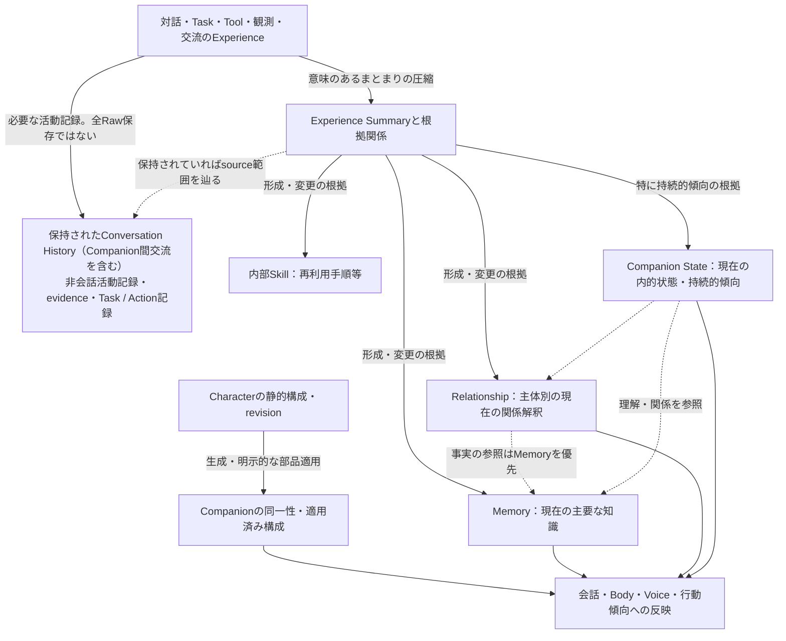

# State Ownership

対象: [要件Baseline](../requirements/README.md)（2026-09-07のOwner decisions反映済み）、[Architecture Drivers](architecture-drivers.md)、[System Context](system-context.md)、[Runtime Topology](runtime-topology.md)、[Subsystem Decomposition](subsystems.md)。本書はStep 4のconceptual / architectural state ownershipを決定する。本文のSubsystem略称はSubsystem Decompositionに従う。

## 1. Overview

State Ownershipは、**何についての状態を正しいものとして扱い、その意味をどの責務が変更し、いつまで何のために利用するか**という契約である。HostをEne内部domain dataの正本とする既決事項の下で、個体、学習、記録、制御、作業等の意味上の責任を分ける。

本書のsemantic ownerは、その状態の意味・通常の変更・lifecycle判断を引き受ける責務を指す。Companionへの所属、Taskへの従属、複数箇所からの参照、実行場所、保存処理の担当とは異なる。同じSubsystemが複数stateのsemantic ownerになっても、一つの状態やlifecycleへ統合することを意味しない。

ここでいうcanonicalは、Eneがその意味について参照すべき正本であり、内容が客観的に真であることや信頼できる指示であることを意味しない。Memoryは訂正可能な現在認識、Conversation Historyは保持された発言の記録、Action結果はEneが把握した作用と確定度の記録である。これらはそれぞれの意味について正本でも、互いを代替しない。

決定するのは意味・正本・変更責任・所属／利用範囲・根拠・lifecycleと横断整合条件である。DB、repository、Rust object、process memoryの所有や唯一のwriterは決めない。第6節のcoordinationは、Step 5のallowed dependency graphやtransaction protocolを指定しない。

## 2. Ownership Principles

1. **同じ意味には一つの正本を置く。** 表示、検索、結果報告、監査、外部送信用の表現を作っても、元の状態を独自に変更する正本へ昇格させない。異なる意味の状態に同じ情報が関係することは許す。
2. **Host正本とsemantic ownerを分ける。** 個体・会話・Learning・Task・制御条件等の永続domain stateはHostに残り、各domainの責務がその意味を管理する。Client、Provider、MCP、Pluginがdomain stateの唯一の保持者になる設計は成立しない。端末固有の接続材料は第8節の別分類としてEneの保護対象に置く。
3. **意味変更、制約の強制、保存、全域操作への参加を分ける。** 権限・制約が拒否できてもTaskやLearningを所有しない。保全・消去が削除・復元を調整しても、その対象の通常ownerにはならない。
4. **静的構成、継続個体、形成済み状態を分ける。** CharacterのrevisionとCompanionへの部品適用、Experience由来のMemory・Relationship・Companion Stateは別の変更である。Package更新を成長の初期化にしない。
5. **現在認識、過去認識、根拠、原記録を分ける。** Memoryを主要な知識状態とし、Summaryを根拠、Historyを発言や活動の記録として扱う。RelationshipとCompanion Stateに詳細事実の第二の正本を置かない。
6. **所属と参照は削除の同義ではない。** 担当Companionへの参照はTask記録の寿命を決めない。共有Summaryを参照しても他個体の状態を取得せず、Workspaceへの関連付けで外部fileを所有しない。
7. **Learningのscopeは意味状態、明示的な禁止は制御条件とする。** Scopeの意味判断は認識・学習に残す。決定後のscopeとOwnerの保存禁止・非共有は各利用箇所でも強制する。重要度、想起優先度、同じClient・グループへの参加をGlobal化の根拠にしない。
8. **生成されたcontentを制御の正本へ直結しない。** 許可・Rule・同意・cap等はOwnerに由来する判断と適用範囲を必要とする。LLMは解釈を支援できるが、その出力や形成済み状態だけでは変更できない。
9. **通常の意味更新と消去の目的を分ける。** Learningの忘却・訂正・統合等では保存済み内容・過去revision・根拠を削除しない。通常History/log削除は形成済み状態へcascadeしない。容量retentionは通常忘却と別であり、Learning revision・Summary等の自動cleanupは既定OFF、Ownerの明示opt-in時に限り設定可能とする（4.24・6.5）。明示的なPrivacy/Security目的のtargeted deletionはこれらの保持原則より優先する。
10. **停止要求、内部状態の確定、外部作用の結果は別である。** Cancelや切断から外部作用の取消・不存在を推測せず、不明を未実行に戻さない。状態参照やClient移動をAction replayの理由にしない。
11. **Copyと一時dataにも内部での利用責任がある。** 派生物を正本にしないことは、消去・秘密保護の対象外にすることではない。Ene管理下の処理中data・遅延結果・Client一時dataも全域操作へ参加する。
12. **復元する内容と、現在使える権限を分ける。** Backupはcopyであり、restoreが成功して初めて復元内容がHostの正本になる。復元された設定や作業記録だけで自動処理を再有効化しない。

一般App DataはOwnerのOS accountだけが扱える領域で保護し、Credentialは分離する。すべての内部状態へ一律のapplication-level暗号化を課すことは、このownership契約から導かない。

## 3. State Model

状態をSubsystem一覧から転記せず、独立に変化・消失し得る意味から区別する。以下は関係を読むための整理であり、新しいownership layerや統一state分類型ではない。

| 意味上のまとまり | 区別して扱うstate | 関係の要点 |
|---|---|---|
| 個体と対話の継続 | Characterの静的revision、Companionの同一性と活動状態、適用済み構成、会話参加・History（Companion間交流を含む）、保存された非会話活動記録・evidence、未伝達事項と報告状況 | 同じCharacterから別個体が生まれる。History／活動記録は個体削除後も残り、個体固有のMemory／Learningとは別lifecycle。報告状況は元記録・Task完了と別。 |
| 経験からの形成 | Experience Summary、sourceへの根拠関係、Memory、内部Skill、Relationship、Companion State、各状態に属する過去revision | 出来事から形成判断を経る。Summaryはcurrent knowledgeにならず、異なる継続状態の共通根拠になれる。 |
| 作業と作用 | Taskの目的・進捗・結果、Task context、一時Task Agentと委任、Actionの結果・不明、Workspace関連付け、Schedule設定と各回、中間file | TaskはAgent終了後も残る。Scheduleは各回のTaskとは別。関連付けと保存先の実体は別。 |
| 制御と利用条件 | Rule、Permission判断、device許可、Provider割当同意、費用・資源上限、保存禁止・非共有、Credential、接続設定、観測・自発性設定 | 登録、認証、存在、実行可能性は別。設定内容と、その時点の利用可否も別。 |
| 実行時の状況と保全 | 接続・active帰属、入出力round、観測候補、利用量、Audit、保持方針、全域操作の進捗、backup copy | 一時性は意味の軽さを示さない。利用可否に関わる実行時状態を古いcopyで代用しない。 |

主要な根拠関係を次に示す。矢印は意味上の形成・参照関係であり、同期順序、必須の保存経路、Subsystem依存を表さない。

Experienceは出来事とその結果という概念であり、全活動を格納する新しいcanonicalなRaw storeを設けない。Summaryを作らずに終わる出来事や、Rawを保存せずにSummaryを根拠として残す形成もある。図の出力からCharacterや永続状態への自動的な逆更新は導かれない。

Companion／Globalは内部Memory・Skillの利用scopeである。4.16のObserverへの限定されたrouting用文脈の提供は、このscopeのGlobal化や他Companionへの共有ではない。会話の参加者、Relationshipの主体と相手、Taskの担当、Summaryの利用範囲、Clientの存在場所をこの二択へ押し込まない。これらはそれぞれ別の所属・参照関係であり、Globalという名称の包括的な共有領域を新設しない。

## 4. Ownership by State

以下で「正本」は、特に外部・copy・一時と記したものを除きHostで管理する内部状態を指す。永続化の実装担当は指定しない。通常ownerは全域消去の例外を拒む権限を持たず、各stateとその派生物・進行中利用を第6節の協調へ参加させる。

### 4.1 Characterの静的構成とrevision

**正本と変更責任:** Eneへ取り込んだ静的人格、Body、Voice・motion構成、推奨Skillとそのrevisionは**Character**が管理する。Ownerによる基本編集・部品差替え・importを通常変更の根拠とし、外部Package原本は別の所有物として扱う。外部fileの変更だけで内部Characterの更新済み状態にはならない。

Characterのrevisionは配布可能な静的構成についての正本であり、「そのCompanionが現在どの部品を使うか」は4.2の正本を参照する。推奨Skillの構成上の指定と、取り込んだ内部Skillの有効revision・学習による改善は別である。

Package更新は新revisionとして識別し、既存Companionへの適用はOwnerの部品ごとの明示選択を必要とする。Companion停止・削除を共有Characterの削除へcascadeさせない。Character Packageのexportには個体固有のExperience・Learning・関係・内的状態・履歴・Credential・Permissionを含めず、内容と権利上の注意を確認可能にする。内部構成はfull backupの対象となるが、外部Package原本をbackupに取り込む根拠にはしない。

### 4.2 Companionの同一性、活動状態、適用済み構成

**正本と変更責任:** **個体調整**が、Characterを起点に生成された別個体としての同一性、停止・再開・削除の対象、個体に適用済みのCharacter部品とrevisionの選択を管理する。生成・停止・再開・削除はOwnerの操作に基づき、LLM応答の成否に従属させない。部品内容の正本はCharacter、適用関係の正本は個体調整であり、静的内容を二重に編集する責任を作らない。

Memory・Skill・Relationship・Companion Stateはこの個体へ所属または関連するが、意味変更は認識・学習が担う。個体の理解・振る舞いには実際のExperienceから形成した継続状態をCharacter初期設定より優先する。個体調整が会話で訂正を受け取ることは、学習状態の直接上書きを意味しない。個体の設定もすべてここへ集めず、Provider同意等はそれぞれの意味ownerに置く。

Host再起動・Client移動・Provider変更で同一性は変わらない。停止は活動を止めてdataを保持する。active Clientがないこと、Bodyがhideされていること、Companion Stateが静かな傾向であることだけでは個体停止を意味しない。削除は第6・7節に従う横断操作であり、Task記録・Global Learning・外部fileを個体の所有物として全削除しない。

### 4.3 会話の参加・継続、Historyと非会話活動記録、入出力round

| State | 正本・意味変更の責任 | 寿命と参照 |
|---|---|---|
| 一対一会話の継続、グループとCompanion間交流の参加関係 | **個体調整**。誰の会話・発言か、どの空間での交流かを管理する。 | Text／Voiceを同じtimelineへ結び付ける。現在の参加と過去の参加記録を分ける。交流への参加は私的Learning等へのaccess許可にならない。Task管理は別の空間。 |
| Conversation History | **個体調整**。受け取った／伝えた発言と参加者・文脈の原記録の意味を管理する。 | 正確な過去発言には保持されたHistoryを用いる。後の訂正は新しい会話・Experienceであり、過去発言を現在認識へ書き換えない。既定で保持し、通常保持管理は保全・消去と協調する。 |
| 保存された非会話Companion活動記録・historical evidence | **個体調整**。Observation eventを認識した結果、notification生成、軽微な内部調査等について、何が行われ何を認識・報告したかという過去の記録を管理する。 | 既存の結果説明・未伝達報告・由来説明等に必要な保持範囲に限る。Taskの進捗・Actionの確定度・Auditの順序は各ownerを参照し、ここで独立更新しない。全活動の永続記録は要求しない。 |
| 会話の進行中の意味判断 | **個体調整**。現在の入力への応答・中断・会話上の取扱いを判断する。 | 推論や入出力の一時的な処理であり、Provider sessionが継続会話の正本にはならない。残すべき発言・結果はHistory等へ反映する。 |
| 入出力roundの受付・提示・安全な区切り | **入出力・提示**。入力・音声出力等がどこまで行われ、区切れるかという実際の入出力状況を管理する。 | active帰属は接続・存在を参照する。一時roundの終了でtimelineを終了・削除しない。移動の調停そのものは接続・存在が担う。 |

Client上の入力中data、表示用timeline、音声bufferは一時表現である。入力受付、Hostでの会話・指示の受理、Ownerへの提示、処理完了を区別し、Clientだけで永続する会話を確定しない。表示やroundの状態を、過去発言やTask進捗の第二の正本にしない。

会話からTaskへの追加指示を受けた場合、発言の正本はHistory、Taskとして採用した指示と反映可否は作業が管理するTask状態となる。承認として有効かは権限・制約の判断であり、発言が記録されただけで承認済みにしない。

Ownerとの一対一、グループ、Owner不参加のCompanion間交流の実際の発話はConversation Historyに属する。参加Companionの一方または両方の削除だけでHistoryを削除しない。保存された非会話活動記録・historical evidenceも同様であり、記録の個体参照を個体所有のMemory／Learningと同じ削除関係にしない。削除後も過去の発話・活動の主体を識別できる記録と、現在利用できる個体状態を区別する。具体的な識別表現や表示方式は固定しない。

これらの記録はHost正本でfull backupの対象とし、個体削除後の残存記録も含める。通常History／Logの手動削除・明示retentionは保全・消去と協調し、既定では自動削除しない。Targeted deletionには原記録・内部source copy・派生物・利用中dataごと参加し、Clientへは必要最小限の一時表現だけを渡す。通常削除・retention cleanupは形成済みLearning等とSummaryを変更しない。参照元の喪失は明示し、正確な発言をMemoryやSummaryから復元したと扱わない。

活動の記録と、そこから形成されたMemory・Relationship・Companion State・Experience Summary等は別契約である。Summaryや学習revisionをhistorical evidenceへ分類し直して個体削除から残すことはしない。Raw Capture・観測候補・一時reasoningの全保存や新しい汎用Activity Subsystemは導かれない。

### 4.4 未伝達事項と報告状況

**正本と変更責任:** **個体調整**が、Client不在のため伝えられなかった事項、対象Companion、元の活動・結果への対応、次Clientでの要約報告状況を管理する。これは「何をまだ伝える必要があるか」の正本であり、Taskの進捗・結果の第二の正本ではない。

Task由来ならTask記録、会話・交流由来ならその活動記録へ参照を戻す。報告用要約は派生表現とする。通知の生成等で別の元記録がない場合は、伝えるべき内容自体を個体調整の活動記録として必要範囲で保持し、存在しないsourceへの参照だけで済ませない。全活動の通知storeや独立した知識状態には一般化しない。

Host上の個体の継続dataとして、報告に必要な内容・参照と状況を保全し、Companionを含むfull backupでも対応を保つ。Clientが接続したこと、表示用copyを送ったこと、Taskが完了したことだけで報告済みにしない。実際の提示状況を受けて個体調整が報告状況を更新し、不明な提示を確定済みと表示しない。既読・配信保証の詳細は定めない。

要約報告後のdata保持は元記録と報告状況の役割ごとに扱い、専用の永久通知履歴は要求しない。通常保持管理で元記録が失われる場合は未伝達の必要内容との関係を確認する。Companion削除ではその個体の現在の未伝達管理を終えるが、元のTask記録、会話History、通知等の保存された活動記録は4.3の保持契約に従って残す。報告状況を終了することを、唯一保持した通知内容等のhistorical recordの消去へ結び付けない。Targeted deletionではメモ・要約・処理中の報告からも対象情報を復元させない。

### 4.5 Experience Summary、根拠関係、sourceへの参照

**正本と変更責任:** **認識・学習**が、意味的なまとまりとして圧縮したExperience Summaryと、どの形成・revision判断がどの根拠を用いたかという関係を管理する。発言、観測、推論等の由来と必要な文脈を区別する。Summaryは「判断時に用いた圧縮evidence」の記録として保持するが、現在の知識内容を問い合わせる独立した正本にしない。

一つのSummaryをMemory・Skill・Relationship・持続的Companion Stateの共通根拠にできる。利用先の数だけ同じ根拠を別正本にせず、各状態側が自身の形成・変更との関係を持つ。元のConversation・Task等の大まかなsource範囲は参照であり、元記録の意味ownerは移らない。Rawを保存しないExperienceもあり、source参照から恒久的なRaw保持を要求しない。

通常の形成・訂正では、過去判断に利用した根拠を黙って新しい要約へ差し替えない。根拠の誤解を訂正した場合も、以前の判断が何に基づいていたかと、新たな根拠・解釈を区別する。Summaryや根拠関係を検索cacheの寿命で捨てない。History/logの通常削除でsourceがなくなってもSummaryと形成済み状態をcascade削除せず、sourceへ到達不能であることを保つ。

Summaryの個体固有性と、他個体・Global Learningも利用する共有根拠であることを識別する。**共有根拠の保持は、全内容の共通利用許可ではない。** 利用可能な内容と背景は形成判断と制約に従い、Global化したLearningから元の私的History・revision・Summary全文へのaccessを広げない。

Companion削除ではその個体固有Summaryを削除する。共有Summaryを残す場合は利用中の関係を照合し、残存内容と失われる参照を説明する。Targeted deletionでは過去根拠も対象になり、可能なら無関係情報を分離して保つ。容量管理は4.24・6.5の明示opt-in契約に従う。これらのために全Summaryへ同じretentionやrevision方式を課さない。

### 4.6 Memoryの現在認識、重要度、scope、過去revision

**正本と変更責任:** **認識・学習**が、現在の認識内容、時間的意味、重要度、Companion／Global scopeと変更経緯を管理する。通常の形成・更新・統合・訂正・想起抑制はExperienceと文脈に基づくLLMの意味判断に従う。推論はその判断の利用手段であり、ProviderがMemoryのownerになるわけではない。

MemoryはOwner、Companion、出来事、状況等についての長期理解の主要な知識状態である。一般世界知識、Raw履歴、Task限りの作業dataを無条件に蓄積しない。形成時の保存価値と今回の想起の必要性を分け、意味として更新された重要度と、queryごとの検索scoreを同じ正本にしない。

現在の認識と過去revision・利用根拠を区別する。最初から誤っていた認識の訂正では誤りだったことを、以前は正しかった状況の変化では過去の有効性を表せる関係を保つ。過去revisionは変更経緯の正本であり、現在認識と同格の競合する正本ではない。

通常の忘却は想起の抑制であり、保存済みMemory、過去revision、根拠を削除しない。失効・置換・統合も同様で、容量上限をこの保持の迂回に使わない。Ownerが明示した容量retentionは4.24・6.5の別契約に従う。Companion scopeのMemoryは個体削除の対象、Global Memoryは個体削除後も残る。Scope変更条件と旧根拠の非共有は第6・7節に従う。Targeted deletionでは通常保持より消去が優先する。

特定CompanionとのExperienceから形成した内部Memory・SkillはCompanion scopeを既定とする。Ownerが明示的に共有を求めた場合、または内容・由来・文脈から複数Companionで共通利用すべきことが明確な場合だけGlobalにする。不明ならCompanion scopeに留め、Global化の判断だけのために通常の逐次確認は要求しない。Ownerの保存禁止・非共有は意味判断より優先する。「忘れてほしい」等も、Privacy/Securityのため保存済み情報そのものを消去する意図が明示されない限り、通常忘却・訂正として扱う。

Ownerは会話を通じて訂正・統合・scope変更を伝え、現在認識と由来・経緯を確認できる。汎用的なMemory database editorを正本の編集入口にはしない。

### 4.7 内部Skill、import原本、学習revision、実行結果

**正本と変更責任:** **認識・学習**が、内部Skillの再利用手順・専門知識・注意・補助resource、有効なrevision、由来、scopeを管理する。Agent Skillsとして交換できる内部Learningであり、成功検証済みであることは定義条件にしない。

同梱・importされた内部原本を学習変更で破壊せず、改善は由来を持つ別revisionとする。保持されている以前の有効revisionへの復帰は「どの手順を現在利用するか」の変更であり、後続revisionや実行結果をなかったことにはしない。実行の事実はTask／Action記録を参照し、Skill側はどのrevisionに対する未検証・成功・失敗等かを対応付ける。LLMの成功評価だけで外部作用を確定しない。

Character Packageの推奨Skillから取り込む内部SkillはCompanion scopeを既定とし、同じCharacterから作る各Companionに別々に属する。単体Skill importではOwnerがCompanion／Global scopeを選択できる。以後のCompanion／Global scopeの条件はMemoryと共通だが、手順の改善・原本保護・revision復帰はSkill固有の契約である。通常変更では保存済みSkill・過去revision・根拠を削除しない。Companion削除では内部Companion scope Skillとその過去revisionを削除し、自動Global化しない。Global Skillは残す。

Characterにおける推奨は静的な構成上の指定であり、内部Skillの有効revisionを黙って切り替えたり、実行許可を与えたりしない。外部Packageの原本、Workspace内のSkill・付属scriptは通常の外部fileであり、内部Skillとは別の正本とlifecycleを持つ。内部へ取り込んだ場合だけ、その取り込んだ内容を内部Skillとして管理する。内部更新を外部原本へ自動反映しない。

容量都合の自動cleanupは4.24のOwner opt-inに従い、通常のSkill改善・revision切替から削除を導かない。明示cleanupで削除されたrevisionへの復帰を保証しない。

### 4.8 Relationship

**正本と変更責任:** **認識・学習**が、あるCompanionからOwnerまたは別Companionへの現在の関係解釈を、その主体の個体固有状態として管理する。共有Experience、過去の関係と新しい出来事を根拠に更新する。AからBとBからAは別の意味であり、共同所有・自動対称化しない。

Relationshipは距離感、交流傾向、関係の変化等のcompactな解釈の正本である。人物情報・Preference・出来事の詳細はMemoryやSummaryを参照し、事実が矛盾する場合はMemoryを優先して関係解釈を訂正・再解釈する。関係状態がMemory検索だけから毎回再生成されるcacheであることも要求しない。

個体調整は会話・交流・訂正を届け、現在解釈を振る舞いへ利用する。一時的な演技や任意数値の編集を永続Relationshipの強制更新にしない。形成・説明に用いる根拠の保持は4.24・6.5のretention契約に従い、通常History削除だけでは関係を変更しない。Memoryと同一のrevision粒度を要求せず、保持している過去状態・根拠はtargeted deletionの対象となる。

主体Companionの削除だけでなく、相手Companionの削除でも該当Relationshipを削除する。他Companionが主体のRelationshipでも、この相手削除契約へ参加する。関連する共有Summary・グループ発言まで一律に削除する意味ではない。関係の進展はPermission・Rule・同意・capを変更しない。

### 4.9 Companion Stateの一時的状態と持続的傾向

**正本と変更責任:** **認識・学習**が、主体Companion自身の現在の内的状態と、表現・注意・会話・行動への傾向を管理する。MemoryとRelationshipを参照してどう反映するかの意味状態であり、詳細な事実や相手への関係解釈を複製しない。

最近のExperience・時間経過で変化する一時的状態と、Experienceの蓄積による比較的持続的な傾向を区別する。前者も意味のある間はCompanion Stateの正本であり、描画bufferと同じ廃棄可能な一時dataではない。後者は形成・重要変更のExperienceを関連付け、補強・精密化・弱化・訂正・置換の経緯を説明できるようにする。

継続に必要な状態・時間的な意味・保持した根拠をHostで保全する。再起動・Client切替・Provider変更だけで意味のある状態を初期化せず、再開・restoreでは経過時間を認識・学習が解釈する。一時状態の保存値を無期限に固定せず、すべての過去値の恒久revisionも要求しない。具体dimension・scale・減衰式は定めない。

誤った認識や望ましくない持続的傾向は、Ownerとの会話を通じた新たなExperienceで訂正・変化させられる。任意数値の一般editorで状態を直接設定せず、由来の説明にも内部のchain-of-thoughtを用いない。

個体調整、Body・Voice等はこの状態を利用する。出力した表情・motion・話し方を唯一の正本や、それだけで永続変化の根拠にしない。Characterの静的人格も更新しない。個体固有で自動共有せず、Companion削除の対象とする。Targeted deletionでは、対象情報を直接または実質的に復元できる状態と保持済み根拠を対象にするが、無関係な傾向まで一律に初期化しない。

### 4.10 Taskの目的・担当・進捗・結果とTask context

**正本と変更責任:** **作業**がTaskを追跡される作業単位として管理する。受けた目的、担当・参加Companion、採用した追加指示、進捗、判断待ち、完了・失敗・Cancel、結果・未完了・次の判断をTaskの正本とする。個体調整は依頼受入・委任・steering・結果統合を担うが、会話内の進捗説明を独立したTask正本にしない。

依頼・自発の別によらず、ある程度まとまった作業は基本的にTaskとして原則Task Agentへ委任する。軽微な情報取得や発話まで一律にTaskを作らず、Task化の閾値はここで決めない。

Taskの現在状態は実行・拡張から得たActionの作用・確定度と対応する。Task全体の達成判断は作業、個々のActionがどこまで作用したと把握できるかは4.12に分ける。結果の要約、管理面の表示、未伝達メモ、Scheduleの各回表示はTask記録の利用側である。

Task contextはTaskのために採用した目的・指示・判断材料・作業途中の理解であり、**作業**がその用途と有効性を管理する。必要な進捗・判断根拠はTask記録に保全するが、推論の作業領域や詳細payloadをすべて保存しない。会話、外部案内file、Learning等から取得しても、元の正本を上書きせず、内部保持copyには由来・取得時点・用途の区別を残す。Task限りの情報を永続Learningへ自動昇格しない。

Task終了は実行の区切りであり記録削除ではない。Task Agent終了や担当Companion削除でも記録を一律に消さず、単独Task・共同Taskとも残る記録を管理面から確認できる。Ownerの引継ぎ依頼に応じて担当・作業条件を更新できるが、元担当の私的Learning、別Taskの承認、Credentialを引き継いだとは扱わない。Host再起動後の途中Taskは保存済み進捗・既知の作用を示して明示再開を待つ。

Taskの削除と、指定日以前のTask logの保持整理も区別する。前者ではTask固有のWorkspace関連付けを削除し、後者では削除する記録範囲を明示する。通常の記録削除を形成済みLearning・Summaryや外部成果物へcascadeさせない。Targeted deletionはTask context・結果・保持済みsourceの対象情報にも及ぶ。

### 4.11 委任と一時Task Agentの実行状態

**正本と変更責任:** **作業**が、Taskまたはその一部を誰からどの範囲で委任されたか、進行・待機・停止・結果受領の対応を管理する。一時Task Agent自身は永続状態のownerではなく、Taskに対して遂行状況と結果を返す主体である。

委任範囲・結果・失敗等の残すべき事実はTask記録の一部としてHostに残す。実行中の計画候補、推論context、Provider session等の一時dataとは寿命を分ける。Agentが消えてもTaskの成功・失敗・外部作用不明が消えず、逆にTask記録が残るだけでAgentを再起動しない。

委任元のCapability・Permission・費用・Task／Workspace境界、CompanionのProvider設定と存在場所の制約を参照する。これらをコピーした独立権限や独立設定へ変えない。並列委任も同じ上限へ参加する。独立した長期人格、Relationship、Task Agent scopeのLearningを作らない。実行経験をLearningへ利用する場合は、認識・学習による通常の形成・scope判断に渡す。

### 4.12 Actionの実行状況、作用の確定度、停止結果

**正本と変更責任:** **実行・拡張**が、依頼された作用について、実対象・操作・送信先、実行の受付、把握できた作用、未完了・成功不明、停止要求と停止結果を管理する。これは外部世界そのものの正本ではなく、**Eneが何を実行し、何を確認できたか**の正本である。外部resultも由来と確認できた範囲を保ち、Task Agentの申告だけで成功を確定しない。

Task内のActionはTask／委任に対応付け、Taskの進捗・作用報告はこの結果を参照・集約する。同じ作用の確定度を作業側で独立更新しない。保存先やrecord構造の分割は要求せず、Task記録に含めて保持する場合もこの意味責任は維持する。Task外の軽微なActionも同じ作用契約を持ち、個体調整の活動やAuditへ必要な事実を返す。これを理由に全ActionをTask化しない。

Permission評価の正本は権限・制約、外部作用の把握は実行・拡張、Taskの判断待ち・全体達成は作業に残る。Action許可済みは成功済みではなく、Cancel受付済みは停止済みではない。Client切断・移動、Host停止、許可失効、接続回復を理由に「不明」を未実行へ戻したり、別経路で自動再実行したりしない。

実行中のbufferは一時dataだが、再開・重複判断・結果説明に必要な作用と不明はそのbufferの寿命を越えてHostに残す。終了後の記録保持は関連する活動・監査の契約に従い、全Tool payloadの保存は要求しない。内部削除は作用記録の消去であり、外部作用のrollbackではない。

### 4.13 Workspace関連付け、保存先、内部copy、中間file、成果物

| State / resource | 所有と変更責任 | Lifecycleと境界 |
|---|---|---|
| Taskとfolder・file・sourceのWorkspace関連付け | **作業**がTask従属の内部stateとして管理する。 | Task削除時に関連付けを削除する。同じ外部sourceを参照するTask間で作業状態やPermissionを共有しない。backupには関連付けを含める。 |
| 永続成果物の保存先の選択・判断待ち | **作業**がOwnerの依頼とPermissionに対応付ける。 | Workspace folderを許された既定先にできる。未定なら最終保存前にOwnerへ尋ねる。外部fileの作成成功やその所有とは別。 |
| 外部Workspaceの実体、案内file・Skill、通常fileとしての成果物 | **Ownerまたは外部system**の所有物。Eneは許されたActionで利用する。 | Eneが作成した成果物も通常fileとして外部に保存する。Task・Companion削除、Reset、backup、restoreによって黙って変更・削除しない。 |
| 作業のため内部に保持したsource / resultのcopy | **作業**がTask contextとして採用・保持する意味を管理する。実行・拡張は取得結果の由来・確定度を供給する。 | 元の外部fileの現在内容とは別。内部copyにはPrivacy・秘密保護・retention・targeted deletionを適用する。外部所有を理由に内部消去から除外しない。 |
| 一時中間file | **作業**が一時作業物としての用途・必要期間・安全な整理対象を管理し、実際の作用は実行・拡張が担う。 | Task終了または保持方針で整理する。外部Workspace内に置いた中間fileも外部fileへの作用としてPermissionに従い、内部Resetの一括削除対象へ取り込まない。永久成果物と誤認・混同しない。 |

内部保持copyをTask記録等として保存することはあり得るが、継続に不要な外部file全文や成果物を内部libraryへ複製しない。Full backupは保持対象の内部Task dataを扱い、関連付け先を辿って外部folder・source実体を収集しない。Restoreされた参照は、外部の現内容・存在・access可否をbackup時点へ戻さない。

### 4.14 Schedule設定、到来した回、各回のTask

**正本と変更責任:** **作業**が担当Companion、実行内容、時刻条件・作成時のtimezone、停止等のSchedule設定、初期Workspace入力を管理する。Ownerの作成・変更・停止・削除・Run nowを受ける。次回時刻の表示は保存条件と現在日時・timezoneの規則から導出し、表示値を独立した時刻条件の正本にしない。

到来した回がmissedか、開始されてどのTaskに対応するかという発生記録はSchedule設定とは別である。開始する各回は新しいTaskとなり、その進捗・結果の正本は4.10に置く。Missed記録を、実行したTaskや後で自動replayすべきActionと扱わない。

Schedule停止・変更・削除は将来の起動条件に対する操作であり、既存の各回のTask記録を消したり結果を書き換えたりしない。既に始まったTaskのCancelはTaskの契約として扱う。担当Companion停止中・Host停止中に到来した回はmissedとし、自動補完しない。Run nowは現在条件を評価して新しいTaskを開始する。

担当Companion削除ではScheduleを削除し、自動引継ぎしないが、残る各回のTask記録は管理可能にする。Scheduleの過去発生記録の具体的な保持期間は通常logの方針に従い、Taskの残存契約を短縮しない。作成依頼・保存済み設定は特別なPermission tokenではなく、各回で現在のCapability・Rule・cap・Provider・Companion・Host状態を再評価する。観測のCapture時機やbackup scheduleはこのstateへ統合しない。

### 4.15 接続の事実、device許可、active Client帰属

| State | 意味の正本・変更責任 | 利用側と寿命 |
|---|---|---|
| Clientの識別に必要な情報、最終接続、現在の接続・機能利用可能性 | **接続・存在**。接続の観測事実と現在の到達性を管理する。 | 最終接続等の管理記録と現在接続を区別する。接続・OSによる機能の存在は利用許可ではない。現在接続は古い保存値から再成立させない。 |
| Host側の確認に基づくpairingの許可、device別の許可機能・失効 | **権限・制約**。Owner由来の信頼・利用範囲を管理する。 | 接続・存在が接続と帰属へ、実行・拡張がActionへ適用する。接続側に同じ許可の独立正本を作らない。秘密値を要する認証材料は認証秘密の境界に置く。 |
| Companionのactive Client帰属、移動中・activeなしの扱い | **接続・存在**。個体ごとの排他性と移動成立を管理する。 | 個体調整が移動の必要性を判断し、入出力・提示、共有観測、実行・拡張が現在の帰属を利用する。Task担当や操作許可とは別。 |

帰属はHostが管理する現在の有効な状態であり、Clientの表示や過去にactiveだった記録を正本にしない。Host管理の帰属とClient側の実際の利用可能性を合わせて扱い、排他性が確認できないClientは対象入出力・観測・自発的interaction・Computer Useを続けない。Running CompanionについてはHost再起動前のClientを復旧先としてHostで保持し、現在の接続・許可・排他性を確認できればそのClientへ自動的にpresenceを復元する。元のClientが利用可能になるまではactiveなしとして扱え、再起動を理由に別Clientへ無条件に移動しない。Stopped Companionには適用せず、Taskの明示再開とも別である。復旧先の記録は接続・存在が管理し、記録だけで現在presenceが成立したとは扱わない。再接続・待機・timeout・pairing・調停方式は定めない。

Running Companionのactive Clientは同時に一つまでで、Body、Realtime／Text会話、Voice、ambient Observationとの関係、自発的interaction、Computer Useをそこへ結び付ける。別ClientからのText会話やComputer Useは先に呼出し・移動を経る。Runningのままactiveなしである場合は、許可済みのHost作業・Schedule起動やClientを必要としない交流・調査は継続できるが、Client依存の対話・操作は行わない。

Stopped Companionはactive Clientを持たず、どのClientにもHostにもpresenceを持たない。接続・存在は個体調整の停止状態に従って現在帰属を解除し、共有観測へ渡す存在人数・routing対象から除く。最後のClient・復帰候補等を保存する場合は**接続・存在**が再配置hintとして管理し、現在帰属とは分ける。再開時に適切なClientへ再配置できるが、候補選択algorithmは固定しない。接続回復だけで停止個体を再開・再配置しない。Hostに保持する個体dataやhintはpresenceではない。

Pairing済み、接続済み、active、Action許可済みは四つの異なる意味である。Device失効はその機能利用を止めるが、無関係なHost上のTaskの削除や一律Cancelではない。管理面全体へ会話と同じactive制約を拡張しない。

### 4.16 観測設定・観測候補と、自発性の設定・抑制

**共有観測**はClientごと・Ene全体のObserver ON／Pause／OFF、Clientごとの頻度という観測運用設定を管理する。**個体調整**はCompanionごとの雑談・通知・内部調査・Companion間交流のOFFを含む頻度・上限、未応答等を踏まえた活動抑制を管理する。Ownerが設定する内容はHost正本とし、観測adapterやClient内の表示設定へ所有を移さない。学習された関心がこれらのOwner設定を直接変更することはない。

観測の実効的な可否・時機は、観測設定、現在の存在個体、接続、fullscreen、送信同意、費用・資源制限を参照した結果である。観測が有効でCompanionが一体以上存在するClientのdesktop全体を対象とし、個別windowの所有・観測設定に置き換えない。設定ONそのものを常時実行中と表示しない。複数ClientのCaptureは同時に行わず、Clientごとに共有する。時機の調整状態は共有観測のruntime状態であり、Task Scheduleではない。

存在個体にStopped Companionを数えない。共有観測はClientに紐づくObserverを推論consumerとして扱い、4.18のObserver専用assignmentを利用する。Companion overrideとその同意の合成では選択しない。観測運用設定のownerは共有観測、assignment・送信同意のownerは権限・制約、実効経路の解決は推論であり、Observerを独立CompanionやTask Agentにしない。

CaptureされたRaw、候補検知・routing用dataは**共有観測**が扱う一時dataであり、通常保存しない。候補は出来事の意味やLearningの正本ではない。delivery後の各CompanionのメインLLMによる認識は個体調整が扱い、その推論には当該CompanionのProvider設定を適用する。保存する認識結果等の活動記録は4.3、形成されたsemantic stateとSummaryは4.5〜4.9に従う。共有候補から全個体の私的情報の利用やProvider同意の拡大を導かない。

**Companion固有のrouting用文脈:** 共有観測は、routingに必要な範囲へ要約・制限されたCompanion固有文脈を受け取れる。History・個体文脈は個体調整、Memory・Learningは認識・学習、Task contextは作業が元情報の意味と提供範囲に責任を持つ。Task contextの参照は既存の個体調整と作業の協調を通じて行い、共有観測へTaskの所有や一般的な参照権限を移さない。

この文脈は元情報に従属するrouting用途の一時的な派生表現であり、Experience Summaryや新たなLearning正本ではない。Companion scopeからGlobal scopeへの変更、他Companionへの共有、private context全体の公開を意味しない。提供元と共有観測は、元情報・対象Companion・用途・適用される制約の対応を保ち、権限・制約と各利用箇所が元情報の利用制約とObserver専用assignmentの送信同意をともに適用する。Companion側の同意だけでObserverから送信できるとは扱わず、要約・変換で制約を消さない。scope変更・同意失効・targeted deletion等はこの派生表現と処理中利用にも反映する。生成方法、生成に用いるmodel／Provider、形式、更新頻度、鮮度、選択algorithmは固定しない。

Quiet hours等のRule、Permission・費用・資源・loopの強制上限は**権限・制約**、実際のMute・入出力状況は**入出力・提示**の正本を参照する。個体調整の未応答・反復抑制はこれらを緩める権限を持たない。Observer Pause／OFF、fullscreen、Client不在は今後の観測・提示可否を変え、形成済みLearning・Companion Stateを消去しない。

### 4.17 一般設定、Body・Voiceの出力と一時状態

**入出力・提示**がUI言語、Bodyの位置・size・hide、Voiceの一般利用設定等の意味を管理する。保持する一般設定はHost正本とし、画面内での未確定編集や描画上の位置と区別する。Companion固有の適用対象を持つ設定は、その個体の削除範囲へ対応付ける。CharacterのBody／Voice部品、Provider割当同意、device許可はそれぞれのownerの正本を参照する。

描画frame、motionの再生位置、音声buffer、VAD、barge-in、現在のMute・device利用状況等は、入出力・提示が実際の入出力として管理するruntime状態である。永続する内的傾向や発言の正本ではない。Mute等の即時local操作は成立させつつ、Hostが受け取っていない停止をHost作業の停止完了にしない。

Voice入力には話者認証済みという属性を与えない。周囲の発話をOwner入力として扱う可能性を説明し、音声の入力経路や認識結果そのものを認証・制御権限の正本にしない。

OSのfullscreen・負荷・device状態は外部の現在事実であり、Ene側の検知結果には鮮度と利用可能性がある。Bodyの品質低下・休止、Voiceのfallback、Text管理面の利用可否を一つの成功フラグへまとめない。日英の表示やVoice／Textの切替で元のPermission・結果・失敗の意味を変えない。

Setupや設定画面は各状態への入力経路であり、全設定のownerにはならない。Host自動起動の選択は、Ownerが選ぶ一般的な起動・日常利用設定として**入出力・提示**がsemantic ownerとなる。これは各domain設定の入力画面を所有することからの一般化ではなく、本設定の意味が起動時の利用体験と説明・選択に限られるためである。選択の正本はHostに置き、OSへの設定作用・確認できた適用結果は**実行・拡張**、backup・restore・Reset等の全域操作への参加調整は**保全・消去**が担う。選択済みとOS適用済みを混同しない。この設定からTaskの明示再開、restore後の有効化、active Client不在時のHost側Client環境の自動起動を導かない。新しいSettings／Setup state layerは作らない。

### 4.18 Provider接続情報・能力情報と割当の解決

**推論**が接続先・protocol・model等の非秘密の登録情報を管理し、Providerが提供する能力・利用可能性の観測を扱う。接続情報を登録したこととCapabilityへ利用してよいことは別である。登録内容は内部設定の正本、実際の稼働・能力は外部Providerについて得た情報であり、現在性を確認して利用する。

**権限・制約**が管理するCapability別の割当同意には、選択されたProvider／model、送信先・data・用途・取扱い・費用の範囲、Host既定・Companion override、承認済みfallbackと順序が対応する。推論側で独立した「利用してよい割当」を保存しない。推論はこの正本と現在の担当から有効な割当を解決し、Task Agentは担当Companionの条件を継承する。解決済み経路は派生結果であり、設定・同意変更後も以前の選択を有効とする根拠にはならない。

Host既定 → Companion override → Task Agent継承はCompanion側の割当modelである。Clientに紐づく共有Observerは特殊なconsumerとして、**権限・制約**が管理するObserver専用model／Provider assignmentとその割当同意を使う。推論は対象ClientのObserverと用途を基にこれを解決し、存在Companionのoverride・同意の選択や合成を行わない。共有Capture・candidate detection・routingとdelivery後のCompanion reasoningは別consumerであり、後者だけがCompanion設定に従う。

ObserverにもCloudを含む送信同意・privacy・承認済みfallback・費用cap・秘密保護を適用する。軽量Localまたは安価で信頼できるCloudは推奨に留まる。全Clientでmodelを共通化するか、Client別UIを設けるか、Host defaultからどう継承するかはDesign Freedomとし、Companion overrideの適用禁止だけを固定する。

登録情報の変更が送信先等の同意の意味を重要に変える場合は、以前の同意のまま利用しない。接続失敗・能力不足は状態を失わせず、fallbackは承認済みの範囲だけを用いる。Provider session、Prompt cache、protocol上の継続情報は利用のための補助であり、会話・学習・Taskの唯一の正本にならない。

### 4.19 Rule、Permission、同意、禁止・上限と現在の有効性

**正本と変更責任:** **権限・制約**がOwner由来の制御条件とPermission判断を管理する。以下は同じ責務内でも別の意味を持つ。

| State | 意味・変更の根拠 | 有効性・lifecycle |
|---|---|---|
| Capability境界、永続Deny・Always ask、Rule | Ownerが許した目的・対象・操作等と将来方針。明確な自然言語Ruleは解釈と範囲を示して保存し、Undoを提供する。 | Ruleはtriggerではない。現在の依頼は永続Deny等を上書きしない。Undoは現在の方針変更であり、過去のAction結果を書き換えない。 |
| 個別のPermission判断・Owner判断待ち | 現在の依頼やRule・文脈と具体的Actionへの対応。Ownerの明確な依頼を一回の承認と解釈できる。 | 対象・目的・送信先・data・作用等の重要な変更で再評価する。過去承認記録やTaskの判断待ち表示自体は再利用可能な包括承認ではない。 |
| Provider割当同意、承認済みfallback | Ownerが説明を受けて選んだCapability別の利用範囲。Observer専用assignmentでは、送信され得るdataに4.16の限定されたCompanion固有routing文脈も含め、元情報の利用制約を維持する。 | 接続登録・認証成功では成立しない。同意失効・重要変更後は旧同意だけで送信しない。Companion override削除で無条件に送信範囲を広げない。 |
| device許可と失効、Local MCPの個別sandbox外許可 | 前者は確認したdeviceの機能範囲、後者はcommand・設定の由来・権限等へ対応した隔離例外。 | それぞれ失効可能。MCP例外の重要変更は再確認し、個々のAction承認やPlugin例外へ転用しない。 |
| Ownerが明示した保存禁止・非共有 | 意味判断側が読み取ったOwnerの意図を、適用対象・範囲を持つcontrol constraintとして扱う。 | Memoryの重要度やLLMの有用性判断では解除しない。Learningのscope自体の意味ownerは認識・学習に残す。 |
| Provider別・全体の費用cap、利用・資源・反復等の上限 | Ownerの選択と製品の強制境界として定めた制限。 | 委任・並列・別経路を通じても適用する。cap到達、不明で安全に続行不能ならdataを保持して停止・判断待ちにする。 |

LLM出力、Character、Memory、Skill、Summary、Relationship、Companion State、MCP・Plugin・外部contentを、これらの直接変更として受理しない。個体調整等はOwnerに由来する依頼・管理意図と解釈を提供し、権限・制約が由来・適用範囲・確認の必要性を判断する。明確な既存依頼・同意が有効なら不要な再確認を増やさない。

**制約上の現在の利用可否**は保存条件に加え、個体の活動状態、Taskと委任範囲、active Clientとdevice、現在の利用量、失効、全域操作・restore後の保留等を照合した判断である。この判断の意味責任は権限・制約にあり、各利用・実行箇所が実効的に適用する。開始目的やTask達成、観測eventの意味等のdomain判断はそれぞれのownerに残り、参照するdomain状態をここへ複製して独立更新しない。判定のcacheは現在条件の変化を無視する権限ではなく、保存されたAllowも復元直後の実行許可ではない。

### 4.20 利用量・費用・資源の記録と制限適用

**推論**がProvider利用量、Provider報告値・Ene推定値・不明の区別、費用推定の根拠を管理する。Provider報告値は外部からの報告という原記録、推定費用や表示集計はその根拠に基づく派生値として区別する。Eneの推定をProviderの請求確定値へ昇格させない。

推論以外のAction回数・実行時間・並列稼働等は**その利用を管理する責務**が把握した事実を供給する。例えば作業は委任稼働、実行・拡張はAction実行、保全・消去は保存量の把握に責任を持つ。権限・制約は各事実を用いて上限に対する現在の利用・継続可否を管理し、独自の使用実績を競合する正本として作らない。

全体・Provider別の制限では、同時に進む会話、Task Agent、観測等を共通の消費範囲へ対応付ける。一つの利用を重複計上せず、未報告・推定・処理中の消費をゼロと扱わない。集計cacheの破棄、通常logの保持整理、Agent終了、Client移動だけで制限上の使用量をリセットしない。費用の帰属・根拠と保全に必要な事実を保持し、具体的な集計期間・予約・計算方式は後続に残す。

共有検知の利用事実は対象ClientのObserverと専用assignmentへ対応付け、存在Companionの数だけ重複計上したり、そのoverrideへ帰属させたりしない。delivery後のCompanion推論は各個体の利用として区別し、両方ともProvider別・全体capに含める。Companion削除で保持済み費用logを削除・使用量をリセットしない。

各機能の描画品質や背景処理の縮退は各機能の運用判断であり、cap設定やTask成功の意味を変更しない。使用量表示やcached tokenの情報を日常会話の正本にせず、費用・診断の管理面で用いる。

### 4.21 Credential値、用途・参照元、認証状態

**正本と変更責任:** **認証秘密**が登録された秘密値とその登録・更新・失効、許された認証用途を、一般App Dataから分離して管理する。Owner設定、Provider／MCP等の認証flow、明示的な接続設定によって登録し、model出力から自動登録・変更しない。

接続設定側の「どの認証用途を必要とするか」は秘密を含まない参照であり、秘密値のcopyではない。参照元の接続は推論・実行・拡張等が管理し、認証秘密が用途・参照関係・利用可能性を照合する。登録・失効の状態と、外部接続の認証成功／失敗も区別し、後者の観測事実は接続を行う責務から得る。認証成功は外部accountの所有やAction承認を意味しない。

認証に必要な利用経路だけで値を扱い、model context、LLM生成Tool argument、通常result、UI、History、Summary、Learning、Relationship、Companion State、Task結果、log、Audit、Debug captureへ露出させない。用途・参照元・失効・再認証の説明は非秘密情報で行う。

Credential等のsecretはfull backupから除外する。Restoreは開始前からHostに存在する現在のCredential storeを維持し、secretの復元・過去時点への巻戻しを行わない。復元されたProvider／MCP等の参照と現在のstoreを認証秘密が照合し、存在・用途・有効性が利用可能なら現在のCredentialを利用し、不足・無効なら再認証を要求する。復元されたassignment／consentは現在のCredential・制約・該当するrestore後保留を無視した自動利用の根拠にならない。設定Resetでも維持するが、全データResetでは削除する。CompanionやTaskから参照されるだけでCredential全体を個体／Task所有へcascadeさせない。個別Credential更新・失効は別の明示操作として扱う。

登録外の秘密を検知した場合は各受入・利用責務が不要な保存・送信を抑制するが、完全検出を保証しない。内部の漏えいcopyのtargeted deletionと、外部で有効なCredentialの失効・更新は別であり、片方の成功で他方も完了したと扱わない。

### 4.22 MCP・Pluginの接続／受入設定と外部実行状態

**実行・拡張**が、利用するMCPの非秘密接続設定・command・設定の由来、Pluginの限定された拡張点への受入・有効化・利用状況を管理する。Ownerによる設定や受入が変更の根拠であり、外部codeの自己申告は機能情報の入力にとどまる。機能側の状態、例えばBodyの表現やObservation routingの意味はそれぞれのownerに残す。

Local MCPのsandbox外許可の正本は権限・制約、秘密値は認証秘密である。接続・起動成功から包括的な許可を作らない。外部serverの保存内容や外部processの継続は外部所有であり、Eneが把握した接続・停止結果と区別する。Eneに取り込んだresultやEne管理下の拡張一時dataは内部Privacy・消去契約に従う。

MCP Appsの表示・操作中dataは入出力・提示が扱う一時表現であり、MCP側の業務状態やEneのPermissionの正本ではない。Tool UIが閉じてもTask・Action・serverの終了とはせず、再表示で作用を自動replayしない。

### 4.23 Audit、診断、Debug capture

**原記録の意味は発生元に残す。** Action結果は実行・拡張、Permission・同意変更は権限・制約、Credential参照・失効は認証秘密、Task状態は作業、削除・Reset・restoreの成立は保全・消去等が事実を供給する。Auditの説明から元stateを再構成・直接更新する逆の正本関係を作らない。

**保全・消去**は、供給された事実をどの順序で監査記録として受け入れ、保持しているかというAudit記録の正本と保持管理を担う。これは元のActionの成功やPermissionの妥当性を再判定するownerではない。訂正情報も由来と順序を保ち、現在の有効状態は元ownerへ参照を戻す。追記順で確認可能であることを永久不変・削除不能という要件へ拡張しない。

Auditには通常、会話・file本文、秘密値、削除済みprivate内容を含めない。各供給元が不要な本文・秘密を出さず、記録側も別保管庫を作らない。保持方針・保存量・削除影響をOwnerが管理でき、targeted deletionでは残った対象情報も除去・復元不能化する。

Debug captureの明示的な対象・内容・有効期間・停止・削除と全体の成立は**保全・消去**が管理し、実際のcaptureは各対象責務が参加する。通常記録とは別の短期・明示有効化の契約で、登録済みCredentialを含めない。内部推論や全Rawを通常保存する理由にしない。診断集計とError表示は元の結果の派生表現であり、受付・完了・不明を変えない。Telemetry・Crash Reportは自動送信せず、共有copyはOwnerが内容・送信先を確認した外部copyとなる。

### 4.24 保持方針、全域操作の状況、backup設定とcopy

ここでは**保全・消去**が意味ownerとなる保持方針・操作状況・backup設定を区別する。AuditとDebug captureは4.23に従い、対象domainの内容は引き続き各ownerに残る。

所有の理由は、保持方針が記録の保全期間・消去範囲、全域操作状況が横断処理の成立・未完了、backup設定・作成結果が復旧用copyの作成・管理を表すためである。Auditの順序・保持とDebug captureの明示対象・短期失効もdata保全の固有契約であり、元事実の意味は発生元に残す。この理由を持たない一般運用設定は集めず、Host自動起動は4.17のownerへ置く。

| State | 管理する意味・立場 | 他stateとの違い |
|---|---|---|
| History／対象log／Audit等の保持方針 | Ownerが選んだ対象・期間・手動削除の範囲と影響。 | 対象種別ごとの契約を保ち、Learningや根拠へ一律の保持期間を適用しない。Conversation History・対象logの自動削除は既定で行わない。 |
| Learning revision・Experience Summary等の容量管理方針 | 自動retention／cleanupは既定OFF。Ownerの明示的な有効化により設定可能。 | 通常の忘却やHistory／log保持整理とは別。認識・学習が対象の意味と根拠・復帰への影響を示し、保全・消去が明示方針の適用を調整する。data class・期間・容量・優先順位・algorithmは固定しない。 |
| Targeted deletion、Reset、restore等の操作状況 | 目的・対象範囲、参加先、影響、完了した範囲、未完了・失敗・検証結果、必要な処理保留。 | 完了根拠は各参加ownerから得る。domainの通常変更判断や許可状態を所有せず、共通の一状態機械を課さない。 |
| Backup設定・作成結果 | 保存先、backup独自のschedule、保持数、保護選択、対象時点・対応性、結果・失敗。 | Task Scheduleとは別。backup作成に担当CompanionやTaskを必須にしない。 |
| 作成済みbackup | 内部状態の対応関係を持つcopy。 | live stateの正本ではない。保存先が同じHostでも外部copyとして境界を保つ。明示restoreを経ずに内容を通常参照・実行の正本へ戻さない。 |

Backupの保護はOwnerが選択し、暗号化を利用できる。非暗号化で作成する場合は、History・Summary・Memory・Relationship・Companion State等のprivate dataを含むことを事前に示す。内部削除と、Ownerが選んだbackup保持方針によるcopyの整理は別の操作である。

全域操作の未完了・再保存防止等、継続して守る必要のある状況はClientや一回の処理の寿命だけに置かず、Hostで保全する。操作途中の再起動でも完了と誤認したり保留を黙って解除したりしない。記録に削除対象の秘密・private本文を残すことは完了根拠の代わりにならない。

復元後の保留理由と復元成立は保全・消去、現在の実行許可・制限の有効性は権限・制約、Task等の実際の再開は各活動ownerが担う。これらの状況を単一の「保存済み／実行可能」へ潰さない。

## 5. Canonical vs Derived / Temporary / External State

### 5.1 正本にしてよい意味を限定する

| 混同しやすい組合せ | Canonicalとして参照するもの | その代わりにしないもの |
|---|---|---|
| 現在の知識と根拠 | Memoryの現在認識。過去認識は過去revisionとして識別する。 | Summary・Historyの内容を現在知識として常に優先すること、検索scoreだけから現在認識を決めること。 |
| 正確な発言と理解 | 保持されているConversation History。 | MemoryやSummaryによる発言の再構成。履歴消失時は正確に引用できないことを保つ。 |
| 関係・内的傾向と事実 | 関係解釈はRelationship、内的状態はCompanion State、詳細事実の認識はMemory。 | 三者に同じ人物情報・出来事の競合する正本を作ること。 |
| 静的な出発点と成長 | Character revision、個体への適用関係、Experience由来状態をそれぞれの意味で参照する。 | 更新Packageから経験状態を再生成すること、出力された表情を永続人格とみなすこと。 |
| Taskとその提示 | 作業が管理するTask進捗・結果、実行・拡張が把握した個別作用。 | 会話の進捗要約、Agentの自己申告、通知メモ、UI表示だけで完了を確定すること。 |
| 保存された条件と現在の許可 | Owner由来の制御条件と、その時点の対象・状態・制限を評価した有効性。 | 昔のAllow、復元されたRule、推論context内の許可文、cached判定を無条件に適用すること。 |
| 外部sourceと内部copy | 外部の現在内容は外部所有者、内部で何を取得・採用したかはその記録owner。 | 取得時点のcopyを最新fileとみなすこと、内部削除が外部を消したとみなすこと。 |

保存することとcanonicalであることも別である。Experience Summaryは保持すべきevidence、backupは保持されたcopyであり、どちらも現在のMemoryの代替正本ではない。一方、一時的なCompanion Stateや現在のactive帰属は長期固定しなくても、現在の意味・利用可否について正本を持つ。

### 5.2 派生dataとcacheの責任

| 派生物 | 正本との関係・利用責任 |
|---|---|
| embedding、検索index、queryごとのsimilarity／retrieval score | 認識・学習等の検索対象から導出する。対象の内容・revision・scope・利用制限に従い、検索結果だけで知識や共有範囲を変更しない。派生物がなければ機能が縮退しても、意味・由来の正本が失われてはならない。 |
| Prompt cache、Provider session、Provider向けの一時context | 推論と各利用元が扱う実行補助。hit・miss・期限切れ・Provider変更で論理的な情報選択、安全・Permission・永続化契約を変えない。Provider側にしか必要な継続状態が残らない構造を作らない。 |
| 有効Provider経路、次回Schedule表示、費用集計、負荷表示 | それぞれ割当同意・時刻条件・利用事実から導出する。古い派生値を現在の同意・時刻条件・利用可能額の独立正本として編集しない。 |
| Task進捗表示、由来説明、報告用要約、Body・Voice出力 | domain正本の用途別表現。入出力・提示等は表現の成功・失敗を管理するが、元のTask成功や認識の内容を変更しない。 |

派生物の生成・保持・破棄を行う責務が、その元stateとの対応と利用範囲を説明し、訂正・scope変更・targeted deletionへ参加する。元情報が失効・変更・消去された後に、古いindex・cache・処理結果から現在状態や権限を復活させない。具体的な無効化・再計算方式は選ばない。

### 5.3 一時dataと外部copy

Raw Observation、Raw Voice、詳細Tool payload、内部推論・chain-of-thoughtは通常保存しない。Clientの表示copy、入力途中data、音声buffer、観測候補、推論中context、MCP Appsの表示data等は、目的に必要な期間・範囲だけで利用する。**失ってよいのは一時表現であり、受理済みの指示、必要な作業記録、未伝達事項、作用不明まで失ってよいわけではない。** 意味を残す必要がある時点で対応するHost正本へ反映し、正本への反映が不明なものを保存・完了済みと表示しない。

外部Workspace・成果物、Provider／MCP側の固有状態、外部Package／Skill原本、export済みcopy、Owner保存backupはEneのlive stateではない。Targeted deletion・Reset・通常削除の成功に、それらの消去を含めない。Eneが保持したsource copy、内部Skillとして取り込んだ内容、Ene管理下のPlugin・Tool UI内dataは内部の利用・消去責任に戻る。外部code由来であることを内部dataの消去除外条件にしない。

## 6. Cross-state Consistency

### 6.1 協調責任の意味

横断操作では、**coordinationのownerが操作の成立条件を揃え、各state ownerが自分の意味・対象・利用中dataへの影響と処理結果を引き受ける**。Coordinatorが全domainの通常意味判断を代行する構造にも、参加者が共同所有として判断を相互に委ね続ける構造にもしない。

参加責任には、対象state、元記録・根拠・revision・共有参照・派生物・内部copy、現在利用する処理・遅延結果の把握、必要な変更・保留、完了または未完了の報告が含まれる。実装上これらをどう探索・表現するかは未決定である。「消した」「保存した」という局所結果だけでは、横断操作の完了を証明しない。

### 6.2 通常変更と実行の整合契約

| 操作・整合条件 | Coordinationと参加責任 | 成立条件 |
|---|---|---|
| Companion生成・Character部品更新 | **個体調整**が個体への適用を調整。Characterが内容・revision・差分、認識・学習が独立した経験状態、入出力・提示が適用結果を扱う。 | 生成は別個体として識別でき、更新はOwnerが選んだ部品に対応する。経験状態を上書き・配布物へ混入させず、適用されていない部品を更新済みとしない。 |
| Learning形成・訂正・統合と根拠 | **認識・学習**が当該意味変更を調整。活動ownerが由来を供給し、権限・制約と各利用箇所が禁止・scopeを適用する。 | 現在認識・過去認識・利用根拠が対応し、誤訂正と時間的変化を区別する。変更対象外の他stateを一律に更新せず、Memory訂正に反する事実をRelationship等から再提示しない。必要なら再解釈する。 |
| Global化・共有範囲の変更 | **認識・学習**が内容・必要な背景・scopeの意味を判断。権限・制約が明示非共有と決定後の利用範囲を各参照先へ適用する。 | 共通利用の条件を満たし、重要度だけでGlobal化しない。共有されたcurrent内容から私的な旧revision・元History・Summary全文へaccessが広がらない。参照・検索・処理中copyも新しい範囲に従う。 |
| 会話からのTask開始・steering | **個体調整**がOwnerとの意図・応答を調整し、**作業**がTaskへの受理・反映を確定する。Permission判断は権限・制約。 | 発言記録、Taskに反映した内容、反映不能・判断待ちが対応する。会話受付をTask反映済み・承認済みとせず、Taskの待機で通常会話を占有しない。 |
| Task委任・結果・Schedule起動 | **作業**がTask／Agent／回の対応を調整。実行・拡張が作用結果、権限・制約が現在条件、個体調整が担当状態・結果受領を扱う。 | Agent終了とTask達成が区別され、各回が新Taskまたはmissedとして追跡できる。Task結果と作用不明が矛盾せず、停止中の起動や未承認の実行を行わない。 |
| Client移動・切断と入出力／操作 | **接続・存在**が帰属の切替を調整。入出力・提示がroundの区切り、実行・拡張がClient依存作用の区切り・不明、共有観測が対象変更を扱う。 | 二重存在せず、旧Clientで対象活動を継続しない。通常Host作業は移送・停止せず、旧Actionを新Clientへreplayしない。利用可能なClientがなければactiveなしを扱う。 |
| 未伝達事項の要約報告 | **個体調整**が報告内容と状況を調整。作業等が元結果、接続・存在が帰属、入出力・提示が提示状況を供給する。 | 元結果と報告内容が対応し、切断や表示送信だけで報告完了を作らない。承認を要する元Actionは、報告しただけでは実行しない。 |
| 失効・許可変更、Provider変更、費用・資源cap | **権限・制約**が制約の有効性と停止対象を調整。推論・実行・拡張・作業・共有観測・接続・存在等が適用と結果を返す。 | 旧許可だけに依存する新規利用が始まらず、並列利用・委任・別経路でも同じ制限が成立する。進行中処理はbest-effort停止し、残る作用・不明を示す。停止要求を外部取消成功にしない。 |
| 保存禁止・非共有の適用 | **権限・制約**がOwner由来の制約を調整し、認識・学習・推論・共有観測・作業等が保存・参照・送信へ適用する。 | 意味判断後の制約をPromptだけに委ねず、共有検知、派生物、過去revision、送信経路から迂回できない。通常の非共有指定を、既に送信済みの外部copyの消去保証にしない。 |

Coordinatorを二つ記したsteeringの行は共同所有ではない。会話上の受理・応答とTaskへの反映という二つの意味について、それぞれの確定を対応付ける契約である。一方の成功から他方の成功を推測しない。

### 6.3 Companion停止・削除

**個体調整が個体lifecycle操作を調整し、保全・消去が内部削除の全域成立を調整する。** 作業はTaskのbest-effort CancelとSchedule削除、認識・学習は個体固有状態・内部Skill revision・主体または相手のRelationship削除と共有根拠の扱い、接続・存在と入出力・提示は帰属・Body・対話の停止、権限・制約と各実行先は新規Action禁止へ参加する。

停止成立時には接続・存在がactive帰属を解除し、どのClientにもHostにもCompanion presenceを残さない。共有観測は対象人数・routingから除外し、入出力・提示と実行・拡張はBody・通常interaction・Computer Use対象を持たせない。Host内の自発交流・通知・内部調査も止める。再配置hintと保持dataは現在のpresenceではなく、再開時の配置方式は固定しない。Running個体のdisconnectによるHost PC側Clientへの移動とは別の契約である。

削除前には個体固有の設定・Summary・Companion scope Learning・Companion State・Relationship・Schedule等の対象を、残る一対一・グループ・Companion間交流のHistory、非会話活動記録・historical evidence、Task記録・Global Learning・共有Summary・既知の外部作用と照合し、残る情報と参照不能になる情報を示して強い確認を経る。削除される個体固有stateの過去revisionを独立した残存正本にせず、特に内部Companion scope Skillはその過去revisionを含めて対象とする。共有根拠の残存は別途照合し、削除時の自動Global化を行わない。

完了は、指定された内部削除が成立し、新しい個体活動・担当Schedule実行が開始されず、残る記録に到達でき、停止できなかった処理・既知／不明の作用が報告されていることを必要とする。外部作用の完全停止・取消は保証条件にしないが、未完了の内部削除を完了と表示しない。遅れた結果から削除済み個体状態を再作成しない一方、必要なTaskの作用結果は残るTask記録で扱えるようにする。

Companion削除は「そのCompanionに関する情報を一切残さない」というtargeted deletionではない。一対一・グループ・Companion間交流の発言、非会話活動記録・historical log、共同・単独Task記録は、Companion削除だけでは削除しない。残る記録やGlobal Learningに個体との関係が記録されていても、削除済みCompanionが生存することや、削除対象の私的stateを参照できることにはならない。記録保持から個体固有Summary・Memory・Learning・Relationship・Companion Stateの残存を導かず、記録自身の通常削除・retention・targeted deletionは維持する。

### 6.4 Targeted deletion

**保全・消去**が、Ownerの明示的なPrivacy/Security目的と対象情報を、保存場所を要求せずに全域の消去対象へ対応付ける。意味的な対象特定には個体調整・認識・学習等が参加し、各state ownerは保持済み内容・過去revision・Summary／evidence・source・内部copy・派生物と処理中利用を示す。権限・制約と各実行箇所は再保存を防ぐ制約へ参加する。

完了条件は次の全体である。

1. 対象範囲・重要な影響を説明し、必要な確認を経ている。無関係な共有情報は可能な範囲で分離し、分離不能な影響を説明している。
2. 対象情報を復元できる内部History（Companion間交流を含む）、非会話活動記録・historical log／evidence、Summary、Memoryと過去revision、Relationship、Companion Stateと保持済み根拠、Skill、Task・source copy、index・embedding・cache、Audit／Debug等に残った該当情報、接続中Client・Ene管理下の拡張一時dataを除去または復元不能にしている。Companion削除後の残存記録も除外しない。
3. 開始から完了までに対象情報が再び内部へ到着・生成した場合も同じ消去対象として扱い、新しいExperienceとして除外しない。削除前の情報を使う処理、処理中context、遅延した推論・Tool結果からの再保存を防いでいる。古い根拠・revision・indexだけによる自動再形成も防いでいる。
4. 指定文字列は内部dataを機械的に検索・削除し、残存を検証している。LLMの要約や想起抑制で代用しない。言い換え・意味的同一情報の探索補助と、その完全検出を保証しない範囲を区別している。
5. 各参加先の未完了・失敗を集約しており、未確認の局所結果を全域完了にしていない。途中再起動でも未完了の認識と必要な保留を維持する。完了記録自体に削除内容を再保存していない。

切断したClientを放置して永続copyが残ることを許すものではない。Clientはもともと長期private dataを永続cacheせず、切断・再接続でも古い一時dataをHostへ戻して再形成しない責任を持つ。消去中の接続変化や確認不能は保全・消去へ通知し、必要な確認を飛ばして成功にしない。具体的な到達性・消去確認方法は後続設計に残す。

Targeted deletionによる通常の根拠保持・Historyと形成済み状態の独立性に反する変更は、この操作の目的・対象範囲に限って認める。容量retentionは6.5の明示opt-inに従う別操作とする。保全・消去がMemoryの重要度や関係解釈を普段から編集する権限は生じない。削除完了後にOwnerが改めて情報を提供した場合は新しいExperienceとして扱える。外部送信・export・backup済みcopyや外部Workspaceの消去を完了範囲に含めない。

### 6.5 保持整理、保存、backup、restore、Reset

| 操作 | Coordinationと参加責任 | 成立条件 |
|---|---|---|
| 通常History／log削除・保持期間変更 | **保全・消去**がOwner指定の対象・影響・保持適用を調整。個体調整・作業等が対象記録、認識・学習が残る根拠関係を確認する。 | 指定対象が整理され、形成済みLearning等・Summaryへ削除がcascadeしていない。失われたsource参照を説明でき、外部copyまで消したと表示しない。 |
| Learning revision・Summary等の明示retention cleanup | **保全・消去**がOwnerのopt-in設定に従って適用を調整し、**認識・学習**等の既存ownerが対象と残る参照の整合を扱う。 | 既定OFFで、明示設定なしに容量不足を理由として過去revision・根拠を削除しない。設定範囲と根拠参照・revision復帰への影響を説明し、通常の忘却やtargeted deletionへ読み替えない。 |
| 正常保存・migration・対応upgrade | **保全・消去**が保全・復旧可能性を調整し、各ownerが意味上の整合を確認する。 | 成功するまで最後の正常状態を破壊しない。利用・復旧可能な状態と失敗を説明し、不完全な状態を保存成功として出さない。具体的保存単位は決めない。 |
| Full backup | **保全・消去**が対象時点・内部範囲・除外・作成結果を調整。全state ownerが必要な内部内容と参照対応を提供し、認証秘密が秘密値の除外へ参加する。 | 個体・構成、会話History（Companion間交流を含む）・保存された非会話活動記録／evidence・未伝達管理、Summary・Learning・関係・内的状態と必要な変更経緯、Task／作用記録・Workspace関連付け、Schedule、Rule・Observer専用assignmentを含む同意・費用設定、Audit等を復元可能な対応で含む。削除済み個体の残存記録も含め、外部実体・Credential等のsecretを含まない。単に各部のcopyが作れたことだけをfull backup成功にしない。 |
| Restore | **保全・消去**が対応backupによる対象内部dataの全置換を調整し、現在のCredential storeは置換対象から除外して維持する。各ownerが復元内容・参照・利用可能性を確認し、認識・学習がCompanion Stateの経過時間、認証秘密が復元参照と現在のCredentialの照合・不足／無効時の再認証、権限・制約と活動ownerが保留を扱う。 | 失敗時は復元前の正常状態を維持する。成功後は復元内容をHost正本とし、旧live状態と二重の正本にしない。Task・Schedule・外部接続の自動処理を保留し、Ownerが確認してまとめて有効化できる。 |
| 設定Reset | **保全・消去**が一般設定へのReset範囲を調整し、各設定ownerが既定化と保護対象の保持を確認する。 | UI・Body・Voice等の一般設定を戻し、個体・履歴・Summary・Learning・関係・内的状態・Task・Schedule・Credential・Permission Rule・Provider同意・費用capを削除しない。 |
| 全データReset | **保全・消去**が列挙と強い確認、内部消去、処理中data・Client一時copyの扱いを調整し、認証秘密を含む全ownerが参加する。 | Host内部Ene dataとCredentialが削除され、旧処理・一時copyから内部状態を戻さない。外部Workspace・外部Skill・Ownerが別保存先へ作成したbackupを削除せず、何が残るかを示す。 |

Backupは処理中memoryの丸ごと保存を要求しない。意味上の継続に必要な内部状態を対応させ、一時buffer・Provider session等の復元を前提にしない。未完了の消去・復旧操作がある場合も、その状況と利用上の制約を無視した「正常・即実行可能」なcopyとして扱わない。具体的に作成を待たせるか、未完了状態も復旧可能に含めるかは整合条件を満たす方法の選択に残す。

Restore前には、対応version、現在のCredential storeを維持する全置換、外部fileを変更しないこと、削除済み情報と旧Rule・同意・Scheduleの復活、再認証の可能性を説明する。Restore成立と実行再有効化は別々に確認する。復元された許可条件の記録は直ちに開始根拠にならず、保留解除後も現在のCredentialの利用可能性、Deny・Capability境界・同意範囲・cap・外部作用不明等を再評価する。一件ずつの再承認は要求せず、Ownerの明示的な一括判断を利用できる。

## 7. Lifecycle and Ownership Transitions

Lifecycle変更の多くはownerの移転ではなく、同じownerが管理する状態の存続・利用可能性・参照範囲の変更である。

| 事象 | 変更する意味 | 維持・分離する意味 |
|---|---|---|
| Character import、Companion生成 | 外部入力を内部Characterとして受け入れ、別個体へ静的構成を適用する。 | 外部原本の所有は移らず、同じCharacter由来の経験を共有しない。 |
| Character更新適用 | 選択された部品とrevisionへの適用関係を変更する。 | Experience由来の状態・履歴・権限は初期化しない。 |
| Companion停止／再開 | 停止中はactive Client・Hostを含むpresenceを持たず、Observer人数・routing対象に数えない。通常interaction・Computer Use・自発活動・新Task・Schedule実行を開始しない。実行中Taskはbest-effort Cancel。再開時は適切なClientへ再配置できる。 | 同一性とdataを保持し、再配置hintは現在presenceと区別する。停止中に来た回はmissedのままで、再開が旧Taskや不明Actionの自動replayを意味しない。 |
| Companion削除 | 個体固有設定・Summary・Companion scope Memory・内部Companion scope Skillと過去revision・Companion State・その他個体固有Learning、主体／相手のRelationship、担当Scheduleを削除する。 | 一対一・グループ・Companion間交流のHistory、非会話活動記録・historical log／evidence、Task記録は個体削除だけでは消さない。Global Learning、残す共有Summary、外部fileも維持する。Task引継ぎはOwner依頼による。Schedule自動引継ぎ・削除時Global化はしない。 |
| Task Agent終了／失敗 | 一時的な遂行を終え、結果・失敗・不明をTaskへ対応付ける。 | Task記録・Companion・Scheduleを削除しない。独立した長期人格を残さない。 |
| Task完了・失敗・Cancel | 作業の進行を区切り、結果・未保存・外部作用・次の判断を報告し、中間fileを安全に整理する。 | 記録やWorkspace関連付けをTask終了だけで削除せず、外部成果物を所有・消去しない。 |
| Task削除 | Task固有の内部記録・関連付けの削除範囲を扱う。 | 外部source・成果物、別Taskの同じfolderへの関連付け、形成済みLearning・Summaryへ通常削除をcascadeさせない。 |
| Schedule停止／削除 | 将来の回の起動条件を停止／除去する。 | 既存の各回のTask結果を変更せず、missedを実行済みにしない。 |
| Learningの通常忘却・訂正・統合・失効・置換 | 認識・重要度・想起・現在利用するrevision等を変更する。 | 保存済み内容・過去revision・根拠を保持し、誤りと時間的変化を区別する。 |
| Scope変更 | 認識・学習が共有する意味内容と必要背景を判断し、決定した利用範囲を変更する。 | semantic ownerは移らない。重要度を共有根拠にせず、現在内容の共有から私的な過去revisionやsource全体を共有しない。 |
| 通常History／log削除・retention cleanup | 保存している原記録の範囲を減らす。 | 形成済み状態とSummaryは残し、Raw参照不能を明示する。消去目的をtargeted deletionへ変えない。 |
| Targeted deletion | 復元に寄与する内部dataと処理を横断して対象情報を除去・復元不能化する。 | 通常ownerは移らず、削除完了後にOwnerが提供する新Experienceや外部copyの消去保証と分ける。 |
| Running CompanionのClient移動・切断／activeなし | 接続・存在が帰属を切り替え、Client依存活動を区切る。必要なら利用可能なHost側Clientへ移動し、なければactiveなしとする。 | Stopによるpresence解除とは別。個体・通常Host作業・内部状態のownerは移らない。未伝達事項をHostで保持し、未確定Actionは移動先へreplayしない。Host側Clientを自動起動しない。 |
| Fullscreen・Observer Pause／OFF・Mute | それぞれ対象Clientの表示・観測・自発発話、今後の観測、音声等を抑制する。 | 個体停止、Host Task停止、Learning削除とは別。設定scopeを統合しない。 |
| Host再起動 | Running Companionは4.15に従い再起動前のClientへpresenceを自動復元する。元Clientが利用不能ならactiveなしとし、Stoppedには適用しない。個体と保存済み状態を継続し、途中Taskは明示再開待ち、停止中の回はmissedにする。 | 接続・active帰属の現在性を再確認する。過去作用不明・未伝達・未完了消去の状況をなかったことにしない。 |
| Provider／model変更・障害・cache失効 | 推論の利用可能性・能力・承認済み経路を扱う。 | 内部の個体・履歴・Learning等を初期化せず、同じ情報選択方針と安全境界を維持する。接続回復でActionをreplayしない。 |
| Backup／restore | Copyを作成し、明示restore成功で現在のCredential storeを除く対象内部状態をbackup時点へ全置換する。 | Copyはlive正本でない。復元後も実行は保留、外部世界は巻き戻らず、Credentialは現在のstoreを維持して照合し、不足・無効なら再認証を要求する。 |
| 設定Reset／全データReset | 前者は一般設定の既定化、後者は強い確認後の内部data・Credential削除。 | 前者の保護対象と後者の外部除外を混同しない。 |

Globalへ形成・変更済みのLearningは、その後に由来Companionが削除されてもGlobalとして残る。ただし削除時に残す根拠と失うsource参照を説明する。逆にscopeを狭める変更も、過去の参照・送信をなかったことにする操作ではなく、以後の利用範囲と保持された履歴のaccessを対応付ける。過去revisionの保持は、現在の利用範囲を迂回する許可ではない。

RelationshipとCompanion StateはCompanion／GlobalのLearning scope変更による共有対象にはしない。共有Experienceがあっても各主体の状態を独立に更新する。個体削除に伴う相手側Relationshipの削除は、この非共有性と矛盾しないlifecycle制約である。

時間はstateの意味にも作用する。Scheduleは選択時timezoneと時刻条件、Companion Stateは一時性と経過時間、保持方針・Debug captureは対象期間、自発性は現在時刻・Quiet hoursをそれぞれのownerが利用する。現在日時・OSのtimezone情報を参照しても、選択済みSchedule timezoneを黙って書き換えない。共通の時計は選べるが、すべてをTask Scheduleへ一般化したり、待機だけにLLMを反復利用したりしない。

## 8. Runtime State Boundaries

Runtime TopologyのH／C／P／M／X／Uを維持する。ここでは配置を変更せず、その境界を越えるstateの立場を決める。

| 境界 | 渡す／保持し得るdata | Ownership上の契約 |
|---|---|---|
| Host → 第一者Client | 必要範囲の会話・進捗・結果・由来説明、現在状態、Body資材、操作・確認用のrepresentation。 | ClientはHostからのdataの一時的な利用者であり、History・Summary・Learning・Relationship・Companion State・Provider／MCP等の登録済みCredentialを永続cacheしない。端末固有の接続材料は本節後述の別分類とする。正本はHostの各意味ownerに残る。 |
| 第一者Client → Host | 会話入力、依頼・steering、承認・拒否、Mute・停止・管理操作の意図、実際の入出力・接続・device状況。 | 意味のある変更はHostの担当ownerが受理・確定する。入力・承認の由来と対象を保持し、Clientの表示値を丸ごと正本へ昇格させない。 |
| Host管理の帰属 ↔ Clientの実際の入出力 | 現在のactive帰属と利用可能性、round・Actionの安全な区切り、切断・提示状況。 | Client側は不明時に活動を続けない。Hostも現地での作用・提示が成功したと推定しない。記録と未伝達状態はClient消失で失わない。 |
| Ene ↔ Provider | 割当同意内の推論data、結果、能力情報、利用量、session／cache等の補助情報。 | Providerの所在地にかかわらず外部利用先。推論結果の意味変更判断は利用元へ戻す。Provider保持copyは内部正本にも内部消去保証にも含めない。 |
| Ene ↔ MCP／Plugin | 許可された作用要求、Resource・Prompt・result、限定された機能の入出力。 | 外部codeは内部stateや制御のownerにならない。Ene管理下で保持するcopy・一時dataは内部契約へ参加する。外部process自身の状態・作用とは区別する。 |
| 第一者Client ↔ MCP Apps | Tool UI表示・操作用の必要最小限の一時data。 | 第一者のPermission／設定／復旧の正本を持たず、接続中の内部消去にも参加する。UI終了と外部server・Action・Taskの終了は別。 |
| Ene ↔ Workspace／外部制作file | Taskの関連付けを通じた許可範囲の読書き、Character・Skill等のimport／export。 | 外部fileの現在内容と内部取込copyを区別し、関連付け・内部stateの削除を外部へcascadeさせない。 |
| Ene ↔ backup／export先 | 対象範囲を選んだcopyの出力と、明示restoreの入力。 | 出力後はlive正本でなく、内部削除でcopyも消えたとしない。Restoreは現在のHost Credential storeを維持する対象内部dataの全置換で、過去の実行許可を無条件に復活させない。 |

**Clientのpairing・接続材料:** 端末に属する接続材料は、Hostから複製するHistory／Learning等のdomain dataやProvider／MCP向け登録Credentialとは別の分類であり、必要に応じてClient側に保持できる。Eneの管理・保護対象から除外する意味ではなく、Hostの個体・Task・制御条件の代替正本にもならない。接続・存在が接続材料の利用・更新・再pairingへの対応を担い、秘密を含む部分の保護は認証秘密、Host側のpairing許可・device機能許可・失効の正本は権限・制約に残る。具体的な鍵形式・保存方式やstore共有は固定しない。

Device失効・全データResetではHost側の信頼を失効させ、旧Client材料だけで再接続の信頼を復活させない。接続・存在は認証秘密と協調して不要な端末材料の消去・更新を扱うが、到達不能Clientの物理的な消去を確認済みとは表示しない。再pairingは現在のHost側確認に基づき、旧材料や表示上のpairing済み状態だけで成立させない。Restoreも復元されたdevice参照・許可と現在の接続・認証の成立を照合し、secretをbackupから戻さない。これは4.21のProvider／MCP等に用いる現在のCredential store維持を変更せず、新しいClient永続cache一般を認めるものでもない。

Client切断時に失われてよいのは未確定の編集・入力、描画・再生buffer、再取得できる表示copy等である。Hostが受理したTask指示、会話記録、報告すべき結果、作用不明、制御変更・全域操作の進捗はClientだけに置かない。Clientの未送信操作を接続回復後の自動Action queueとして扱わず、Host不在時に代替正本や独立したOffline実行を作らない。

Credential値の利用は上表の通常representation・contentの経路とは分離する。推論・作用の認証に必要な経路だけで利用し、Clientの通常表示、model context、Tool argument・result、Auditやbackupへ流さない。これを満たす物理経路はRT-05・07の自由度に残し、全音声・画面のHost中継や保存を新たに要求しない。

同じHost PCの外部Provider・MCP・fileも外部であり、Remoteの第一者ClientもEne内部の一時data保護に責任を持つ。物理的な所在、process、sandboxへの収容は、semantic ownershipを移す理由ではない。

## 9. Questions for Dependency Rules

Step 5では次の問いに答え、ここで決めたowner・参照・強制・coordinationを実効的な依存の許可／禁止／制約へ落とす。本書では呼出し方向や経路を完成させない。

| 問い | 依存設計が守る必要のあるownership境界 |
|---|---|
| 各stateの意味変更を、どの依頼・結果・参照に限定するか。 | 個体調整からの訂正と認識・学習の更新、Character部品適用と経験状態、Taskの達成判断と個別Action結果を区別する。利用側による同じ意味の独立更新を防ぐ。 |
| Owner由来の管理意図とLLM生成contentを、どの境界で区別するか。 | 通常の学習・scope意味判断は可能にしつつ、Rule・Permission・同意・cap・Credentialの直接変更へ到達させない。自然言語Ruleの保存・UndoもOwnerの意図との対応を失わない。 |
| 決定したscopeと禁止・失効を、全参照・利用先へどう接続するか。 | 現在Learningだけでなく過去revision・Summary・source・検索・共有観測・Task Agent・Provider送信を含む。権限・制約がLearningの意味ownerになる構造は避ける。 |
| 保存条件と実行時の有効条件をどう参照し、古いcopyの利用を防ぐか。 | Permission、Provider割当、device許可、並列費用・資源消費、個体停止、restore保留を各利用箇所で守る。Taskや推論側に独立した許可・使用実績の正本を増やさない。 |
| 作用結果・進捗・会話・未伝達・Auditをどう対応付けるか。 | 実行・拡張の確定度をTaskやUIが独立に上書きせず、報告済みとTask完了を混同しない。記録が残ることから実行再開権限を導かない。 |
| Client依存性と管理・停止経路をどう限定するか。 | Computer Use等は現在のactive帰属と区切りを必要とする。通常Host作業、Companion削除後のTask管理、Cancel・拒否・復旧はBody・Voice・LLM・MCP Appsの成功へ従属させない。 |
| 認証用の秘密利用と、通常dataの依存をどう分けるか。 | Provider／MCP等の必要な認証を可能にしつつ、model生成argument・result・History・Learning・UI・Audit・Debug・backupへ値を流さない。参照の復元と再認証を区別する。 |
| 各ownerを全域操作へどう参加させ、完了根拠を返させるか。 | 保全・消去への任意domain編集権限や全内部構造への無制限依存を要求せず、対象・根拠・派生物・処理中利用・遅延結果・Clientを取りこぼさない。循環した完了待ちを避ける。 |
| 正本の参照と、検索・表示・Provider適応をどう分離するか。 | 派生物を再生成・廃棄できても意味・由来が残り、同じ情報選択方針を維持する。cache hit／missで権限・永続化対象を変えない。Context Assembly自体は別途設計する。 |
| 外部code・外部所有物への依存をどこで制限するか。 | Plugin・MCP Appsへ内部状態の任意変更を許さず、内部copyの保護責任は残す。Workspace・Skill・Package・backupの内部操作から外部実体への暗黙削除を発生させない。 |
| 復旧操作の成立と活動の再有効化をどう分けるか。 | 保全・消去のrestore完了、各ownerの参照・時間的整合、権限・制約の保留解除、作業等の再開条件を対応付ける。復元した旧Rule・同意が単独で実行開始へ到達しない。 |

## 10. Design Freedom

ここで未決定に残すのは、上記契約を実現する方法である。未決定であることを、新たなstate categoryや責務を追加する理由にしない。

- DB製品・schema・table／column・foreign key、serialization、具体identifier、repository／DAO、Rustのstruct／enum／trait・ownership／borrowing、crate／module、filesystem layout。
- 正常保存・revisionの物理単位、唯一のwriterの要否、transaction実装、lock、MVCC等のconcurrency方式、削除中の競合・遅延結果・再起動を扱う具体mechanism。意味上の整合範囲から一つの巨大transactionは導かない。
- IPC・同期protocol・event schema・queue／event bus・API endpoint、process配置・service数、pairing・active帰属・失効確認の具体手段。既決のRuntime Topologyは維持する。
- Summary粒度、Memory／Skill／Relationship／Companion Stateの内部表現、revision粒度、検索・embedding store構造・scoring、cache key、Provider session利用、Context Assembly・prompt構造、形成・更新・減衰algorithm。
- 具体的な削除algorithm、source・派生物・処理中利用の追跡方式、検証方法の実装、Client一時dataの無効化方式、通常logや報告済み管理data等の具体保持期間。通常保持とtargeted deletionの契約は変更しない。
- Backup形式・整合性の実装・暗号化方式・restore手順・対応version、Credential保護・認証受渡し・sandbox・Plugin隔離の具体方式。
- UI構成・rendererの実装、入出力round・提示確認の具体手段、時刻待ち・資源配分・並列消費管理、Provider catalog・ReleaseのSupport Matrix・性能budget。一般editorを提供しない等の既決製品契約は維持する。

同じ意味ownerでも全stateを同じ保存・revision・retention方式にする必要はない。逆に物理保存を共有してもsemantic ownerを一つへ統合しない。設定Resetの一般設定の具体的な列挙は各設定の詳細設計で確かめ、保護対象であるRule・同意・cap等を「設定」という名前だけでResetへ含めない。

公開地域・対象年齢等の公開計画時留保は引き続き製品定義に従う。過去形式の互換性、Cloud正本、恒久Workspace、成果物library、汎用Plugin改変、Ene運営のrelay・account等は将来拡張を理由に再導入しない。

## 11. Traceability and Completeness

### 11.1 根拠と対応

[製品定義](../requirements/product.md)を概念・非目標、[要件](../requirements/requirements.md)を必須挙動の唯一の正本とする。[受け入れ条件](../requirements/acceptance.md)は検証上の範囲であり、後続milestoneの確定済み要件も対象に含める。[参考資料](../requirements/references.md)は非規範であり、参考製品・外部仕様・既存実装をownershipの根拠にしていない。

下表の要件欄は要件文書の見出しを示す。ADはArchitecture Drivers、SCはSystem Context、RTはRuntime Topologyの参照であり、Subsystemは本書で通常変更責任と参加責任を具体化した境界である。

| 本書の判断 | 要件の対応 | AD / SC / RTと主なSubsystem |
|---|---|---|
| Host正本・Client一時data・意味owner分離（2、5、8） | 所有と実行、Remote Client、Local data | AD-01、SC-01・09・10、RT-01・08。全ownerと接続・存在、入出力・提示、保全・消去。 |
| 個体・静的構成・部品適用・成長（4.1・4.2、6.2） | 個体性、Character Package、停止と削除 | AD-04、SC-02・06、RT-02・08・09。Character、個体調整、認識・学習。 |
| 会話・非会話活動記録・round・steering・未伝達（4.3・4.4、6.2〜6.5） | 一続きの会話、Companion間交流の記録、Historical recordと形成済み状態、停止と削除、Task、Remote Client | AD-02〜05・07・09・15、SC-01・02・07・08、RT-01〜03・08・09。個体調整、入出力・提示、作業、接続・存在、保全・消去。 |
| Current知識・手順・根拠・原履歴・revision（4.5〜4.7、5） | ExperienceとExperience Summary、MemoryとSkill、Memory形成、Memoryの状態と根拠、Skillの保護と相互運用、重要度、忘却、訂正 | AD-05・07・11、SC-03・06・07・10、RT-05・08・09。認識・学習と原記録owner、保全・消去。 |
| Scope・共有根拠・主体別状態・時間（4.5〜4.9、6.2、7） | Scope、Relationship、Companion State、グループ会話、停止と削除 | AD-04〜07・12・15、SC-02・03・07、RT-02・04・08・09。認識・学習、個体調整、権限・制約。 |
| Task・一時Agent・作用の不明・Workspace・成果物（4.10〜4.13、6.2） | Task、Computer Use、Workspace、Fileと成果物、Capability境界 | AD-08・09、SC-02・06・08、RT-02・03・06。作業、実行・拡張、個体調整、権限・制約。 |
| Schedule設定・各回・timezone・非補完（4.14、7） | Schedule、停止と削除、所有と実行 | AD-01・09、SC-01・02・08、RT-03・09。作業。観測・backupの時機は別owner。 |
| Device許可・接続・存在・移動（4.15、6.2、8） | Remote Client、Computer Use | AD-02・06・09、SC-02・03・08、RT-01・02・06。接続・存在、権限・制約、入出力・提示、実行・拡張。 |
| 観測・自発性と一般設定・縮退（4.16・4.17、7） | Setupと日常利用、BodyとVoice、Observation、自発的な発話と行動、品質と利用可能性 | AD-03・12・13、SC-02・03・09・10、RT-01・02・04・05。共有観測、個体調整、入出力・提示。 |
| Provider登録・割当同意・派生経路・使用量（4.18〜4.20、5、6.2） | 割当と同意、Fallbackと費用、OfflineとPrompt cache、Permissionと安全境界 | AD-06・10・13、SC-03・04・08、RT-03〜06。推論、権限・制約と各利用元。 |
| 秘密値と参照・認証状態（4.21、8） | Credential、信頼境界、Local data、Backupとrestore、Reset | AD-14・15、SC-03・04・10、RT-07〜09。認証秘密、接続・利用・記録の各owner。 |
| 外部code・Tool UI・外部fileと内部copy（4.13・4.22、5、8） | 拡張、信頼境界、Character Package、Skillの保護と相互運用、Workspace | AD-08・11・14、SC-05・06、RT-06・10。実行・拡張、入出力・提示、Character、認識・学習、作業。 |
| Audit・Debug・保持方針・全域消去（4.23・4.24、6.3〜6.5） | 履歴、保持、Privacy、停止と削除 | AD-07・14、SC-07・10、RT-08・10。保全・消去が協調し全ownerが参加。 |
| 正常保存・backup・全置換・保留・Reset（4.24、6.5、7） | 保護、Backup、復旧、Setupと日常利用 | AD-15、SC-06〜09、RT-08・09。保全・消去、認証秘密、権限・制約、認識・学習、活動owner。 |

### 11.2 Step 3から渡された問いの回答

| Subsystem Decomposition第7節の問い | 本書の回答箇所と主要判断 |
|---|---|
| 個体の継続と構成 | 4.1・4.2、6.2。静的内容と適用関係、個体同一性、経験状態を分離する。 |
| 作業の担当・実行主体・各回 | 4.10・4.11・4.13・4.14、7。担当参照はTask記録の寿命を決めず、Agent・Schedule・Workspaceと別契約。 |
| 進捗と作用の確定度 | 4.10・4.12、6.2。Task全体達成と個別作用結果の責任を分け、不明を維持する。 |
| 接続・device許可・active帰属・round | 4.3・4.15、6.2、8。許可、観測事実、排他帰属、実際の入出力状況を別正本とする。 |
| 未伝達事項と会話・作業記録 | 4.4。報告状況と元結果を分け、Hostに残し、表示copyで報告完了を作らない。 |
| 意味状態・根拠・原履歴・派生物 | 4.3・4.5〜4.9、5。Current、過去、evidence、原記録、派生物の役割を限定する。 |
| 共有根拠と個体固有の所属 | 4.5〜4.8、6.2・6.3、7。共有参照は共同所有・全内容へのaccessではなく、削除と残存を分ける。 |
| 一時状態と継続的傾向の復帰 | 4.9、6.5、7。Host保全と経過時間の再解釈を両立する。 |
| 解釈・許可設定・現在有効性 | 4.18〜4.20、6.2・6.5。Owner由来条件とdomain状態・現在消費に基づく有効性を分ける。 |
| Credential参照と秘密値 | 4.21、8。用途参照は値でなく、Restoreで維持した現在Credential storeへ復元参照を照合し、利用可能なら現在Credential、不足・無効なら再認証を要求する。 |
| 全域消去の対象と完了根拠 | 4.24、6.4。各ownerが派生物・処理中利用まで参加し、再保存・再形成防止と残存検証を完了条件にする。 |
| Backup・restore・Resetの整合と保留 | 4.24、6.5、7。Copy・復元された正本・現在の実行可能性を分離する。 |

[Step 4前レビュー](reviews/pre-state-ownership-review.md)は非規範の点検入力として使用した。F-07は4.4、F-08は4.5〜4.9と6.2・6.3、F-09は4.18〜4.20と6.2・6.5、F-10は4.3・4.15、F-11は4.10・4.13、F-12は4.9、F-13は4.21・4.23・4.24と6.4・6.5へ対応する。レビューの列挙をstate categoryの必須一覧にはしていない。

### 11.3 全体照合と引渡し

要件全5文書、AD-01〜15と優先関係、SC-01〜10、RT-01〜10とlifecycle・trust・failure boundary、12 Subsystemの責務・非責務・Step 4への問いを本書全体と照合した。後続milestoneの機能も含め、現在実装や過去architectureを判断根拠にしていない。

特に次の境界を確認対象とした。

- Memoryを主要な知識状態とし、Historyの正確な発言、Summaryの根拠、Relationshipの関係解釈、Companion Stateの内的状態を代替・二重正本にしていない。
- Characterと経験状態、Companion所属とsemantic owner、Task担当と記録の存続を分離し、Task・Agent・Schedule・Workspace・外部fileのlifecycleを潰していない。
- Companion削除で内部Companion scope Skillと過去revision、主体または相手のRelationship、担当Scheduleを対象とし、Global・共有記録・外部所有物を一律cascadeや自動昇格へ結び付けていない。
- Scopeと重要度、共有根拠と利用許可、観測制御と個体自発性、接続・pairing許可とactive帰属を区別している。
- Host正本、Client一時data、Provider／MCP／Pluginの外部境界を維持し、session・cache・embedding・index・表示を意味や権限の唯一の正本にしていない。
- Credentialの秘密値と通常参照を分離し、生成contentからPermission・Rule・Provider同意・cap等を直接変更できない。
- Targeted deletionの全域coordinationと通常ownerを分離し、過去根拠・遅延結果・Client一時dataからの復元防止、未完了と残存検証を扱っている。
- Backupはcopy、restoreは現在のHost Credential storeを除く対象内部dataの全置換、実行再有効化はOwner確認後の別判断とし、外部世界や認証状態まで復元されたと扱っていない。
- Implementation mechanism、統一state machine、共通schema／revision model、厳密なDependency Rulesを先取りしていない。

このownership設計を妨げる新たなRequirement Ambiguity／Gapは見つかっていない。解決済みA-01〜A-04／G-01・G-02は維持する。未伝達事項の保持、Auditの事実と順序、現在の有効性、全域操作の未完了状況は既存契約を成立させるownership判断として明確化しており、新たな独立製品機能・Subsystemを追加していない。

**Step 5へ進めるstate ownershipの境界が揃っている。** 第9節の問いを入力とし、各意味ownerへの変更・参照、制約の適用、全域操作への参加を許可・禁止・制約する依存関係を次に決定できる。本書ではDependency Rules、crate／module、DB、実装へは進まない。
