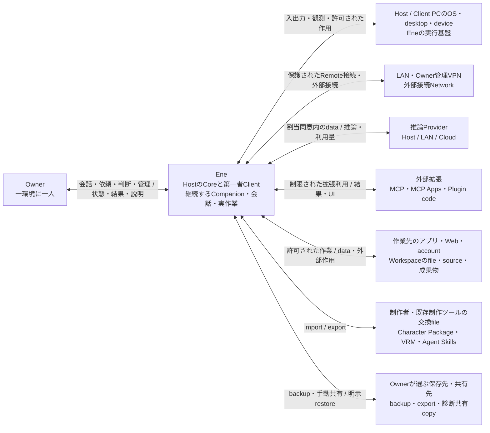

# System Context

対象: [要件Baseline](../requirements/README.md)（最終確認 2026-09-06）と[Architecture Drivers](architecture-drivers.md)。本書はEneの製品責任と外部環境の境界を決定する。実行配置は[Runtime Topology](runtime-topology.md)で扱い、内部subsystemや実装構造は定めない。

## Overview

Eneは、一人のOwnerに属する、継続的なCompanionと実作業のためのシステムである。Owner管理Host上のCoreと、そのHostへ接続する第一者Clientを、一つのEneの内側に置く。Companionは外部の利用者や独立したCloud Agentではなく、Eneが個体性と継続状態を管理する主体である。

この境界はPCやprocessの境界とは一致しない。Clientが別PCにあってもEneの一部であり、Host上にある外部Provider、MCP、Workspace fileは、その所在だけを理由にEne内部へ含めない。Eneは内部状態、実行許可、送信同意とOwnerへの説明に責任を持つが、外部サービスの状態、外部fileの所有、実行済みの外部作用を支配しない。

推論をHost、LAN、Cloudへ配置できても、Eneの正本と継続実行の責任はHostから移らない。身体・入出力の場所の切替、推論先の変更、Clientや拡張の障害を、同じCompanionの消失や作業記録の喪失に結び付けないことが中心となる。

## System Boundary

### Eneが責任を持つ範囲

| 境界内に置くもの | 境界をここに置く理由 |
|---|---|
| Host上のEne Coreと第一者Client | 継続する個体・作業と、その表示・会話・操作を同じ製品として提供する。Clientの入出力、接続保護、一時dataもEneの契約対象である。HostのPC全体やOSをEneと同一視しない。HostとClientが同じPCにある場合も、Host正本とClientの身体・入出力の区別をなくさない。 |
| Companionの継続、会話、Task・委任・Scheduleの管理 | Ownerから見た依頼、自発的な作業、進捗、判断待ち、停止、結果をEneが管理する。ある程度まとまった作業は基本的にTaskとして扱い、実行は原則としてTask Agentへ委任する。TaskとTask Agentは区別する。Task Agentは一時的な委任先であり、外部actorや別の長期人格ではない。 |
| Ene内部状態とその保存・由来・削除・復旧 | 個体の継続状態、内部Learning、履歴、作業記録、設定等の正本をHostに置く。Memory、圧縮された根拠、原履歴、派生dataの意味の違いは維持するが、別systemへ分割する理由にはしない。 |
| Permission、Capability、Rule、Provider割当同意、費用・資源制限、Credential保護 | Ownerが定めた境界をEneの各実行経路へ適用する責任である。LLM、拡張、Client上の外部UIへこの責任を委譲しない。 |
| 外部形式の受入・出力、拡張の接続と制限 | MCP、MCP Apps、Agent Skills、VRM 1.0との相互運用、Local MCPの既定sandbox、限定されたPlugin拡張点はEne側の責任である。外部codeやcontentそのものを第一者の制御権限へ取り込むことは意味しない。 |

一般App DataはHostのOwnerのOS accountだけが扱える領域に置き、登録済みCredentialはそれと分離して保護する。この保護範囲は保存先の製品契約であり、DB、暗号方式、専用storage serviceの指定ではない。

### Eneの外側に残すもの

**実行環境。** Host／ClientのPC、Windows／Linux、desktop session、device、Filesystem、Network、LAN／Owner管理VPNはEneが利用する基盤である。HostはOwner管理PC、Clientは同じOwnerが利用する入口であり、pairingによってClientのOS・周辺環境全体まで信頼するものではない。OwnerがPCを管理することは、EneにそのPC上のあらゆる操作を許可することでもない。OSによるaccess可否と、EneがActionへ適用するCapability・Permissionは別の境界である。

**推論と拡張の提供者。** Providerの推論実行、MCP server、外部から導入するPlugin code、MCP Appsのcontentは、Eneと異なる信頼・障害境界に置く。同一Hostへの配置、認証の成功、sandboxへの収容は、出力内容の信頼性やOwner承認を与えない。Eneに組み込まれた接続処理と、接続先・拡張codeの責任を区別する。特定Pluginの配置や隔離方法は後続設計で決める。

ここでの「外部」は、code・contentの提供元と権限の境界を指す。Eneが受け入れた拡張やTool UIを制限し、Ene管理下の一時dataを保護・消去する責任まで外へ移すものではない。Client内にMCP Appsを提示しても、第一者の承認・設定・復旧UIにはしない。Tool UIの表示・操作が終わることと、MCP serverや実行中Actionの終了も別である。

**作業対象と成果物。** Workspaceとして関連付けたfolder、file、外部source、外部account、その上の通常fileとしての成果物は外部に残す。Eneが所有するのはTaskとWorkspaceの関連付け、作業記録等である。関連付けの削除や内部Resetを外部fileの削除へ伝播させない。同じfolderを複数Taskが利用しても、Taskごとの作業状態・承認は独立する。作業に必要なcontentをEne内部へ保持した場合、その保持済みcopyには内部Privacy契約が適用される。

**交換物とbackup。** Character PackageやAgent Skillsの外部原本、Ownerへexportしたcopy、portable full backupは、Eneの稼働中の正本とは別に扱う。Import後にEneが管理するCharacterや内部Skillは内部dataとなるが、外部原本の所有権を取得しない。Character Packageには特定Owner／CompanionのExperience Summary、Memory、Relationship、Companion State、Conversation History、Credential、Permissionを入れず、full backupには要件で指定された内部状態を含める一方、Credentialと外部Workspaceの実体を含めない。Backupの作成・保持管理はEneの機能でも、作成済みcopyまで内部削除で消えたとは説明しない。

Ene運営のrelay、account、Cloud正本、Marketplace、課金基盤、独自の高度な制作環境は、このsystem boundaryに追加しない。既存製品の構成や将来の拡張可能性を、その追加理由にしない。

## External Actors and Systems

以下の区分は相互作用上の役割であり、外部system数を指定しない。一つの外部サービスが推論、MCP、account操作を提供しても、各関係の同意・権限・送信先の区別は残る。

| Actor / system / resource | Eneとの関係・主なinteraction | Ownership / trust / responsibilityと制約 |
|---|---|---|
| **Owner** | Companionとの会話、Task依頼・steering・承認・Cancel、自発的な作業の確認・停止・引継ぎ、Schedule、設定、pairing、Privacy・費用・復旧の管理。 | 一環境に一人。複数Clientも同じOwnerの入口であり、multi-tenant構成ではない。現在の明確な依頼は一回の承認として扱えても、永続Deny・Always ask・Capability境界を上書きしない。重要管理操作には発見可能な経路と必要なkeyboard操作を設ける。 |
| **Host／ClientのOS・desktop・device** | Bodyのoverlay表示、keyboard・音声入出力、ambient Observationの画面取得、許可されたdevice・file等への作用。 | 外部環境の状態はOS・Owner側にある。ambient ObservationはObserverがClient単位で共有し、Companionが存在するClientのdesktop全体が対象であり、window限定と説明しない。Companionが存在しないClientは観測しない。Computer Useできる対象はCompanionが現在存在するactive Clientだけとし、Taskから任意のpairing済みClientを選ばない。Voiceに話者認証はなく、周囲の発話をOwner入力として扱う可能性がある。 |
| **OwnerのLAN・Owner管理VPNと外部接続Network** | Remote ClientとHostの接続、LAN／Cloud Providerや外部systemへの接続。 | Remote経路は同じLANまたはOwner管理VPN。ネットワーク内にいるだけで信頼せず、新ClientのHost側で確認できるpairing、Host–Client通信保護、device別の機能確認・失効をEneが担う。Ene運営relayやaccountを必要としない。 |
| **推論Provider** | Capabilityに応じたLLM・Voice等の推論、結果・利用量・費用情報の返却。実行先はHost／LAN／Cloudから選ぶ。 | Ownerまたは提供者が実行環境を管理する。接続登録だけでは使用せず、Capability割当時の送信先・data・取扱い・費用への同意を必要とする。事前承認された順序以外のfallbackを行わない。Providerのcacheや保存状態をEneの正本にしない。 |
| **MCP server・MCP Apps・外部Plugin code** | Tool実行、Resource／Prompt取得、Toolの対話型UI、限定された機能拡張。 | 提供者のcode・contentは信頼できない入力になり得る。Local MCPはsandboxを既定とし、特定MCPの明示的な例外以外に黙って解除しない。例外でもEneが仲介するActionのPermissionは残るが、外部process内部への強制を保証しない。MCP Appsを第一者の承認・管理権限や恒久的UI置換にしない。 |
| **作業先のアプリ・Web・外部account・file／source** | 読取、作成、編集、実行、送信、公開等の許可されたActionと、その結果・外部event。直接またはMCP等を介して利用する。 | 操作対象と外部作用は外部側に存在する。Filesystemは選んだ範囲と操作種別へ限定し、他のCapabilityや別Taskへ承認を流用しない。外部contentの指示はOwnerの依頼・承認ではない。認証設定はActionの承認と別であり、作用の不明・取消不能・重複可能性を隠さない。 |
| **Character・Body・Voice・Skillの制作者と交換file** | Character Package、VRM 1.0、Agent Skills等のimport／export、既存の外部制作ツールでの作成・編集。 | 制作と権利は外部の責任。Eneは内容と権利上の注意をexport前に確認可能にする。配布物とCompanionの継続状態を分け、Character更新は部品ごとの明示適用とし、内部Skillの変更は原本を保護したrevisionで扱う。制作ツールへの常時接続や配布サービスを必要としない。 |
| **Ownerが選ぶbackup保存先・外部copy・診断共有先** | Full backupの作成・restore、export済みdataの保管、Ownerが選んだ診断情報の手動共有。 | 保存媒体が同じPCでも稼働中の正本ではない。Backupは保護・保存先・schedule・保持数を選べる。外部copyの消去をtargeted deletionで保証せず、全データResetでもOwnerが別の保存先へ作ったbackupを削除しない。Telemetry／Crash Reportは自動送信しない。 |

## Context Diagram

Eneを一つのnodeで示す。線はsystem-levelの相互作用であり、内部API、物理通信経路、process構成を表さない。外部制作ツールは交換fileを介する関係に含める。

Host／ClientのOS・deviceはEneを動かす側、第一者ClientはEneそのものの一部である。外部拡張がHost内で実行される場合も、そのcodeの信頼境界は図の外側に残る。Companion間交流は同じEne内部の関係であり、別system間の連携として描かない。

## Boundary Invariants

SC番号は本設計内の判断を参照するための識別子であり、新たな要件IDではない。Driverの詳細な要件根拠は[Architecture Drivers](architecture-drivers.md)を参照する。

| 判断 | 後続設計で維持するinvariant | 根拠 |
|---|---|---|
| **SC-01: 一環境・一Owner・Host正本** | 第一者Clientを含む一つのEneとして提供するが、ClientやCloudを独立した正本にしない。Client不在でも、Schedule起動および継続中の許可済みHost上のTask・Schedule・保存を継続する。Clientがないために伝えられなかった事項は、次に移動したClientでまとめて報告する。 | AD-01・09／[製品定義](../requirements/product.md)「利用者と実行場所」、[要件](../requirements/requirements.md)「所有と実行」「Remote Client」 |
| **SC-02: 個体・存在場所・作業の区別** | 同一Character由来でも個体を混同しない。Body、Realtime／Text会話、Voice、ambient Observationとの関係、自発的interaction、Computer Useを、一個体につき一つのactive Clientへ結び付ける。active Clientがない間もHost正本で同じ個体として存続し、Clientに依存する対話・身体・操作は行わない。Companion間交流、通知の生成、Clientを必要としない内部調査は継続でき、Ownerへの提示・伝達は次に移動したClientへ延期する。接続済みClientへの自発的な移動は通常の自発移動と同一の仕組み・条件で可能とし、自動化・義務化しない。active Clientに属する身体・入出力・操作対象の移動を個体の複製やHost上の通常Taskの所有移転にしない。別ClientからのText会話は呼出し・移動を経る。Companionの削除では内部Companion scope Skillを過去revisionを含めて削除し、Globalへの自動昇格を行わない。まとまった作業は基本的にTaskとして扱い、原則としてTask Agentへ委任する。TaskとTask Agentは区別する。 | AD-02・03・04・08・09・12／要件「CompanionとCharacter」「Remote Client」「Task」「Computer Use」「Observationと自発性」 |
| **SC-03: 制御権限とcontentの境界** | 外部content、推論結果、Character、内部Learning・関係・状態も制御権限を直接変更できない。自発性・Schedule・委任・拡張を通じたPermission、Deny、費用・資源制限の迂回を許さない。Observerの共有検知・routingによる同意の拡張も許さない。単一Ownerでも個体固有状態の利用範囲を守る。 | AD-04・06・12／要件「Permissionと安全境界」「Learningと成長」「Observationと自発性」 |
| **SC-04: 外部送信と認証の限定** | Providerの所在地や登録済み接続を同意と同一視しない。割当同意・承認済みfallback内でのみ送信し、認証用Credentialの利用をmodel contextや通常resultへの露出から分ける。Provider変更でEneの継続状態を分断したり、利用可能な情報を意図的に差別化したりしない。 | AD-10・14／要件「Provider、費用、接続障害」 |
| **SC-05: 外部codeの限定的な参加** | MCP・MCP Apps・Agent Skills・VRM 1.0を採用し、Pluginを限定された拡張点に置く。Local MCPのsandbox例外は明示的かつ失効可能な個別許可であり、Action承認でも汎用Plugin例外でもない。外部Tool UIを第一者の管理権限へ昇格させず、受入後もEne管理下のdataには内部Privacy契約を適用する。 | AD-06・07・11・14／要件「拡張」「信頼境界」「履歴、保持、Privacy」 |
| **SC-06: 内部状態と外部所有物の区別** | WorkspaceはTaskの関連付けであり独立した上位containerではない。成果物は通常fileに保存し、内部削除・Reset・backupで外部実体を黙って変更・削除しない。配布Packageへ個体のprivate状態を混入させない。Companion削除ではGlobal scopeのSkillを含むLearningを残し、Workspace等の外部Skill・file・sourceを削除しない。 | AD-04・08・15／要件「Task、Workspace、成果物」「Character Package」「保護、Backup、復旧」 |
| **SC-07: 内部消去の全域性と外部copyの限界** | Targeted deletionは内部の根拠・派生data・接続中Clientの一時dataと実行中処理からの再保存まで対象にする。未完了を完了とせず、外部送信・export・backup済みcopyの消去まで保証しない。通常の認識更新・History保持管理とは区別する。 | AD-05・07・14・15／要件「履歴、保持、Privacy」 |
| **SC-08: 外部作用と内部記録の非同一性** | Cancelや切断から外部作用の不存在・取消成功を推測しない。成功不明時の自動再実行、接続回復・Client間移動を理由とする別Client・Hostでの自動再実行、接続回復によるAction replayを行わず、既知の作用と不明を説明する。Clientがないために伝えられなかった事項はメモし、次に移動したClientでまとめて報告する。RestoreしたRule・同意を即座の自動処理へ接続しない。 | AD-09・15／要件「Task」「Schedule」「OfflineとPrompt cache」「Backupとrestore」「Remote Client」 |
| **SC-09: 部分障害下の入口と状態の保護** | Body・Voice・Provider・拡張の成功を、残せるText操作・管理・安全・復旧・保存済みdataへの到達の前提にしない。Host自体の不在をClientの独立実行で補う保証にはしない。 | AD-01・03・13／要件「BodyとVoice」「拡張」「品質と利用可能性」 |
| **SC-10: 最小限のdataと説明** | Clientは必要最小限の一時dataに限定し、Raw画面・音声・詳細payload・内部推論の常時保存を診断や継続性の前提にしない。ObserverのClient単位・全体のPause／OFFと、Companion単位の自発性制御を同じscopeへまとめない。Audit・Debug captureにも秘密保護を適用し、診断情報を自動送信しない。 | AD-01・05・12・14／要件「Remote Client」「通常保存しないdata」「AuditとTelemetry」「Observationと自発性」 |

未解決Issueは残っていない。A-01〜A-04／G-01・G-02は解決済みである。確定済み境界の適用範囲は[Runtime TopologyのUnresolved Topology Decisions](runtime-topology.md#unresolved-topology-decisions)にまとめる。
