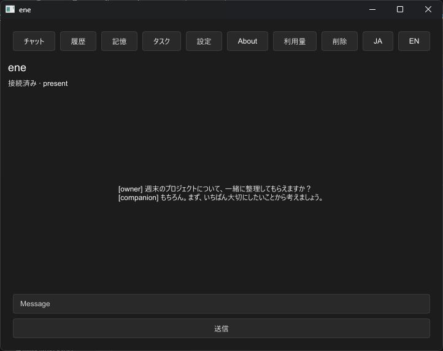
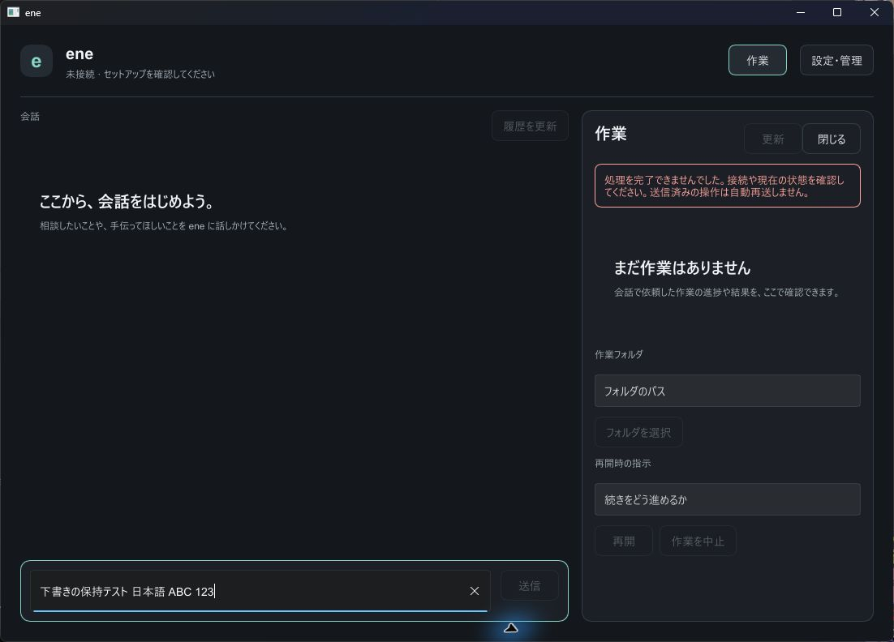
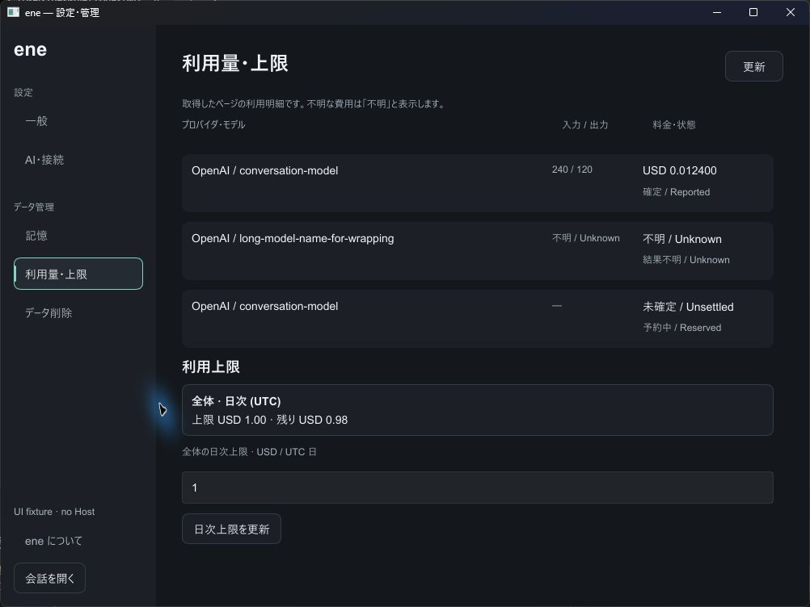
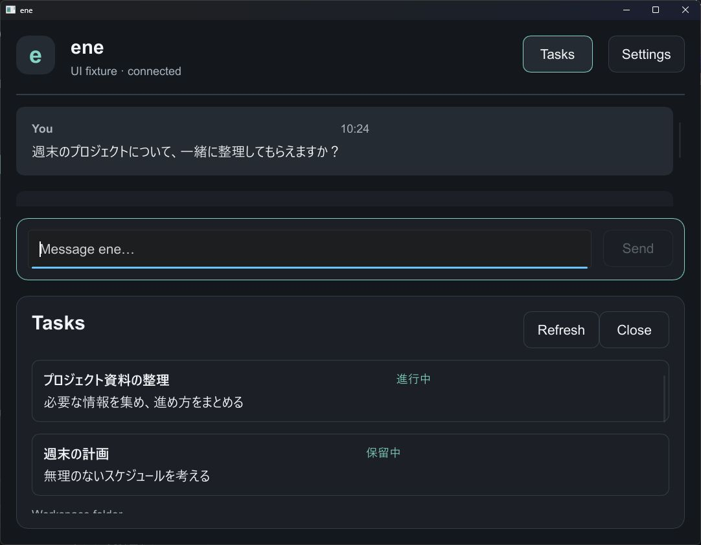
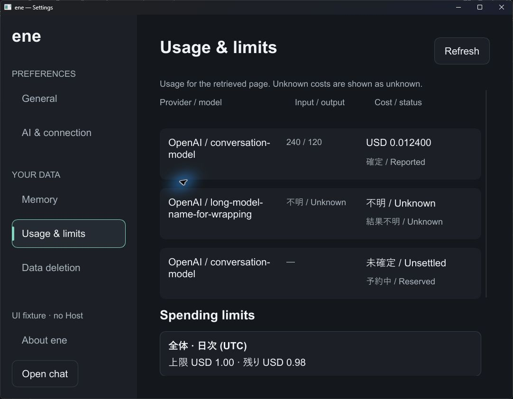

# Stage 7 UI redesign — Windows verification (2026-09-19)

## Scope and stack

Parent: [#1657](https://github.com/pexisgle/ene/pull/1657), branch `cursor/stage7-e-c0df`.
Implementation branch: `codex/stage7-ui-redesign`.
The comparison starts at parent commit `111bc8279b5aa6d6757565e154e6f0f19ed85159`.

Chat, task details and management now have independent display state.
One GUI process owns a ChatWindow and a singleton nonmodal ManagementWindow;
one worker owns the existing DesktopRuntime, Client and control seat.
Navigation and drafts update on the GUI thread while Host operations run on the worker.
There are separate busy lanes, bounded commands, stale-target checks and invalidation
of queued confirmation/secret commands when their surface is dismissed.

The chat has a message timeline, persistent composer and a collapsible task pane
(right 360 at width >=1000, bottom 240 otherwise). Task selection uses the clicked
row's revision and purpose. Workspace and resume inputs are separate from chat.
Management separates general, AI/connection, memory, usage/limits, deletion and
About; setup and owner confirmation have dedicated surfaces. Raw IDs and cursors
are not regular display content. Theme tokens and common controls centralize the
dark neutral/teal appearance.

The erasure handshake includes the two Slint surfaces and queued requests. It
destroys and renders the old native input trees before acknowledging erasure,
including hidden management controls and native undo history. A rendering failure
reports an unverified surface rather than a successful wipe. Dismissed confirmations
cannot be reused. Dismissal does not cancel or automatically retry a sent operation.

No Host implementation, protocol DTO, DB schema or VRM change is included.
Slint accessibility and winit window access are enabled for UI Automation and
bringing the existing management window to the foreground.

## Automated checks

Windows, committed Cargo.lock, debug profile:

| Check | Result |
| --- | --- |
| `cargo fmt --all -- --check` | Passed |
| `cargo build --locked --workspace` | Passed; localized MSVC linker informational output is surfaced by rustc as one linker_messages warning |
| `cargo clippy --locked --workspace --all-targets -- -D warnings` | Passed, no issues |
| `cargo test --locked --workspace -- --test-threads=1` | 1,469 passed, 0 failed, 0 ignored across 69 reported suites including doctests |
| Focused desktop/UI/body suites | 87 passed across 15 reported suites |
| UI surface regression after final compact-layout adjustment | Passed, including actual pointer/key entry at 720×540 with the task pane open |

The full workspace run preceded the final compact Slint spacing/header adjustment.
After that adjustment the UI test, workspace build, workspace Clippy and format
check were repeated. The final added assertion extends the existing UI test and
does not increase its count.

Regression coverage includes distinct draft fields; selected-row stale rejection;
closed confirmation keys; bounded command queues; an old in-flight operation
not clearing a new operation's busy state after erasure; all rendered copies being
cleared before acknowledgement; and native Ctrl+Z not restoring a character that
had already been deleted from the public draft.

## Actual Windows UI checks

Computer Use operated the built Slint windows. Production testing used a new,
isolated test data directory under target/stage7-ui-run/data. No real credentials,
provider requests, pairing approval or data deletion were submitted in this run.

| Surface / environment | Observed |
| --- | --- |
| Product, Japanese, 100%, chat 1100×760 / management 1000×720 | Separate windows, task pane, empty state, disconnected failure notice, Japanese draft entry |
| Product window lifecycle | Close management: chat and draft remain; reopen management: same window, old confirmation cleared; close chat: management remains; close final management: GUI process exits and test Host remains running |
| Test-only gallery, Japanese, 100%, standard sizes | Populated chat, usage columns, Unknown, actual second task row selection, independent windows |
| Test-only gallery, English, 150%, 720×540 | Setup flow, wrapped Japanese message content and long English model labels, usage columns and Unknown, bottom task pane and usable composer |
| Automated software-rendered surface, 720×540 | Pointer/key event reaches composer while bottom task pane is open |
| Automated software-rendered surface, hidden management | Both surfaces and native input undo history cleared |

150% means `SLINT_SCALE_FACTOR=1.5` for the test process. Windows display settings
were not changed. This is application scaling coverage, not a certification of
mixed-monitor DPI transitions.

The initial minimum-size inspection exposed a task pane covering the composer.
The final layout removes duplicate progress/header rows in that compact state,
reduces outer spacing and allows the transcript viewport to shrink. The corrected
screenshot and pointer/key regression cover that failure.

## Evidence

Before: exact parent Slint UI rebuilt in a disposable test-only fixture, with
synthetic conversation text. It is not a retrospective product E2E screenshot.

After: production Japanese chat with task pane, a local unsent test draft and
an explicit disconnected-state failure notice.

After: Japanese management usage page, test-only data.

After: English UI at 150% scale and logical 720×540, test-only data.

## Limits and remaining acceptance checks

This is not a successful end-to-end provider conversation or setup completion
claim. The gallery deliberately has no Host and cannot prove those outcomes.
The production runtime retains the parent's known reconnect/pairing issue and
unavailable credential-store registration, documented in
[the parent Windows report](stage-7-windows-2026-09-19.md).
Body/VRM/DWM placeholders and their performance gates are also outside this PR.

The full Japanese/English × standard/minimum × 100%/150% matrix, real IME
composition/commit behavior on the redesigned connected composer, exhaustive Tab
order, slow-Host loading while typing, and scroll-position retention across every
navigation path still need a dedicated manual acceptance pass. Structural and
regression tests do not substitute for those checks. No such unperformed check is
recorded as passed here.
