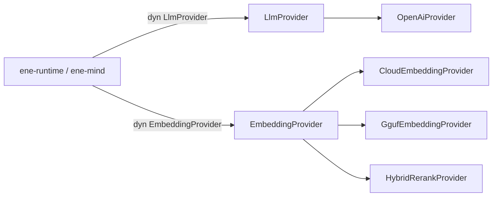

# `ene-ai` — APIリファレンス

> **クレート:** `ene-ai`
> **パス:** `crates/ene-ai`

`ene-ai` は LLM と埋め込みプロバイダーの統合レイヤーです（API v2 で旧 `ene-provider` + `ene-embedding` を統合）。チャット完了と埋め込みは `LlmProvider` / `EmbeddingProvider` 経由で流れ、失敗は型付きエラー（`LlmProviderError`、`EmbeddingError`）で報告されます。



## `EmbeddingProvider` トレイト

トレイト上の必須操作はバッチのみ。単一テキスト／クエリはフリー関数（デフォルトメソッドとしても提供）。

```rust
#[async_trait]
pub trait EmbeddingProvider: Send + Sync {
    async fn embed_batch(
        &self,
        items: &[(&str, EmbeddingKind)],
    ) -> Result<Vec<Vec<f32>>, EmbeddingError>;

    fn dimensions(&self) -> usize;
    fn model_name(&self) -> &str;
}
```

| メソッド / 関数 | 備考 |
|---|---|
| `embed_batch(items)` | 必須。出力順は入力順。空バッチは空 `Vec`。空白のみは `EmptyInput`。次元不一致は `DimensionMismatch`。 |
| `embed` / `embed_query` | `embed_batch` 上のフリー関数（またはデフォルトメソッド） |

**トレイトに含めないもの:** `hyde`、`has_reranker`、`rerank`。パイプラインヘルパーへ移動済み:

| ヘルパー | 場所 |
|---|---|
| `hyde_document` / `rerank_tool_specs` | `ene_ai::hybrid` |
| `HybridRerankProvider::{hyde, rerank, has_reranker}` | 固有メソッド |
| `CloudEmbeddingProvider::hyde` | 固有メソッド |

## ローカル GGUF（`GgufEmbeddingProvider`）

```rust
pub fn create_local_provider(...) -> Result<Box<dyn EmbeddingProvider>, EneEmbeddingError>;
```

**マルチスレッド** tokio ランタイムが必要（`block_in_place`）。

## `Role`

```rust
pub enum Role { System, User, Assistant }
```

mind の `HistoryEntry { role: Role, content: String }` とランタイムの `ConversationEntry` で使用。

## 関連

- [`ene-mind`](./ene-mind.md)
- [`ene-tool-host`](./ene-tool-host.md)
- [API v2 ADR](../architecture/api-v2.md)
