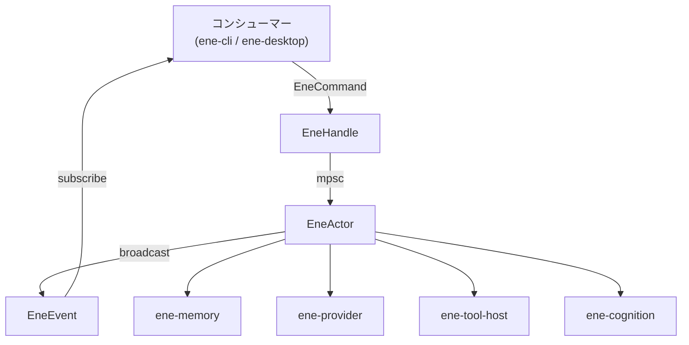
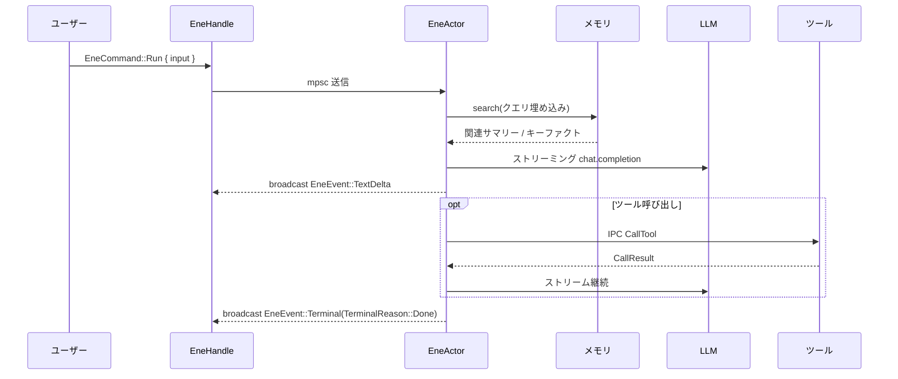

# `ene-core` — APIリファレンス

> **クレート:** `ene-core`
> **役割:** アクターベースのメッセージパッシングアーキテクチャを通じて、LLMストリーミング、ツール統合、長期記憶、セッション管理を統合するランタイムファサード。すべてのホストアプリケーション（`ene-cli`、`ene-desktop`）のメインエントリポイント。

---

## 概要

`ene-core` はすべてのコンシューマーアプリケーションのプライマリインターフェースです。内部のアクターループをスレッドセーフな [`EneHandle`](#enehandle) でラップし、会話の実行・設定管理・メモリの照会・ツール呼び出しを行う非同期APIを提供します。

内部アクター（非公開の `EneActor`）は専用のTokioタスク上で動作します。コマンドは無制限の `mpsc` チャネル経由で送信され、イベントは `tokio::sync::broadcast` チャネルで全サブスクライバーに配信されます。アクターはツールレジストリ、メモリストア、埋め込みプロバイダー、会話セッションを所有し、各ターンをレガシーストリーミングパイプラインまたは認知ランタイムパイプラインのいずれかにディスパッチします（[ストリーミングディスパッチ](#ストリーミングディスパッチ)を参照）。



---

## データフロー（1ターン）



`EneCommand::Run` ごとに、正常終了・エラー・キャンセルのいずれであっても [`EneEvent::Terminal`](#eneevent) が**必ず1回だけ**発行されます。アクターとストリームタスクで共有される内部の `AtomicBool` ガード（`terminal_emitted`）により、キャンセルとストリーム自身の完了が競合してもこの保証が成立します。

---

## `EneHandle`

`EneHandle` は主要なパブリックインターフェースです。**スレッドセーフ**かつ**安価にクローン可能**で、スレッド/タスク間で自由に共有できます。最後のクローンがドロップされると暗黙的に `Shutdown` コマンドが送信され、アクタータスクが終了します。

```rust
pub struct EneHandle { /* 非公開 */ }

impl Clone for EneHandle { /* ... */ }
impl Default for EneHandle { /* ... */ } // Self::new() を呼び出す
```

### コンストラクタ — 同期

| メソッド | シグネチャ | 説明 |
|---|---|---|
| `new` | `fn new() -> Self` | 現在のTokioランタイム上でバックグラウンドアクタータスクを生成し、ハンドルを返します。 |

### 会話・ライフサイクル操作 — 同期

これらのメソッドは `mpsc` チャネル経由でfire-and-forget方式のコマンドを送信し、即座に戻ります。アクターがコマンドを処理するのを待ちません。

| メソッド | シグネチャ | 説明 |
|---|---|---|
| `subscribe` | `fn subscribe(&self) -> EneEventReceiver` | この時点以降のイベントを受信するブロードキャストレシーバーを返します。 |
| `run` | `fn run(&self, input: impl Into<String>) -> Result<(), ActorDeadError>` | 指定したユーザー入力で新しいストリーミングターンを開始します。実行中の前回のターンがあれば、まず中断してドレインします。 |
| `cancel` | `fn cancel(&self) -> Result<(), ActorDeadError>` | 実行中のターンをキャンセルします。すでにterminalが発行されていない限り `Terminal(TerminalReason::Cancelled)` を発行します。 |
| `decide_permission` | `fn decide_permission(&self, request_id: impl Into<RequestId>, decision: PermissionDecision) -> Result<(), ActorDeadError>` | 保留中の `PermissionRequired` イベントを解決します。 |
| `submit_user_input` | `fn submit_user_input(&self, request_id: impl Into<RequestId>, response: UserInputResponse) -> Result<(), ActorDeadError>` | 保留中の `UserInputRequired` イベントを解決します。 |
| `invalidate_tool_index` | `fn invalidate_tool_index(&self) -> Result<(), ActorDeadError>` | キャッシュされたTool RAGインデックスを破棄し、次のクエリで再構築されるようにします。 |

### 設定・状態取得・ツール操作 — **非同期**

これらのメソッドは `oneshot` リプライチャネルを使用し、アクターの応答を `.await` します。そのため、アクターが実際にリクエストを処理した後にのみ戻ります。

| メソッド | シグネチャ | 説明 |
|---|---|---|
| `shutdown` | `async fn shutdown(&self, timeout: Duration) -> Result<(), ShutdownTimeout>` | `Shutdown` を送信し、**アクタータスクのドレインを待機します**（ツールプロセスの停止、メモリ挿入のフラッシュ）。`timeout` 以内に完了しない場合は `Err(ShutdownTimeout)` を返します（デタッチされたタスクはプロセス終了時に暗黙的にアボートされます）。2回以上呼んでも安全です（2回目以降は no-op）。`Drop` は既に待機なしで `Shutdown` を送信するため、呼び出し側がドレインの完了を明示的に観測したい場合（例: CLIの `/quit`）にのみこのメソッドを呼びます。 |
| `reconfigure` | `async fn reconfigure(&self, config: EneConfig) -> Result<(), EneCoreError>` | アクティブな設定をホットスワップします: 埋め込みプロバイダー、メモリストア、ツールレジストリ、Tool RAGパイプラインを再初期化します。 |
| `load_config` | `async fn load_config(&self) -> Result<EneConfig, EneCoreError>` | 便利ラッパー: デフォルトパスから設定を読み込み（`ene_config::load_config`）、`reconfigure` を呼び出します。読み込んだ設定を返します。 |
| `load_config_from` | `async fn load_config_from(&self, assets_dir: &Path, config_path: &Path) -> Result<EneConfig, EneCoreError>` | `load_config` と同様ですが、明示的な `assets_dir`/`config_path` から読み込みます（`ene_config::load_config_from`）。 |
| `load_character` | `async fn load_character(&self, name: impl Into<String>) -> Result<(), EneCoreError>` | ベア名またはパスでキャラクターカードを読み込みます（ベア名は `ene_config::resolve_character_path` で解決）。 |
| `get_snapshot` | `async fn get_snapshot(&self) -> Result<EneStateSnapshot, EneCoreError>` | アクターのセッション状態の時点スナップショットを返します。 |
| `manual_split` | `async fn manual_split(&self) -> Result<SplitResult, EneCoreError>` | セッションの強制スプリット（`cognition.enabled && cognition.context.compression_enabled` の場合はローリング圧縮パス）を実行します。 |
| `list_tools` | `async fn list_tools(&self) -> Result<Vec<ToolSpec>, EneCoreError>` | 現在アクティブなレジストリ内の全ツールの仕様を返します。 |
| `call_tool` | `async fn call_tool(&self, name: String, arguments: String) -> Result<String, EneCoreError>` | LLMのツール呼び出しループを経由せずに、名前とJSONエンコード済み引数でツールを直接呼び出します。 |

---

## `EneCommand`

アクターの内部 `mpsc` チャネルに送信されるコマンドです。通常は直接構築することはなく、すべての `EneHandle` メソッドが自動的に構築します。

```rust
pub enum EneCommand {
    Run { input: String },
    Cancel,
    Shutdown,
    Reconfigure { config: EneConfig, reply: oneshot::Sender<Result<(), EneCoreError>> },
    LoadCharacter { path: String, reply: oneshot::Sender<Result<(), EneCoreError>> },
    PermissionDecision { request_id: RequestId, decision: PermissionDecision },
    UserInputResponse { request_id: RequestId, response: UserInputResponse },
    GetSnapshot { reply: oneshot::Sender<EneStateSnapshot> },
    ManualSplit { reply: oneshot::Sender<Result<SplitResult, EneCoreError>> },
    ListTools { reply: oneshot::Sender<Vec<ToolSpec>> },
    CallTool { name: String, arguments: String, reply: oneshot::Sender<Result<String, EneCoreError>> },
    InvalidateToolIndex,
}
```

| バリアント | 用途 |
|---|---|
| `Run` | `input` に対するAI補完を開始する。 |
| `Cancel` | 実行中の補完ストリームをキャンセルする。 |
| `Shutdown` | アクターのコマンドループを停止し、バックグラウンドタスクをクリーンアップする。 |
| `Reconfigure` | 置き換え用の `EneConfig` を適用し、サブシステムを再初期化する。 |
| `LoadCharacter` | 解決済みパスからキャラクターカードを読み込む。 |
| `PermissionDecision` | 以前の `PermissionRequired` リクエストへのユーザー判断を伝える。 |
| `UserInputResponse` | 以前の `UserInputRequired` リクエストへのユーザー応答を伝える。 |
| `GetSnapshot` | 読み取り専用の `EneStateSnapshot` を要求する。 |
| `ManualSplit` | セッションスプリット/圧縮パスを強制実行する。 |
| `ListTools` | アクティブなレジストリの全ツールを一覧表示する。 |
| `CallTool` | 名前とJSON引数でツールを直接呼び出す。 |
| `InvalidateToolIndex` | キャッシュされたTool RAGインデックスを破棄する。 |

---

## `EneEvent`

[`EneHandle::subscribe`](#enehandle) で取得した各 `EneEventReceiver` にブロードキャストされるイベントです。コンシューマーは関心のあるバリアントにマッチし、`Terminal` をターン終了の信号として扱うべきです。

```rust
pub enum EneEvent {
    TextDelta { delta: String },
    SpecialToken { token: String },
    Expression { name: String, source: String },
    ToolCallStart { name: String, arguments: String },
    ToolCallResult { name: String, result: String },
    PermissionRequired { request_id: RequestId, action: String, target: String, description: String },
    UserInputRequired { request_id: RequestId, prompt: ene_tool_proto::UserInputPrompt },
    TaskProgress { task_id: String, step: usize, total_steps: Option<usize>, description: String },
    PipelinePhase { phase: String },
    PipelineMetrics { timings: HashMap<String, u64> },
    SessionSplit { summary: String, reason: SplitReason },
    Terminal(TerminalReason),
    StatusChanged { status: EneStatus },
}
```

| バリアント | フィールド | 説明 |
|---|---|---|
| `TextDelta` | `delta: String` | LLMから生成されたテキストの断片。 |
| `SpecialToken` | `token: String` | ストリームから解析済みの特殊トークン（例: `<\|emo:happy\|>`）。 |
| `Expression` | `name: String`, `source: String` | Output Arbiter（#91）が解決したエンジン管理の表情。`name` は正規化された表情名（`happy`、`neutral` など）、`source` はデバッグ用の解決経路（`affect`、`llm_advisory`、`hysteresis` など）。 |
| `ToolCallStart` | `name: String`, `arguments: String` | LLMがツール呼び出しを要求した。`arguments` は生のJSONエンコード済み引数文字列。 |
| `ToolCallResult` | `name: String`, `result: String` | ツール呼び出しが完了した。`result` はその文字列出力。 |
| `PermissionRequired` | `request_id`, `action`, `target`, `description` | 処理続行前に破壊的操作へのユーザー承認が必要。`EneHandle::decide_permission` で解決する。 |
| `UserInputRequired` | `request_id`, `prompt: UserInputPrompt` | インタラクティブツールが確認のための回答を必要としている。`EneHandle::submit_user_input` で解決する。 |
| `TaskProgress` | `task_id`, `step`, `total_steps: Option<usize>`, `description` | 長時間実行されるバックグラウンドタスクの進捗更新。 |
| `PipelinePhase` | `phase: String` | 事前生成フェーズ（`Embedding`、`Context Search`、`Prompt Building`）への進入を示す。 |
| `PipelineMetrics` | `timings: HashMap<String, u64>` | 最初の `TextDelta` の直前に一度だけ発行され、各事前生成フェーズの経過ミリ秒を含む。 |
| `SessionSplit` | `summary: String`, `reason: SplitReason` | 会話セッションがスプリットされ（タイムアウト、話題変化、または手動）、サマリーが作成された。 |
| `Terminal` | `TerminalReason` | `Run` ごとに**必ず1回だけ**発行される（正常終了・失敗・キャンセルのいずれでも）。コンシューマーはここでイベントループを終了すべき。 |
| `StatusChanged` | `status: EneStatus` | アクターの `EneStatus` が変化した（`Idle` ⇄ `Running`）。 |

---

## `TerminalReason`

`EneEvent::Terminal` が保持します。`EneCommand::Run` ごとに必ず1つだけ発行されます。

```rust
pub enum TerminalReason {
    /// LLMストリームが正常に完了した（ツール呼び出しなし、プロバイダーが完了）。
    Done,
    /// エラーによりランが終了した。
    Failed { message: String },
    /// `EneCommand::Cancel` によりユーザーがランをキャンセルした。
    Cancelled,
}
```

`TerminalReason` は `PartialEq, Eq` を導出しているため、コンシューマーは直接マッチできます（例: `matches!(reason, TerminalReason::Done)`）。

---

## `EneStatus`

```rust
pub enum EneStatus {
    /// 現在何も処理していない。
    Idle,
    /// AIストリームが実行中。
    Running,
    /// エラー状態（致命的ではない）。
    Error,
}
```

`Debug, Clone, Copy, PartialEq, Eq`。`EneEvent::StatusChanged` でブロードキャストされ、他には反映されません — 「現在のステータス」を取得するゲッターは存在せず、コンシューマー側でイベントストリームから追跡する必要があります。

---

## `EneStateSnapshot`

`EneHandle::get_snapshot` が返す、読み取り専用の時点アクター状態です。

```rust
pub struct EneStateSnapshot {
    pub character_card: Option<CharacterCardV3>,
    pub history: Vec<ConversationEntry>,
    pub config: EneConfig,
    pub session_id: SessionId,
    pub card_name: CardName,
    pub memory: MemoryQueryHandle,
    pub current_turn_count: u32,
    pub session_started_at: DateTime<Utc>,
}
```

| フィールド | 説明 |
|---|---|
| `character_card` | 読み込まれているキャラクターカード（存在する場合）。 |
| `history` | `ConversationEntry`（ロール＋内容）のペアとしての会話履歴。 |
| `config` | 現在アクティブな `EneConfig` のクローン。 |
| `session_id` | 現在のセッションの一意な識別子。 |
| `card_name` | アクティブなキャラクターカードの名前。 |
| `memory` | [`MemoryQueryHandle`](#memoryqueryhandle) — メモリが設定されている場合のみ有効。 |
| `current_turn_count` | 現在のセッションで完了したターン数。 |
| `session_started_at` | 現在のセッションが開始されたUTCタイムスタンプ。 |

---

## `MemoryQueryHandle`

アクター外部からメモリサブシステムを照会するためのクローン可能な読み取り専用ハンドルです。`EneStateSnapshot::memory` から取得します。`Option<Arc<ene_memory::MemoryStore>>` と `Option<Arc<dyn EmbeddingProvider>>` をラップしており、`is_enabled` 以外のすべてのメソッドは、対応する要素が存在しない場合に `EneCoreError::Memory(..)` / `EneCoreError::Embedding(..)` を返します。

```rust
#[derive(Clone)]
pub struct MemoryQueryHandle { /* 非公開 */ }
```

### 一般

| メソッド | シグネチャ | 説明 |
|---|---|---|
| `is_enabled` | `fn is_enabled(&self) -> bool` | メモリストアと埋め込みプロバイダーの両方が存在する場合に `true`。 |
| `embed_query` | `async fn embed_query(&self, text: &str) -> Result<Vec<f32>, EneCoreError>` | 設定済みの埋め込みプロバイダーを使ってテキストクエリを埋め込みます。 |

### 会話サマリー・キーファクト（レガシー）

| メソッド | シグネチャ | 説明 |
|---|---|---|
| `search_summaries` | `async fn search_summaries(&self, query_embedding: &[f32], card_name: &str, limit: usize, threshold: f32) -> Result<Vec<RecalledSummary>, EneCoreError>` | 会話サマリーへのベクトル類似度検索。 |
| `list_recent_summaries` | `async fn list_recent_summaries(&self, card_name: &str, limit: usize) -> Result<Vec<ConversationSummary>, EneCoreError>` | キャラクターカードの最近のサマリーを新しい順で返す。 |
| `get_all_keyfacts` | `async fn get_all_keyfacts(&self, card_name: &str) -> Result<Vec<KeyFact>, EneCoreError>` | キャラクターカードに保存されている全レガシーキーファクト。 |

### レガシー → 型付きメモリ移行

| メソッド | シグネチャ | 説明 |
|---|---|---|
| `count_legacy_rows` | `async fn count_legacy_rows(&self, card_name: &str) -> Result<LegacyRowCounts, EneCoreError>` | カードのレガシー `conversation_summaries`/`conversation_keyfacts` 行数を数える。 |
| `migration_status` | `async fn migration_status(&self, card_name: &str) -> Result<Option<MigrationStatus>, EneCoreError>` | 移行が実行済みの場合、現在のレガシー→型付き移行ステータス。 |
| `migrate_legacy` | `async fn migrate_legacy(&self, card_name: &str, user_id: &str, dry_run: bool) -> Result<LegacyMigrationReport, EneCoreError>` | ワンショットのレガシー→型付きメモリ移行を実行する。`dry_run` は書き込みなしでプレビューする。 |
| `reset_legacy_memory` | `async fn reset_legacy_memory(&self, card_name: &str) -> Result<(), EneCoreError>` | **破壊的操作。** キャラクターカードのレガシーメモリ行をすべてクリアする。 |

### 型付きメモリ（`ene-cognition` / `ene-memory`）

| メソッド | シグネチャ | 説明 |
|---|---|---|
| `list_typed_memories` | `async fn list_typed_memories(&self, character_id: &str, kind: Option<MemoryKind>, limit: usize) -> Result<Vec<MemoryItem>, EneCoreError>` | キャラクターの型付きメモリを一覧表示する（`MemoryKind` で任意にフィルタ可能）。 |
| `inspect_typed_memory` | `async fn inspect_typed_memory(&self, id: i64) -> Result<Option<MemoryItem>, EneCoreError>` | 行IDで単一の型付きメモリを取得する。 |
| `search_typed_memories_hybrid` | `async fn search_typed_memories_hybrid(&self, character_id: &str, user_id: Option<&str>, query_text: &str, limit: usize) -> Result<Vec<ScoredMemory>, EneCoreError>` | `query_text` を埋め込み、CLIのデフォルトの重み/しきい値で `ene-memory` のハイブリッド（ベクトル＋新近性＋顕著性＋確信度）検索を実行する。 |
| `pin_typed_memory` | `async fn pin_typed_memory(&self, id: i64, pinned: bool) -> Result<bool, EneCoreError>` | 型付きメモリのピン留めフラグを設定/解除する。 |
| `transition_typed_memory_status` | `async fn transition_typed_memory_status(&self, id: i64, status: MemoryStatus) -> Result<bool, EneCoreError>` | 型付きメモリのライフサイクルステータスを手動で遷移させる（例: `Archived` へ）。 |

### 感情状態

| メソッド | シグネチャ | 説明 |
|---|---|---|
| `show_affect_state` | `async fn show_affect_state(&self, character_id: &str) -> Result<AffectState, EneCoreError>` | キャラクターの現在のPAD感情状態を返す。 |
| `reset_affect_state` | `async fn reset_affect_state(&self, character_id: &str) -> Result<(), EneCoreError>` | 感情状態を `AffectState::neutral(character_id)` にリセットする。 |

### コミットメント

| メソッド | シグネチャ | 説明 |
|---|---|---|
| `list_active_commitments` | `async fn list_active_commitments(&self, character_id: &str, user_id: Option<&str>, limit: usize) -> Result<Vec<Commitment>, EneCoreError>` | キャラクター/ユーザーのアクティブなコミットメント（約束/タスク）を一覧表示する。 |
| `complete_commitment` | `async fn complete_commitment(&self, id: i64) -> Result<bool, EneCoreError>` | コミットメントを完了としてマークする。 |

---

## `PermissionDecision` / `UserInputResponse` / `MultiAnswer`

`streaming` モジュールで定義され、クレートルートで再エクスポートされます。

```rust
pub enum PermissionDecision {
    AllowOnce,
    AllowSession,
    Deny,
}

pub enum UserInputResponse {
    /// プロンプトの順序で、サブ質問ごとに1つの回答。
    Multi(Vec<MultiAnswer>),
    /// ユーザーがプロンプト全体をキャンセルした。
    Cancel,
}
```

`MultiAnswer`（`ene_tool_proto` から `#[doc(no_inline)]` で再エクスポート）は `Selected { option: String }`、`Answer { text: String }`、`Skip` のいずれかで、`UserInputPrompt` 内の単一サブ質問へのユーザー応答を表します。

---

## `message_builder`

**レガシー**（非認知）ストリーミングパイプライン向けのLLMメッセージリストを組み立てます。`MessageBuildContext` と `build_messages` はクレートルートで再エクスポートされます（`ene_core::{MessageBuildContext, build_messages}`）。以下の個々のプロンプトセクションビルダーはモジュールスコープです（`ene_core::message_builder::build_system_prompt` など）。これらは `ene-core` 自身のストリーミングコードと、認知パスの出力コントラクト選択で直接使用されます。

### `MessageBuildContext<'a>`

```rust
pub struct MessageBuildContext<'a> {
    pub card: &'a CharacterCardV3,
    pub user_input: &'a str,
    pub history: &'a [ConversationEntry],
    pub runtime_context: Option<&'a str>,
    pub runtime_rules: &'a str,
    pub user_name: &'a str,
    pub recalled_summaries: &'a [RecalledSummary],
    pub key_facts: &'a [KeyFact],
    pub prompts: &'a PromptLibrary,
}
```

### `build_messages`

```rust
pub fn build_messages(ctx: &MessageBuildContext<'_>) -> Result<Vec<LlmMessage>, EneCoreError>
```

以下の順序で完全なメッセージリストを組み立てます:

1. `System` — マスコット対応のシステムプロンプト（振る舞いルール＋キャラクターアイデンティティ＋シーン）、`build_system_prompt` 経由。
2. `System` — 例文メッセージ（`mes_example`）、初回ターンのみ。
3. `System` — 過去の会話サマリー（メモリリコール）。
4. `System` — ユーザーに関する既知のキーファクト。
5. 履歴 — `User`/`Assistant`/`System` ターンの交互配置。
6. `System` — 表情PHI（`<\|emo:name\|>` プロトコル＋post-history instructions）、`build_expression_phi` 経由。
7. `User` — 現在のユーザー入力（任意の `[Runtime Context]` ブロックを追加）。

### モジュールスコープのプロンプトビルダー

| 関数 | シグネチャ | 説明 |
|---|---|---|
| `build_system_prompt` | `fn build_system_prompt(card: &CharacterCardV3, runtime_rules: &str, user_name: &str, prompts: &PromptLibrary) -> String` | マスコットコンテキストフレーム＋振る舞いルール＋キャラクターアイデンティティ（システムプロンプト、性格、背景）＋シーンを組み立てる。`{{char}}`/`{{user}}` のCBSマクロを展開する。 |
| `build_expression_phi` | `fn build_expression_phi(card: &CharacterCardV3, prompts: &PromptLibrary) -> Option<String>` | カードの解決済み表情から `<\|emo:NAME\|>` 感情トークンプロトコルブロックを組み立て、手動の `post_history_instructions` があれば結合する。両方が空の場合のみ `None` を返す。 |
| `build_natural_dialogue_contract` | `fn build_natural_dialogue_contract(card: &CharacterCardV3, prompts: &PromptLibrary, user_name: &str) -> Option<String>` | エンジン管理表情（#91）向けの出力コントラクトを組み立てる: LLMにインラインの感情トークンを**含めない**プレーンな対話で応答するよう指示する。表情はターン後に認知ランタイムのOutput Arbiterが解決するため。 |
| `build_cognitive_output_contract` | `fn build_cognitive_output_contract(card: &CharacterCardV3, prompts: &PromptLibrary, emotion_enabled: bool, user_name: &str) -> Option<String>` | 認知ストリーミングパス向けのpost-history出力ブロックを選択する: `emotion_enabled` の場合は `build_natural_dialogue_contract`、それ以外は `build_expression_phi`。 |

---

## `db_server`

`#[cfg(any(unix, windows))]` — サポートされたIPCトランスポート（Unixドメインソケットまたは Windows Named Pipe）を持つプラットフォームでのみコンパイルされます。共有の `sea-orm` `memory.db` コネクションを基盤とする**ツールごと**のデータベースIPCサーバーを実装しており、ツールバイナリが生のSQLやデータベースファイルを直接見ることはありません。

### `DbIpcServer`

```rust
pub struct DbIpcServer { /* 非公開 */ }

impl DbIpcServer {
    pub fn new(db: DatabaseConnection, socket_path: PathBuf, tool_name: String, prefix: String, auth_token: String) -> Self;
    pub async fn run(self) -> Result<(), DbServerError>;
}
```

有効化された各ツールごとに1つの `DbIpcServer` が（`handle.rs` の `build_tool_registry` で）起動され、それぞれ `ene_config::paths::tool_socket_dir()` 配下の専用ソケット/パイプにバインドされます。`run` は接続を受け付けるループを回し、一時的なacceptエラー時にはサーバータスクを終了させずに500msバックオフします。

### `DbServerError`

```rust
pub enum DbServerError {
    Io(#[from] std::io::Error),
    Json(#[from] serde_json::Error),
    Db(#[from] sea_orm::DbErr),
    PermissionDenied(String),
    UnknownTable(String),
    UnknownColumn { table: String, column: String },
    Internal(String),
}
```

ワイヤー上で返される前に `DbErrorCode`（`PermissionDenied`、`UnknownTable`、`UnknownColumn`、`Internal`）を介して `ene_tool_db::DbResponse::Error { code, message }` にマッピングされます。

### セキュリティモデル

- **プレフィックス強制。** 各ツールは `DbRequest::DeclareSchema` でスキーマを宣言し、すべてのテーブル名はそのツールに割り当てられたプレフィックス（例: `fs_`、`utility_`）で始まる必要があります。これは宣言時と、以降のすべてのリクエストの両方でチェックされます。未宣言のテーブルや `sqlite_*`/`__tool_schemas` 内部テーブルへのリクエストは `UnknownTable`/`PermissionDenied` として拒否されます。
- **ハンドシェイク。** 新規接続の最初のメッセージは、ツールごと・起動ごとの128ビット事前共有トークンを持つ `DbRequest::Handshake { token }` である必要があります（ナノ秒タイムスタンプ＋単調カウンタをキーとする `blake3` XOFで生成され、環境変数経由でツールプロセスに渡されます）。それ以外の最初のメッセージ、または誤ったトークンは拒否され、スキーマ/データ操作が可能になる前に接続がクローズされます。
- **識別子の検証。** `validate_identifier` は、空、64文字を超える、`[A-Za-z_]` で始まらない、または `[A-Za-z0-9_]` 以外の文字を含むテーブル/カラム/インデックス名をすべて拒否します — これにより、生成された `CREATE TABLE`/`CREATE INDEX` のDDLに識別子を埋め込む際に生じうるSQLインジェクションの経路を防ぎます（識別子はSQLの値のようにパラメータ化できないため）。
- **Unixソケットの権限。** Unixでは、バインドされたソケットは直後に `0o600` に `chmod` され、所有ユーザー（つまり意図した子プロセスのみ）が接続できるようにします。Windowsでは、名前付きパイプのバインド時にカーネルが設定するハンドル単位のACLが同じ役割を果たします。
- **DDLは公開されない。** ツールは任意のSQLを発行できません。構造化された `Insert`/`Upsert`/`Select`/`Update`/`Delete`/`Count`/`LastInsertRowId` リクエストバリアントのみがディスパッチされ、それぞれツール自身が宣言したスキーマに対して検証された後、パラメータ化された `sea-query` ステートメントに変換されます。

---

## 再エクスポート

`ene-core` は依存関係グラフ上で下位にある各クレートのアイテムを再エクスポートしており、コンシューマーは一般的な用途では `ene_core::*` だけで済みます。特記のない限りすべての再エクスポートには `#[doc(no_inline)]` が付与されており、rustdocのリンクは元のクレートを指します。

[API リファクタリング計画](../../architecture/api-refactor-plan.md) 以降、この一覧は厳選されています。`EneHandle` 自身の公開シグネチャ（`EneStateSnapshot`、`EneEvent`、`ConversationEntry` など）に現れる型、または `ene-cli`/`ene-desktop` 全体で使用頻度の高い型のみを残しています。`ene-core` の外では使用されていなかった型（埋め込みプロバイダーのサブ設定、`ene_tool_host::ToolRegistry`、`ene_session::split_text_and_special_tokens` など）はルートから削除しました — 必要な場合は所有クレートから直接インポートしてください。

| ソースクレート | 再エクスポートされるアイテム |
|---|---|
| `ene_config` | `EneConfig`、`CharacterCardV3` |
| `ene_provider` | `LlmMessage`、`LlmProvider`、`ProviderConfig`、`Role` |
| `ene_memory` | `MemoryConfig` |
| `ene_cognition`（[`schema_link`](#schema_link) 経由） | `CharacterMemoryConfig`、`CognitionConfig`、`CognitionMemoryConfig`、`ContextConfig`、`EmotionConfig` |
| `ene_common` | `Truncate` |
| `ene_session` | `CardName`、`SessionId`、`SplitReason`、`SplitResult`、`extract_emotion_from_token`、`SessionConfig`、`SummarizationConfig` |
| `ene_tool_proto` | `ToolSpec` |

### `schema_link`

`pub mod schema_link` は、`ene_cognition::*` の設定再エクスポートをホスト向けAPIの他の部分から分離します。これは一般的なアプリケーションAPIではなく、純粋に*リンク*のための仕組みとして存在します。`ene-config` の `define_config!` マクロは各設定セクションをグローバルなスキーマレジストリに登録しますが、これはプロセス起動時に実行される `ctor::ctor` ブロックによって行われ、そのセクションを定義するクレートが最終バイナリに実際にリンクされている場合にのみ発火します。`ene-core` は `ene-cli` と `ene-desktop` が共有する共通の依存先であるため、`schema_link` から `ene_cognition::CognitionConfig`（およびその4つのサブ型 `CharacterMemoryConfig`、`CognitionMemoryConfig`、`ContextConfig`、`EmotionConfig`）を再エクスポートすることで、`ene-core` の全コンシューマーに `ene-cognition` が強制的にリンクされ、その `ctor` ブロックが発火して `cognition` セクションが登録されます。これがなければ、スキーマジェネレーターはそのセクションを一切認識せず、ユーザーに提供されるJSONスキーマから認知ランタイムの設定ブロック全体が静かに欠落してしまいます。

この5つの型はクレートルートでも再エクスポートされています（`ene_core::CognitionConfig` など）ので、既存のインポートはそのままコンパイルできます。しかし新しいコードでは `ene-cognition` から直接インポートすることを推奨します（スキーマリンクの文脈が有用な場合は `ene_core::schema_link` からでも構いません）— ルートでの再エクスポートは後方互換性のためだけに残されています。

### クレート内部の再エクスポート

これらはクレート自身の型で、定義元のモジュールからルートで再エクスポートされます（`ene-core` が発生元のクレートであるため `#[doc(no_inline)]` は付与されません）:

| モジュール | アイテム |
|---|---|
| `handle` | `ActorDeadError`、`ConversationEntry`、`EneCommand`（*モジュールローカルで、再エクスポートされない*）、`EneEvent`、`EneEventReceiver`、`EneHandle`、`EneStateSnapshot`、`EneStatus`、`MemoryQueryHandle`、`TerminalReason` |
| `error` | `EneCoreError` |
| `streaming` | `MultiAnswer`（*`ene_tool_proto` から再エクスポート、`#[doc(no_inline)]`*）、`PermissionDecision`、`UserInputResponse` |
| `message_builder` | `MessageBuildContext`、`build_messages` |
| `types` | `RequestId` |

`EneCommand` 自体は `handle` モジュールから `pub` ですが、クレートルートでは再エクスポートされません — コンシューマーは `EneHandle` のコマンド送信メソッドを介して間接的にのみこれに到達します。

`streaming` と `message_builder` は、「アプリが必要としているから」以外の理由で `pub`（`pub(crate)` ではなく）に保たれている2つのモジュールです。`streaming::{StreamContext, run_stream}` は `ene-core` 自身の `tests/cognitive_streaming_integration.rs` から直接呼び出されており、`message_builder` のモジュールスコープのプロンプトビルダー（`build_system_prompt`、`build_expression_phi` など）は `ene-cli` の `/prompt` デバッグコマンドから直接呼び出されています。通常の用途ではアプリケーションコードは依然として `EneHandle` を優先すべきです — これら2つのモジュールは `EneHandle` ファサードの一部ではなく、非推奨サイクルを経ずに変更される可能性があります。

---

## サポート型

| 型 | 種類 | 説明 |
|---|---|---|
| `ActorDeadError` | `thiserror` struct | アクターの `mpsc` チャネルがクローズされている（アクタータスクが終了している）場合に、同期版の `EneHandle` メソッドが返す。`#[error("Actor is no longer running")]`。 |
| `ShutdownTimeout` | `thiserror` struct（`pub std::time::Duration`） | 指定したタイムアウト内にアクターのドレインが完了しなかった場合に `EneHandle::shutdown` が返す。`#[error("Actor did not shut down within {0:?}")]`。 |
| `EneEventReceiver` | ラッパー struct | `broadcast::Receiver<EneEvent>` をラップする。`try_recv(&mut self) -> Result<EneEvent, TryRecvError>`（非ブロッキング）と `async fn recv(&mut self) -> Result<EneEvent, RecvError>` を公開する。 |
| `ConversationEntry` | `Debug, Clone` struct | 1件の履歴エントリ: `{ role: Role, content: String }`。 |
| `EneStateSnapshot` | [上記参照](#enestatesnapshot)。 | |
| `EneStatus` | [上記参照](#enestatus)。 | |
| `PermissionDecision` | [上記参照](#permissiondecision--userinputresponse--multianswer)。 | |
| `UserInputResponse` | [上記参照](#permissiondecision--userinputresponse--multianswer)。 | |
| `MultiAnswer` | `ene_tool_proto` から再エクスポート | [上記参照](#permissiondecision--userinputresponse--multianswer)。 |
| `RequestId` | `Debug, Clone, PartialEq, Eq, Hash, Serialize, Deserialize` newtype（`String`） | `PermissionRequired`/`UserInputRequired` イベントと、後続の `decide_permission`/`submit_user_input` 呼び出しを関連付ける不透明な識別子。`RequestId::new`、`From<String>`、`From<&str>` で構築できる。 |
| `EneCoreError` | `thiserror` enum | このクレートのエラー型 — 下記参照。 |

### `EneCoreError`

```rust
pub enum EneCoreError {
    NoCharacterCard,
    Provider(#[from] ene_provider::LlmProviderError),
    Config(#[from] ene_config::EneConfigError),
    Memory(#[from] ene_memory::EneMemoryError),
    Session(#[from] ene_session::EneSessionError),
    Tool(#[from] ene_tool_host::EneToolHostError),
    Embedding(#[from] ene_provider::EmbeddingError),
    ChannelClosed,
    Cognition(#[from] ene_cognition::CognitionError),
}
```

`NoCharacterCard` と `ChannelClosed` を除くすべてのバリアントは、下位クレートのエラー型を（`#[error(transparent)]`、`#[from]` で）ラップしています。そのため呼び出し側はどのサブシステム呼び出しからも `?` で伝播でき、必要に応じてラップされたエラーに `match`/ダウンキャストして正確な原因（例: `Provider` → 認証/レート制限/ネットワーク/コンテンツフィルター）をディスパッチできます。

---

## ストリーミングディスパッチ

`crate::streaming::run_stream` は、すべての `Run` コマンドに対してアクターが呼び出す単一のエントリポイントです。各ターンの先頭で2つの実装のいずれかを選択します:

```rust
if cognition.enabled && mem_enabled && embedder.is_some() {
    streaming_cognitive::run_stream_cognitive(ctx).await
} else {
    run_stream_legacy(ctx).await  // 上記の条件を満たさない場合のフォールバックでもある
}
```

- **条件:** `CognitionConfig::enabled == true` **かつ** `MemoryConfig::enabled == true` **かつ** 埋め込みプロバイダーが設定されている（`ctx.embedder.is_some()`）。
- **認知パス**（`streaming_cognitive::run_stream_cognitive`、非公開モジュール）: プロンプト構築、リコール、感情、ターン後のメモリ書き込みを `ene-cognition` の `CognitionEngine`（`before_turn` → `compose_prompt_packet` → LLMストリーム → `resolve_expression_turn` → `after_turn`）に委譲します。[`ene-cognition`](./ene-cognition.md) を参照してください。
- **レガシーパス**（`run_stream_legacy`、`streaming.rs` 内）: [データフロー](#データフロー1ターン)で説明したパイプライン — 埋め込み → メモリ/ツールRAGの並列検索 → `build_chat_messages_list`（[`message_builder`](#message_builder) 経由） → インラインツール呼び出し処理を含むストリーミング補完ループ。
- 認知機能とメモリの両方が有効でも**埋め込みプロバイダーが設定されていない場合**は、`tracing::warn!` がログに記録され、ターンを失敗させることなく静かにレガシーパイプラインへフォールバックします。

両方のパスは同じツール実行機構（`select_relevant_tools`、`perform_tool_executions`、`accumulate_tool_calls`、`finalize_tool_calls`）と、同じterminalイベント保証（`emit_terminal`）を共有します。

---

## 使用例

```rust,no_run
use ene_core::{EneHandle, EneEvent, PermissionDecision, TerminalReason};

#[tokio::main]
async fn main() -> anyhow::Result<()> {
    let handle = EneHandle::new();

    // ターンを実行する前に設定とキャラクターを読み込む。
    handle.load_config().await?;
    handle.load_character("Alicia").await?;

    // イベントを取り逃さないよう、コマンド送信前にサブスクライブする。
    let mut rx = handle.subscribe();
    handle.run("こんにちは！何ができますか？")?;

    loop {
        match rx.recv().await? {
            EneEvent::TextDelta { delta } => print!("{delta}"),
            EneEvent::Expression { name, source } => {
                eprintln!("[表情: {name} ({source})]");
            }
            EneEvent::ToolCallStart { name, .. } => eprintln!("[ツール: {name}]"),
            EneEvent::PermissionRequired { request_id, action, target, .. } => {
                eprintln!("パーミッション要求: {action} on {target}");
                handle.decide_permission(request_id, PermissionDecision::AllowOnce)?;
            }
            EneEvent::Terminal(TerminalReason::Done) => break,
            EneEvent::Terminal(TerminalReason::Cancelled) => {
                eprintln!("キャンセルされました");
                break;
            }
            EneEvent::Terminal(TerminalReason::Failed { message }) => {
                eprintln!("エラー: {message}");
                break;
            }
            _ => {}
        }
    }
    println!();

    // Drop に任せず、アクターのドレインを明示的に待機する。
    handle.shutdown(std::time::Duration::from_secs(5)).await?;
    Ok(())
}
```

---

## 関連項目

- [`ene-cognition`](./ene-cognition.md) — ストリーミング認知ディスパッチパスが呼び出す認知ランタイムエンジン
- [認知ランタイムアーキテクチャ（ADR）](../architecture/cognitive-runtime.md) — 認知ディスパッチの判断根拠となる設計の全体像
- [`ene-provider`](./ene-provider.md) — LLMと埋め込みプロバイダーのトレイト
- [`ene-session`](./ene-session.md) — `ConversationSession`、セッション分割
- [`ene-memory`](./ene-memory.md) — 永続メモリストア
- [`ene-tool-host`](./ene-tool-host.md) — ツールプロセスのライフサイクルとTool RAG
- [`ene-config`](./ene-config.md) — 設定の読み込みとスキーマ登録
