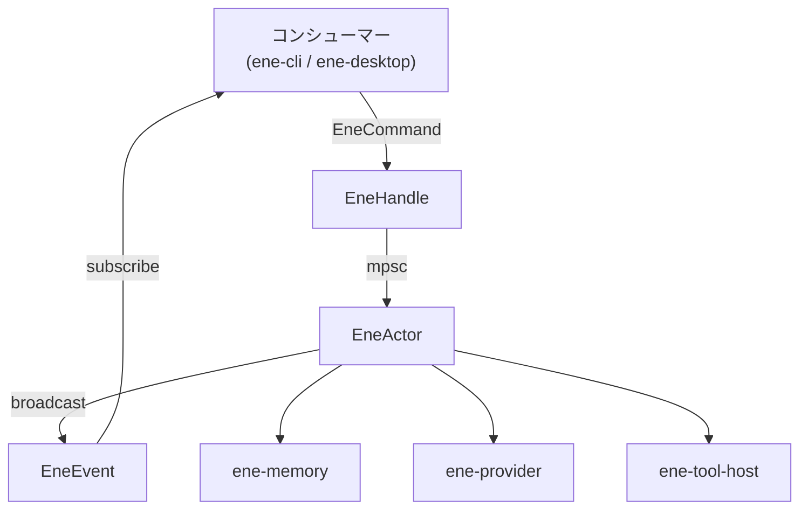
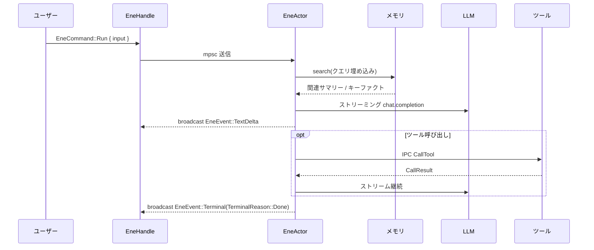

# `ene-core` — APIリファレンス

> **クレート:** `ene-core`  
> **役割:** Ene システムのメインエントリーポイント。アクターベースのランタイムファサードを提供します。

---

## 概要

`ene-core` は、CLIやデスクトップGUIなどのアプリケーションが利用するプライマリインターフェースです。内部のアクターループをスレッドセーフな `EneHandle` でラップし、会話の実行・設定管理・メモリの照会・ツール呼び出しを行うクリーンな非同期APIを提供します。

アクターは専用のTokioタスク上で動作します。コマンドは `mpsc` チャネル経由で送信され、イベントは `broadcast` チャネルで全サブスクライバーに配信されます。



---

## データフロー（1ターン）



---

## `EneHandle`

`EneHandle` は主要なパブリックインターフェースです。**スレッドセーフ**かつ**安価にクローン可能**で、スレッド間で自由に共有できます。

```rust
#[derive(Clone)]
pub struct EneHandle { /* 非公開 */ }
```

### コンストラクタ

| メソッド | シグネチャ | 説明 |
|---------|-----------|------|
| `new` | `fn new() -> Self` | バックグラウンドアクタータスクを生成してハンドルを返します。 |

### 会話操作

| メソッド | シグネチャ | 説明 |
|---------|-----------|------|
| `run` | `fn run(&self, input: impl Into<String>) -> Result<(), ActorDeadError>` | ユーザー入力をアクターに送信し、新しいストリーミングターンを開始します。 |
| `cancel` | `fn cancel(&self) -> Result<(), ActorDeadError>` | 実行中のターンをキャンセルします。 |
| `subscribe` | `fn subscribe(&self) -> EneEventReceiver` | `EneEvent` を受信するブロードキャストチャネルのレシーバーを返します。 |

### 設定操作

| メソッド | シグネチャ | 説明 |
|---------|-----------|------|
| `reconfigure` | `fn reconfigure(&self, config: EneConfig) -> Result<(), EneCoreError>` | アクターを再起動せずに設定をホットリロードします。 |
| `load_config` | `fn load_config(&self) -> Result<EneConfig, EneCoreError>` | 現在アクティブな設定を返します。 |
| `load_config_from` | `fn load_config_from(&self, assets_dir: &Path, config_path: &Path) -> Result<EneConfig, EneCoreError>` | 指定したファイルパスから設定を読み込みます。 |
| `load_character` | `fn load_character(&self, name: impl Into<String>) -> Result<(), EneCoreError>` | キャラクターカードを名前で読み込みます。 |

### 状態取得

| メソッド | シグネチャ | 説明 |
|---------|-----------|------|
| `get_snapshot` | `fn get_snapshot(&self) -> Result<EneStateSnapshot, EneCoreError>` | アクター状態のスナップショットを返します。 |
| `manual_split` | `fn manual_split(&self) -> Result<SplitResult, EneCoreError>` | セッションの強制スプリット（メモリサマリーの作成）を実行します。 |
| `list_tools` | `fn list_tools(&self) -> Result<Vec<ToolSpec>, EneCoreError>` | 登録済みのツール仕様一覧を返します。 |
| `call_tool` | `fn call_tool(&self, name: String, arguments: String) -> Result<String, EneCoreError>` | JSON エンコード済み引数でツールを名前で直接呼び出します。 |
| `invalidate_tool_index` | `fn invalidate_tool_index(&self) -> Result<(), ActorDeadError>` | キャッシュされた Tool RAG インデックスを破棄し、次のクエリで再構築されるようにします。 |

### インタラクティブフロー

| メソッド | シグネチャ | 説明 |
|---------|-----------|------|
| `decide_permission` | `fn decide_permission(&self, request_id: impl Into<RequestId>, decision: PermissionDecision) -> Result<(), ActorDeadError>` | `PermissionRequired` イベントへの応答を送信します。 |
| `submit_user_input` | `fn submit_user_input(&self, request_id: impl Into<RequestId>, response: UserInputResponse) -> Result<(), ActorDeadError>` | `UserInputRequired` イベントへの応答を送信します。 |

---

## `EneCommand`

アクターの `mpsc` チャネルに送信されるコマンドです。通常は `EneHandle` のメソッドが自動的に構築するため、直接使用することはほとんどありません。

```rust
pub enum EneCommand {
    /// 新しい会話ターンを開始する。
    Run { input: String },

    /// 実行中のストリーミングターンをキャンセルする。
    Cancel,

    /// アクターをグレースフルにシャットダウンする。
    Shutdown,

    /// 現在の設定を置き換える。
    Reconfigure { config: EneConfig, reply: oneshot::Sender<Result<(), EneCoreError>> },

    /// 指定パスからキャラクターカードを読み込む。
    LoadCharacter { path: String, reply: oneshot::Sender<Result<(), EneCoreError>> },

    /// 状態スナップショットを取得する。
    GetSnapshot { reply: oneshot::Sender<EneStateSnapshot> },

    /// セッションメモリのスプリットを強制実行する。
    ManualSplit { reply: oneshot::Sender<Result<SplitResult, EneCoreError>> },

    /// 利用可能なツール仕様の一覧を取得する。
    ListTools { reply: oneshot::Sender<Vec<ToolSpec>> },

    /// 名前を指定してツールを直接呼び出す。
    CallTool { name: String, arguments: String, reply: oneshot::Sender<Result<String, EneCoreError>> },

    /// パーミッションプロンプトへのユーザー判断を送信する。
    PermissionDecision { request_id: RequestId, decision: PermissionDecision },

    /// 入力プロンプトへのユーザー応答を送信する。
    UserInputResponse { request_id: RequestId, response: UserInputResponse },

    /// ツールインデックスの再構築を指示する。
    InvalidateToolIndex,
}
```

---

## `EneEvent`

アクティブな全 `EneEventReceiver` にブロードキャストされるイベントです。

```rust
pub enum EneEvent {
    /// アシスタントのテキスト出力の断片。
    TextDelta { delta: String },

    /// ストリームから解析された特殊トークン（感情マーカーなど）。
    SpecialToken { token: String },

    /// ツール呼び出しが開始された。
    ToolCallStart { name: String, arguments: String },

    /// ツール呼び出しが完了した。
    ToolCallResult { name: String, result: String },

    /// 処理続行前にユーザーのパーミッション確認が必要。
    PermissionRequired {
        request_id: RequestId,
        action: String,
        target: String,
        description: String,
    },

    /// 処理続行前にユーザーのテキスト入力が必要。
    UserInputRequired {
        request_id: RequestId,
        prompt: UserInputPrompt,
    },

    /// マルチステップバックグラウンドタスクの進捗更新。
    TaskProgress {
        task_id: String,
        step: usize,
        total_steps: Option<usize>,
        description: String,
    },

    /// セッションがスプリットされ、メモリサマリーが作成された。
    SessionSplit { summary: String, reason: SplitReason },

    /// 現在のターンが正常に完了した。
    Done,

    /// 現在のターンが失敗した。
    Failed { message: String },

    /// アクターのステータスが変化した。
    StatusChanged { status: EneStatus },
}
```

---

## `EneStateSnapshot`

`EneHandle::get_snapshot` が返すアクター状態のスナップショットです。

```rust
pub struct EneStateSnapshot {
    /// 読み込まれているキャラクターカード（存在する場合）。
    pub character_card: Option<CharacterCardV3>,

    /// 現在のセッションの会話履歴。
    pub history: Vec<ConversationEntry>,

    /// アクティブなランタイム設定。
    pub config: EneConfig,

    /// 現在のセッションの一意な識別子。
    pub session_id: SessionId,

    /// アクティブなキャラクターの名前。
    pub card_name: CardName,

    /// メモリストアへのクエリハンドル。
    pub memory: MemoryQueryHandle,

    /// 現在のセッションで完了したターン数。
    pub current_turn_count: u32,

    /// 現在のセッションの開始日時。
    pub session_started_at: DateTime<Utc>,
}
```

---

## `EneStatus`

```rust
pub enum EneStatus {
    /// ユーザー入力を待機中。
    Idle,

    /// ターンを処理中。
    Running,

    /// エラーが発生した。
    Error,
}
```

---

## `MemoryQueryHandle`

アクター外部からメモリサブシステムへの読み取りアクセスを提供します。`EneStateSnapshot::memory` から取得します。

| メソッド | シグネチャ | 説明 |
|---------|-----------|------|
| `is_enabled` | `fn is_enabled(&self) -> bool` | メモリサブシステムが有効かどうかを返します。 |
| `embed_query` | `fn embed_query(&self, text: &str) -> Result<Vec<f32>, EneCoreError>` | 設定済みの埋め込みプロバイダーを使ってテキストを埋め込みます。 |
| `search_summaries` | `fn search_summaries(&self, query_embedding: &[f32], card_name: &str, limit: usize, threshold: f32) -> Result<Vec<RecalledSummary>, EneCoreError>` | ベクトル類似度でメモリサマリーを検索します。 |
| `list_recent_summaries` | `fn list_recent_summaries(&self, card_name: &str, limit: usize) -> Result<Vec<ConversationSummary>, EneCoreError>` | 最近のサマリーを新しい順で返します。 |
| `get_all_keyfacts` | `fn get_all_keyfacts(&self, card_name: &str) -> Result<Vec<KeyFact>, EneCoreError>` | キャラクターに保存されている全キーファクトを返します。 |

---

## `PermissionDecision`

`PermissionRequired` イベントへのユーザー応答です。

```rust
pub enum PermissionDecision {
    /// この1回のアクションのみ許可する。
    AllowOnce,

    /// セッション中はこの種のアクションをすべて許可する。
    AllowSession,

    /// アクションを拒否する。
    Deny,
}
```

---

## `UserInputResponse`

`UserInputRequired` イベントへのユーザー応答です。

```rust
pub enum UserInputResponse {
    /// 複数質問プロンプトへの回答。
    Multi(Vec<MultiAnswer>),

    /// ユーザーが入力プロンプトをキャンセルした。
    Cancel,
}
```

---

## ストリーミング内部関数

以下の関数はAI会話ループの核心部分です。パブリックAPIではありませんが、コントリビューター向けにドキュメント化しています。

### `run_stream`

```rust
async fn run_stream(ctx: StreamContext) -> ConversationSession
```

メインのAIループ。`fetch_memory_context` と `build_chat_messages_list` を呼び出し、LLMとのストリーミング補完を開始します。ツール呼び出しをインラインで処理し、継続ループを回し、セッションに履歴を永続化します。

### `select_relevant_tools`

```rust
fn select_relevant_tools(
    registry: &ToolRegistry,
    tool_rag: Option<&ToolRagIndex>,
    user_input: &str,
    enabled: bool,
) -> Vec<ToolSpec>
```

現在のターンのコンテキストに含めるツールを選択します。`tool_rag` が `Some` の場合はベクトル検索で最も関連性の高いサブセットを選び、`None` の場合は全登録ツールを返します。

### `fetch_memory_context`

```rust
async fn fetch_memory_context(
    session: &ConversationSession,
    config: &EneConfig,
) -> (Vec<RecalledSummary>, Vec<KeyFact>)
```

セッションのペンディング埋め込みを読み取り、`MemoryStore::recall_context` を呼び出して現在のターンに関連するサマリーとキーファクトを取得します。

### `build_chat_messages_list`

```rust
fn build_chat_messages_list(
    session: &ConversationSession,
    config: &EneConfig,
    user_input: &str,
    summaries: &[RecalledSummary],
    facts: &[KeyFact],
) -> Result<Vec<LlmMessage>, EneCoreError>
```

LLMに送信するメッセージリストを組み立てます。システムプロンプト（キャラクターカード＋注入されたメモリコンテキスト）、履歴、そして現在のユーザーメッセージを含みます。

---

## 使用例

```rust
use ene_core::EneHandle;
use ene_core::EneEvent;

#[tokio::main]
async fn main() -> anyhow::Result<()> {
    let handle = EneHandle::new();

    // コマンド送信前にイベントをサブスクライブする
    let mut rx = handle.subscribe();

    // 会話ターンを開始する
    handle.run("こんにちは！何ができますか？")?;

    // Done または Failed が来るまでイベントを処理する
    loop {
        match rx.recv().await? {
            EneEvent::TextDelta { delta } => print!("{}", delta),
            EneEvent::ToolCallStart { name, .. } => eprintln!("[ツール: {}]", name),
            EneEvent::ToolCallResult { name, result } => {
                eprintln!("[{} => {}]", name, result);
            }
            EneEvent::PermissionRequired { request_id, action, target, .. } => {
                eprintln!("パーミッション要求: {} on {}", action, target);
                handle.decide_permission(request_id, ene_core::PermissionDecision::AllowOnce)?;
            }
            EneEvent::Terminal(ene_core::TerminalReason::Done) => break,
            EneEvent::Terminal(ene_core::TerminalReason::Failed { message }) => {
                eprintln!("エラー: {}", message);
                break;
            }
            _ => {}
        }
    }

    println!();
    Ok(())
}
```

---

## 関連項目

- [`ene-provider`](./ene-provider.md) — LLMと埋め込みプロバイダーのトレイト
- [`ene-session`](./ene-session.md) — 会話セッションと履歴管理
- [`ene-memory`](./ene-memory.md) — 永続メモリストア
- [`ene-config`](./ene-config.md) — 設定の読み込み
