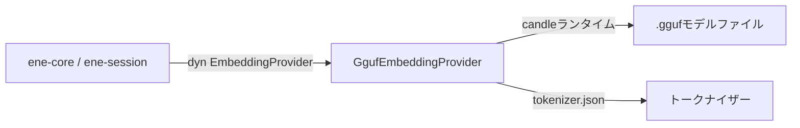

# `ene-embedding` — APIリファレンス

> **クレート:** `ene-embedding`  
> **役割:** オフライン推論のためのローカルGGUFフォーマット埋め込みモデルプロバイダー。

---

## 概要

`ene-embedding` は、ローカルに読み込んだGGUFモデルファイルを使って `ene-provider` の `EmbeddingProvider` トレイトを実装します。推論エンジンには **candle** MLフレームワークを使用しており、外部APIを一切呼び出さない完全オフラインの埋め込み生成を実現します。

プライバシーを重視した環境やエアギャップ環境に推奨される埋め込みバックエンドです。



---

## `GgufEmbeddingProvider`

```rust
pub struct GgufEmbeddingProvider { /* 非公開 */ }
```

`EmbeddingProvider` を実装します。構築時にGGUFモデルと対応する `tokenizer.json` を読み込みます。推論はCPU上で同期的に実行されます（candleの機能フラグによってアクセラレーテッドハードウェアも利用可能）。

通常このタイプを直接構築することはありません。代わりに [`create_local_provider`](#create_local_provider) を使用してください。

**実装するトレイトメソッド：**

| メソッド | 補足 |
|---------|------|
| `embed(text, kind)` | モデル依存の kind 固有プレフィックスを付けて埋め込む。`Query` と `Hyde` kind は `"Query: "` プレフィックス、それ以外は `"Document: "` プレフィックスを使う。 |
| `embed_query(text)` | `embed(text, EmbeddingKind::Query)` の短縮形。 |
| `embed_batch(items)` | 全アイテムを逐次埋め込む（現在 1 アイテム = 1 推論呼び出し、HyDE はパラレルデコード）。 |
| `dimensions()` | 出力ベクトルサイズを返す（モデルメタデータから設定）。 |
| `model_name()` | `"{model}@{quantization}"` を返す（例: `Qwen3-Embedding-0.6B@Q4_K_M`）。 |

---

## ファクトリ関数

### `resolve_gguf_paths`

```rust
pub fn resolve_gguf_paths(
    model: &str,
    quantization: &str,
    model_dir: PathBuf,
) -> Result<(PathBuf, PathBuf), EneEmbeddingError>
```

モデル名、量子化サフィックス、検索ディレクトリを元に、GGUF モデル
ファイルとトークナイザーのパスを解決します。`model_dir` は値消費
される点に注意してください。

**返り値:** 成功時は `(モデルパス, トークナイザーパス)`。

**パス解決の例：**

```
model_dir/
├── Qwen3-Embedding-0.6B.Q4_K_M.gguf   ← モデルファイル
└── tokenizer.json                        ← トークナイザー
```

`model = "Qwen3-Embedding-0.6B"`、`quantization = "Q4_K_M"` で呼び出します。

> **注:** ローカルローダーは現在 `Qwen3-Embedding` 系にハードコード
> されています（`crates/ene-embedding/src/quantized/loader.rs` を参照。
> `qwen3.*` の GGUF メタデータキーを読み込みます）。Nomic や BGE
> など他のアーキテクチャはローカルプロバイダーではサポートされません。
> これらを使用する場合は `ene-provider` の `CloudEmbeddingProvider`
> を利用してください。

### `create_local_provider`

```rust
pub fn create_local_provider(
    model: &str,
    quantization: &str,
    model_dir: PathBuf,
) -> Result<Box<dyn ene_provider::EmbeddingProvider>, EneEmbeddingError>
```

主要なエントリーポイントです。`resolve_gguf_paths` でパスを解決し、
GGUF モデルとトークナイザーを読み込み、ボックス化された
`EmbeddingProvider` を返します。`model_dir` は値消費されます
(`PathBuf`)。

**固定パラメータ：**
- `max_length = 8192` — 最大トークンシーケンス長。

**ランタイム要件:** 返されるプロバイダーのフォワードパスは
`tokio::task::block_in_place` を使って Candle を呼び出します
（同期かつ CPU バウンド）。`block_in_place` は **マルチスレッド tokio
ランタイム** を必要とし、`current_thread` ランタイムではパニック
します。プレーンな `#[tokio::main] async fn main()` はデフォルトで
マルチスレッドフレーバーを使用するため、最もシンプルな正しい
セットアップです。明示的にランタイムを構築する場合は
`tokio::runtime::Builder::new_multi_thread().enable_all().build()` を
使用してください。

**使用例：**

```rust
use ene_embedding::create_local_provider;
use std::path::PathBuf;

let provider = create_local_provider(
    "Qwen3-Embedding-0.6B",
    "Q4_K_M",
    PathBuf::from("/models"),
)?;

println!("次元数: {}", provider.dimensions());
println!("モデル: {}", provider.model_name());
```

---

## エラー型

### `EneEmbeddingError`

```rust
pub enum EneEmbeddingError {
    /// 一般的な埋め込みエラー（読み込み、推論など）。
    #[error("Embedding error: {0}")]
    EmbeddingError(String),

    /// Candle ML 推論エンジンからのエラー。
    #[error("Candle ML error: {0}")]
    CandleError(String),
}

/// 内部モジュール用の型エイリアス。
pub type EmbeddingError = EneEmbeddingError;
```

`EneEmbeddingError` は `From` を介して
`ene_provider::EmbeddingError::Provider(String)` に自動変換されます。

---

## 設定との連携

`settings.json` の `[embedding]` セクションでローカルプロバイダーを使用するよう設定します：

```json
{
  "embedding": {
    "backend": "local",
    "model": "Qwen3-Embedding-0.6B",
    "quantization": "Q4_K_M",
    "model_dir": "/path/to/models"
  }
}
```

環境変数でも設定できます：

```sh
ENE_EMBEDDING__BACKEND=local
ENE_EMBEDDING__MODEL=Qwen3-Embedding-0.6B
ENE_EMBEDDING__QUANTIZATION=Q4_K_M
ENE_EMBEDDING__MODEL_DIR=/path/to/models
```

---

## パフォーマンスに関する注意

- **初回呼び出し:** 最初の推論呼び出し時にモデルがメモリに読み込まれます。以降の呼び出しはロード済みの重みを再利用します。
- **スループット:** インタラクティブな用途に適しています（モダンCPUでのQ4量子化の単一クエリレイテンシは約10〜100ms）。高スループットのバッチワークロードには最適化されていません。
- **メモリ使用量:** Q4_K_M量子化の1.37億パラメータモデルは約70〜100 MBのRAMを使用します。

---

## 関連項目

- [`ene-provider`](./ene-provider.md) — `EmbeddingProvider` トレイトの定義
- [`ene-memory`](./ene-memory.md) — ベクトル検索に埋め込みを使用する
- [`ene-config`](./ene-config.md) — 埋め込みバックエンドの設定
