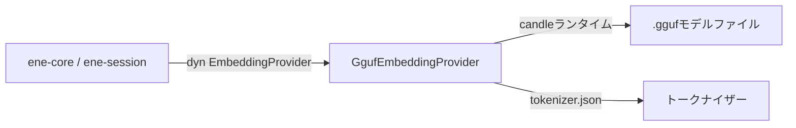

# `ene-embedding` — APIリファレンス

> **クレート:** `ene-embedding`  
> **役割:** オフライン推論のためのローカルGGUFフォーマット埋め込みモデルプロバイダー。

---

## 概要

`ene-embedding` は、ローカルに読み込んだGGUFモデルファイルを使って `ene-provider` の `EmbeddingProvider` トレイトを実装します。推論エンジンには **candle** MLフレームワークを使用しており、外部APIを一切呼び出さない完全オフラインの埋め込み生成を実現します。

プライバシーを重視した環境やエアギャップ環境に推奨される埋め込みバックエンドです。



---

## `GgufEmbeddingProvider`

```rust
pub struct GgufEmbeddingProvider { /* 非公開 */ }
```

`EmbeddingProvider` を実装します。構築時にGGUFモデルと対応する `tokenizer.json` を読み込みます。推論はCPU上で同期的に実行されます（candleの機能フラグによってアクセラレーテッドハードウェアも利用可能）。

通常このタイプを直接構築することはありません。代わりに [`create_local_provider`](#create_local_provider) を使用してください。

**実装するトレイトメソッド：**

| メソッド | 補足 |
|---------|------|
| `embed(text, kind)` | モデル依存のkind固有プレフィックスを付けて埋め込む。 |
| `embed_query(text)` | `embed(text, EmbeddingKind::Query)` の短縮形。 |
| `embed_batch(items)` | 可能な場合は1回の推論呼び出しにまとめて全アイテムを埋め込む。 |
| `hyde(query)` | ロードされたモデルがHyDEをサポートしない場合はクエリをそのまま埋め込む。 |
| `rerank(query, candidates)` | 各候補のテキストフィールドを埋め込み、クエリとのコサイン類似度でスコアリングする。 |
| `dimensions()` | 出力ベクトルサイズを返す（モデルメタデータから設定）。 |
| `model_name()` | GGUFファイルのステム部分をモデル識別子として返す。 |

---

## ファクトリ関数

### `resolve_gguf_paths`

```rust
pub fn resolve_gguf_paths(
    model: &str,
    quantization: &str,
    model_dir: &Path,
) -> Result<(PathBuf, PathBuf), EneEmbeddingError>
```

モデル名、量子化サフィックス、検索ディレクトリを元に、GGUFモデルファイルとトークナイザーのパスを解決します。

**返り値:** 成功時は `(モデルパス, トークナイザーパス)`。

**パス解決の例：**

```
model_dir/
├── nomic-embed-text-v1.5.Q4_K_M.gguf   ← モデルファイル
└── tokenizer.json                        ← トークナイザー
```

`model = "nomic-embed-text-v1.5"`、`quantization = "Q4_K_M"` で呼び出します。

### `create_local_provider`

```rust
pub fn create_local_provider(
    model: &str,
    quantization: &str,
    model_dir: &Path,
) -> Result<Box<dyn EmbeddingProvider>, EneEmbeddingError>
```

主要なエントリーポイントです。`resolve_gguf_paths` でパスを解決し、GGUFモデルとトークナイザーを読み込み、ボックス化された `EmbeddingProvider` を返します。

**固定パラメータ：**
- `max_length = 8192` — 最大トークンシーケンス長。

**使用例：**

```rust
use ene_embedding::create_local_provider;
use std::path::Path;

let provider = create_local_provider(
    "nomic-embed-text-v1.5",
    "Q4_K_M",
    Path::new("/models"),
)?;

println!("次元数: {}", provider.dimensions());
println!("モデル: {}", provider.model_name());
```

---

## エラー型

### `EneEmbeddingError`

```rust
pub enum EneEmbeddingError {
    /// モデルまたはトークナイザーファイルが見つからない、または開けない。
    ModelNotFound { path: PathBuf },

    /// GGUFモデルの読み込みに失敗した（フォーマットエラー、破損など）。
    LoadFailed(String),

    /// 推論が失敗した。
    InferenceFailed(String),

    /// トークナイザーファイルを解析できなかった。
    TokenizerError(String),
}
```

---

## 設定との連携

`settings.json` の `[embedding]` セクションでローカルプロバイダーを使用するよう設定します：

```json
{
  "embedding": {
    "backend": "local",
    "model": "nomic-embed-text-v1.5",
    "quantization": "Q4_K_M",
    "model_dir": "/path/to/models"
  }
}
```

環境変数でも設定できます：

```sh
ENE_EMBEDDING__BACKEND=local
ENE_EMBEDDING__MODEL=nomic-embed-text-v1.5
ENE_EMBEDDING__QUANTIZATION=Q4_K_M
ENE_EMBEDDING__MODEL_DIR=/path/to/models
```

---

## パフォーマンスに関する注意

- **初回呼び出し:** 最初の推論呼び出し時にモデルがメモリに読み込まれます。以降の呼び出しはロード済みの重みを再利用します。
- **スループット:** インタラクティブな用途に適しています（モダンCPUでのQ4量子化の単一クエリレイテンシは約10〜100ms）。高スループットのバッチワークロードには最適化されていません。
- **メモリ使用量:** Q4_K_M量子化の1.37億パラメータモデルは約70〜100 MBのRAMを使用します。

---

## 関連項目

- [`ene-provider`](./ene-provider.md) — `EmbeddingProvider` トレイトの定義
- [`ene-memory`](./ene-memory.md) — ベクトル検索に埋め込みを使用する
- [`ene-config`](./ene-config.md) — 埋め込みバックエンドの設定
