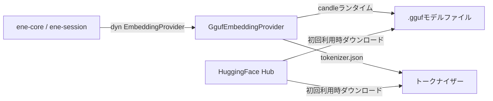

# `ene-embedding` — APIリファレンス

> **クレート:** `ene-embedding`
> **役割:** オフライン推論のためのローカルGGUFフォーマット埋め込みモデルプロバイダー。

---

## 概要

`ene-embedding` は、ローカルに読み込んだGGUFモデルファイルを使って `ene-provider` の `EmbeddingProvider` トレイトを実装し、**candle** MLフレームワークを通じて推論を実行します。モデルの重みがディスク上にある状態になれば、外部APIを一切呼び出さない完全オフラインの埋め込み生成が可能です。

一度モデルをダウンロードした後は、プライバシーを重視した環境やエアギャップ環境に推奨される埋め込みバックエンドです。



> **モデルサポートに関する注意：** ローダー（`crates/ene-embedding/src/quantized/loader.rs`）は `qwen3.*` の GGUF メタデータキーを読み取るため、そのレイアウトに一致するメタデータを持つ GGUF ファイルのみを理解できます。[`resolve_gguf_paths`](#resolve_gguf_paths) は現在、この形式で GGUF メタデータを出荷している2つのモデルファミリー — Jina v5 retrieval モデル — の取得方法のみを知っています。他のアーキテクチャ（例：Nomic、BGE）はこのクレートではサポートされていません。それらを使用する場合は `ene-provider` の `CloudEmbeddingProvider` を利用してください。

---

## 型

### `GgufEmbeddingProvider`

```rust
pub struct GgufEmbeddingProvider { /* 非公開 */ }
```

`EmbeddingProvider` を実装します。構築時にGGUFモデルと対応する `tokenizer.json` を読み込みます。推論は `tokio::task::block_in_place` を介してCPU上で同期的に実行されます。

| メソッド | シグネチャ | 説明 |
|---|---|---|
| `load` | `fn load(model_name: &str, gguf_path: &str, tokenizer_path: &str, max_length: usize, quantization: &str) -> Result<Self, EmbeddingError>` | ローカルファイルパスから直接 GGUF 埋め込みモデルを読み込む。`model_name` と `quantization` は `model_name()` が返す表示名（`"{model_name}@{quantization}"`）を構築するためだけに使用される — 実際の重みとアーキテクチャは完全に `gguf_path` から取得される。 |

このタイプを `load` で直接構築するのは、GGUF/トークナイザーファイルがすでにディスク上にある場合（例：事前にダウンロードした Qwen3 アーキテクチャのモデル）に、HF Hub の解決を完全にスキップしたいときに便利です。それ以外の場合は [`create_local_provider`](#create_local_provider) を優先してください。

**実装する `EmbeddingProvider` トレイトメソッド：**

| メソッド | 補足 |
|---|---|
| `embed(text, kind)` | kind 固有のプレフィックスを付けて埋め込む：`Query` と `Hyde` は `"Query: "` を、それ以外の `EmbeddingKind` は `"Document: "` を使用する。空／空白のみのテキスト、またはトークン化がゼロトークンを返す場合は `EmbeddingError::EmptyInput` を返す。 |
| `embed_query(text)` | `embed(text, EmbeddingKind::Query)` の短縮形。 |
| `embed_batch(items)` | すべてのアイテムを単一の `block_in_place` クロージャ内で逐次埋め込む（並列ではない）。最初の `EmptyInput` で早期リターンする。 |
| `dimensions()` | GGUF モデルの隠れ層サイズから取得された出力ベクトルサイズを返す。 |
| `model_name()` | `"{model_name}@{quantization}"` を返す（例：`jina-embeddings-v5-text-small@F16`）。 |

---

## 関数

### `resolve_gguf_paths`

```rust
pub fn resolve_gguf_paths(
    model_name: &str,
    quantization: &str,
    model_dir: PathBuf,
) -> Result<(PathBuf, PathBuf), EmbeddingError>
```

**HuggingFace Hub からモデルをダウンロードします**（`hf_hub::HFClient` を介し、`model_dir` 配下にキャッシュされる） — 名前パターンに基づいて `model_dir` を既存ファイルスキャンすることは**ありません**。ファイルが既にキャッシュされている場合、HF Hub クライアントはそれを再利用します。そうでない場合、この呼び出しでネットワーク越しに取得します。

サポートされる `model_name` の値（`jinaai` 組織下の特定の HF リポジトリにマッピングされます）：

| `model_name` | HF リポジトリ |
|---|---|
| `"jina-embeddings-v5-text-nano"` | `jinaai/jina-embeddings-v5-text-nano-retrieval` |
| `"jina-embeddings-v5-text-small"` | `jinaai/jina-embeddings-v5-text-small-retrieval` |

それ以外の `model_name` は、サポートされているモデルを列挙したメッセージ付きの `EneEmbeddingError::CandleError` を返します。

`"jina-embeddings-v5-text-small"` の場合、`quantization` は固定された GGUF ファイル名の集合から1つを選択します（`F16`、`Q8_0`、`Q4_K_M`、`Q4_K_S`、`Q5_K_M`、`Q2_K`、`IQ4_XS`。未知の値は警告付きで `F16` にフォールバックする）。`"jina-embeddings-v5-text-nano"` の場合、ファイル名は既知リストに対する検証なしで直接 `"v5-nano-retrieval-{quantization}.gguf"` として構築されます。トークナイザーファイルは常に同じリポジトリの `tokenizer.json` です。

**返り値:** 成功時は `(gguf_path, tokenizer_path)` — いずれも `model_dir` 配下の HF Hub キャッシュを指します。

### `create_local_provider`

```rust
pub fn create_local_provider(
    model: &str,
    quantization: &str,
    model_dir: PathBuf,
) -> Result<Box<dyn ene_provider::EmbeddingProvider>, EneEmbeddingError>
```

主要なエントリーポイントです。[`resolve_gguf_paths`](#resolve_gguf_paths) を介してモデルファイルを解決し（必要ならダウンロードし）、[`GgufEmbeddingProvider::load`](#ggufembeddingprovider) で読み込み、ボックス化された `EmbeddingProvider` を返します。`model_dir` は値消費されます。

**固定パラメータ：**
- `max_length = 8192` — 最大トークンシーケンス長。

**ランタイム要件:** `resolve_gguf_paths`（`block_in_place` + `block_on` を介した非同期の HF Hub ダウンロードを行う）と、返されるプロバイダーのフォワードパス（`block_in_place` を介した candle 推論）はいずれも **マルチスレッド tokio ランタイム** を必要とします。いずれも `current_thread` ランタイム上、またはランタイム外ではパニックします。

```rust,no_run
// 正しい
let rt = tokio::runtime::Builder::new_multi_thread()
    .enable_all()
    .build()?;
// 誤り — resolve_gguf_paths / embed_query 内でパニックする:
let rt = tokio::runtime::Builder::new_current_thread()
    .enable_all()
    .build()?;
# Ok::<(), Box<dyn std::error::Error>>(())
```

`fn main()` 上の `#[tokio::main]` マクロはデフォルトでマルチスレッドフレーバーを使用するため、プレーンな `#[tokio::main] async fn main()` が最もシンプルな正しいセットアップです。

---

## エラー

### `EneEmbeddingError`

```rust
pub enum EneEmbeddingError {
    /// Candle ML 推論エンジンからのエラー（モデル読み込み、フォワードパス、トークナイザー、または HF Hub ダウンロードの失敗）。
    CandleError(String),
    /// 既存の型付き埋め込みエラーを、変更せずに伝播する。
    Provider(ene_provider::EmbeddingError),
}

/// 内部モジュール用の型エイリアス。
pub type EmbeddingError = EneEmbeddingError;
```

| バリアント | 発生する場面 |
|---|---|
| `CandleError(String)` | モデル／トークナイザーの読み込み失敗、テンソル／逆量子化の失敗、GGUF メタデータキーの欠落、または HF Hub ダウンロードエラー（ネットワーク障害、未知のモデル名、サポートされていない量子化ファイル）。 |
| `Provider(ene_provider::EmbeddingError)` | すでに `ene_provider::EmbeddingError` として型付けされたエラー（例：`EmptyInput`）は、文字列として再ラップされずそのまま伝播される。 |

`EneEmbeddingError` は `From` を介して `ene_provider::EmbeddingError` に変換されます：

```rust
impl From<EneEmbeddingError> for ene_provider::EmbeddingError {
    fn from(e: EneEmbeddingError) -> Self {
        match e {
            EneEmbeddingError::CandleError(msg) => ene_provider::EmbeddingError::Init(msg),
            EneEmbeddingError::Provider(inner) => inner,
        }
    }
}
```

つまり、非構造化の Candle 側の失敗は `EmbeddingError::Init` になりますが、（`EmptyInput` のような）構造化されたエラーは変更されずにラウンドトリップを生き延びます。`EmbeddingError` バリアントの完全な一覧については [`ene-provider`](./ene-provider.md#embeddingerror) を参照してください。

---

## 設定との連携

ローカルバックエンドは `ene-provider` の `EmbeddingConfig`（[`ene-provider`](./ene-provider.md) と [`ene-config`](./ene-config.md) を参照）を通じて選択・パラメータ化されます。`ene-core` はこの設定を読み取り、`ene_config::models_dir()`（`assets/models`）を `model_dir` として `create_local_provider` を呼び出します：

```json
{
  "provider": {
    "embedding": {
      "backend": "local",
      "local": {
        "model": "jina-embeddings-v5-text-small",
        "quantization": "F16"
      }
    }
  }
}
```

環境変数でも設定できます：

```sh
ENE_PROVIDER__EMBEDDING__BACKEND=local
ENE_PROVIDER__EMBEDDING__LOCAL__MODEL=jina-embeddings-v5-text-small
ENE_PROVIDER__EMBEDDING__LOCAL__QUANTIZATION=F16
```

`"local"` は設定のデフォルトではありません — デフォルトの `backend` は `"cloud"` です（[`ene-provider`](./ene-provider.md) を参照）。

---

## パフォーマンスに関する注意

- **初回呼び出し:** GGUF ファイルとトークナイザーは HF Hub キャッシュからダウンロードされます（あるいは本当の初回実行時にはネットワーク越しに取得されます）。その後、最初の推論呼び出し時にメモリに読み込まれます。以降の呼び出しはロード済みの重みを再利用します。
- **スループット:** インタラクティブな用途には適していますが、バッチ埋め込みは単一の `block_in_place` 呼び出し内で厳密に逐次実行されます（バッチ内の並列性はありません）。高スループットのバッチワークロードには最適化されていません。
- **メモリ使用量:** モデルサイズと量子化によって異なります。より小さい量子化（`Q4_K_M`、`Q2_K`）は精度を犠牲にして `F16` よりはるかに小さいメモリフットプリントを実現します。

---

## 使用例

### `create_local_provider` でデフォルトのローカルプロバイダーを読み込む

```rust,no_run
use ene_embedding::create_local_provider;
use ene_provider::EmbeddingProvider;
use std::path::PathBuf;

#[tokio::main] // デフォルトでマルチスレッド — 上記のランタイム要件により必須
async fn main() -> Result<(), Box<dyn std::error::Error>> {
    let provider = create_local_provider(
        "jina-embeddings-v5-text-small",
        "F16",
        PathBuf::from("./models"),
    )?;

    println!("次元数: {}", provider.dimensions());
    println!("モデル: {}", provider.model_name());

    let embedding = provider.embed_query("What is the capital of France?").await?;
    println!("埋め込みの長さ: {}", embedding.len());
    Ok(())
}
```

### パスを解決して `GgufEmbeddingProvider` を直接読み込む

```rust,no_run
use ene_embedding::{GgufEmbeddingProvider, resolve_gguf_paths};
use ene_provider::{EmbeddingProvider, cosine_similarity};
use std::path::PathBuf;

#[tokio::main]
async fn main() -> Result<(), Box<dyn std::error::Error>> {
    let model_name = "jina-embeddings-v5-text-small";
    let quantization = "F16";
    let model_dir = PathBuf::from("./models");

    let (gguf_path, tokenizer_path) = resolve_gguf_paths(model_name, quantization, model_dir)?;

    let provider = GgufEmbeddingProvider::load(
        model_name,
        gguf_path.to_str().unwrap_or(""),
        tokenizer_path.to_str().unwrap_or(""),
        /* max_length */ 8192,
        quantization,
    )?;

    let a = provider.embed_query("The cat sat on the mat.").await?;
    let b = provider.embed_query("A feline rested on a rug.").await?;
    println!("類似度: {}", cosine_similarity(&a, &b));
    Ok(())
}
```

---

## 関連項目

- [`ene-provider`](./ene-provider.md) — `EmbeddingProvider` トレイト、`EmbeddingError`、`EmbeddingConfig`
- [`ene-memory`](./ene-memory.md) — ベクトル検索に埋め込みを使用する
- [`ene-config`](./ene-config.md) — `models_dir()` と設定の読み込み
