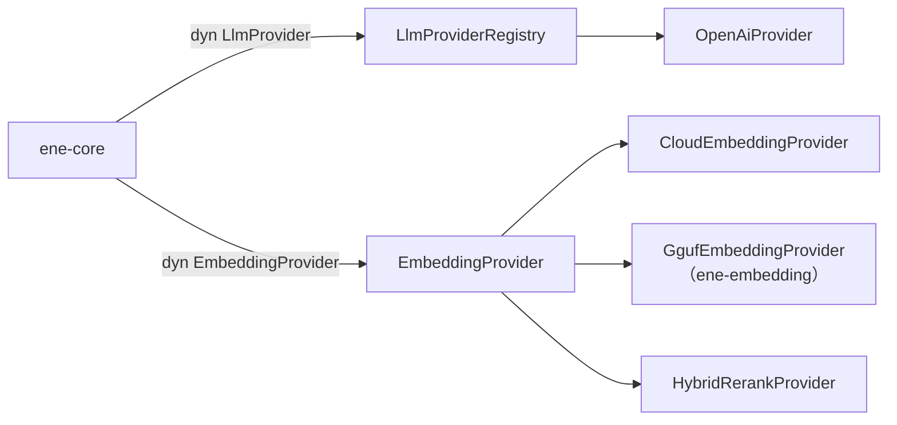

# `ene-provider` — APIリファレンス

> **クレート:** `ene-provider`  
> **役割:** LLMおよび埋め込みプロバイダーのトレイト定義と組み込み実装。

---

## 概要

`ene-provider` は、Eneランタイムを特定のAIサービスベンダーから切り離すプロバイダー抽象化レイヤーを定義します。すべてのLLM呼び出しと埋め込み操作は、2つのコアトレイト `LlmProvider` と `EmbeddingProvider` を通じて行われます。

プロバイダーはスタートアップ時に `LlmProviderRegistry` に登録され、アプリケーションコードを変更することなく設定だけで切り替えられます。



---

## `LlmProvider` トレイト

言語モデルバックエンドのコアインターフェースです。

```rust
pub trait LlmProvider: Send + Sync {
    /// 人が読めるプロバイダー名（例：`"openai"`）。
    fn name(&self) -> &str;

    /// ストリーミングチャット補完を開始する。
    ///
    /// モデルがテキストを生成するにつれて `LlmResponseChunk` の断片を yield する
    /// `Stream` を返す。
    fn create_chat_stream(
        &self,
        messages: &[LlmMessage],
        tools: &[ToolSpec],
    ) -> Result<Pin<Box<dyn Stream<Item = Result<LlmResponseChunk, String>> + Send>>, String>;

    /// ブロッキング（非ストリーミング）チャット補完を実行する。
    ///
    /// `json_schema` を指定するとスキーマに準拠した構造化JSON出力を要求できる。
    fn chat_completion(
        &self,
        messages: &[LlmMessage],
        json_schema: Option<serde_json::Value>,
    ) -> Result<String, String>;
}
```

### 補足

- `create_chat_stream` はユーザーがストリーム出力を閲覧するインタラクティブなターンで使用します。
- `chat_completion` はセッションのサマリー生成など、構造化出力が必要な内部タスクで使用します。

---

## `EmbeddingProvider` トレイト

テキスト埋め込みおよびセマンティックユーティリティ操作のインターフェースです。

```rust
pub trait EmbeddingProvider: Send + Sync {
    /// 用途ヒントを指定してテキストを埋め込む。
    async fn embed(&self, text: &str, kind: EmbeddingKind) -> Result<Vec<f32>, EmbeddingError>;

    /// クエリ文字列を埋め込む便利ラッパー（`EmbeddingKind::Query`）。
    async fn embed_query(&self, text: &str) -> Result<Vec<f32>, EmbeddingError>;

    /// 複数のテキストをまとめて埋め込む。
    async fn embed_batch(
        &self,
        items: &[(&str, EmbeddingKind)],
    ) -> Result<Vec<Vec<f32>>, EmbeddingError>;

    /// HyDE: クエリに対する仮想的な回答ドキュメントを生成して埋め込む。
    /// 仮想ドキュメントの埋め込みベクトルを返す。
    async fn hyde(&self, query: &str) -> Result<String, EmbeddingError>;

    /// `candidates`（ツール仕様）を `query` に対してスコアリングする。
    /// 入力と同じ順序でスコアを返す。
    async fn rerank(
        &self,
        query: &str,
        candidates: &[ToolSpec],
    ) -> Result<Vec<f32>, EmbeddingError>;

    /// 出力ベクトルの次元数。
    fn dimensions(&self) -> usize;

    /// モデル識別子文字列。
    fn model_name(&self) -> &str;
}
```

### `EmbeddingKind`

テキストの用途をプロバイダーに伝えるヒントです。一部のプロバイダー（`e5-mistral` など）は種類ごとに異なるプレフィックスを使用します。

```rust
pub enum EmbeddingKind {
    /// セッションまたは会話のサマリー。
    Summary,

    /// ツールやエンティティの説明テキスト。
    Description,

    /// ツールのケイパビリティテキスト。
    Capability,

    /// インタラクションの例。
    Example,

    /// ネガティブな例（コントラスティブインデックス用）。
    Negative,

    /// ユーザーの検索クエリ。
    Query,

    /// 仮想ドキュメント埋め込み（HyDE）。
    Hyde,
}
```

---

## メッセージ型

### `LlmMessage`

任意のLLMプロバイダーに送信する統一メッセージ形式です。

```rust
pub enum LlmMessage {
    /// モデルへの指示。通常はキャラクターカード＋注入済みコンテキスト。
    System { content: String },

    /// ユーザーメッセージ。テキストとインライン画像を含められる。
    User { parts: Vec<UserMessagePart> },

    /// 過去のアシスタント応答。ツール呼び出し記録を含む場合もある。
    Assistant {
        content: Option<String>,
        tool_calls: Option<Vec<LlmToolCall>>,
    },

    /// `tool_call_id` でキー付けされたツール呼び出しの結果。
    Tool { tool_call_id: String, content: String },
}
```

### `UserMessagePart`

```rust
pub enum UserMessagePart {
    /// プレーンテキストの断片。
    Text { text: String },

    /// Base64エンコードされた画像データ（マルチモーダルモデル用）。
    Image { base64_image_data: String },
}
```

### `LlmResponseChunk`

LLMからのストリーミング断片1つ分です。

```rust
pub struct LlmResponseChunk {
    /// テキスト断片（このチャンクにテキストが含まれる場合）。
    pub text_delta: Option<String>,

    /// ツール呼び出し断片（このチャンクにツール呼び出しデータが含まれる場合）。
    pub tool_calls_delta: Option<Vec<LlmToolCallChunk>>,
}
```

### `LlmToolCall`

完全に組み立て済みのツール呼び出し（履歴や非ストリーミング応答から）。

```rust
pub struct LlmToolCall {
    /// `Tool` メッセージとの対応付けに使うLLM割り当てID。
    pub id: String,

    /// 呼び出すツールの名前。
    pub name: String,

    /// ツール引数のJSON文字列。
    pub arguments: String,
}
```

### `LlmToolCallChunk`

ツール呼び出しのストリーミング断片。同じ `index` を持つ複数のチャンクを連結することで完全な `LlmToolCall` が得られます。

```rust
pub struct LlmToolCallChunk {
    /// この断片が属するツール呼び出しを識別するインデックス。
    pub index: usize,

    /// ID断片（各インデックスの最初のチャンクに存在）。
    pub id: Option<String>,

    /// 名前断片（各インデックスの最初のチャンクに存在）。
    pub name: Option<String>,

    /// 引数断片（複数のチャンクに分割されることがある）。
    pub arguments: Option<String>,
}
```

### `Role`

```rust
pub enum Role {
    User,
    Assistant,
    System,
}
```

---

## エラー型

### `EmbeddingError`

```rust
pub enum EmbeddingError {
    /// 埋め込みモデルの初期化に失敗した（例：GGUF 読み込みエラー）。
    /// トランスポート/API エラー用の `Provider` とは区別される。
    Init(String),
    /// プロバイダーが不正なレスポンスまたは空のレスポンスを返したか、
    /// トランスポートエラー（HTTP 4xx/5xx、ネットワーク障害）で
    /// リクエストが失敗した。
    Provider(String),
    /// 入力テキストが空または空白のみ。すべての実装が
    /// ゼロベクトル（コサイン類似度が未定義で、ストアを
    /// 静かに汚染する）を返すか、入力を表さない
    /// プレースホルダーにフォールバックするため、
    /// 埋め込みの生成を拒否する。
    EmptyInput,
}
```

---

## `LlmProviderRegistry`

プロバイダー名からファクトリ関数へのマッピングを管理するグローバルシングルトンです。

```rust
// 名前付きプロバイダーのファクトリを登録する。
pub fn register(factory: impl LlmProviderFactory + 'static);

// 名前とプロバイダー固有の設定を渡してプロバイダーを生成する。
pub fn create_provider(name: &str, config: &serde_json::Value) -> Result<Box<dyn LlmProvider>, String>;
```

---

## 組み込み実装

### `OpenAiProvider`

SSEによるストリーミングと構造化JSON出力をサポートする、OpenAI互換HTTP APIクライアントです。

```rust
pub struct OpenAiProvider { /* 非公開 */ }
```

`settings.json` の `[llm]` セクションで設定します。OpenAI、Azure、ローカルプロキシなど、OpenAI互換エンドポイントであればどれでも使用できます。

### `OpenAiProviderFactory`

`LlmProviderRegistry` に `"openai"` キーで登録されるファクトリ型です。

### `CloudEmbeddingProvider`

クラウドAPI（OpenAI Embeddingsなど）に委譲する `EmbeddingProvider` 実装です。高スループットが求められる本番環境に適しています。

```rust
pub struct CloudEmbeddingProvider { /* 非公開 */ }
```

### `HybridRerankProvider`

別の `EmbeddingProvider` をラップし、クロスエンコーダースタイルのスコアリングによる再ランキングステップを追加します。ツールRAGインデックスでツール選択精度を向上させるために使用します。

```rust
pub struct HybridRerankProvider { /* 非公開 */ }
```

---

## 使用例

### チャットターンのストリーミング

```rust
use ene_provider::{LlmMessage, LlmResponseChunk};
use futures::StreamExt;

let messages = vec![
    LlmMessage::System { content: "あなたは親切なアシスタントです。".into() },
    LlmMessage::User {
        parts: vec![ene_provider::UserMessagePart::Text {
            text: "フランスの首都はどこですか？".into(),
        }],
    },
];

let mut stream = provider.create_chat_stream(&messages, &[])?;

while let Some(chunk) = stream.next().await {
    let chunk = chunk.map_err(|e| anyhow::anyhow!(e))?;
    if let Some(delta) = chunk.text_delta {
        print!("{}", delta);
    }
}
println!();
```

### クエリの埋め込み

```rust
use ene_provider::{EmbeddingProvider, EmbeddingKind};

let query_vec = provider.embed_query("Rustに関する最近の会話")?;
// query_vec はコサイン類似度検索に使える Vec<f32>
```

### 構造化補完

```rust
use serde_json::json;

let schema = json!({
    "type": "object",
    "properties": {
        "summary": { "type": "string" },
        "key_facts": { "type": "array", "items": { "type": "string" } }
    },
    "required": ["summary", "key_facts"]
});

let json_str = provider.chat_completion(&messages, Some(schema))?;
let result: serde_json::Value = serde_json::from_str(&json_str)?;
```

---

## 関連項目

- [`ene-core`](./ene-core.md) — プロバイダーを駆動するランタイム
- [`ene-embedding`](./ene-embedding.md) — ローカルGGUF埋め込みプロバイダー
- [`ene-memory`](./ene-memory.md) — ベクトル検索のために埋め込みを消費する
