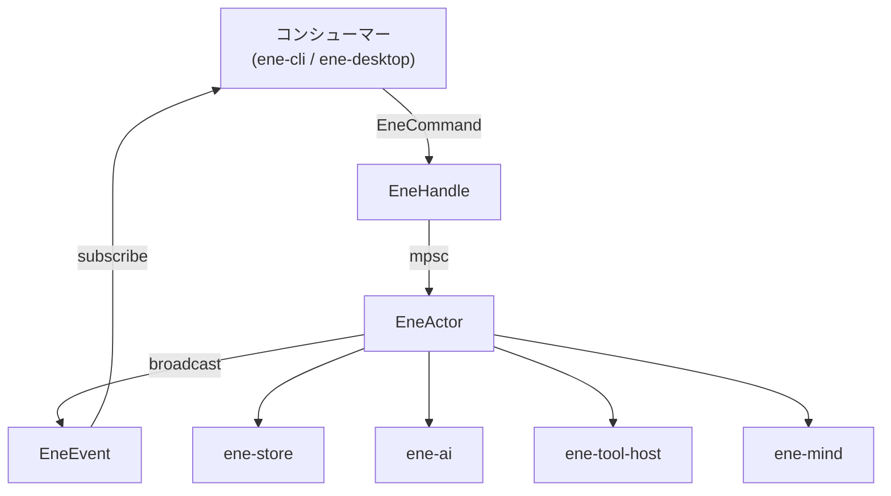
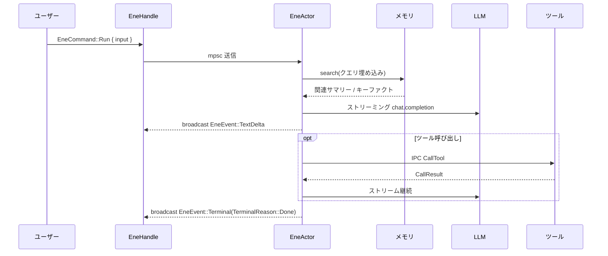

# `ene-runtime` — APIリファレンス

> **クレート:** `ene-runtime`
> **役割:** アクターベースのメッセージパッシングアーキテクチャを通じて、LLMストリーミング、ツール統合、長期記憶、セッション管理を統合するランタイムファサード。すべてのホストアプリケーション（`ene-cli`、`ene-desktop`）のメインエントリポイント。

---

## 概要

`ene-runtime` はすべてのコンシューマーアプリケーションのプライマリインターフェースです。内部のアクターループをスレッドセーフな [`EneHandle`](#enehandle) でラップし、会話の実行・設定管理・メモリの照会・ツール呼び出しを行う非同期APIを提供します。

内部アクター（非公開の `EneActor`）は専用のTokioタスク上で動作します。コマンドは無制限の `mpsc` チャネル経由で送信され、イベントは `tokio::sync::broadcast` チャネルで全サブスクライバーに配信されます。アクターはツールレジストリ、メモリストア、埋め込みプロバイダー、会話セッションを所有し、各ターンを mind ストリーミングパイプラインへディスパッチします（[ストリーミングディスパッチ](#ストリーミングディスパッチ)を参照）。



---

## データフロー（1ターン）



`EneCommand::Run` ごとに、正常終了・エラー・キャンセルのいずれであっても [`EneEvent::Terminal`](#eneevent) が**必ず1回だけ**発行されます。アクターとストリームタスクで共有される内部の `AtomicBool` ガード（`terminal_emitted`）により、キャンセルとストリーム自身の完了が競合してもこの保証が成立します。

---

## `EneHandle`

`EneHandle` は主要な公開インターフェースです。**スレッドセーフ**で**安価に Clone 可能**です。最後の Clone を Drop すると暗黙の `Shutdown` が送られ、アクターが終了します。

```rust
pub struct EneHandle { /* opaque */ }

impl Clone for EneHandle { /* ... */ }
```

### コンストラクタ — async（返却前に ready）

| メソッド | シグネチャ | 説明 |
|---|---|---|
| `open` | `async fn open(config: EneConfig, card: CharacterCardV3) -> Result<Self, EneRuntimeError>` | プロバイダ・embedder（memory/tool-RAG が必要な場合）・store・tools・mind セッション＋カード・CCv3 ウォームアップを **`Ok` 返却前に**完了。設定/カードのファイル I/O は `ene-config` / ホスト側。 |

ヘルパー: `open_from_disk()`、`open_with_config(config)`、`open_ready(config, card)`。

### 会話 & ライフサイクル — sync

| メソッド | シグネチャ | 説明 |
|---|---|---|
| `subscribe` | `fn subscribe(&self) -> EneEventReceiver` | チャットイベント用ブロードキャストレシーバー。 |
| `run` | `fn run(&self, input: impl Into<String>) -> Result<TurnId, RunError>` | ターン開始。進行中なら `RunError::Busy` — 進行中ターンを黙って中断しない。 |
| `cancel` | `fn cancel(&self, turn: &TurnId) -> Result<(), CancelError>` | 一致するターンのみキャンセル（不一致は `TurnMismatch`）。 |
| `decide_permission` / `submit_user_input` | … | ゲート解決。 |
| `diagnostics` | `fn diagnostics(&self) -> &EneDiagnostics` | 具象 diagnostics ファサード。 |

### ライフサイクル — async

| メソッド | シグネチャ | 説明 |
|---|---|---|
| `shutdown` | `async fn shutdown(&self, timeout: Duration) -> Result<(), ShutdownTimeout>` | アクターの drain を待機。 |

スナップショット / tools / memory / journal / manual split は [`EneDiagnostics`](#enediagnostics)（`handle.diagnostics()`）へ。

---

## `EneDiagnostics`

`handle.diagnostics()` が返す具象ファサード:

| メソッド | 用途 |
|---|---|
| `memory()` | [`MemoryQueryHandle`](#memoryqueryhandle) |
| `subscribe()` | 診断ストリーム（`PipelinePhase` / `PipelineMetrics`） |
| `get_snapshot` / `list_tools` / `call_tool` / `manual_split` | 検査・ツール |
| `set_character` | カード差し替え（CLI `/card`） |

---

## `EneEvent`（チャットバス）

最小チャットイベント。ターン対象バリアントはすべて `turn: TurnId` を持つ。

```rust
pub enum EneEvent {
    TextDelta { turn: TurnId, delta: String },
    Performance { turn: TurnId, cues: Vec<PerformanceCue>, source: CueSource },
    ToolCallStart { turn: TurnId, name: String, arguments: String },
    ToolCallResult { turn: TurnId, name: String, result: String },
    PermissionRequired { turn: TurnId, request_id: RequestId, action: String, target: String, description: String },
    UserInputRequired { turn: TurnId, request_id: RequestId, prompt: UserInputPrompt },
    ContextCompressed { turn: TurnId, level: String },
    Terminal { turn: TurnId, reason: TerminalReason },
    StatusChanged { status: EneStatus },
}
```

チャットから削除（diagnostics へ）: `SpecialToken`、単独 `Expression`、`SessionSplit`、`PipelinePhase`、`PipelineMetrics`、`TaskProgress`。

`PerformanceCue` / `CueSource` は `ene-mind` 所有（runtime が再エクスポート）。明示的 `perform` なしに `CueSource::Host` は追加しない。

---
## `TerminalReason`

`EneEvent::Terminal` が保持します。`EneCommand::Run` ごとに必ず1つだけ発行されます。

```rust
pub enum TerminalReason {
    /// LLMストリームが正常に完了した（ツール呼び出しなし、プロバイダーが完了）。
    Done,
    /// エラーによりランが終了した。
    Failed { message: String },
    /// `EneCommand::Cancel` によりユーザーがランをキャンセルした。
    Cancelled,
}
```

`TerminalReason` は `PartialEq, Eq` を導出しているため、コンシューマーは直接マッチできます（例: `matches!(reason, TerminalReason::Done)`）。

---

## `EneStatus`

```rust
pub enum EneStatus {
    /// 現在何も処理していない。
    Idle,
    /// AIストリームが実行中。
    Running,
    /// エラー状態（致命的ではない）。
    Error,
}
```

`Debug, Clone, Copy, PartialEq, Eq`。`EneEvent::StatusChanged` でブロードキャストされ、他には反映されません — 「現在のステータス」を取得するゲッターは存在せず、コンシューマー側でイベントストリームから追跡する必要があります。

---

## `EneStateSnapshot`

`EneHandle::get_snapshot` が返す、読み取り専用の時点アクター状態です。

```rust
pub struct EneStateSnapshot {
    pub character_card: Option<CharacterCardV3>,
    pub history: Vec<HistoryEntry>,
    pub config: EneConfig,
    pub session_id: SessionId,
    pub card_name: CardName,
    pub memory: MemoryQueryHandle,
    pub current_turn_count: u32,
    pub session_started_at: DateTime<Utc>,
}
```

| フィールド | 説明 |
|---|---|
| `character_card` | 読み込まれているキャラクターカード（存在する場合）。 |
| `history` | `HistoryEntry`（ロール＋内容）のペアとしての会話履歴。 |
| `config` | 現在アクティブな `EneConfig` のクローン。 |
| `session_id` | 現在のセッションの一意な識別子。 |
| `card_name` | アクティブなキャラクターカードの名前。 |
| `memory` | [`MemoryQueryHandle`](#memoryqueryhandle) — メモリが設定されている場合のみ有効。 |
| `current_turn_count` | 現在のセッションで完了したターン数。 |
| `session_started_at` | 現在のセッションが開始されたUTCタイムスタンプ。 |

---

## `MemoryQueryHandle`

アクター外部からメモリサブシステムを照会するためのクローン可能な読み取り専用ハンドルです。`EneStateSnapshot::memory` から取得します。`Option<Arc<ene_store::MemoryStore>>` と `Option<Arc<dyn EmbeddingProvider>>` をラップしており、`is_enabled` 以外のすべてのメソッドは、対応する要素が存在しない場合に `EneRuntimeError::Memory(..)` / `EneRuntimeError::Embedding(..)` を返します。

```rust
#[derive(Clone)]
pub struct MemoryQueryHandle { /* 非公開 */ }
```

### 一般

| メソッド | シグネチャ | 説明 |
|---|---|---|
| `is_enabled` | `fn is_enabled(&self) -> bool` | メモリストアと埋め込みプロバイダーの両方が存在する場合に `true`。 |
| `embed_query` | `async fn embed_query(&self, text: &str) -> Result<Vec<f32>, EneRuntimeError>` | 設定済みの埋め込みプロバイダーを使ってテキストクエリを埋め込みます。 |

### 会話サマリー・キーファクト（レガシー）

| メソッド | シグネチャ | 説明 |
|---|---|---|
| `search_summaries` | `async fn search_summaries(&self, query_embedding: &[f32], card_name: &str, limit: usize, threshold: f32) -> Result<Vec<RecalledSummary>, EneRuntimeError>` | 会話サマリーへのベクトル類似度検索。 |
| `list_recent_summaries` | `async fn list_recent_summaries(&self, card_name: &str, limit: usize) -> Result<Vec<ConversationSummary>, EneRuntimeError>` | キャラクターカードの最近のサマリーを新しい順で返す。 |
| `get_all_keyfacts` | `async fn get_all_keyfacts(&self, card_name: &str) -> Result<Vec<KeyFact>, EneRuntimeError>` | キャラクターカードに保存されている全レガシーキーファクト。 |

### レガシー → 型付きメモリ移行

| メソッド | シグネチャ | 説明 |
|---|---|---|
| `count_legacy_rows` | `async fn count_legacy_rows(&self, card_name: &str) -> Result<LegacyRowCounts, EneRuntimeError>` | カードのレガシー `conversation_summaries`/`conversation_keyfacts` 行数を数える。 |
| `migration_status` | `async fn migration_status(&self, card_name: &str) -> Result<Option<MigrationStatus>, EneRuntimeError>` | 移行が実行済みの場合、現在のレガシー→型付き移行ステータス。 |
| `migrate_legacy` | `async fn migrate_legacy(&self, card_name: &str, user_id: &str, dry_run: bool) -> Result<LegacyMigrationReport, EneRuntimeError>` | ワンショットのレガシー→型付きメモリ移行を実行する。`dry_run` は書き込みなしでプレビューする。 |
| `reset_legacy_memory` | `async fn reset_legacy_memory(&self, card_name: &str) -> Result<(), EneRuntimeError>` | **破壊的操作。** キャラクターカードのレガシーメモリ行をすべてクリアする。 |

### 型付きメモリ（`ene-mind` / `ene-store`）

| メソッド | シグネチャ | 説明 |
|---|---|---|
| `list_typed_memories` | `async fn list_typed_memories(&self, character_id: &str, kind: Option<MemoryKind>, limit: usize) -> Result<Vec<MemoryItem>, EneRuntimeError>` | キャラクターの型付きメモリを一覧表示する（`MemoryKind` で任意にフィルタ可能）。 |
| `inspect_typed_memory` | `async fn inspect_typed_memory(&self, id: i64) -> Result<Option<MemoryItem>, EneRuntimeError>` | 行IDで単一の型付きメモリを取得する。 |
| `search_typed_memories_hybrid` | `async fn search_typed_memories_hybrid(&self, character_id: &str, user_id: Option<&str>, query_text: &str, limit: usize) -> Result<Vec<ScoredMemory>, EneRuntimeError>` | `query_text` を埋め込み、CLIのデフォルトの重み/しきい値で `ene-store` のハイブリッド（ベクトル＋新近性＋顕著性＋確信度）検索を実行する。 |
| `pin_typed_memory` | `async fn pin_typed_memory(&self, id: i64, pinned: bool) -> Result<bool, EneRuntimeError>` | 型付きメモリのピン留めフラグを設定/解除する。 |
| `transition_typed_memory_status` | `async fn transition_typed_memory_status(&self, id: i64, status: MemoryStatus) -> Result<bool, EneRuntimeError>` | 型付きメモリのライフサイクルステータスを手動で遷移させる（例: `Archived` へ）。 |

### 感情状態

| メソッド | シグネチャ | 説明 |
|---|---|---|
| `show_affect_state` | `async fn show_affect_state(&self, character_id: &str) -> Result<AffectState, EneRuntimeError>` | キャラクターの現在のPAD感情状態を返す。 |
| `reset_affect_state` | `async fn reset_affect_state(&self, character_id: &str) -> Result<(), EneRuntimeError>` | 感情状態を `AffectState::neutral(character_id)` にリセットする。 |

### コミットメント

| メソッド | シグネチャ | 説明 |
|---|---|---|
| `list_active_commitments` | `async fn list_active_commitments(&self, character_id: &str, user_id: Option<&str>, limit: usize) -> Result<Vec<Commitment>, EneRuntimeError>` | キャラクター/ユーザーのアクティブなコミットメント（約束/タスク）を一覧表示する。 |
| `complete_commitment` | `async fn complete_commitment(&self, id: i64) -> Result<bool, EneRuntimeError>` | コミットメントを完了としてマークする。 |

---

## `PermissionDecision` / `UserInputResponse` / `MultiAnswer`

`streaming` モジュールで定義され、クレートルートで再エクスポートされます。

```rust
pub enum PermissionDecision {
    AllowOnce,
    AllowSession,
    Deny,
}

pub enum UserInputResponse {
    /// プロンプトの順序で、サブ質問ごとに1つの回答。
    Multi(Vec<MultiAnswer>),
    /// ユーザーがプロンプト全体をキャンセルした。
    Cancel,
}
```

`MultiAnswer`（`ene_tool_proto` から `#[doc(no_inline)]` で再エクスポート）は `Selected { option: String }`、`Answer { text: String }`、`Skip` のいずれかで、`UserInputPrompt` 内の単一サブ質問へのユーザー応答を表します。

---

## `message_builder`

互換性およびデバッグ用の LLM メッセージリストを組み立てます。`MessageBuildContext` と `build_messages` はクレートルートで再エクスポートされます（`ene_runtime::{MessageBuildContext, build_messages}`）。以下の個々のプロンプトセクションビルダーはモジュールスコープです（`ene_runtime::message_builder::build_system_prompt` など）。CLI のデバッグコマンドと mind パスの出力コントラクト選択で使用されます。

### `MessageBuildContext<'a>`

```rust
pub struct MessageBuildContext<'a> {
    pub card: &'a CharacterCardV3,
    pub user_input: &'a str,
    pub history: &'a [HistoryEntry],
    pub runtime_context: Option<&'a str>,
    pub runtime_rules: &'a str,
    pub user_name: &'a str,
    pub recalled_summaries: &'a [RecalledSummary],
    pub key_facts: &'a [KeyFact],
    pub prompts: &'a PromptLibrary,
}
```

### `build_messages`

```rust
pub fn build_messages(ctx: &MessageBuildContext<'_>) -> Result<Vec<LlmMessage>, EneRuntimeError>
```

以下の順序で完全なメッセージリストを組み立てます:

1. `System` — マスコット対応のシステムプロンプト（振る舞いルール＋キャラクターアイデンティティ＋シーン）、`build_system_prompt` 経由。
2. `System` — 例文メッセージ（`mes_example`）、初回ターンのみ。
3. `System` — 過去の会話サマリー（メモリリコール）。
4. `System` — ユーザーに関する既知のキーファクト。
5. 履歴 — `User`/`Assistant`/`System` ターンの交互配置。
6. `System` — 表情PHI（`<\|emo:name\|>` プロトコル＋post-history instructions）、`build_expression_phi` 経由。
7. `User` — 現在のユーザー入力（任意の `[Runtime Context]` ブロックを追加）。

### モジュールスコープのプロンプトビルダー

| 関数 | シグネチャ | 説明 |
|---|---|---|
| `build_system_prompt` | `fn build_system_prompt(card: &CharacterCardV3, runtime_rules: &str, user_name: &str, prompts: &PromptLibrary) -> String` | マスコットコンテキストフレーム＋振る舞いルール＋キャラクターアイデンティティ（システムプロンプト、性格、背景）＋シーンを組み立てる。`{{char}}`/`{{user}}` のCBSマクロを展開する。 |
| `build_expression_phi` | `fn build_expression_phi(card: &CharacterCardV3, prompts: &PromptLibrary) -> Option<String>` | カードの解決済み表情から `<\|emo:NAME\|>` 感情トークンプロトコルブロックを組み立て、手動の `post_history_instructions` があれば結合する。両方が空の場合のみ `None` を返す。 |
| `build_natural_dialogue_contract` | `fn build_natural_dialogue_contract(card: &CharacterCardV3, prompts: &PromptLibrary, user_name: &str) -> Option<String>` | エンジン管理表情（#91）向けの出力コントラクトを組み立てる: LLMにインラインの感情トークンを**含めない**プレーンな対話で応答するよう指示する。表情はターン後に認知ランタイムのOutput Arbiterが解決するため。 |
| `build_cognitive_output_contract` | `fn build_cognitive_output_contract(card: &CharacterCardV3, prompts: &PromptLibrary, emotion_enabled: bool, user_name: &str) -> Option<String>` | 認知ストリーミングパス向けのpost-history出力ブロックを選択する: `emotion_enabled` の場合は `build_natural_dialogue_contract`、それ以外は `build_expression_phi`。 |

---

## `db_server`

`#[cfg(any(unix, windows))]` — サポートされたIPCトランスポート（Unixドメインソケットまたは Windows Named Pipe）を持つプラットフォームでのみコンパイルされます。共有の `sea-orm` `memory.db` コネクションを基盤とする**ツールごと**のデータベースIPCサーバーを実装しており、ツールバイナリが生のSQLやデータベースファイルを直接見ることはありません。

### `DbIpcServer`

```rust
pub struct DbIpcServer { /* 非公開 */ }

impl DbIpcServer {
    pub fn new(db: DatabaseConnection, socket_path: PathBuf, tool_name: String, prefix: String, auth_token: String) -> Self;
    pub async fn run(self) -> Result<(), DbServerError>;
}
```

有効化された各ツールごとに1つの `DbIpcServer` が（`handle.rs` の `build_tool_registry` で）起動され、それぞれ `ene_config::paths::tool_socket_dir()` 配下の専用ソケット/パイプにバインドされます。`run` は接続を受け付けるループを回し、一時的なacceptエラー時にはサーバータスクを終了させずに500msバックオフします。

### `DbServerError`

```rust
pub enum DbServerError {
    Io(#[from] std::io::Error),
    Json(#[from] serde_json::Error),
    Db(#[from] sea_orm::DbErr),
    PermissionDenied(String),
    UnknownTable(String),
    UnknownColumn { table: String, column: String },
    Internal(String),
}
```

ワイヤー上で返される前に `DbErrorCode`（`PermissionDenied`、`UnknownTable`、`UnknownColumn`、`Internal`）を介して `ene_tool_db::DbResponse::Error { code, message }` にマッピングされます。

### セキュリティモデル

- **プレフィックス強制。** 各ツールは `DbRequest::DeclareSchema` でスキーマを宣言し、すべてのテーブル名はそのツールに割り当てられたプレフィックス（例: `fs_`、`utility_`）で始まる必要があります。これは宣言時と、以降のすべてのリクエストの両方でチェックされます。未宣言のテーブルや `sqlite_*`/`__tool_schemas` 内部テーブルへのリクエストは `UnknownTable`/`PermissionDenied` として拒否されます。
- **ハンドシェイク。** 新規接続の最初のメッセージは、ツールごと・起動ごとの128ビット事前共有トークンを持つ `DbRequest::Handshake { token }` である必要があります（ナノ秒タイムスタンプ＋単調カウンタをキーとする `blake3` XOFで生成され、環境変数経由でツールプロセスに渡されます）。それ以外の最初のメッセージ、または誤ったトークンは拒否され、スキーマ/データ操作が可能になる前に接続がクローズされます。
- **識別子の検証。** `validate_identifier` は、空、64文字を超える、`[A-Za-z_]` で始まらない、または `[A-Za-z0-9_]` 以外の文字を含むテーブル/カラム/インデックス名をすべて拒否します — これにより、生成された `CREATE TABLE`/`CREATE INDEX` のDDLに識別子を埋め込む際に生じうるSQLインジェクションの経路を防ぎます（識別子はSQLの値のようにパラメータ化できないため）。
- **Unixソケットの権限。** Unixでは、バインドされたソケットは直後に `0o600` に `chmod` され、所有ユーザー（つまり意図した子プロセスのみ）が接続できるようにします。Windowsでは、名前付きパイプのバインド時にカーネルが設定するハンドル単位のACLが同じ役割を果たします。
- **DDLは公開されない。** ツールは任意のSQLを発行できません。構造化された `Insert`/`Upsert`/`Select`/`Update`/`Delete`/`Count`/`LastInsertRowId` リクエストバリアントのみがディスパッチされ、それぞれツール自身が宣言したスキーマに対して検証された後、パラメータ化された `sea-query` ステートメントに変換されます。

---

## 再エクスポート

`ene-runtime` は依存関係グラフ上で下位にある各クレートのアイテムを再エクスポートしており、コンシューマーは一般的な用途では `ene_runtime::*` だけで済みます。特記のない限りすべての再エクスポートには `#[doc(no_inline)]` が付与されており、rustdocのリンクは元のクレートを指します。

[API v2](../architecture/api-v2.md) 以降、この一覧は厳選されています。`EneHandle` 自身の公開シグネチャ（`EneStateSnapshot`、`EneEvent`、`HistoryEntry` など）に現れる型、または `ene-cli`/`ene-desktop` 全体で使用頻度の高い型のみを残しています。`ene-runtime` の外では使用されていない型はルートから削除しました — 必要な場合は所有クレートから直接インポートしてください。

| ソースクレート | 再エクスポートされるアイテム |
|---|---|
| `ene_config` | `EneConfig`、`CharacterCardV3` |
| `ene_ai` | `LlmMessage`、`LlmProvider`、`ProviderConfig`、`Role` |
| `ene_store` | `StoreConfig` |
| `ene_mind` | `CardName`、`SessionId`、`HistoryEntry`、`CueSource`、`PerformanceCue` |
| `ene_tool_proto` | `ToolSpec` |

Mind 設定型は `ene-mind` が所有するため、そこから直接インポートします。
`ene-runtime` は `ene-mind` に通常依存しているため、リンカー専用の互換モジュールなしで
`define_config!` のコンストラクターが `mind` セクションを登録します。

### クレート内部の再エクスポート

これらはクレート自身の型で、定義元のモジュールからルートで再エクスポートされます（`ene-runtime` が発生元のクレートであるため `#[doc(no_inline)]` は付与されません）:

| モジュール | アイテム |
|---|---|
| `handle` | `ActorDeadError`、`EneCommand`（*モジュールローカルで、再エクスポートされない*）、`EneEvent`、`EneEventReceiver`、`EneHandle`、`EneStateSnapshot`、`EneStatus`、`ShutdownTimeout`、`TerminalReason` |
| `diagnostics` | `DiagnosticEvent`、`DiagnosticEventReceiver`、`EneDiagnostics`、`MemoryQueryHandle` |
| `error` | `EneRuntimeError` |
| `streaming` | `MultiAnswer`（*`ene_tool_proto` から再エクスポート、`#[doc(no_inline)]`*）、`PermissionDecision`、`UserInputResponse` |
| `message_builder` | `MessageBuildContext`、`build_messages` |
| `types` | `RequestId`、`TurnId`、`RunError`、`CancelError` |

`EneCommand` 自体は `handle` モジュールから `pub` ですが、クレートルートでは再エクスポートされません — コンシューマーは `EneHandle` のコマンド送信メソッドを介して間接的にのみこれに到達します。

`streaming` と `message_builder` は、「アプリが必要としているから」以外の理由で `pub`（`pub(crate)` ではなく）に保たれている2つのモジュールです。`streaming::{StreamContext, run_stream}` は `ene-runtime` 自身の統合テストから直接呼び出されており、`message_builder` のモジュールスコープのプロンプトビルダー（`build_system_prompt`、`build_expression_phi` など）は `ene-cli` の `/prompt` デバッグコマンドから直接呼び出されています。通常の用途ではアプリケーションコードは依然として `EneHandle` を優先すべきです — これら2つのモジュールは `EneHandle` ファサードの一部ではなく、非推奨サイクルを経ずに変更される可能性があります。

---

## サポート型

| 型 | 種類 | 説明 |
|---|---|---|
| `ActorDeadError` | `thiserror` struct | アクターの `mpsc` チャネルがクローズされている（アクタータスクが終了している）場合に、同期版の `EneHandle` メソッドが返す。`#[error("Actor is no longer running")]`。 |
| `ShutdownTimeout` | `thiserror` struct（`pub std::time::Duration`） | 指定したタイムアウト内にアクターのドレインが完了しなかった場合に `EneHandle::shutdown` が返す。`#[error("Actor did not shut down within {0:?}")]`。 |
| `EneEventReceiver` | ラッパー struct | `broadcast::Receiver<EneEvent>` をラップする。`try_recv(&mut self) -> Result<EneEvent, TryRecvError>`（非ブロッキング）と `async fn recv(&mut self) -> Result<EneEvent, RecvError>` を公開する。 |
| `HistoryEntry` | `Debug, Clone` struct（`ene-mind` 由来） | 1件の履歴エントリ: `{ role: Role, content: String }`。旧 `ConversationEntry` 名を置換。 |
| `EneStateSnapshot` | [上記参照](#enestatesnapshot)。 | |
| `EneStatus` | [上記参照](#enestatus)。 | |
| `PermissionDecision` | [上記参照](#permissiondecision--userinputresponse--multianswer)。 | |
| `UserInputResponse` | [上記参照](#permissiondecision--userinputresponse--multianswer)。 | |
| `MultiAnswer` | `ene_tool_proto` から再エクスポート | [上記参照](#permissiondecision--userinputresponse--multianswer)。 |
| `RequestId` | `Debug, Clone, PartialEq, Eq, Hash, Serialize, Deserialize` newtype（`String`） | `PermissionRequired`/`UserInputRequired` イベントと、後続の `decide_permission`/`submit_user_input` 呼び出しを関連付ける不透明な識別子。`RequestId::new`、`From<String>`、`From<&str>` で構築できる。 |
| `EneRuntimeError` | `thiserror` enum | このクレートのエラー型 — 下記参照。 |

### `EneRuntimeError`

```rust
pub enum EneRuntimeError {
    NoCharacterCard,
    Provider(#[from] ene_ai::LlmProviderError),
    Config(#[from] ene_config::EneConfigError),
    Memory(#[from] ene_store::EneMemoryError),
    Session(#[from] ene_mind::EneSessionError),
    Tool(#[from] ene_tool_host::EneToolHostError),
    Embedding(#[from] ene_ai::EmbeddingError),
    ChannelClosed,
    MindPrerequisite(&'static str),
    Cognition(#[from] ene_mind::CognitionError),
}
```

`NoCharacterCard` と `ChannelClosed` を除くすべてのバリアントは、下位クレートのエラー型を（`#[error(transparent)]`、`#[from]` で）ラップしています。そのため呼び出し側はどのサブシステム呼び出しからも `?` で伝播でき、必要に応じてラップされたエラーに `match`/ダウンキャストして正確な原因（例: `Provider` → 認証/レート制限/ネットワーク/コンテンツフィルター）をディスパッチできます。

---

## ストリーミングディスパッチ

`crate::streaming::run_stream` は、すべての `Run` コマンドに対してアクターが呼び出す単一のエントリポイントです。mind の前提条件を検証した後、唯一のストリーミング実装を呼び出します:

```rust
if !store_config.enabled || session.memory.memory_store.is_none() {
    return Err(EneRuntimeError::MindPrerequisite("memory store"));
}
if ctx.embedder.is_none() {
    return Err(EneRuntimeError::MindPrerequisite("embedding provider"));
}
streaming_cognitive::run_stream_cognitive(ctx).await
```

- **Mind パス**（`streaming_cognitive::run_stream_cognitive`、非公開モジュール）: プロンプト構築、リコール、感情、ターン後のメモリ書き込みを `ene-mind` の `CognitionEngine`（`before_turn` → `compose_prompt_packet` → LLMストリーム → `resolve_expression_turn` → `after_turn`）に委譲します。[`ene-mind`](./ene-mind.md) を参照してください。
- store または embedder の前提条件が欠けている場合、`run_stream` は `EneRuntimeError::MindPrerequisite` を返し、失敗した terminal イベントを発行します。レガシー・ストリーミングへのフォールバックはありません。

Mind パスは共有ツール実行機構（`select_relevant_tools`、`perform_tool_executions`、`accumulate_tool_calls`、`finalize_tool_calls`）と terminal イベント保証（`emit_terminal`）を使用します。

---

## 使用例

```rust,no_run
use ene_config::{CharacterCardV3, ConfigStore};
use ene_runtime::{EneEvent, EneHandle, PermissionDecision, TerminalReason};

#[tokio::main]
async fn main() -> anyhow::Result<()> {
    let config = ConfigStore::try_load(/* … */)?;
    let card = CharacterCardV3::default(); // またはディスクから読み込み
    let handle = EneHandle::open(config, card).await?;

    let mut rx = handle.subscribe();
    let turn = handle.run("こんにちは！何ができますか？")?;

    loop {
        match rx.recv().await? {
            EneEvent::TextDelta { turn: t, delta } if t == turn => print!("{delta}"),
            EneEvent::Performance { turn: t, cues, .. } if t == turn => {
                for cue in cues {
                    eprintln!("[performance: {}]", cue.name);
                }
            }
            EneEvent::ToolCallStart { turn: t, name, .. } if t == turn => {
                eprintln!("[ツール: {name}]");
            }
            EneEvent::PermissionRequired {
                turn: t,
                request_id,
                action,
                target,
                ..
            } if t == turn => {
                eprintln!("パーミッション要求: {action} on {target}");
                handle.decide_permission(request_id, PermissionDecision::AllowOnce)?;
            }
            EneEvent::Terminal {
                turn: t,
                reason: TerminalReason::Done,
            } if t == turn => break,
            EneEvent::Terminal {
                turn: t,
                reason: TerminalReason::Cancelled,
            } if t == turn => {
                eprintln!("キャンセルされました");
                break;
            }
            EneEvent::Terminal {
                turn: t,
                reason: TerminalReason::Failed { message },
            } if t == turn => {
                eprintln!("エラー: {message}");
                break;
            }
            _ => {}
        }
    }
    println!();

    handle.shutdown(std::time::Duration::from_secs(5)).await?;
    Ok(())
}
```

---

## 関連項目

- [`ene-mind`](./ene-mind.md) — ストリーミング認知ディスパッチパスが呼び出す認知ランタイムエンジン
- [認知ランタイムアーキテクチャ（ADR）](../architecture/cognitive-runtime.md) — 認知ディスパッチの判断根拠となる設計の全体像
- [API v2](../architecture/api-v2.md) — ホスト / イベント契約
- [`ene-ai`](./ene-ai.md) — LLMと埋め込みプロバイダーのトレイト
- [`ene-store`](./ene-store.md) — 永続メモリストア
- [`ene-tool-host`](./ene-tool-host.md) — ツールプロセスのライフサイクルとTool RAG
- [`ene-config`](./ene-config.md) — 設定の読み込みとスキーマ登録
