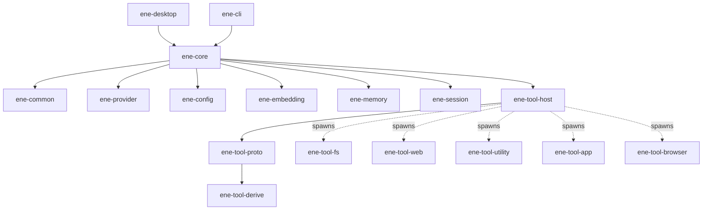

# Ene APIリファレンス

> Ene クレートライブラリの API リファレンス。

このセクションでは、Ene ワークスペース内のすべてのライブラリクレートが公開する API を解説します。
すべてのクレートは **Rust edition 2024** を対象とし、非同期ランタイムには `tokio` を使用します。

---

## クレート一覧

| クレート | 説明 | ドキュメント |
|---|---|---|
| [`ene-core`](ene-core.md) | アクターベースのランタイムファサード。ホストアプリケーションのメインエントリポイント。 | [→](ene-core.md) |
| [`ene-provider`](ene-provider.md) | LLM および埋め込みプロバイダーのトレイトと実装。 | [→](ene-provider.md) |
| [`ene-session`](ene-session.md) | 会話セッションの管理とセッション分割。 | [→](ene-session.md) |
| [`ene-memory`](ene-memory.md) | SQLite ベクターメモリストア（サマリー、ファクト、ツールインデックス）。 | [→](ene-memory.md) |
| [`ene-config`](ene-config.md) | 設定の読み込み、キャラクターカード、CBS マクロ。 | [→](ene-config.md) |
| [`ene-embedding`](ene-embedding.md) | candle を使用したローカル GGUF 埋め込みプロバイダー。 | [→](ene-embedding.md) |
| [`ene-common`](ene-common.md) | 低レベルな共有ユーティリティ（`Truncate` トレイト）。 | [→](ene-common.md) |
| [`ene-tool-host`](ene-tool-host.md) | ツールプロセスのライフサイクル管理、IPC クライアント、Tool RAG パイプライン。 | [→](ene-tool-host.md) |
| [`ene-tool-proto`](ene-tool-proto.md) | IPC ワイヤープロトコル — `ToolSpec`、`IpcRequest`/`IpcResponse`、`ToolError`。 | [→](ene-tool-proto.md) |
| [`ene-tool-common`](ene-tool-common.md) | ツールバイナリ向けの `ToolAction` トレイトとヘルパー。 | [→](ene-tool-common.md) |
| [`ene-tool-derive`](ene-tool-derive.md) | プロシージャルマクロ: `#[derive(ToolSpec)]`、`#[derive(ToolAction)]`。 | [→](ene-tool-derive.md) |
| [`ene-tool-db`](ene-tool-db.md) | ツールバイナリ向けの型付き CRUD データベースクライアント（IPC 経由）。 | [→](ene-tool-db.md) |

---

## 依存関係グラフ

以下の図はクレート間のコンパイル時依存関係を示します。破線の矢印（`-..->`）はコンパイル時の依存ではなく、実行時のプロセス生成を表します。



スタンドアロンのツールバイナリ（`ene-tool-fs`、`ene-tool-web` など）はそれぞれ以下に依存します：

```
ene-tool-common → ene-tool-proto → ene-tool-derive
                ↘
                  ene-tool-db  (永続状態が必要な場合に使用)
```

---

## 再エクスポートの規約

あるクレートが同一ワークスペース内の別クレートのアイテムを公開 API として再エクスポートする場合、`#[doc(no_inline)]` を付与する必要があります。これにより、rustdoc のリンクが元のクレートのドキュメントページを参照するようになり、内容の重複を防ぎます。

```rust
// ene-tool-common/src/lib.rs の例
#[doc(no_inline)]
pub use ene_tool_proto::{ToolSpec, ToolError, IpcRequest, IpcResponse};
```

---

## 関連ドキュメント

- [アーキテクチャ概要](../architecture/overview.md) — アクターシステム、データフロー、クレート間の関係
- [メモリシステム](../memory/overview.md) — SQLite + sqlite-vec の設計と Diesel の規約
- [ツールシステム](../tools/overview.md) — ツールの作成方法、RAG パイプライン、サンドボックス
- [設定リファレンス](../configuration/settings.md) — Figment の読み込み順序とフィールドリファレンス
