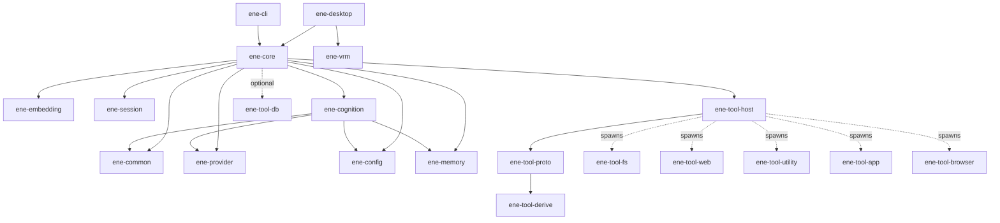

# Ene APIリファレンス

> Ene クレートライブラリの API リファレンス。

このセクションでは、Ene ワークスペース内のすべてのライブラリクレートが公開する API を解説します。
すべてのクレートは **Rust edition 2024** を対象とし、非同期ランタイムには `tokio` を使用します。

---

## クレート一覧

| クレート | 説明 | ドキュメント |
|---|---|---|
| [`ene-core`](ene-core.md) | アクターベースのランタイムファサード。ホストアプリケーションのメインエントリポイント。 | [→](ene-core.md) |
| [`ene-cognition`](ene-cognition.md) | 認知ランタイム — Identity Kernel、型付きメモリ、感情、表情調停、プロンプトパケット、コミットメント。 | [→](ene-cognition.md) |
| [`ene-provider`](ene-provider.md) | LLM および埋め込みプロバイダーのトレイトと実装。 | [→](ene-provider.md) |
| [`ene-session`](ene-session.md) | 会話セッションの管理とセッション分割。 | [→](ene-session.md) |
| [`ene-memory`](ene-memory.md) | SQLite ベクターメモリストア（サマリー、ファクト、ツールインデックス）。 | [→](ene-memory.md) |
| [`ene-config`](ene-config.md) | 設定の読み込み、キャラクターカード、CBS マクロ。 | [→](ene-config.md) |
| [`ene-embedding`](ene-embedding.md) | candle を使用したローカル GGUF 埋め込みプロバイダー。 | [→](ene-embedding.md) |
| [`ene-vrm`](ene-vrm.md) | `ene-desktop` 向けのVRM 1.0モデルローダー + MToonレンダラー（wgpu）。 | [→](ene-vrm.md) |
| [`ene-common`](ene-common.md) | 低レベルな共有ユーティリティ（`Truncate` ユニット構造体）。 | [→](ene-common.md) |
| [`ene-tool-host`](ene-tool-host.md) | ツールプロセスのライフサイクル管理、IPC クライアント、Tool RAG パイプライン。 | [→](ene-tool-host.md) |
| [`ene-tool-proto`](ene-tool-proto.md) | IPC ワイヤープロトコル — `ToolSpec`、`IpcRequest`/`IpcResponse`、`ToolError`。 | [→](ene-tool-proto.md) |
| [`ene-tool-common`](ene-tool-common.md) | ツールバイナリ向けの `ToolAction` トレイトとヘルパー。 | [→](ene-tool-common.md) |
| [`ene-tool-derive`](ene-tool-derive.md) | プロシージャルマクロ: `#[derive(ToolSpec)]`、`#[derive(ToolAction)]`。 | [→](ene-tool-derive.md) |
| [`ene-tool-db`](ene-tool-db.md) | ツールバイナリ向けの型付き CRUD データベースクライアント（IPC 経由）。 | [→](ene-tool-db.md) |

---

## 依存関係グラフ

以下の図はクレート間のコンパイル時依存関係を示します。破線の矢印（`-..->`）はコンパイル時の依存ではなく、実行時のプロセス生成を表します。



`ene-core` が `ene-tool-db` をリンクしているのは、共有のツール別DB IPCサーバーソケットを開くためだけです（[`ene-core` の `db_server` モジュール](./ene-core.md#db_server)を参照）。コア自身の永続化には使用されないため、上図では破線の「optional」エッジとしています。

スタンドアロンのツールバイナリ（`ene-tool-fs`、`ene-tool-web` など）はそれぞれ以下に依存します：

```
ene-tool-common → ene-tool-proto → ene-tool-derive
                ↘
                  ene-tool-db  (永続状態が必要な場合に使用)
```

---

## 再エクスポートの規約

あるクレートが同一ワークスペース内の別クレートのアイテムを公開 API として再エクスポートする場合、`#[doc(no_inline)]` を付与する必要があります。これにより、rustdoc のリンクが元のクレートのドキュメントページを参照するようになり、内容の重複を防ぎます。

```rust
// ene-tool-common/src/lib.rs の例
#[doc(no_inline)]
pub use ene_tool_proto::{ToolSpec, ToolError, IpcRequest, IpcResponse};
```

---

## エラーと非同期の規約

これは新しい公開APIが従うべき契約です（[APIリファクタリング計画](../architecture/api-refactor-plan.md) の項目3を参照）。既存コードはすでにほぼ準拠しています。以下のチェックリストは、**新しい** APIが後退しないようにするためのものです。

### 非同期（Async）

- I/Oバウンド、またはアクターと通信する境界はすべて `tokio` ランタイム上の `async fn` です。ライブラリコード内でランタイム上でブロックする同期ラッパー（`futures::executor::block_on`、`tokio::runtime::Handle::block_on` など）を追加しないでください。
- `EneHandle` の数少ない本当に同期的なメソッド（`run`、`cancel`、`decide_permission`、`submit_user_input`、`invalidate_tool_index`、`subscribe`）は、境界のない `mpsc` チャネルへのfire-and-forget送信であり、アクターを待つことなく即座に返ります。アクターの応答を必要とするものはすべて（`load_config`、`get_snapshot`、`manual_split`、`list_tools`、`call_tool`、`shutdown` など）、`oneshot` 応答を使う `async fn` です。
- 非同期境界を越えるトレイト（`LlmProvider`、`EmbeddingProvider`、`MemoryStore`、`ToolAction::execute`、`ToolRegistry::check_boundary`）は、ワークスペース全体での一貫性のために `impl Future` を返すメソッドではなく `#[async_trait::async_trait]` を使用します。

### エラー

- ライブラリの境界は `async fn ... -> Result<T, E>` を返し、`E` は `anyhow::Error`、`String`、`Box<dyn Error>` ではなく `thiserror` 由来の列挙型です。`anyhow` はdev依存（テスト、例）としてのみ使用されます。
- クレート名に対応する公開エラー名を1つだけ持ちます: `EneCoreError`、`EneMemoryError`、`EneCognitionError`、`EneToolHostError`、`EneToolProtoError`、`EneSessionError`、`EneConfigError`、`LlmProviderError`、`EmbeddingError`。短いエイリアス（`ToolError = EneToolProtoError`、`MemoryError = EneMemoryError`、`CognitionError = EneCognitionError`）は、その短い形式がすでに呼び出し箇所全体で使われているユビキタスな名前である場合**に限り**許容されます — 新しいクレートに新しい短いエイリアスを導入しないでください。
- クレート全体の列挙型と並行して、独自の `#[error(...)]` メッセージを持ち共有すべきバリアントがない、真に異なる失敗モードを表す、より狭い目的specificなエラー型は問題ありません（`ActorDeadError`、`ShutdownTimeout`、`DbServerError`）。新しいエラーは、狭く頻繁にマッチされる呼び出し箇所単独で返す必要がない限り、クレート全体の列挙型にバリアント（`#[from]`）として畳み込むことを優先してください。
- テスト以外での `unwrap()`/`expect()` は避けてください — ワークスペースはこれをlintしています（`#![warn(clippy::unwrap_used, clippy::expect_used)]`）。`?` で伝播するか、明示的に処理してください。
- 呼び出し元が失敗に対して `match` する必要がある公開エントリポイントは、素の `String` や `Box<dyn std::error::Error>` を返すべきではありません — 代わりに `thiserror` 列挙型として型付けしてください。`run_tool_server` は現在 `Result<(), ToolError>` を返し、`McpToolRegistry::connect_stdio` は現在 `Result<(), ToolHostError>` を返します（どちらも以前は型のない `Box<dyn Error>`/`String` でした）。新しいツールABIコードもこれに合わせ、型のないエラーを再導入しないようにしてください。

---

## 関連ドキュメント

この API リファレンスはライブラリクレートのみを対象としています。アプリケーションバイナリ（`ene-cli`、`ene-desktop`）やスタンドアロンのツールバイナリは、ここに API ページとして重複掲載され**ません** — 代わりに以下のリンクを参照してください。

- [アーキテクチャ概要](../architecture/overview.md) — アクターシステム、データフロー、クレート間の関係
- [認知ランタイムアーキテクチャ（ADR）](../architecture/cognitive-runtime.md) — `ene-cognition` とストリーミング認知ディスパッチパスの設計根拠
- [メモリシステム](../memory/memory.md) — SQLite + sqlite-vec の設計、埋め込み、要約
- [ツールシステム](../tools/overview.md) — ツールの作成方法、RAG パイプライン、サンドボックス
- [設定リファレンス](../configuration/settings.md) — Figment の読み込み順序とフィールドリファレンス
- [アプリケーション](../applications/cli.md) — `ene-cli` REPL リファレンス（`ene-desktop` については[デスクトップアプリ](../applications/desktop.md)）
