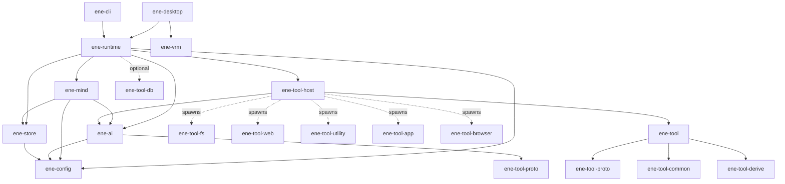

# Ene APIリファレンス

> Ene クレートライブラリの API リファレンス。

このセクションでは、Ene ワークスペース内のすべてのライブラリクレートが公開する API を解説します。
すべてのクレートは **Rust edition 2024** を対象とし、非同期ランタイムには `tokio` を使用します。

ホスト契約は **API v2** です: `EneHandle::open`、必須の `TurnId`、単一飛行の `Busy`、最小チャットイベント、検査用の `diagnostics()`。[API v2](../architecture/api-v2.md) を参照してください。

---

## クレート一覧

| クレート | 説明 | ドキュメント |
|---|---|---|
| [`ene-runtime`](ene-runtime.md) | アクターベースのランタイムファサード。ホストアプリケーションのメインエントリポイント。 | [→](ene-runtime.md) |
| [`ene-mind`](ene-mind.md) | マインドランタイム — セッション、Identity Kernel、型付きメモリ、感情、Performance 調停、プロンプトパケット、コミットメント。 | [→](ene-mind.md) |
| [`ene-ai`](ene-ai.md) | LLM および埋め込みプロバイダーのトレイトと実装（OpenAI + ローカル GGUF）。 | [→](ene-ai.md) |
| [`ene-store`](ene-store.md) | SQLite ベクターメモリストア（サマリー、ファクト、ツールインデックス）。 | [→](ene-store.md) |
| [`ene-config`](ene-config.md) | 設定の読み込み、キャラクターカード、CBS マクロ、`Truncate`。 | [→](ene-config.md) |
| [`ene-vrm`](ene-vrm.md) | `ene-desktop` 向けのVRM 1.0モデルローダー + MToonレンダラー（wgpu）。mind/runtime 依存なし。 | [→](ene-vrm.md) |
| [`ene-tool`](ene-tool.md) | ツール ABI ファサード（proto + common + derive の再エクスポート）。新ツールの推奨 import。 | [→](ene-tool.md) |
| [`ene-tool-host`](ene-tool-host.md) | ツールプロセスのライフサイクル管理、IPC クライアント、Tool RAG パイプライン。 | [→](ene-tool-host.md) |
| [`ene-tool-proto`](ene-tool-proto.md) | IPC ワイヤープロトコル — `ToolSpec`、`IpcRequest`/`IpcResponse`、`ToolError`。 | [→](ene-tool-proto.md) |
| [`ene-tool-common`](ene-tool-common.md) | ツールバイナリ向けの `ToolAction` トレイトとヘルパー。 | [→](ene-tool-common.md) |
| [`ene-tool-derive`](ene-tool-derive.md) | プロシージャルマクロ: `#[derive(ToolSpec)]`、`#[derive(ToolAction)]`。 | [→](ene-tool-derive.md) |
| [`ene-tool-db`](ene-tool-db.md) | ツールバイナリ向けの型付き CRUD データベースクライアント（IPC 経由）。 | [→](ene-tool-db.md) |

### 移動 / 吸収済みスタブ

| 旧クレート | 現在 |
|---|---|
| [`ene-provider`](ene-provider.md) | [`ene-ai`](ene-ai.md) に統合 |
| [`ene-embedding`](ene-embedding.md) | [`ene-ai`](ene-ai.md) に統合 |
| [`ene-session`](ene-session.md) | [`ene-mind`](ene-mind.md) に吸収 |
| [`ene-common`](ene-common.md) | [`ene-config`](ene-config.md)（`truncate`）+ [`ene-tool-common`](ene-tool-common.md) 再エクスポートへ吸収 |

`ene-core` は [`ene-runtime`](ene-runtime.md) に置換されました。独立した `ene-cognition` / `ene-memory` クレートはありません。認知は `ene-mind`、永続化は `ene-store` です。

---

## 依存関係グラフ

破線の矢印（`-..->`）はコンパイル時の依存ではなく、実行時のプロセス生成を表します。



**依存ルール（強制）:**

- `ene-store` ↛ `ene-ai` / `ene-mind`
- `ene-mind` ↛ `ene-runtime` / `ene-tool-host`
- `ene-vrm` ↛ `ene-mind` / `ene-runtime`
- `ene-tool` ↛ `ene-runtime` / `ene-mind` / `ene-store`

`ene-runtime` が `ene-tool-db` をリンクしているのは、共有のツール別DB IPCサーバーソケットを開くためだけです（[`ene-runtime` の `db_server`](./ene-runtime.md#db_server)を参照）。

新しいツールバイナリは次を推奨します:

```
ene-tool  (ファサード)
  → ene-tool-proto / ene-tool-common / ene-tool-derive
  ↘ ene-tool-db  (永続状態が必要な場合)
```

---

## 再エクスポートの規約

あるクレートが同一ワークスペース内の別クレートのアイテムを公開 API として再エクスポートする場合、`#[doc(no_inline)]` を付与する必要があります。

```rust
// ene-tool/src/lib.rs（ファサード）の例
#[doc(no_inline)]
pub use ene_tool_proto::{ToolSpec, ToolError, IpcRequest, IpcResponse};
```

---

## エラーと非同期の規約

[API v2](../architecture/api-v2.md) および歴史的な [APIリファクタリング計画](../architecture/api-refactor-plan.md) も参照してください。

### 非同期（Async）

- I/Oバウンド、またはアクターと通信する境界はすべて `tokio` ランタイム上の `async fn` です。ライブラリコード内でランタイム上でブロックする同期ラッパーを追加しないでください。
- `EneHandle` の fire-and-forget メソッド（`run`、`cancel`、`decide_permission`、`submit_user_input`、`subscribe`）は同期チャネル送信です。`run` は `Result<TurnId, RunError>`（`Busy` | `ActorDead`）を返し、ターン完了は待ちません。
- アクター応答が必要なライフサイクル／検査（`open`、`shutdown`、および `diagnostics()` 上の `get_snapshot`、`manual_split`、`list_tools`、`call_tool` など）は `oneshot` 応答を使う `async fn` です。
- 非同期境界を越えるトレイト（`LlmProvider`、`EmbeddingProvider`、`MemoryStore`、`ToolAction::execute`、`ToolRegistry::check_boundary`）は `#[async_trait::async_trait]` を使用します。

### エラー

- ライブラリの境界は `Result<T, E>` を返し、`E` は `thiserror` 由来の列挙型です（`anyhow::Error`、`String`、`Box<dyn Error>` ではない）。`anyhow` はdev依存のみです。
- クレート名に対応する公開エラー名を1つ持ちます（例: `EneRuntimeError`、`EneMemoryError`（`ene-store`）、`CognitionError` / `EneSessionError`（`ene-mind`）、`EneToolHostError`、`ToolError`、`EneConfigError`、`AiError`（`ene-ai`；入れ子の `LlmProviderError` / `EmbeddingError`））。
- より狭い目的のエラー型も許容されます（`ActorDeadError`、`ShutdownTimeout`、`RunError`、`CancelError`、`DbServerError`）。
- テスト以外での `unwrap()`/`expect()` は避けてください。

---

## 関連ドキュメント

- [アーキテクチャ概要](../architecture/overview.md)
- [API v2](../architecture/api-v2.md)
- [認知ランタイムアーキテクチャ（ADR）](../architecture/cognitive-runtime.md)
- [メモリシステム](../memory/memory.md)
- [ツールシステム](../tools/overview.md)
- [設定リファレンス](../configuration/settings.md)
- [アプリケーション](../applications/cli.md) / [デスクトップ](../applications/desktop.md)
