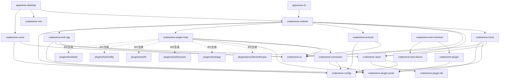

# システムアーキテクチャと設計 (API v1)

**Ene** は明確な責務分離に基づいて設計されています。アクターベースのランタイムファサード (`ene-runtime`)、純粋な認知ターンエンジン (`ene-mind`)、独立した永続化層 (`ene-store`)、プロセス外 IPC プラグインホスト (`ene-plugin-host`)、および独立した VRM レンダラー (`ene-vrm`) で構成されています。

---

## 1. コアアーキテクチャ原則

1. **API v1 ホスト契約**: ホストアプリケーション (`ene-cli`, `ene-desktop`, 外部連携) は `EneHandle::open` を介してのみ Ene と対話します。ターンは必須の `TurnId` で識別されます。ターンの実行は単一飛行 (single-flight) であり、同時実行の試みは `RunError::Busy` を返します。
2. **アクター実行モデル**: `ene-runtime` は内部の Tokio アクターを介して状態を管理します。 `EneHandle` の公開メソッドはノンブロッキングのチャネル送信、または oneshot 非同期リクエストです。
3. **純粋な認知 Mind**: `ene-mind` はプロンプトパケットの構築、ハイブリッド記憶想起、感情状態 (PADモデル) の更新、プロアクティブ発話トリガー、および出力 Performance 演出の調停を所有します。 `ene-mind` は `ene-runtime` や `ene-plugin-host` に**一切依存しません**。
4. **孤立した永続化層**: `ene-store` は SQLite スキーマ、マイグレーション、SeaORM エンティティ、およびベクトル検索 (`sqlite-vec`) を所有します。 `ene-store` は `ene-mind` や `ene-ai` に**一切依存しません**。
5. **プロセス外プラグイン (Protocol v4)**: ツール、LLM プロバイダ、MCP サーバーは **Protocol v4** による長さプレフィックス付き JSON IPC を使用して子プロセスとして動作します。
6. **疎結合な 3D レンダリング**: `ene-vrm` は認知・記憶・ランタイムの型を一切インポートすることなく、 `wgpu` を介して VRM 1.0 モデルを描画します。

---

## 2. ワークスペースのクレートマップと依存関係



### 厳格なアーキテクチャ境界ルール
- `ene-store` ↛ `ene-ai` / `ene-mind`
- `ene-mind` ↛ `ene-runtime` / `ene-plugin-host`
- `ene-vrm` ↛ `ene-mind` / `ene-runtime` / `ene-store`
- `ene-plugin` ↛ `ene-runtime` / `ene-mind` / `ene-store`

---

## 3. ターンライフサイクル

ユーザーからのメッセージは `ene-runtime` 内でターンを開始します。ステップは以下の順序で厳密に実行されます：

```text
ユーザーメッセージ
  │
  ├─> 1. Runtime: リクエストを受信し TurnId を発行 (実行中の場合は Busy を返却)
  ├─> 2. Mind: before_turn (想起計画 + 感情更新; 並行プリフェッチ)
  ├─> 3. Mind: compose_prompt_packet (プロンプトセクションごとの予算割り当て)
  ├─> 4. AI Provider: LLM によるストリーミングトークン生成
  │     └─> (任意) PluginHostManager 経由のターン中 IPC ツール実行
  ├─> 5. Mind: 出力調停 (アバター向け Performance キューの生成)
  ├─> 6. Mind: finalize_turn (同期的な感情 & ターン状態の更新)
  ├─> 7. Runtime: セッション履歴をストアへコミット
  ├─> 8. Runtime: EneEvent::Terminal の発行 (チャットターンの完了通知)
  └─> 9. バックグラウンド: 遅延記憶抽出、忘却、感情分類処理
```

---

## 4. プラグインシステムと IPC Protocol v4

プロセス外プラグイン (ツール、カスタム LLM プロバイダ、MCP サーバー) は **IPC Protocol v4** を使用してホストと通信します：

- **フレーミング**: `stdin`/`stdout` 上の 4バイト・リトルエンディアン長さプレフィックス＋JSONペイロード。
- **ハンドシェイクネゴシエーション**: `VersionRange { min: 4, max: 4 }` によるバージョンネゴシエーション。ホストがサポート範囲を送信し、プラグインが合意したバージョンを `HandshakeAck` で報告します。
- **リクエスト相関**: 非ストリーミングおよびストリーミングの全 IPC メッセージは必須の `request_id` (`Uuid`) を保持します。
- **ケーパビリティ宣言**: `PluginCapabilities` により利用可能な `tools`, `llm_providers`, `stt_providers`, `tts_providers` を宣伝します。
- **ステートフルツール DB プロキシ**: 状態を保持するツールは `ene-tool-db` を介してホストの UDS ソケットに接続し、孤立した `todo.db` / `undo.db` ストレージにアクセスします。

---

## 5. 各クレートの役割一覧

| クレート | 主な責務 |
|---|---|
| `ene-runtime` | アクターベースのランタイムファサード、ターン管理、イベントブロードキャスト、DB IPC ソケットサーバー |
| `ene-mind` | セッション管理、プロンプト予算配分、感情 (PADモデル)、記憶想起、プロアクティブ発話、演出調停 |
| `ene-store` | SQLite / SeaORM エンティティ、マイグレーション、ベクトル検索 (`sqlite-vec`)、コミットメント台帳 |
| `ene-ai` | `AiProvider` トレイト、OpenAI プロバイダ、Anthropic IPC アダプタ、プロバイダファクトリ |
| `ene-ai-local` | `llama-cpp-2` によるローカル GGUF LLM 推論 |
| `ene-voice` | ローカル STT (Whisper)、TTS、VAD (Silero ONNX)、cpal オーディオ I/O |
| `ene-connector` | プラットフォーム連携 (Discord, Telegram, Slack, Webhook) および MCP クライアント/サーバーブリッジ |
| `ene-plugin-host` | プラグインプロセス監視、MCP サーバー発見、ヘルスチェック、サーキットブレーカー |
| `ene-plugin-proto` | IPC Protocol v4 ワイヤーメッセージ、バージョン定義、フレーミング |
| `ene-plugin` | プラグイン開発 SDK & `ToolPluginAdapter` ファサード |
| `ene-tool-common` | ツール開発者向け共通アクション定義 (`ActionSetProvider`, prelude) |
| `ene-plugin-db` | ステートフルプラグインの DB 操作用型付き IPC クライアント |
| `ene-tool-derive` | Proc-macro `#[derive(ToolAction)]` |
| `ene-tool-rag` | ツール仕様の検索拡張生成 (RAG) と再ランク |
| `ene-vrm` | VRM 1.0 アバター読み込みおよび wgpu レンダラー |
| `ene-config` | 設定読み込み、設定スキーマ、キャラクターカード定義 |
