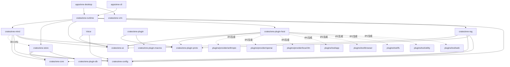

# システムアーキテクチャと設計 (API v1)

**Ene** は明確な責務分離に基づいて設計されています。アクターベースのランタイムファサード (`ene-runtime`)、純粋な認知ターンエンジン (`ene-mind`)、永続化に依存しないドメイン語彙 (`ene-core`) の上に構築された独立した永続化層 (`ene-store`)、RAG のスコアリング/減衰ポリシー層 (`ene-rag`)、プロセス外 IPC プラグインホスト (`ene-plugin-host`)、および独立した VRM レンダラー (`ene-vrm`) で構成されています。

---

## 1. コアアーキテクチャ原則

1. **API v1 ホスト契約**: ホストアプリケーション (`ene-cli`, `ene-desktop`, 外部連携) は `EneHandle::open` を介してのみ Ene と対話します。ターンは必須の `TurnId` で識別されます。ターンの実行は単一飛行 (single-flight) であり、同時実行の試みは `RunError::Busy` を返します。アクターの生存状態に関する失敗は、アクター制御面 (権限、undo、ユーザー入力、機能更新) と読み取り専用の diagnostics / vision ハンドルのすべてで一様に `PublicApiError::ActorDead` として報告されます (#408)。独立した「アクター死亡」エラー型は存在せず、`run` と `cancel` のみが専用のエラー型 (`RunError`, `CancelError`) を持ちます。これはそれらの `Busy` / `TurnMismatch` バリアントが呼び出し側の分岐に必要な情報を担っているためです。
2. **アクター実行モデル**: `ene-runtime` は内部の Tokio アクターを介して状態を管理します。 `EneHandle` の公開メソッドはノンブロッキングのチャネル送信、または oneshot 非同期リクエストです。
3. **純粋な認知 Mind**: `ene-mind` はプロンプトパケットの構築、ハイブリッド記憶想起、感情状態 (PADモデル) の更新、プロアクティブ発話トリガー、および出力 Performance 演出の調停を所有します。 `ene-mind` は `ene-runtime` や `ene-plugin-host` に**一切依存しません**。また、その認知ロジック群 (想起、記憶アービター、忘却、キャラクター同期、ジャーナル、自己内省) は永続化層に対して常に `ene_core::MemoryPort` トレイト (#270) 経由でのみアクセスし、具象型 `ene_store::MemoryStore` には直接依存しません。これにより SQLite なしでインメモリのテストダブルに対して単体テストできます。
4. **孤立した永続化層**: `ene-store` は SQLite スキーマ、マイグレーション、SeaORM エンティティ、およびベクトル検索 (`sqlite-vec`) を所有します。 `ene-store` は `ene-mind` や `ene-ai` に**一切依存しません**。
5. **永続化に依存しないドメイン語彙**: `ene-core` は認知層と永続化層の双方が共有するコアドメイン型 — `AffectState` (PAD 感情状態)、typed-memory の種別/ステータス/クエリ、コミットメント台帳の語彙、および `MemoryPort` トレイト自体 — を定義します。ワークスペース内部の他クレートに一切依存しないため、`ene-store` と `ene-mind` はどちらも、互いに依存することなくこのクレートに依存できます。
6. **プロセス外プラグイン (Protocol v6)**: ツール、LLM プロバイダ、MCP サーバーは **Protocol v6** による長さプレフィックス付き IPC を使用して子プロセスとして動作します。ハンドシェイクは JSON、以後のフレームはネゴシエーションされた `WireFormat`（v6 は MessagePack、v5 ピアは JSON）です。
7. **疎結合な 3D レンダリング**: `ene-vrm` は認知・記憶・ランタイムの型を一切インポートすることなく、 `wgpu` を介して VRM 1.0 モデルを描画します。
8. **耐障害アクター (#268)**: アクターのコマンドおよびバックグラウンドタスクは `catch_unwind` によってパニック隔離されており、1つのコマンドのパニックがアクターやプロセス全体をクラッシュさせることはありません。これは偶発的な性質ではなく設計上の不変条件です — 仕組みとビルド設定上の前提条件については [§4](#4-耐障害性とパニック隔離) を参照してください。

---

## 2. ワークスペースのクレートマップと依存関係



### 厳格なアーキテクチャ境界ルール
- `ene-core` ↛ `ene-store` / `ene-mind` / `ene-ai` / `ene-runtime` (#270) — ドメイン語彙は `ene-store` と `ene-mind` の双方より下位に位置し、どちらもこの型のために互いへ依存しない
- `ene-rag` ↛ `ene-store` / `ene-mind` / `ene-runtime` (#302) — RAG のスコアリング/減衰ポリシー層は `ene-core` のドメイン語彙と汎用依存のみに依存する。永続化には `ene_core::EmbeddingStorePort` トレイト経由でのみ到達するため、store↔rag の循環依存はコンパイル時に不可能となる
- `ene-store` ↛ `ene-ai` / `ene-mind`
- `ene-mind` ↛ `ene-runtime` / `ene-plugin-host` / `ene-store` (本番コード; `ene-store` は統合テスト用の dev-dependency のみ)
- `ene-vrm` ↛ `ene-mind` / `ene-runtime` / `ene-store`
- `ene-plugin` ↛ `ene-runtime` / `ene-mind` / `ene-store`

---

## 3. ターンライフサイクル

ユーザーからのメッセージは `ene-runtime` 内でターンを開始します。ステップは以下の順序で厳密に実行されます：

```text
ユーザーメッセージ
  │
  ├─> 1. Runtime: リクエストを受信し TurnId を発行 (実行中の場合は Busy を返却)
  ├─> 2. Mind: before_turn (想起計画 + 感情更新; 並行プリフェッチ)
  ├─> 3. Mind: compose_prompt_packet (コンテキストウィンドウへの優先度順パッキング)
  ├─> 4. AI Provider: LLM によるストリーミングトークン生成
  │     └─> (任意) PluginHostManager 経由のターン中 IPC ツール実行
  ├─> 5. Mind: 出力調停 (アバター向け Performance キューの生成)
  ├─> 6. Mind: finalize_turn (同期的な感情 & ターン状態の更新)
  ├─> 7. Runtime: セッション履歴をストアへコミット
  ├─> 8. Runtime: EneEvent::Terminal の発行 (チャットターンの完了通知)
  └─> 9. バックグラウンド: 遅延記憶抽出、忘却、感情分類処理
```

---

## 4. 耐障害性とパニック隔離

`ene-desktop` は GUI・アクター・LLM ストリーミング・音声を同一プロセスで同居させています。1つのコマンドハンドラやバックグラウンドタスクのパニックがプロセス全体を道連れにしてはならない — これは実装の細部ではなく設計上の不変条件です (#268)。

**仕組み**: `TurnActor::run_command_isolated` (`crates/ene-runtime/src/handle/actor.rs`) は、ディスパッチされる全ての `EneCommand` を `isolate_panic()` 経由で実行します。この関数はコマンドの Future を `std::panic::AssertUnwindSafe(..).catch_unwind()` でラップし、パニックを捕捉してログに記録し、`DiagnosticEvent::ActorPanic { component, message }` として通知した上で、そのコマンドを非終端 (non-terminal) 扱いとします — アクターのメールボックスループは止まらず、次のコマンドを通常どおり処理し続けます。アクターのバックグラウンド `JoinSet` 群 (call-tool、classifier、memory-writer、search、deferred-tool の各タスク) も同様の方式で回収されます: `reap_join_set()` が `JoinError::is_panic()` を検出し、`.await` 経由でパニックが伝播するのを防いで同じ `ActorPanic` 診断を発行します。

**ビルド設定上の前提条件**: この保証は **`panic = "unwind"`** (Rust のデフォルト) を前提とします — ワークスペースルートの `Cargo.toml` の `[profile.release]` は意図的に `panic = "abort"` を設定していません。`panic = "abort"` の下ではパニック発生時にプロセスが即座に abort し、スタックアンワインドが一切発生しないため、`catch_unwind` は呼ばれても何も捕捉しません。したがって `panic = "abort"` はこの耐障害モデルとは**両立しません** — release プロファイルに再度追加すると、出荷されるビルドでパニック隔離が無警告のまま無効化されます。`cargo test` はプロファイルに関わらず常にアンワインドするため、テストスイートを実行しても異常には気づけない点に注意してください。変更する前に、ルート `Cargo.toml` の `[profile.release]` に付けたコメントを確認してください。

**コマンド途中のパニックに対する共有状態の安全性**: アクターの共有状態 (`pending_permissions`、`permission_scopes`、`undo_stack` など) は `tokio::sync::Mutex` / `parking_lot::Mutex` で保護されており、いずれも `std::sync::Mutex` と異なりパニックで**ポイズニングしません** — ガードを保持中にパニックしてもアンワインド時にガードが破棄されるだけで、ロックは直ちに再利用可能です。この状態への変更操作は (`UndoStack::record`、`Vec::push`、`HashMap::insert` などの) ロック保持中の単一の同期呼び出しであり、途中に `.await` を挟まないため、パニックはある変更操作の厳密に前か後にしか発生し得ず、変更操作の途中で中途半端な状態になることはありません。`crates/ene-runtime/src/handle/mod.rs` のテスト `actor_survives_command_panic_and_audited_state_stays_consistent` はこれを実際に稼働中のアクターメールボックスを通してエンドツーエンドで検証します: 上記3つのフィールドすべてを変更した後にコマンドをパニックさせ、アクターが生存していること、`DiagnosticEvent::ActorPanic` が発火したこと、3つの変更すべてが無傷で残っていることをアサートします。

---

## 5. プラグインシステムと IPC Protocol v6

プロセス外プラグイン (ツール、カスタム LLM プロバイダ、MCP サーバー) は **IPC Protocol v6** を使用してホストと通信します：

- **フレーミング**: `stdin`/`stdout` 上の 4バイト・リトルエンディアン長さプレフィックス。ハンドシェイク交換は JSON、以後のフレームはネゴシエーションされた `WireFormat`（v6 は MessagePack、v5 ピアは JSON）。
- **ハンドシェイクネゴシエーション**: `VersionRange { min: 5, max: 6 }`（`VersionRange::host_supported()`）によるバージョンネゴシエーション。ホストがサポート範囲を送信し、プラグインが合意したバージョンを `HandshakeAck` で報告します。
- **リクエスト相関**: 非ストリーミングおよびストリーミングの全 IPC メッセージは必須の `request_id` (`Uuid`) を保持します。
- **ケーパビリティ宣言**: `PluginCapabilities` により利用可能な `tools`, `llm_providers`, `stt_providers`, `tts_providers` を宣伝します。
- **能力共有 (`provides` / `requires`)**: プラグインは他プラグインへ提供する能力 (`provides`) と必要とする能力 (`requires`) を宣言します。ホストは起動時に宣言を解決し、ハード要求が未充足のプラグインを無効化します（`docs/concepts/plugins-and-mcp.md` 参照）。ローカル GGUF プロバイダプラグイン (`plugins/provider/local-llm`、バイナリ `ene-plugin-llama-cpp`) は `llm/chat@1`・`embed@1`・`gguf-runner@1` を宣言し、チャットストリーミング・補完・GGUF 埋め込みを IPC 越しに提供します。
- **ホストサービス `db` 乗客**: 状態を保持するツールは `ene-plugin-db` を介して共有ホストサービスソケットを開き、ホストの `memory.db` 内でプレフィックス隔離された CRUD を行います。全プラグインがこの単一ソケットを共有するため、ネームスペースの隔離はプラグインごとの認証トークンのみに依存します (プラグインごとのソケットパス層は廃止されました)。

---

## 6. 各クレートの役割一覧

| クレート | 主な責務 |
|---|---|
| `ene-runtime` | アクターベースのランタイムファサード、ターン管理、イベントバス（チャット / 音声 / ライフサイクルの3チャネル）、ホストサービスアクセプタ |
| `ene-mind` | セッション管理、プロンプトパッキング、感情 (PADモデル)、記憶想起、プロアクティブ発話、演出調停 |
| `ene-store` | SQLite / SeaORM エンティティ、マイグレーション、ベクトル検索 (`sqlite-vec`)、コミットメント台帳 |
| `ene-core` | 永続化に依存しないドメイン語彙 (`AffectState`、typed-memory の種別/ステータス/クエリ、コミットメント台帳の型) および `MemoryPort` トレイト抽象 |
| `ene-ai` | プロバイダトレイトとレジストリ、メッセージ/ストリーミング型、設定ルーティング、ヘルスプローブ、リトライポリシー |
| `ene-voice` | ローカル STT (Whisper)、TTS、VAD (Silero ONNX) のエンジン実装。プロバイダプラグインが消費する |
| `ene-connector` | 外部サービスの認証情報権威 (OAuth2/API キー保管、コネクタアイデンティティ、許可スコープ)。現時点で利用クレートなし — #412/#415 の MCP 認証情報ブリッジにより再導入予定 |
| `ene-plugin-host` | プラグインプロセス監視、MCP サーバー発見、ヘルスチェック、サーキットブレーカー |
| `ene-plugin-proto` | IPC Protocol v7 ワイヤーメッセージ、バージョン定義、フレーミング |
| `ene-plugin` | プラグイン開発 SDK: `ToolPlugin`/`LlmPlugin` ファサード、`ToolAction`/`ActionSetProvider`、prelude |
| `ene-plugin-db` | ステートフルプラグインの DB 操作用型付き IPC クライアント |
| `ene-plugin-macros` | Proc-macro: `#[derive(ToolAction)]`, `#[derive(ToolSpec)]`, `#[tool_action]` |
| `ene-rag` | RAG ポリシー層: 記憶想起のスコアリング/減衰、ツール選択と再ランク (旧 `ene-tool-rag` を吸収) |
| `ene-vrm` | VRM 1.0 アバター読み込みおよび wgpu レンダラー |
| `ene-config` | 設定読み込み、設定スキーマ、キャラクターカード定義 |
