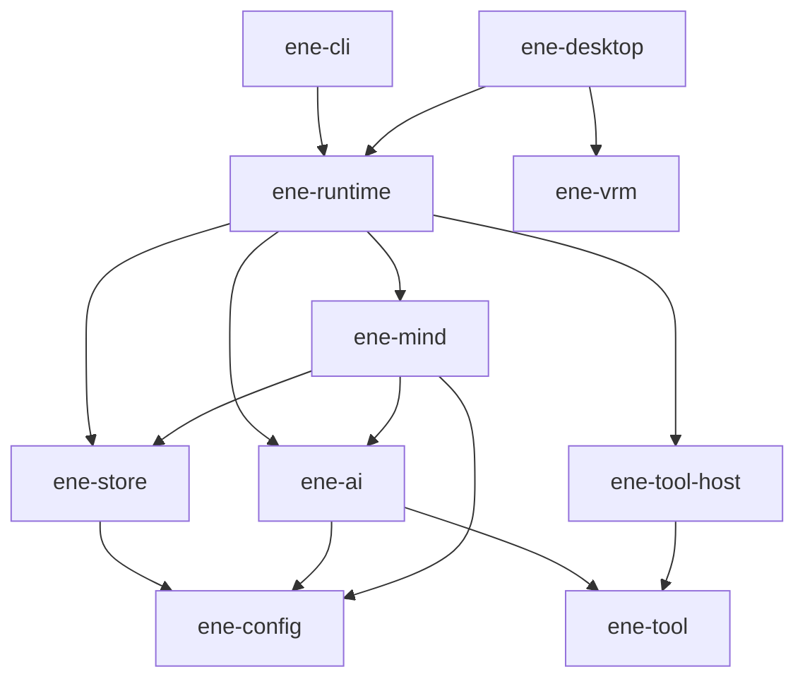

# ADR: API v2 — 機能再設計

- **Status:** Accepted
- **Date:** 2026-07-13
- **Epic:** [#111](https://github.com/pexisgle/ene/issues/111)

## 背景

ライブラリ表面に二重ストリーミング（legacy + cognitive）、未準備の `EneHandle::new` ライフサイクル、チャット必須イベントと診断の混在、並行する設定ノブ（`memory.*` と `mind.memory.*`）、HyDE/rerank まで抱えた `EmbeddingProvider` が積み上がっていた。API v2 は最小ホスト契約と明確なクレート所有へ畳み込む。

## ロック済み決定

### ホスト / ターン識別

1. **`TurnId` は必須。** `run(input) -> Result<TurnId, Busy | ActorDead>`。ターンスコープのイベントと `cancel(turn)` はその id を運ぶ。
2. **並行性:** single-flight。ターン実行中の二度目の `run` は `Busy` — 暗黙 abort や broadcast だけの相関はしない。
3. **ライフサイクル:** `EneHandle::open(config, card) -> Result<ReadyHandle, _>`。公開の未準備 `new` + 多段 `load_config` / `load_character` は置かない。設定ファイル I/O は `ConfigStore` / `ene-config` 側。
4. **`Terminal` はターンの完全完了**を意味する（`after_turn` の memory write / forgetting / affect persist を含む）。切り離し処理がチャット経路で `Terminal` を追い越してはならない。

### イベント

5. **チャット `EneEvent` は最小:** `TextDelta`、`Performance`、対話ゲート（`PermissionRequired` / `UserInputRequired`）、必要なら tool start/result、`Terminal`、`StatusChanged`、任意の薄い `ContextCompressed`。
6. **診断はオプトイン:** `PipelinePhase`、`PipelineMetrics`、arbiter/compression 詳細は `handle.diagnostics()`。
7. **`EneDiagnostics`** はハンドル上の具象 facade — UI がトレイトを実装しない。

### プロバイダ（`ene-ai`）

8. **`EmbeddingProvider`:** トレイト上は batch メソッド一つ。単一テキスト / query embed は convenience。HyDE / rerank は mind または tool-host の pipeline ステップ。

### クレートマップ

| ターゲット | 吸収元 |
|---|---|
| `ene-runtime` | 旧 `ene-core` ホスト / アクターファサード |
| `ene-mind` | 認知エンジン + セッション（旧 `ene-session` を吸収） |
| `ene-store` | 永続化（旧 memory ストア表面） |
| `ene-ai` | `ene-provider` + `ene-embedding` |
| `ene-tool` | `ene-tool-proto` + `ene-tool-common` + `ene-tool-derive`（必要なら tool-db ABI） |
| `ene-tool-host` / `ene-config` / `ene-vrm` | 同様（LayerComposer は vrm/desktop 内） |

### 依存ルール

- `ene-mind` ↛ `ene-runtime` / `ene-tool-host`
- `ene-store` ↛ `ene-ai` / `ene-mind`（LLM・埋め込みプロバイダなし）
- `ene-tool` ↛ runtime / mind / store
- **`PerformanceCue` は `ene-mind` 所有**；runtime が再エクスポート；**`ene-vrm` は mind/runtime に依存しない**
- `ene-common` は tool/config へ吸収；`schema_link` 削除（runtime が mind を通常依存）

### 設定所有

- Store 側: `store.enabled` + `store.db_path` のみ
- recall / write / decay / MMR / emotion / performance はすべて `mind.*`
- JSON 破損: CLI は fail-hard（`ConfigStore::try_load`）；desktop のみ必要なら `ConfigStore::load` の soft-fallback

### 関連 epic

- [#119](https://github.com/pexisgle/ene/issues/119) Memory — ledger が唯一の SoT；store に embedder なし
- [#126](https://github.com/pexisgle/ene/issues/126) Performance — `PerformanceCue` は mind；明示 `perform` なしに `CueSource::Host` は置かない
- [#135](https://github.com/pexisgle/ene/issues/135) Tools — name 衝突は hard error；wire / host トレイト分離

## 目標依存グラフ



## ホスト契約（要約）

```rust
EneHandle::open(config, card) -> Result<EneHandle, EneRuntimeError>;
handle.run(input) -> Result<TurnId, RunError>; // Busy | ActorDead
handle.cancel(turn: &TurnId) -> Result<(), CancelError>;
handle.subscribe() -> EneEventReceiver;
handle.decide_permission(...);
handle.submit_user_input(...);
handle.shutdown(timeout).await;

handle.diagnostics() -> &EneDiagnostics;
```

### チャット `EneEvent`

| バリアント | 備考 |
|---|---|
| `TextDelta { turn, delta }` | marker 除去済み |
| `Performance { turn, cues, source }` | SpecialToken + Expression を置換 |
| `ToolCallStart` / `ToolCallResult` | UI 用に任意 |
| `PermissionRequired` / `UserInputRequired` | ゲート |
| `ContextCompressed { turn, … }` | 薄い信号；詳細は diagnostics |
| `Terminal { turn, reason }` | ターン完了 |
| `StatusChanged { status }` | Idle / Running / Error |

チャットから除去: `SpecialToken`、単独の `Expression`、`SessionSplit`、`PipelinePhase`、`PipelineMetrics`。

## エラーと非同期の規約

- I/O および oneshot actor 応答: tokio 上の `async fn`
- fire-and-forget（`run`、`cancel`、ゲート）: sync channel send
- クレートごとに公開 `thiserror` 列挙を一つ；ライブラリ境界に `anyhow` / 生 `String` / `Box<dyn Error>` なし
- テスト以外で `unwrap` / `expect` なし

## 移行メモ

- 二重パイプライン fallback なし: 埋め込み未初期化で memory 機能が必要な場合は fail closed
- 文脈境界は compression-only（製品経路で hard session-ID 発行しない）
- 単一の `HistoryEntry { role: Role, content: String }` を mind + runtime snapshot で共有
- 公開互換 alias や移行用 feature/config は作らない — 呼び出し側を同一変更で更新

## 受入

- [ ] サブ issue #112–#118 がクローズまたは明示延期
- [ ] ロック事項が EN+JA docs に反映
- [ ] docs EN+JA が目標契約と一致
- [ ] `direnv exec .` 下で workspace clippy/tests が緑

## 参照

- Epic #111 とサブ issue #112–#118
- [認知ランタイム ADR](cognitive-runtime.md)
- [API Index](../api/index.md)
- [ストリーミングイベント](../core/streaming-events.md)
