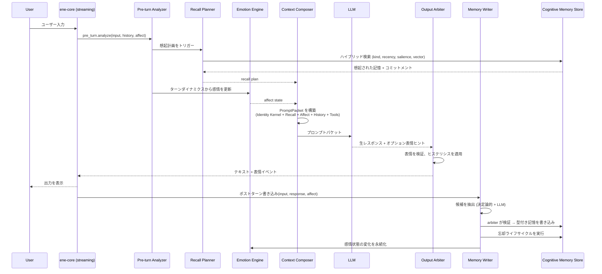

# ADR: Ene Cognitive Runtime アーキテクチャ

- **ステータス:** Proposed
- **日付:** 2026-06-28
- **Epic:** #63 — AI ランタイムを Ene Cognitive Runtime として再設計

## 背景と課題

現在の Ene の AI ランタイムは、会話履歴・長期記憶・感情・プロンプト構築が比較的単純なパイプラインにまとまっており、長時間稼働する AI Companion / AITuber 的な体験として以下の課題がある。

1. **感情制御が LLM の `<|emo:name|>` トークンに強く依存している。** エンジン側に永続的な感情状態がなく、LLM がトークンを出力しないと表情が更新されない。
2. **記憶が `conversation_summaries` / `conversation_keyfacts` に限定されている。** 記憶種別・信頼度・新しさ・感情的重要度・矛盾解決の概念がない。
3. **セッション分割が記憶保存と会話継続感を分断する。** サマリーは分割境界でのみ作られ、分割のたびにセッションがリセットされ、継続的な関係性の感覚が失われる。
4. **プロンプトの層構造が弱い。** 長文脈で Character Drift（キャラクター性の逸脱）が起きやすい。履歴が増えるほど中核的人格定義が埋もれる。
5. **CCv3 の lorebook / semantic 設定が検索対象として十分活用されていない。** インラインテキストとして含まれるのみで、semantic retrieval されない。
6. **忘却がハードデリートである。** 「記憶が消えた」という体験で、faded / archived / superseded のような自然なライフサイクルがない。
7. **Codex 的な明示的状态管理（context packing / task ledger / tool result grounding）が companion 体験に統合されていない。**

## 決定

**Ene Cognitive Runtime アーキテクチャを採用する。** LLM を「人格と記憶を暗黙に保持する主体」としてではなく、**Ene が管理する明示的な認知状態から自然な発話を生成するエンジン**として扱う。

Ene が明示的に管理するもの：
- Identity Kernel（人格核）
- Typed Memory（型付き記憶、ライフサイクル付き）
- Semantic Character Memory（CCv3 lorebook の意味記憶化）
- Context Compression（文脈圧縮）
- Recall Planning（想起計画）
- Affect / Mood / Relationship State（感情・気分・関係性状態）
- Expression Arbitration（表現調停）
- Memory Writing（記憶書き込み）
- Context Budget Management（文脈予算管理）
- Companion Task Ledger（コンパニオンタスク台帳）

## クレート責務分離

| コンポーネント | クレート | 責務 |
|---|---|---|
| Identity Kernel | `ene-cognition::character` | CCv3 を不変の人格定義ブロックにコンパイル。常にプロンプト最上位に配置 |
| Typed Memory Store | `ene-memory` | 型付き記憶の CRUD + ハイブリッド検索（kind, confidence, recency, salience, vector） |
| Memory Extraction (決定論的) | `ene-cognition::memory_writer` | ルールベースで facts, preferences, commitments, procedure 記憶を抽出 |
| Memory Extraction (LLM) | `ene-cognition::memory_writer` | LLM による `MemoryCandidate` 生成 |
| Memory Arbiter | `ene-cognition::memory_writer` | 候補を既存記憶と照合し、信頼度計算・重複排除・矛盾解決 |
| Recall Planner | `ene-cognition::recall` | 検索意図と予算ヒントを含む `RecallPlan` を生成し、ハイブリッド検索を実行 |
| Hybrid Search Scoring | `ene-memory` | vector 類似度 + recency + salience + confidence + affect + commitments の多要素スコアリング |
| Emotion Engine | `ene-cognition::emotion` | 会話ダイナミクスからの決定論的感情計算 + オプション LLM 分類器 |
| Expression Arbiter | `ene-cognition::output` | `AffectState` をキャラクター表情にマッピング。ヒステリシスと設定制約を適用 |
| Context Budget Manager | `ene-cognition::context` | `PromptPacket` の各セクションにトークン予算を割り当て |
| Context Compression | `ene-cognition::context` | 古い会話ターンを記憶スパンに圧縮する rolling compression |
| PromptPacket Composer | `ene-cognition::prompt_packet` | セクション化されたプロンプトパケットを構築 |
| Companion Commitment Ledger | `ene-cognition::commitments` | コンパニオンが行った約束・タスク・フォローアップを追跡 |
| Conversation History | `ene-session` | ターン履歴の管理。セッション分割は圧縮トリガーに段階的に置き換え |
| Streaming Integration | `ene-core` | 全ターンライフサイクルの統合とイベント発行 |

### 依存ルール

- `ene-cognition` は `ene-memory`, `ene-config`, `ene-provider`, `ene-common` に依存する
- `ene-cognition` は `ene-core` および `ene-session` に依存しない（循環依存防止）
- `ene-core` は Phase 10 (#100) で `ene-cognition` に依存するようになる
- `ene-memory` は引き続き `sea-orm` SQLite 操作の排他的所有者。抽出・調停・想起計画のロジックは `ene-cognition` に置く

## ターンライフサイクル

### ライフサイクルステップ

1. **Pre-turn Analysis** — ユーザー入力・現在の感情状態・最近の履歴を評価し、ターンの意図・感情トーン・記憶検索ニーズを決定する。
2. **Recall Planning** — 検索クエリ・記憶種別フィルタ・トークン予算ヒントを含む `RecallPlan` を生成。型付き記憶ストアに対してハイブリッド検索を実行。
3. **Emotion Update** — ターンダイナミクス（ユーザー感情・トピック価・関係性の手がかり）から新しい `AffectState` を計算。以前の感情に減衰を適用。
4. **Context Composition** — `PromptPacket` をセクション化された層で構築: Identity Kernel → Recalled Memories → Commitments → Affect State → Scene → Style Examples → History → Current Input。
5. **LLM Generation** — `PromptPacket` を LLM プロバイダに送信。LLM はオプションで表情ヒントを提供できる。
6. **Output Arbitration** — 感情+レスポンスをキャラクター表情にマッピング。表情のちらつきを防ぐヒステリシスを適用。
7. **Post-turn Writing** — 決定論的抽出器と LLM 抽出器を実行し `MemoryCandidate` を生成。Memory Arbiter が既存記憶と照合し、信頼度を計算してストアに書き込む。
8. **Forgetting Lifecycle** — 減衰曲線に従って既存記憶を経年処理。`active → faded → archived → superseded` のステータス遷移を管理。

## 主要用語

### Identity Kernel（人格核）
CCv3 キャラクターカードからコンパイルされた不変の人格定義ブロック。常にすべてのプロンプトパケットの最上位に配置される。名前、中核的人格、システムプロンプト、明示的行動制約を含む。**絶対に圧縮・切り詰めしてはいけない。**

### Typed Memory（型付き記憶）
明示的な `MemoryKind` を持つ記憶：
- **Episodic**（エピソード記憶）— 特定の出来事・会話
- **Semantic**（意味記憶）— 事実・知識
- **Procedural**（手続き記憶）— ハウツー知識、アクションに対するユーザー好み
- **Preference**（選好記憶）— ユーザーの好き嫌い・特性
- **Relationship**（関係性記憶）— ユーザーとコンパニオンの関係に関する情報
- **Commitment**（コミットメント記憶）— 約束・タスク・フォローアップ

### MemoryStatus（記憶状態）
記憶のライフサイクル状態：
- `active` — 現在関連性があり、検索可能
- `faded` — 減衰したが、より低い優先度で検索可能
- `archived` — 通常の想起では表示されないが保存されている
- `superseded` — 新しい矛盾する記憶に置き換えられた

### AffectState（感情状態）
以下の次元を持つ永続的な感情状態：
- **Valence**（快 — 不快）
- **Arousal**（興奮 — 鎮静）
- **Dominance**（支配 — 服従）
- **離散感情**（喜び、悲しみ、怒り、恐れ、驚き、中立など）各感情ごとの強度付き

### PromptPacket（プロンプトパケット）
各セクションが独立したトークン予算を持ち、Context Budget Manager によって管理されるセクション化されたプロンプト構造：
1. Identity Kernel（常に最初、決して切り詰めない）
2. Recalled Memories（想起された記憶）
3. Active Commitments（アクティブなコミットメント）
4. Current Affect State（現在の感情状態）
5. Scene / Scenario（シーン・シナリオ）
6. Style Examples（CCv3 lorebook からのスタイル例）
7. Conversation History（直近 N ターンの会話履歴）
8. Current User Input（現在のユーザー入力）

### RecallPlan（想起計画）
Recall Planner が生成するクエリ計画：
- 検索クエリ（自然言語 + 埋め込み）
- 記憶種別フィルタ
- 想起コンテンツに割り当てられたトークン予算
- 最低 recency / confidence / salience しきい値

### Expression Arbiter（表現調停器）
現在の `AffectState`、オプションの LLM 表情ヒント、キャラクター表情定義を受け取り、解決された表情を出力する：
- **ヒステリシス** — 急激な表情変化を防止（秒単位で設定可能）
- **アドバイザリモード** — 設定時、LLM ヒントはコマンドではなく提案として扱われる

### Memory Arbiter（記憶調停器）
`ene-cognition::memory_writer::arbiter` にあり、記憶抽出器と型付き記憶ストアの間に位置する。各 `MemoryCandidate` に対して追跡可能な判断を返す：

| 判断 | 条件 |
|------|------|
| `Persist` | 検証を通過し、矛盾・重複がない |
| `Ignore` | 低信頼度、無効フィールド、完全一致/意味的重複、削除対象なし |
| `Supersede` | 新しい根拠が既存記憶を置き換える（トランザクションで insert + 旧行を `superseded` に） |
| `MarkDisputed` | 弱い矛盾 — 既存記憶をユーザー確認用にフラグ |
| `MarkUserDeleted` | ユーザーの削除要求が既存記憶にマッチ |
| `AskConfirmationLater` | 曖昧な矛盾 — ユーザー確認まで保留 |

検証ゲート：
- `CognitionMemoryConfig::min_confidence_to_persist`（デフォルト `0.65`）
- title/content が非空
- `source_quote` がターン内テキストに含まれる（tool result 由来の procedure 記憶で `source_quote` が空の場合は例外）
- 削除候補には `deletion_target_key` が必須

重複排除は正規化した完全一致を先に適用し、オプションの意味的マッチ（ベクトル検索結果）で近傍重複の統合や supersede/dispute を行う。MemoryWriter オーケストレーション（#100）が埋め込み検索を接続するまで、呼び出し側は `ArbiterContext::semantic_matches` を自前で設定する必要がある（例: `MemoryStore::search_typed_memories` から）。

### Context Compression（文脈圧縮）
古い会話ターンをコンパクトな記憶スパンに要約する rolling compression。セッション分割とは異なり、圧縮は継続性を保持する — セッション ID は変わらず、継続的な会話の感覚が維持される。

## 結果と移行戦略

### ポジティブな影響
- **Character Drift の低減** — Identity Kernel が常に存在し、決して切り詰められない
- **記憶の継続性** — セッション分割による分断がなく、圧縮が文脈を保持
- **リッチな意味記憶** — CCv3 lorebook が検索可能な意味記憶インデックスに
- **高度な想起** — 多要素スコアリング（vector + recency + salience + confidence + affect + commitments）
- **永続的感情** — エンジン管理の感情状態、LLM トークン非依存
- **ユーザー主体性** — 記憶の inspect / pin / archive / forget / dispute UX
- **自然な忘却** — ハードデリートではなく faded / archived / superseded ライフサイクル

### 移行パス
- **Phase 0–9** はグリーンフィールド — `ene-cognition` の新規コード、既存ランタイムは変更しない
- **Phase 10 (#100)** で `ene-cognition` を `ene-core::streaming.rs` に統合し、旧パイプラインを置き換え
- **#98** でレガシー `conversation_summaries` / `conversation_keyfacts` から新しい型付き記憶スキーマへの移行を定義
- **#80** で自動セッション分割を rolling context compression トリガーに置き換え
- **Phase 10 まで既存ランタイムに破壊的変更なし**
- 既存の CLI とデスクトップアプリは Phase 0–9 の間、変更なく動作し続ける

## 参照

- Epic: #63 — AI ランタイムを Ene Cognitive Runtime として再設計
- 全 Phase & 依存関係マップ: `#63` issue body
- 現行アーキテクチャ: `docs/architecture/overview.md`
- 記憶システム: `docs/memory/memory.md`
- プロンプト構築: `docs/core/prompt.md`
- セッション分割: `docs/core/session-split.md`
- 感情処理: `docs/core/emotions.md`
