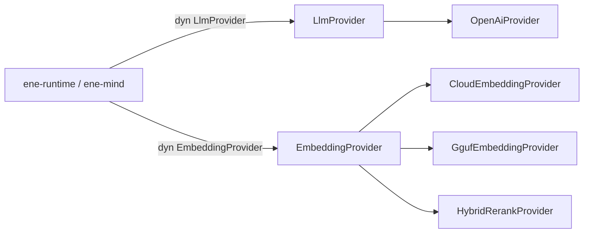

# `ene-ai` — APIリファレンス

> **クレート:** `ene-ai`
> **パス:** `crates/ene-ai`

`ene-ai` は LLM と埋め込みプロバイダーの統合レイヤーです（API v1 で旧 `ene-provider` + `ene-embedding` を統合）。チャット完了と埋め込みは `LlmProvider` / `EmbeddingProvider` 経由で流れます。クレート境界のエラーは [`AiError`](#aierror) です。入れ子のプロバイダ失敗は型付きペイロード（`LlmProviderError`、`EmbeddingError`）で報告されます。



## `EmbeddingProvider` トレイト

**トレイト上の必須操作は `embed_batch`（とメタデータ）のみ。** 単一テキスト／クエリは**フリー関数のみ** — トレイトメソッドではない。

```rust
#[async_trait]
pub trait EmbeddingProvider: Send + Sync {
    async fn embed_batch(
        &self,
        items: &[(&str, EmbeddingKind)],
    ) -> Result<Vec<Vec<f32>>, EmbeddingError>;

    fn dimensions(&self) -> usize;
    fn model_name(&self) -> &str;
}

pub async fn embed(
    provider: &dyn EmbeddingProvider,
    text: &str,
    kind: EmbeddingKind,
) -> Result<Vec<f32>, EmbeddingError>;

pub async fn embed_query(
    provider: &dyn EmbeddingProvider,
    text: &str,
) -> Result<Vec<f32>, EmbeddingError>;
```

| メソッド / 関数 | 備考 |
|---|---|
| `embed_batch(items)` | 必須のトレイトメソッド。出力順は入力順。空バッチは空 `Vec`。空白のみは `EmptyInput`。次元不一致は `DimensionMismatch`。 |
| `dimensions()` / `model_name()` | トレイト上のプロバイダメタデータ。 |
| `embed` / `embed_query` | `embed_batch` 上の**フリー関数のみ**（トレイトメソッドではない）。 |

**トレイトに含めないもの:** `hyde`、`has_reranker`、`rerank`。パイプラインヘルパーへ移動済み:

| ヘルパー | 場所 |
|---|---|
| `hyde_document` / `rerank_tool_specs` | `ene_ai::hybrid` |
| `HybridRerankProvider::{hyde, rerank, has_reranker}` | 固有メソッド |
| `CloudEmbeddingProvider::hyde` | 固有メソッド |

## ローカル GGUF（`GgufEmbeddingProvider`）

```rust
pub fn create_local_provider(
    local: &ResolvedLocalModel,
) -> Result<Box<dyn EmbeddingProvider>, EneEmbeddingError>;
```

`tasks.embedding.provider` が `"local"` のとき `AiConfig::resolve_embedding()` から得られる `ResolvedLocalModel` を渡します。初回利用時に `models/gguf/` へダウンロード（メモリ / Tool RAG が必要な場合は `EneHandle::open` で並列プリフェッチ）。進捗は `[GgufDownload] filename ████████░░ 82% 2.6/3.2 GB` 形式でログ出力。

## `Role` / `HistoryEntry`

```rust
pub enum Role { System, User, Assistant }
```

履歴型は単一の `HistoryEntry { role: Role, content: String }`（`ene-mind` 所有、`ene-runtime` が再エクスポート）。別途の `ConversationEntry` はない。

## `AiError`

クレート境界のエラー列挙（`thiserror`）。ホスト／mind の呼び出し側では `AiError` でマッチすることを推奨。入れ子の `LlmProviderError` / `EmbeddingError` は型付きマッチ用のペイロードとして利用できる。

## 関連

- [`ene-mind`](./ene-mind.md) — `HistoryEntry`、recall / compression
- [`ene-plugin-host`](./ene-plugin-host.md)
- [API v1 ADR](../architecture/api-v1.md)
