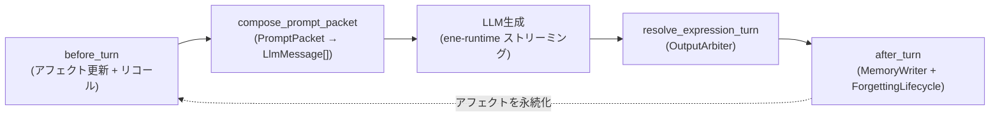

# `ene-mind` — APIリファレンス

> **クレート:** `ene-mind`
> **役割:** Ene AIコンパニオンの認知ランタイム — Identity Kernel、型付きメモリの書き込み/リコール、感情、表情の調停、プロンプト構成、コミットメント。

---

## 概要

`ene-mind` は [Ene 認知ランタイム](../architecture/cognitive-runtime.md) を実装します。LLM を「暗黙的に人格と記憶を保持する存在」としてではなく、「明示的に管理された認知状態を操作する発話生成器」として扱います。このクレートが担うのは:

- **Identity Kernel**（不変のキャラクターアイデンティティ。常にプロンプトに含まれる）
- **型付きメモリ** の抽出・調停・ハイブリッドリコール
- **感情エンジン**（決定論的アフェクト + オプションのLLM分類器）
- **表情の調停**（アフェクト → キャラクター表情、ヒステリシス付き）
- **コンテキスト予算管理** とローリング圧縮
- **セクション化されたプロンプトパケット** の構成
- **コンパニオン・コミットメント台帳**（約束、タスク、フォローアップ）

### クレートの境界

- 依存先: `ene-store`、`ene-config`、`ene-ai`
- 依存**しない**: `ene-runtime`（循環依存を防ぐため）
- `ene-runtime` が `ene-mind` に依存します（逆ではありません）。これにより mind ランタイムをストリーミングのライフサイクルに統合します。

### ターンライフサイクル

`CognitionEngine` 自体はLLM呼び出しを実行しません — それは `ene-runtime` のストリーミングループの中で、`compose_prompt_packet` と `resolve_expression_turn` の間で行われます。



1. **`before_turn`** — `AffectState` をロードし、感情エンジン（減衰 + 評価 + オプションのLLM分類器）を実行し、ハイブリッドメモリリコールを計画・実行し、アクティブなコミットメントを収集します。
2. **`compose_prompt_packet`** — Identity Kernel をコンパイルし、スタイル例を選択し、アクティブなシーンサマリーをロードし、それらすべてをトークン予算内の `PromptPacket` → `Vec<LlmMessage>` にパッキングします。
3. **LLM生成** — `ene-runtime` が構成済みメッセージを使って補完をストリーミングします。このクレートの範囲外です。
4. **`resolve_expression_turn`** — ターン後の `AffectState`（+ 任意のLLM表情ヒント）を `OutputArbiter` を介してキャラクター表情にマッピングします。
5. **`after_turn`** — `MemoryCandidate`（LLM 主経路 + 覚えて／忘れて安全ネット + ツール接地フォールバック。忘れては常時適用）を抽出し、`MemoryArbiter` を実行し、`CommitmentLedger` を同期し、`ForgettingLifecycle` を適用し、アフェクト状態を永続化します。

---

## `MindConfig`

トップレベルの設定で、`settings.json` の `mind` キー配下に登録されます（[`ene-config`](./ene-config.md) 参照）。

```rust
pub struct MindConfig {
    /// コンテキストとトークン予算の管理。
    pub context: ContextConfig,

    /// メモリの抽出、検索、保持設定。
    pub memory: MindMemoryConfig,

    /// 感情と表情処理の設定。
    pub emotion: EmotionConfig,

    /// キャラクターカードのコンパイル設定。
    pub character: CharacterMemoryConfig,
}
```

### `ContextConfig`

トークン予算の割り当て、圧縮トリガー、ローリング要約。サブ予算フィールド（`scene_summary_tokens`、`memory_budget_tokens`、`semantic_budget_tokens`、`style_example_budget_tokens`）の合計は `max_prompt_tokens` 以下でなければならず、これは起動時に `validate_context_config` によって検証されます。

| フィールド | 型 | デフォルト | 用途 |
|---|---|---|---|
| `max_prompt_tokens` | `usize` | `12_000` | プロンプト全体のトークン上限 |
| `recent_turns` | `usize` | `8` | そのまま保持される直近の会話ターン数 |
| `scene_summary_tokens` | `usize` | `800` | アクティブなシーンサマリーセクションの予算 |
| `memory_budget_tokens` | `usize` | `1_800` | リコールされたエピソード/プロフィールメモリの予算 |
| `semantic_budget_tokens` | `usize` | `1_200` | セマンティック/ロアブックメモリの予算 |
| `style_example_budget_tokens` | `usize` | `600` | CCv3スタイル例の予算 |
| `scene_turn_threshold` | `usize` | `12` | シーンレベル圧縮をトリガーするターン数 |
| `chapter_span_threshold` | `usize` | `5` | チャプターロールアップ前のシーンスパン数 |
| `arc_span_threshold` | `usize` | `3` | アークロールアップ前のチャプタースパン数 |
| `compression_timeout_secs` | `u64` | `60` | 1回の圧縮要約呼び出しのタイムアウト |

### `MindMemoryConfig`

メモリ抽出、ハイブリッド検索、保持、MMR多様化に関する設定。

| フィールド | 型 | デフォルト | 用途 |
|---|---|---|---|
| `default_forgetting_half_life_days` | `f64` | `30.0` | 減衰と新しさスコアリングの半減期 |
| `min_confidence_to_persist` | `f64` | `0.65` | 候補を永続化する最小確信度（ロード時に `0.0..=1.0` にクランプ） |
| `extraction_timeout_secs` | `u64` | `30` | 1回のLLM抽出呼び出しのタイムアウト |
| `tool_grounding` | `ToolGroundingConfig` | — | ツール結果のグラウンディング設定 |
| `recall_result_limit` | `usize` | `8` | 1つの計画で要求される型付きメモリの最大数 |
| `recall_similarity_threshold` | `f32` | `0.35` | 最小ベクトル類似度 |
| `recall_min_score` | `f32` | `0.20` | 最小ハイブリッド合計スコア |
| `mmr_lambda` | `f32` | `0.7` | MMRの関連性と多様性のトレードオフ（`0.0..=1.0`） |
| `mmr_duplicate_cluster_threshold` | `f32` | `0.75` | 重複クラスタ結合のための語彙的類似度 |
| `mmr_min_slots_semantic` / `_episodic` / `_user_profile` / `_commitment` | `usize` | 各 `1` | 種類ごとの最小予約リコールスロット数 |
| `mmr_source_diversity_bonus` | `f32` | `0.05` | 新しいリコールソースを導入した場合のスコアボーナス |
| `require_migration` | `bool` | `false` | レガシー行が存在し移行未完了の場合にリコールをブロックする |

### `ToolGroundingConfig`

| フィールド | 型 | デフォルト | 用途 |
|---|---|---|---|
| `max_summary_chars` | `usize` | `500` | ツール要約1件あたりの最大文字数 |
| `min_confidence` | `f32` | `0.60` | ツール由来の候補の最小確信度 |

### `EmotionConfig`

| フィールド | 型 | デフォルト | 用途 |
|---|---|---|---|
| `enabled` | `bool` | `true` | 感情処理を有効化する |
| `decay_half_life_minutes` | `f64` | `30.0` | アフェクト減衰の半減期 |
| `expression_hysteresis_seconds` | `f64` | `4.0` | 表情変更間の最小秒数 |
| `llm_can_propose_expression` | `bool` | `true` | LLMが表情トークンを提案することを許可する |
| `llm_expression_is_advisory` | `bool` | `true` | LLMの提案を命令ではなく助言として扱う |
| `classifier_timeout_secs` | `u64` | `15` | 1回のLLMアフェクト分類器呼び出しのタイムアウト |
| `classifier_min_confidence` | `f32` | `0.5` | LLMの絶対感情推定をブレンド適用する最小確信度 |
| `classifier_language` | `String` | `"en"` | 分類器と出力コントラクトのプロンプトライブラリ言語（`en` または `ja`） |

### `CharacterMemoryConfig`

| フィールド | 型 | デフォルト | 用途 |
|---|---|---|---|
| `identity_kernel_max_tokens` | `usize` | `400` | Identity Kernelの概算トークン予算上限 |

---

## `CognitionEngine`

中心となるファサード構造体です。各フィールドは軽量でほぼステートレスなプロセッサーであり、`CognitionEngine::new()` がデフォルト値で結線します。

```rust
pub struct CognitionEngine {
    pub pre_turn: pre_turn::PreTurnAnalyzer,
    pub context: context::ContextManager,
    pub memory_writer: memory_writer::MemoryWriter,
    pub recall: recall::RecallPlanner,
    pub emotion: emotion::EmotionEngine,
    pub character: character::CharacterProcessor,
    pub prompt_packet: prompt_packet::PromptPacket,
    pub output: output::OutputArbiter,
    pub commitments: commitments::CommitmentLedger,
}
```

### メソッド

| メソッド | シグネチャ | 説明 |
|---|---|---|
| `new` | `fn new() -> Self` | デフォルトのサブプロセッサーでエンジンを構築する。`Default` 経由でも利用可能。 |
| `validate_config` | `fn validate_config(config: &MindConfig) -> Result<(), CognitionError>` | `context` のサブ予算の合計が `max_prompt_tokens` 以下であることを検証する。 |
| `sync_character_memories` | `async fn sync_character_memories(&self, ctx: TurnContext<'_>, previous_hash: Option<u64>) -> Result<(CharacterMemorySyncReport, u64), CognitionError>` | カードのコンテンツハッシュが変化した際にCCv3ロアブック/スタイルエントリを型付きメモリに再インデックスする。`ctx.store` と `ctx.embedder` が必要。 |
| `before_turn` | `async fn before_turn(&self, ctx: TurnContext<'_>) -> Result<PreTurnOutput, CognitionError>` | アフェクトをロードし、感情エンジンを実行し、ハイブリッドリコールを計画・実行し、アクティブなコミットメントを収集する。 |
| `persist_affect_snapshot` | `async fn persist_affect_snapshot(store: &MemoryStore, affect: &AffectState) -> Result<(), CognitionError>` | プレターン更新の直後にアフェクト状態を永続化する（ストリームのキャンセル/失敗時にも生き残る）。 |
| `compose_prompt_packet` | `async fn compose_prompt_packet(&self, ctx: TurnContext<'_>, pre: &PreTurnOutput, prefetch: ComposePrefetch) -> Result<ComposedPrompt, CognitionError>` | Identity Kernelをコンパイルし、スタイル例/シーン（`prefetch` または内部取得）をパッキングし、予算内にまとめて `Vec<LlmMessage>` に変換する。 |
| `after_turn` | `async fn after_turn(&self, store: &MemoryStore, config: &MindConfig, input: PostTurnInput<'_>, providers: MemoryWriteProviders<'_>) -> Result<(), CognitionError>` | 完全同期のポストターンパス（`write_memories` → forgetting → affect 永続化）。単一 await が必要なテスト・呼び出し元向け。 |
| `finalize_turn_post` | `async fn finalize_turn_post(&self, store: &MemoryStore, config: &MindConfig, input: &PostTurnInput<'_>) -> Result<(), CognitionError>` | 同期ポストターン finalize: `upsert_affect_state` のみ。`ene-runtime` は `Terminal` の前に呼ぶ。 |
| `write_memories_deferred` | `async fn write_memories_deferred(&self, store: &MemoryStore, config: &MindConfig, input: &OwnedPostTurnInput, providers: MemoryWriteProviders<'_>) -> Result<(), CognitionError>` | 遅延 LLM 抽出 + arbiter、続けて自然忘却。`ene-runtime` は `Terminal` 後に spawn し、ターンゲートをブロックしてはならない。 |
| `resolve_expression_turn` | `fn resolve_expression_turn(&self, config: &MindConfig, card: &CharacterCardV3, affect: &AffectState, response_text: &str, llm_proposal: Option<&str>, previous_expression: &str, elapsed_since_change: Option<Duration>) -> (ExpressionDecision, AffectState)` | 完了したアシスタントターンの最終的なキャラクター表情を `OutputArbiter` 経由で解決する。判定結果と、`last_expression` が更新された `AffectState` を返す。 |

---

## ライフサイクルDTO（`lifecycle`）

エンジンの公開メソッド間で共有されるターン入出力の型です。

### `HistoryEntry`

```rust
pub struct HistoryEntry {
    /// 発言者ロール（`ene-ai` の `Role`）。
    pub role: Role,
    /// メッセージ本文。
    pub content: String,
}
```

### `TurnContext<'a>`

1回の会話ターンの入力コンテキストです。値渡し（フィールドは借用）で `before_turn`、`compose_prompt_packet`、`sync_character_memories` に渡されます。

```rust
pub struct TurnContext<'a> {
    pub config: &'a MindConfig,
    pub card: &'a CharacterCardV3,
    pub character_id: &'a str,
    pub user_name: &'a str,
    pub session_id: &'a str,
    pub user_input: &'a str,
    pub history: &'a [HistoryEntry],
    pub store: Option<&'a MemoryStore>,
    pub query_embedding: Option<&'a [f32]>,
    pub embedder: Option<&'a Arc<dyn EmbeddingProvider>>,
    pub llm_provider: Option<Arc<dyn LlmProvider>>,
    pub post_history_block: Option<&'a str>,
}
```

`TurnContext::recent_recall_turns(&self) -> Vec<RecallTurn<'_>>` は、`config.context.recent_turns` を上限として `history` からリコールプランナー用のターンスライスを構築します。

### `PreTurnOutput`

```rust
pub struct PreTurnOutput {
    pub recall_plan: RecallPlan,
    pub affect: AffectState,
    pub recalled: Vec<RecalledMemory>,
    pub commitments: Vec<ActiveCommitmentPrompt>,
    /// 確信度がしきい値を満たした場合の分類器の表情ヒント。
    pub classifier_expression_hint: Option<String>,
}
```

### `ComposedPrompt` / `PromptPacketMeta`

```rust
pub struct ComposedPrompt {
    pub messages: Vec<LlmMessage>,
    pub meta: PromptPacketMeta,
}

pub struct PromptPacketMeta {
    pub identity_kernel_included: bool,
    pub style_example_count: usize,
    pub recalled_memory_count: usize,
    pub post_history_included: bool,
    pub scene_summary_included: bool,
    pub dropped_sections: Vec<PromptSectionKind>,
    pub packed_tokens: usize,
}
```

### `PostTurnInput<'a>`

```rust
pub struct PostTurnInput<'a> {
    pub turn: memory_writer::candidate::TurnInput<'a>,
    pub affect: AffectState,
    pub character_id: &'a str,
    pub user_id: &'a str,
}
```

---

## `character` — Identity Kernel & ロアブック同期

### `IdentityKernel`

```rust
pub struct IdentityKernel {
    /// キャラクター表示名。
    pub name: String,
    /// レンダリングされたIdentity Kernelテキスト（常に最初に注入され、決して切り詰められない）。
    pub text: String,
    /// カーネル本体から分離されたポストヒストリー指示。
    pub post_history_instructions: Option<String>,
}
```

`IdentityKernel::has_post_history_instructions(&self) -> bool` — 出力コントラクトのプロンプトセクション向けに、空でないPHIテキストが利用可能かどうか。

### `CharacterCompiler`

CCv3キャラクターカードを決定論的に `IdentityKernel` にコンパイルします。コアヘッダー行（`Name`、`Role`、`Core personality`、`Speech style`、`Hard instruction`）は常に含まれ、オプションセクション（`system_prompt`、`description`、`scenario`、`creator_notes`）は結果が `max_tokens`（1トークン≈4文字）以内に収まる限り追加されます。

| メソッド | シグネチャ | 説明 |
|---|---|---|
| `compile` | `fn compile(card: &CharacterCardV3, user_name: &str, max_tokens: usize) -> IdentityKernel` | 明示的なトークン予算でカーネルをコンパイルする。 |
| `compile_identity_kernel`（フリー関数） | `fn compile_identity_kernel(card: &CharacterCardV3, user_name: &str) -> IdentityKernel` | `DEFAULT_IDENTITY_KERNEL_MAX_TOKENS`（`400`）を使う後方互換ラッパー。 |

`CharacterProcessor`（`character::mod` 内）は、ほとんどの呼び出し元が使うファサードです: `compile_kernel`、`compile_kernel_default`、`sync_card_memories`、`select_style_examples`。

### ロアブック & スタイル同期

| 項目 | 説明 |
|---|---|
| `LorebookIndexer::compile_entries(card, user_name) -> Vec<NewMemoryItem>` | CCv3 `character_book` エントリを `ccv3:lorebook:*` 配下の `source_ref` を持つ `MemoryKind::Semantic` アイテムにコンパイルする。定数エントリはピン留めされ、キートリガー付きエントリは保存内容の先頭に `Triggers: …` を付加する。 |
| `StyleExampleSelector::compile_items(card, user_name) -> Vec<NewMemoryItem>` | `mes_example` の対話チャンクを `ccv3:style:*` プロシージャメモリにコンパイルする。 |
| `StyleExampleSelector::select(...) -> Vec<StyleExample>` | 決定論的な意図ヒューリスティック（挨拶、慰め、ジョークなど）に基づき、現在のターン用のスタイル例を選択する。 |
| `sync_character_memories(store, embedder, character_id, user_name, card, config, previous_hash) -> Result<(CharacterMemorySyncReport, u64), CognitionError>` | 完全な同期を行う: 結合コンテンツハッシュを計算し、変更がない場合は処理をスキップし、古い行をアーカイブし、変更されたエントリを挿入/上書きする。 |
| `compute_card_memory_hash(card) -> u64` | lorebook+style の結合コンテンツハッシュ。セッション hash 一致時に毎ターン sync をスキップするために使う。 |

```rust
pub struct CharacterMemorySyncReport {
    pub lorebook_inserted: usize,
    pub lorebook_updated: usize,
    pub style_inserted: usize,
    pub style_updated: usize,
    pub archived: usize,
    /// 同期がスキップされた場合（カードハッシュ未変化または無効化）に `true`。
    pub skipped: bool,
}
```

---

## `emotion` — 感情エンジン

### `EmotionEngine`

```rust
pub struct EmotionEngine;

impl EmotionEngine {
    pub fn update_turn(&self, config: &EmotionConfig, input: &mut TurnAffectInput<'_>) -> AffectUpdateResult;
}
```

`update_turn` は次の順序で実行されます: (1) `elapsed_since_update` に基づくベースラインへの指数減衰、(2) `user_message` の決定論的評価（`llm_only` の場合はスキップ）、(3) `classifier_proposal` の確信度で重み付けされたオプションの助言的マージ。その後、すべての次元をクランプし、`compute_mood_label` により `mood_label` を再計算します。

### `TurnAffectInput<'a>`

```rust
pub struct TurnAffectInput<'a> {
    pub state: &'a mut AffectState,
    pub user_message: &'a str,
    pub elapsed_since_update: Duration,
    pub recent_turn_count: usize,
    pub classifier_proposal: Option<AffectProposal>,
    pub classifier_min_confidence: f32,
    /// trueの場合、決定論的評価をスキップする（LLMのみモード）。
    pub llm_only: bool,
}
```

`TurnAffectInput::with_proposal(self, proposal: AffectProposal) -> Self` — ビルダー形式で分類器の提案を付加する。

### `AffectProposal`

オプションのLLM感情分類器の出力（会話後の絶対推定値。助言のみで、`classifier_min_confidence` 未満はブレンドしません）。

```rust
pub struct AffectProposal {
    pub user_emotion: String,
    pub user_intent: String,
    pub valence: f32,
    pub arousal: f32,
    pub irritation: f32,
    pub affinity: f32,
    pub recommended_expression: String,
    pub confidence: f32,
    pub reason: String,
}
```

### `AffectUpdateResult` / `AffectUpdateReason` / `AffectDelta`

```rust
pub struct AffectUpdateResult {
    pub mood_label: String,
    pub reasons: Vec<AffectUpdateReason>,
}

pub struct AffectUpdateReason {
    /// 短いカテゴリラベル（例: `decay`、`gratitude`、`classifier`）。
    pub category: &'static str,
    pub detail: String,
    pub deltas: Vec<AffectDelta>,
}
```

`compute_mood_label(state: &AffectState) -> String` は、PAD次元から人が読める形式のラベル（`irritated`、`tired`、`cheerful`、`content`、`upset`、`down`、`alert`、`calm`、`curious`、`neutral`）をこの優先順位でチェックして導出します。

---

## `output` — 表情調停器

### `OutputArbiter`

```rust
pub struct OutputArbiter;

impl OutputArbiter {
    pub fn resolve(&self, config: &EmotionConfig, input: &ExpressionInput<'_>) -> ExpressionDecision;
}
```

解決順序: アフェクト → 表情マッピング（`affect_to_expression`）、次にオプションのLLMヒントブレンディング（`llm_expression_is_advisory` に応じて助言モードまたは命令モード）、次に軽量な応答テキストのセンチメント調整、次にヒステリシス保持（`irritation_spike` の場合を除く）、最後に `neutral`/最も近い利用可能な表情へのフォールバック。

### `ExpressionInput<'a>`

```rust
pub struct ExpressionInput<'a> {
    pub affect: &'a AffectState,
    pub available: &'a [ResolvedExpression],
    pub llm_proposal: Option<&'a str>,
    pub previous_expression: &'a str,
    pub elapsed_since_change: Option<Duration>,
    pub response_text: &'a str,
    pub irritation_spike: bool,
}
```

### `ExpressionDecision` / `ExpressionSource`

```rust
pub struct ExpressionDecision {
    pub expression: String,
    pub reason: String,
    pub source: ExpressionSource,
}

pub enum ExpressionSource {
    AffectMapping,
    LlmAdvisory,
    LlmCommand,
    HysteresisHold,
    FallbackNeutral,
}
```

フリー関数: `affect_to_expression(state: &AffectState) -> &'static str`（PAD → 候補名）と `normalize_expression(name: &str, available: &[String]) -> String`（別名マップ + レーベンシュタイン距離による最近傍フォールバック）。

---

## `prompt_packet` — セクション化されたプロンプト構成

### `PromptSectionKind`

決定論的なレンダリング順序（ドロップ優先度の参照にもなる — `context::ContextBudget` を参照）:

```
PlatformContract → IdentityKernel → BehaviorContract → CharacterState → SceneState
→ SemanticContext → UserProfile → ActiveCommitments → EpisodicMemories → StyleExamples
→ OutputContract → UserInput
```

`PlatformContract`、`IdentityKernel`、`OutputContract`、`UserInput` は `is_required()`（予算超過時も決して除外されない）です。`heading()` はシステムブロックセクションに対してレンダリングされるMarkdownの見出しを返します（例: `## Semantic Context`）。`PlatformContract`、`IdentityKernel`、`OutputContract`、`UserInput` は見出しなしでレンダリングされます。

### `PromptSection`

```rust
pub struct PromptSection {
    pub kind: PromptSectionKind,
    pub content: String,
    pub required: bool,
    pub budget_tokens: usize,
}
```

### `PromptPacket`

```rust
pub struct PromptPacket {
    pub sections: Vec<PromptSection>,
    pub history: Vec<HistoryEntry>,
}
```

| メソッド | シグネチャ | 説明 |
|---|---|---|
| `section` | `fn section(&self, kind: PromptSectionKind) -> Option<&PromptSection>` | 最初に一致するセクション。 |
| `section_included` | `fn section_included(&self, kind: PromptSectionKind) -> bool` | セクションに空でないコンテンツがあるかどうか。 |
| `to_llm_messages` | `fn to_llm_messages(&self) -> (Vec<LlmMessage>, PromptPacketMeta)` | システムセクション（空行で結合）を1つの `LlmMessage::System` にレンダリングし、`history` を個別のメッセージとして追加し、次に（存在する場合）`OutputContract` を別のシステムメッセージとして追加し、最後に `UserInput` を最終の `LlmMessage::User` とする。 |
| `compose` | `fn compose(kernel, style_examples, recalled, commitments, affect_summary, history, post_history_block, user_input, max_prompt_tokens, style_example_budget_tokens) -> Self` | レガシーな簡易コンストラクタ。予算を意識した構成には [`context::pack_prompt`] を推奨する。 |

`classify_recalled_memories(recalled: &[RecalledMemory]) -> (Vec<&RecalledMemory>, Vec<&RecalledMemory>, Vec<&RecalledMemory>)` は、リコールされたメモリを `MemoryKind`/`MemorySource` によって `(semantic, profile, episodic)` のバケットに分割します。`render_commitments_block(commitments: &[ActiveCommitmentPrompt]) -> String` は `## Active Commitments` の本文をレンダリングします。

---

## `context` — 予算 & 圧縮

### `ContextBudget` / `pack_prompt`

```rust
pub struct ContextBudget {
    pub total_tokens: usize,
    pub section_budgets: [usize; 12],
}

impl ContextBudget {
    pub fn from_config(config: &ContextConfig) -> Self;
    pub fn from_config_and_hints(config: &ContextConfig, hints: &RecallBudgetHints) -> Self;
}
```

```rust
pub struct PackInput {
    pub platform_contract: Option<String>,
    pub identity_kernel: IdentityKernel,
    pub behavior_contract: Option<String>,
    pub style_examples: Vec<StyleExample>,
    pub recalled: Vec<RecalledMemory>,
    pub commitments: Vec<ActiveCommitmentPrompt>,
    pub affect_summary: Option<String>,
    pub scene_summary: Option<String>,
    pub history: Vec<HistoryEntry>,
    pub output_contract: Option<String>,
    pub user_input: String,
}

pub struct PackedPrompt {
    pub packet: PromptPacket,
    pub meta: BudgetMeta,
}

pub struct BudgetMeta {
    /// オーバーフローにより除外されたセクション（優先度の低いものから）。
    pub dropped: Vec<PromptSectionKind>,
    pub history_messages_dropped: usize,
    pub packed_tokens: usize,
}

pub fn pack_prompt(input: PackInput, budget: &ContextBudget) -> PackedPrompt;
```

オーバーフローポリシー。パッキングされた合計が `budget.total_tokens` を超えた場合にのみ適用されます:

1. 各セクション独自の `budget_tokens` へのセクション単位の切り詰め（必須セクションは対象外）。
2. `DROP_ORDER` の順でのセクション全体の除外: `StyleExamples → EpisodicMemories → SemanticContext → UserProfile → ActiveCommitments → CharacterState`。
3. `EpisodicMemories → SemanticContext → UserProfile` のリコールメモリセクション*内*での確信度が低いものから順のトリミング（各セクションに最低1件は残す）。
4. 古いものから順の履歴トリミング。最低 `MIN_HISTORY_MESSAGES`（`2`）は保持する。

`validate_context_config(config: &ContextConfig) -> Result<(), CognitionError>` は、動的サブ予算の合計を `max_prompt_tokens` と照合します。`CognitionEngine::validate_config` から使用されます。

### 圧縮

| 項目 | 説明 |
|---|---|
| `CompressionLevel` | `Scene = 0`、`Chapter = 1`、`Arc = 2`。`memory_spans.compression_level` に保存される。 |
| `CompressionReason` | `TurnThreshold { turn_count }` \| `ContextPressure { ratio }` \| `Manual`。 |
| `evaluate_compression_trigger(config, turn_count, history_len) -> Option<CompressionReason>` | `turn_count >= scene_turn_threshold` の場合、または履歴が直近ターン数上限の1.25倍を超えた場合に発火する。 |
| `execute_compression(store, provider, input: CompressionTaskInput) -> Result<CompressionResult, CognitionError>` | 同期的な要約 + `insert_memory_span`。 |
| `spawn_compression_task(pending, store, provider, input)` / `poll_compression_result(pending)` | `oneshot` チャネル + `tokio::spawn` を使ったバックグラウンド版。 |
| `load_active_scene_summary(store, session_id) -> Result<Option<ActiveSceneSummary>, CognitionError>` | プロンプト注入用に現在のシーンサマリーをロードする。 |
| `maybe_roll_up_chapter(store, provider, session_id, character_name, user_name, config) -> Result<Option<CompressionResult>, CognitionError>` | `chapter_span_threshold` 個のシーンが存在すると、シーンスパンをチャプターサマリーにロールアップする。 |
| `compression_has_usable_summary(result: &CompressionResult) -> bool` | 要約が空でないテキストを生成したかどうか。 |

要約処理は、固定のシステムプロンプト（アイデンティティ/人格を絶対に書き換えない、2〜4文の要約、プレーンテキストのみ）でLLMを呼び出し、`compression_timeout_secs` のタイムアウトが適用されます。失敗またはタイムアウトの場合は `None` になります（スパン自体は記録され、サマリーは空になります）。

---

## `recall` — リコール計画とハイブリッド実行

### `RecallPlanner` / `RecallPlan`

`RecallPlanner` は純粋で同期的なプランナーです — データベースに触れず、埋め込みプロバイダーも呼び出し**ません**。

```rust
pub struct RecallPlan {
    pub current_topic: String,
    pub semantic_queries: Vec<String>,
    pub episodic_queries: Vec<String>,
    pub required_kinds: Vec<MemoryKind>,
    pub scope: RecallScopeFilter,
    pub budget: RecallBudgetHints,
    pub search: RecallSearchHints,
}
```

| メソッド | シグネチャ | 説明 |
|---|---|---|
| `plan` | `fn plan(input: &RecallPlannerInput<'_>, options: &RecallPlannerOptions) -> Result<RecallPlan, CognitionError>` | トピック/アフェクトから `RecallIntent` を推論し、セマンティック/エピソードクエリのバリアントを構築し、予算/検索ヒントを埋める。空のターンテキストではエラーになる。 |
| `to_memory_search_options` | `fn to_memory_search_options<'a>(plan: &'a RecallPlan, query_embedding: &'a [f32], model_name: &'a str, now: DateTime<Utc>, memory: &MindMemoryConfig) -> Query<'a>` | プランのプライマリクエリを `ene-store::Query` にマッピングし、`mind.memory.*` からハイブリッド重み / commitment boost を埋める（#123）。 |
| `explain_results` | `fn explain_results(scored: Vec<ScoredMemory>) -> Vec<RecalledMemory>` | 各ハイブリッド検索結果に `RecallReason` とスコアの詳細を付加する。 |

`RecallPlannerOptions::from_config(context: &ContextConfig, memory: &MindMemoryConfig) -> Self` は、この2つの設定セクションからプランナーオプション（予算、しきい値）を導出します。

### `RecalledMemory` / `RecallReason`

```rust
pub struct RecalledMemory {
    pub item: MemoryItem,
    pub reason: RecallReason,
    pub score_breakdown: MemoryScoreBreakdown,
    pub sources: Vec<MemoryCandidateSource>,
}

pub enum RecallReason {
    SimilarTopic,
    RecentConversation,
    ActivePromise,
    CharacterLore,
    UserPreference,
    EmotionalContinuity,
    Pinned,
}
```

`infer_recall_reason(scored: &ScoredMemory) -> RecallReason` は、次の優先順位で正確に1つの主要な理由を選びます: コミットメント → CCv3ロア → 好み/プロフィール → 感情的/高い感情マッチ（`EMOTIONAL_MATCH_REASON_THRESHOLD = 0.85` 以上） → 直近/エピソード → 類似トピックへのフォールバック。

### `execute_hybrid_recall`

```rust
pub async fn execute_hybrid_recall(
    config: &MindConfig,
    input: &ExecuteRecallInput<'_>,
) -> Result<(RecallPlan, Vec<RecalledMemory>), CognitionError>
```

`CognitionEngine::before_turn` から使用されるエンドツーエンドのパイプラインです: 計画 → ハイブリッドベクトル＋字句検索 → MMR多様化（`MemoryDiversifyPipeline`） → `RecalledMemory` へのマッピング → ロアブックのキー/定数マッチのマージ → アクセスカウンターの更新。レガシーの要約とキーファクトはマージせず、必要な場合は store/CLI の移行 API を明示的に実行します。

---

## `memory_writer` — 抽出、調停器、忘却

### `MemoryWriter`

```rust
pub struct MemoryWriter;

impl MemoryWriter {
    pub async fn write_memories(store: &MemoryStore, config: &MindConfig, input: &PostTurnInput<'_>, providers: MemoryWriteProviders<'_>) -> Result<(), CognitionError>;
    pub async fn finalize_turn(store: &MemoryStore, config: &MindConfig, input: &PostTurnInput<'_>) -> Result<(), CognitionError>;
    pub async fn apply_forgetting(store: &MemoryStore, config: &MindConfig, input: &PostTurnInput<'_>) -> Result<(), CognitionError>;
    pub async fn after_turn(store: &MemoryStore, config: &MindConfig, input: PostTurnInput<'_>, providers: MemoryWriteProviders<'_>) -> Result<(), CognitionError>;
}
```

`after_turn` = `write_memories`（LLM 主経路、覚えて／忘れて安全ネット、ツールグラウンディングを含む → `MemoryArbiter` → `CommitmentLedger` 同期）に続いて `apply_forgetting`、続けて `finalize_turn`（`upsert_affect_state` のみ）です。本番ストリーミングの `ene-runtime` は `Terminal` の前に `finalize_turn_post`（affect のみ）を await し、その後 `write_memories_deferred`（抽出 + forgetting）を spawn します。ホストは `MemoryWriter` ではなく `CognitionEngine` のメソッドのみを呼びます（#121）。

### `MemoryCandidate`

抽出器によって生成され、`MemoryArbiter` によって消費される中間表現です。

```rust
pub struct MemoryCandidate {
    pub kind: MemoryKind,
    pub title: String,
    pub content: String,
    /// 抽出のトリガーとなった会話からの正確な引用。
    pub source_quote: String,
    pub confidence: f32,
    /// 削除リクエスト候補の場合は `false`。
    pub should_persist: bool,
    /// 削除リクエストの場合: 対象メモリを検索するために使われるキー。
    pub deletion_target_key: Option<String>,
    /// コミットメント候補の場合: 期日/期限の参照（例: "next week"）。
    pub commitment_due: Option<String>,
}
```

### `MemoryArbiter`

永続化前に検証、重複排除、矛盾解決を行います。

| メソッド | シグネチャ | 説明 |
|---|---|---|
| `evaluate_all` | `fn evaluate_all(candidates: &[MemoryCandidate], existing: &[MemoryItem], ctx: &ArbiterContext<'_>) -> Vec<CandidateDecision>` | 純粋な判定関数（I/Oなし）。バッチ内重複候補も拒否する。 |
| `arbitrate_and_apply` | `async fn arbitrate_and_apply(store: &MemoryStore, candidates: &[MemoryCandidate], ctx: &ArbiterContext<'_>) -> Result<Vec<AppliedDecision>, CognitionError>` | アクティブ/フェード/異議のある既存メモリをロードし、評価し、適用する。 |
| `apply_decisions` | `async fn apply_decisions(store: &MemoryStore, decisions: &[CandidateDecision]) -> Result<Vec<AppliedDecision>, CognitionError>` | 事前に計算された判定をストアに適用する。 |

#### `ArbiterAction` / 判定テーブル

| 判定 | 発生条件 |
|---|---|
| `Persist(NewMemoryItem)` | 候補が検証を通過し、矛盾がない |
| `Ignore` | 確信度が低い、フィールドが空、`source_quote` がターン内に見つからない、完全/セマンティック/バッチ重複、または削除対象が見つからない |
| `Supersede { new_item, superseded_id }` | 新しい証拠が既存の確信度を `supersede_confidence_delta`（デフォルト `0.05`）以上上回る |
| `MarkDisputed { memory_id }` | 弱い矛盾 — 確信度差が `dispute_confidence_gap`（デフォルト `0.15`）未満 |
| `MarkUserDeleted { memory_id }` | ユーザーの削除リクエストが既存メモリに一致した |
| `AskConfirmationLater` | あいまいな矛盾。ユーザー確認まで保留 |

`ArbiterOptions`（デフォルト）: `min_confidence: 0.65`、`supersede_confidence_delta: 0.05`、`semantic_similarity_threshold: 0.85`、`dispute_confidence_gap: 0.15`。`ArbiterContext::semantic_matches: HashMap<usize, Vec<SemanticMatch>>` には、呼び出し元が事前計算したベクトル検索マッチを設定する必要があります。調停器自体は埋め込み呼び出しを一切行いません。

### `ForgettingLifecycle`

```rust
pub struct ForgettingLifecycle;

impl ForgettingLifecycle {
    pub async fn apply(store: &MemoryStore, ctx: &ForgettingContext<'_>, config: &MindMemoryConfig) -> Result<ForgettingReport, CognitionError>;
}

pub struct ForgettingReport {
    pub skipped: bool,
    pub faded_count: usize,
    pub archived_count: usize,
}
```

時間ベースの `Active → Faded → Archived` 減衰のみを処理します（`MemoryStore::apply_natural_decay_batch` 経由。半減期は `default_forgetting_half_life_days`、256行ずつバッチ処理）。ユーザーによる明示的な忘却および矛盾に基づく遷移（`UserDeleted`、`Disputed`、`Superseded`）は `MemoryArbiter` が担います。`config.decay_enabled` が `false` の場合はノーオペレーション（`skipped: true`）です。

### `tool_grounding`

| 関数 | 説明 |
|---|---|
| `summarize_tool_result(tool_name, raw_output, success, max_summary_chars) -> ToolResultSummary` | 生のツール出力を正規化し（大きなスクリーンショットのペイロードは固定のセンチネルにマスクする）、`max_summary_chars` に切り詰める。 |
| `extract_tool_candidates(tool_results: &[ToolResultSummary], cfg: &ToolGroundingConfig) -> Vec<MemoryCandidate>` | `Procedure`（成功）、`Reflection`（失敗）、短い `Episodic`（ユーザーに見える成功）の候補を生成し、`cfg` によって種類ごとにゲートする。ツール由来の候補はすべて空の `source_quote` を使う — `tool_results` が空でない場合、調停器の引用チェックはスキップされる。 |

---

## `commitments` — コンパニオン・コミットメント台帳

約束、タスク、フォローアップを専用の `commitments` テーブル（`ene-store`）で追跡し、`source_memory_id` を介して型付きメモリ（`MemoryKind::Commitment`）にリンクします。ベクトルリコールの類似度とは**独立して**プロンプトに表示されます。

```rust
pub struct CommitmentLedger;
```

| メソッド | シグネチャ | 説明 |
|---|---|---|
| `sync_from_applied_decisions` | `async fn sync_from_applied_decisions(store: &MemoryStore, ctx: &CommitmentSyncContext<'_>, applied: &[AppliedDecision]) -> Result<Vec<i64>, CognitionError>` | `MemoryArbiter` の判定結果を台帳の行に変換する: `Commitment` 候補に対する `Persist`/`Supersede` はアクティブな行を挿入する（上書きされた行があれば `Stale` にする）。`MarkUserDeleted` はリンクされた行をキャンセルする。`MarkDisputed` は `Stale` にする。`source_memory_id` ごとに冪等。 |
| `arbitrate_apply_and_sync` | `async fn arbitrate_apply_and_sync(store, candidates, arbiter_ctx, sync_ctx) -> Result<(Vec<AppliedDecision>, Vec<i64>), CognitionError>` | 便利関数: 調停 + 適用 + 同期を1回の呼び出しで行う。 |
| `list_active` | `async fn list_active(store: &MemoryStore, character_id: &str, user_id: Option<&str>, limit: usize) -> Result<Vec<Commitment>, CognitionError>` | アクティブなコミットメントを一覧表示する（類似度フィルタリングなし）。 |
| `active_prompt_candidates` | `fn active_prompt_candidates(commitments: &[Commitment]) -> Vec<ActiveCommitmentPrompt>` | 軽量なプロンプトDTOにマッピングする。 |
| `complete` / `cancel` | `async fn complete(store, id) -> Result<bool, CognitionError>` / `async fn cancel(...)` | 手動でのライフサイクル遷移。 |
| `mark_stale_overdue` | `async fn mark_stale_overdue(store: &MemoryStore, now: DateTime<Utc>) -> Result<usize, CognitionError>` | 期限切れのアクティブな行（パース済みの `due_at`）を `Stale` にする。 |

**ライフサイクル:** `Active → Done \| Cancelled \| Stale`。`Commitment`/`CommitmentStatus`/`NewCommitment`/`ActiveCommitmentPrompt` は `ene-store` が所有するドメイン型であり、クレートのルートで再エクスポートされています。

---

## `error` — `EneCognitionError` / `CognitionError`

`CognitionError` は `EneCognitionError` の型エイリアスです。どちらの名前も相互に使用できます。

```rust
pub enum EneCognitionError {
    Memory(#[from] ene_store::EneMemoryError),
    Config(#[from] ene_config::EneConfigError),
    Provider(#[from] ene_ai::LlmProviderError),
    Embedding(#[from] ene_ai::EmbeddingError),
    ExtractionFailed(String),
    ArbitrationFailed(String),
    RecallFailed(String),
    EmotionFailed(String),
    PromptBuildError(String),
    BudgetExceeded(String),
    InvalidState(String),
    Other(String),
}

pub type CognitionError = EneCognitionError;
```

---

## `pre_turn`（スタブ）

```rust
pub struct PreTurnAnalyzer;
```

専用のターン意図分類と入力解析のために予約されたエントリーポイントです。現在はプレースホルダーです — `CognitionEngine::before_turn` は `PreTurnAnalyzer` に委譲する代わりに、アフェクト更新とリコール計画をインラインで実行しています。

---

## 使用例スケッチ

```rust,no_run
use std::time::Duration;
use ene_mind::{CognitionEngine, MindConfig};
use ene_mind::lifecycle::{TurnContext, HistoryEntry, PostTurnInput};

async fn run_turn(
    engine: &CognitionEngine,
    config: &MindConfig,
    ctx: TurnContext<'_>,
) -> Result<(), Box<dyn std::error::Error>> {
    // 1. プレターン: アフェクト更新 + リコールの計画・実行。
    let pre = engine.before_turn(TurnContext { ..ctx }).await?;

    // 2. セクション化されたプロンプトパケットをLLMメッセージに構成する。
    let composed = engine.compose_prompt_packet(TurnContext { ..ctx }, &pre, ComposePrefetch::default()).await?;

    // 3. ene-runtime が `composed.messages` を使ってLLM補完をストリーミングする
    //    （このクレートの範囲外）。
    let response_text = "..."; // ストリーミングループから得られる

    // 4. このターンのキャラクター表情を解決する。
    let (decision, updated_affect) = engine.resolve_expression_turn(
        config,
        ctx.card,
        &pre.affect,
        response_text,
        None,
        &pre.affect.last_expression,
        Some(Duration::from_secs(30)),
    );
    println!("expression: {} ({})", decision.expression, decision.reason);

    // 5. ポストターン: 抽出、調停、忘却、アフェクト永続化。
    let store = ctx.store.expect("memory store required");
    engine
        .after_turn(
            store,
            config,
            PostTurnInput {
                turn: ene_mind::memory_writer::candidate::TurnInput {
                    user_message: ctx.user_input,
                    assistant_message: Some(response_text),
                    tool_results: &[],
                },
                affect: updated_affect,
                character_id: ctx.character_id,
                user_id: ctx.user_name,
            },
        )
        .await?;

    Ok(())
}
```

---

## 関連項目

- [認知ランタイムアーキテクチャ（ADR）](../architecture/cognitive-runtime.md) — 設計思想全体、ターンライフサイクル、用語集
- [`ene-store`](./ene-store.md) — 型付きメモリストア、ハイブリッド検索、コミットメント永続化
- [`ene-runtime`](./ene-runtime.md) — ターンライフサイクル全体を統括し、このクレートを呼び出す
- [`ene-mind`](./ene-mind.md) — `TurnContext::history` に渡される会話履歴
