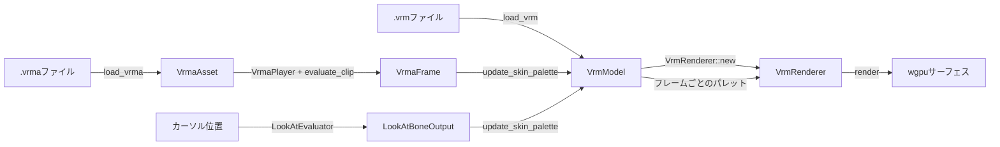

# `ene-vrm` — APIリファレンス

> **クレート:** `ene-vrm`
> **役割:** `ene-desktop` 向けのVRM 1.0モデルローダー + MToonレンダラー（`wgpu` ベース）。

---

## 概要

`ene-vrm` はディスクから `.vrm`（glTFバイナリ + `VRMC_vrm` 拡張）ファイルを読み込み、すべてのメッシュプリミティブをGPUにアップロードし、VRMのMToonトゥーンシェーディングを近似するwgpuパイプラインでレンダリングします。プラットフォームに依存しません — このクレートはウィンドウやイベントループを持たず、`ene-desktop` が `wgpu::Device`/`Queue`/サーフェスを提供し、フレームごとの更新ループを駆動します。



各モジュールの役割の概観:

- **`loader`** — `.vrm` を解析し、GPUバッファ/テクスチャをアップロードし、派生するすべてのレジストリ（ヒューマノイド、ルックアット、表情、スプリングボーン、ノードコンストレイント）を構築する。
- **`model`** — ロード済みでGPUに常駐する `VrmModel`、および骨格アニメーションを駆動するCPU側のノード階層。
- **`renderer`** — wgpuパイプライン、バインドグループ、描画ループ。
- **`expression` / `expression_override`** — ブレンドシェイプ（モーフターゲット）の重みと、VRMのプロシージャル表情の上書きルール。
- **`humanoid` / `look_at` / `animation` / `spring_bone` / `node_constraint`** — フレームごとにボーンを駆動するVRM 1.0拡張データ。
- **`mtoon`** — パースされたMToonシェーディングパラメータと、そのGPUユニフォームへの反映。
- **`camera` / `post_process` / `debug_renderer`** — `ene-desktop` が利用する小さなレンダリングユーティリティ群。

本ドキュメントは、デスクトップホストが実際に呼び出すエントリーポイントと型に焦点を当てています。内部のWGSLバインドグループの配線やシェーダーレイアウトの定数は、公開APIの契約に影響する場合を除き省略しています。

---

## サポート API と内部 API

| 区分 | シンボル | 備考 |
|---|---|---|
| **サポート（`prelude` を使用）** | `load_vrm`, `VrmModel`, `VrmRenderer`, `VrmError`, `VrmaAsset`, `VrmaPlayer`, `VrmaFrame`, `evaluate_clip`, `load_vrma`, `LookAtEvaluator`, `LookAtProperties`, `ExpressionLayer`, `ExpressionName`, `VisemeAnalyzer`, `VisemeWeights` | [`ene_vrm::prelude`](../../../../crates/ene-vrm/src/prelude.rs) に集約。新しいホストコードはここから始める。 |
| **サポート（desktop も使用）** | `camera::*`, `debug_renderer::*`, `humanoid::*`, `spring_bone::SpringBoneSimulator`, `spring_bone::SpringBoneProperties`, `model::{NodeHierarchy, Skeleton, MeshVertex}`, `expression_override::apply_overrides` | コアの load→render ループに次点だが `ene-desktop` が依存している。 |
| **内部（`#[doc(hidden)]`）** | `load_humanoid_bones`, `load_look_at`, `load_spring_bones`, `load_node_constraints`, `load_expression_overrides`, `load_mtoon_materials`, `texture_flags`, `retarget_rotation`, `quat_to_yaw_pitch`, `HUMANOID_BONE_NAMES`, `MOUTH_TARGET_NAMES`, … | `load_vrm` またはレンダラーから呼ばれる。rustdoc の索引を絞るため非表示。型は `pub` のまま — サポート型のフィールドとして到達可能なものもある。 |

### `prelude`

```rust
use ene_vrm::prelude::*;
```

上記サポートサブセットを再エクスポートする。それ以外は `ene_vrm::camera::…` などで高度なホスト向けに引き続き import 可能。

---

## `load_vrm` & `VrmError`

```rust
pub fn load_vrm(
    path: impl AsRef<Path>,
    device: &wgpu::Device,
    queue: &wgpu::Queue,
) -> VrmResult<VrmModel>
```

`.vrm` ファイル（glTFバイナリのみ — `.gltf` + 外部 `.bin` はサポート対象外）を読み込み、`VRMC_vrm` 拡張の存在を検証し、glTFの**すべての** `Mesh`/`Primitive` を走査します（VRM 1.0モデルは通常、体・髪・顔・服・アクセサリーなど約12個の独立したメッシュを持ちます）。そして頂点/インデックスバッファ、ベースカラーテクスチャ、最初のスキンの逆バインド行列をアップロードします。同じパスでヒューマノイドボーンレジストリ、ルックアットプロパティ、表情レイヤー + オーバーライド、スプリングボーンプロパティ、ノードコンストレイントも構築します。すべてのプリミティブの座標は、モデルの最も長いAABB軸が `1.5` mになるよう一様に正規化されます。

既知のスコープの制限（詳細はモジュールドキュメントを参照）: 生の頂点座標に対してメッシュごとのglTFノード変換は適用されません（VRoid系のエクスポートには問題ありません）。また、MToonのより完全なPBRパラメータ（リム/マットキャップ/アウトライン/エミッション）は読み取られますが、パイプライン選択には部分的にしか反映されません。

### `VrmError`

```rust
pub enum VrmError {
    Io { path: String, source: std::io::Error },
    Gltf(String),
    NotVrm,
    NoMeshes,
    NoPositions(usize),
    UnsupportedTopology { mesh: usize, primitive: usize },
    TextureDecode(String),
    Wgpu(#[from] wgpu::CreateSurfaceError),
}

pub type VrmResult<T> = Result<T, VrmError>;
```

| バリアント | 意味 |
|---|---|
| `Io` | `path` のファイル読み込みに失敗した。 |
| `Gltf` | `gltf` クレートがバイナリをパースできなかった。 |
| `NotVrm` | glTFとしてはパースできるが `VRMC_vrm` 拡張が存在しない。 |
| `NoMeshes` | glTFドキュメントにメッシュが1つもない。 |
| `NoPositions` | 指定されたインデックスのメッシュに `POSITION` 属性を持たないプリミティブがある。 |
| `UnsupportedTopology` | プリミティブが三角形リスト以外のトポロジーを使用している。 |
| `TextureDecode` | マテリアルテクスチャ（例: `KHR_materials_unlit` のベースカラー）のデコードに失敗した。 |
| `Wgpu` | サーフェス/デバイス作成の失敗（`#[from] wgpu::CreateSurfaceError`）。 |

---

## `VrmModel` / `VrmMesh` / `Skeleton` / `NodeHierarchy` / `MeshVertex`

### `VrmModel`

トップレベルのロード済みモデルです — アニメーションに必要なすべてのGPUリソースとCPU側のレジストリを所有します。

```rust
pub struct VrmModel {
    pub meshes: Vec<VrmMesh>,
    pub skeleton: Skeleton,
    pub expressions: ExpressionLayer,
    pub humanoid: HumanoidBoneRegistry,
    pub nodes: NodeHierarchy,
    pub look_at: Option<LookAtProperties>,
    pub expressions_meta: Vec<ExpressionDefinition>,
    pub node_constraints: NodeConstraintRegistry,
    pub spring_bones: Option<SpringBoneProperties>,
    // aabb_min / aabb_max / center / normalize_scale はプライベート。
    // 以下のアクセサを使用する。
}
```

| メソッド | シグネチャ | 説明 |
|---|---|---|
| `new` | `fn new(meshes, skeleton, aabb_min, aabb_max, center, normalize_scale, expressions, humanoid, nodes, look_at, expressions_meta, node_constraints, spring_bones) -> Self` | ローダーとテストフィクスチャが使うコンストラクタ。 |
| `aabb` | `fn aabb(&self) -> ([f32; 3], [f32; 3])` | 生のglTF空間のAABB `(min, max)`。 |
| `center` | `fn center(&self) -> [f32; 3]` | 生のglTF空間でのAABB中心。 |
| `normalize_scale` | `fn normalize_scale(&self) -> f32` | `1.5 / max_extent` — モデル行列に折り込まれる一様スケール。 |
| `normalized_aabb` | `fn normalized_aabb(&self) -> ([f32; 3], [f32; 3])` | `T(-center) * S(normalize_scale)` を適用した後のAABB。 |
| `joint_count` | `fn joint_count(&self) -> usize` | `Skeleton::joint_count` に委譲する。 |
| `expressions` / `expressions_mut` | `fn expressions(&self) -> &ExpressionLayer` / `fn expressions_mut(&mut self) -> &mut ExpressionLayer` | ブレンドシェイプの重みマップの読み取り/書き込み。 |
| `look_at` | `fn look_at(&self) -> Option<&LookAtProperties>` | `VRMC_vrm.lookAt` ブロックを持たないモデルでは `None`（`LookAtProperties::default()` にフォールバックする）。 |
| **`update_skin_palette`** | `fn update_skin_palette(&mut self, frame: &VrmaFrame, look_at: Option<&LookAtBoneOutput>) -> Vec<Mat4>` | フレームごとのアニメーションの中核となるエントリーポイント — 詳細は下記。 |

#### `VrmModel::update_skin_palette`

1つのアニメーションフレームをノード階層に適用し、`VrmRenderer::update_skin_palette` に渡せる形のスキンジョイントパレット（`Vec<Mat4>`）を返します。アルゴリズムは以下の順序です:

1. **レストポーズへのリセット** — `nodes.rest_local_rotations`/`rest_local_positions` を可変な `local_*` バッファに書き戻す（前フレームの上書きを取り消す）。
2. **VRMAのボーン回転を適用** — `frame.bone_rotations` の各 `(bone_name, rotation)` について、`humanoid.by_name` でボーンを検索し、そのローカル回転を上書きする。未知のボーン名は静かに無視される。
3. **ルックアットのボーンデルタを適用** — `head`/`leftEye`/`rightEye` について、`look_at` が単位クォータニオンでないデルタを持っている場合、ローカル回転を `rest_local_rotations[node] * delta` で上書きする。この処理はステップ2の**後**に実行されるため、同じボーンに対してはアクティブなルックアットがVRMAの回転よりも優先される。
4. **階層を巡回** — `nodes.compute_world_transforms()` が `world_rotations`/`world_positions` を埋める。
5. **腰（hips）の並行移動** — `frame.hips_translation` が設定されており `hips` のヒューマノイドエントリが存在する場合、腰のワールド位置にデルタを加算し、すべての子孫ノードにカスケードする。
6. **パレットを構築** — 各スケルトンジョイント `j` について、`palette[j] = joint_world * inverse_bind[j]`（標準的なglTFスキニングの恒等式。レスト時は恒等行列に収束する）。

モデルのスケルトンジョイントがゼロ、またはノード階層が空の場合は空の `Vec` を返します — レンダラーの静的な恒等パレットが維持され、GPUへの書き込みは不要です。

### `VrmMesh` / `VrmPrimitive`

```rust
pub struct VrmMesh {
    pub primitives: Vec<VrmPrimitive>,
}

pub struct VrmPrimitive {
    pub vertex_buf: wgpu::Buffer,
    pub vertex_count: u32,
    pub index_buf: wgpu::Buffer,
    pub index_count: u32,
    pub vertices: Vec<MeshVertex>,       // CPU側のミラー（生のglTF空間）
    pub base_color: Option<Arc<VrmTexture>>,
    pub alpha_mode: AlphaMode,
    pub unlit: bool,
    pub mtoon: Option<MToonMaterial>,
    pub mtoon_textures: Option<Arc<MToonGpuTextures>>,
}
```

glTFの `Mesh` オブジェクト（体、髪、顔、服、…）ごとに1つの `VrmMesh`。その中のglTFプリミティブごとに1つの `VrmPrimitive`。`AlphaMode::render_phase() -> u8` は、`Opaque`/`Mask`（デプス書き込みON）に対して `0`、`Blend`（デプス書き込みOFF、不透明の後に描画）に対して `1` を返します。

### `Skeleton`

```rust
pub struct Skeleton {
    pub inverse_bind: Vec<Mat4>,
    pub bind_matrices: Vec<Mat4>, // inverse_bind[i].inverse() — 後方互換のために保持
    pub joint_to_node: Vec<usize>,
}

impl Skeleton {
    pub fn joint_count(&self) -> usize;
}
```

glTFの最初のスキンからロードされます。フレームごとのスキン行列は常に `joint_world * inverse_bind[i]` です — **決して** `* bind_matrices[i]` ではありません。それを使うとバインド変換が二重に適用されてしまいます。

### `NodeHierarchy`

```rust
pub struct NodeHierarchy {
    pub local_rotations: Vec<Quat>,       // フレームごとに変更される
    pub local_positions: Vec<Vec3>,       // フレームごとに変更される
    pub rest_local_rotations: Vec<Quat>,  // ロード時に取得される
    pub rest_local_positions: Vec<Vec3>,  // ロード時に取得される
    pub parents: Vec<i32>,                // ルートは -1
    pub world_rotations: Vec<Quat>,
    pub world_positions: Vec<Vec3>,
}
```

| メソッド | シグネチャ | 説明 |
|---|---|---|
| `len` | `fn len(&self) -> usize` | 取得されたglTFノードの数。 |
| `is_empty` | `fn is_empty(&self) -> bool` | ノードが0個の不正なモデルの場合に `true`。 |
| `compute_world_transforms` | `fn compute_world_transforms(&mut self)` | glTFの順序（親が子より先）でノードを巡回し、`local_*` + `parents` から `world_rotations`/`world_positions` を埋める。 |

### `MeshVertex`

```rust
#[repr(C)]
pub struct MeshVertex {
    pub position: [f32; 3],
    pub uv: [f32; 2],
    pub normal: [f32; 3],
    pub joints: [u32; 4],   // MAX_JOINTS_PER_VERTEX = 4 まで
    pub weights: [f32; 4],  // 合計 == 1.0
}
```

`MeshVertex::LAYOUT: wgpu::VertexBufferLayout<'static>` は共有される頂点レイアウト定数です（属性 `0..=4`。`shaders/mtoon_skinned.wgsl` と一致）。`MeshVertex::as_bytes(vertices: &[MeshVertex]) -> &[u8]` は、バッファアップロード用にスライスを再解釈します。`JOINTS_0`/`WEIGHTS_0` を持たないモデルは `joints = [0,0,0,0]`、`weights = [1,0,0,0]` にフォールバックし、1要素の恒等 `skin[]` に対して計算されます。

---

## `VrmRenderer`

```rust
pub struct VrmRenderer { /* wgpuパイプライン + バインドグループ。非公開フィールド */ }
```

| メソッド | シグネチャ | 説明 |
|---|---|---|
| `new` | `fn new(device: &wgpu::Device, queue: &wgpu::Queue, surface_format: wgpu::TextureFormat, mask_format: Option<wgpu::TextureFormat>, model: &VrmModel) -> Self` | すべてのレンダーパイプライン（不透明/透明 × リット/アンリット/MToon、および任意のマスクパイプライン）、バインドグループレイアウト、`model` のジョイント数に合わせたスキン行列ストレージバッファを構築する。 |
| `render` | `fn render(&self, queue: &wgpu::Queue, encoder: &mut wgpu::CommandEncoder, view: &wgpu::TextureView, depth_view: &wgpu::TextureView, model: &VrmModel, camera: &OrthographicCamera, model_uniform: &ModelUniform, transparent: bool)` | カメラ/モデルのユニフォームをアップロードし、レンダーパスを開始し、すべてのプリミティブを描画する: まず不透明/マスク（デプス書き込みON）、次に透明（デプス書き込みOFF）を、それぞれMToon/アンリット/liteパイプラインに振り分ける。`transparent` はパスのクリアカラーを選択する。 |
| `render_mask` | `fn render_mask(&self, queue: &wgpu::Queue, encoder: &mut wgpu::CommandEncoder, view: &wgpu::TextureView, model: &VrmModel, camera_uniform: &CameraUniform, model_uniform: &ModelUniform)` | `mask_format` から構築されたパイプラインを使って `view` にシルエットマスクをレンダリングする。レンダラーが `mask_format: None` で構築された場合はノーオペレーション。 |
| **`update_skin_palette`** | `fn update_skin_palette(&self, queue: &wgpu::Queue, palette: &[glam::Mat4])` | （`VrmModel::update_skin_palette` から得た）新しいスキン行列パレットをGPUストレージバッファにアップロードする。`palette` が空、またはレンダラーのスキンジョイント数が0の場合はノーオペレーション。 |
| `skin_joint_count` | `fn skin_joint_count(&self) -> u32` | レンダラーに組み込まれたジョイント数（スキンなしモデルの場合は `0`）。 |

モデルのベースカラーテクスチャはグループ `(2)` に、プリミティブごとのモーフターゲットデータはグループ `(3)` に、スキン行列パレットはグループ `(4)` に、MToonのマテリアルごとのユニフォームとテクスチャはグループ `(5)`/`(6)` にバインドされます。

---

## `expression` & `expression_override`

### `ExpressionLayer`

```rust
pub struct ExpressionLayer {
    pub per_primitive: Vec<Option<PrimitiveMorphs>>,
    pub weights: BTreeMap<ExpressionName, f32>,
    pub morph_target_weights: BTreeMap<(usize, usize), f32>,
}
```

| メソッド | シグネチャ | 説明 |
|---|---|---|
| `new` | `fn new(per_primitive: Vec<Option<PrimitiveMorphs>>, overrides: Option<&[ExpressionDefinition]>) -> Self` | 既知のすべての表情名について `weights` を `0.0` で初期化する。 |
| `expression_names` | `fn expression_names(&self) -> Vec<ExpressionName>` | モデルが定義するすべての表情の、ソート済み・重複排除済みリスト。 |
| `set_expression` | `fn set_expression(&mut self, name: &ExpressionName, weight: f32) -> bool` | `[0, 1]` にクランプして保存する。`name` がモデルの既知の表情でない場合は `false` を返し（保存**しない**）、誤字のあるAIトークンが静かに蓄積するのを防ぐ。 |
| `apply_weights` | `fn apply_weights(&mut self, incoming: &BTreeMap<ExpressionName, f32>)` | 重みマップを一括適用する。未知の名前は同様に除外される。デスクトップアプリの感情適用ステップからフレームごとに1回呼ばれることを想定している。 |
| `apply_viseme_weights` | `fn apply_viseme_weights(&mut self, weights: &crate::viseme::VisemeWeights)` | 5つの `VisemeWeights` フィールドを、`expression_override::MOUTH_TARGET_NAMES`（`aa`/`ih`/`ou`/`ee`/`oh`）をイテレートしてプロシージャル口ターゲットへ写像し、それぞれに `set_expression` を呼ぶ（#L7）。 |
| `morphic_primitive_count` | `fn morphic_primitive_count(&self) -> usize` | 少なくとも1つのモーフターゲットを持つプリミティブの数。 |

`PrimitiveMorphs { primitive_id, node_index, targets: Vec<MorphTarget>, uniform_buffer_len, vertex_count }` は1プリミティブのモーフターゲットを保持し、`MorphTarget { target_index, position_offsets }` は1つの名前付きブレンドシェイプの頂点ごとの変位です。`ExpressionName(pub String)` は薄いニュータイプのキーです。

### `expression_override`

VRM 1.0では、名前付き表情によって上書き可能なプロシージャル表情カテゴリ（口の動き/リップシンク、まばたき、視線）が定義されています。

```rust
pub const MOUTH_TARGET_NAMES: &[&str]; // ["aa", "ih", "ou", "ee", "oh"]
pub const BLINK_TARGET_NAMES: &[&str]; // ["blink", "blinkLeft", "blinkRight"]
pub const GAZE_TARGET_NAMES: &[&str];  // ["lookUp", "lookDown", "lookLeft", "lookRight"]

pub fn is_procedural(name: &str) -> bool;

pub enum ExpressionOverrideType { None, Block, Blend }

pub struct ExpressionOverrideSettings {
    pub mouth: ExpressionOverrideType,
    pub blink: ExpressionOverrideType,
    pub look_at: ExpressionOverrideType,
}

pub struct ExpressionDefinition {
    pub name: ExpressionName,
    pub overrides: ExpressionOverrideSettings,
    pub is_binary: bool,
    pub morph_target_binds: Vec<MorphTargetBind>,
}
```

`load_expression_overrides(gltf: &gltf::Gltf) -> Vec<ExpressionDefinition>` は、ロード時に `VRMC_vrm.expressions.{preset,custom}.<name>` ツリーを解析します。`apply_overrides(weights: &mut BTreeMap<ExpressionName, f32>, defs: &[ExpressionDefinition])` は `Block`/`Blend` のセマンティクスをインプレースで適用します: `Block` は、上書きする表情が有効な間、プロシージャルターゲットをゼロにします。`Blend` は `1 − sum(上書きする重みの合計)` を乗算します。

---

## `viseme` — 音声駆動リップシンク

PCM 音声のストリームを、VRM プロシージャルリップシンクターゲット（`aa`、`ih`、`ou`、`ee`、`oh` — `expression_override::MOUTH_TARGET_NAMES` 参照）で使われる5つの口形状ブレンドシェイプ重みへ変換する純粋な DSP です。音声 I/O は一切行わず、`ene-vrm` をレンダリング専用に保ちます: サンプルのキャプチャとスケジューリングはホストが担当します。

```rust
pub struct VisemeWeights {
    pub aa: f32, // 開いた口（"father"）
    pub ih: f32, // 横に広がる / 笑顔（"bit"）
    pub ou: f32, // 丸めた口（"boot"）
    pub ee: f32, // 横に広い（"beet"）
    pub oh: f32, // 小さく丸めた（"boat"）
}
// すべてのフィールドは [0, 1]。`Default` はすべてゼロ（口を閉じた状態）。

pub struct VisemeAnalyzer { /* リングバッファ + FFT プラン + 平滑化重み */ }

impl VisemeAnalyzer {
    pub fn new(sample_rate: u32) -> Self;
    pub fn window_size(&self) -> usize;
    pub fn push_pcm(&mut self, pcm: &[f32]);
    pub fn analyze(&mut self) -> VisemeWeights;
    pub fn reset(&mut self);
}
```

| メソッド | 説明 |
|---|---|
| `new(sample_rate)` | 指定サンプルレート（Hz）用のアナライザーを構築する。解析ウィンドウは約20msの音声にサイズされ、次の2の累乗へ切り上げられる。FFT スクラッチバッファは `max(window_size, fft.get_inplace_scratch_len())` にサイズされ、`process_with_scratch` がバッファ不足でパニックしないようにする（#M6）。 |
| `window_size` | 1つの解析ウィンドウに保持される PCM サンプル数。 |
| `push_pcm(pcm)` | モノラル `[-1, 1]` サンプルをリングバッファに追加し、ウィンドウを超える最古のサンプルを捨てる。 |
| `analyze` | バッファされた音声を解析し、平滑化された重みを返す。レンダーフレームごとに1回呼ぶ。サンプルが少なすぎると重みはゼロへ減衰する。 |
| `reset` | リングバッファをクリアし、平滑化重みをゼロにリセットする。 |

フレームごとの特徴量: **RMS 振幅**が口全体の開き度を駆動し（無音ではすべての重みがゼロへ収束）、**ゼロ交差率**が丸めた母音（低レート）と広がった母音（高レート）を識別し、小さな **FFT** が各フレームを5つの周波数帯域へ分割して、開いた / 中低域の母音（`aa`、`oh`）と高周波の広がった母音（`ih`、`ee`）を区別します。生の推定値は非対称な指数移動平均（高速アタック、低速リリース）を通り、ジッターを抑えつつ音声を追従します。

典型的な使い方: `push_pcm` でサンプルを与え、レンダーフレームごとに1回 `analyze` を呼び、その結果を `ExpressionLayer::apply_viseme_weights` へ渡します。

---

## ヒューマノイドボーン（`humanoid`）

```rust
pub struct VrmBone(pub String); // 正規化された小文字の名前。例: "hips"

pub struct BoneRestTransform {
    pub translation: Vec3,
    pub rotation: Quat,
}

pub struct HumanoidBoneEntry {
    pub node: usize,           // glTFノードインデックス（常に設定される）
    pub joint: Option<usize>,  // Skeleton::inverse_bind へのインデックス（スキンされている場合）
    pub rest: BoneRestTransform,
}

pub struct HumanoidBoneRegistry { /* マップ + 挿入順序 */ }
```

| メソッド | シグネチャ | 説明 |
|---|---|---|
| `new` | `fn new() -> Self` | 空のレジストリ。 |
| `insert` | `fn insert(&mut self, bone: VrmBone, entry: HumanoidBoneEntry) -> bool` | ボーンを登録する。 |
| `lookup` | `fn lookup(&self, bone: &VrmBone) -> Option<&HumanoidBoneEntry>` | 正確な `VrmBone` キーでの検索。 |
| `by_name` | `fn by_name(&self, raw_name: &str) -> Option<&HumanoidBoneEntry>` | まず `raw_name` を正規化する — `update_skin_palette`、ルックアット、スプリングボーンが使う検索パス。 |
| `head` / `hips` / `chest` / `jaw` / `left_eye` / `right_eye` | `fn head(&self) -> Option<&HumanoidBoneEntry>`（など） | 最も一般的に使われるボーンへの便利なアクセサ。 |
| `iter` / `names` / `len` / `is_empty` | — | 標準的なコレクションアクセサ。 |

`HUMANOID_BONE_NAMES: &[&str]` は仕様が定める55のボーン名すべてを列挙します。`canonicalize_bone_name(raw: &str) -> Option<VrmBone>` は任意の大文字小文字/スペーシングを正規形に正規化します。`load_humanoid_bones(gltf: &gltf::Gltf, skel: &Skeleton) -> HumanoidBoneRegistry` は `VRMC_vrm.humanoid.humanBones` からレジストリを構築します。ヒューマノイドメタデータを持たないモデル（例: レガシーなVRM 0.x）では空になります。

---

## `look_at`

```rust
pub struct LookAtProperties {
    pub offset_from_head_bone: [f32; 3], // デフォルト (0, 0.06, 0)
    pub range_map: LookAtRangeMapSet,
    pub look_at_type: LookAtType,        // Bone（デフォルト） | Expression
}
```

`LookAtType::Bone` は `head`/`leftEye`/`rightEye` のボーン回転を駆動し、`LookAtType::Expression` は代わりに `lookUp`/`lookDown`/`lookLeft`/`lookRight` の4つのモーフ重みを駆動します。

```rust
pub struct LookAtEvaluator { /* &LookAtProperties から構築される */ }

impl LookAtEvaluator {
    pub fn new(props: &LookAtProperties) -> Self;
    pub fn evaluate(
        &self,
        head_world: Vec3,
        target_world: Vec3,
        head_rest_rotation: Quat,
    ) -> LookAtOutput;
}

pub enum LookAtOutput {
    Bone(LookAtBoneOutput),
    Expression(LookAtExpressionOutput),
}

pub struct LookAtBoneOutput {
    pub head: LookAtBoneDelta,
    pub left_eye: LookAtBoneDelta,
    pub right_eye: LookAtBoneDelta,
}
```

`evaluate` は `head_world`/`target_world` から（`calc_yaw_pitch` 経由で）`(yaw, pitch)` を計算し、モデルの `range_map` を通し、`look_at_type` に応じてボーン回転デルタまたはモーフ重みのいずれかを生成します。`Bone` バリアントは、`VrmModel::update_skin_palette` の `look_at` 引数が直接消費するものです。`load_look_at(gltf: &gltf::Gltf) -> Option<LookAtProperties>` は `VRMC_vrm.lookAt` ブロックを解析します（このブロックを持たないモデルでは `None` — 呼び出し元は `LookAtProperties::default()` にフォールバックすべきです）。

---

## `animation`（VRMA）

### `load_vrma`

```rust
pub fn load_vrma(path: impl AsRef<Path>) -> VrmResult<VrmaAsset>
```

`.vrma` ファイル（glTFバイナリ + `VRMC_vrm_animation` 拡張）を読み込み、そのボーン/表情/ルックアットの意味論的マッピング（→ノード）と、すべてのglTF `animations[]` クリップを解析します。

```rust
pub struct VrmaAsset {
    pub properties: VrmaProperties, // ボーン/表情/lookAt名 → glTFノードインデックス
    pub clips: Vec<VrmaClip>,       // 通常は1つ。仕様ではデフォルトで clips[0] をロードする
    pub node_rest_rotations: Vec<Quat>,
    pub node_rest_positions: Vec<Vec3>,
    pub node_world_rest_rotations: Vec<Quat>,
    pub node_world_rest_positions: Vec<Vec3>,
    pub node_parents: Vec<i32>,
}

pub struct VrmaClip {
    pub name: String,
    pub duration: f32,
    pub bone_channels: HashMap<String, BoneChannel>,
    pub expression_channels: HashMap<String, ExpressionChannel>,
    pub look_at_channel: Option<LookAtChannel>,
}
```

### `evaluate_clip` → `VrmaFrame`

```rust
pub fn evaluate_clip(clip: &VrmaClip, t: f32) -> VrmaFrame

pub struct VrmaFrame {
    pub bone_rotations: HashMap<String, Quat>,
    pub hips_translation: Option<Vec3>,
    pub expression_weights: HashMap<String, f32>,
    pub look_at_yaw_pitch: Option<(f32, f32)>,
}
```

`clip` の各チャンネルを時刻 `t` でサンプリングし（サンプラーの補間モードに応じて `Step`/`Linear`/`CubicSpline`）、リターゲット前の生のボーン回転とクランプ済みの表情重みを返します。呼び出し元はこの結果をそのまま `VrmModel::update_skin_palette` に渡します。異なるレストポーズを持つスケルトン間の完全なポーズ差分リターゲティングは、フリー関数の `retarget_rotation` と `retarget_hips_translation` から利用できますが、自動的には適用されません — T-poseやA-poseの規約を共有するVRoid系モデルの場合、ソースのローカル回転をそのまま使用できます。

### `VrmaPlayer`

```rust
pub struct VrmaPlayer {
    pub time: f32,
    pub speed: f32,
    pub playing: bool,
    pub repeat: RepeatMode, // Once | Loop（デフォルト）
}
```

| メソッド | シグネチャ | 説明 |
|---|---|---|
| `play` / `pause` / `stop` | `fn play(&mut self)` / `fn pause(&mut self)` / `fn stop(&mut self)` | 標準的なトランスポート操作。`stop` は `time` も `0.0` にリセットする。 |
| `seek` | `fn seek(&mut self, time: f32)` | 絶対時刻にジャンプする（`≥ 0` にクランプ）。 |
| `advance` | `fn advance(&mut self, dt: f32, duration: f32)` | `time` を `dt * speed` だけ進める。`Loop` では `duration` を法として折り返し、`Once` ではクランプして停止する。`!playing` または `duration <= 0.0` の場合はノーオペレーション。 |

典型的なフレームごとの使い方: `player.advance(dt, clip.duration)` に続けて `evaluate_clip(&clip, player.time)`。

---

## `spring_bone`（概要）

VRM 1.0の `VRMC_springBone` によるソフトボディの揺れ（髪、服、アクセサリー）をシミュレートします。

```rust
pub struct SpringBoneProperties { /* コライダー、コライダーグループ、スプリングチェーン */ }
pub struct SpringBoneChain { pub joints: Vec<SpringBoneJoint>, /* ... */ }
pub struct SpringBoneSimulator { /* ジョイントごとのランタイム状態 */ }

pub fn load_spring_bones(gltf: &gltf::Gltf) -> Option<SpringBoneProperties>;
```

`load_spring_bones` はロード時に `VRMC_springBone` を解析します（拡張が存在しない場合は `None`）。デスクトップランタイムは `VrmModel::spring_bones` から `SpringBoneSimulator` を構築し、フレームごとにverlet方式のジョイント物理を進め、その結果の回転をVRMA/ルックアットと並んでノード階層に反映します。デフォルトの物理定数（`DEFAULT_HIT_RADIUS`、`DEFAULT_STIFFNESS`、`DEFAULT_GRAVITY_POWER`、`DEFAULT_GRAVITY_DIR`、`DEFAULT_DRAG_FORCE`）は、仕様で欠落しているジョイントごとのフィールドを補完します。

---

## `mtoon`（概要）

glTFマテリアルごとに `VRMC_materials_mtoon` のシェーディングパラメータを解析し、GPUフレンドリーな型に反映します。

```rust
pub struct MToonMaterial { /* シェード色、シェーディングシフト/トゥーニー、リム、マットキャップ、アウトライン、エミッシブ、UVアニメーションなど */ }
pub struct MToonGpuTextures { /* シェード乗算、シェーディングシフト、エミッシブ、マットキャップ、リム乗算、アウトライン幅、UVアニメーションマスク */ }
pub struct MToonUniform { /* MToonMaterial のスカラーフィールドをバイト単位でミラーするWGSL構造体 */ }
pub enum OutlineWidthMode { /* None | WorldCoordinates | ScreenCoordinates */ }

pub fn load_mtoon_materials(gltf: &gltf::Gltf) -> Vec<Option<MToonMaterial>>;
```

`VrmPrimitive::mtoon` / `mtoon_textures` は、拡張を持たないマテリアルでは `None` になり、その場合 `VrmRenderer` はハーフランバートの「lite」シェーダーにフォールバックします。

---

## `camera` / `post_process` / `debug_renderer`（概要）

### `camera`

```rust
pub struct OrthographicCamera { /* eye、target、up、viewport_height、aspect */ }
pub struct CameraUniform { pub view_proj: [[f32; 4]; 4], pub camera_pos: [f32; 4] }
pub struct ModelUniform { /* フレームごとのモデル行列ユニフォーム */ }
```

主なメソッド: `OrthographicCamera::look_at(eye, target)`、`set_aspect(aspect)`、`compute_auto_fit_scale(aabb_min, aabb_max, margin) -> f32`（AABBを余白付きでビューポートに収まるようスケーリングする）、`uniform() -> VrmResult<CameraUniform>`（`VrmRenderer::render` が消費するフレームごとのビュー射影ユニフォームを構築する）。フリー関数の `pixel_to_ndc`、`ndc_to_view_pos[_with_aspect]`、`view_pos_to_world` は、`look_at` 用のカーソル→ワールド座標の投影をサポートします。

### `post_process`

```rust
pub struct PostProcessor { /* フルスクリーンパスのパイプライン + ユニフォーム */ }
```

`PostVertex`/`PostUniforms` を使って、フルスクリーンのポストプロセッシングパス（例: レンダリングされたキャラクターをマスク/背景に合成する）を適用します。

### `debug_renderer`

```rust
pub struct DebugRenderer { /* ラインリストパイプライン */ }
```

デバッグ用のプリミティブ（ボーンの軸、コライダーの球/カプセル、ルックアットのクロスヘア）をGPUのラインリストとして描画します。ヘルパー関数の `sphere_wireframe_lines_into`、`capsule_wireframe_lines_into`、`cross_lines` は、スプリングボーンのコライダーとルックアットターゲット用の `DebugLine`/`DebugVertex` ジオメトリを生成します。

---

## `node_constraint`（概要）

`VRMC_node_constraint`（ボーン間のロール/エイム/回転コピーのコンストレイント）を実装します。アクセサリーのリグ（例: 別のボーンをエイムすべきヘアクリップ）に使用されます。

```rust
pub enum NodeConstraint {
    Rotation { source_node: usize, weight: f32 },
    Roll { source_node: usize, roll_axis: RollAxis, weight: f32 },
    Aim { source_node: usize, aim_axis: AimAxis, weight: f32 },
}

pub struct NodeConstraintRegistry { pub entries: Vec<ConstraintEntry> }

impl NodeConstraintRegistry {
    pub fn evaluate(
        &self,
        node_local_rotations: &HashMap<usize, Quat>,
        node_rest_rotations: &HashMap<usize, Quat>,
        node_world_positions: &HashMap<usize, Vec3>,
        node_parent_world_rotations: &HashMap<usize, Quat>,
    ) -> HashMap<usize, Quat>;
}

pub fn load_node_constraints(/* … */) -> NodeConstraintRegistry;
```

`evaluate` は `HashMap<dest_node, new_local_rotation>` を返します。呼び出し元は、スキンパレットを構築する前に、基本のVRMA/ルックアットの結果の上にこれを適用します。

---

## 使用例スケッチ

```rust,no_run
use std::path::Path;
use std::time::Duration;

use ene_vrm::{
    animation::{VrmaClip, VrmaPlayer, evaluate_clip},
    load_vrm, ModelUniform, OrthographicCamera, VrmModel, VrmRenderer,
};

fn setup(
    device: &wgpu::Device,
    queue: &wgpu::Queue,
    surface_format: wgpu::TextureFormat,
) -> Result<(VrmModel, VrmRenderer), Box<dyn std::error::Error>> {
    // 1. モデルをロードし、レンダラーを一度だけ構築する。
    let model = load_vrm(Path::new("assets/models/character.vrm"), device, queue)?;
    let renderer = VrmRenderer::new(device, queue, surface_format, None, &model);
    Ok((model, renderer))
}

fn per_frame(
    model: &mut VrmModel,
    renderer: &VrmRenderer,
    queue: &wgpu::Queue,
    encoder: &mut wgpu::CommandEncoder,
    view: &wgpu::TextureView,
    depth_view: &wgpu::TextureView,
    camera: &OrthographicCamera,
    player: &mut VrmaPlayer,
    clip: &VrmaClip,
    dt: Duration,
) {
    // 2. アニメーションの再生を進め、フレームをサンプリングする。
    player.advance(dt.as_secs_f32(), clip.duration);
    let frame = evaluate_clip(clip, player.time);

    // 3. このフレームのスキンパレットを再計算する（ここではルックアットを省略）。
    let palette = model.update_skin_palette(&frame, None);
    renderer.update_skin_palette(queue, &palette);

    // 4. 描画する。
    let model_uniform = ModelUniform::default();
    renderer.render(
        queue,
        encoder,
        view,
        depth_view,
        model,
        camera,
        &model_uniform,
        /* transparent */ true,
    );
}
```

---

## 関連項目

- [`ene-desktop` アプリケーション](../../guide/apps/desktop.md) — デスクトップランタイムが `ene-vrm` を駆動する方法（ウィンドウ/イベントループ、フレームごとの更新、AIブリッジ統合）
