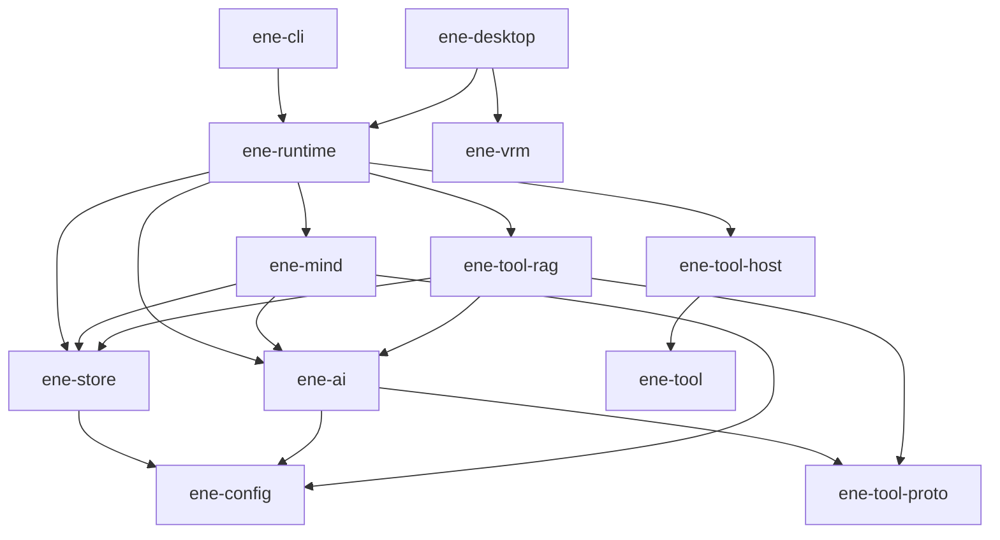

# ADR: API v1 — 機能再設計

- **Status:** Accepted
- **Date:** 2026-07-13

## 背景

ene は最小ホスト契約と明確なクレート所有を公開する: 準備済み `EneHandle::open` ライフサイクル、必須 `TurnId` 相関、最小チャットイベントバス、オプトイン診断、正しいクレートが所有するポリシーノブ（永続化は `store.*`、recall/write/decay/emotion/performance は `mind.*`）。

## ロック済み決定

### ホスト / ターン識別

1. **`TurnId` は必須。** `run(input) -> Result<TurnId, Busy | ActorDead>`。ターンスコープのイベントと `cancel(turn)` はその id を運ぶ。
2. **並行性:** single-flight。ターン実行中の二度目の `run` は `Busy` — 暗黙 abort や broadcast だけの相関はしない。
3. **ライフサイクル:** `EneHandle::open(config, card) -> Result<ReadyHandle, _>`。設定ファイル I/O は `ConfigStore` / `ene-config` 側。
4. **`Terminal` はチャット経路のターン完了**を意味する（会話履歴のコミットと同期 `finalize_turn`（affect 永続化）の後）。LLM 記憶抽出（`write_memories`）、自然忘却、ポストターン affect **分類**は `Terminal` 後の fire-and-forget であり、Done を遅らせたりターンゲートを占有してはならない。

### イベント

5. **チャット `EneEvent` は最小:** `TextDelta`、`Performance`、対話ゲート（`PermissionRequired` / `UserInputRequired`）、必要なら tool start/result、`Terminal`、`StatusChanged`、任意の薄い `ContextCompressed`。
6. **診断はオプトイン:** `PipelinePhase`、`PipelineMetrics`、arbiter/compression 詳細は `handle.diagnostics()`。
7. **`EneDiagnostics`** はハンドル上の具象 facade — UI がトレイトを実装しない。

### プロバイダ（`ene-ai`）

8. **`EmbeddingProvider`:** トレイト上は batch メソッド一つ。単一テキスト / query embed は convenience。HyDE / rerank は mind または tool-host の pipeline ステップ。

### クレートマップ

| クレート | 役割 |
|---|---|
| `ene-runtime` | ホスト / アクターファサード |
| `ene-mind` | 認知エンジン + セッション |
| `ene-store` | 永続化 |
| `ene-ai` | LLM + 埋め込みプロバイダ |
| `ene-tool` | ツール ABI ファサード（`ene-tool-proto` + `ene-tool-common` + `ene-tool-derive`） |
| `ene-tool-db` | ツールバイナリ用 IPC CRUD クライアント → `ene-runtime` の `DbIpcServer`；依存は `ene-tool-proto` のみ |
| `ene-tool-host` / `ene-tool-rag` / `ene-config` / `ene-vrm` | ツールオーケストレーション、Tool RAG、設定、VRM レンダリング |

### 依存ルール

- `ene-mind` ↛ `ene-runtime` / `ene-tool-host`
- `ene-store` ↛ `ene-ai` / `ene-mind`（LLM・埋め込みプロバイダなし）
- `ene-tool` ↛ runtime / mind / store
- `ene-tool-host` ↛ `ene-ai` / `ene-store` / `ene-mind` — Tool RAG は `ene-tool-rag` に配置
- `ene-tool-rag` は `ene-ai`（埋め込み、HyDE、rerank）+ `ene-store`（永続ツール埋め込み）に依存
- **`PerformanceCue` は `ene-mind` 所有**；runtime が再エクスポート；**`ene-vrm` は mind/runtime に依存しない**

### 設定所有

- Store 側: `store.enabled` + `store.db_path` のみ
- recall / write / decay / MMR / emotion / performance はすべて `mind.*`
- JSON 破損: CLI は fail-hard（`ConfigStore::try_load`）；desktop のみ必要なら `ConfigStore::load` の soft-fallback

### 関連契約

- [#119](https://github.com/pexisgle/ene/issues/119) Memory — ledger が唯一の SoT；store に embedder なし
- [#126](https://github.com/pexisgle/ene/issues/126) Performance — `PerformanceCue` は mind；明示 `perform` なしに `CueSource::Host` は置かない
- [#135](https://github.com/pexisgle/ene/issues/135) Tools — name 衝突は全レジストリ層で hard error；wire / host トレイト分離；`ToolSpec` は LLM 向けのみ（`name`, `description`, `parameters`）、内部 RAG フィールドは `#[doc(hidden)]` + `#[serde(skip)]`
- [#138](https://github.com/pexisgle/ene/issues/138) IPC — 9 request / 7 response バリアント；`UserInput` は `ToolError` 経由で送出

## 目標依存グラフ



チャットは `store.enabled=false` でも動作する（SQLite メモリなし）。メモリ機能（recall / spans / 型付きメモリ）には `store.enabled=true` と設定済み embedder が必要。

## ホスト契約（要約）

```rust
EneHandle::open(config, card) -> Result<EneHandle, EneRuntimeError>;
handle.run(input) -> Result<TurnId, RunError>; // Busy | ActorDead
handle.cancel(turn: &TurnId) -> Result<(), CancelError>;
handle.subscribe() -> EneEventReceiver;
handle.decide_permission(...);
handle.submit_user_input(...);
handle.shutdown(timeout).await;

handle.diagnostics() -> &EneDiagnostics;
```

### チャット `EneEvent`

| バリアント | 備考 |
|---|---|
| `TurnStarted { turn, origin }` | プロバイダーストリーム開始後 |
| `TextDelta { turn, origin, delta }` | marker 除去済み |
| `Performance { turn, origin, cues, source }` | UI 向けアバターキュー |
| `ToolCallStart` / `ToolCallResult` | UI 用に任意；`PublicChatEvent` では引数をマスク |
| `ToolBackgroundCompleted` | 遅延ツール完了（`Terminal` 後でも可） |
| `PermissionRequired` / `UserInputRequired` | ゲート |
| `ContextCompressed { turn, origin, level }` | 薄い信号；詳細は diagnostics |
| `Terminal { turn, origin, reason }` | ターン完了（`run` ごとに正確に1回） |
| `StatusChanged { status }` | Idle / Running / Error |

ターン範囲の多くは `origin`（`User` \| `Proactive`）を持ちます。

外部 JSON は内部 enum ではなく `ene_runtime::PublicChatEvent`（[`schemas/`](../api/schemas/)）を使います。

診断専用（チャットバス外）: `PipelinePhase`、`PipelineMetrics`、`ActorPanic`、
`ToolHealth`、`ProviderHealth`、`ProviderFallback`、`MemoryWrite`、`Lagged`、
`ResyncNeeded`。

## API バージョニングと互換性

- **`API_VERSION = "1"`**（`ene_runtime::API_VERSION`）がホスト/イベント契約を識別します。
- **安定面:** `EneHandle` ライフサイクル、チャット `EneEvent` 意味論、
  `PublicChatEvent` JSON、`DiagnosticEvent` の status 文字列、
  `docs/reference/api/schemas/` のスキーマ。
- **非公開:** `streaming`、`message_builder`、生 DB ハンドル、その他
  `#[doc(hidden)]` モジュール。
- **加算的変更**（無視可能な新フィールド/バリアント）は `API_VERSION` を上げません。
- **破壊的変更**はメジャーバンプと ADR 更新が必要です。
- **秘匿:** `PublicChatEvent::from_ene_event` はツール引数と明らかな秘密をマスクします。
- **背圧:** オーバーフロー時は `Lagged` を返し、あわせて
  `DiagnosticEvent::Lagged` + `ResyncNeeded` を発行します。スナップショットで再同期してください。

## エラーと非同期の規約

- I/O および oneshot actor 応答: tokio 上の `async fn`
- fire-and-forget（`run`、`cancel`、ゲート）: sync channel send
- クレートごとに公開 `thiserror` 列挙を一つ；ライブラリ境界に `anyhow` / 生 `String` / `Box<dyn Error>` なし
- テスト以外で `unwrap` / `expect` なし
- ブロードキャストの `Lagged` / `Closed` を無視しないこと

## 参照

- [認知ランタイム ADR](cognitive-runtime.md)
- [API Index](../api/index.md)
- [API スキーマ](../api/schemas/README.md)
- [ストリーミングイベント](../runtime/streaming-events.md)
- [`ene-runtime` APIリファレンス](../api/ene-runtime.md)
