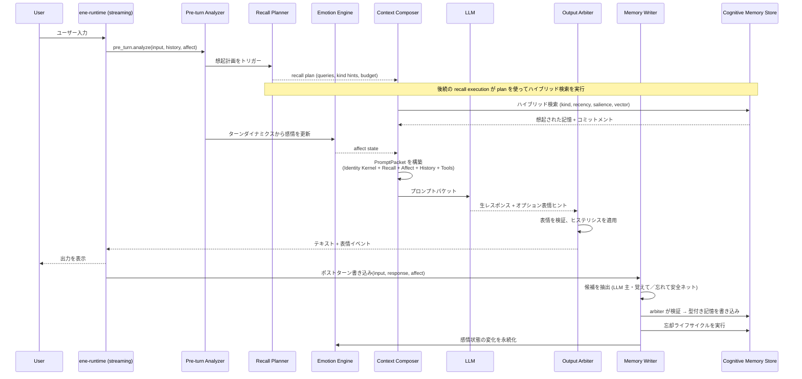

# ADR: Ene Cognitive Runtime アーキテクチャ

- **ステータス:** Accepted
- **日付:** 2026-06-28

## 背景

Ene の認知ランタイムは、LLM を明示的に管理された状態（アイデンティティカーネル、型付き記憶、感情、パフォーマンスキュー、コンテキスト予算、コミットメント台帳）の上で発話を生成するエンジンとして扱う。ターンパイプラインは `ene-mind`、ストリーミング統合は `ene-runtime`、永続化は `ene-store` が担う。

## 決定

**Ene Cognitive Runtime アーキテクチャを採用する。** LLM を「人格と記憶を暗黙に保持する主体」としてではなく、**Ene が管理する明示的な認知状態から自然な発話を生成するエンジン**として扱う。

Ene が明示的に管理するもの：
- Identity Kernel（人格核）
- Typed Memory（型付き記憶、ライフサイクル付き）
- Semantic Character Memory（CCv3 lorebook の意味記憶化）
- Context Compression（文脈圧縮）
- Recall Planning（想起計画）
- Affect / Mood / Relationship State（感情・気分・関係性状態）
- Expression Arbitration（表現調停）
- Memory Writing（記憶書き込み）
- Context Budget Management（文脈予算管理）
- Companion Task Ledger（コンパニオンタスク台帳）

## クレート責務分離

| コンポーネント | クレート | 責務 |
|---|---|---|
| Identity Kernel | `ene-mind::character` | CCv3 を不変の人格定義ブロックにコンパイル。常にプロンプト最上位に配置 |
| Typed Memory Store | `ene-store` | 型付き記憶の CRUD + ハイブリッド検索（kind, confidence, recency, salience, vector） |
| Memory Extraction (決定論的) | `ene-mind::memory_writer` | 明示的な覚えて／忘れて安全ネット + LLM 失敗時フォールバック（ソフトシグナルは LLM のみ） |
| Memory Extraction (LLM) | `ene-mind::memory_writer` | 重要度・種別選定を含む主経路の `MemoryCandidate` 生成 |
| Memory Arbiter | `ene-mind::memory_writer` | 候補を既存記憶と照合し、信頼度計算・重複排除・矛盾解決 |
| Recall Planner | `ene-mind::recall` | 検索意図と予算ヒントを含む `RecallPlan` を生成し、後続の recall execution に渡す |
| Hybrid Search Scoring | `ene-store` | vector 類似度 + recency + salience + confidence + affect + commitments の多要素スコアリング |
| Emotion Engine | `ene-mind::emotion` | 会話ダイナミクスからの決定論的感情計算 + オプション LLM 分類器 |
| Expression Arbiter | `ene-mind::output` | `AffectState` をキャラクター表情にマッピング。ヒステリシスと設定制約を適用 |
| Context Budget Manager | `ene-mind::context` | `PromptPacket` の各セクションにトークン予算を割り当て |
| Context Compression | `ene-mind::context` | 古い会話ターンを記憶スパンに圧縮する rolling compression |
| PromptPacket Composer | `ene-mind::prompt_packet` | セクション化されたプロンプトパケットを構築 |
| Companion Commitment Ledger | `ene-mind::commitments` | コンパニオンが行った約束・タスク・フォローアップを追跡 |
| Conversation History | `ene-mind` | ターン履歴の管理。セッション分割は圧縮トリガーに段階的に置き換え |
| Streaming Integration | `ene-runtime` | 全ターンライフサイクルの統合とイベント発行 |

### 依存ルール

- `ene-mind` は `ene-store`, `ene-config`, `ene-ai` に依存する
- `ene-mind` は `ene-runtime` / `ene-tool-host` に依存しない（循環依存防止）
- `ene-runtime` は `ene-mind` に依存し、`ene-runtime::streaming.rs` で mind ランタイムを統合する。store/embedder 前提条件が欠ける場合は型付きエラーでフェイルクローズする
- `ene-store` は引き続き `sea-orm` SQLite 操作の排他的所有者。抽出・調停・想起計画のロジックは `ene-mind` に置く
- `ene-store` は `ene-ai` / `ene-mind` に依存しない
- `ene-vrm` は `ene-mind` / `ene-runtime` に依存しない

## ターンライフサイクル

### ライフサイクルステップ

1. **Pre-turn Analysis** — ユーザー入力・現在の感情状態・最近の履歴を評価し、ターンの意図・感情トーン・記憶検索ニーズを決定する。
2. **Recall Planning** — 検索クエリ・記憶種別フィルタ・トークン予算ヒントを含む `RecallPlan` を生成。後続の recall execution が plan を使って型付き記憶ストアに対してハイブリッド検索を実行。
3. **Emotion Update** — ターンダイナミクス（ユーザー感情・トピック価・関係性の手がかり）から新しい `AffectState` を計算。以前の感情に減衰を適用。
4. **Context Composition** — `PromptPacket` をセクション化された層で構築: Identity Kernel → Recalled Memories → Commitments → Affect State → Scene → Style Examples → History → Current Input。
5. **LLM Generation** — `PromptPacket` を LLM プロバイダに送信。LLM はオプションで表情ヒントを提供できる。
6. **Output Arbitration** — 感情+レスポンスをキャラクター表情にマッピング。表情のちらつきを防ぐヒステリシスを適用。
7. **Post-turn Writing** — LLM 抽出を主経路とする。決定論的 matcher は明示的な覚えて／忘れてのみ（覚えては LLM 成功時ヒント、忘れては常に安全ネットとして Arbiter へ）。LLM 失敗・空・無効時は覚えてパターンと設定付きツール接地フォールバックを適用。Memory Arbiter が既存記憶と照合し、信頼度を計算してストアに書き込む。
8. **Forgetting Lifecycle** — 減衰曲線に従って既存記憶を経年処理。`ForgettingLifecycle::apply` で `active → faded → archived` のステータス遷移を管理。ユーザーの明示的忘却（`user_deleted`）と矛盾解決（`disputed` / `superseded`）は Memory Arbiter が担当。

## 主要用語

### Identity Kernel（人格核）
CCv3 キャラクターカードから `ene-mind::character::CharacterCompiler`（#82）がコンパイルする不変の人格定義ブロック。常に prompt packet の最上位に配置。構造化ヘッダー行（名前・役割・コア人格・話し方・ hard instruction）と、`system_prompt` / `description` / `scenario` / `creator_notes` 由来の任意セクションを含む。CBS マクロはコンパイル時に展開。**コアヘッダー行は truncate しない**。任意セクションは `mind.character.identity_kernel_max_tokens` を尊重。

### CCv3 意味記憶（#83）
`character_book` エントリは `MemoryKind::Semantic` / `MemorySource::Ccv3` の typed memory として `ccv3:lorebook:*` の安定 `source_ref` で index 化。constant エントリは pinned。キートリガーは保存 **content** の先頭に `Triggers: …` として含まれる（タイトルではない）。`CognitionEngine::sync_character_memories` がカード変更時に reindex し、削除されたエントリは archive、同一 `source_ref` で内容が変わった行は **supersede** して再埋め込みする。

### スタイル例检索（#84）
`mes_example` チャンクは `ccv3:style:*` procedure memory として index 化され、ターン intent に応じて最大 2 件選択。`## Style Examples` セクション（`style_example_budget_tokens`）に注入され、overflow 時は kernel を触らず drop 可能。

### Typed Memory（型付き記憶）
明示的な `MemoryKind` を持つ記憶：
- **Episodic**（エピソード記憶）— 特定の出来事・会話
- **Semantic**（意味記憶）— 事実・知識
- **Procedural**（手続き記憶）— ハウツー知識、アクションに対するユーザー好み
- **Preference**（選好記憶）— ユーザーの好き嫌い・特性
- **Relationship**（関係性記憶）— ユーザーとコンパニオンの関係に関する情報
- **Commitment**（コミットメント記憶）— 約束・タスク・フォローアップ

### MemoryStatus（記憶状態）
記憶のライフサイクル状態：
- `active` — 現在関連性があり、検索可能
- `faded` — 減衰したが、より低い優先度で検索可能
- `archived` — 通常の想起では表示されないが保存されている
- `superseded` — 新しい矛盾する記憶に置き換えられた

### AffectState（感情状態）
以下の次元を持つ永続的な感情状態：
- **Valence**（快 — 不快）
- **Arousal**（興奮 — 鎮静）
- **Dominance**（支配 — 服従）
- **離散感情**（喜び、悲しみ、怒り、恐れ、驚き、中立など）各感情ごとの強度付き

### PromptPacket（プロンプトパケット）
各セクションが独立したトークン予算を持ち、Context Budget Manager によって管理されるセクション化されたプロンプト構造：
1. Identity Kernel（常に最初、決して切り詰めない）
2. Style Examples（CCv3 `mes_example` からのスタイル例）
3. Recalled Memories（想起された記憶）
4. Active Commitments（アクティブなコミットメント）
5. Current Affect State（現在の感情状態）
6. Conversation History（直近 N ターンの会話履歴）
7. Expression PHI（`build_expression_phi` — 感情プロトコル + カード post-history instructions）
8. Current User Input（現在のユーザー入力）

> **既知の制限:** CCv3 lorebook の `selective` / `secondary_keys` / `position` は現時点では cognitive runtime で解釈されない。

### RecallPlan（想起計画）
Recall Planner が生成するクエリ計画：
- 検索クエリ（自然言語 + 埋め込み）
- 記憶種別フィルタ（後続 recall execution 向けの hint）
- 想起コンテンツに割り当てられたトークン予算
- vector similarity threshold、minimum total score、recency half-life、optional query affect などのハイブリッド検索ヒント

後続の recall execution は `MemoryStore::search` の結果を `RecallResultMapper::map` または `RecallPlanner::explain_results` 経由で、主 `RecallReason` と score breakdown 付きの `RecalledMemory` に変換し、debug / UX / prompt introspection に使う（#74）。

hybrid search の後に決定論的 MMR 多様化 stage（`MemoryDiversifyPipeline`）が実行されます。近傍重複クラスタのマージ、greedy MMR 選択、kind 別 minimum slot の確保、recall source 多様性ボーナスを行います。hybrid スコアは変更されません（#78）。

### Expression Arbiter（表現調停器）
現在の `AffectState`、オプションの LLM 表情ヒント、キャラクター表情定義を受け取り、解決された表情を出力する：
- **ヒステリシス** — 急激な表情変化を防止（秒単位で設定可能）
- **アドバイザリモード** — 設定時、LLM ヒントはコマンドではなく提案として扱われる

### Memory Arbiter（記憶調停器）
`ene-mind::memory_writer::arbiter` にあり、記憶抽出器と型付き記憶ストアの間に位置する。各 `MemoryCandidate` に対して追跡可能な判断を返す：

| 判断 | 条件 |
|------|------|
| `Persist` | 検証を通過し、矛盾・重複がない |
| `Ignore` | 低信頼度、無効フィールド、完全一致/意味的重複、削除対象なし |
| `Supersede` | 新しい根拠が既存記憶を置き換える（トランザクションで insert + 旧行を `superseded` に） |
| `MarkDisputed` | 弱い矛盾 — 既存記憶をユーザー確認用にフラグ |
| `MarkUserDeleted` | ユーザーの削除要求が既存記憶にマッチ |
| `AskConfirmationLater` | 曖昧な矛盾 — ユーザー確認まで保留 |

検証ゲート：
- `MindMemoryConfig::min_confidence_to_persist`（デフォルト `0.65`）
- title/content が非空
- `source_quote` がターン内テキストに含まれる（tool result 由来の procedure 記憶で `source_quote` が空の場合は例外）
- 削除候補には `deletion_target_key` が必須

重複排除は正規化した完全一致を先に適用し、オプションの意味的マッチ（ベクトル検索結果）で近傍重複の統合や supersede/dispute を行う。

### Tool Result Grounding

ツール呼び出し結果を安全に typed memory へ接続する:

- `ene-runtime::streaming::perform_tool_executions` が各呼び出しごとに境界付き `ToolResultSummary` を生成する。
- `ene-mind::memory_writer::tool_grounding` が生の出力を sanitize/truncate（`max_summary_chars`）し、スクリーンショット payload などの巨大データをそのまま保存しない。
- LLM 抽出がターンを担当するときは、**同じ**抽出呼び出しでツール結果の要否も判断する（会話文脈 + ソフトヒント）。日常的な成功結果は自動永続化しない。
- 決定論的ツールグラウンディングは、成功呼び出しを `Procedure`、失敗呼び出しを `Reflection`、短いユーザー可視の成功を適切な場合に `Episodic` として永続化する。
- cognitive streaming path がターン単位の `tool_results` を `PostTurnInput` に渡し、候補が残った場合に Memory Writer / Arbiter が `tool:` プレフィックス付き `source_ref` で永続化できる。

### Companion Commitment Ledger（約束・タスク台帳）

「次回これを話そう」などの約束・未完了事項は、汎用 typed memory の recall スコアとは独立した `commitments` テーブルで管理する。

| 概念 | 所在 |
|------|------|
| ドメイン型（`Commitment`, `CommitmentStatus`） | `ene-store` |
| 永続化（`insert_commitment`, `list_active_commitments` など） | `ene-store::MemoryStore` |
| Arbiter 結果からの同期 | `ene-mind::commitments::CommitmentLedger` |

**`MemoryKind::Commitment` との関係:** 抽出器は `MemoryCandidate { kind: Commitment, commitment_due }` を生成する。`CommitmentLedger::apply_commitment_candidates`（または `arbitrate_apply_and_sync`）が active な ledger 行を ledger-first で書き込む。任意の型付き `MemoryKind::Commitment` 行は `typed_memories.commitment_id` で台帳を参照できる。

**ライフサイクル:** `active` → `done` | `cancelled` | `stale`。`due_at` が設定され期限切れの active 行は `mark_stale_commitments` で `stale` に遷移できる。

**プロンプト注入:** active commitment は `list_active_commitments` / `CommitmentLedger::active_prompt_candidates` でベクトル類似度に関係なく取得され、常に `PromptPacket` の Active Commitments セクション候補になる。

### Context Compression（文脈圧縮）

古い会話ターンをコンパクトな記憶スパンに要約する rolling compression。セッション ID は変わらず会話の継続性を保つ。

## 参照

- [アーキテクチャ概要](overview.md)
- [記憶システム](../memory/memory.md)
- [プロンプト構築](../runtime/prompt.md)
- [セッション分割](../runtime/session-split.md)
- [感情処理](../runtime/emotions.md)
