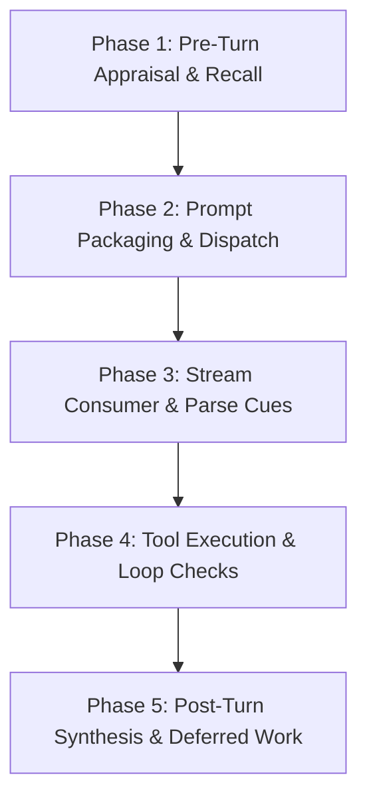

# 会話ループとストリーミング仕様 (`streaming`)

`streaming` は、LLM によるストリーミング対話応答ループのライフサイクル全体を制御し、バックグラウンドでのメモリ想起、プロンプトの構築、ツール実行、および表情ブレンドシェイプ変化の判定を調整します。

---

## 1. コアストリーミングインターフェース

#### `run_stream`
*   **シグネチャ**: `pub async fn run_stream(session: &mut ConversationSession, mind: &CognitionEngine, config: &EneConfig, input: UserInput, event_tx: EneEventSender) -> Result<TurnReport, EneError>`
*   **説明**: ストリーミング対話ループを開始するためのトップレベルのエントリーポイントです。

---

## 2. 5段階の認知パイプライン (`run_stream_cognitive`)

非同期ストリーミングターン処理の実体は `run_stream_cognitive` 内で実行され、5つのフェーズで構成されています：

### 1. Phase 1: Pre-Turn Appraisal & Recall (ターン前処理とメモリ想起)
*   **プロセス**:
    1.  `CognitionEngine::before_turn` を呼び出します。
    2.  直近のユーザーメッセージの埋め込み（Embedding）ベクトルを計算します。
    3.  `execute_hybrid_recall` をトリガーし、ベクトル類似度検索と SQLite の全文検索を組み合わせたハイブリッドメモリ検索を実行します。
    4.  アクターの感情パラメータを更新し、前回のターンで保留されていた感情プロポーザルをマージします。

### 2. Phase 2: Prompt Packaging & Dispatch (プロンプト生成と送信)
*   **プロセス**:
    1.  `build_messages` を使用して最終プロンプトメッセージ配列をパックします。
    2.  設定されている LLM プロバイダ（クラウド OpenAI またはローカル Llama.cpp インフラ）にメッセージ配列を送信します。
    3.  チャネルイベントリーダー用の `LlmResponseChunk` トークンストリームを取得します。

### 3. Phase 3: Stream Consumer & Parse Cues (ストリーム処理とアニメーション解析)
*   **プロセス**:
    1.  LLM から返されるストリーミング応答トークンを受信します。
    2.  受信した未処理の文字列フラグメントを `split_text_and_special_tokens` に送り、対話プレーンテキストと表情制御タグ（`<|perf:expr=...|>` など）を分離します。
    3.  プレーンテキストフラグメントをただちに `EneEvent::TextDelta` イベントとしてクライアント UI に送信します。
    4.  表情制御タグが見つかった場合は `parse_performance_marker` を呼び出して `EneEvent::Performance` を発行し、クライアントのアバターにアニメーションをトリガーします。

### 4. Phase 4: Tool Execution & Loop Checks (ツール実行と制御ループ)
*   **プロセス**:
    1.  トークンの中に LLM のツール呼び出し（Function Calling）命令が含まれているか検出します。
    2.  ツール実行が検出された場合、`select_relevant_tools` を呼び出して対象ツールのスキーマ設定を検証します。
    3.  `perform_tool_executions` をトリガーし、サンドボックス保護されたサブプロセス（または外部の MCP サーバー）にコマンド要求を転送します。
    4.  ツールから返された実行結果をコンテキスト履歴に追加し、Phase 2 に戻って再度の LLM 推論を実行します（最大ツール実行ループ限界まで繰り返し）。

### 5. Phase 5: Post-Turn Synthesis & Deferred Work (ターン後処理とバックグラウンドタスク)
*   **プロセス**:
    1.  ストリーミング応答の終了を検知すると、生成された対話テキストの全文を `ConversationSession::add_assistant_message` を使用して対話履歴に追加します。
    2.  `CognitionEngine::finalize_turn_post` を実行して、対話履歴ログ（会話ログ）を SQLite に保存し、感情座標の変化を更新します。
    3.  バックグラウンドタスク（`write_memories_deferred`）を非同期でスケジュールし、LLM による会話からのメモリ（事実）の抽出と、アクセス頻度に基づくメモリの自然忘却処理（減衰）を実行します。

---

## 3. ヘルパー関数仕様

#### `select_relevant_tools`
*   **シグネチャ**: `fn select_relevant_tools(session: &ConversationSession, specs: &[ToolSpec], query: &str) -> Vec<ToolSpec>`
*   **説明**: 登録されているツールの中から、ユーザーの直近のクエリ文脈に関連するツールのスキーマ定義を選択します。

#### `perform_tool_executions`
*   **シグネチャ**: `async fn perform_tool_executions(session: &mut ConversationSession, calls: &[ToolCall]) -> Result<Vec<ToolResult>, EneError>`
*   **説明**: 検出されたツール呼び出しリストを受け取り、サンドボックス境界を確認しながら、ローカルのツールプロセスまたはリモート MCP サービスを非同期で実行し、戻り値を収集して返します。
